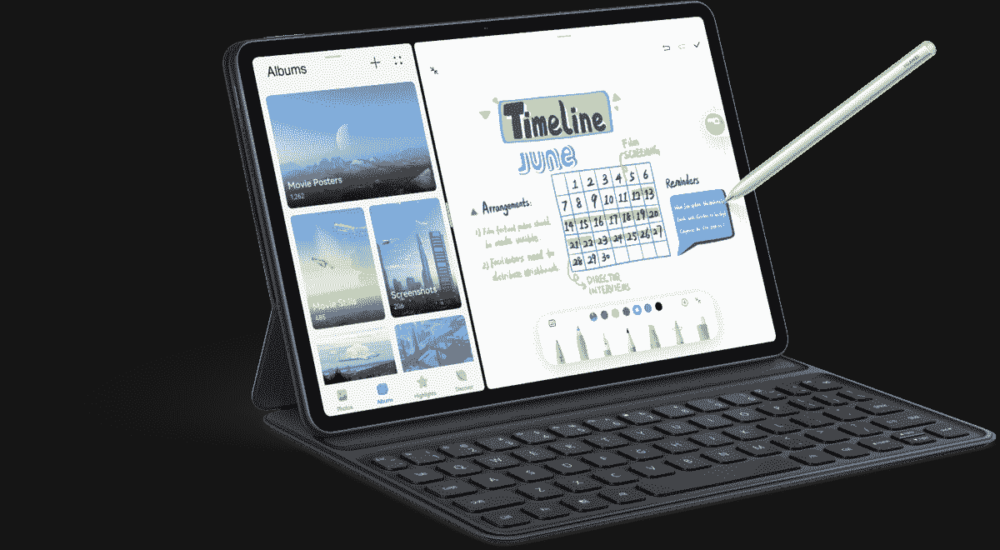

# 华为 MatePad 11 评测:一款可以做很多事情的平板电脑

> 原文：<https://www.xda-developers.com/huawei-matepad-11-review/>

自美国实施贸易限制以来，华为在过去几年中不得不重新构想其商业战略。我们已经看到该公司更加倾向于可穿戴设备业务，同时也更加深入平板电脑领域。今年早些时候，我们看到了华为 MatePad Pro 的到来，这是一款我非常喜欢的平板电脑，旁边还有华为 MatePad 11。对于不同的人来说，这是两种非常不同的平板电脑，虽然 MatePad 11 肯定是两者中较弱的一个，但我敢打赌，一些人可能会更喜欢它。

***关于本次评测:**华为全球 10 月份给我们发来了华为 MatePad 11 进行评测。该公司对此次审查的内容没有任何意见。*

| 

规格

 | 

华为 MatePad 11

 |
| --- | --- |
| **尺寸&重量** | 

*   286.5 x 184.7 x 6.7mm 毫米
*   609 克

 |
| **显示** | 

*   10.95 英寸液晶显示器
*   2560 x 1600 分辨率
*   120 赫兹刷新率

 |
| **SoC** | 

*   高通骁龙 865 足球俱乐部
    *   1 个 Kryo 585 @ 2.84GHz
    *   3 个 Kryo 585 @ 2.42GHz
    *   4x Kryo 585 @ 1.80GHz

 |
| **闸板&存放** | 

*   6GB 内存
*   64/128GB 存储空间
*   可通过 microSDXC 卡扩展

 |
| **电池&充电** | 

*   7250 毫安时
*   22.5W 有线快速充电
*   5W 反向有线充电

 |
| **安全** | 侧装式指纹扫描仪 |
| **后置摄像头** | 初级:1300 万像素，f/1.8 |
| **前置摄像头** | 800 万像素 f/2.0 |
| **端口** | USB 类型-C |
| **连通性** | 

*   无线网络 6
*   蓝牙 5.0
*   802.11 a/b/g/n/ac 双频 WiFi
*   GPS，GLONASS，北斗，伽利略

 |
| **软件** | 鸿蒙系统 2.0(基于安卓？) |
| **音频** | 4 个扬声器 |
| **配件** | 

*   华为 M-Pencil 支持
*   智能磁性键盘(可选)
*   鼠标支持

 |

## 华为已经确定了它的平板电脑设计

如果有什么东西是我认为华为每次都在变得完美的，那就是平板电脑设计。

如果有什么东西是我认为华为每次都在变得完美的，那就是平板电脑设计。他们的每款平板电脑的设计都经过深思熟虑，长时间使用都很舒适，华为 MatePad 11 也不例外。显然，设计一个玻璃板*错*有点难，但华为总是在这个部门交付。在横向模式下使用平板电脑时，显示屏上方和下方分别有一个前置摄像头和一个通知 LED。

不过，华为 MatePad 11 的主要焦点是它的显示屏，它有一个漂亮而明亮的 10.95 英寸 IPS 面板。它主要针对内容消费，120Hz 的刷新率非常适合滚动菜单。如果你也对游戏感兴趣，兼容游戏将能够利用更高的刷新率。请记住，一个好的 LCD 可能比一个好的 OLED 面板更好，但显然，有些人只是喜欢 OLED 面板上关闭像素的逼真黑色。

华为 MatePad 11 有四个扬声器，每侧两个，一个 USB-C 端口和一个微型 SD 卡扩展槽。这里没有耳机插孔，这对于一个更注重内容的平板电脑来说似乎是错误的，尽管耳机插孔似乎越来越罕见了。最后，背面有一个双摄像头设置。

华为 MatePad 11 在内容消费方面表现惊人，尤其是观看 Twitch 流。当你最喜欢的应用不在公司自己的 AppGallery 上时，处理这种情况可能会有点令人沮丧，但这比以前好得多，而且有办法解决这个问题。例如，我在 MatePad 上使用了 [NewPipe](https://newpipe.net/) ，因为它是 YouTube 的免费开源替代品，可以有效地充当具有额外功能的网页包装器。这是一款观看电影、电视节目和 YouTube 的绝佳平板电脑。

新的 MatePad Pro 还可以无线连接到华为笔记本电脑，用作第二显示屏，[，它与 MatePad 16](https://www.xda-developers.com/huawei-matebook-16-review/) 配合得出奇地好。必要时，平板电脑甚至可以用作触摸板，如果你愿意，还可以通过它代替笔记本电脑的扬声器播放音频。

## AppGallery 继续改进

我发现 AppGallery 最大的问题是缺少应用程序。YouTube 应用程序安装后就可以运行(尽管你无法登录，因为它依赖于 Google Play 服务)，而 Twitch 等应用程序只能通过第三方 APK 网站下载。虽然该公司的花瓣搜索做了艰苦的工作，为你找到 APK 文件安装，有一些令人惊讶的遗漏。除了 Twitter Lite 之外，没有其他 Twitter 应用程序(出于某种原因，甚至连花瓣搜索都不能使用 surface one)，显然，你安装的应用程序也不会自动更新。如果你不去下载你最喜欢的应用程序，你可能会错过它们。

我发现 AppGallery 最大的问题是缺少应用程序。

话虽如此，最近还是增加了一大堆更主流的应用。在爱尔兰，我现在可以使用 Curve 和 Revolut 这两个非常受欢迎的金融科技应用。还有 Telegram、Booking.com 和抖音，所以它不再像过去那样是应用程序的蛮荒之地。当然，没有更大的社交媒体网站，但华为的地位比以前明显更好。对于一些用户来说，它肯定是可用的，并且还包括外卖服务、约会应用和电子商务网站的一系列选项意味着至少应该涵盖所有的基本信息。

## 鸿蒙系统作为一个概念仍然和以前一样令人困惑

当华为 MatePad Pro 发布时，我们对它与 Android 的关系感到困惑。虽然它显然可以运行 Android 应用程序，看起来像 Android，甚至可以利用 adb，但尚不清楚华为认为它是什么。在它发布的时候，我们联系了华为，这是我们得到的回应。

“为了保护现有手机和平板电脑用户的数字资产，鸿蒙系统 2 目前允许现有的 Android 应用程序在鸿蒙系统 2 的一些设备上运行，华为遵守了相关的开源许可规则。集成了 HMS Core 的 Android 应用程序可以继续在鸿蒙系统上运行。鸿蒙系统 2 是华为基于开源项目 OpenHarmony 2.0 为不同场景下使用的智能设备开发的商业版本，继承了华为在 EMUI 上的差异化能力和专有技术。Android 是基于 AOSP 开源项目开发的，而 OpenHarmony 是由 OpenAtom 基金会创建和运营的开源项目。作为其主要贡献者之一，华为希望全球更多的厂商和开发者加入到 OpenHarmony 项目中来。这样，我们都可以为开源社区的发展做出贡献，从而改善消费者的体验。“–华为发言人

在华为 MatePad 11 上打印/proc/版本的内容可以更清楚地描述这里发生的事情。这个文件为您提供了关于您正在使用的 Linux 内核发布版本、编译中使用的机器名称和主机地址、用于编译它的编译器以及编译时间的信息。从上面可以看出，它甚至*说*使用的编译器前端是 Android NDK(原生开发套件)的 Clang，Clang 是 Android NDK 支持的唯一编译器。

甚至[如果鸿蒙系统是另一个安卓分叉](https://www.xda-developers.com/harmony-os-2-0-initial-version-based-on-android/)(每天看起来越来越有可能)，我也不认为这有什么问题。从零开始制作一个操作系统不是一个小壮举，鉴于 Android 的开源性质和 EMUI 的多年工作，华为希望在此基础上进行开发是有道理的。它使用起来很舒服，充满了平板电脑的有用功能，看起来也很漂亮。我总是觉得华为不能在其产品上使用谷歌应用程序是一种耻辱，因为如果这款平板电脑能够轻松地与我习惯的所有常用应用程序和游戏集成，那将是非常棒的。

这是一款可以很好地进行媒体消费的平板电脑，如果你愿意的话，它甚至可以作为小型笔记本电脑的替代品。虽然我在这里没有拿到键盘外设进行评测，但我在 MatePad Pro 上使用了它，我发现它的效果非常好。

## 华为被困住了

华为目前的问题是——公司被困住了。在手机和平板电脑方面，华为注定只能使用高通能提供的剩余产品。它只能从高通购买 4G 芯片，不能再生产自己的海思麒麟芯片组，没有谷歌，很难在中国以外的市场销售这些产品。即使在中国，[华为的影响力也在慢慢下降](https://www.canalys.com/newsroom/china-smartphone-market-q2-2021)，这就是为什么我们近年来看到转向[优秀健身乐队](https://www.xda-developers.com/huawei-watch-fit-elegant-review/)之类的。

如果不是因为没有人人都依赖的服务这一最后障碍，华为的平板电脑有能力成为与三星抗衡的旗舰竞争者

MatePad 11 中的高通骁龙 865 是一款出色的芯片组，但当这款平板电脑推出时，它仍然过时了整整一代。如果说实话，我觉得如果华为重新启用了 bootloader 解锁，可能会帮助华为赢回发烧友社区的青睐。用户不仅可以在手机上安装任何他们想要的东西，而且在手机上安装一个谷歌应用套件来规避这个问题会容易得多。不过，不可避免地会有不热心的人尝试，他们可能不太清楚自己在做什么。

简而言之，如果不是因为没有人人依赖的服务这一最后障碍，华为的平板电脑有能力成为与三星抗衡的旗舰竞争者。我喜欢华为的平板电脑，但非常遗憾的是，在上面无法使用我真正想要的应用程序。华为移动服务的问题不仅仅是*也不是*谷歌，而是仍然有一些初期问题无法真正解决。任何使用谷歌地图 API 的应用程序实际上都不能显示地图，因为它需要这种集成。总的来说，很难将华为手机或平板电脑交给任何人*，因为它肯定不是许多消费者熟悉的安卓智能手机。它缺少了许多人对他们的设备习以为常的“*它只是工作*”因素。*

 *## 结论

鸿蒙系统和华为 AppGallery 的现状是该公司努力克服美国贸易禁令的高潮。鸿蒙系统无疑在一定程度上有助于重振其软件身份，但它并没有为华为的实际状况做很多事情。它仍然停留在追赶主流应用程序的循环中。

我认为，华为试图脱离 Android 品牌的努力只是帮助它走到了这一步。放弃 Android 品牌应该有助于它识别其他品牌，因为“Android”在更广泛的世界中被认为*需要*谷歌。如果不是安卓，那它为什么需要谷歌？尽管它制造的设备功能强大且易于使用，但我认为它的效果并不像预期的那样好。

 <picture></picture> 

Huawei MatePad 11

##### 华为 MatePad 11

华为 MatePad 11 是华为与鸿蒙系统合作的另一款平板电脑，尽管它比以前的设备更注重显示屏。这是一款 120 赫兹的 QHD 显示器，非常适合媒体使用。

我认为最大的损失是消费者。消费者想要选择，而选择推动创新，因为公司都试图超越彼此。三星 Galaxy Tab S7 Plus 很棒，但如果你想买一台安卓平板电脑，这也是它的全部。我希望有更多的竞争，但事实上没有，华为就是全部。骁龙 865 是一个强大的芯片组，这张桌子上的显示器是真正伟大的内容消费。它的分辨率为 1440p，所以对于你想在旅途中观看的任何内容来说都是完美的。

每次华为的平板电脑都是同样的故事——出色的硬件，乏善可陈的软件——这是一种可悲的状况。这款平板电脑什么都好，但很难向任何人推荐它是最好的安卓平板电脑之一。它的售价为 349.99 英镑，对于这么好的平板电脑来说是一个非常好的价格，但我认为对大多数用户来说，这不会是他们的平板电脑。*