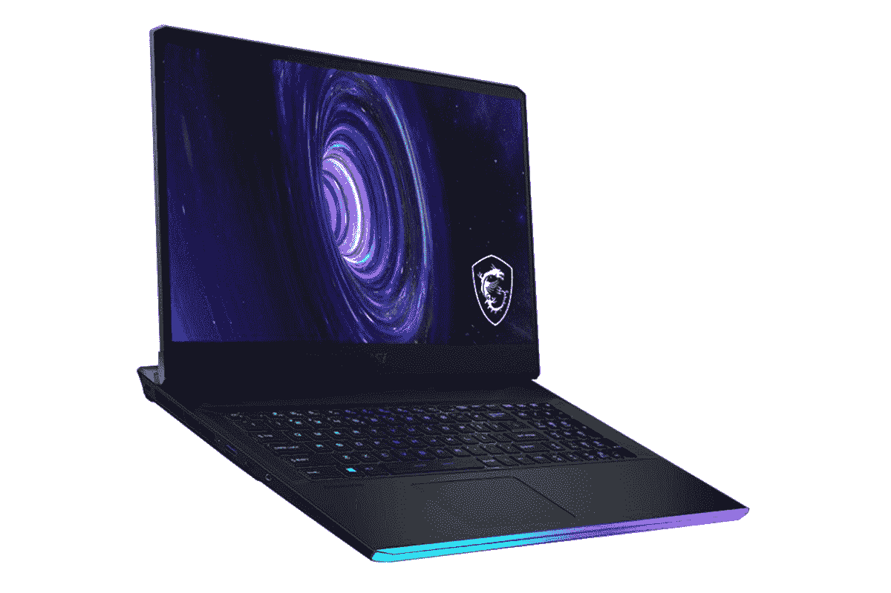
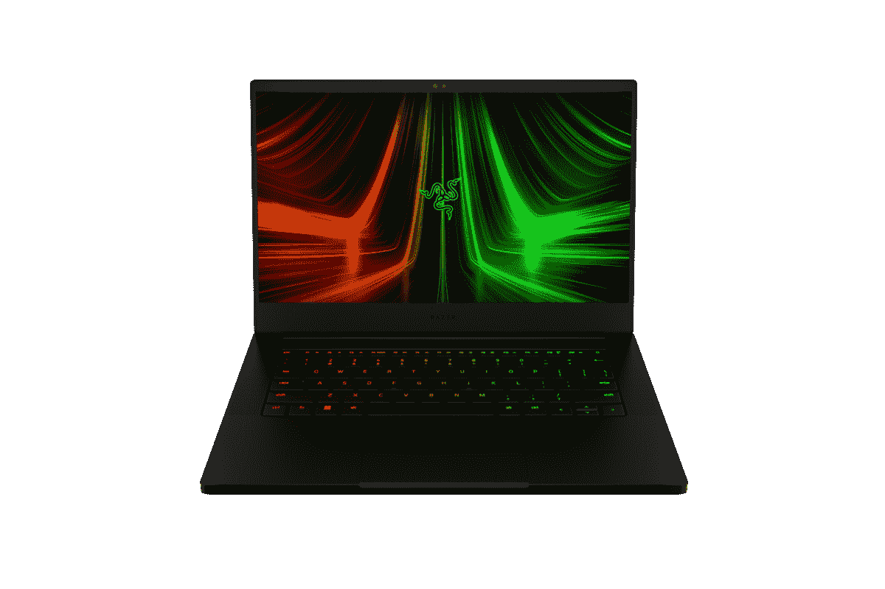
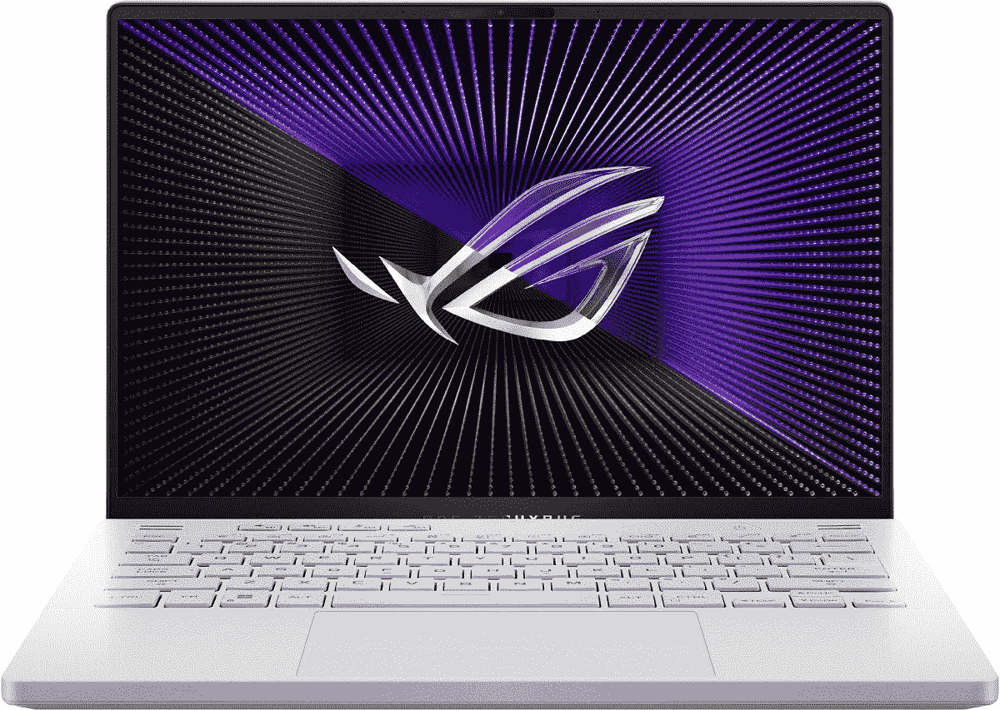

# 英特尔第 12 代 H 系列与 AMD 锐龙 6000 H 系列移动 CPU

> 原文：<https://www.xda-developers.com/intel-12th-gen-h-vs-amd-ryzen-6000/>

英特尔和 AMD 都在 CES 2022 上宣布了将驱动下一代笔记本电脑的新移动芯片，引起了巨大的轰动。在英特尔发布其新的 Alder Lake 移动芯片以及其他第 12 代台式机部件的同时，AMD 决定发布其新的用于笔记本电脑的[锐龙 6000 系列“伦勃朗”APU](https://www.xda-developers.com/amd-ryzen-6000/)。从新的英特尔芯片上的混合核心配置到 AMD APUs 中的 RDNA 2 图形核心，这些新处理器看起来非常有前途。我们已经有了一个详细的[英特尔第 12 代 P & U 系列与锐龙 6000 U 系列的比较](https://www.xda-developers.com/intel-12th-gen-p-u-vs-amd-ryzen-6000)，突出了低功耗处理器，所以如果你在英特尔和 AMD 驱动的轻薄笔记本电脑之间犹豫不决，请务必查看一下。在本文中，我们将了解英特尔第 12 代处理器与 AMD 锐龙 6000 H 系列处理器之间的一些主要差异。

**浏览这篇文章:**

## 英特尔第 12 代处理器与 AMD 锐龙 6000 H 系列处理器:内核配置差异

从顶级芯片开始，英特尔的顶级酷睿 i9-12900HK CPU 被誉为该公司有史以来最快的移动处理器。它将与搭载 **Zen 3+内核和 RDNA2 显卡**的 AMD 锐龙 9 6980HX 相抗衡。英特尔的混合架构也进入了移动芯片领域，我们预计 12900HK 将拥有 14 个内核，其中包括 6 个性能内核和 8 个效率内核。相比之下，锐龙 9 6980HX 仅限于八个内核。同样，这不是苹果之间的比较，但英特尔肯定有优势。正如我们在 [Core i9-12900HK 评测](https://www.xda-developers.com/intel-core-i9-12900hk-review/)中提到的，英特尔的性能数字非常令人印象深刻。这款移动处理器确实能够大放异彩，尤其是在搭配 MSI GE76 Raider 游戏笔记本电脑中的 GeForce RTX 3080Ti 等强大独立显卡时。

除了酷睿 i9-12900HK 之外，英特尔还在 H 系列中配备了 12900H 和其他几款酷睿 i7 移动处理器。这些是主流部件，将在许多游戏以及其他以性能为中心的笔记本电脑中广泛出现。酷睿 i9-12900H、酷睿 i7-12800H 和 12700H 都具有相同的内核配置，具有 6 个 P 内核和 8 个 E 内核。他们还获得了相同的默认**45W**的 TDP 以及**115 w**的最大涡轮功率。三者之间唯一真正的区别是频率。H 系列中没有酷睿 i3 变体**,但你会在轻薄空间中看到它，它是英特尔 P 系列和 U 系列处理器系列的一部分。**

**英特尔第 12 代 Alder Lake H 系列:**

| 

规格

 | 

英特尔酷睿 i9-12900HK

 | 

英特尔酷睿 i9-12900H

 | 

英特尔酷睿 i7-12800H

 | 

英特尔酷睿 i7-12700H

 | 

英特尔酷睿 i7-12650H

 | 

英特尔酷睿 i5-12600H

 | 

英特尔酷睿 i5-12500H

 | 

英特尔酷睿 i5-12450H

 |
| --- | --- | --- | --- | --- | --- | --- | --- | --- |
| **内核** | 14 (6P + 8E) | 14 (6P + 8E) | 14 (6P + 8E) | 14 (6P + 8E) | 10 英镑(6 便士+ 4E) | 12 (4P + 8E) | 12 (4P + 8E) | 8 (4P + 4E) |
| **线程** | 20 | 20 | 20 | 20 | 16 | 16 | 16 | 12 |
| **基频** | 2.5GHz (P 内核)&#124; 1.8GHz (E 内核) | 2.5GHz (P 内核)&#124; 1.8GHz (E 内核) | 2.4GHz (P 内核)&#124; 1.8GHz (E 内核) | 2.3GHz (P 内核)&#124; 1.7GHz (E 内核) | 2.3GHz (P 内核)&#124; 1.7GHz (E 内核) | 2.7GHz (P 内核)&#124; 2.0GHz (E 内核) | 2.5GHz (P 内核)&#124; 1.8GHz (E 内核) | 2.0GHz (P 内核)&#124; 1.5GHz (E 内核) |
| **最大涡轮频率** | 5.0GHz (P 内核)&#124; 3.8GHz (E 内核) | 5.0GHz (P 内核)&#124; 3.8GHz (E 内核) | 4.8GHz (P 内核)&#124; 3.7GHz (E 内核) | 4.7GHz (P 内核)&#124; 3.5GHz (E 内核) | 4.7GHz (P 内核)&#124; 3.5GHz (E 内核) | 4.5GHz (P 内核)&#124; 3.3GHz (E 内核) | 4.5GHz (P 内核)&#124; 3.3GHz (E 内核) | 4.4GHz (P 内核)&#124; 3.3GHz (E 内核) |
| **三级高速缓存** | 24MB | 24MB | 24MB | 24MB | 24MB | 18MB | 18MB | 12MB |
| **默认 TDP** | 45W | 45W | 45W | 45W | 45W | 45W | 45W | 45W |
| **最大涡轮功率** | 115 瓦 | 115 瓦 | 115 瓦 | 115 瓦 | 115 瓦 | 95W | 95W | 95W |
| **处理器显卡** | 96EU | 96EU | 96EU | 96EU | 64EU | 80EU | 80EU | 48EU |

再来看看 AMD 锐龙 6000 H 系列，锐龙 9 6980HX 是其中最强大的。它能够达到 5.0GHz 的**最大提升频率**，与英特尔酷睿 i9-12900HK 不相上下。6000 H 系列中的其他锐龙芯片看起来非常令人印象深刻，所有的锐龙 9 和锐龙 7 处理器都有 8 核 16 线程。虽然英特尔新的 Alder Lake H 系列处理器设法击败了旧的锐龙芯片，但新处理器的功能究竟有多强大还有待观察。

AMD 大胆宣称新的 6000 芯片提供两倍于 1080p 的游戏性能和超过 125%的 3D 渲染提升。相比之下，**英特尔的 Iris Xe 集成**显卡可能很难应对如此苛刻的工作负载。英特尔在 iGPU 部门也做了一些改进，但是我们发现它们在很多情况下还不够。我们希望在适当的时候改变，但 AMD 似乎在此期间有优势。

**AMD 锐龙 6000 系列 H 系列:**

| 

规格

 | 

AMD 锐龙 9 6980HX

 | 

AMD 锐龙 9 6980HS

 | 

AMD 锐龙 9 6900HX

 | 

AMD 锐龙 9 6900HS

 | 

AMD 锐龙 7 6800H

 | 

AMD 锐龙 7 6800HS

 | 

AMD 锐龙 5 6600H

 | 

AMD 锐龙 5 6600HS

 |
| --- | --- | --- | --- | --- | --- | --- | --- | --- |
| **核心** | 8 | 8 | 8 | 8 | 8 | 8 | 6 | 6 |
| **螺纹** | 16 | 16 | 16 | 16 | 16 | 16 | 12 | 12 |
| **基频** | 3.3GHz | 3.3GHz | 3.3GHz | 3.3GHz | 3.2GHz | 3.2GHz | 3.3GHz | 3.3GHz |
| **最大升压频率** | 5.0 千兆赫 | 5.0 千兆赫 | 4.9 千兆赫 | 4.9 千兆赫 | 4.7 千兆赫 | 4.7 千兆赫 | 4.5 千兆赫 | 4.5 千兆赫 |
| **L2+三级高速缓存** | 20MB | 20MB | 20MB | 20MB | 20MB | 19MB | 12MB | 12MB |
| **默认 TDP** | 45W | 35W | 45W | 35W | 45W | 45W | 45W | 35W |
| **GPU 计算单元** | 12 | 12 | 12 | 12 | 12 | 12 | 6 | 6 |
| **GPU 核心最大提升** | 2.4Ghz | 2.4Ghz | 2.4GHz | 2.4GHz | 2.2GHz | 2.2GHz | 1.9 千兆赫 | 1.9 千兆赫 |
| 

结节

 | 6 纳米 | 6 纳米 | 6 纳米 | 6 纳米 | 6 纳米 | 6 纳米 | 6 纳米 | 6 纳米 |

## 英特尔第 12 代处理器与 AMD 锐龙 6000 H 系列处理器:能效

对于英特尔和 AMD 来说，能效似乎是一个巨大的关注点，老实说，这是一件好事。由于 core，英特尔的混合核心架构在能效部门获得了巨大的回报，AMD 也在这一部门做出了一些重大贡献。如果你不知道，锐龙 6000 系列在其规格表中采用了**6 纳米制造工艺**，而不是**英特尔的 10 纳米**。当然，电池寿命不是超级用户考虑的重点，但这也意味着锐龙 6000 系列在处理电源方面更好，因此产生的热量也更少。一旦我们设法拿到这些笔记本电脑进行面对面的比较，我们将更详细地讨论这一点，所以请保持关注。但如果我们必须选择一个，那么我们认为 6 纳米与 10 纳米制造工艺对蓝队来说似乎是一个相当大的障碍。

## 英特尔第 12 代处理器与 AMD 锐龙 6000 H 系列处理器:内存配置和其他差异

谈到内存，英特尔的 Alder Lake H 系列处理器将允许您使用 **DDR5-4800、LPDDR5-5200、DDR4-3200 和 LPDDR4x-4267** 。然而，AMD 的锐龙 6000 系列处理器仅限于 **DDR5-4800 和 LPDDR5-6400 RAM** 。虽然这可能不会直接影响最终消费者，因为组件是由笔记本电脑原始设备制造商挑选的，但您可能很难在库存中找到 AMD 6000 系列 CPU 驱动的笔记本电脑，或者它们可能有点贵。对于存储，英特尔和 AMD 都提供了 **PCIe 4.0 连接**和一对 x4 NVMe 固态硬盘连接。这里唯一的区别是英特尔 CPU 有专用的 SATA 连接，但 AMD 使用辅助 x4 NVMe 来覆盖 SATA。该系列中的低功耗移动芯片也是如此，我们在英特尔第 12 代 P & U 系列与锐龙 6000 U 系列的比较中也提到了这一点。

AMD，你可能已经知道，不能提供**雷电 4** 。这是英特尔芯片独有的，它的支持在新的第 12 代处理器堆栈中得到了很好的体现。作为一种变通办法， **AMD 正在使用 USB4** 来允许原始设备制造商以高达 40Gbps 的带宽提供非常相似的体验。作为最终用户，你必须确保你购买的组件与 USB 4 兼容，而不仅仅是 Thunderbolt 4。不过，AMD 通过增加对 HDMI 2.1 的原生支持来实现这一点。这在英特尔芯片上是一个值得注意的遗漏，但在配备更强大的独立 GPU 的高端笔记本电脑中，这可能不是一个交易破坏者。

## 英特尔第 12 代和 AMD 锐龙 6000 H 系列:笔记本电脑上市

由英特尔第 12 代 Alder Lake 和 AMD 锐龙 6000 H 系列处理器驱动的新一代笔记本电脑现已开始在市场上出现。事实上，这些笔记本电脑随时可以从各种制造商那里买到，包括微星、华硕、雷蛇、外星人等等。我们将尽可能多地审查这些笔记本电脑，为我们的性能分析添加更多信息。与此同时，您可以看看下面的一些新笔记本电脑，了解一下这种新一代功能强大的电脑的规格。

**英特尔第 12 代 Alder Lake 笔记本电脑:**

 <picture></picture> 

MSI Raider GE76

##### 微星突袭机 GE76

微星突袭机 GE76 是首批搭载英特尔全新第 12 代处理器的笔记本电脑之一

 <picture></picture> 

Razer Blade 15 (2022)

##### 雷蛇之刃 15

Razer Blade 15 装有英特尔酷睿 i9-12900H CPU 和 RTX 3080 Ti，可为 144Hz UHD 面板供电。

**AMD 锐龙 6000 H 系列笔记本电脑:**

 <picture></picture> 

Razer Blade 14 (2022)

##### 雷蛇之刃 14

Razer Blade 14 是首批搭载 AMD 新锐龙 6000 H 系列处理器以及 Nvidia 新 RTX 3080 Ti 笔记本电脑 GPU 的笔记本电脑之一。

 <picture></picture> 

ASUS ROG Zephyrus G14 (2022)

##### 华硕 ROG 西风 G14 (2022)

华硕 ROG Zephyrus G14 是市场上首批采用新的 AMD 锐龙 6000 系列处理器的笔记本电脑之一。它还配备了新的 DDR5 内存。

## 最后的想法

考虑到所有的事情，可以肯定地说，英特尔和 AMD 都已经努力向前迈出了最好的一步，在笔记本电脑领域提供了出色的整体体验。这种对峙还远未解决，但这种比较应该会让您很好地了解这两个 CPU 系列如何为自己制造了一个令人信服的案例。我们预计 AMD 的 6000 系列处理器在集成显卡方面会表现出更好的性能，但当与强大的独立 GPU 搭配时，英特尔仍可能赢得这场战斗。

这意味着休闲游戏玩家可能仍然有很多喜欢 AMD 6000 系列芯片的地方，而英特尔可能会在以性能为中心的高端笔记本电脑领域大获全胜。如果您想了解更多关于英特尔第 12 代产品的信息，请务必访问我们的[英特尔阿尔德湖页面](https://www.xda-developers.com/intel-12th-gen-alder-lake/)。我们还专门列出了[最佳笔记本电脑](https://www.xda-developers.com/best-laptops/)，所以请密切关注，看看哪些新笔记本电脑进入了该系列。