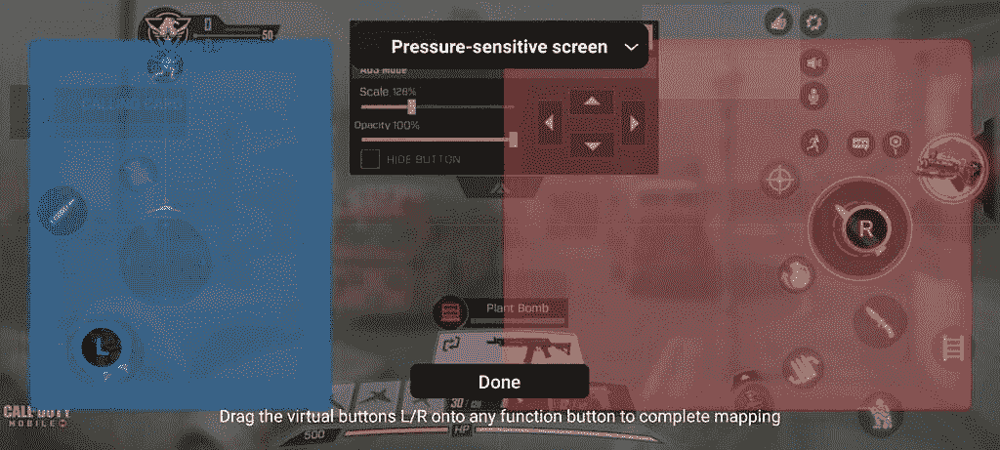
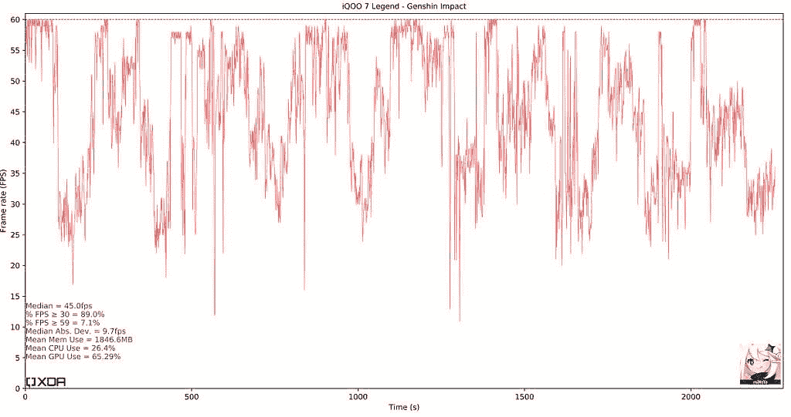
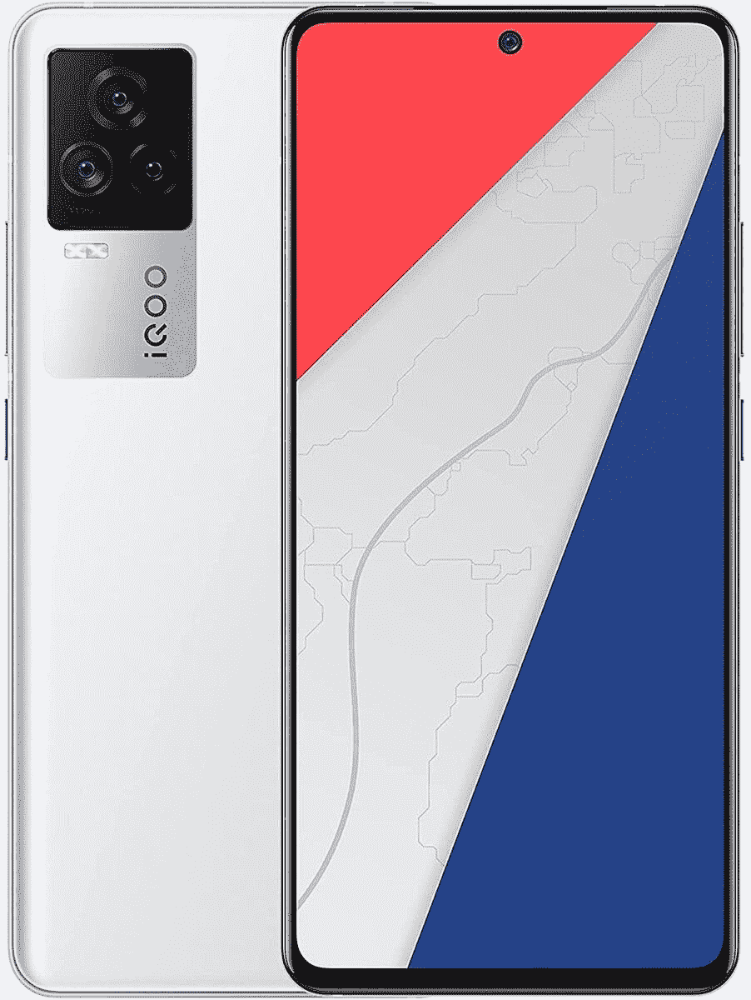

# iQOO 7 传奇回顾:价格实惠，性能一流

> 原文：<https://www.xda-developers.com/iqoo-7-legend-review/>

在中断一年后，Vivo 的子品牌 iQOO 上个月在印度发布了两款智能手机，算是卷土重来了。iQOO 7 和 iQOO 7 Legend 是该公司在印度市场对抗经验丰富的旗舰冠军的最新竞争者。虽然标准的 iQOO 7 由骁龙 870 驱动，但顶级 iQOO 7 Legend 为 2021 年的旗舰产品提供了一个很好的案例，它具有骁龙 888，120Hz AMOLED 显示屏，12GB LPDDR5 RAM，4,000mAh 电池和 66W 快速充电。它还有一些漂亮的游戏技巧，有望将您的游戏体验提升到一个新的水平。但是这个强大的硬件包在现实世界中是如何支撑的呢？

## iQOO 7 图例和 iQOO 7:规格

| 

规格

 | 

iQOO 7 传奇

 | 

iQOO 7

 |
| --- | --- | --- |
| **建造** | 

*   银磨砂玻璃
*   铝制框架

 | 

*   银磨砂玻璃
*   铝制框架

 |
| **尺寸&重量** | 

*   162.2 毫米 x 75.8mm 毫米 x 8.7mm 毫米
*   210g

 | 

*   163.34 毫米 x 76.37mm 毫米 x 8.43mm 毫米
*   196

 |
| **显示** | 

*   6.62 英寸 AMOLED
*   2400 x 1080 (FHD+)
*   120 赫兹刷新率
*   300 赫兹(使用即时触摸采样率时高达 1000 赫兹)
*   1300 尼特峰值亮度
*   HDR10+

 | 

*   6.62 英寸 AMOLED
*   2400 x 1080 (FHD+)
*   120 赫兹刷新率
*   300 赫兹(使用即时触摸采样率时高达 1000 赫兹)
*   MEMC
*   智能显示芯片
*   1300 尼特峰值亮度
*   HDR10+

 |
| **SoC** | 

*   高通骁龙 888:
    *   1 个 Kryo 680 Prime 内核@ 2.84GHz
    *   3 个 Kryo 680 性能内核@ 2.4GHz
    *   4 个 Kryo 680 高效内核@ 1.8GHz
*   肾上腺素 660

 | 

*   高通骁龙 870
    *   1x ARM Cortex-A77 @ 3.2GHz
    *   3 个 ARM Cortex-A77 @ 2.4GHz
    *   4x ARM Cortex-A55 @ 1.8GHz
*   Adreno 650 GPU

 |
| **内存&存储** | 

*   8GB / 12GB LPDDR5
*   128GB / 256GB UFS 3.1

 | 

*   8GB / 12GB LPDDR5
*   128GB / 256GB UFS 3.1 存储

 |
| **电池&充电** | 

*   4000 毫安时
*   66W 快速有线充电

 | 

*   4400 毫安时
*   66W 快速线充电器

 |
| **安全** | 显示指纹扫描仪 | 显示指纹扫描仪 |
| **后置摄像头** | 

*   主要:48MP 索尼 IMX598 OIS
*   次要:1300 万像素超宽，宏观
*   第三代:1300 万像素，50 毫米，长焦

 | 

*   主要:48MP 索尼 IMX598 OIS
*   次要:1300 万像素超宽，宏观
*   高等教育:200 万像素单色

 |
| **前置摄像头** |  |  |
| **港口** |  |  |
| **连通性** | 

*   5G NR
*   蓝牙 5.2
*   802.11 a/b/g/n/ac 双频 Wi-Fi
*   GPS，GLONASS，北斗，伽利略

 | 

*   5G NR
*   蓝牙 5.1
*   802.11 a/b/g/n/ac 双频 Wi-Fi
*   GPS，GLONASS，北斗，伽利略

 |
| **软件** | 搭载 Funtouch OS 11.1 的 Android 11 | 搭载 Funtouch OS 11.1 的 Android 11 |
| **其他特征** | 

*   怪物触摸
*   4D 双直线振动电机
*   高分辨率音频认证
*   双扬声器

 | 

*   双扬声器
*   高分辨率音频认证

 |

*关于这篇评论:iQOO 7 传奇评论单元是 iQOO 印度借给我的。iQOO 对该评论的内容没有任何意见。*

* * *

## 设计

尽管 iQOO 7 Legend 被宣传为一款游戏手机，但严格来说，它并不是一款游戏手机。没有浮华的 RGB 灯，也没有标新立异、古怪的设计元素来吸引注意力。它本身看起来并不干净，但也不太符合游戏玩家的审美。那些从上到下的三色条纹可能不是每个人都喜欢的。但是，是的，与典型的游戏手机的奢华相比，这种设计当然更加传统和可口。当我在报纸上看到它时，我并不太兴奋，但它看起来真的很酷，一点也不令人讨厌。

抛开化妆品变化不谈，iQOO 7 Legend 是一款妥妥的旗舰设备，一拿在手里就能感受到。iQOO 3 5G 也是一款坚固的手机，但 iQOO 7 Legend 感觉更高端。是的，它比一加 9 和其他更昂贵的旗舰产品更实惠，但这并没有反映在它的制造质量上。

> 从材料和人体工程学到表面处理和手感，你在这里得到的不亚于旗舰体验。

选择哑光玻璃而不是标准的光滑表面是一个好的选择。作为一个手心出汗的人来说，这真是个救星。从材料和人体工程学到表面处理和手感，你在这里得到的不亚于旗舰体验。

阻碍 iQOO 7 Legends 成为豪华手机的唯一一点是它的透明外壳。如果这是一个良性的清晰的案例，它就不会是一个问题。但这是一个写有宝马标志和宝马 M 赛车运动高级合作伙伴的箱子——也是白色字体。它看起来就像那些背面印有假法拉利和保时捷标志的山寨包，这些都是当地智能手机配件商店的收藏。一些更有思想和更高质量的东西在这里是可取的。

## 显示器:在阳光直射下完全可读

iQOO 7 Legend 配备 6.65 英寸三星 AMOLED 显示屏，屏幕刷新率为 120Hz，触摸采样率为 300Hz。iQOO 尚未澄清这是三星最新的 E4 面板还是去年 E3 面板的变体——很可能是后者。iQOO 7 Legend 缺少 iQOO 7 上可用的 PixelWorks 显示芯片，考虑到它是两者中更优质和昂贵的，这有点令人失望。这没什么大不了的，此外，我们还必须记住，iQOO 7 Legend 在显示器下面有那些压敏传感器，这可能没有为显示芯片留下足够的空间。

显示器本身令人惊叹，提供鲜艳的色彩、深对比度和最佳视角。最大亮度为 900 尼特，观看 HDR 内容时最高可达 1300 尼特。似乎没有阳光模式，所以在阳光直射下使用手机时，你不会获得额外的亮度提升。但是在最大亮度时，显示屏会变得足够亮，你可以毫不费力地看清屏幕上的内容。

对于舒适的夜间阅读来说，它也变得很暗。还有一种眼睛保护模式，可以过滤蓝光，以减少夜间的眼睛疲劳。与大多数 AMOLED 面板一样，DC 调光功能也可以消除与较低亮度水平相关的屏幕闪烁。启用 DC 调光确实可以改善较暗环境下的阅读体验，但它也会增加显示噪音，并降低色彩准确度。

开箱后，显示器设置为智能开关模式，可在 60Hz 和 120Hz 之间自动调整刷新率。如果你关心流畅的体验，我不建议你使用这种模式。这种模式不是根据你在屏幕上的活动来调整刷新率，而是依靠一种非常简单的白名单方法，只允许少数应用程序以 120Hz 运行，而将其他应用程序的刷新率锁定在 60Hz。

例如，Gmail、Google Photos、Chrome、Slack 等应用程序的频率上限为 60Hz。与此同时，系统用户界面、谷歌 Play 商店、Twitter 和一些其他应用程序都被列入白名单，因此它们可以利用更快的刷新速度。幸运的是，这可以很容易地通过从显示设置中选择 120Hz 模式来解决，这可以解锁所有应用程序的 120Hz 刷新率，并提供始终如一的平滑滚动体验。

iQOO 7 Legend 的显示器提供了 300Hz 的触摸采样率，iQOO 宣传这种称为即时触摸采样率的功能，它可以将采样率一直提升到 1000Hz。没有面向用户的设置来控制这一点，也没有办法知道或验证我们如何或何时从这种提升中受益。但据我所知，游戏中的每一次触摸、滑动和移动看起来都非常精确，反应也非常灵敏，所以它看起来确实在发挥作用。

## iQOO 7 传说到底有多厉害？

为 iQOO 7 Legend 提供支持的是高通最新、最强大的骁龙 888 芯片组，在八核设置中采用了 1 个 ARM Cortex-X1 内核、3 个 Cortex-A78 内核和 4 个 Cortex-A55 内核。

但是我们当然不能把设备的性能仅仅归因于它的芯片组。这肯定是一个至关重要的因素，但存储速度、冷却系统和软件级别的优化在决定手机性能方面也有同等的发言权。但值得庆幸的是，你在这里得到的不仅仅是顶级的骁龙芯片——其他组件也同样先进，包括超快的 UFS 3.1 闪存、超快的 LPDDR5 内存、有史以来最大的蒸汽冷却室和 120Hz 刷新率面板。

> 在日常使用中，iQOO 7 传奇是一个敏捷的表演者，可以快速通过你扔给它的任何东西，而不会表现出任何减速

我们对 iQOO 3 去年的表现印象深刻，甚至将其评为当时最快的智能手机之一。然而，缺乏高刷新率是一个主要的疏忽，这意味着该设备无法与竞争对手的旗舰产品提供的超级流畅的体验相媲美。不过，这不再是 iQOO 7 Legend 的问题，因为它现在配备了 120Hz 的显示屏。

在日常使用中，iQOO 7 Legend 是一个敏捷的表演者，可以快速通过你扔给它的任何东西，而不会表现出任何减速。一切都感觉流畅而迅速，你很少需要盯着应用程序加载屏幕。该设备经过了很好的优化，我不记得在整个审查期间遇到过任何故障或严重滞后。

RAM 管理也令人满意，因为手机能够将我经常使用的应用程序长时间保存在内存中。我有顶级型号，它装有 12GB 的 LPDDR5 RAM。最重要的是，iQOO 还在 UFS 存储上保留了 3GB 作为交换内存，以充当 RAM，以防您最终需要更多内存。公平地说，这不是 Vivo 或 iQOO 的发明，而是 Linux 内核的一个功能，它允许 OEM 厂商占用一部分存储空间，并将其视为内存。Vivo 在 Vivo V60 上首次推出了这项功能，由于 iQOO 共享了 [FuntouchOS](https://www.xda-developers.com/vivo-funtouch-os-11-review/) ，它也可以在这款设备上使用。任何人都不知道一部拥有 12GB 内存的手机是否真的会从这种虚拟内存中受益。

我们对 iQOO 7 Legend 进行了一系列测试，以评估其真实性能。

### 应用程序打开测试

首先，我们开始使用我们的内部测试工具测试应用程序的打开速度，该工具快速连续启动 12 个常用应用程序，进行 30 次迭代。这份应用清单包括谷歌 Chrome、Discord、脸书、Gmail、地图、信息、照片、Play Store、Slack、Twitter、WhatsApp 和 YouTube。该测试测量冷启动，这意味着应用程序在启动前不会缓存在内存中。当应用程序的主活动第一次开始绘制时，计时就会停止，因此无需等待从网络加载内容。因此，该测试可以确定设备将应用程序从存储加载到内存的速度，但需要注意的是，该测试对应用程序和操作系统版本的变化非常敏感。

> 在应用程序开放测试中，iQOO 7 传奇甚至击败了一加 9 Pro 这样的重量级冠军。

这些数字确实令人印象深刻。谷歌 Chrome、Messages、Photos、Play Store 和 WhatsApp 等应用程序加载主要活动的时间不到 0.3 秒，而脸书、Slack、YouTube 和地图的加载时间不到 0.5 秒。只有 Twitter 和 Discord 耗时超过半秒。这些数字实际上比一加 9 Pro 稍微好一点。然而，差异是如此之小，即使你不得不并排比较这两款手机，你也无法发现它们。不过，很高兴看到 iQOO 7 传奇在应用程序加载方面与重量级冠军一加 9 Pro 并驾齐驱。

除了加速系统动画，iQOO 还采用了一些系统级优化，如 ART++ Turbo、中央核心加速引擎和人工智能预测的资源缓存，以加快应用程序的启动时间。

## iQOO 7 传说有多流畅？

接下来，我们使用谷歌 JankBench 基准的修改版本来测量设备的整体平滑度。该基准测试模拟了您将在日常应用中执行的一些常见任务，包括滚动带文本的列表视图、滚动带图像的列表视图、滚动低命中率文本渲染视图、滚动高命中率文本渲染视图、用键盘输入和编辑文本、用卡片重复透支以及上传位图。我们的脚本记录了测试过程中每一帧的绘制时间，最终将所有帧及其绘制时间绘制在一个图中，还有几条水平线代表四种常见显示刷新率(60Hz、90Hz、120Hz 和 144Hz)的目标帧绘制时间。).

> iQOO 7 Legend 努力在 8.33 毫秒的时间窗口内渲染帧，以匹配 120Hz 的刷新率。

要求具有 60Hz 刷新率的电话在 16.67 毫秒的时间范围内渲染所有帧。同时，具有 120Hz 刷新率显示器的手机需要在一半的时间内绘制所有帧:8.33 毫秒。这个时间窗口在直方图上显示为一条水平线。越过水平线拍摄的帧表示未能满足 8.33 毫秒的时间框架，被归类为丢帧。一帧越过线的高度越高，用户就越容易注意到这种口吃或抖动。同时，勉强超过线的帧被认为是微断续，这可能不是每个人都能察觉的。理想情况下，您希望大多数(如果不是所有)帧都在该线以下。

我们的测试展示了 iQOO 7 Legend 努力在 8.33 毫秒的时间窗口内渲染帧，以匹配 120Hz 的刷新率。

除了“编辑文本视图”和“过度绘制”测试之外，所有五个测试都显示了较高的丢帧率，如下图所示，显示大多数帧都越过了边界线。值得一提的是，这里大多数丢失的帧都是微小的口吃，可能不是每个人都能注意到。但不容否认的是，iQOO 7 Legend 并不是我们迄今测试过的最流畅的骁龙 888 手机。

我的真实体验与上面的结果有些不同，因为我发现这款手机在日常使用中非常流畅，反应灵敏。这也有助于我来自像 Mi 10i 这样的中档手机，所以我可能对微口吃不太敏感。当然，在 Twitter 和 Gmail 上滚动时，我可以发现偶尔的丢帧，但除此之外，我还没有遇到任何让我将这款设备标记为口吃的事情。除了上述测试，我还使用 Android 的内置分析工具测试了系统 UI 的不同部分，发现它们没有任何明显的抖动和口吃。

底线是 iQOO 7 传奇不像一加 9 Pro 或华硕 ROG 手机 5 那样流畅，但它也不结巴或滞后。

### 存储速度

去年，iQOO 3 是第一款搭载 UFS 3.1 闪存的手机。今年 iQOO 表示，他们在 iQOO 7 Legend 上使用了增强的 V6 UFS 3.1 闪存芯片，与去年的型号相比，读写速度提高了 22%。

与上一代芯片相比，我们看到顺序读/写和随机读/写速度略有提高。这些改进并不是我们所说的大幅度改进，您可能不会注意到现实世界中的任何性能差异，但是最终，任何改进都比没有改进好，所以我们接受它。

## 屏幕上的压敏传感器完全改变了游戏规则

正如我在开始时提到的，iQOO 7 Legend 本身并不是严格意义上的游戏手机，但它确实拥有一些硬件和软件功能来增强您的游戏体验。去年的 iQOO 3 具有专用的电容按钮，你可以利用它来模仿爪抓，这意味着你可以用四个手指玩，因此可以射击，奔跑，瞄准，跳跃等。，同时不需要抬起你的手指。因此，当我得知 iQOO 将放弃电容式肩部按钮，转而采用新的屏幕压敏传感器时，我产生了怀疑。但是在使用这款手机 10 天后，我很高兴地告诉大家，我的怀疑是完全没有根据的。

屏幕上的按钮完全改变了游戏规则。事实上，它们甚至比电容式按钮更好。我总是觉得电容式按钮有一些小的输入延迟，它们有时也无法记录你的触摸。新的怪物触摸按钮不容易出现这些问题。它们非常直观，任何人都可以在几分钟内习惯它们。一旦你习惯了它们，你就不能再用两个手指玩其他手机了。

基本上，iQOO 在显示屏下面塞了两个大型压敏传感器，一个覆盖右侧，另一个在左侧。当你坚定地按下显示器时，这些传感器会记录一个点击，可以映射到触发游戏中的控制。

压力传感器可以从游戏侧边栏访问。当你激活它们时，你会看到表示压力敏感区域的蓝色和红色方框以及两个按钮:L 和 r。你只需将这些按钮拖到你想要控制的游戏按钮上。这是我对使命召唤的设置，其中我映射了 R 按钮来触发射击，L 按钮来触发跳跃。

 <picture></picture> 

Pressure sensors mapped to the fire and jump buttons in CoD: Mobile

每当您在压力敏感区域内的任何地方用力按下，就会触发这些按钮。这是最精彩的部分。您不必记住特定的接触点或区域，因为传感器非常大，可以覆盖很广的区域。比方说，一个手指在控制操纵杆，另一个手指在环顾四周，突然你撞上了一个敌人。通常在这种情况下，你必须抬起手指，找到开火按钮，然后点击它。听起来很慢，对吧？有了屏幕按钮，你根本不用动手指，也不用关心开火按钮在哪里。你只需将右手手指牢牢按在显示屏右侧的任何地方，它就会开始拍摄，同时你继续奔跑，操纵，并用手指调整你的目标。

> 压敏传感器是一个巨大的战术优势，这一点毋庸置疑。

如果您想更进一步，您可以激活两个额外的 L2 和 R2 按钮，并通过一次点击和释放来触发两个实例。例如，您可以将 L2 映射到 aim 按钮，将 R2 映射到 aim。现在，当你按下左边的传感器，枪会打开，而释放按钮将触发火灾。

这可能对你来说听起来有点困惑，所以这里有一个我在《使命召唤》中使用压敏按钮的快速演示。

对于像我这样没有真正的战略或计划的人来说，反复成为 MVP 或至少在一场接一场的比赛中进入前 3 名实在是太棒了。屏幕上的压敏传感器是一个巨大的战术优势，这是毫无疑问的。

## iQOO 7 传奇能否以最高显卡处理每一款游戏？

在我的评测过程中，我花了几个小时在 iQOO 7 Legend 上玩游戏，我只能说这是一款非常棒的游戏手机。流畅的 120Hz 显示屏、更快的触摸响应速度、高速存储和强大的 Adreno 660 GPU 协同工作，为您提供在此价格范围内可以获得的最佳游戏体验之一。

虽然近年来预算和中端手机的游戏性能已经好了很多，但在一致性和马拉松式游戏会话方面，旗舰机仍然占据主导地位。问题是，任何一款中档手机都可以在短时间内以高画质运行高要求的游戏。但如果让它跑马拉松，它将很难保持最佳表现。

我们在《使命召唤》中连续玩了两个小时的排名赛，画面和亮度都达到了 80%，手机一点也没有什么问题。同样，PUBG 也被证明是一帆风顺的，在我们 30 分钟的会议中，游戏以 60fps 的速度完美运行。

接下来，我们测试了 [Genshin Impact](https://www.xda-developers.com/genshin-impact-tips-tricks-beginners/) ，因为这是一款即使是顶级旗舰在被推到最高设置时也会喘不过气来的游戏。当我探索蒙斯塔特城，对抗风暴恐怖，并完成序言:第一幕时，游戏在中等设置下保持稳定的 30fps 上限没有任何问题。

> Genshin 影响严重滞后于最高设置

在玩 Genshin Impact 时，手机背面和铝制框架周围有时会变得异常温暖。如果你在没有外壳的情况下弹奏，在某个点之后，将设备握在手中甚至会变得不舒服。但好消息是这不会导致热节流。

虽然 iQOO 7 Legend 在中等设置下处理 Genshin Impact 相当舒适，但当你将游戏推至最高设置(帧率设置为 60fps)时，这种平稳的航行就结束了。游戏仍然可以玩，但有很多帧下降和起伏。Genshin Impact 实际上有四种图形设置:低、中、高和最高。

 <picture></picture> 

Genshin Impact

中等设定上，游戏性真的很流畅。在高画质下，你会看到偶尔的小故障和跳帧，但在大多数情况下，游戏会保持流畅。当你超频所有东西时，iQOO 7 传奇开始出现严重滞后。

需要明确的是，很少有手机能够以持续 60fps 的速度运行 Genshin Impact。ROG 手机 5 就是其中之一，但我们也必须记住，它有一个主动冷却风扇。我还应该提到，艾哈迈达巴德现在是夏季高峰期，气温高达 44°C，这确实会影响热性能。

另一个同样生动费力的标题是《海绵宝宝:比基尼底部之战》。我在最高画面上玩游戏。在海绵宝宝的菠萝屋的初始漫游和探索下海螺街区域时，游戏运行流畅。但是一旦你踏入水母领域，开始真正的冒险，手机就很难保持稳定的帧率，游戏变得非常不稳定。当我们在一加 9 Pro 上测试这款游戏时，我们观察到了类似的行为。

总而言之，iQOO 7 传奇提供了令人愉快的游戏体验。它不会威胁到像 ROG Phone 5 这样的硬核游戏手机，但有足够的原始功率和有用的游戏功能来保持自己的优势。

## 充电速度

一个 4000 毫安时的电池补充了强大的硬件。电池较小，因为现在大多数手机至少装有 4500 毫安时或 5000 毫安时的电池。但是 iQOO 的 66W 快速充电器远远弥补了小容量。该公司声称，手机可以在大约 28 分钟内从没电到充满电，这一说法在实践中确实成立。从 0 到 50%只需 10 分钟，充满电不到 30 分钟。

## 结论

就游戏和整体性能而言，iQOO 7 传奇得到了我们的大力支持。它给人的印象是一款执行得非常好的设备，具有引人注目的硬件和有吸引力的价格。当你可以花同样的钱买到这款配备骁龙 888 的手机时，没有什么理由让一个游戏玩家去买一加 9R。在₹40,000 的价格范围内，这无疑是你能在市场上买到的最好的游戏手机。

与此同时，如果你不是一个严肃的游戏玩家，我们建议你选择标准的 iQOO 7，因为它会以更低的价格为你提供同样的顶级旗舰体验。iQOO 7 似乎也有更好的显示硬件，因为它采用了 PixelWorks 的显示芯片，支持 SDR 到 HDR 的转换和 MEMC 升级。

iQOO 7 Legend 直接与小米的 Mi 11X Pro 竞争，后者也由骁龙 888 驱动，零售价格相同。米 11X Pro 拥有更好的显示屏(三星 E4)和更大的电池，但缺乏专用的游戏硬件，并配备了 33W 的快速充电器，而 iQOO 7 Legend 的 66W 充电器要快得多。

 <picture></picture> 

iQOO 7 Legend