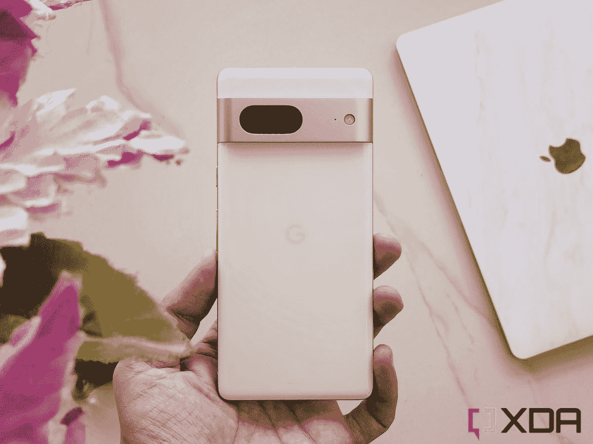

# 新的泄漏揭示了两个在发展中的像素设备代号为“赫斯基”和“柴犬”

> 原文：<https://www.xda-developers.com/leak-pixel-devices-husky-shiba/>

# 新的泄漏揭示了两个在发展中的像素设备代号为“赫斯基”和“柴犬”

据报道，它们采用了新的 SoC、12GB RAM 和高分辨率显示器

 <picture></picture> 

Google Pixel 7 in Snow colorway.

虽然谷歌揭开 Pixel 7 和 T2 Pixel 7 Pro 的封面才几个星期，但关于即将推出的 Pixel 设备的泄露已经开始在网上出现。最新的泄露曝光了两个正在开发的设备，揭示了关键细节，如它们的代号和硬件规格。

有问题的泄露来自罗兰·匡特，他在公开的代码来源中发现了指向两个设备的参考文献，代号为“哈士奇”和“柴犬”。它揭示了这些设备运行未发布的 [Android 14](https://www.xda-developers.com/android-14/) “颠倒蛋糕”版本，并以与三星合作开发的新内部 SoC 为特色。虽然代码没有突出显示关于 SoC 的所有细节，但它确认了芯片组的代号为“Zuma”，并采用了与 [Tensor G2](https://www.xda-developers.com/google-tensor-g2/) 相同的三星 Exynos 5300 5G 调制解调器。

此外，泄漏表明，“哈士奇”和“柴犬”可能是高端设备，因为它们具有 12GB 的内存和高分辨率显示器。代号为“柴犬”的设备可能是更实惠的选择，因为据报道，它具有 2268x1080p 的屏幕。另一方面，“Husky”采用了更高分辨率的 2822x1344p 面板。

相比之下，最近发布的 Pixel 7 采用了 2400x1080p 面板，而 Pixel 7 Pro 采用了 3120x1440p 显示屏。这份报告的决议让我们相信，这两款正在开发的设备要么是全新阵容的一部分，要么很可能是谷歌硬件团队的测试平台。“哈士奇”和“柴犬”不太可能成为明年 Pixel 8 系列的一部分，因为它们的面板分辨率低于 Pixel 7 系列。

目前我们没有关于这些设备的任何进一步的细节，但我们预计在未来几个月会有更多的信息浮出水面。敬请关注我们的报道，抢先了解更多即将推出的 Pixel 设备。

* * *

**来源:** [WinFuture](https://winfuture.de/news,132895.html)