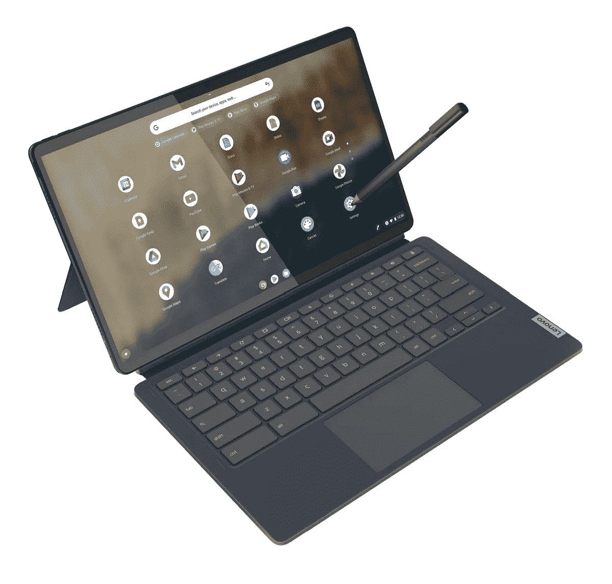

# 联想 IdeaPad Duet 5 Chromebook 点评:最佳 Chrome 平板电脑

> 原文：<https://www.xda-developers.com/lenovo-ideapad-duet-5-chromebook-review/>

Chrome 平板电脑领域无疑正在升温。虽然最初的联想 IdeaPad Duet Chromebook 主导了该领域一年多，但现在在 2021 年底有几个令人信服的选择。今年早些时候，惠普推出了 Chromebook x2 11 平板电脑，这是第一款运行高通骁龙 7c 处理器的 Chrome OS 平板电脑。在我们的评论中，我们喜欢这款平板电脑的许多方面，但第一代 7c 处理器有点太落后了。幸运的是，联想发出了漂亮的联想 IdeaPad Duet 5 Chromebook 供我们检查，里面有第二代骁龙 7c 芯片。为了简洁起见，我们在本文中将这款平板电脑称为 Duet 5。毫无疑问，大有机发光二极管屏幕是这台机器的卖点，但我对高通在几代 7c 之间所做的改进非常好奇。

在这篇综述中，我们将回答几个关键问题。首先，Duet 5 值 499 美元的价格吗？对于 Chrome OS 平板电脑来说，这是一笔相当大的金额，所以值得考虑一下你是否真的想在这款设备上花这么多钱。接下来，能否将 Duet 5 作为日常工作机使用？这是一款带有可拆卸键盘和支架的平板电脑。测试键盘在长时间打字和旅行中的承受能力非常重要。最后，这是最好的 Chrome OS 平板电脑吗？你应该购买它而不是[惠普 Chromebook x2 11](https://www.xda-developers.com/hp-chromebook-x2-11-review/) ？让我们在联想 IdeaPad Duet 5 Chromebook 评测中了解一下吧。

## 联想 IdeaPad Duet 5 Chromebook:规格

| 

规格

 | 

联想 IdeaPad Duet 5 Chromebook

 |
| --- | --- |
| **尺寸&重量** | 

*   7.35 英寸 x 12.4 英寸 x .29 英寸
*   1.5 磅(700 克)

 |
| **显示** | 

*   13.3 英寸 1920x1080 像素
*   触摸屏
*   有机发光二极管（Organic Light Emitting Diode 的缩写）

 |
| **处理器** | 

*   高通骁龙 7c 计算平台第二代
*   8 核
*   高通 Adreno 618 GPU

 |
| **内存&存储** | 

*   板载高达 8GB LPDDR4X
*   高达 256GB 的 eMMC 存储

 |
| **电池&充电** | 

*   快速充电时长达 15 小时
*   基于较低的亮度设置进行估计

 |
| **安全** |  |
| **前置摄像头** |  |
| **面向世界的摄像机** |  |
| **港口** | 

*   2 个 USB-C(第二代)
*   5 点弹簧针

 |
| **音频** | 

*   4x 杜比音频扬声器
*   智能放大器

 |
| **连通性** | 

*   802.11 a/b/g/n/ac、MIMO、2x2、2.4GHz/5GHz 双频带
*   蓝牙 5.1

 |
| **软件** | Chrome OS |
| **其他特征** | 

*   可拆卸键盘
*   深渊蓝，风暴灰
*   起价 429 美元

 |

***关于本次评测:**收到联想发来的 8GB/128GB 型号进行评测。这是目前在百思买销售的型号。我把它作为我的主要 Chromebook 用了两个多星期。在整个试用期间，我把它作为主要的工作设备，用来写文章、起草讲稿以及为我的 YouTube 频道编辑视频。*

## 联想 IdeaPad Duet 5 Chromebook 构建和设计

联想在 Duet 5 上的设计做得非常出色。低调的双色调铝制外壳优雅而高贵。此外，平板电脑握在手中感觉非常坚固。需要记住的一点是，这是一款大型平板电脑，正面配有 13.3 英寸有机发光二极管屏幕。虽然按照常规 Chromebook 的标准，Duet 5 确实很薄很轻，但在平板电脑方面，你必须多加注意。如果你打算将 Duet 5 作为手持设备使用一整天，你无疑会注意到它对于这项任务来说有点笨重。我用 Duet 5 作为我的主要笔记板，它可能有点重，似乎太大了，不能在教室里随身携带。这当然不是对这款设备的抨击，因为我对我的 12.9 英寸 iPad Pro 也有同样的感觉，只是在考虑这款设备时值得注意的一点。总的来说，对于日常使用和在包里随身携带来说，这是你可以买到的更轻的 Chrome OS 设备之一，拥有超薄的外形。

平板电脑上的边框足够薄，使显示器的正面看起来很顺眼。背面有一个哑光表面，尽管它似乎仍然很容易采集指纹。按钮坚固，有足够的点击和行程，但在日常使用中不会感觉太松。作为比较，Duet 5 的手感要比最初的联想 Chromebook Duet 好得多。鉴于起价的巨大差异，这并不令人惊讶，但很高兴看到更多的原始设备制造商努力获得高质量的 Chrome OS 设备。设备两侧都有 USB-C 端口真的很好，在各种场景下为 Duet 5 充电更容易。支架附件非常坚固，但磁铁比惠普 Chromebook x2 11 中的磁铁稍弱。在支撑平板电脑观看《网飞》的时候，我有几次不小心拆下了支架。

就耐用性而言，这款平板电脑感觉坚固，没有太多的弯曲，尽管它是一款非常宽的平板电脑。我在检查的时候没有摔过这款设备，但我可以想象它在各种表面上短暂跌落后仍能存活。这款平板电脑缺少耳机插孔，这对每个人来说都不是什么大事，但绝对值得一提。谢天谢地，四扬声器阵列相当不错，所以如果你可以不用耳机听音频，那可能是一个合理的选择。除此之外，当谈到这款平板电脑的构建质量或整体布局时，我没有任何大的抱怨。不过，支架附件确实有一个小毛病，因为它包括一个 USI 笔的插槽，这是平板电脑不包括的。这没什么大不了的，但它似乎很奇怪，因为它包括一个内置的钢笔支架，你必须作为可选配件购买。总的来说，联想做得很好，提供了一款更高端的 Chrome OS 平板电脑，大多数人会乐于把它作为日常驱动。

## 联想 IdeaPad Duet 5 Chromebook 键盘和触摸板

Chrome 平板电脑并不被认为是生产率最高的机器。毕竟，规格通常不太好，更重要的是，键盘是以一种轻薄附件的形式出现的。另一方面，并不是所有的键盘附件都是一样的。虽然我对惠普 Chromebook x2 11 上的键盘附件相对满意，但联想 IdeaPad Duet 5 Chromebook 远远超出了我的预期。这款平板电脑附带的键盘附件和支架实际上可用于完成工作。

虽然传统的翻盖式 Chromebook 总是会好一点，但 Duet 5 键盘附件比大多数可拆卸键盘都不那么拥挤，因为它非常宽。key travel 也非常好，当它坐在桌子上时，使用这款设备撰写电子邮件或简短的博客文章非常舒适。当键盘合上时，你可以把它连在设备上，这一点肯定值得一提。这是你用最初的联想 Chromebook Duet 做不到的，这使得分开携带平板电脑和键盘相当麻烦。事实上，这也可以在你随身携带平板电脑时保护它的正面显示屏，避免了在我使用时需要一个保护套。

更重要的是，Duet 5 实际上也是我可以放在腿上使用的东西，不会感到难以置信的沮丧。触摸板上偶尔会有(尽管很少)幽灵点击，但键盘本身足够坚固，可以在旅行或在家时放在膝盖上使用。事实上，您可以在旅途中和许多环境中使用 Duet 5，这确实增加了这款平板电脑的价值主张。你得到的不仅仅是一台用于媒体消费的平板电脑，而是一台真正的 2 合 1 设备，你可以用它来工作或娱乐。

## 联想 IdeaPad Duet 5 Chromebook 显示屏和笔支持

如果有一个购买这款平板电脑的重要原因，那就是 13.3 英寸的 FHD 有机发光二极管显示屏。能够在 Chrome OS 平板电脑上完成工作是一个很好的优势，但大多数人会将这样的平板电脑主要用于媒体消费和休闲网页浏览。当谈到观看网飞，Youtube，或任何其他流媒体服务，二重唱 5 是最好的。16:9 的宽高比非常适合观看电影，色彩明快，非常流行。亮度高得离谱，亮度足以在阳光直射下欣赏一整部电影，而且几乎不受影响。视角非常好，这款设备的面板真的没有什么不好。

当然，如果你要消费大量的媒体，你需要优秀的演讲者。联想也为您提供了这方面的服务。这些四扬声器声音响亮清晰，无需耳机即可享受流媒体和游戏。正如我之前提到的，这是一件好事，因为这款平板电脑没有 3.5 毫米耳机插孔。

正如你所料，Duet 5 支持 USI 笔输入，但令人费解的是，联想的盒子里没有 USI 笔。我并不期望 60 美元的笔会被包括在内，但支架附件上用于存储笔的插槽使你没有在零售包装中捆绑一支笔变得尴尬。当然，亚马逊上有更便宜的 USI 笔选择，但如果你想要一支足够精确的笔来处理繁重的工作负载，你仍然需要 40 美元左右。

我花了相当多的时间在 Duet 5 上使用[谷歌的草书应用](https://www.xda-developers.com/google-cursive-review/),来处理我每周的讲座和研究笔记。我很高兴地向您报告，我的 Penoval USI 钢笔在这款平板电脑上书写草书的体验非常棒。总的来说，我把手腕放在显示屏上造成的误触少了很多。这是我在我的[华硕 Chromebook CX9](https://www.xda-developers.com/asus-chromebook-cx9/) 和[三星 Galaxy Chromebook 2](https://www.xda-developers.com/samsung-galaxy-chromebook-2-review/) 上测试草书时经历过的事情。这款平板电脑上更大的画布也使得笔记和缩放虚拟教学非常直观。我用 Duet 5 通过 Zoom 举办了一些在线课程，白板功能在如此宽的显示屏上工作得非常好。

## 联想 IdeaPad Duet 5 Chromebook 性能和电池寿命

这给我们带来了性能。今年早些时候，当我评测宏碁 Chromebook Spin 513 和惠普 Chromebook x2 11 时，我对高通骁龙 7c 第一代的体验并不理想。自然，我有点怀疑 Duet 5 的漂亮显示和构建会被低劣的性能和普遍的 UI 滞后所破坏。令我惊讶的是，联想 Duet 5 绝对不是这样。这款平板电脑不仅可以运行 Chrome OS 任务，从轻度浏览到运行完整的 Linux 应用程序，还可以出色地运行 Android 应用程序。

这里几乎没有 UI 延迟，这使得将这款平板电脑用作休闲媒体消费设备更具吸引力。我经常在简单地浏览 HP Chromebook x2 11 UI 时感到沮丧，即使只是浏览网页或在 Android 应用程序之间切换也是如此。Duet 5 解决了所有这些问题，运行 Android 游戏也非常棒。在这个大有机发光二极管屏幕上玩沥青 9 和类似的高端手机游戏是一种享受，你也不会看到很多掉帧。从骁龙 7c 第一代芯片到第二代芯片，性能飞跃之大令人印象深刻。高通或联想，也许两者都有，真的在二重唱 5 中创造了一些奇迹。虽然我认为分辨率略低的屏幕与此有关(惠普 x2 11 有 2K 显示屏)，但不可否认的是，第二代 7c 对 Chrome 平板电脑来说是一个很大的改进。

电池寿命同样令人印象深刻。联想声称使用时间长达 15 小时，这与我在日常工作中看到的情况相差不远。使用这款平板电脑进行文字处理、网络浏览和流媒体播放平均需要 12-14 小时的总不充电时间。对我和其他大多数人来说，这是一整天的工作和娱乐。当然，如果你在室外以最大亮度运行它，或者整天玩游戏，你可以预计到 8-10 小时的范围。尽管如此，对于一台配备大有机发光二极管显示屏的 Chromebook 来说，8-10 小时仍然非常稳定。

## 结论:该不该买？

绝对的。如果你正在寻找一款 Chrome OS 平板电脑，除了 Duet 5，我真的没有其他选择可以推荐。这是有史以来最好的 Chrome OS 平板电脑，在百思买的售价为 499 美元。当然，如果你想花更少的钱，得到一个更小的，不那么令人印象深刻的显示器，原来的联想 Duet 也很好。然而，那些寻求 Chrome 操作系统最佳平板体验的人，你会想要更大的哥哥。Duet 5 几乎在所有方面都击败了惠普 Chromebook x2 11，最重要的是在性能、电池续航时间和移动键盘舒适度方面。

Chromebook 领域还有其他 500 美元左右的不错选择，如 Galaxy Chromebook 2，但这些都是传统的翻盖机型。如果你需要便携性，多功能性，或者只是想要最佳的媒体消费体验，Duet 5 是不可能击败的。这绝对是相当长一段时间内联想推出的[最好的 Chromebooks 之一。](https://www.xda-developers.com/best-lenovo-chromebooks/)

 <picture></picture> 

Lenovo IdeaPad Duet 5 Chromebook

##### 联想 Chromebook Duet 5

联想 Chromebook Duet 5 是 2020 年 Chromebook Duet 的更大、更高端版本。你得到一个明亮的有机发光二极管显示器，可拆卸键盘，和 USI 笔支持。499 美元的所有这些功能使它在 Chrome 平板电脑领域具有坚实的价值。