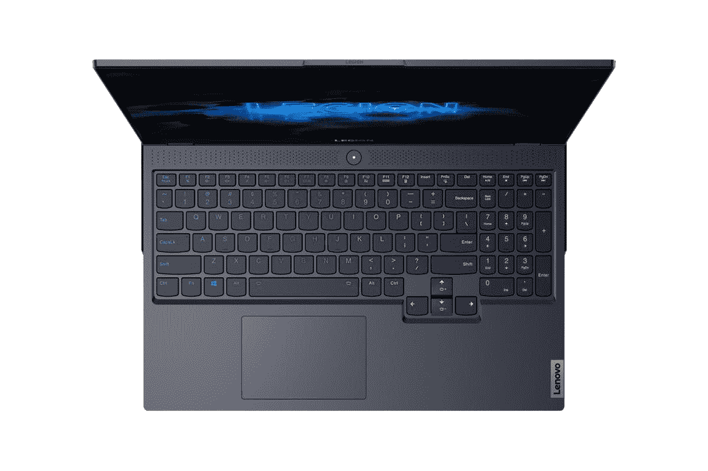

# 联想军团 7i 回顾:游戏巨兽尚有改进空间

> 原文：<https://www.xda-developers.com/lenovo-legion-7i-review/>

多年来，联想的军团阵容已经成熟，今年，我们看到该公司推出了一些真正有趣的产品。除了军团 5i，该公司还推出了军团 7i，这是该公司提供的顶级产品。它借鉴了中端产品的外观和风格，但与一些最强大的笔记本电脑竞争，包括像外星人和雷蛇这样的重量级产品。但是这款笔记本是游戏玩家的正确选择吗？

## 联想军团 7i:规格

正如我提到的， [Legion 7i](https://www.amazon.in/Lenovo-Legion-Windows-Graphics-81YU002AIN/dp/B08FJCRGPR?tag=xdaportalin-21) 是联想最强大的产品，可与第十代英特尔酷睿 i5-10300H 以及酷睿 i9-10980HK 一起使用。我在这里得到的设备包括配备 NVIDIA GeForce RTX 2080 Max-Q 的酷睿 i7-10875H。以下是完整的规格:

| 

规格

 | 

联想军团 7i

 |
| --- | --- |
| **尺寸&重量** | 

*   19.82 x 359.41 x 259.08mm 毫米
*   2.25 千克

 |
| **显示** | 

*   15.6 英寸全高清(1920x1080) IPS
*   144 赫兹
*   HDR400
*   100% Adobe RGB
*   500 尼特亮度
*   g 同步

 |
| **处理器** | 

*   英特尔酷睿 i7-10875H (2.3GHz / 5.1GHz)

 |
| **GPU** | 

*   NVIDIA GeForce RTX 2080 Super Max-Q(8GB gddr 6)

 |
| **风筒&储存** | 

*   16GB DDR4 (3200MHz)
*   1TB M.2 NVMe 固态硬盘

 |
| **电池&充电器** |  |
| **输入/输出** | 

*   USB 3.1 第 1 代
*   2 个 USB 3.1 第二代
*   HDMI 2.0
*   以太网
*   肯辛顿锁槽
*   通电
*   雷电 3 Type-C (Thunderbolt、DisplayPort、USB 3.1、HDMI)
*   USB-C(显示端口 1.4，USB 3.1 第 1 代)
*   3.5 毫米耳机/麦克风组合插孔

 |
| **连通性** | 

*   英特尔 WiFi 6 802.11AX (2 x 2)
*   蓝牙 5.0

 |
| **操作系统** | 

*   Windows 10 主页
*   付费附加软件:Windows 10 专业版

 |
| **其他特征** | 

*   Corsair iCUE 控制的 RGB 照明
*   联想 Vantage 调谐软件
*   X-Rite 色彩助手
*   快速访问热分布图

 |

***关于本次评测:**联想印度给我们发了军团 7i 进行评测。这篇评论是在常规使用大约 15 天后写的。联想对这篇文章的内容没有任何意见。*

## 联想军团 7i:设计和制造

这里的设计有点混杂。虽然我很欣赏这款笔记本干净的外观和铝合金表面，但盖子容易抖动，深灰色的表面看起来也很普通。不过你确实有很多 RGB 灯光，这绝对会吸引你的眼球。底部有一个 RGB 条，盖子上有一个 RGB 军团标志，一些 RGB 灯就放在后部通风口内，当然，在键盘下面。除了灯光秀之外，联想的所有品牌都被垂直地放置在键盘面板和盖子上。非常干净。

这是一款相当时尚的 15 英寸机器，重 2.25 千克，厚度约为 19 毫米。考虑到它与 Razer Blade 15 大致相同，这并不坏。它不应该很重，但考虑到我们大多数人现在都被限制在家里，笔记本电脑在你的桌子上应该看起来很温和。正如我提到的，盖子不是很坚固，尽管我可以忽略这一点，因为当它在坚硬的表面上使用时不会摇晃。盖子可以完全打开并平放，如果您喜欢将笔记本电脑放在冷却支架上，这将非常有用。说到这里，显示屏两侧有细长的边框，而顶部边框则装有 720p 网络摄像头。联想为担心安全的人提供了一个漂亮的滑块来关闭相机镜头。底部挡板相当大，但我对此没有任何抱怨。

你还可以得到总共四个通风口-两个在后面，一个在两边。底部有很大的穿孔区域，便于风扇吸入冷空气。键盘面板很漂亮，间隔开，触控板看起来相当大。联想在笔记本电脑周围提供了一组很好的端口。左侧有两个 USB-C 3.1 端口，其中一个提供雷电 3，而另一个仅限于 DisplayPort 1.4。还有一个耳机组合插孔。右侧包括一个 USB 3.1 Gen 1 Type-A 端口，用于插入鼠标或其他外围设备。在背面，你可以得到两个 USB 3.1 Gen 2 Type-A，一个 HDMI 2.0，一个千兆以太网端口，一个充电端口和一个 Kensington lock 插槽。后面的端口由微妙的白色 led 表示，我真的很喜欢。当笔记本电脑开机或处于待机模式时，这些指示灯会亮起。

我想检查一下内部，以便将来升级，我从底盖上取下 10 个螺丝就可以轻松进入。双冷却风扇有大量非常薄的鳍片，中间是一些散热的热管。联想确实在高配置机型上提供了蒸汽室冷却解决方案，包括我在这里评测的这款。有两个 M.2 插槽，其中一个被 1TB 西部数据 NVMe SSD 占用。这意味着您可以再添加一个 M.2 SSD 来扩展您的存储。记忆棒在中间，但是被一个塑料保护罩保护着。如果你想在将来升级的话，你可以删除它并获取访问权限。

## 显示

联想为 Legion 7i 提供了三种显示器选择。虽然这三款都提供了 15.6 英寸 FHD (1920 x 1080) IPS 防眩光面板，但配置各不相同。第一个是 144 赫兹，响应时间小于 3 毫秒的选项，具有 100% sRGB 和 300 尼特的亮度。第二个选项(我们收到的用于审查的选项)具有相同的刷新率，但提供 100%的 Adobe RGB 覆盖率、500 尼特的亮度、VESA DisplayHDR 400 认证和杜比视觉。顶级选项包括 240Hz 刷新率、小于 1 毫秒的响应时间、100% sRGB、500 尼特亮度、VESA DisplayHDR 400 认证以及杜比视觉。

老实说，我对这个小组没有任何抱怨。颜色看起来很有力量，尽管有哑光处理，但也有足够的亮度。我们得到的单元也是 G-Sync 兼容的。说到这里，我玩游戏玩得很开心，因为面板提供了平滑的纹理和清晰的图像。如果你想看电影，尤其是 HDR 格式的，这个显示器也是一种享受。此外，联想还安装了一款名为 X-Rite Color Assistant 的软件，可以让你根据自己的使用情况设置各种颜色配置文件。您可以在 Adobe RGB、DCI-P3 和 Rec 之间进行选择。709 和 sRGB。除此之外，还有一个默认设置以及一个非校准选项。

## 键盘和触摸板

我在我的个人电脑上使用 iCUE，我可以告诉你，它是最好的 RGB 软件之一。

我通常对联想的键盘有很好的体验，这似乎没有什么不同。它有一个坚固的结构，虽然键盘上有一点弯曲，但我不会太担心它。联想表示，其“TrueStrike”键盘具有 1.3 毫米按键行程的软开关。这是很好的打字与一种薄膜风格的感觉。键盘包括一个全尺寸的数字键盘，以及大箭头键，占用了甲板上的一些额外空间。当然，它带有 RGB 照明，通过 Corsair 的 iCUE 软件提供 1600 万种不同的颜色。我在我的个人电脑上使用 iCUE，我可以告诉你，它是最好的 RGB 软件之一。你有各种各样的选择，包括键盘的颜色和图案，以及夜光和背光。不过，这台笔记本电脑有一个小问题。该软件没有任何关闭默认彩虹效果的选项。因此，每当你打开或关闭笔记本电脑，颜色会变成螺旋彩虹效果。唯一的选择是完全关闭按键上的照明。键盘带有各种功能按钮选项，其中一个按钮可以通过按下 Fn + Q 键在笔记本电脑的热模式之间切换。这也可以使用 Lenovo Vantage 软件来完成，并通过电源按钮的颜色来表示。

触摸板看起来相当简单，没有什么花哨的表面。它很流畅，反应灵敏，左右点击都如预期的那样。现在，我在某些论坛上看到了一些担忧，认为如果你按下触摸板的顶部，它会产生一个小间隙。虽然这是真的，但我相信这不是一个大问题，除非随着时间的推移灰尘越积越多。

## 表演

为我评测的设备提供动力的是英特尔酷睿 i7-10850H，这是一款八核处理器，速度为 2.30GHz，使用睿频加速可以达到 5.10GHz。系统上使用的三星双通道 16GB DDR4 内存，主频 3200MHz。在存储方面，你会得到西部数据(Western Digital)的 1TB M.2 NVMe 固态硬盘，尽管全球某些地区会得到三星 NVMe 硬盘。最后但同样重要的是，NVIDIA GeForce RTX 2080 Super Max-Q GPU 8GB gddr 6 会处理图形负载。这是一台高端机器，比同时处理 30-40 个 Chrome 标签和多个视频流的能力强得多。我从未遇到过笔记本电脑变慢的情况。

即使在最消耗资源的游戏中，游戏玩家也能获得出色的性能。

即使在最消耗资源的游戏中，游戏玩家也能获得出色的性能。像《星球大战:绝地堕落》这样的游戏在最高设置下运行速度约为 130fps，而《古墓丽影:崛起》在最高设置下运行速度约为 90fps。像 Apex Legends 和 player unknown Battlegrounds(PUBG)这样的多人游戏一直以 120fps 的速度流畅运行。

至于合成基准测试，我进行了各种测试来挑战硬件的极限。结果正如预期的那样，得分与同系列的大多数游戏笔记本电脑相似。我们测试的一些基准包括 3D Mark、Cinebench R20 和 PC Mark 10。您可以查看以下结果:

西部数据的 SSD 给我的感觉相当快和爽快。运行 CrystalDiskMark 再次证实了我的体验，NVMe SSD 成功获得了 2，913MBps 的读取速度和 2，961MBps 的写入速度。与三星的产品相比，这不是最快的固态硬盘，但它应该能提供坚如磐石的传输速度。

联想将这款笔记本电脑与其名为 Lenovo Vantage 的中枢软件捆绑在一起。这是一个漂亮的工具，可以帮助你监控你的系统，以及启用或禁用某些功能。如前所述，您可以使用它来选择热模式，包括性能、平衡或静音。

至于音频性能，双立体声扬声器放置在两侧，面朝下。它们产生很大的音量，甚至还有一点重击声。音质不会让你大吃一惊，但对于看电影或休闲游戏来说应该足够好了。

## 热裂法炭黑

伴随着强大的力量而来的是巨大的责任和热量，但是热量并不是 7i 军团所擅长的。在我的测试中，我看到 CPU 的峰值温度高达 95 度，这非常令人担忧。因此，CPU 的所有核心都进行了热节流。澄清一下，我在游戏时没有遇到任何明显的性能问题，这些峰值温度读数是在基准压力测试中记录的。系统确实限制了 CPU 的功率或时钟速度。这一点很明显，因为 CPU 无法达到 5GHz 的时钟速度，只能在 4.7-4.8GHz 的速度下达到峰值。

笔记本电脑在长时间的游戏过程中会散发大量的热量，尤其是在您使用性能模式时。通风口周围的区域变得非常热，热量沿着键盘顶部扩散。键盘本身不会发热，这很好。在正常使用时，你应该不会遇到任何发热问题，尽管我不建议你在膝盖上长时间使用这款笔记本电脑，因为冷却风扇需要空间从底部吸入空气。

## 电池寿命

这款笔记本配备了耗电硬件，老实说，我对电池续航时间没有太高的期望。然而，由于联想提供了三种性能模式，我很好奇。4 芯 80 瓦时电池续航时间约为 4 小时 10 分钟，可用于连续浏览网页。为了更好的测量，我将亮度保持在 50%以下，并将性能模式设置为平衡。对于游戏笔记本电脑来说，这是相当普通的，根据您的使用情况，您可能会得到不同的结果。为了提供电力，这款笔记本配备了一个结实的 230 瓦充电器。我不得不称赞联想努力保持充电砖的厚度几乎与笔记本电脑本身相似。

## 联想军团 7i 结论:强大但温暖

联想终于与军团 7i 合作，并保证它是认真的。这是一台制作精良的机器，绝对是该公司提供的最强大的游戏笔记本电脑。它能够轻松处理所有的高端 AAA 游戏，对于内容创作者来说，它也是一台非常好的机器。是不是很好的台式机替代品？绝对的。话虽如此，我真的希望联想会研究一下热性能的问题，因为在某些重负载下会出现节流的情况。除此之外，我几乎没有任何抱怨，这是在这些溢价点预期。

军团 7i 的定价从₹1,94,638 开始，一直到₹2,77,490，在那里你可以买到酷睿 i9-10980HK 处理器和 240Hz 面板。很明显，这款笔记本的目标客户是寻求顶级性能且预算不受限制的消费者。该不该买一个？嗯，在选择军团 7i 之前，在这个价格范围内有一堆选择，你也应该探索一下。一定要看看外星人 M15 R3、Razer Blade 15，甚至宏碁 Predator Triton 500，或者我们为美国用户提供的其他一些建议。如果你最终加入了 7i 军团，只要你知道你会得到什么，你就会对你的决定感到满意。

 <picture></picture> 

Lenovo Legion 7i

##### 联想军团 7i

Legion 7i 是联想的顶级游戏笔记本电脑。它提供第 10 代英特尔酷睿处理器和 NVIDIA 的 GeForce RTX 20 系列 GPU，提供超强性能包。