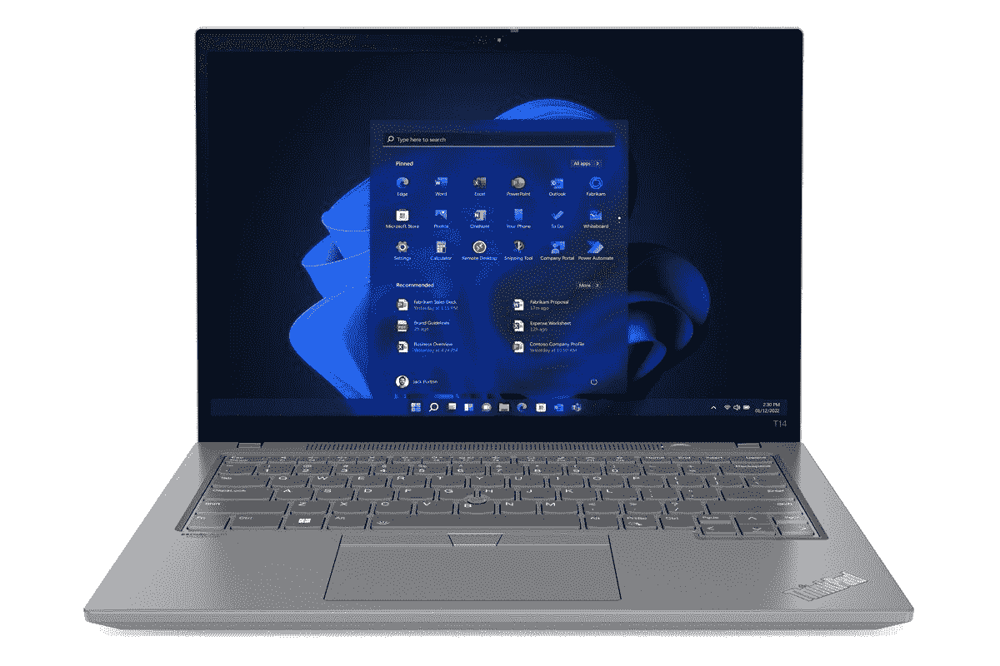

# 联想 ThinkPad T14 Gen 3:发布日期、规格和其他信息

> 原文：<https://www.xda-developers.com/lenovo-thinkpad-t14-gen-3/>

联想的 ThinkPad T14 是该公司商务笔记本电脑中较为主流的一款，总体而言，它是最好的 ThinkPad 之一。正如我们在[对 ThinkPad T14 Gen 2](https://www.xda-developers.com/lenovo-thinkpad-t14-gen-2-review/) 的评论中所指出的，联想称其为 ThinkPad 家族的主力，这是一款解决了所有基本问题而又不过分昂贵或突破性的笔记本电脑，旨在迎合各种商业用户。现在，联想 ThinkPad T14 Gen 3 即将推出，它对性能和生产力进行了一些重大改进。

新型号配备了您可以选择的英特尔或 AMD 处理器、更高的屏幕等，使其成为商业用户的绝佳选择。当然，您也可以获得常见的一系列连接。

## 规范

|  | 

联想 ThinkPad T14 第三代(英特尔)

 | 

联想 ThinkPad T14 第三代(AMD)

 |
| --- | --- | --- |
| **CPU** | 

*   最高可配第 12 代英特尔酷睿 i7 博锐 P 系列和 U 系列处理器

 | 

*   最高配置 AMD 锐龙 6000 PRO 处理器(20W)

 |
| **图形** | 

*   **集成**
    *   英特尔 UHD 显卡(酷睿 i3)
    *   英特尔 Iris Xe 显卡(酷睿 i5 和酷睿 i7)

*   **离散**(可选)
    *   NVIDIA GeForce MX550
    *   英伟达 GeForce RTX 2050

 |  |
| **存储** |  |  |
| **闸板** | 

*   高达 48GB DDR4 双通道
    *   一个焊接芯片
    *   一个 SODIMM 插槽

 | 

*   高达 32GB LPDDR5 6400MHz(焊接)

 |
| **显示** | 

*   14 英寸 16:10 全高清+ (1920 x 1200) IPS，防眩光，300 尼特
*   14 英寸 16:10 全高清+ (1920 x 1200) IPS，防眩光，300 尼特，触控
*   14 英寸 16:10 全高清+ (1920 x 1200) IPS，低功耗，防眩光，400 尼特，100% sRGB
*   14 英寸 16:10 全高清+ (1920 x 1200) IPS，隐私保护，防眩光，500 尼特，100% sRGB
*   14 英寸 16:10 2.2K (2240x1400) IPS，防眩光，300 尼特
*   14 英寸 16:10 超高清+ (3840 x 2400) IPS，防眩光，防反射，防污迹，500 尼特，100% DCI-P3，HDR 400，杜比视觉，触摸(AOFT)

 | 

*   14 英寸 16:10 全高清+ (1920 x 1200) IPS，防眩光，300 尼特
*   14 英寸 16:10 全高清+ (1920 x 1200) IPS，防眩光，300 尼特，触控
*   14 英寸 16:10 全高清+ (1920 x 1200) IPS，低功耗，防眩光，400 尼特，100% sRGB
*   14 英寸 16:10 全高清+ (1920 x 1200) IPS，隐私保护，防眩光，500 尼特，100% sRGB
*   14 英寸 16:10 2.2K (2240x1400) IPS，防眩光，300 尼特
*   14 英寸 16:10 超高清+ (3840 x 2400) IPS，防眩光，防反射，防污迹，500 尼特，100% DCI-P3，HDR 400，杜比视觉，触摸(AOFT)

 |
| **电池** | 

*   39.3 瓦时电池(仅限集成显卡)
*   52.5 瓦时电池

 | 

*   39.3 瓦时电池
*   52.5 瓦时电池

 |
| **港口** | 

*   2 个 Thunderbolt 4 / USB Type-C
*   2 个 USB 类型 A (USB 3.2 第 1 代)
*   1 个 HDMI 2.0b 接口
*   1 个 RJ45 以太网
*   3.5 毫米组合耳机插孔
*   SIM 卡插槽

 | 

*   2 个 USB Type-C (USB 3.2 第二代)
*   2 个 USB 类型 A (USB 3.2 第 1 代)
*   1 个 HDMI 2.0b 接口
*   1 个 RJ45 以太网
*   3.5 毫米组合耳机插孔
*   SIM 卡插槽

 |
| **音频** | 

*   带有杜比语音的杜比音频扬声器系统
*   双麦克风

 | 

*   带有杜比语音的杜比音频扬声器系统
*   双麦克风

 |
| **网络摄像头** | 

*   720p 高清摄像头
*   1080p 全高清摄像头
*   1080p 全高清摄像头+红外摄像头

 | 

*   720p 高清摄像头
*   1080p 全高清摄像头
*   1080p 全高清摄像头+红外摄像头

 |
| **视窗你好** | 

*   指纹识别器(在电源按钮中)
*   可选:红外摄像头

 | 

*   指纹识别器(在电源按钮中)
*   可选:红外摄像头

 |
| **连通性** | 

*   Wi-Fi 6E
*   蓝牙 5.2
*   4G LTE(4 类/16 类/20 类)

 | 

*   Wi-Fi 6E
*   蓝牙 5.2
*   4G LTE(4 类/16 类)

 |
| **颜色** | 

*   风暴灰色
*   雷霆黑(可选抗菌表面处理)

 |  |
| **尺寸(WxDxH)** | 

*   317.7 x 226.9 x 17.9 毫米(12.51 x 8.93 x 0.70 英寸)

 | 

*   317.7 x 226.9 x 17.9 毫米(12.51 x 8.93 x 0.70 英寸)

 |
| **起始重量** |  |  |
| **价格** | 起价 1399.99 美元 | 起价 1299.99 美元 |

## 联想 ThinkPad T14 Gen 3 发布日期

联想在 2 月下旬的 MWC 2022 上宣布了新款 ThinkPad T14 refresh，但如果你想购买，只有部分型号可用。英特尔型号在 4 月份首次推出，你现在就可以购买，尽管还没有太多的配置可用。如果你想要 AMD 处理器的版本，你必须再等一会儿——它将在六月的某个时候发布。

但是请记住，这些事情并不是一成不变的。由于持续的供应限制，如果联想不能获得足够的零部件，事情可能会推迟。同样值得注意的是，一些配置可能会比其他配置更早推出。例如，即使英特尔模型已经推出，在编写时也只有一种配置可用，因此您还不能以任何方式配置它。这些只是示例，但是您想要的配置可能不会马上可用。

## 联想 ThinkPad T14 Gen 3 价格

虽然并非所有型号都已上市，但我们知道联想 T14 Gen 3 的官方起价。英特尔型号的价格略高，起价为 1399.99 美元，而 AMD 型号在 6 月份推出时起价为 1299.99 美元。当然，这只是基本配置，将有低端处理器，内存和其他规格。更高端的配置会大幅提高价格，这取决于你想要什么。

不过，随着时间的推移，留意折扣是值得的。联想几乎总是在其网站上进行某种形式的销售，所以你可能会在发布后以更合理的价格找到 ThinkPad T14 Gen 3。

## 联想 ThinkPad T14 Gen 3 有什么新功能

与之前的型号相比，最新一代的 ThinkPad T14 显然带来了一些显著的改进。最明显的是升级到 AMD 和英特尔的新处理器，但也有新的显示器和其他升级。我们来分解一下变化。

### 规格提升

联想 ThinkPad T14 Gen 3 配备第 12 代英特尔酷睿或 AMD 锐龙 6000 系列处理器，具体取决于您选择的型号。这两款产品都是对其前身的升级，尽管英特尔做出了一些更彻底的改变。英特尔第 12 代处理器采用混合架构，混合了高性能(P)内核和高效(E)内核，因此内核数量比上一代高得多。英特尔还推出了 P 系列处理器，其 TDP 为 28W，远高于我们过去看到的 U 系列的 15W。这应该会带来更好的整体性能。

如果您购买英特尔型号，如果您愿意，您还会有一些升级的独立显卡。您现在可以选择 NVIDIA GeForce MX550(从去年的 MX450 升级而来)或 GeForce RTX 2050，这是 ThinkPad T14 的全新产品。

AMD 的锐龙 6000 系列仍然保持了更传统的架构，所有核心都是“性能”核心，但有一些隐藏的改进，以保持与英特尔不相上下的性能。你错过了独立显卡部门，因为你仍然没有得到那个选项。虽然你不会得到独立显卡，但 AMD 表示，其锐龙 6000 处理器中的集成 GPU 明显快于 NVIDIA GeForce MX450，所以你不会真正错过。

Thinkpad T14 Gen 3 的 AMD 型号还有另一个好处:联想将 RAM 升级到了 LPDDR5，主频高达 6400MHz。与去年的 3200 MHz lpddr 4 相比，这是一个巨大的进步。英特尔模型中的 RAM 没有改变，因此 AMD 变种可能最终在延迟方面具有很大的优势。

### 采用新配置的 16:10 显示屏

ThinkPad T14 Gen 3 的另一大变化是显示屏。联想最终将这款面板升级到了更高的 16:10 宽高比，这通常是首选，尤其是为了提高工作效率。更高的屏幕意味着更大的表面积和垂直空间，这让您可以通过更少的滚动看到更多的文本或其他 UI 元素。它在高端笔记本电脑中越来越常见，所以很高兴看到它进入联想更主流的阵容。

显示器的配置选项几乎都是一样的，只是更高一些。有各种全高清+ (1920 x 1200)配置，有些包括触摸支持或隐私保护，以及支持 HDR 的高端超高清+ (3840 x 2400)面板。不过今年，如果你想要稍微高一点的分辨率，有一个新的选择。如果你发现全高清不够，而超高清又太贵，那么 300 尼特亮度的 2.2K 面板可以给你带来额外的清晰度。

### 可选全高清网络摄像头

经过两年的远程工作，联想终于让客户可以选择在 ThinkPad T14 Gen 3 上安装全高清网络摄像头。以前的型号只有 720p 摄像头，这仍然是今年的基本配置，但如果你想在视频通话和会议中看起来更清晰，你可以升级到全高清(1080p)。

1080p 网络摄像头还有一个额外的好处，即包括一个红外摄像头，用于 Windows Hello 支持。去年它配备了 720p 网络摄像头，但现在，如果你想要 Windows Hello，你必须获得 1080p 摄像头。这是登录您的笔记本电脑的最便捷方式，因此我们当然建议您进行升级。

## 在哪里购买联想 ThinkPad T14 Gen 3

如果你有兴趣购买联想 ThinkPad T14 Gen 3，可以看看下面。目前，只有基于英特尔的型号可用，并且您只能选择一种配置。正如我们上面提到的，这些东西倾向于逐步推出，AMD 型号计划在 6 月推出。不过，你也可以看看下面的产品页面。

 <picture></picture> 

Lenovo ThinkPad T14 Gen 3

##### 联想 ThinkPad T14 Gen 3

联想 ThinkPad T14 Gen 3 是一款商务笔记本电脑，采用英特尔第 12 代或 AMD 锐龙 6000 处理器。它有一个 16:10 的显示屏，许多端口，它为企业提供了所有的基本功能。

如果你想根据需要微调规格，联想的网站将提供最多的配置选项。虽然我们最终可能会在亚马逊或百思买等其他零售商那里看到一些变体，但像这样的商务笔记本电脑总是倾向于直接从制造商那里获得更多选项。这是因为你有很多配置可供选择，而且很难在不同的零售商那里保持每种配置的库存。

同时，如果你现在想买一台新的笔记本电脑，为什么不看看[最好的联想笔记本电脑](https://www.xda-developers.com/best-lenovo-laptops/)？除了商用笔记本电脑，该公司还为其他细分市场制造了一些出色的笔记本电脑。否则，你可以看看[最好的笔记本电脑](https://www.xda-developers.com/best-laptops/)，看看更多的选项。