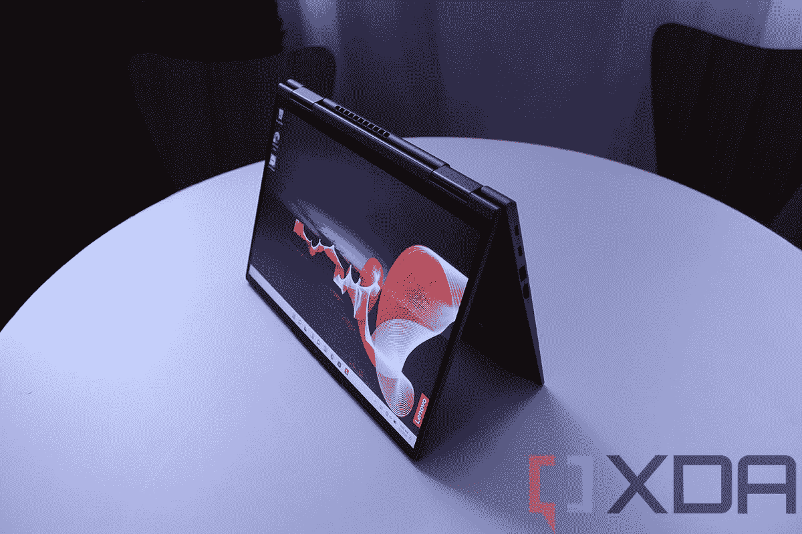

# 联想 ThinkPad X1 Carbon Gen 11 vs ThinkPad X1 Yoga Gen 8:哪款 ThinkPad 适合你？

> 原文：<https://www.xda-developers.com/lenovo-thinkpad-x1-carbon-gen-11-vs-thinkpad-x1-yoga-gen-8/>

几乎每年，联想都会推出其最受欢迎的笔记本电脑的新版本，2023 年也不例外，包括联想 ThinkPad X1 Carbon Gen 11 和 T2 ThinkPad X1 Yoga Gen 8。两者都有类似的小升级，主要是将处理器升级到英特尔最新的第 13 代机型。众所周知，这些笔记本电脑在每一次新的迭代中都保持不变，但这也是它们受欢迎的部分原因。

虽然这两款产品都与它们的前辈相似，但联想 ThinkPad X1 Carbon 和 X1 Yoga 仍然有很大的不同。如果你想在今年购买一台新的[商务笔记本电脑](https://www.xda-developers.com/best-business-laptops/)，这两款都是不错的选择，但是哪款适合你呢？我们是来帮忙的。

## 联想 ThinkPad X1 Carbon Gen 11 与 ThinkPad X1 Yoga Gen 8:定价和供货情况

联想宣布在 2022 年底更新 ThinkPad X1 Carbon 和 X1 Yoga，但它们要到 2023 年 4 月才会推出。像往常一样，如果你想买的话，你可能会想看看联想的网站，因为它们不太可能在像百思买这样的商店很快就能买到。此外，您将直接从源代码获得所有配置选项。

联想 ThinkPad X1 Carbon 的官方起价为 1，729 美元，ThinkPad X1 Yoga 的起价为 1，859 美元。不过，联想几乎总是在其网站上进行某种形式的销售，所以你很有可能在发布后不久就能找到低于这个价格的产品。

## 联想 ThinkPad X1 Carbon Gen 11 vs ThinkPad X1 Yoga Gen 8:规格

|  | 

联想 ThinkPad X1 碳第 11 代

 | 

联想 ThinkPad X1 Yoga Gen 8

 |
| --- | --- | --- |
| 

**操作系统**

 |  |  |
| 

**CPU**

 | 

*   支持博锐技术的第 13 代英特尔酷睿 i5 和 i7 P 系列

 | 

*   支持博锐技术的第 13 代英特尔酷睿 i5 和 i7 P 系列

 |
| 

**图形**

 |  |  |
| 

**显示**

 | 

*   14 英寸 IPS，16:10 宽高比，WUXGA (1920 x 1200)，400 尼特，100% sRGB，防眩光
*   14 英寸 IPS，16:10 宽高比，WUXGA (1920 x 1200)，400 尼特，100% sRGB，触摸，防眩光
*   14 英寸 IPS，16:10 宽高比，WUXGA (1920 x 1200)，隐私保护，500 尼特，100% sRGB，触摸，防眩光
*   14 英寸 IPS，16:10 宽高比，2.2K (2240 x 1400)，300 尼特，100% sRGB，防眩光
*   14 英寸有机发光二极管，16:10 宽高比，2.8K (2880 x 1800)，500 尼特，100% DCI-P3，HDR500 全黑，防眩光，防反射，防污迹

 | 

*   14 英寸 IPS，16:10 宽高比，WUXGA (1920 x 1200)，400 尼特，100% sRGB，触摸，防反射，防脏
*   14 英寸 IPS，16:10 宽高比，WUXGA (1920 x 1200)，400 尼特，100% sRGB，触摸，防眩光
*   14 英寸 IPS，16:10 宽高比，WUXGA (1920 x 1200)，隐私保护，500 尼特，100% sRGB，防眩光
*   14 英寸有机发光二极管，16:10 宽高比，WQUXGA (3840 x 2400)，500 尼特，100% DCI-P3，HDR500 全黑，防反射，防污迹

 |
| 

**存储**

 | 

*   高达 2TB 的 PCIe 第四代 NVMe 固态硬盘

 | 

*   高达 2TB 的 PCIe 第四代 NVMe 固态硬盘

 |
| 

**公羊**

 | 

*   最高 64GB LPDDR5(焊接)

 | 

*   最高 64GB LPDDR5(焊接)

 |
| 

**电池**

 |  |  |
| 

**端口**

 | 

*   2 个 Thunderbolt 4(USB C 型)
*   2 个 USB 3.2 第 1 代 A 型
*   1 个 HDMI 2.0b 接口
*   3.5 毫米耳机插孔
*   **可选:** Nano SIM 卡插槽

 | 

*   2 个 Thunderbolt 4(USB C 型)
*   2 个 USB 3.2 第 1 代 A 型
*   1 个 HDMI 2.0b 接口
*   3.5 毫米耳机插孔
*   **可选:** Nano SIM 卡插槽

 |
| 

**音频**

 | 

*   杜比 Atmos 扬声器系统
*   四阵列 360 度麦克风

 | 

*   杜比 Atmos 扬声器系统
*   四阵列 360 度麦克风

 |
| 

**摄像机**

 | 

*   1080p 全高清 MIPI RGB +红外网络摄像头，带物理快门
*   1080p 全高清 MIPI RGB +红外网络摄像头，带计算机视觉和物理快门

 | 

*   1080p 全高清 MIPI RGB +红外网络摄像头，带物理快门
*   1080p 全高清 MIPI RGB +红外网络摄像头，带计算机视觉和物理快门

 |
| 

**Windows Hello**

 | 

*   红外网络摄像头
*   指纹传感器

 | 

*   红外网络摄像头
*   指纹传感器

 |
| 

**连通性**

 | 

*   Wi-Fi 6E 2x2
*   蓝牙 5.1
*   蜂窝选项:
    *   5G 子 6 类 20
    *   4G LTE Cat16
    *   4G LTE Cat4(仅限中国)

 | 

*   Wi-Fi 6E 2x2
*   蓝牙 5.1
*   蜂窝选项:
    *   5G 子 6 类 20
    *   4G LTE Cat16

 |
| 

**颜色**

 |  |  |
| 

**尺寸(WxDxH)**

 | 

*   12.42 x 8.76 x 0.60 英寸(315.6 x 222.5 x 15.36mm 毫米)

 | 

*   12.38 x 8.75 x 0.61 英寸(314.4 x 222.3 x 15.53mm 毫米)

 |
| 

**重量**

 | 2.48 磅(1.2 千克) | 3 磅(1.38 千克) |
| 

**起始价格**

 | $1,729 | $1,859 |

## 设计和端口:翻盖式还是可转换式？

通常，我们通过分解性能和显示器来开始这些比较，但实际上，这两款笔记本电脑之间最大的区别在于设计——联想 ThinkPad X1 Carbon 是一款翻盖笔记本电脑，而 ThinkPad X1 Yoga 是一款可折叠笔记本电脑。这意味着，虽然一个只是笔记本电脑，但另一个有一个可以 360 度旋转的铰链，让你可以将它用作平板电脑或在不同的位置上使用，如观看视频的帐篷模式。仅此一点就能为你做出决定，尤其是如果你看重敞篷车的多功能性。

 <picture></picture> 

Lenovo ThinkPad X1 Yoga Gen 7

然后，还有长相。联想的 [ThinkPad 系列](https://www.xda-developers.com/best-thinkpads/)明显坚持了其标志性的黑色外观和红色点缀，我们几乎可以在整个产品组合中看到，包括 X1 Carbon。然而，X1 Yoga 是一个例外。虽然它确实具有相同的经典设计和红色口音，但底盘实际上是银色而不是黑色。银色在笔记本电脑行业更受欢迎，但许多 ThinkPad 粉丝确实喜欢这种标志性的黑色，所以你站在哪一边取决于你。

ThinkPad X1 Carbon 的起始重量仅为 2.48 磅，明显低于 X1 Yoga 的 3 磅。

它们也是由不同的材料制成的。虽然 ThinkPad X1 Yoga 主要由铝制成，但 X1 Carbon 使用了包括镁和碳纤维在内的混合材料，这给了它不同的感觉，并有助于使它更轻。事实上，ThinkPad X1 Carbon 的起始重量仅为 2.48 磅，明显低于 X1 Yoga 的 3 磅，使其更加便携。

两台笔记本电脑的端口也是相同的。你有两个 Thunderbolt 4 端口、两个 USB Type-A 端口、HDMI、一个 3.5 毫米耳机插孔和一个可选的 Nano SIM 卡插槽，以防你选择具有蜂窝连接功能的型号。在这一点上，两款笔记本电脑都为您提供了 5G 或 4G LTE 的选择，因此您可以获得最符合您需求和预算的产品。

## 展示:X1 Yoga 上 4K

虽然这两款笔记本电脑之间最大的差异无疑在于它们的设计，但在显示屏方面还有一些其他的差异。基本规格大致相同，都有 16:10 宽高比的 14 英寸显示屏，都采用 WUXGA 或全高清+ IPS 面板。

然而，由于 ThinkPad X1 Yoga 是一款敞篷车，它需要在所有配置中支持触摸，而只有 X1 Carbon 的部分型号支持触摸。在这一点上，ThinkPad X1 Yoga 也有一个内置的笔，你可以用它来涂鸦或手写笔记。

除了顶级选项之外，大多数配置都是相同的。在 ThinkPad X1 Carbon 上，联想只给你提供了最高 2.8K OLED 面板的选项，而 X1 Yoga 可以配置 4K 有机发光二极管显示器，这意味着理论上它要清晰得多。实际上，14 英寸的显示器已经足够小了，而且这两种面板的分辨率都非常高，所以无论你是使用 2.8K 还是 4K 面板，都可能无关紧要。此外，4K 显示器实际上可以更快地耗尽电池，所以如果你想要最高端的配置，X1 Carbon 在电池寿命方面有优势。

至于其他与媒体相关的规格，情况基本相同。两者都有 1080p 网络摄像头，具有红外面部识别和可选的计算机视觉支持，以及用于音频拾取的四阵列麦克风。

## 性能:它们几乎是一样的

我们把性能放在最后，因为这里真的没什么可说的。虽然联想尚未透露每款笔记本电脑的具体处理器配置，但根据去年的型号，我们可以说它们基本相同。您可以获得支持博锐技术的 P 系列英特尔酷睿 i7 处理器，这意味着您应该获得非常好的性能，尽管电池续航时间可能不如这些笔记本电脑使用 U 系列处理器时那么长。两款笔记本电脑都配备了高达 64GB 的内存和 2TB 的固态硬盘存储，因此相似之处仍然存在。

X1 Yoga 很难保持高性能。

存在的差异可能在于散热设计以及每台笔记本电脑的散热方式。如果你看看我们对之前版本的评论——ThinkPad X1 Carbon Gen 10 和 ThinkPad X1 Yoga Gen 7——你会发现 X1 Yoga 在保持高性能方面存在更多问题，而 X1 Carbon 的速度更快。这在 3DMark Time Spy 和 Geekbench 5 等测试中尤为明显。

|  | 

ThinkPad X1 碳第 10 代英特尔酷睿 i7-1260P

 | 

ThinkPad X1 Yoga Gen 7 英特尔酷睿 i7-1260P

 |
| --- | --- | --- |
| 

PCMark 10

 | 5,178 | 5,168 |
| 

3DMark 时间间谍

 | 1,761 | 1,458 |
| 

极客工作台 5

 | 1,622 / 8,207 | 1,419 / 6,915 |
| 

Cinebench R23

 | 1,309 / 7,115 | 1,375 / 6,831 |

当然，新机型的散热解决方案有可能得到了改善，但这仍有待观察，联想没有提到这一点。这些数字并不一定意味着 X1 Yoga 的性能会很差，但在高要求的工作负载下，它不会那么快。

## 联想 ThinkPad X1 Carbon Gen 11 vs ThinkPad X1 Yoga Gen 8:你该买哪个？

这两款笔记本电脑在很多方面都是相同的，但由于它们的差异主要在于外形，所以选择哪一款取决于个人偏好。ThinkPad X1 Carbon 更符合标志性的 ThinkPad 外观，加上它更便携，所以这些都是更喜欢它的好理由。

另一方面，ThinkPad X1 Yoga 有一个更高级、更现代的银色底盘，你可以获得敞篷车的多功能性。如果您有兴趣将您的 PC 用作平板电脑，这是您的正确选择。当然，它的价格确实较高，所以你需要权衡利弊。

更客观的比较点是在性能上，即使在纸面上也是差不多的。ThinkPad X1 Carbon 可能更快，但除非你正在处理视频编辑等繁重的工作负载，否则你可能甚至不会注意到这种差异。

你要等到四月份才能买到这些笔记本电脑，所以你有时间考虑一下。我们一定会在下面提供链接，以便您在这两款笔记本电脑上市后购买。