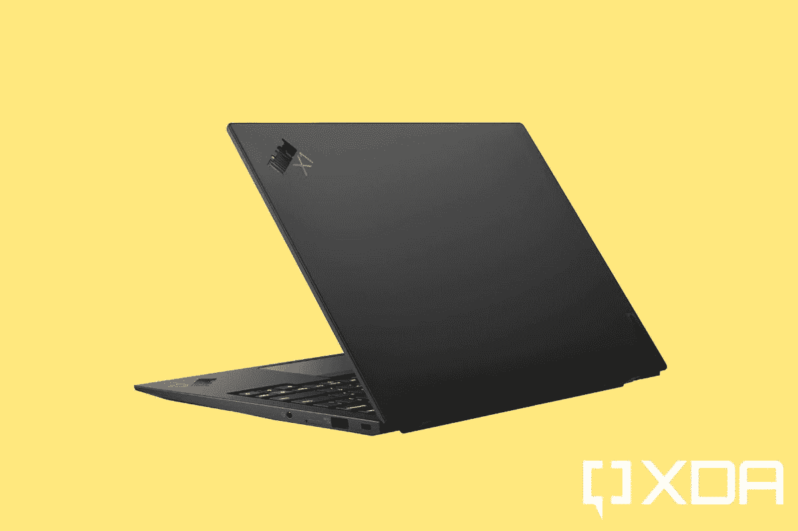

# 联想 ThinkPad X1 Carbon Review:大改进的赢家

> 原文：<https://www.xda-developers.com/lenovo-thinkpad-x1-carbon-review/>

联想的 ThinkPad X1 Carbon Gen 9 已经是最好的商务笔记本电脑之一。今年，它有一些实实在在的变化，真的把它放在首位。例如，它有一个更高的 16:10 显示屏。16:9 在很长一段时间内是笔记本电脑的标准，这种情况只会发生在电影是 16:9 的时候。现在，个人电脑行业正在向更高的屏幕回归。

它还将电源按钮带回键盘面板，并兼作指纹传感器。奇怪的是，它不像 ThinkBooks 上的那样是圆的。ThinkPad X1 Carbon 配备了英特尔新的第 11 代博锐处理器，这意味着它还配备了 Iris Xe 集成显卡、Thunderbolt 4、更快的内存等。

我们已经将 ThinkPad X1 Carbon Gen 8 称为[最佳商务笔记本电脑](https://www.xda-developers.com/best-laptops/#bestbusiness)，但联想的 Gen 9 确实将它提升了一个档次。

## 联想 ThinkPad X1 Carbon Gen 9:规格

| 

中央处理器

 | 英特尔酷睿 i7-1185G7 处理器(3.0GHz) |
| 

制图法

 | 英特尔 Iris Xe |
| 

显示

 | 14.0”:FHD+(1920 x 1200，多点触控，IPS，500 尼特，防眩光，16:10，100% sRGB，ThinkPad 隐私卫士) |
| 

身体

 | 315 x 221.6 x 14.9 毫米(12.4 x 8.72 x 0.59 英寸)，1.133 千克(2.49 磅) |
| 

记忆

 | 16GB LPDDR4x-4266(焊接) |
| 

储存；储备

 | 512GB M.2 2280 PCIe NVMe 固态硬盘 |
| 

港口

 | 1 个 USB 3.2 Gen 11 x USB 3.2 Gen 1(始终开启)2 个 Thunderbolt 4/USB 40 Gbps(数据、电源、显示屏)1 个 HDMI 2.01 x 耳机/麦克风组合插孔(3.5 毫米)1 个 Nano-SIM 卡插槽(WWAN 型号可选) |
| 

连通性

 | 英特尔 Wi-Fi 6 AX201，802.11ax 2x2 Wi-Fi +蓝牙 5.2 |
| 

照相机

 | IR & 720p，带隐私快门、定焦、人体感应 |
| 

投入

 | 6 排防泼溅多媒体 Fn 键、LED 背光 traNav 指点设备和玻璃表面多点触控触摸板 |
| 

声音的

 | 2 个 2W 和 2 个 0.8 瓦(杜比全景声) |
| 

安全性

 | 分立 TPM 2.0，TCG 认证，电源按钮上的片上匹配 FPR |
| 

电池

 | 57 瓦时，支持快速充电(1 小时 80%) |
| 

颜色

 | 黑色 |
| 

材料

 | 碳纤维(上)、镁合金(下) |
| 

操作系统（Operating System）

 | Windows 10 专业版 |
| 

价格

 | $2,477.30 |

请注意，ThinkPad 的价格可能会有变化。基本上，Lenovo.com 的价格运作方式是，有一些虚构的全价，但实际上从未使用过。总有一些交易会因您何时检查而有所不同。

## ThinkPad X1 Carbon 很轻，但它不会在端口上妥协

如果你熟悉 ThinkPad，那么你应该知道 ThinkPad X1 Carbon 有你想要的任何颜色，只要是黑色。联想送我的那款是平板黑，是经典设计。还有另一种黑色碳纤维编织设计，如果你想要更华丽一点的东西，那也不错。

但它不像某些 ThinkPads 那样让你在碳纤维和铝之间做出选择。这个是碳纤维的。这就是为什么它被称为碳。碳纤维是一种坚固的材料，同时也很轻，这使得它比重得多的铝更加突出。事实上，这款笔记本电脑仅重 2.49 磅。

这是不做任何妥协的情况下最轻的了。事实上，多年来，ThinkPad X1 Carbon 不仅是顶级的 ThinkPad，也是最轻的。现在，我们有了 ThinkPad X1 Nano，重量不到两磅。

所以问题是，为什么你会得到 X1 碳，而不是更轻的 X1 纳米？很明显，每一个都有优点和缺点，但 ThinkPad X1 Carbon 的一个关键优点是，它仍然具有您的企业可能需要的传统端口。

在右侧，有一个 USB 3.2 Gen 1 Type-A 端口和一个 3.5 毫米音频插孔。是的，尽管进行了重新设计和所有新的内部部件，联想仍然保留了 5Gbps USB 3.2 Gen 1 端口，而不是 10Gbps USB 3.2 Gen 2。

在左侧，你会发现两个 Thunderbolt 4 端口，另一个 USB 3.2 Gen 1 Type-A 端口和一个 HDMI 2.0 端口。 [Thunderbolt 4](https://www.xda-developers.com/best-thunderbolt-4-laptops/) 意味着你可以使用一个端口为两个 4K 显示器或一个 8K 显示器供电。你也可以用它来连接外部的 GPU。然而，这并不是 ThinkPad X1 Carbon 的升级版。这并不是说这个 Gen 9 模型有什么不好；这是第八代车型的优点。

[雷电 3](https://www.xda-developers.com/best-thunderbolt-3-laptops/) 可以做完全相同的事情，如果一个 OEM 使用完整的规格。虽然有一个最低规格，端口只能使用两个通道，所以你会得到 20Gbps 的速度，而不是 40Gbps。不幸的是，没有办法知道你实际得到了什么，因为几乎没有原始设备制造商很容易发现。作为一名评论者，我会把每台笔记本电脑都连接到两台 4K 显示器上。好消息是 ThinkPad X1 系列使用了全雷电 3。长话短说；这个港口与去年相比并没有升级。

联想 ThinkPad X1 Carbon Gen 9 是在去年的模型基础上重新设计的，但你看不出来。大多数 ThinkPads 看起来都一样，这是设计使然。

## 显示和音频:全新的 16:10 屏幕

这次展示可能是这次评论中最激动人心的部分。让我们从实际上的新内容开始。ThinkPad X1 Carbon 拥有 14 英寸 16:10 的显示屏，这是一件大事。它来自近年来的 14 英寸 16:9 屏幕，所以它现在更高，但没有那么宽。

这是我们在整个行业看到的趋势。更高的屏幕随处可见，包括微软 Surface 产品中的 3:2 屏幕，以及联想 ThinkPad X1 Titanium 和[惠普 Elite Folio](https://www.xda-developers.com/hp-elite-folio-first-impressions/) 。

因为数学，这也意味着不是所有的屏幕尺寸都是一样的。屏幕是对角测量的，因此 16:10 的 14 英寸比 16:9 的 14 英寸具有更大的表面积。越接近正方形，表面积越大。

现在，让我们来看看对我来说什么是新的，因为尽管审查了数十台联想电脑，这是它发给我的第一台带有隐私保护显示屏的电脑。整个想法是，它阻止人们越过你的肩膀看到你在做什么。这是我在很多惠普 EliteBooks 上检查过的一个功能，所以我很高兴看到联想采用这个功能。

很自然地，我不得不把 ThinkPad X1 Carbon 放在惠普精英版蜻蜓旁边，看看哪台的隐私显示屏更好。答案是惠普的最新 Sure View 确实反映了这一点，正如你从上面的图片中所看到的。惠普真的很关注这一点，因为它在几代人的时间里改进了产品。联想的隐私屏也很好，但它是不同的。很多时候，你可以在看不到文本的情况下看到屏幕上的内容，而不是让人看不到。

这两款产品还有一个奇怪的不同之处。惠普使用其中一个功能键打开 Sure View 隐私显示屏。联想要求你按下 Fn + D 来打开它。这对我来说很奇怪，因为如果你不知道键盘组合来打开它，你可能甚至不知道你有这个功能。

如果您使用隐私保护显示器，也需要做出妥协。即使关闭该功能，可视角度也不如普通屏幕。实际上有四种选择。有一个 400 尼特的非触摸面板，一个 400 尼特的触摸面板，一个 500 尼特的触摸隐私保护面板，和一个 500 尼特的 UHD 面板，支持杜比视觉 HDR。

这款显示器的边框比我们近年来看到的更窄，顶部边框包括一个 720p 网络摄像头和一个红外摄像头。是的，在居家办公的时代，它仍然有一个 720p 的网络摄像头，而不是 1080p，这是一个耻辱。

它还具有人类存在检测功能，听起来就是这样。当你坐在电脑前时，它会感应并唤醒你。当这种情况发生时，红外摄像头会亮起进行面部识别，它会让你无需触摸就能登录。它还可以在您离开时锁定您的电脑。

对于音频质量，联想 ThinkPad X1 Carbon Gen 9 实际上有四个扬声器，通过杜比 Atmos 进行调谐。键盘两侧都有 2W 扬声器。另外两个是放置在设备下方的 0.8W 高音扬声器。这种方法提供了 Dolby Atmos sound 闻名的清晰度、音量和整体质量。它非常适合从听音乐到电话会议的任何事情。

这通常是我会对笔记本电脑的流媒体功能发表评论的部分，但这感觉不像电影流媒体机器。有了隐私保护显示器，它真的是为注重隐私、在公共场所做大量工作的人而设计的。如果您正在寻找一台员工可以在一天结束时带回家看电影的商用电脑，您应该考虑其他屏幕选项。

## 键盘和触摸板:它有一个更宽的触摸板

如果你曾经使用过现代的 ThinkPad，那么你应该知道这里的键盘会带来什么。首先，这是 ThinkPads 久负盛名的品质。很舒服，也很准确。我没有发现自己用这个键盘犯任何错误。

按键是 1.5 毫米，这是联想在 ThinkPads 中使用了一段时间的按键。新的超薄设计，如 ThinkPad X1 Nano 和 ThinkPad X1 Titanium Yoga，已经将其降至 1.35 毫米，我认为当我们看到整个产品线时，这将是一个进步。虽然 1.5 毫米感觉不错，但 1.35 毫米更现代一些。总的来说，大多数原始设备制造商只是在使用更浅的键盘。

但是联想不喜欢用 ThinkPads 做改变。即使有，也是以非常缓慢的速度进行。每个 ThinkPad 在 G、H 和 B 键之间仍然有一个跟踪点。是的，这是一个 Windows 触摸板非常糟糕的时代的遗物。不过，它有自己的粉丝群。就我个人而言，我只是忽略它，但如果你喜欢它，它就在那里。

不过，它确实有一个精密的触摸板，上面还有三个物理按钮。这些按钮是为 TrackPoint 设计的，虽然我实际上会在触摸板上使用它们。这款机型的触摸板也更宽，这很好。我总是喜欢更大的触摸板，但它确实让按钮更加突出。它们真的很占地方。

另一件值得一提的事情是，电源按钮已经回到了键盘上。此前，它已被移到一边。它不再是几年前的圆形按钮，奇怪的是，考虑到它现在兼作指纹传感器。当你第一次按下它打开电脑电源时，它会扫描你的指纹，这样你就不必在它启动后再次触摸它。这是一个超级方便的功能。你只要按下按钮打开电脑，它就会让你登录。

## 性能和电池寿命:ThinkPad X1 的碳基准测试非常好

联想发给我的 ThinkPad X1 Carbon 包括一个英特尔酷睿 i7-1185G7 和 16GB 的内存。非常棒。这是我们在前几代产品中看到的相同系列的芯片，所以它仍然是为生产力而设计的。但它也打包了 96 个执行单元的 Iris Xe 图形。

这在商用电脑领域是一件大事。去年，当英特尔宣布其代号为 Ice Lake 的第十代处理器时，它是该公司第一个使用 10 纳米工艺的处理器。虽然英特尔已经推迟了 10 纳米工艺数年，但当它到达那里时，坦率地说，它不能生产大量的芯片。冰湖旁边是彗星湖，它使用的是自 Skylake 以来一直使用的 14 纳米架构。

Ice Lake 配备了 Iris Plus 显卡，其性能远远超过了英特尔过去提供的可笑的集成显卡。不幸的是，彗星湖仍然使用旧的 UHD 图形。

每台采用第十代处理器的商用电脑都使用 Comet Lake，因为英特尔从未开发过 Ice Lake 博锐处理器。

简单来说，第 11 代“老虎湖”比第 10 代“冰湖”有很大的改进，但比第 10 代“彗星湖”有很大的改进。这就是为什么这对于商用电脑来说更为重要。

这篇评论的所有照片都是在 Photoshop 中编辑的，Iris Xe 的额外功能是真实的。你可以感受到来自第 10 代的不同。此外，如果你实际上是一个正常人，并且来自更古老的时代，这种改善将是非常巨大的。您可以用它来玩 FHD 游戏、编辑视频等等。

对于基准测试，我使用了 PCMark 8、PCMark 10、Geekbench 和 Cinebench。

|  | 

ThinkPad X1 CarbonCore i7-1185G7

 | 

联想 Yoga Slim 7Ryzen 7 4800U (25W)

 | 

联想 ThinkBook 14s YogaCore i7-1165G7

 | 

[Surface Laptop 4 13.5](https://www.xda-developers.com/microsoft-surface-laptop-4-review/) 酷睿 i7-1185G7

 |
| --- | --- | --- | --- | --- |
| 

PCMark 8:主页

 | 4,532 | 4,566 | 3,851 | 4,331 |
| 

PCMark 8:创意

 | 4,910 | 4,861 | 4,861 | 4,777 |
| 

PCMark 8:工作

 | 4,144 | 3,926 | 4,083 | 3,925 |
| 

PCMark 10

 | 5,168 | 5,252 | 5,105 | 4,784 |
| 

极客工作台

 | 1,489 / 5,280 | 1,160 / 6,362 | 1,534 / 4,861 | 1,551 / 5,829 |
| 

电影院长凳

 | 1,303 / 4,224 |  | 1,455 / 4,820 | 1,295 / 5,194 |

就集成显卡的电脑而言，联想 ThinkPad X1 Carbon 在我测试过的英特尔电脑中名列前茅。唯一一台集成显卡性能更好的电脑是联想 Yoga Slim 7，配有 AMD 锐龙 7 4800U，处理器功率高达 25 瓦。事实上，如果你要记分的话，ThinkPad X1 Carbon 肯定表现不错。如果你不记分，那也没什么大不了的。您在这里获得的是英特尔 Tiger Lake 和 Iris Xe 性能，就像许多其他设备一样。

使用 ThinkPad X1 Carbon 时，电池寿命似乎无处不在。坦白地说，我不知道变量是什么。我可以花六个小时做常规工作。另一方面，有一次我在一个小时内耗尽了电池。在我的工作流程中也没有任何真正的变化。

## 该不该买一台联想 ThinkPad X1 Carbon Gen 9？

这是第九代 ThinkPad X1 Carbon。这是一款久经考验的真正产品，而且它已经因是周围最好的产品之一而闻名。如果我告诉你它很好，那大概是不言而喻的。我要说的是，联想选择了一个赢家，然后把它做得更好。

首先，这是不好的一面。电池寿命参差不齐，网络摄像头仍然是 720p。是的，我知道产品决策需要时间，但在在家工作的时代，一个 1080p 的网络摄像头真的很好。事实上，我敢打赌，明年的模型将有一个 FHD 摄像头。

现在，让我们谈谈所有的好处，因为今年的型号改进了很多。首先，有一个新的显示，是 16:10。我正在挖掘隐私保护面板，但也有 UHD 和常规 FHD 选项。大不了就是屏幕更大，不用做更大的机箱。还有一个更大的触摸板，我对此百感交集。我确实喜欢触摸板变大的任何时候，但它确实突出了物理按钮和它们占用的空间。不过，越大越好。

当然，表演非常精彩。它有一个酷睿 i7-1185G7 和 16GB 的内存，正如我们在许多设备中看到的那样。出于某种原因，这只是一个比所有这些更好的基准。挺酷的。

这些只是改进。它仍然不到 2.5 磅，像所有的 ThinkPads 一样通过了 MIL-STD-810G 认证，并且它拥有最好的键盘之一。这台电脑只是在另一个层面上。

 <picture></picture> 

Lenovo ThinkPad X1 Carbon Gen 9

##### 联想 ThinkPad X1 Carbon Gen 9

联想的高端商务笔记本电脑。它由碳纤维制成，超轻，而且全方位都很棒。