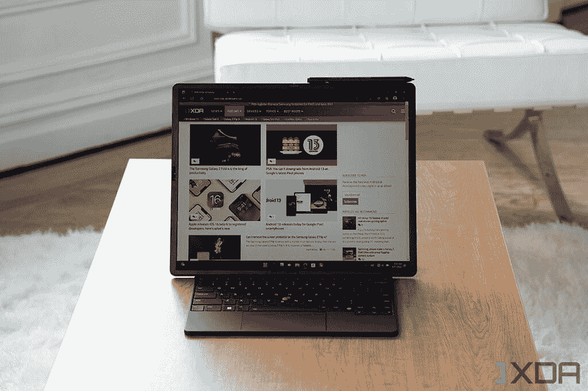
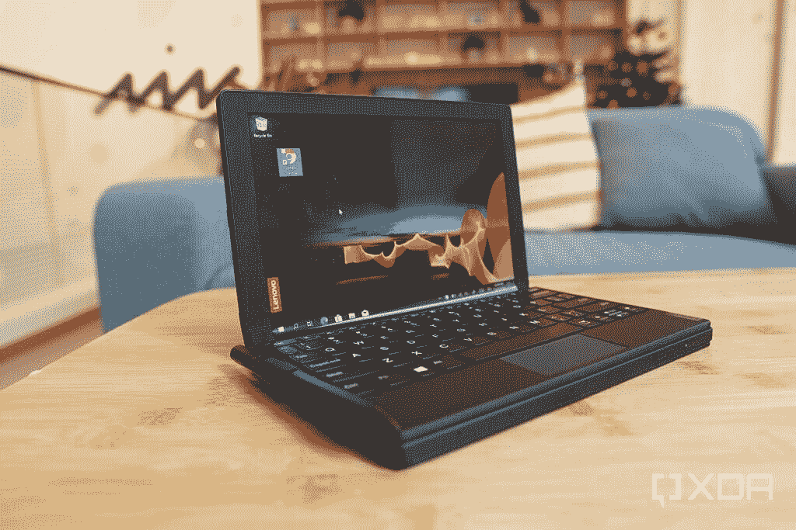
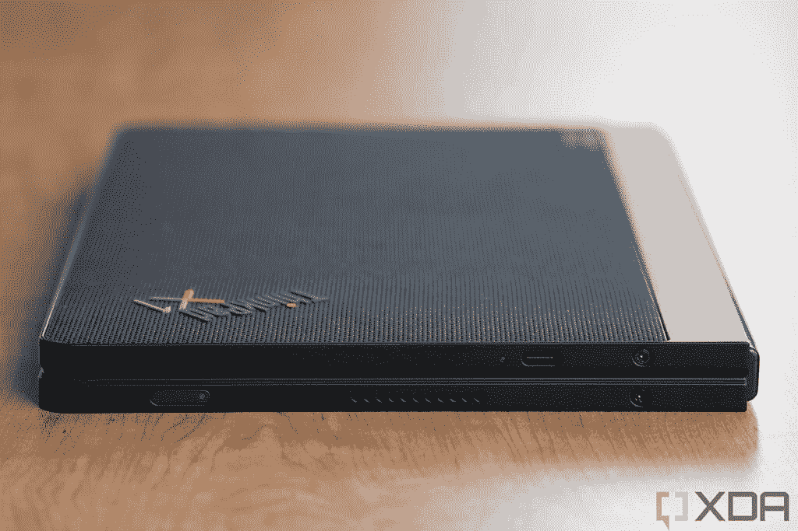
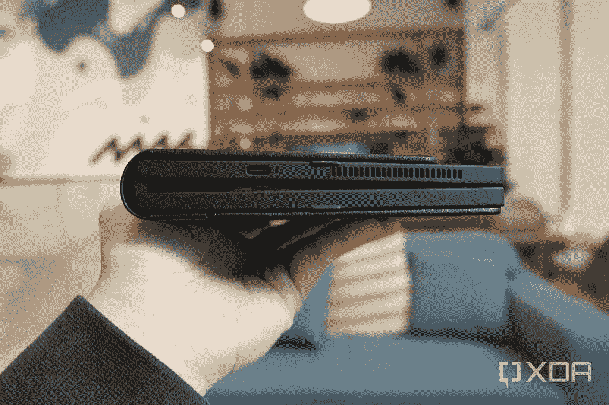
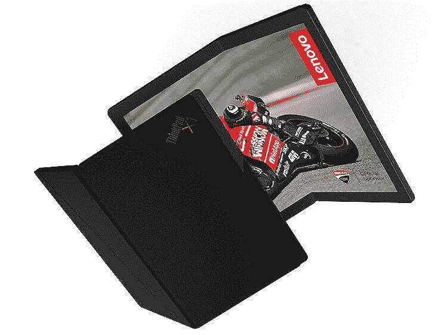

# 联想 ThinkPad X1 Fold Gen 2 vs ThinkPad X1 Fold Gen 1:一大飞跃

> 原文：<https://www.xda-developers.com/lenovo-thinkpad-x1-fold-gen-2-vs-thinkpad-x1-fold-gen-1/>

在 2020 年雄心勃勃但有点令人失望的可折叠笔记本电脑首次尝试之后，联想凭借 ThinkPad X1 Fold Gen 2 再次回归。这一次，该公司做了很多改进，使这一设备可以真正用于工作。需要明确的是，第一款 ThinkPad X1 Fold 并不可怕，但它显然是第一代产品，有很多缺点，这些缺点通常都是这种开创性的设备所具有的。那么我们来看看联想是如何对 ThinkPad X1 Fold Gen 2 相对于 Gen 1 机型进行改进的。

从改进的性能到更大更好的屏幕，差别是相当大的。然而，有一点没有变，那就是价格。就像最初的型号一样，这款新笔记本电脑的起价为 2499 美元，但当你考虑到已经做出的所有重大改进时，这实际上是一个更容易接受的价格。话虽如此，我们还是来对比一下吧。

**浏览这篇文章:**

## 联想 ThinkPad X1 Fold Gen 2 与 ThinkPad X1 Fold Gen 1:规格

|  | 

联想 ThinkPad X1 Fold Gen 2

 | 

联想 ThinkPad X1 Fold Gen 1

 |
| --- | --- | --- |
| **CPU** | 

*   最高可配第 12 代英特尔酷睿 i7 博锐处理器(U9 系列)

 | 

*   采用混合技术的英特尔酷睿 i5-l16g 7(7 瓦、5 个内核、5 个线程，最高 3GHz)

 |
| **图形** | 

*   英特尔 Iris Xe 显卡(最高 96 EUs，950MHz)

 | 

*   英特尔 UHD 显卡(64 个欧洲单位，500MHz)

 |
| **显示** | 

*   16.3 英寸有机发光二极管，2560 x 2024，4:3 宽高比，最高 600 尼特，HDR，杜比视界，100% DCI-P3，触摸，防脏
*   **折叠尺寸:** 12 寸

 | 

*   13.3 英寸有机发光二极管，2046 x 1536，4:3 宽高比，300 尼特，95% DCI-P3，触摸，防指纹
*   **折叠尺寸:** 9 寸

 |
| **存储** |  | 

*   256GB PCIe 4.0 NVMe 固态硬盘
*   512GB PCIe 4.0 NVMe 固态硬盘

 |
| **闸板** | 

*   最高 32GB 双通道 LPDDR5

 |  |
| **电池** | 

*   48 瓦时电池，可选附加 16 瓦时电池，具体取决于配置

 |  |
| **端口** | 

*   2 个 Thunderbolt 4(USB C 类)端口
*   1 个 USB Type-C 3.2 Gen 2
*   Nano-SIM 卡插槽(可选)

 | 

*   2 个 USB Type-C 3.2 Gen 2
*   Nano SIM 卡插槽(可选)

 |
| **音频** | 

*   三个带杜比全景声的扬声器
*   带杜比语音的四麦克风

 | 

*   配备杜比全景声的双 1W 扬声器
*   四声道麦克风

 |
| **摄像机** | 

*   500 万像素 RGB +红外摄像头，可选英特尔视觉传感控制器

 | 

*   500 万像素 RGP +红外混合摄像头

 |
| **生物认证** | 

*   指纹识别器(键盘上)
*   红外照相机

 |  |
| **连通性** | 

*   Wi-Fi 6E
*   蓝牙 5.2
*   **可选:** 5G sub-6GHz

 | 

*   英特尔 Wi-Fi 6 AX200 2x2
*   蓝牙 5.2
*   **可选:** 5G sub-6GHz

 |
| **颜色** |  |  |
| **尺寸(WxDxH)** | 

*   **展开:** 345.7 × 276.2 × 8.6 毫米(13.6 × 10.87 × 0.34 英寸)
*   **折叠****:**176.4 x 276.2 x 17.4 毫米(6.9 x 10.87 x 0.68 英寸)

 | 

*   **展开:** 299 × 235.6 × 11.3 毫米(11.77 × 9.28 ×0.44 英寸)
*   **折叠式** **:** 158 x 235.6 x 27.8 毫米(6.22 x 9.28 x 1.09 英寸)

 |
| **尺寸** | 

*   **系统:** 1.28 千克(2.82 磅)
*   **带键盘和支架的系统:** 1.9 千克(4.19 磅)

 | 

*   起始重量为 0.999 千克(2.2 磅)

 |
| **价格** | 起价 2499 美元 | 起价 2499 美元 |

## 性能:巨大的飞跃

查看上面的规格表，您可能会注意到联想 ThinkPad X1 Fold Gen 1 中的一些奇怪之处。该处理器的型号可能看起来不太熟悉，因为它是英特尔非常短命的处理器系列的一部分，称为 Lakefield。这些是为超薄设备和可折叠设计的，它们实际上是英特尔首次尝试沿着 Arm 处理器的路线创建东西，具有一个性能核心和四个高效核心。然而，性能严重不足——甚至性能核心也不支持超线程，最多只能提升到 3GHz。此外，7W 的 TDP，它只是不能很快。

 <picture></picture> 

The original ThinkPad X1 Fold

Lakefield 在一年内被彻底扼杀，但现在，随着第 12 代英特尔酷睿处理器的出现，混合架构得到了更广泛的应用，比以往任何时候都更好。联想 ThinkPad X1 Fold Gen 2 配备了 U9 系列处理器，这意味着它们具有较低的 9W TDP，但与 Gen 1 型号相比仍然是一个巨大的进步。这些处理器配备了多达 10 个内核和 12 个线程，它们可以提升到 4.7GHz，因此性能将远远超过第一款产品。看看下面的基准测试分数，看看有什么不同。

|  | 

英特尔酷睿 i5-L16G7(平均)

 | 

英特尔酷睿 i7-1250U( [参见测试](https://browser.geekbench.com/v5/cpu/15532825))

 |
| --- | --- | --- |
| **Geekbench 5(单核/多核)** | 756 / 1,624 | 1,385 / 4,006 |

需要明确的是，这是对英特尔酷睿 i7-1250U 的非常早期的测试(基准测试分数尚未广泛提供)，但如果有任何变化，平均分数应该会更好。就性能而言，这是一个巨大的飞跃，公平地说，英特尔酷睿 i5-L16G7 在当时已经是一个缓慢的处理器。事情只是变得更好了，所以这种巨大的差异并不令人惊讶。

ThinkPad X1 Fold Gen 1 可能只有 8GB 内存

在图形性能方面，您也会注意到这一点。2020 年，在 Lakefield 处理器已经推出之后，英特尔推出了 Iris Xe，这是一种新的处理器图形架构，在性能上有了很大的飞跃。与 U15 或 P 系列相比，U9 系列处理器具有较慢的英特尔 Iris Xe 版本，但这仍然比 Lakefield 所能提供的要好。

 <picture></picture> 

The Lenovo ThinkPad X1 Fold Gen 2

甚至这还不是结束。英特尔酷睿 i5-L16G7 的一个特殊限制是可以搭配多少内存。无论如何，它总是被限制在 8GB，所以即使联想想给你更多，它也不能。现在，有了常规的英特尔处理器，这种限制就不复存在了。联想 ThinkPad X1 Fold Gen 2 可以为您提供高达 32GB 的内存，因此多任务处理速度更快，更流畅，这是对 Gen 1 机型的又一次重大飞跃。基本上，ThinkPad X1 Fold Gen 2 现在在性能方面可以与[最好的 Windows 平板电脑](https://www.xda-developers.com/best-windows-tablets/)相媲美。

不过，存储容量与以前大致相同，两款笔记本电脑都宣称最大容量为 1TB(尽管最初的型号开箱后最高容量为 512GB)。不过在速度上还是有区别的，因为 ThinkPad X1 Fold Gen 2 已经升级到了 PCIe 4.0 固态硬盘，而不是 PCIe 3.0，这应该会带来更快的速度和更快的文件移动速度。

## 显示器和声音:更大、更亮、更好

当我们看到显示屏时，这些变化仍在继续，与之前的型号相比，显示屏也有了显著的改进。几乎每个方面都有改进。首先，当展开时，屏幕现在是 16.3 英寸的面板，这意味着当你折叠它时，你仍然可以在每一侧获得一个体面大小的 12 英寸屏幕。之前的型号有 13.3 英寸的显示屏，对折后屏幕为 9 英寸。

 <picture></picture> 

The original Lenovo ThinkPad X1 Fold

更大的屏幕可能会影响便携性，但它有一个很大的好处，特别是在笔记本电脑模式下，键盘覆盖了屏幕的下半部分。12 英寸的屏幕并不算大，但它符合像 [Surface Laptop Go 2](https://www.xda-developers.com/surface-laptop-go-2-review/) 这样的东西。对于很多人来说，9 英寸的屏幕几乎无法使用，所以这使得不同模式下的笔记本电脑更加可用。当然，展开时屏幕也更大，因此多任务处理变得更加可行。联想还精简了边框，因此设备本身不必太大。

为了配合尺寸的增加，联想还提高了显示屏的分辨率。我们已经从 2048 x 1536 到 2560 x 2024，这有助于屏幕保持像以前一样清晰。事实上，联想 ThinkPad X1 Fold Gen 2 的像素密度略高，约为 200 DPI，而 Gen 1 的像素密度为 193 DPI。

最重要的是，屏幕也更亮了。现在，它在 HDR 模式下可以达到 600 尼特(SDR 中为 400 尼特)，这是原始面板 300 尼特的巨大飞跃。有了这个新屏幕，室外的能见度将会好得多，而且有 HDR 的支持是非常受欢迎的。联想还吹嘘 DCI-P3 的覆盖率稍好，达到了 100%，所以也有所改善。

ThinkPad X1 Fold Gen 2 确保屏幕两侧始终有一个扬声器。

联想这次也改进了音响系统。现在，有三个扬声器，尽管在任何给定的时间，你仍然只能从两个扬声器获得音频。这三个扬声器可以根据您使用平板电脑的位置和模式，从不同的扬声器播放音频。这样，屏幕的每一侧总是有一个活动的扬声器，而在以前的型号中，使用两个扬声器时，立体声听起来可能会稍差一些。联想没有详细说明每个扬声器的功率，但最初的型号不是超级强大的，所以希望这也得到改善。

快速触摸网络摄像头，纸上没有太多的变化，因为这两款机型都有一个 500 万像素的摄像头，带有 RGB 和 IR 传感器。然而，新型号确实让您可以选择包括新的英特尔视觉感应控制器，它可以帮助相机根据您使用笔记本电脑的模式来调整其取景和方向，因此您总是看起来尽可能好。

## 设计:更重，但更薄

当然，由于屏幕明显更大，联想 ThinkPad X1 Fold Gen 2 必须比 Gen 1 版本更重，但这并不意味着联想没有试图将其瘦身，差异并没有你想象的那么大。就重量而言，最初的型号起始重量为 2.2 磅，第二代版本为 2.84 磅。这是一个明显的差异，但你必须预计到，当你从 13.3 英寸的屏幕转向 16.3 英寸的屏幕时。

 <picture></picture> 

Lenovo ThinkPad X1 Fold Gen 2

联想试图通过使 ThinkPad X1 折叠 Gen 2 比 Gen 1 版本薄得多来抵消这一点。现在，当打开时，它的厚度只有 8.6 毫米，而不是 11.3 毫米。当折叠时，它的厚度仍然只有 17.4 毫米，而原始型号的厚度高达 27.8 毫米。这是因为最初的模型不能完全折叠，所以它在铰链周围明显更厚。联想已经做了一些工作来重新设计铰链，以便设备在整个机箱上更加均匀和薄。

这种新款式没有用皮革，而是用了纺织面料。

笔记本电脑的外观和感觉也发生了变化。最初的型号带有金属底盘，然后被包裹在设备外部的真皮外壳所覆盖。然而，由于其尺寸和铰链的工作方式，当笔记本电脑折叠时，皮革无法覆盖整个外部，并且前面有一个“唇”。现在，联想选择了编织织物外壳，而不是单件，笔记本电脑的每一半都有自己的织物外壳，周围是金属框架，靠近铰链处更厚。

笔记本电脑的支架也得到了改进，允许您在以前所有相同的模式下使用它，但也是一种新的模式。现在，支架可以在纵向方向支撑屏幕，因此您可以获得一个大的垂直画布，用于阅读和其他类型的工作，使用垂直屏幕效果更好。

为了使事情更圆满，这次键盘和笔也有点不同。更大的屏幕尺寸意味着键盘也可以更大，所以按键不会那么拥挤，我们有了一个新的熟悉的东西-标志性的 TrackPoint。事实上，如果你喜欢红色的小块而不是触摸板，这款新机型给了你这个选择。此外，新型号不是内置在键盘上的笔环，而是让你将笔磁性地附着在平板电脑本身的边缘，所以它看起来有点干净。总的来说，已经有了大量的改进，使这成为一个更有吸引力的设备。

## 端口和连接:欢迎，Thunderbolt

最后说一下端口。最初的联想 ThinkPad X1 Fold 的设置非常糟糕，只有两个 USB Type-C 端口和一个可选的 nano-SIM 插槽。事实上，即使厚度为 11.3 毫米，耳机插孔也没有了，也许是因为处理器的速度太慢，Thunderbolt 支持也没有包括在内。这意味着你只能使用相对低速的端口，无法驱动更高级的办公系统。

 <picture></picture> 

Lenovo ThinkPad X1 Fold Gen 1

ThinkPad X1 Fold Gen 2 仍然不完美，但现在，你得到了三个 USB Type-C 端口，其中两个支持 Thunderbolt 4。这意味着每个端口的总带宽为 40Gbps，让您可以连接两个 60Hz 的 4K 显示器或其他高速外设。额外的 USB-C 端口还可以确保无论您在什么位置使用笔记本电脑，都至少有两个空闲端口。

至于无线连接，事情以一种非常典型的速度发展，所以变化并不大。你现在得到了 Wi-Fi 6E 支持，所以你可以用新的 6GHz 频段获得更快的速度，但在其他方面，它相当相似。你可以获得蓝牙 5.2 支持和可选的低于 6GHz 的 5G 支持，没有毫米波选项可用。不过，这是基于英特尔技术的笔记本电脑的标准业务，只有采用高通芯片的设备通常支持毫米波 5G。

## 联想 ThinkPad X1 Fold Gen 2 vs ThinkPad X1 Fold Gen 1:最终想法

对于任何新一代产品，你总会期望它会更好，但联想真的超越了这一点。几乎这个设备的每个方面都有了显著的改进。性能更好，显示屏更大，更亮，更清晰，设计更加灵活和精简，同时也明显更薄。

最初型号的唯一潜在优势是便携性，但这种便携性是以对折时拥有一个 9 英寸的小显示屏为代价的。对于许多人来说，这基本上是不可用的，所以很容易说它可能不值得。

 <picture></picture> 

ThinkPad X1 Fold Gen 2

与大多数可折叠产品一样，可能有许多粉丝希望第二代产品能够降价。但当你看到这款车型的主要改进时，保持相同的价格仍然是整体价值的巨大增长。此外，自 2020 年以来，组件只会越来越贵，因此保持低价格现在比那时更难。联想 ThinkPad X1 Fold Gen 1 的价格为 2499 美元，这是不可能的，但对于 Gen 2 机型，它有一些令人信服的理由。ThinkPad X1 Fold Gen 2 实际上可能是本年度最佳笔记本电脑之一。

我们肯定会建议等待联想 ThinkPad X1 Fold Gen 2 的推出，但如果你想购买上一代机型，联想一直以低得多的价格出售它。如果你想在它完全消失之前抓住它，你可以看看下面。

 <picture></picture> 

Lenovo ThinkPad X1 Fold Gen 2

##### 联想 ThinkPad X1 Fold Gen 2

联想 ThinkPad X1 Fold Gen 2 配备了更大的屏幕、更快的处理器和许多其他改进。

 <picture></picture> 

Lenovo ThinkPad X1 Fold Gen 1

##### 联想 ThinkPad X1 Fold Gen 1

联想 ThinkPad X1 Fold 是世界上第一款可折叠 PC。它有一些缺点，特别是性能，但它仍然是一个独特的硬件。