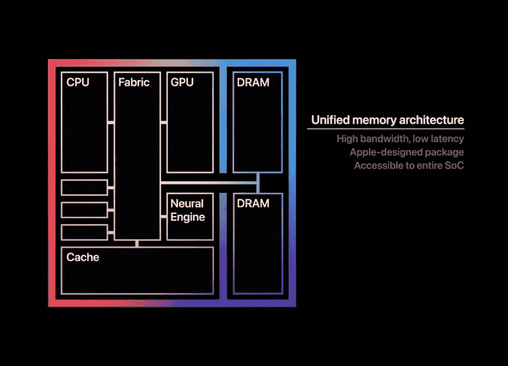
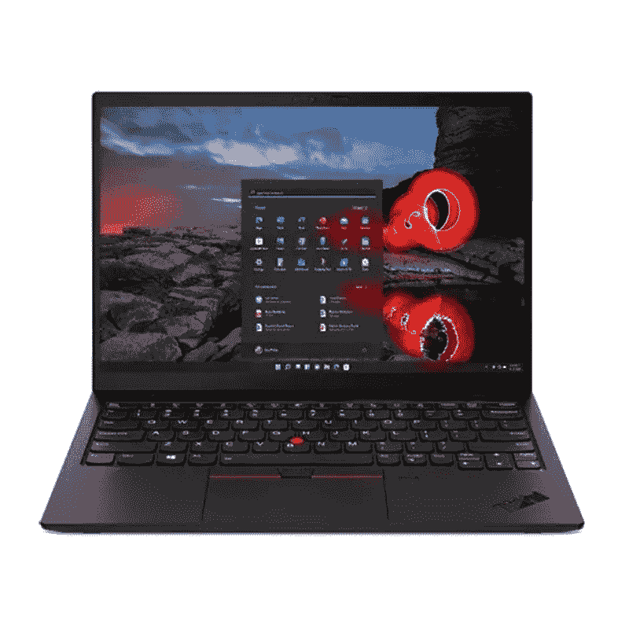

# 联想 ThinkPad X1 Nano Gen 2 vs MacBook Air:哪个更好？

> 原文：<https://www.xda-developers.com/lenovo-thinkpad-x1-nano-gen-2-vs-macbook-air/>

与 X1 Carbon 和 X1 Yoga 等更具标志性的机型相比，联想 ThinkPad X1 Nano 相对较新。该公司最近发布了 X1 Nano 的更新版本，我们认为这是目前市场上最好的轻薄商务笔记本电脑之一。联想现在正在为这款特殊的笔记本电脑使用英特尔新的第 12 代博锐处理器，使其成为更强大的选择之一。但是和市面上其他一些轻薄笔记本相比如何呢？在本文中，我们将看看联想 ThinkPad X1 Nano Gen 2 与 MacBook Air 的对比，看看哪个更好。

**浏览这篇文章:**

## 联想 ThinkPad X1 Nano Gen 与 MacBook Air:规格

在我们开始比较之前，让我们快速浏览一下每款笔记本电脑的规格，了解它们各自的特点:

| 

规格

 | 

**联想 ThinkPad X1 Nano Gen 2**

 | 

**苹果 MacBook Air 搭配 M1**

 |
| --- | --- | --- |
| **CPU** | 

*   最高可配第 12 代英特尔酷睿 i7 博锐处理器、U 和 P 系列处理器，最高可配 14 个内核

 | 

*   苹果 M1 (8 核，最高 3.2GHz)

 |
| **图形** | 

*   英特尔 Iris Xe 显卡(最高 96 个欧洲单位)

 |  |
| **闸板** |  | 

*   高达 16GB 的统一内存

 |
| **存储** |  | 

*   256 GB 固态硬盘
*   512GB 固态硬盘
*   1TB 固态硬盘
*   2TB 固态硬盘

 |
| **显示** | 

*   13 英寸 2K (2160 x 1350) 16:10，450 尼特，100% sRGB，杜比视界
*   13 英寸 2K (2160 x 1350) 16:10 触摸屏，450 尼特，100% sRGB，杜比视界

 | 

*   13.3 英寸 LED 背光显示屏(2560 x 1600) 16:10，采用 IPS 技术，非触摸，400 尼特，True Tone 技术

 |
| **电池** | 

*   49.6 瓦时电池
*   65W USB Type-C 电源适配器

 |  |
| **港口** | 

*   2 个 Thunderbolt 4(USB Type-C)3.5 毫米耳机 jackNano SIM 卡插槽

 | 

*   2 个 USB 4 / Thunderbolt (USB-C)
*   3.5 毫米耳机插孔

 |
| **音频** | 

*   杜比 Atmos 扬声器系统
*   360 度四阵列麦克风

 | 

*   支持杜比全景声的立体声扬声器
*   3 麦克风阵列

 |
| **网络摄像头** | 

*   1080p 全高清 RGB 网络摄像头
*   1080p 全高清 RGB +红外网络摄像头
*   具有计算机视觉功能的 1080p 全高清 MIPI RGB +红外网络摄像头

 |  |
| **安全** | 

*   Windows Hello:
    *   指纹读取器
    *   红外摄像机(可选)
    *   隐私保护显示屏(可选)
    *   网络摄像头快门
    *   瓷砖就绪

 | 

*   电源按钮里的触控 ID

 |
| **连通性** | 

*   英特尔无线 6E
*   蓝牙 5.2
*   蜂窝选项:
    *   5G sub-6 Cat2o
    *   4G LTE Cat16

 |  |
| **尺寸(WxDxH)** | 

*   非触控:293.2 x 208 x 14.47 毫米(11.5 x 8.19 x 0.57 英寸)
*   触摸:293.3 x 208.1 x 14.77 毫米(11.5 x 8.19 x 0.58 英寸)

 | 

*   304.1 × 212.4 × 16.1 毫米(11.97 × 8.36 × 0.63 英寸)

 |
| **重量** | 

*   起始重量为 970 克(2.13 磅)

 |  |
| **价格** |  |  |

## 表演

M1 可能不再是苹果硅芯片阵容中最强大的芯片，但它仍然比其他 Windows 笔记本电脑表现更好。它在性能和功效之间取得了良好的平衡。M1 提供了比当时英特尔的第 11 代芯片更好的性能。它成功做到了这一点，同时单次充电的续航时间更长。

然而，新的 ThinkPad X1 Nano Gen 2 由英特尔新的[第 12 代博锐处理器](https://www.xda-developers.com/intel-12th-gen-alder-lake/)而不是第 11 代芯片驱动。ThinkPad X1 Nano Gen 2 最高可以购买 14 核 P 系列芯片，对于轻薄笔记本来说相当强大。其实用第 12 代 U 系列芯片也能得到。U 系列和 P 系列处理器现在都有一个混合架构，结合了高性能内核和高效内核。

我们通常使用 Geekbench 基准测试数字来突出我们还没有机会完全测试的机器之间的性能。虽然 Geekbench 的数字会让你对这些机器的性能有所了解，但它并没有描绘出全貌。以下是 P 系列和 U 系列处理器的一些比较示例:

|  | 

英特尔酷睿 i7-1280P( [参见测试](https://browser.geekbench.com/v5/cpu/13331030))

 | 

英特尔酷睿 i7-1265U( [参见测试](https://browser.geekbench.com/v5/cpu/12860514))

 | 

英特尔酷睿 i5-1250P( [参见测试](https://browser.geekbench.com/v5/cpu/13897072))

 | 

英特尔酷睿 i5-1245U( [参见测试](https://browser.geekbench.com/v5/cpu/13777559))

 | 

苹果 MacBook Air(普通)

 |
| --- | --- | --- | --- | --- | --- |
| Geekbench 5 分数 | 1,790 / 9,312 | 1,232 / 6,336 | 1,522 / 9,142 | 1,560 / 5,414 | 1,705 / 7,417 |

看看 Geekbench 5 以 CPU 为中心的基准测试，可以肯定地说，在以 CPU 为中心的工作负载方面，苹果 M1 芯片能够保持一般的性能。然而，第 12 代英特尔 P 系列芯片在多核测试中令人信服地击败了 M1。但 M1 似乎比英特尔的 U 系列处理器表现更好，至少在这些测试中是这样。值得指出的是，在 ThinkPad X1 Nano Gen 2 上运行该测试时，我们可能会看到不同的分数，因为机箱和散热性能在决定笔记本电脑的整体性能输出方面也起着巨大的作用。

除了 CPU 性能，还有其他需要考虑的事情，比如 M1 的图形处理器和统一内存。你可以期待 M1 的 GPU 性能主宰英特尔的 Iris Xe 显卡。我们已经看到许多创意专业人士使用 MacBook Air 来完成基本的内容创作任务，这令人印象深刻。即使是 7 核 GPU 模型也应该比英特尔芯片提供的更快。虽然英特尔在图形方面做了一些改进，但我们认为在这方面还有更多工作要做。

至于内存，我们正在考虑 ThinkPad X1 Nano Gen 2 笔记本电脑上高达 32GB 的 LPDDR5 内存。另一方面，MacBook Air 只能购买最高 16GB 的内存。然而，值得注意的是，M1 芯片使用统一内存技术，这意味着你可以期待看到更快的速度和更低的延迟，因为 RAM 模块被烘焙到主芯片中，更靠近 CPU 和 GPU 单元。统一内存还意味着 M1 图形处理器使用相同的内存来处理图形工作负载。

在我们更多地谈论其他事情之前，我们认为现在是讨论电池寿命的好时机。两款笔记本电脑内部都有大约 50 瓦时的电池，但我们认为 MacBook Air 一次充电的续航时间更长。这是因为与英特尔第 12 代芯片相比，M1 芯片提供了更高的性能功耗比。还有其他因素导致更长的电池寿命，包括统一的内存、与 macOS 更好的硬件和软件集成等等。

 <picture></picture> 

Unified Memory Architecture on Apple's M1 chip

## Windows 还是 macOS？

影响您选择这些笔记本电脑的最大因素之一是操作系统。当然，其他因素如性能、设计等。也很重要，但操作系统也是一个重要的决定因素。如果你习惯使用 Windows，那么你会更喜欢使用 ThinkPad X1 Nano Gen 2 笔记本电脑。它开箱即可运行 Windows 11，这很棒。另一方面，苹果的 MacBook Air 运行在 macOS Monterey 上。

你可能已经知道，Windows 是世界上最流行的操作系统之一，我们认为它是大多数用户的最佳选择。它还适用于各种用例，可以轻松处理任何事情。众所周知，macOS 对初学者来说非常直观，所以如果这是你的第一台笔记本电脑，MacBook Air 是个不错的选择。得益于 Final Cut Pro、Adobe Photoshop、Premiere 等应用程序，这款特殊的操作系统也非常适合内容创作者。

我们认为，这个决定可以归结为个人喜好。但如果你不是特别倾向于某个操作系统，那就考虑一下苹果的 MacBook Air 和 macOS。

## 显示

ThinkPad X1 Nano 和苹果 MacBook Air 都有 13 英寸的面板。我们也在寻找非常相似的屏幕分辨率。虽然 ThinkPad X1 Nano 配备了 2160 x 1350 分辨率的面板，但 MacBook Air 配备了采用 IPS 技术的 2560 x 1600 分辨率的显示屏。苹果 MacBook Air 和 ThinkPad X1 Nano Gen 2 都采用了 16:10 的面板，尽管 MacBook Air 上使用的面板分辨率略高。也就是说，你不太可能注意到清晰度的差异。

我们以前在其他比较中说过这一点，但再次值得指出的是，16:10 对生产力非常有益。如果你是，你需要更少的滚动，比如说滚动网页或编辑文档。在媒体消费方面，这两款笔记本电脑一定会给你带来不错的体验。ThinkPad X1 Nano 还有一个触摸屏，这是 MacBook Air 所没有的。这两款笔记本电脑还配有支持杜比全景声的立体声扬声器，因此将进一步提升媒体消费体验。

ThinkPad X1 Nano 和苹果 MacBook Air 笔记本电脑的显示屏顶部都有一个网络摄像头。然而，ThinkPad X1 笔记本电脑上的网络摄像头质量预计会更好，因为我们看到的是 1080p 摄像头。MacBook Air 的高清 FaceTime 摄像头还不错，但我们认为 ThinkPad X1 Nano 的 FHD 摄像头会更好。您还可以获得带有红外摄像头的 ThinkPad X1 Nano，用于 Windows Hello 身份验证。

## 设计和端口

联想 ThinkPad X1 Nano 和 MacBook Air 笔记本电脑都具有轻薄的外形，但 X1 Nano 比 MacBook 略薄，非触摸和触摸版本的厚度分别为 14.47 毫米和 14.77 毫米。苹果的 MacBook Air 最厚处为 16.1 mm。ThinkPad X1 Nano 也比 MacBook Air 轻。苹果的 MacBook Air 曾经是最轻的笔记本电脑，但自那以后，许多 Windows 电脑变得越来越好。ThinkPad X1 Nano 仅重 970 克，而 MacBook Air 重 1.29 千克。

就外观而言，ThinkPad X1 Nano 看起来像其他 ThinkPad 笔记本电脑一样，采用标准的黑色机箱。你还可以得到 ThinkPad 标志性的 TrackPoint 和触控板，这些年来我们已经越来越喜欢它们了。ThinkPad 上的触控板旁边还有一个指纹扫描仪，非常方便。多年来，MacBook Air 的设计也保持不变。MacBook Air 有三种颜色可供选择，整体看起来都很棒。MacBook Air 的设计没有什么真正令人兴奋的地方，但它非常简洁，对很多用户来说都很好用。

就端口选择而言，ThinkPad X1 Nano 和 MacBook Air 都有相同的端口集。我们正在考虑每台笔记本电脑上的两个 USB Type-C Thunderbolt 4 端口以及一个 3.5 毫米耳机插孔。ThinkPad X1 Nano 也配有 nano-SIM 卡插槽，但 MacBook Air 上没有。值得一提的是，MacBook Air 上的 Thunderbolt 端口不如联想 ThinkPad X1 Nano 上的端口通用。例如，MacBook Air 没有外部 GPU 支持，你只能连接一个外部显示器。另一方面，ThinkPad X1 Nano 可以处理更多的显示器，甚至支持外部 GPU。也就是说，这两款笔记本电脑都缺少一些必要的端口，包括 HDMI 端口、SD 读卡器等。如果这些端口不足以满足您的使用情况，您可能需要考虑看看其他笔记本电脑。

两款笔记本电脑在无线连接方面非常相似。ThinkPad X1 Nano Gen 2 支持 Wi-Fi 6E，而 MacBook Air 只支持 Wi-Fi 6。不过，它们都支持蓝牙 5。ThinkPad X1 Nano Gen 2 支持 5G 和 4G LTE 蜂窝选项，而 MacBook Air 不支持。因此，如果蜂窝连接是你想要的下一台笔记本电脑，那么选择是显而易见的。

## 联想 ThinkPad X1 Nano Gen 2 vs MacBook Air:该买哪个？

正如我们前面提到的，选择这些笔记本电脑时要考虑的最大因素可能是操作系统。Windows vs macOS 是非常主观的，只有你自己才能挑选出适合你用例的。也就是说，这两种操作系统都会给你带来很好的体验。

不过，ThinkPad X1 Nano 确实在几个关键领域击败了苹果 MacBook Air。它比 MacBook Air 更便携，因为它比 MacBook 更薄更轻。您还可以选择 ThinkPad 的触摸板，这非常适合商用笔记本电脑。英特尔的第 12 代博锐处理器也比苹果的 M1 芯片更快，但是您可能会注意到在基准应用程序之外的许多性能差异。我们不能对 ThinkPad X1 Nano Gen 2 的电池寿命发表评论，因为我们没有使用过它，但由 M1 驱动的 MacBook Air 可能会持续更长时间。

不过，这并不是说 MacBook Air 比 ThinkPad X1 Nano 没有优势。您可以获得更清晰的显示、更好的图形性能以及适合大量用户的最小化设计。正如我们之前提到的，如果你不是特别倾向于任何操作系统，那么看看 macOS 可能是值得的。比起 Windows，你很有可能更喜欢使用 macOS。

 <picture></picture> 

Lenovo ThinkPad X1 Nano

##### 联想 ThinkPad X1 Nano

联想 ThinkPad X1 Nano 采用英特尔全新第 12 代博锐处理器。

 <picture></picture> 

Apple MacBook Air (2020)

##### 苹果 MacBook Air (M1，2020 年)

MacBook Air 采用苹果的 M1 芯片，运行 macOS Monterey 操作系统。

如果你对这些笔记本电脑都不感兴趣，那么一定要看看我们收集的[最佳商务笔记本电脑](https://www.xda-developers.com/best-business-laptops/)。或者，你也可以查看收集的[最佳 MAC 电脑](https://www.xda-developers.com/best-macs/)和[最佳 ThinkPad 笔记本](https://www.xda-developers.com/best-thinkpads/)，找到更多选择。