# ThinkPad X1 Titanium 和英特尔的 UP4 芯片如何重新定义笔记本电脑

> 原文：<https://www.xda-developers.com/lenovo-thinkpad-x1-titanium-nano-interview/>

去年年底，联想推出了 ThinkPad X1 Nano，这是其高端 X1 家族的最新成员。它似乎是 ThinkPad X1 Carbon 的一个更薄更轻的版本。这也很奇怪，因为碳本来就应该是这个家族中又薄又轻的成员。

然后在 CES 上，该公司走得更远。ThinkPad X1 Titanium 上市了，ThinkPad X12 可拆卸，自 2018 年的 ThinkPad X1 平板电脑以来一直没有可拆卸产品。钛看起来像是由钛制成的 ThinkPad X1 Yoga，具有 3:2 的显示屏。没什么大不了的，对吧？

我大错特错了。ThinkPad X1 Nano 和 ThinkPad X1 Titanium Yoga 最终成为市场上我最喜欢的两款电脑。它们不仅仅是碳和瑜伽的改良版。这些都是全新的，解决了真正的痛点，释放了我们以前在计算机上从未见过的新功能。

 <picture>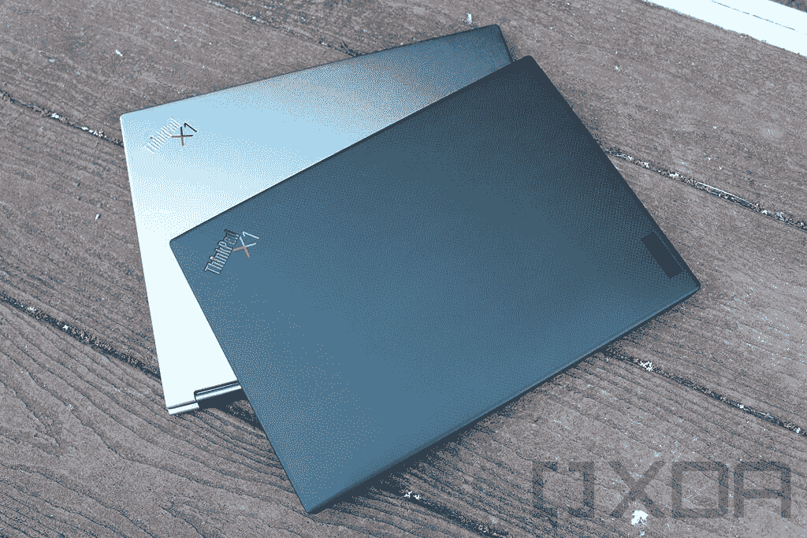</picture> 

ThinkPad X1 Nano on top, Titanium Yoga on the bottom

我们以前从未见过它，因为这是不可能的。这些[笔记本电脑](https://www.xda-developers.com/best-laptops/)中的 CPU 来自 Tiger Lake UP4 家族，是 Y 系列的继任者。如果你熟悉 Y 系列笔记本电脑，那么你会知道他们不是很好。这改变了。

在回顾了 ThinkPad X1 Nano、ThinkPad X1 Titanium 和 ThinkPad X1 disable 之后，我只剩下一个问题:为什么*没有人*谈论这个？在我看来，这是我们十年来在个人电脑领域看到的最伟大的创新之一。

就在那时，我决定要与联想和英特尔讨论此事。当我与联想对话时，我采访了托马斯·巴特勒、大卫·米德尔顿和亚当·霍维斯。

* * *

## 联想就 ThinkPad X1 Nano 和 X1 Titanium Yoga 采访托马斯·巴特勒、大卫·米德尔顿和亚当·霍维斯

**Rich:** 我想问大家关于 X1 Titanium、X1 Nano 和 X12 disable 的问题，因为这些产品感觉像是一个家族的产品。我觉得在某个时候，你可能会做出一些决定，想要做出非常酷、薄且轻的东西；你设计了翻盖手机、敞篷手机和平板电脑。你能告诉我你们是从什么时候开始做这件事的吗？

托马斯·巴特勒:我马上就来。我们拥有产品，基本上从概念到生命的终结。你在和我们三个人说话。大卫和亚当是男生。我总是挡在你前面，阻止你进入真正的团队。我们今天要做的就是给你一个低低的入口。这和你刚才描述的没什么不同。基本上，我们三个人坐在一起喝啤酒，然后有一天决定，让我们做一个薄，轻，性感的可拆卸。我会给你一点背景，让大卫来补充真实的故事。

 <picture>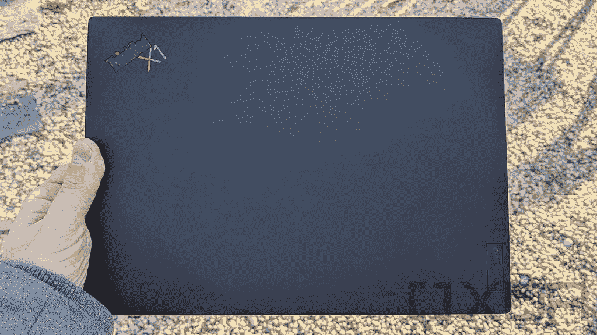</picture> 

ThinkPad X1 Nano

但是，当你谈到超便携的时候，我总是觉得碳应该是这样的，最近它的重量是 2.49 磅。然后，你更进一步，用 ThinkPad X1 Nano 减轻了两磅。本周晚些时候，我还将与英特尔会谈，因为那里的芯片组使这成为可能，因为这在以前是不可能的。不过，我想了解这个故事的两个方面。我想和你们谈谈个人电脑的设计及其背后的故事，然后我会和他们谈谈芯片。

**Thomas:** 如果你后退一步，回顾一下历史，看看我们在这些平台上所处的位置，如果你想想 ThinkPad 代表着什么，我们会不断地审视我们是如何发展和创新的。几十年来，我们已经有了各种尺寸、屏幕尺寸和不同的移动性。其中一个问题是，我们如何满足一些客户需求、新的用户体验以及向更移动的平台发展的趋势，然后在这些使用案例上进行重大创新？

我将使用 X1 碳，因为你提到了它，它实际上是一个很好的例子。我们将迎来这一平台的十年，它甚至从 X300 开始，最终成为 X1 Carbon。有了这个平台，我们希望它成为超便携的表现，但同时拥有所有的功能和端口，拥有全尺寸 USB-A、全尺寸 HDMI 等。这在一定程度上限制了它。顺便说一句，我很喜欢。2.4 磅，我称之为“围绕它的所有厨房水槽”。

每年，如果我在这个平台上工作 10 代，我们都在扭转局面。我们变得更薄、更轻、电池寿命更长、性能更高。每一年，它都是在最初概念的基础上的一个增量，也就是完整的厨房水槽，然后你就可以开始了。然后，如果你退后一步，看看这个市场，坦率地说，它是在 COVID 之前的市场，尽管在我们经历这一过程时，我们将谈论 COVID 如何没有损害这一点，但我们看了看我们如何进一步表达移动声明，我们正在排队与几件事。

首先是 5G 和平台的结合，这将是更高的带宽，总是连接的设备。正如你所提到的，我要感谢英特尔，他们已经在 14 纳米平台上发展了好几代了。他们正在向这个第 11 代 10 纳米平台看齐，我们能够获得更小的主板，采用更小的封装，这样我们就可以扩展它。

 <picture>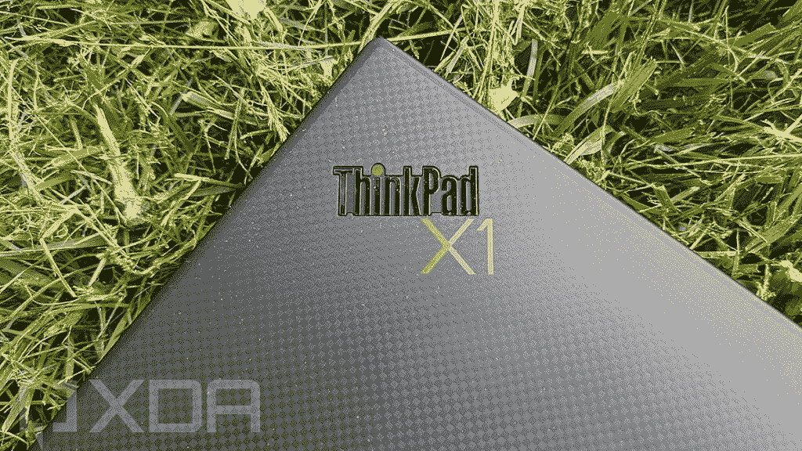</picture> 

ThinkPad X1 Nano

有了 ThinkPad X1 Nano，我们如何在一个超级移动平台中实现碳排放并真正表达出来？这是两件，第三件是 16:10 展示的回归。如果你想一想显示器的尺寸和比例，几年前，我们很不情愿地转向了 16:9。十多年来，我们一直采用 4:3 的比例，当我们采用宽屏时，我们采用了 16:10，因为我们觉得这是合适的屏幕尺寸、合适的高度和合适的工作平台。

然后消费电视出现了，每个人都想要宽屏电视。一般市场会说，我想要宽屏，因此行业内有一股巨大的力量推动宽屏显示器的发展，这对于内容消费来说非常好。然后，面板制造商最终，因为规模和他们必须在电视上做的制造，不情愿地降低到笔记本电脑的 16:9。因此，我们是最后一批坚持搬迁的公司之一，所以当它重新开放以达到 16:10 的面板时，当我说重新开放时，因为我要运送数百万台[ThinkPad](https://www.xda-developers.com/best-thinkpads/)，所以我必须确保我的规模正确。

**里奇:**我们在整个行业都看到了这种情况。你认为为什么会突然发生转变？认为微软与此有关，因为他们已经推动 3:2 有一段时间了？

**Thomas:** 我们认为 16:10 的宽高比最终是笔记本电脑的正确表现，我认为部分原因是市场的普遍推动和对用户选择的要求。这与说‘这是你将要得到的，这是你的下一个’相反。这有助于对这三个区域进行三角测量，最终得到 16:10 13 英寸，这基本上是 14 英寸 16:9 的高度。在超移动平台的表现中，我得到了巨大的可用屏幕。我想给你一个历史背景来理解。David、Adam 和我经常与客户交谈，查看客户评论、论坛，并建立反馈机制，我们正在推动该机制，以了解我们可以做得更好的地方，以及我们下一步可以努力的地方。

我们如何改进世代，而且我们如何处理新的用例？ThinkPad X1 Nano 就是其中之一；Titanium 是我们稍后将讨论的另一个产品，当您在寻找我们设计的使用案例时，我们将讨论如何进入市场并推出我们认为确实符合要求的产品。

* * *

我想知道的另一件事是，为什么 ThinkPad X1 Nano 和 ThinkPad X1 Titanium Yoga 之间的事情如此不同。这两台笔记本电脑显然出自同一家族，一台翻盖式，一台敞篷式。但是，联想仍然在一个产品中使用了钛，在另一个产品中使用了碳纤维，在一个产品中使用了触觉触摸板，等等。

* * *

**Rich:** 现在，说到针对不同市场和使用案例的设计，您提到的两款产品有一些不同的决策。ThinkPad X1 Nano 上有一个 16:10 的显示屏，Titanium Yoga 上有一个 3:2 的显示屏，X12 可拆卸上有一个 3:2 的显示屏。你想谈谈这个吗？

**大卫·米德尔顿:**大家好，我是大卫。我和我的团队负责规划产品组合和前端，在产品线上工作。所以，我想一至三年后。

当你看到这些时，正如 Tom 提到的，我们真的希望 X1 线超过 16:9，回到 16:10。当我们特别关注 X1 Titanium 和 X12 disable 时，这些产品正试图为那些真正喜欢平板电脑产品用例的人解决问题，当你在纵向和横向模式之间切换时，那些更窄更高的屏幕会工作得更好。3:2 纵横比确实最适合那些产品的用例。一些可分离的用户没有使用这种体验；他们说他们不拆产品。他们喜欢轻薄，喜欢 3:2 的长宽比。他们中的很多人就是不拆键盘。因此，对于这款产品，我们将它做得非常薄，为那些主要使用键盘的用户提供了更适合平板电脑的宽高比屏幕，然后你将它翻转过来，无论你是在纵向还是横向模式下，都可以看到平板电脑的使用情况。

 <picture>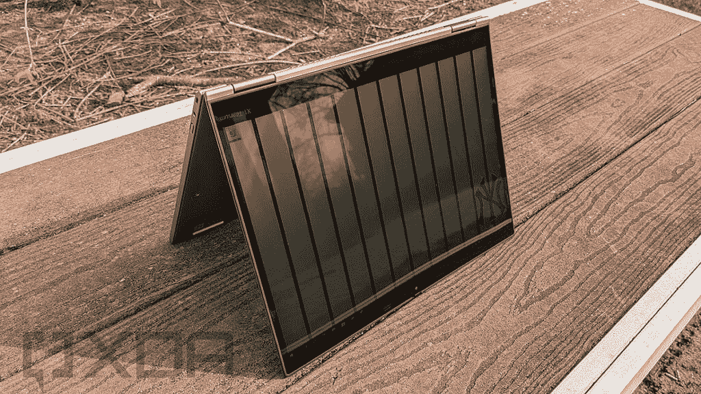</picture> 

ThinkPad X1 Titanium Yoga

**Rich:** 那个钛金属当平板用起来太舒服了，几乎比 Surface Pro 什么的都舒服。我不知道为什么握着感觉如此自然。是个好产品。

**Thomas:** 拿着一张纸，13.5 英寸的 3:2 是有原因的，因为如果你考虑一下平板电脑的用例，它基本上是一张 8.5x11 或 A4 纸。您只需拿起笔，就已经针对平板电脑的使用情况进行了优化。我们喜欢你将它折叠起来——我们的 360 度外形并不是真正为平板电脑外形的长期使用而设计的。它们确实可以折叠成平板电脑，但它们不是为平板电脑设计的；因此，当我们构建这款产品时，我们首先考虑了平板电脑的使用情形。

* * *

关于联想 ThinkPad X1 Titanium 的定位，这里有一个有趣的地方。它实际上是为了取代 ThinkPad X1 平板电脑，这是一款自 2018 年以来一直没有刷新的产品。我认为很明显，我们不会推出新的 X1 平板电脑，联想也不打算更新它，但计划最终是首先将 Titanium Yoga 设计成平板电脑。现在，它作为平板电脑使用起来超级舒适，但同时，它没有轻薄的可连接键盘。它被认为是终极混合动力机器。

然后，随着 ThinkPad X1 Titanium Yoga 成为 X1 平板电脑的继任者，事实证明有些企业仍然想要真正的平板电脑外形。这就是 ThinkPad X12 disable 诞生的原因，也是它没有作为新的 ThinkPad X1 平板电脑出现在 X1 阵容中的原因。

* * *

亚当·霍维斯:我必须跳进去。我正从大卫的头顶飞过。大卫说他还有一到三年。我还有一年就要结束生命周期了。我们的定位是，我的团队让大卫的团队梦想成真。他们概念化并与团队一起工作，然后他们说，“好吧。这是我们正在做的。”管理团队说去做，然后我的团队去努力确保从另一端出来的东西和他们说的完全一样。

在这一点上，真正有趣的是，我们非常强烈地感觉到可拆卸的外形并不真正适合商业市场。归根结底，ThinkPad 是一款商业产品。微软花了那么多钱营销 Surface 可拆卸，键盘，可以是平板电脑，可以是笔记本电脑，可以是个人电脑，可以两者兼而有之。我们有一款 X1 可拆卸平板电脑，当时我们称之为 X1 平板电脑。我们把它放在那里很长时间了，但我们不打算替换它。

X1 Titanium 将成为后续产品，因为它是一款如此完美的平板电脑。它可以两者兼得。可以是平板电脑；可以是笔记本电脑。你不能拆下键盘，但它的厚度和重量都得到了优化，所以你不必拆下键盘。汤姆和我花了很多时间与客户交谈，他们说，我们仍然需要这种可拆卸的外形。有一些用例——无论是零售、销售点、银行，甚至只是一些最终用户——非常喜欢它，并说我们必须再做一个。你不能就这么搬到这 X1 钛金属。此外，有人会说钛不是最便宜的材料。如果我们把所有的业务都转移到这种产品上，将会引起一点价格冲击，所以我们把这种产品重新添加到我们的投资组合中。

 <picture>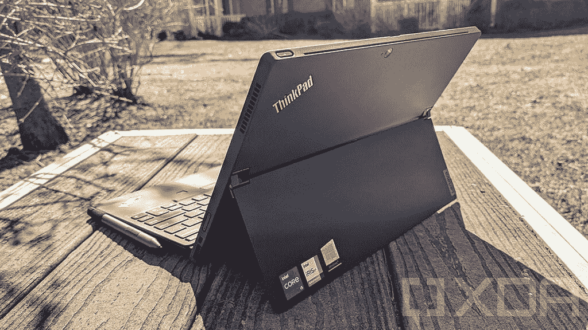</picture> 

ThinkPad X12 Detachable

**里奇:**我也想问这个。为什么要做一个 X12 可拆卸的而不是 X1 可拆卸的，因为上一款 X1 平板的屏幕是 13 寸，而这款是 12.3 寸；它有一个 Thunderbolt 端口和一个 USB-C 3.2，而不是两个 Thunderbolt 4。那么，为什么要做 X12 而不是 X1 呢？

**David:** 我们想做的一件事是关注那些想要永久或部分离开键盘的用户，并真正优化外形。我们真的想缩小它，所以不是降低 X1 平板电脑的等级，而是 X1 平板电脑真正融入 X1 钛金属。这款 X12 平板电脑是 ThinkPad 领域可拆卸产品的再次亮相。我们推出了 X12 可拆卸平板电脑，然后如果你使用 13 英寸的 X1 平板电脑，我们将向屏幕更大的 X1 钛合金推进，这是一种很酷的钛合金。对于那些顽固的可拆卸用户，我们围绕该产品的使用案例进行了更多优化。

**托马斯:**说得好。凭借可拆卸和 12.3 英寸的尺寸，我们希望优化最小的平板电脑，为您提供全尺寸键盘，因为我们认为键盘很重要。当你退后一步，看看可拆卸市场，其中一个令人沮丧的是，我想要一台平板电脑，但我总是会随身携带一个键盘，因为在某些时候，我会想把它们放在一起，以获得一个高效的外形。这就是我们用 X1 钛合金解决的问题。我们对想要的键盘进行了优化。当我们测试、与客户交谈、与不同的焦点团体和市场交谈时，他们说，“是的，我们听到了，我们喜欢钛，但我们中的一些人只是想要一台平板电脑，我们将把它拆下来。你知道，我们会把它放在车里或放在桌子上，一天中的大部分时间都带着平板电脑。我们确实想要全尺寸键盘，所以我们支持你，但它有你所期望的僵硬的平台和 ThinkPad 体验。”正如 David 所说，这就是我们在产品组合中重新引入可拆卸背板的原因。这是一个非常有趣的时代，因为就你的观点而言，我们正在围绕这些不同的外形规格、这些不同的使用情形打转，这是因为所有这些都有一个可行而稳固的市场。顺便说一下，我们还在迭代我们的 X1 Carbon 和 X1 Yoga，它们刚刚推出了 16:10 的外形，所以我们有很多。过去的几年对我们来说非常忙碌。

* * *

对于我来说，询问键盘是一个很好的开始。我对 ThinkPads 的一个常见抱怨是，按键经常感觉有点太深了。现代市场使用更浅的按键，因此尽管 ThinkPads 以拥有市场上最好的键盘而闻名，但它们的移动速度也很慢。联想仍然在每台 ThinkPad 上安装了 TrackPoint，情况也是如此。

但是有了 ThinkPad X1 Nano，ThinkPad X1 Titanium Yoga，ThinkPad X12 可拆卸，按键确实更浅了。它们现在是 1.35 毫米，而不是我们在 X1 Yoga 和 X1 Carbon 上看到的 1.5 毫米。当我使用新键盘时，我喜欢它们。我想问的是，我们什么时候能在 ThinkPad 系列的其他产品上看到这些更浅的键盘。

 <picture>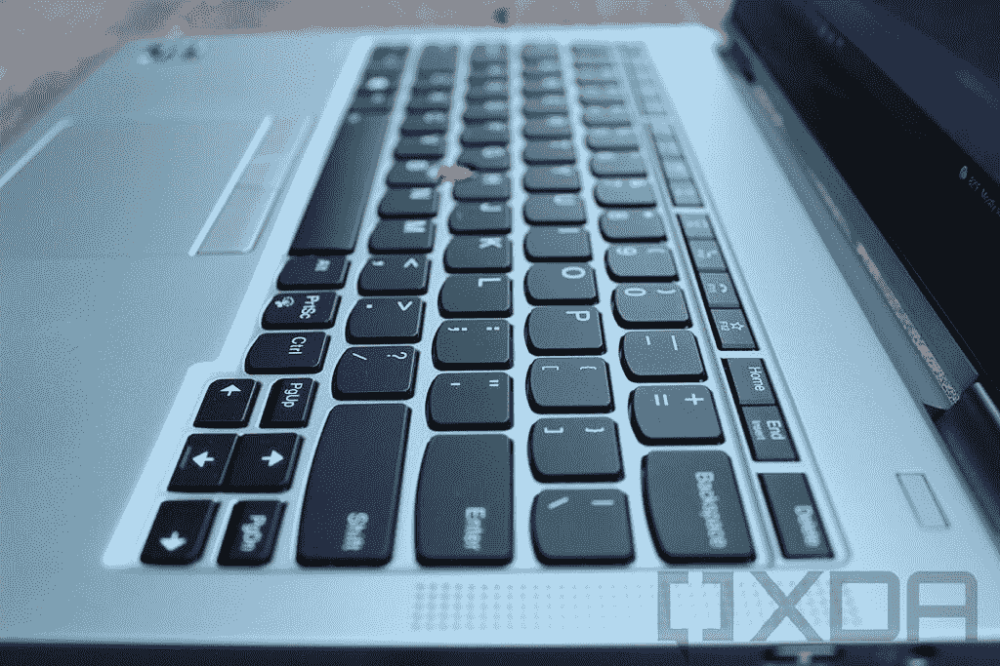</picture> 

ThinkPad X1 Titanium Yoga

答案不完全是我想要的。由于设备更薄，所以按键更浅。将来我们可能会在其他产品中看到它们，但不会很快。该团队承认，像这样的变化进展缓慢；事实上，ThinkPad 以稳定的产品而闻名。当你买了一个，你知道你会得到什么。

我发现一件特别有趣的事情是，ThinkPad 团队花了很大力气让新的、更浅的键盘感觉相同。它有相同的力曲线。

* * *

里奇:我能看出来它一直很忙。X1 系列本身的规模就扩大了一倍。以前只有碳、瑜伽和平板电脑，后来平板电脑消失了；添加了极端。现在，Fold、Nano 和 Titanium 已经加入了阵容，它们都是非常酷的东西。既然你提到了键盘，我相信这三款产品都是 1.35 毫米。

**托马斯:**碳和瑜伽还是 1.5。

**里奇:**那么，整个阵容什么时候到 1.35？在你告诉我你不能回答那个之前，真的很好。这些产品给我留下了深刻的印象，当你在笔记本电脑上降低到两磅或十一磅，在敞篷车上改变毫米时，你会做出妥协，但这些产品感觉不像是在妥协。就像我说的，部分原因是新的英特尔芯片带来的性能，但部分原因是 1.35 毫米的键盘感觉很好。我觉得市场倾向于更浅的键盘已经有一段时间了。你们有过这种感觉吗？我觉得 ThinkPads 总体上比现在市场上的其他产品按键更深。

杰夫:里奇，你能感觉到不同吗？

**丰富:**介于像碳上的 1.5mm 和 1.35mm 之间，绝对。这就是为什么我要说，我认为它很棒，我希望看到它出现在整个阵容中。

 <picture>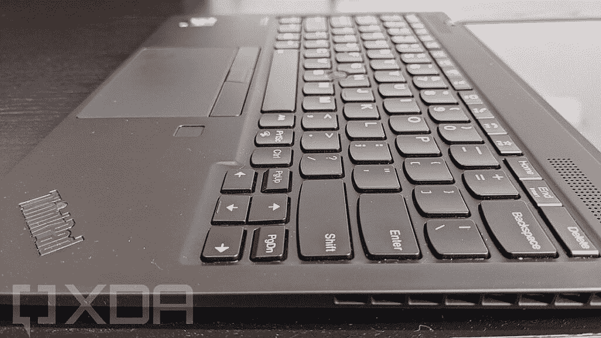</picture> 

ThinkPad X1 Nano

**托马斯:**你应该感觉到的是一条熟悉的曲线，因为我们疯狂地专注于键盘体验。如果你是那种“键盘窃窃私语者”，你会看到 1.5 毫米和 1.35 毫米之间的差异，因为你专注于此。我同意有区别。如果你随机抽取这两个样本，你会感觉到不同。所需的力，撞击前的初始行程，把它推下去所需的力的克数，着陆。它们都是相同的剪式机构。着陆区、软着陆区、响应性和返回全行程的反弹都是基于同一条曲线，所以我们一直非常小心地摆脱传统上超过 2 毫米的距离，然后到 1.8 毫米，再到 1.5 毫米

在摆弄钥匙或变浅方面，我们绝对是落后者。我们去用户组或焦点小组做盲测。他们测试了 1.0 毫米、1.35 毫米和 1.5 毫米。我们发现，1.5 毫米和 1.35 毫米虽然有差异，但当我们使用相同的曲线时，会有一种熟悉的感觉。我们喜欢 1.35 毫米的键盘，但我们还没有准备好将它推向整个产品组合。但是你可以看出，我们正在对这些 halo 产品进行测试，正如你所说，随着我们变得越来越薄，我们已经没有空间了。我们能做的就这么多了。

用钛，我们能把它造得这么薄的原因是因为没有堆叠。有电池、键盘和主板。主板基本两指宽。这是升级到第 11 代平台的一部分，这使我们能够缩小到那个尺寸，但我不能再薄了。历史上，有一些堆叠，电池或键盘的一些重叠，当然还有主板。当我们谈到这么薄的东西时，我有点筋疲力尽了。然后我们必须开始玩我们能用键盘做的东西，举个例子。我们不想在键盘体验上妥协，这就是为什么你仍然看到 1.35mm。

 <picture>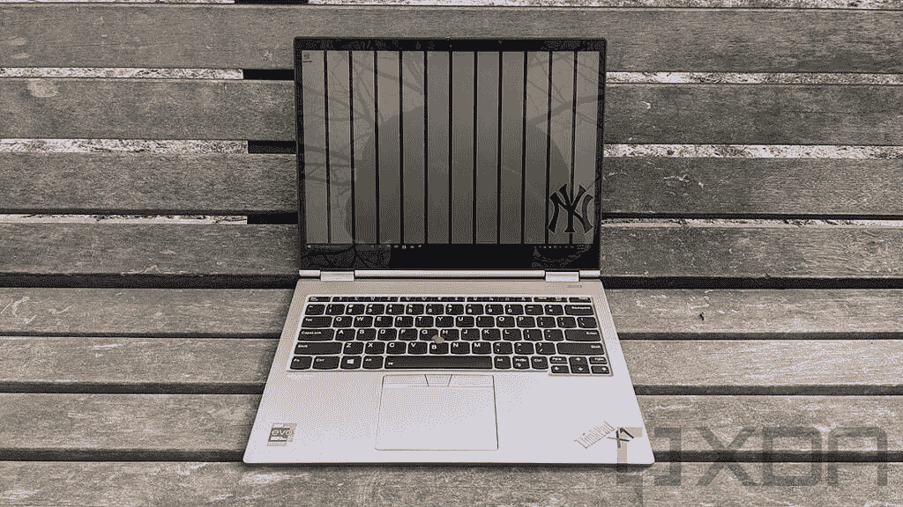</picture> 

ThinkPad X1 Titanium Yoga

**Rich:** 我觉得感觉不像是妥协。我觉得感觉是个特色。感觉更现代一点，但话说回来，我也是一个使用大量笔记本电脑的人。我确实感觉到了。

**托马斯:**我们希望你在键盘上打字时感到舒适，因为我们设计这些键盘是为了全天使用、移动使用和高生产率。1.35 毫米的键盘，我们非常满意，尽管这是显而易见的，因为我们把它放在我们的 X1 线上，所以我们会继续努力推动它。我认为我们正在达到这样一个点，如果你走得太远，你将开始限制自己和感觉的质量。你在破坏我们讨论过的力曲线。

* * *

接下来我问的是 ThinkPad X1 Titanium Yoga 专属的触觉触摸板。我以前用过触觉触摸板，有些很好，有些不好。苹果 MacBook Pro 上的那个是非凡的，尽管它确实需要一些时间来适应两种水平的力。另一方面，联想的 Yoga 9i 没有最好的触觉触摸板。我对钛上的那个持怀疑态度。

幸运的是，ThinkPad X1 Titanium Yoga 上的那个非常好，团队非常清楚，它为该产品设置了比消费产品更高的标准。对我来说，最大的考验是我是否可以轻松地在屏幕上拖动东西，通常是用两个手指。对于传统的触摸板，我可以用一个手指按住它，同时用第二个手指开始移动。触觉触摸板通常无法识别这一点，所以我在这里没有这个问题。

然后，当然，我不得不问为什么这是 X1 钛独有的，而不是在 ThinkPad X1 纳米。

* * *

**Rich:** 我接下来要提到触觉触摸板，因为你提到了空间。我最大的问题是，为什么这是在钛而不是纳米？我实际上认为它相当不错，比 Yoga 9i 14 中的触觉触摸板好得多。我不知道它是否应该和你们是否使用相同的部分；也许我只是有了不同的体验，但实际上在钛上感觉更自然。它没有我过去使用触觉触摸板时遇到的一些问题。

**大卫:**我们想确保我们的比那更进一步。X1 钛合金无疑帮助我们达到了这一厚度。当我们看 ThinkPad X1 Nano 时，它比 X1 Titanium 厚一点，这不一定是因为触控板，但它给了我们一个机会来使用传统的触控板，并将我们的精力集中在 X1 Titanium 上，用于触觉触控板的第一次迭代。我们真的很高兴这部电影的结局，也许将来你会看到更多。

**Thomas:** 作为我们的旗舰产品，X1 的用途之一就是作为测试平台。我不想让你往坏的方面想，但是我们确实在尝试。我们试用了 1.35 毫米的键盘，我们试用了这个触觉触摸板；这使我们能够获得强有力的市场反馈，并确定我们是否需要调整方向。我们需要做进一步的改进吗，或者我们已经准备好将它融入我们投资组合的其他部分了吗？它回到无堆叠状态。force pad 位于我在底部找到的电池足迹之下。我们无法把它做得这么薄。当然，折中的办法是在那里放一个带旅行功能的触摸板。如果我这样做，我会在工作中增加两毫米，这将消除平板电脑优化的用例。可以说，这一直是一个关于如何将这 12 磅的东西装进一个 10 磅的袋子里的话题，我们真的很想驾驶它。这就是我们定义这些用例的原因，比如钛金属是平板电脑用例的终极体现，而 Nano 是移动性和重量的终极体现。这有助于我们在做决定时有一个路标。

**Rich:** 还有一件事我想问，有点奇怪的问题，为什么 ThinkPad X1 Nano 是 Nano，为什么 Titanium 是 Titanium？为什么不做钛金属翻盖和碳纤维敞篷？为什么那个是钛金的，那个看起来更像标准的 ThinkPad？

**Thomas:** David 可以说得更详细，但是当你谈到 ThinkPad X1 Nano 时，我们可以使用的最轻的材料是碳纤维。如果我们使用钛，我们就不会谈论低于两磅的产品。从历史上看，yoga 风格的外形更加进步和现代，采用不同的材料和表面处理，从 X1 Carbon 和 X1 Yoga 开始，使用碳纤维和 CNC 铝。随着我们将这些范围扩展到这些更具移动性的平台，这更符合逻辑。这是一场与 Nano 的较量，因为我们必须在那里进行碳排放。没有选择去达到两磅以下，然后钛更多的是那些金属的表达，更进步，如果那有意义的话。

**里奇:**我真的很喜欢钛的外观。它看起来是银色的，我们有这么多银色的笔记本电脑，但它看起来仍然是不同的和独特的。它非常漂亮，甚至仅仅是标志，你就可以使用标准的黑色 ThinkPad X1。

**Thomas:** 另一个内部的好话题是 logos。

 <picture>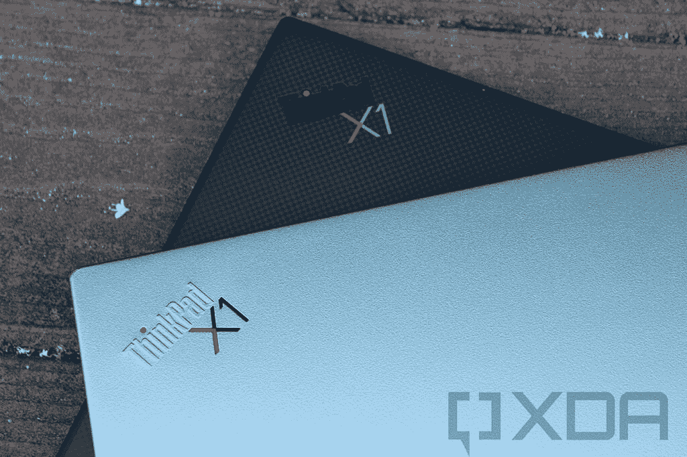</picture> 

ThinkPad X1 Titanium Yoga on top, X1 Nano on the bottom

哦，我知道，因为我以前和你们讨论过商标。我记得当 X1 的标志从银色变成黑色的时候，我记得当黑色的阴影变成稍微深一点的黑色的时候。这是小事。是什么让你们说现在是时候了？我们一直有又薄又轻的东西，但它们从来都不好。在性能、键盘或触摸板方面一直存在巨大的妥协，所以是什么让你们说现在是时候了？你什么时候决定的？

大卫:通常我们会在两三年后才真正开始绘制全新的图表。

**有钱:**所以，这是 2018 年。

* * *

当我结束与联想的谈话时，我们确实谈了一点 CPU。y 系列 CPU 很差，这就是过去这种外形的产品不太好的原因。现在，Tiger Lake UP4 正在释放新的可能性，缩小到 10 纳米工艺给了联想把东西做得更小的机会。这包括主板，所以产品中没有堆叠。

* * *

**大卫:**大概是 2018 年的某个时候。我们一直在寻找如何发展我们的产品线，X1 系列。正如 Tom 所说，X1 Carbon 和 X1 Yoga 是较小的迭代。我们升级到 16:10 显示器，但保留一些更传统的东西，如 USB 端口、HDMI 端口等。与此同时，我们看到了其他一些事情的发生。我们正在与英特尔合作，我们研究了第 11 代芯片，发现我们可以在他们的更小封装版本的处理器上提升性能。之前，是 Y-CPU，我们在这方面取得了全面的成功。

**丰富:**喜忧参半感觉乐观。

**David:** 在这款产品中，他们为我们提供了一个更小的产品包，具有我们使其合法化所需的性能可扩展性。我们可以把钛做得超薄，因为我们可以把主板做得超小。我们可以让 ThinkPad X1 Nano 变得超级轻便，同时仍然保持那些更小的小型化组件的轻薄。从专注于移动性的角度来看市场的发展方向，这是关于将技术趋势结合在一起，无论是我们在市场上推动的不同宽高比面板，还是我们从英特尔获得的 CPU。我们花了一些时间在 ThinkPad 键盘上迭代，以获得 1.35 毫米旅行的良好感觉。我们没有说，只是一夜之间，让我们在键盘上收缩行程。我们需要设计它，迭代，键入形状，迭代曲线的形状，力曲线，用大量用户测试它，然后系统地说所有这些都在一起，我们可以开发这些产品线。有机会将这些产品添加到 X1 系列，并围绕这些使用案例进行真正的优化，这是一件非常令人兴奋的事情。

 <picture>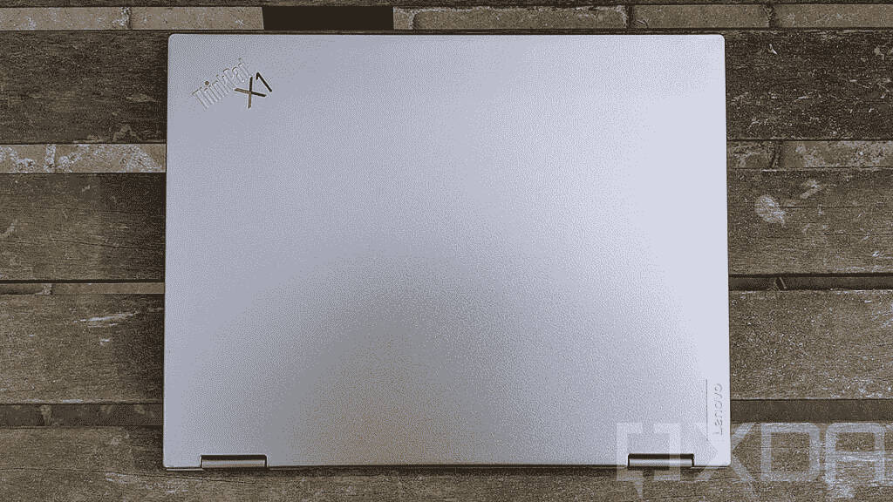</picture> 

ThinkPad X1 Titanium Yoga

**亚当:**我们每年都举办这些客户咨询会议；首先，我们的 X1 产品组合表现非常好。碳和瑜伽做得非常好，我们的 T14s 也是，几乎就像涓滴一样。对其他人来说是 X1 碳，对吗？我们的高端产品组合非常受欢迎，但很明显，随着千禧一代和 Z 世代进入劳动力市场，他们需要更多个性化和更多选择。从劳动力的角度来看，技术已经成为获取和保留人力资源和人才的工具。他们要求最好的技术，但这并不是万能的。这是一场完美风暴，技术开始让这一切成为可能，但它过去常说，“这就是你得到的。”你知道，香草的，巧克力的，或者草莓的。现在，有这么多的可能性。这真的很有趣，因为现在我们已经有了五六个不同的 x1，那么他们做得怎么样，我们从那里做些什么来扩展并进一步扩展这个优质空间呢？很明显，人们对此很感兴趣，尤其是 Z 世代和千禧一代。

**Rich:** 我已经没有问题了，所以在我们结束之前，你们能告诉我你们最喜欢这些产品的哪些方面吗，还有什么想补充的吗？你想谈谈钛金属上的边框吗？因为它们很大，我有点惊讶。顶部和底部挡板。是不是需要一个特定的尺寸来容纳里面的所有东西？

**David:** 这是一种平衡，因为我们不得不尝试一些东西来获得更小的挡板，特别是在系统的底部。您可以拿起驾驶员卡，在显示屏后面翻转。如果你注意到 ThinkPad X1 Nano，它有一个轻微的圆顶形状，而对于可转换的外形，我们真正想要的是扁平的形状，这样当它翻转 360°时，它就在彼此的顶部，完全扁平。我们没有试图用底部挡板来玩这个把戏。底部边框比你看 ThinkPad X1 Carbon 或 ThinkPad X1 Nano 时要大一点，所以这是我们为此进行的优化之一。

**丰富:**我不知道它是否真的很大，但在 3:2 的屏幕下，它几乎让它感觉是方形的，因为屏幕已经更高了。

**大卫:**我们对系统的平衡感觉非常好，这一切都是为了优化使用案例，这是一款出色的笔记本电脑，也是一款出色的平板电脑。

**Thomas:** 底部挡板后面有一个控制板，我们可以将它做成平板状，而不是旋转后放在后面。这又回到了完美的平躺在上面。但是，当你用主板-键盘-电池进行布局时，我们希望确保我们的电池续航时间也与该用例相关联，这样小的扩展实际上允许我们有更多的电池。

* * *

## 英特尔就老虎湖 UP4 采访 Ryan Shrout 和 Joshua Newman

接下来，是时候和英特尔的 Ryan Shrout 和 Joshua Newman 聊聊了。这个故事真的有两个完全不同的方面，两者都同样令人兴奋。ThinkPad X1 Nano 和 ThinkPad X1 Titanium 是非凡的产品，后者是我目前在市场上最喜欢的笔记本电脑。真是太神奇了。

但是引擎盖下的 CPU 同样令人惊叹，它的扩展超出了联想的范围。Tiger Lake UP4 是 Y 系列的继任者，Y 系列很糟糕。我们以前也有不到两磅重的笔记本电脑，但是它们从来都不值得推荐，除非你绝对需要现有的最薄最轻的。

 <picture>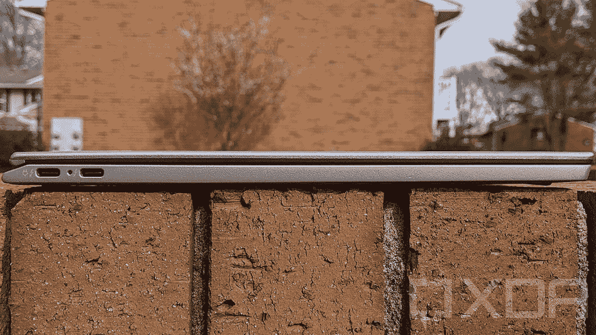</picture> 

ThinkPad X1 Titanium Yoga

事实上，当我第一次有机会审查 ThinkPad X1 Nano 时，我是持怀疑态度的，这是我在钛之前收到的。我注意到去年品牌的转变。新的笔记本电脑似乎说它们包括第 11 代英特尔处理器，但他们不再说是哪种处理器了。所以，当 ThinkPad X1 Nano 公布的时候，我不得不挖空心思去搞清楚里面到底是什么 CPU，的确，它是第一个使用 UP4 的。

我不敢相信它有多好。我对 ThinkPad X1 Nano 的第一印象是，我无法相信没有人在谈论这个。我们终于可以拥有不到两磅重、性能卓越的笔记本电脑了。这是新的外形领域。

这里有一个简单的例子。在我的测试中，配备酷睿 i7-1160G7 和 16GB 内存的 ThinkPad X1 Nano 在 PCMark 10 测试中获得了 4，586 分。钛金属上的分数也差不多。得分为 4541 的是联想 Yoga C940 14，它采用了第十代 U 系列处理器酷睿 i7-1065G7。得分高于前代 U 系列处理器是一件大事。

相比之下，采用酷睿 i7-8500Y 的惠普 Spectre Folio 在同一测试中获得了 2940 分。2017 年惠普 Spectre x360 13 的酷睿 i7-7500U 得了 3117。Y 系列从未能够跟上，甚至无法提供足够合理的性能水平来推荐它。

Geekbench 的分数更能说明问题，因为那些 Y 系列芯片是双核的。同样的 Spectre Folio 在单核和多核测试中分别获得了 954 分和 1，579 分。ThinkPad X1 Nano 的得分分别为 1346 和 4891。相比之下，采用酷睿 i7-1065G7 的惠普 Spectre x360 分别获得 1227 英镑和 3502 英镑。

* * *

**Rich:** 我想问这个问题的原因是我觉得好像没有人在谈论这些筹码。我猜他们现在被征召入伍了；这是 Y 系列的继任者吧？

**Ryan Shrout:** 是的，让我试着给出一些相关的背景，因为这与我们前几代人所做的有所不同。当我们在去年 9 月推出 Tiger Lake 时，我们谈到了 UP3 和 UP4，这些是我们为同一 SOC 的不同版本提供的内部名称。具有 12 到 28 瓦 TDP 的 UP3 处理器是第一批出现的机器，然后 UP4 基本上取代了 Y 系列处理器。这些达到了 7 到 15 瓦的 TDP 范围。

它们提供相同的架构性能、相同的可扩展性、Willow Cove 架构、Wi-Fi、Thunderbolt 集成，所有这些。因为我们转向了 Tiger Lake 产品的 10 纳米工艺，我们能够在这些不同的光谱上获得基本相同的 SoC、相同的硅。我们所做的是稍微弯曲一下，以在这些版本中获得最佳功效，然后我们以稍微不同的方式构建电路板。我们构建的周围电源组件略有不同。这使得像联想工程师这样的人可以设计你正在看的系统，但从性能角度和架构角度来看，这与你在第 11 代^(处理器中看到的酷睿 i7-1165G7 或酷睿 i7-1185G7 处理器是一样的。)

* * *

Tiger Lake UP4 如此大规模升级的原因之一是，英特尔从第 8 代“琥珀湖”直接升级到第 11 代“老虎湖”。

冰湖 Y 应该是一个很大的改进。这应该是转向四核，更高的 TDP，以及更强大的 Iris Plus 显卡。冰湖也是第一代 10 纳米。但在苹果的 MacBook Air 之外，它真的没有在新的 PC 中发货。

相反，我们得到了琥珀湖刷新。当英特尔用 Ice Lake 切换到 10 纳米时，它是有限的，所以它旁边有 14 纳米部件。与 U 系列，它是彗星湖。对于 Y 系列，它几乎是第八代芯片的四核版本。

如果中间没有冰湖 Y，这些类型的电脑的性能确实会大幅提升。

* * *

是的，因为它非常好，而且确实吸引了我的眼球。就在一年前，我们有许多不到两磅的笔记本电脑，例如 Acer Swift 7，但使用这样的东西总是会产生巨大的性能影响，因为 Amber Lake 是双核的。我想 TDP 是 5 瓦特。Ice Lake 应该是 9 瓦和四核的，但我不知道 Windows PCs 中是否有过这种情况。你们知道 Windows 电脑里有没有这种东西吗？

**约书亚·纽曼:**非常有限。有几个例子，但你是对的。最初的 Y 系列的意图更多的是一位数的 TDP 点，并针对无风扇，也许是平板电脑设计。由于工艺技术和设计架构的原因，我们能够在 Tiger Lake 的场景中运行，这确实扩展了动态范围，能够在真正高密度的封装中实现某些功能，实际上可以承受 7 瓦至 15 瓦的覆盖范围。这开启了我们可以用传统笔记本电脑做什么的全新创新路线。

 <picture></picture> 

Acer Swift 7

**里奇:**当然，你也有 Iris Xe 显卡在里面。回头看看惠普 Spectre Folio，我甚至无法想象在这样的电脑上打开 Premiere Pro 这样的东西，甚至是 Photoshop。使用这些联想产品，感觉就像使用普通笔记本电脑一样，只是 ThinkPad X1 Nano 不到 2 磅，钛合金厚度为 11 毫米。

Ryan: 我很嫉妒，因为我实际上还没有接触过你所说的产品。

**Rich:** 我实际上能够得到一个预生产的 X1 Titanium，所以我在常规审查单元发布前一个月就有了它。它很快成为我最喜欢的笔记本电脑。我立刻想到两年前这是不可能的。

* * *

这里需要注意的一点是，虽然 UP4 是 Y 系列的继任者，但由于 TDP 的灵活性，它现在被视为 U 系列。这可能也有助于重塑一个名声如此糟糕的产品。现在，有更传统的 U 系列芯片 UP3 和我们一直在谈论的 UP4。

我注意到 ThinkPad X1 Nano 和 ThinkPad X1 Titanium Yoga 都有粉丝。Y 系列最初是为无风扇笔记本电脑设计的，所以随着 TDP 和整体功率的大幅增加，我担心这些现在需要风扇。它们不会，但与任何电脑一样，更好的散热意味着更持久的性能。

* * *

**Ryan:** 你知道，我们经常在这里吹嘘老虎湖，但建筑和过程在这里融合的方式，很多都与一些非常酷的东西有关。UP3 和 UP4 名称有些重叠。UP4 的功率为 7 到 15 瓦，而 UP3 的功率为 12 到 28 瓦，这为原始设备制造商和客户提供了很大的灵活性来制造这样的产品。这使得他们可以做以前 Y 标志让他们望而却步的事情，或者他们无法获得他们想要在高性能系统上使用的功率缩放。但我同意你的观点，让这些令人难以置信的轻薄系统安静，但有能力在你需要响应时爆发。这也是 Evo 计划推广的一部分。我认为架构的可伸缩性非常适合这样的设计。

 <picture></picture> 

ThinkPad X12 Detachable

**里奇:**不过这些不会出现在无风扇的电脑中，对吧？我目前看到的一切都有粉丝。

**Joshua:** 他们可以，但你在联想笔记本电脑上所得到的也是我们在英特尔 Evo 上所做的产品，这是关于无论你是否接通电源，都要一致地验证你的响应能力，使用真实世界的条件，如后台应用程序、Wi-Fi 开启，所有这些好东西。你有很长的电池寿命，在真实世界的条件下，在真实世界的亮度和即时最佳连接下至少 9 个小时，但我们不仅仅是在验证这些东西。事实上，我们很早就在与联想合作设计这些产品。我们在 ThinkPad X1 Nano 和你所说的三款产品的案例中所做的是，它们从一开始就都是共同设计的，我们说让我们采用 UP4，让我们尽可能地使电路板变小。我们本来可以没有风扇，但我们说不，让我们实际上做真正有创意的新散热设计，试图获得更高的性能，但仍然有安静的模式，并为电池留出更多空间。我们还缩小了主板的 Z 高度，这样我们实际上可以提供 ThinkPad 著名的键盘旅行，即使是在这种轻薄的设计中。

* * *

我确实试图问我们今年是否会看到很多 UP4 笔记本电脑，但我真的无法得到答案。英特尔实际上只是坚持这一英特尔 Evo 标准，该公司似乎不喜欢区分不同层次的产品。如果你买了一台笔记本电脑，英特尔想要说的就是它拥有第 11 代处理器，并且通过了 Evo 认证。

除了我们一直在谈论的三款[联想笔记本电脑](https://www.xda-developers.com/best-lenovo-laptops/)，我只在戴尔笔记本电脑中见过另一款 Tiger Lake UP4 处理器。更具体地说，它在 Latitude 7320 平板电脑中。

* * *

说到键盘，因为他们在这些产品上做了 1.35 毫米，当你达到超薄时，你会得到一个非常浅的键盘。真是令人印象深刻。通常，他们做 1.5 毫米，我认为 1.35 对他们来说是一个进步。我告诉他们，这只是不觉得有任何妥协，所以这是很酷的。有一件事我想问你；您多次谈到与联想的合作。你预计今年会从其他公司看到很多这样的情况吗？

**Ryan:** UP4 特指还是 Evo 泛指？

**Rich:** 显然，我们看到很多 Evo，不是来自微软，因为他们不使用 Thunderbolt，但这无关紧要。

Ryan: 今年有很多 Evo。我们已经验证了 60 多项设计，还有一些正在进行中。但 UP4 可能更像是一款你真正关注轻薄的产品，尤其是在 ThinkPad X1 Titanium、ThinkPad X1 Nano 和 ThinkPad X12 disable 所占据的企业品牌或专业消费者领域。它真的在努力追求漂亮时尚的设计，但又不牺牲性能。将所有这些整合在一起需要更多的工程复杂性，因此我们会看到更多的 up4，但在大多数 Evo 设计中仍会看到 UP3。在这方面，您还将看到更高的散热性能。

**有钱:**有，肯定有。我希望这会变得有点流行。我希望联想的所作所为不是我们所看到的全部，因为有一些产品已经有一段时间没有更新了，我不要求您公布任何合作伙伴的产品，但例如，Swift 7 可能已经近三年没有更新了，因为所有这些东西都是第八代 Amber Lake Y 系列。惠普 Spectre Folio，我认为惠普对琥珀湖更新进行了安静的更新，但正如你所说，我认为我没有在任何 Windows PC 中见过 Ice Lake Y，因此这对于任何正在使用该类型机器的人来说都是一次重大更新。我也想知道这如何定位英特尔对高通和苹果。

**莱恩:**几件事；一是你会问是否会有更多这样的系统。我不知道 UP3 或 UP4 会带来什么。我可以肯定的告诉你有。我们还没有完成今年将发布的采用 Tiger Lake 处理器的超薄、轻薄、令人惊叹的时尚设备。接下来还会有很多，其中一些我已经能接触到的非常令人兴奋。关于你的第二个问题，这在与高通和苹果的竞争格局中有什么帮助？显然，这很有帮助。其架构的优势之一是，人们认为它们更节能、更凉爽，这对外形和设计有什么影响。

* * *

我认为与高通和苹果竞争是非常重要的。看看类似三星 Galaxy Book S 的东西，它最初配备了骁龙 8cx 芯片组。它的厚度为 6.2 毫米至 11.8 毫米，重量为 0.96 千克。不仅如此，它由铝制成，铝是笔记本电脑中最重的材料之一。

 <picture>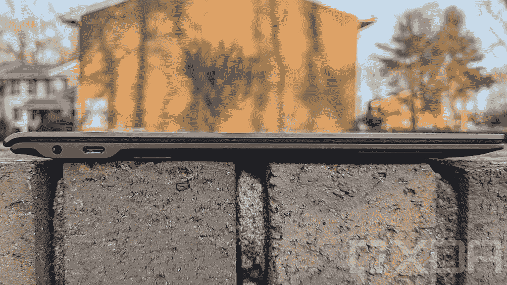</picture> 

Samsung Galaxy Book S

当时，这是一个你绝对需要一个 ARM 芯片来完成的例子。三星最终也发布了一款采用英特尔 Lakefield 芯片的手机，该芯片采用了同样的大尺寸芯片。小科技。但是 Intel Lakefield 不是很好，就像一个 Y 系列的处理器。当时，最适合这项工作的芯片绝对是高通骁龙 8cx。

但现在，随着 Tiger Lake UP4 的推出，这款笔记本电脑可能会采用合适的英特尔芯片，而且它实际上会很好。通过在做得更好的同时把零件做得更小，该公司从高通带走了一个关键的价值主张。

苹果是一个不同的故事。这家 Cupertino 巨头刚刚发布了一款一体机，它与 11 英寸的 iPad Pro 采用了相同的 ARM 处理器。将这种能力放在一体机之后，同时仍然提供热量以适应这种尺寸的机箱，这是英特尔目前无法做到的。事实上，这就是为什么苹果正在转向自己的定制硅。它想做一些用英特尔芯片做不到的事情。

* * *

**丰富:**还有更小的块吧？我们谈论的是更小的主板和更高效的设计。当我最初用高通骁龙 8cx 评测三星 Galaxy Book S 时，我说它展示了 ARM 处理器的能力，因为它超级薄，超级轻，而且当时，要用英特尔做它，你必须使用 Y 系列。然后，就有了和莱克菲尔德的版本。笔记本电脑中的 Lakefield 不是真的，我不想说它不好，但它不是 Tiger Lake UP4，实际上相当不错。

**瑞安:**我认为你看到的 ThinkPad X1 Nano 等产品，以及即将推出的一些设计，是你可以用我们的架构和我们的产品实现轻薄和时尚，这些产品将在外形、设计和创新方面与高通、苹果或任何人竞争。然后是性能、兼容性，以及我们之前讨论过的所有东西:设备附件、Thunderbolt，以及随之而来的所有东西。

您不必担心 ARM 上的 Windows 的复杂性，也不必担心 Rosetta 的复杂性，您将能够获得这些设计，因为我们已经构建了产品，并且 Josh 的团队和英特尔内部的其他工程团队为联想和其他公司提供了完美的系统。

**Joshua:** 我想重复一下 Ryan 的观点，这只是 OEMS 不断发展的创新浪潮，利用这一点将会继续下去。Evo 是为了促进这一点，但 X1 钛金属除了使电路板变得非常小，开辟了散热的新方法，并使键盘变得如此棒之外，还可以使屏幕变得窄到边。我们首次在笔记本电脑中采用了新的玻璃芯片技术，这使得我们可以将显示驱动器放在玻璃上，而不是边框中，而不必增加厚度。你可以通过引入新技术，在英特尔和联想之间共同解决这些问题，同时解决所有这些问题。我们在这方面做得更多。把 5G 天线放进去，在这样的设计中你把它们放在哪里？我们在 Evo OEM 客户中做得更多，所以你会看到更多这种很酷的东西。

* * *

最后我想说的是 5G，这是联想 ThinkPad X1 Nano 和 ThinkPad X1 Titanium 的一个关键特性。英特尔并不以其 5G 优势闻名，而是将其努力卖给了苹果。后来它与联发科技达成协议，在笔记本电脑中提供 5G，但仍未发货。

 <picture>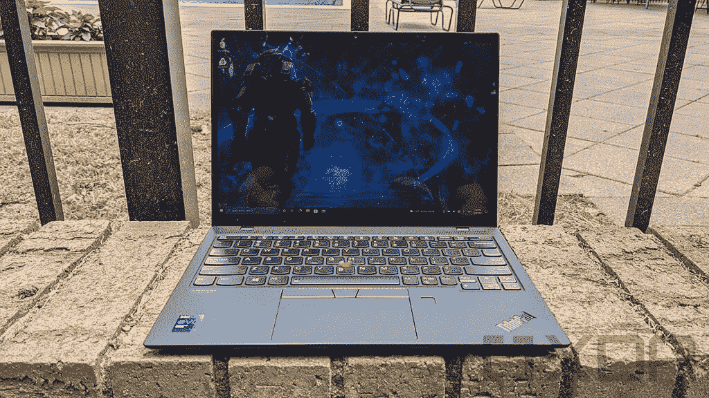</picture> 

ThinkPad X1 Nano

目前，支持 5G 的英特尔电脑使用高通调制解调器，并且仅支持低于 6GHz 的频率。唯一支持低于 6GHz 和毫米波的 5G 电脑是 ARM 设备上的 Windows，所以我想知道这是否是使用英特尔处理器的高通调制解调器的限制。事实证明不是；这只是一个有用性与天线设计的问题。

如果英特尔像高通一样开始发布带有调制解调器的 CPU，那就太好了。有点令人难过的是，在 2021 年，你仍然要为笔记本电脑的蜂窝连接支付高额费用。这是一场高通承诺要为我们赢得的战斗，手机应该成为标准。但现在，就连高通也输掉了这场战斗，在惠普 Elite Folio 和三星 Galaxy Book 等搭载 Windows 操作系统的个人电脑上，基本机型只配备了 Wi-Fi。

* * *

**有钱:**很爽。所以，就因为你提到了，就来说说 5G 一秒。目前，所有英特尔 [5G 电脑](https://www.xda-developers.com/best-5g-laptops/)的价格都低于 6 英镑。这是否有限制，因为说到超便携，我们把它带出办公室；当我想到便携式设备时，我想到的是蜂窝，我不知道每个人的想法是否相同，但我关心的是个人电脑中的蜂窝。英特尔处理器不能做毫米波有限制吗？

**约书亚:**这不是限制；这是一个用例问题。毫米波确实带来了一些外形挑战。视线技术的这些天线在外形尺寸上解决起来更具挑战性，但第二个问题是，视线技术对笔记本电脑用例真的有价值吗？我认为我们要解决的第一个问题是，让我们得到 sub-6。这可能对现在和长期的笔记本电脑用例具有最大的价值，或者我应该说在未来，我们也在考虑如何覆盖可能存在的所有不同 5G 用途的整个频谱。我们知道如何做到这一点，但在我们解决其中一些问题之前，可能有一些权衡对于笔记本电脑来说还没有意义。

**Rich:** 我知道毫米波天线设计很难，因为你需要那种视线。你们还有什么要补充的吗？

瑞恩:不，我不这么认为。我想这真的可以归结为，当我们在九月份发布时，这一直在计划之中。很明显，我相信我们很希望早一点拥有更多像您所期待的那样的系统，但是它们已经在这里了，并且正在通过管道移动，2021 年将会有更多的老虎湖。

* * *

## 结论:联想和英特尔正在通过 ThinkPad X1 Nano、ThinkPad X1 Titanium Yoga 和 Tiger Lake UP4 重塑轻薄笔记本电脑

我来这里谈两件事。首先是联想的新系列 ThinkPad:ThinkPad X1 Nano、ThinkPad X1 Titanium Yoga 和 ThinkPad X12 disable。这些笔记本电脑真的让我大吃一惊。它们非常轻薄，而且非常好。

他们还做出了一些非常有趣的设计选择。正如我们在上面了解到的，ThinkPad X1 Titanium 首先应该是一款平板电脑。这是为数不多的真正被设计成平板电脑的可变形笔记本电脑之一。但这还不是全部，因为这些笔记本电脑也有非常棒的键盘，击败了已经令人印象深刻的 ThinkPad 系列。

 <picture>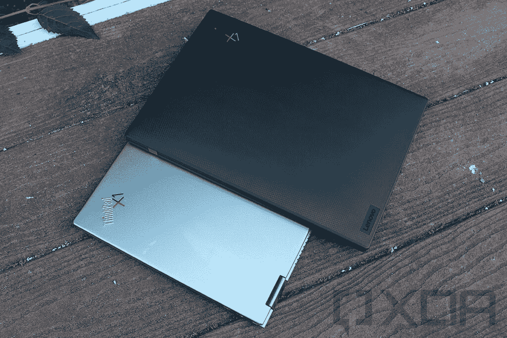</picture> 

ThinkPad X1 Nano on top, X1 Titanium Yoga on the bottom

感觉联想能够在没有做出任何有意义的妥协的情况下制造这些设备，这真的令人印象深刻。当谈到一款超薄超轻的设备时，我完全希望在评论结束时说，只要你愿意做出某种妥协，这款产品就很好。这里不是这样的。

其中的关键原因是我要谈的第二件事，即英特尔新的第 11 代 UP4 处理器。这些芯片正在释放以前不可能的可能性和形式因素。以前，要制造一台不到两磅的个人电脑，你必须使用镁之类的材料，并使用 Y 系列或 Lakefield 之类的慢速处理器。

通过 Tiger Lake UP4，您实际上已经获得了一些照片编辑或轻度游戏的能力。您甚至可以在必要时编辑视频。这是野生的东西。

不过，我真的希望我们能看到更多。我只知道有四款笔记本电脑使用 Tiger Lake UP4:ThinkPad X1 Nano、ThinkPad X1 钛瑜伽、ThinkPad X12 可拆卸和戴尔 Latitude 7320 可拆卸。但话说回来，这些天很多产品的营销都很混乱，所以很多产品只说有第 11 代处理器，而没有告诉你是哪一种。

 <picture></picture> 

Lenovo ThinkPad X1 Nano

##### 联想 ThinkPad X1 Nano

联想的超便携 ThinkPad 重量不到两磅，它有带 Iris Xe 显卡的英特尔老虎湖处理器、2K 16:10 显示屏等等。

 <picture>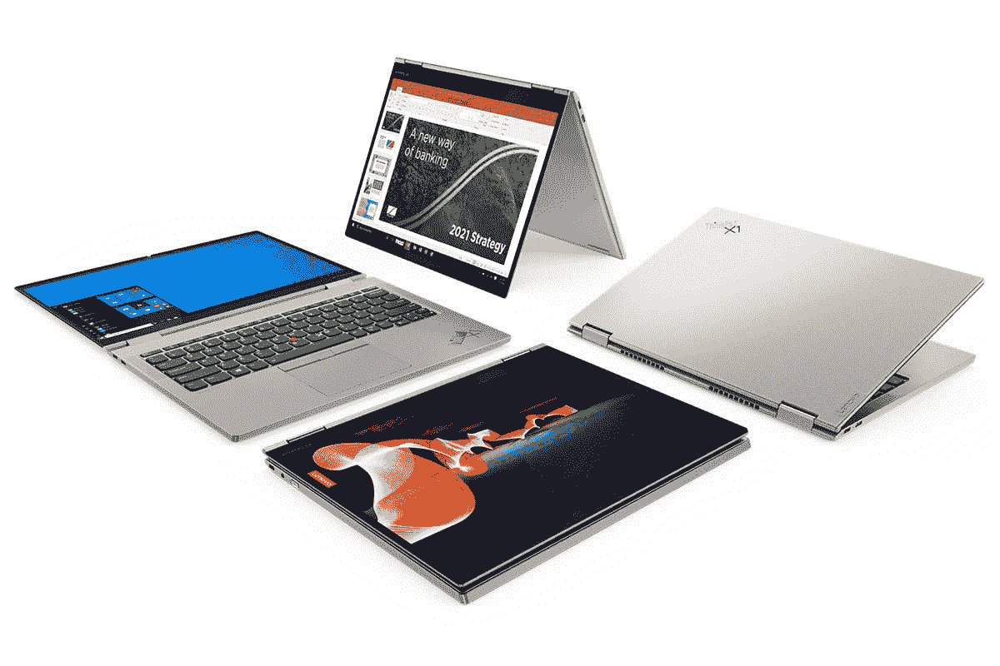</picture> 

Lenovo ThinkPad X1 Titanium Yoga

##### 联想 ThinkPad X1 钛瑜伽

联想的钛敞篷车是为平板电脑用户设计的，还搭载了英特尔老虎湖处理器，包括 Iris Xe 显卡、迅雷 4 等。

 <picture>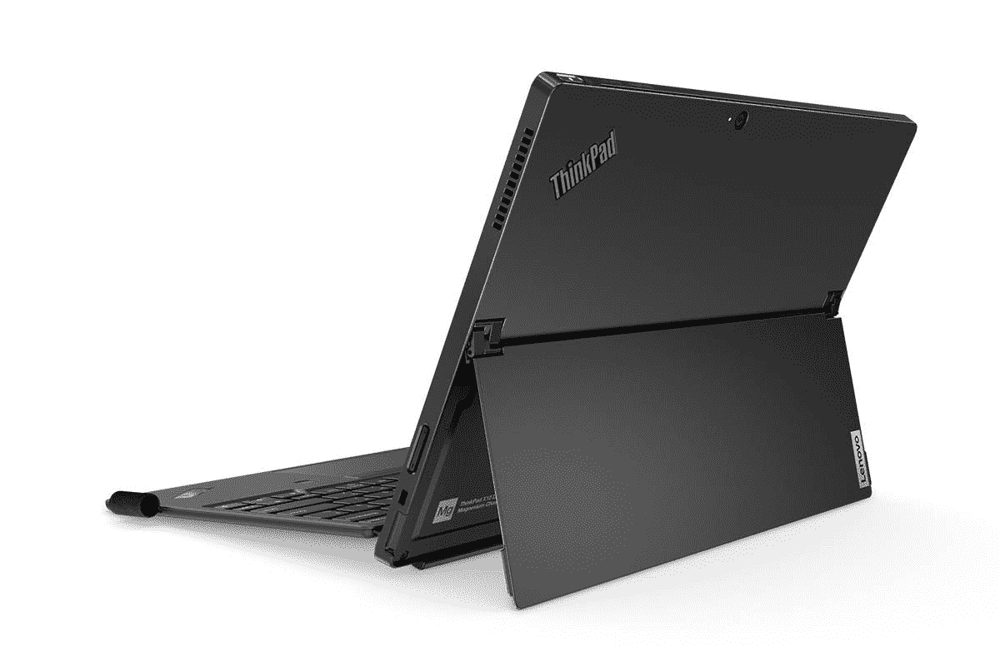</picture> 

Lenovo ThinkPad X12 Detachable

##### 联想 ThinkPad X12

ThinkPad X12 可拆卸平板电脑是自 2018 年以来的第一款 ThinkPad 平板电脑，搭载英特尔处理器、Iris Xe 显卡、迅雷 4 等。