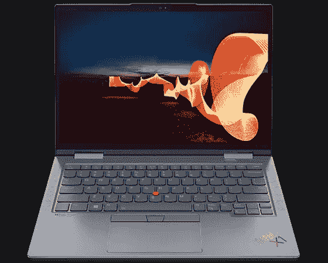

# 联想 ThinkPad X1 Yoga Gen 7 评测:最佳商务敞篷车

> 原文：<https://www.xda-developers.com/lenovo-thinkpad-x1-yoga-gen-7-review/>

联想 ThinkPad 是一个如此强大的品牌，凭借其质量和创新的声誉在商务市场占据主导地位，这是有原因的。当谈到 ThinkPad X1 Yoga 时，该产品是可靠的，现在已经是第七代了。它由铝制成，内置笔库，通过了十几项 MIL-STD-810G 测试，就像任何 ThinkPad 一样。

自上一代以来，并没有太多的变化，这并不是一件坏事。有两个关键的区别。一个是 4K 选项现在是有机发光二极管，这很酷，因为自从第二代机型以来，我们还没有在 ThinkPad X1 Yoga 中看到过[有机发光二极管显示屏](https://www.xda-developers.com/best-oled-laptops/)。它还配备了英特尔新的 28W 第 12 代处理器，功能更强大，具有更好的电源管理，并解锁其他功能，如该机如何包括 LPDDR5 内存。

最终，它只是一个伟大的全能可转换笔记本电脑，这是 ThinkPad X1 Yoga 一直以来的风格。

 <picture></picture> 

Lenovo ThinkPad X1 Yoga Gen 7

##### 联想 ThinkPad X1 Yoga Gen 7

联想的 ThinkPad X1 Yoga 拥有您需要的所有功能，如可选的 5G、可选的 4K 有机发光二极管显示器、第 12 代处理器、LPDDR5 和整体出色的构建质量。

## 联想 ThinkPad X1 yoga Gen 7 定价和供货情况

*   联想 ThinkPad X1 Yoga Gen 7 在 Lenovo.com 的起价为 1589.40 美元，尽管作为一款[商务笔记本电脑](https://www.xda-developers.com/best-business-laptops/)，它也可以通过各种其他渠道购买。
*   现在可以购买了。

联想在 1 月份的 CES 上首次发布了 ThinkPad X1 Yoga Gen 7，同时发布的还有新款 [ThinkPad X1 Carbon](https://www.xda-developers.com/lenovo-thinkpad-x1-carbon-gen-10/) 和 [ThinkPad X1 Nano](https://www.xda-developers.com/lenovo-thinkpad-x1-nano-gen-2/) 。它计划在三月份上市，所以已经销售了一段时间。

有一些关键的变化。有趣的是，最大的变化是规格提升。英特尔现在在 P 系列中制造 28W 处理器，所以这包括在这些旗舰产品中。随着一个新的混合架构，更多的核心和电池电源效率，有更多的权力。还有一个新的 4K 有机发光二极管显示选项，虽然这不包括在我的审查单位。

作为 ThinkPad 品牌的旗舰敞篷车，它的起价为 1，589.40 美元，因此它不是一款便宜的笔记本电脑。它配备了酷睿 i5-1240P、8GB LPDDR5 5200MHz 内存和 256GB 固态硬盘。它从那里上升。

## 联想 ThinkPad X1 Yoga Gen 7:规格

| 

处理器

 | 英特尔酷睿 i7-1260 处理器 |
| 

制图法

 | 英特尔 Iris Xe |
| 

显示

 | 14.0 英寸 WUXGA (1920 x 1200) IPS 防眩光触摸屏，400 尼特 |
| 

随机存取存储

 | 16GB LPDDR5 5200MHz(焊接) |
| 

储存；储备

 | 512GB PCIe 固态硬盘第四代性能 |
| 

电池

 | 

*   57 瓦时
*   快速充电(需要 65W PSU 或更高)

 |
| 

安全性

 | 

*   离散可信平台模块(dTPM) 2.0
*   具有人感探测传感器的计算机视觉
*   使用红外摄像头进行面部识别
*   集成电源按钮的智能开机指纹识别器(片上匹配)
*   瓷砖就绪
*   网络摄像头隐私快门
*   肯辛顿锁槽
*   安全核心

 |
| 

声音的

 | 

*   杜比 Atmos 扬声器系统(面向用户，4 个扬声器)
*   4 个四阵列 360 度远场麦克风
*   专业会议解决方案杜比语音认证

 |
| 

照相机

 |  |
| 

底盘

 | 14.95 毫米 x 315.6mm 毫米 x 222.5mm 毫米 x 0.61 英寸 x 12.38 英寸 x 8.75 英寸，起始重量为 1.38 千克/3.04 磅 |
| 

连通性

 | 

*   无线局域网:英特尔 Wi-Fi 6E** AX211 802.11AX (2 x 2)
*   支持博锐技术的蓝牙 5.2

 |
| 

港口

 | 

*   2 个 USB-C 雷电 4
*   2 个 USB-A 3.2 第 1 代
*   耳机/麦克风组合
*   HDMI 2.0b
*   可选:Nano SIM 卡插槽

 |
| 

投入

 | 

*   抗溢出
*   玻璃触控板 110 毫米/4.33 英寸
*   背光，带白色 LED 照明
*   进气钥匙

 |
| 

笔

 | 联想集成笔 |
| 

颜色

 | 风暴灰色 |
| 

材料

 | 铝金属 |
| 

操作系统（Operating System）

 | Windows 11 专业版 |
| 

盒子里有什么

 | 

*   ThinkPad X1 Yoga Gen 7
*   内部电池
*   USB-C 65W(支持快速充电)
*   快速入门指南

 |
| 

价格

 | $1,987.80 |

请注意，这些是我的审查单位的规格。与任何 ThinkPad 一样，它有各种各样的配置。你可以用 15W 的 U 系列处理器代替 28W 的 P 系列芯片，还有一个可选的红外摄像头，甚至还有可选的 5G。

## 设计:罕见的铝制 ThinkPad

*   ThinkPad X1 Yoga 由铝制成，底盘与去年的尺寸基本相同。
*   它有四个 USB 端口，其中两个是 USB Type-A，两个是 Thunderbolt 4。

联想的 ThinkPad X1 Yoga Gen 4 是该产品首次采用铝制成。事实上，这种材料在 ThinkPad 中很少见，ThinkPad 以在高端设备中使用碳纤维而闻名。从那时起，该产品的总体设计有所改变，改变了端口，增加了 16:10 显示屏，等等，但它仍然是风暴灰色。

尽管和去年的底盘非常相似，但这并不相同。它稍微重了一点，只有 3.04 磅，而不是 3 磅，实际上它的宽度是 315.6 毫米，而不是 313 毫米。当然，如果你把这两个放在一起，你可能都分不清哪个是哪个。

和往常一样，它看起来很干净，也很专业，盖子上唯一的标记是角落上的一个金属 ThinkPad X1 标志，对面的角落上有一个联想标志。

内置笔意味着它会一直带在身边，一直充电，不会碍事。

这是一台商用笔记本电脑，这意味着它仍然有一堆端口，包括两个 USB Type-A 端口和 HDMI 2.0。事实上，在消费笔记本电脑上，你很幸运能找到一个 USB 型端口，更不用说两个了，而且你可以忘记 HDMI。遗憾的是，这两个 USB Type-A 端口仍然是 USB 3.2 Gen 1，这意味着您可以获得 5Gbps 的速度。

其中一个 USB Type-A 端口位于设备的右侧，旁边是 3.5 毫米音频插孔。在那边，你还会发现一个笔库，所以你总是带着笔。个人认为这是最好的钢笔存放方法。我们见过磁性附着的笔，虽然这允许更大的笔，但那些笔经常在包里掉下来，只是碍事。这样笔就一直带在身边，一直充着电。

我个人认为这很重要。如果你不打算时不时地把 ThinkPad X1 Yoga 当平板电脑用，你应该问问自己为什么考虑买它。如果没有可转换功能，ThinkPad X1 Carbon 是更好的选择。

在左侧，你还会发现一个 USB Type-A 端口和 HDMI 端口，但也有两个 Thunderbolt 4 端口。这意味着单个端口最多可以连接两个 4K 显示器或一个 8K 显示器，或者您可以将这台笔记本电脑连接到外部 GPU。当然，你可以用其中一个接口充电。

最终，这是一个很好的笔记本电脑设计。它有两个 USB-A 和两个 USB-C 端口，并采用外观整洁的铝制机箱。

## 显示屏:ThinkPad X1 Yoga 现在配备了可选的有机发光二极管

*   它有一个 14 英寸的 16:10 显示屏，现在可以配置为 4K 有机发光二极管。
*   1080p 网络摄像头现在是标准配置

虽然 4K·有机发光二极管的选项是这款笔记本电脑的两大变化之一，但联想发给我的型号是 FHD+，即 1,920x1,200。这很好，它将为您带来更长的电池寿命，这是您希望英特尔新 P 系列处理器具备的。回到过去，ThinkPad X1 Carbon 和 Yoga 的有机发光二极管选项实际上是 1440p，这是更高分辨率和电池寿命之间的一个很好的平衡。凭借 3，3,840x2,400 分辨率和有机发光二极管，你将真正感受到它与 FHD 机型的电池续航时间的差异。

有机发光二极管令人愉快，它是自第二代以来第一台拥有它的 ThinkPad X1 Yoga。

当然，16:10 也是正确的分辨率。几乎所有的高端笔记本电脑现在都超过了 16:9 的宽高比，因为 16:10 更高，表面积更大。屏幕是按对角线测量的，因此虽然它仍然是 14 英寸，但更高的纵横比意味着您实际上获得了更多空间。

在我的测试中，屏幕支持 99%的 sRGB、77%的 NTSC、82%的 Adobe RGB 和 82%的 P3。那很好。事实上，我可以说任何超过 80%的 Adobe RGB 和 P3 部门都是可靠的。我会指出，有机发光二极管模式可能会在 90 年代。

亮度达到 418.1 尼特，超过了规格表上承诺的 400 尼特。请注意，黑色在 100%亮度下为 0.22，这将是有机发光二极管和非有机发光二极管之间的最大差异。如果亮度为 0%时为 0.01，则亮度为 100%时为 0.01。

如上所述，摄像头是 FHD，这是标准。去年，很多 ThinkPad 的阵容都进行了 FHD 网络摄像头处理，但基本型号只有 720p。现在，如果你买这种非常昂贵的笔记本电脑，你肯定会得到一个坚固的网络摄像头。的确，那是应该的。OEM 厂商是时候认真对待网络摄像头的质量了。

## 键盘:更宽的触摸板，同样的键盘设计

*   触摸板有 110 毫米宽，但它仍然有按钮，占据了宝贵的房地产。
*   键盘还是 1.5mm。

联想的 ThinkPad 以键盘质量闻名，所以 ThinkPad X1 Yoga 拥有出色的键盘也就不足为奇了。还有，从 te Gen 6 车型就没变过；键的深度仍然是 1.5 毫米。它很舒适，打字也很准确，这是你对 ThinkPad 的期望。

联想以其一流的键盘而闻名。

键盘上方的电源按钮兼作指纹传感器，这很好，因为红外摄像头是可选的。事实上，这个审查单位没有红外摄像头，所以指纹传感器是我唯一的生物认证手段。当然，当你第一次按下它时，它会扫描你的指纹，在笔记本电脑启动后自动让你登录。

就像几乎所有其他 ThinkPad 一样，G、H 和 B 键之间有一个跟踪点。这是 Windows 笔记本电脑触摸板时代的遗物，但仍然有一些人在使用它们。事实上，联想无疑拥有关于 TrackPoint 使用频率的遥测技术，当它在每一台 ThinkPad 笔记本电脑的键盘上包含它时，它必须考虑这一点。ThinkPads 仍然在商业领域占据主导地位，因此联想做了一些正确的事情。

不喜欢就很容易忽略。如果你不能忽视它，那么 ThinkPads 不适合你。

TrackPoint 的一个不容忽视的结果是触摸板上方的按钮。这些都在那里，所以它们可以与 TrackPoint 导航一起使用，所以如果你只使用触摸板，那就是浪费房地产。当然，你可以使用触摸板上的按钮，但这取决于你。

触摸板比前几代产品更宽，达到 110 毫米，因此联想确实看到了更大触摸板的价值。我认为，在某个时候，该公司将不得不发布一些没有 TrackPoint 或 touchpad 按钮的 ThinkPads，或者即使像那样的型号作为一种选择发布，但那一天不是今天。

## 性能:英特尔的 P 系列功能强大，但也有局限性

*   它配备 28W 英特尔第 12 代处理器

当英特尔推出其第 12 代超极本处理器时，它展示了其全新的 P 系列。它仍然提供笔记本电脑中更传统的 15W 和 9W CPUs，虽然过去也有 28W U 系列处理器，但这是一个专门的 28W 系列芯片。

它基本上被宣传为一种在我们见过的使用 15W CPUs 的同类笔记本电脑中放置更强大的 CPU 的方法。所以现在，像整个 ThinkPad X1 系列这样的高端笔记本电脑都使用 P 系列芯片，这甚至包括超薄的 ThinkPad X1 Nano，它去年使用了 9W 处理器。

p 系列处理器功能强大，但也有缺点。

英特尔的第 12 代芯片也采用了新的混合架构。这款笔记本电脑中的 Core i7-1260P 具有 12 个内核和 16 个线程，与几年前 U 系列的四核八线程 CPU 相比有了很大的变化。在这 12 个内核中，4 个是性能内核，8 个是效率内核，英特尔使用调度程序根据需要将任务分配给不同的内核。

|  | 

ThinkPad X1 Yoga Gen 7 酷睿 i7-1260P

 | 

ThinkPad X1 Yoga Gen 6 酷睿 i7-1185G7

 | 

联想 Yoga 9i 酷睿 i7-1260P

 |
| --- | --- | --- | --- |
| 

PCMark 10

 | 5,168 | 5,158 | 5,616 |
| 

3DMark:时间间谍

 | 1,458 | 1,781 | 1,678 |
| 

极客工作台 5

 | 1,419 / 6,915 | 1,592 / 5,518 | 1,736 / 9,525 |
| 

Cinebench R23

 | 1,375 / 6,831 | 1,473 / 4,807 | 1,638 / 7,757 |

这就是性能的问题。英特尔确实将 P 系列标榜为在相同的笔记本电脑上实现更高性能的一种方式，但事实并非如此。这些处理器运行温度更高，电池寿命更长。性能*比第 11 代*好，但它并没有真正的基准，因为它开始升温和节流。正如你所看到的，新设计的 Yoga 9i 实际上保持了更好的性能。

有趣的是，虽然性能不如我评测过的其他 P 系列笔记本电脑，但电池续航时间更长。我用了 210 分钟到 374 分钟，后者确实令人印象深刻。我预计任何普通笔记本电脑都可以使用 4 到 5 个小时，所以最长使用 6 小时 14 分钟是非常棒的。

联想确实表示，ThinkPad X1 Yoga 也可以使用 U 系列处理器，因此这种笔记本电脑有很大的灵活性。

## 该不该买联想 ThinkPad X1 Yoga Gen 7？

联想 ThinkPad X1 Yoga Gen 7 是一款非凡的可变形笔记本电脑。它不是最耀眼的，但它是周围最好的之一。

**你应该买联想 ThinkPad X1 Yoga Gen 7 如果:**

*   你正在寻找一个高质量的敞篷车与伟大的建设质量
*   你喜欢跟踪点吗
*   键盘质量对您很重要
*   网络摄像头质量对您很重要

**你不应该买联想 ThinkPad X1 Yoga Gen 7 如果:**

*   你不愿意为质量花很多钱
*   你在寻找一些华而不实的东西
*   你不打算使用它的可转换方面

就像我说的，这是一台非凡的笔记本电脑。但你肯定应该计划不时地把它当作平板电脑来使用。否则，你应该看看 ThinkPad X1 Carbon 或 X1 Nano，因为它们更轻，更适合严格意义上的翻盖式笔记本电脑。

事实上，对于平板电脑的使用，最好的是联想 ThinkPad X1 Titanium Yoga，这是一款 3:2 的超轻敞篷车，专门设计用于作为平板电脑和笔记本电脑，而大多数敞篷车首先是为了作为笔记本电脑。然而，钛金 Yoga 已经不复存在，因此 ThinkPad X1 Yoga 获得了最佳商务敞篷车的桂冠。