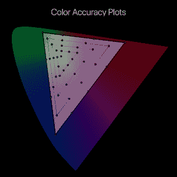

# LG G8 ThinQ 显示器评论——LG 的重点不在这里

> 原文：<https://www.xda-developers.com/lg-g8-thinq-display-review-lgs-focus-lies-elsewhere/>

两年过去了，在吹毛求疵的技术发烧友中，LG Display 仍然经常被视为劣质移动有机发光二极管面板的生产商，因为他们的显示器在 [Pixel 2 XL](https://www.xda-developers.com/pixel-2-xl-xda-display-analysis/) 和 LG V30 ThinQ 中的表现不佳。2018 年末，LG V40 ThinQ 上市，展示了 LG 第二代移动有机发光二极管面板。令人惊讶的是，它展示了真正的改进，并确立了 LG Display (LGD)作为移动有机发光二极管竞争对手的地位，[在我们对 V40 ThinQ 显示器的深入审查中进行了评估](https://www.xda-developers.com/lg-v40-thinq-display-review/)。以前被认为是最令人讨厌的蓝色视角，LGD 在移动有机发光二极管的持续研发导致了新面板，现在在智能手机显示屏上具有最佳视角，峰值亮度和色域与三星显示公司的相匹配。随着 LG G 系列采用以前 V 系列专有的有机发光二极管技术的传言，我自然非常渴望看到与 LG V40 ThinQ 的显示屏相比是否有进一步的改进，这是我 2018 年最喜欢的显示屏之一。因此，我们转向新的 LG G8 ThinQ 来寻找答案。

| 

### 好好好

*   非常*有力*和*充满活力*的显示
*   *卓越的*亮度
*   *出色的*均匀视角
*   动态伽马随着亮度增加饱和度
*   具有真实视图的自动色温适应

 | 

### 坏

 |
|  |

## **LG G8 ThinQ 性能总结**

LG G8 ThinQ 上的 P-OLED 面板拥有市场上像素密度最高的显示器之一，每英寸 564 像素，在其 14.2 平方英寸(对角线 6.1 英寸)的屏幕上包含 3120×1440 (19.5:9)五分之一菱形像素。默认情况下，屏幕设置为以 2340×1080 渲染，大约为每英寸 422 像素，但由于渲染分辨率没有完全划分为原生分辨率，因此由于重新采样，它看起来稍微不太密集。

该面板在低亮度下具有出色的均匀性，并延续了 LGD 在移动 OLEDs 中拥有最佳视角的趋势，尽管 G8 ThinQ 面板上的亮度下降似乎比 V40 ThinQ 上的亮度下降略高。黑色剪裁或黑色挤压也处理得很好，应该不是一个明显的问题。

LG G8 ThinQ 引入了一种称为“真实视图”的新显示功能，它的工作原理类似于苹果的“真实色调”，即通过将显示器的色温向环境照明的色温移动。这是我在 iPhones 上非常喜欢的一个功能，我希望更多的 Android OEMs 厂商能够采用。在我使用 G8 的过程中，该功能似乎在自动色彩配置文件中效果最好。

显示屏变得非常明亮，平均可能达到 855 尼特(50% APL)，略低于 Galaxy S10 的 893 尼特。Gmail 等具有更多空白空间的内容会降低整体显示亮度，在这些更白的内容像素水平下，G8 ThinQ 显示器的峰值仅为 570 尼特，而 iPhone X 为 643 尼特，Galaxy S10 为 723 尼特。在测量 G8 ThinQ 显示器能够发出的绝对最高白色水平时，它设法在微小的 1% APL 下输出了惊人的 1124 尼特，与 Galaxy S10 在相同 APL 下发出的 1130 尼特相当。

LG G8 ThinQ 显示器的原生色域非常宽，使其能够再现非常鲜明的色彩。它可以完全覆盖 P3 色域以及 Adobe RGB 色域中的大多数绿色。LG G8 ThinQ 的默认自动颜色配置文件扩展了颜色，使其看起来非常生动有力，红色略微偏向黄色，绿色则显得稍微冷一些。该配置文件也有一个非常冷的色温。

控制屏幕对比度的显示器的色调响应(也称为 gamma)在 G8 上非常高，并且扩展迅速。显示器亮度和内容像素级别越高，灰度系数和屏幕对比度就越高，这在最大亮度时会非常明显。这种显示特性也会随着显示器亮度的增加而增加色彩饱和度。一方面，实际上希望在较高的环境照明下增加色彩饱和度，以抵消来自环境照明的色域减小。然而，为了抵消环境光源的黑色水平提升，显示器伽马实际上需要降低，以减轻明亮光线下的阴影和颜色，但相反，G8 ThinQ *随着显示器亮度增加*伽马，这使得显示器在明亮的光线下不太清晰。

标准的参考颜色配置文件本应是颜色精确的，但由于上面提到的动态伽玛，因此很麻烦。结果，所有轮廓都过饱和，并且显示亮度越高，饱和度将增加。sRGB 色彩空间是最重要的精确定位的色彩空间，因为几乎所有内容都在其中描述，并且它是互联网上所有颜色的默认上下文色彩空间。G8 ThinQ 的 Web 配置文件以 sRGB 色彩空间为目标，在显示器的整个亮度范围内，最终的*δE*为 3.2，这是长期以来旗舰标准参考配置文件中测量的最差色彩准确度之一。有意思的是，再加上动态伽玛，显示器的总色彩精度随着亮度的增加而线性下降；显示器在最暗的时候实际上是最准确的，这也是颜色准确性最不重要的时候，因为人眼视锥对颜色的反应在这些水平上很差。

## **方法论▼**

为了从显示器中获得定量的颜色数据，我们将特定设备的输入测试模式放入手机，并使用 i1Pro 2 分光光度计测量显示器产生的发射。我们使用的测试模式和设备设置针对各种显示特性和可能改变我们所需测量的潜在软件实现进行了修正。许多其他站点的显示分析没有正确考虑它们，因此它们的数据可能不准确。我们首先测量显示器的全灰度，并报告白色的感知色彩误差及其相关色温。从读数中，我们还通过对每一步的理论伽马值进行最小二乘法拟合，得出显示伽马值。这个 gamma 值比那些从 CalMan 等显示校准软件报告 gamma 读数的值更有意义，也更真实，CalMan 等显示校准软件是对每一步的理论 gamma 进行平均。我们测试图案的目标颜色灵感来自于

[DisplayMate’s absolute color accuracy plots](http://www.displaymate.com/Colors_43s.html)

。在整个 CIE 1976 色度标度中，颜色目标的间隔大致均匀，这使得它们成为评估显示器的完整颜色再现能力的极好目标。灰度和色彩准确度读数以显示器读数的 20%为增量

*perceptual*

(非线性)亮度范围并进行平均以获得精确到显示器整体外观的单个读数。另一个单独的读数取自我们的参考 200

*cd/m²*

这对于典型的办公室条件和室内照明来说是很好的白色水平。我们主要使用色差测量

*CIEDE2000*

(简称为

*ΔE*

)作为色度准确度的度量。

*ΔE*

是由提出的行业标准色差度量

[International Commission on Illumination (CIE)](http://www.cie.co.at/)

最好地描述了颜色之间的均匀差异。也存在其他色差度量，例如色差

*Δu′v′*

在 CIE 1976 色度标度上，但是已经发现当评估视觉显著性时，这种度量在感知均匀性方面较差，因为在色差度量之间，测量的颜色和目标颜色之间的视觉显著性的阈值可能变化很大。例如，颜色差异

*Δu′v′*

0.010 的色差对于蓝色来说在视觉上是不明显的，但是对于黄色来说，相同的测量色差一眼就可以看出。注意到

*ΔE*

本身并不完美，但它已经成为目前存在的最具经验准确性的色差度量标准。

*ΔE*

通常在其计算中考虑亮度误差，因为亮度是完整描述颜色的必要组成部分。然而，由于人类视觉系统分别解释色度和亮度，我们将测试模式保持在恒定亮度，并补偿我们的亮度误差

*ΔE*

价值观。此外，在评估显示器的性能时，将这两种错误分开是有帮助的，因为就像我们的视觉系统一样，它与显示器的不同问题有关。这样我们可以更彻底地分析和理解显示器的性能。当测得的色差

*ΔE*

都在 3.0 以上，色差一眼就能从视觉上看出来。当测得的色差

*ΔE*

介于 1.0 和 2.3 之间时，色差只能在诊断条件下被注意到(例如，当测量的颜色和目标颜色在被测量的显示器上紧挨着彼此出现时)，否则，色差在视觉上是不可察觉的，并且看起来是准确的。测得的色差

*ΔE*

1.0 或更小的颜色被认为是完全感觉不到的，并且即使在与目标颜色相邻时，所测量的颜色看起来也无法与目标颜色区分开来。显示器功耗通过手机电池消耗和显示器亮度之间的线性回归的斜率来测量。以 20%的亮度步长观察并平均三分钟的电池消耗，并在尽量减少外部电池消耗源的同时进行多次试验。

## **颜色配置文件**

LG G8 ThinQ 的默认配置文件是**自动**配置文件，用更亮的橙色红色和非常鲜艳的绿色校准，绿色带有冷色调。白点在 7274 K 是冷的，并且在整个亮度范围内保持一致。在此配置文件中，您可以改变屏幕的相对红绿蓝强度，并将色温调整为从品红色到更青的范围，所有温度滑块位置实际上都具有相似的相关色温，只是颜色平衡不同。**专家**配置文件可用于进一步修改显示器的相对饱和度、色调和清晰度。

**Sports** 配置文件与 Auto 相同，只是整体上有相对更高的蓝色，并测量更冷的 7615 K 白点。

**游戏**的配置文件与 Auto 相似，在 7443 K 温度下略冷，其红色主界面延伸至 P3 红。

**Web** 配置文件是一个非色彩管理的标准参考配置文件，以 D65 白点为目标的 sRGB 色彩空间，是要正确校准的最重要的参考配置文件。由于显示器的动态伽玛系统无法禁用，G8 ThinQ 上的色彩准确性存在问题，因为设置的白色级别越高，它就会使色度过饱和。此外，Android 的自动色彩管理系统在此配置文件中不存在，这有助于正确显示在其他色彩空间(非 sRGB)中描述的内容。**电影院**和**照片**配置文件是另外两个标准参考配置文件，它们分别针对 P3 和 Adobe RGB 色彩空间。有了适当的色彩管理系统，这两种色彩配置文件就不是必需的了。

## **亮度**

我们的显示器亮度比较图表比较了 LG G8 ThinQ 相对于我们测量的其他显示器的最大显示器亮度。图表底部水平轴上的标签代表相对于 LG G8 ThinQ 显示器的感知亮度差异的乘数，LG G8 ThinQ 显示器固定为“1×”。显示器亮度的大小以每平方米坎德拉或尼特为单位，根据史蒂文幂定律使用感知点光源亮度的模态指数进行对数缩放，与 LG G8 ThinQ 显示器的亮度成比例缩放。这是因为人眼对感知亮度有对数反应。在线性标度上呈现亮度值的其他图表不能恰当地表示显示器的感知亮度的差异。

测量 OLED 面板的显示性能时，了解其技术与传统 LCD 面板有何不同非常重要。液晶显示器需要一个背光来让光通过滤色器，滤色器会阻挡光的波长，从而产生我们看到的颜色。OLED 面板能够使它的每个单独的子像素发出它们自己的光。这意味着 OLED 面板必须从其最大分配中为每个点亮的像素分配一定量的功率。因此，需要点亮的子像素越多，需要在点亮的子像素上分配的面板功率就越多，每个子像素接收的功率就越少。

图像的 APL(平均像素级别)是整个图像中每个像素的单个 RGB 分量的平均比例。例如，一个完全红色、绿色或蓝色的图像具有 33%的 APL，因为每个图像只包括完全照亮三个子像素中的一个。完整的颜色混合青色(绿色和蓝色)、品红色(红色和蓝色)或黄色(红色和绿色)具有 67%的 APL，而完全照亮所有三个子像素的全白图像具有 100%的 APL。此外，一半黑一半白的图像具有 50%的 APL。最后，对于有机发光二极管面板，总的屏幕内容 APL 越高，每个点亮像素的相对亮度越低。LCD 面板没有这种特性(除了局部变暗)，因此，在较高的 APL 下，它们比有机发光二极管面板更亮。

峰值显示亮度比 V40 ThinQ 略有提高，但比 G7 ThinQ 上的超亮 MLCD+显示屏明显下降。平均像素水平为 50%，这是概括有机发光二极管显示器亮度的一个很好的中点，G8 ThinQ 高达 855 尼特，在视觉上与 Galaxy S10 的 893 尼特一样亮。然而，LG G8 ThinQ 显示器确实受到高动态亮度衰减的影响，在 100% APL 下降至 570 尼特的峰值，略低于最新的 iPhones。在 1%的 APL 下，LG G8 ThinQ 能够达到 1124 尼特，与 Galaxy S10 一样亮。

LG G8 ThinQ 没有竞争对手那么暗，甚至没有 V40 ThinQ 那么暗，最低亮度为 2.7 尼特，相比之下，大多数其他旗舰产品的亮度不到 2 尼特，V40 ThinQ 的亮度为 2.3 尼特。

## **对比&伽玛**

显示器的灰度系数决定了屏幕上的整体图像对比度和颜色亮度。大多数显示器上使用的行业标准伽马遵循 2.20 的幂函数。更高的显示器伽马功率将导致更高的图像对比度和更暗的颜色混合，这是电影业正在朝着的方向发展，但智能手机在许多不同的照明条件下观看，更高的伽马功率是不合适的。下面的*伽玛曲线*是 LG G8 ThinQ 显示器上看到的颜色亮度与其相关输入驱动水平的对数-对数表示。高于 2.20 线的测量点表示色调比标准色调更亮，而低于 2.20 线的测量点表示色调比标准色调更暗。由于人眼对感知的亮度有对数反应，所以轴是对数标度的。

**现在，大多数现代旗舰智能手机显示屏都配有经过校准的色彩配置文件，色彩精确**。然而，由于有机发光二极管随着内容 APL 的增加而降低屏幕上颜色的平均亮度的特性，现代旗舰有机发光二极管显示器的总色彩准确度的主要差异现在在于显示器的最终伽马。伽马射线构成了非彩色(灰度分量)图像，或图像的结构，人类在感知时更敏感。因此，显示器的灰度系数与内容的灰度系数相匹配非常重要，通常遵循行业标准 2.20 幂函数。

色调响应，通常称为伽玛，是总色彩准确度最重要的显示方面。人类视觉系统对图像的对比度比对图像的颜色更敏感，显示器的灰度系数决定了屏幕的对比度。平均而言，LG G8 ThinQ 显示器上的画面对比度比平时更高，但问题是显示器的伽马值根据显示器的总发射量(显示器亮度和内容像素水平的组合)变化很大:在 APL 为 50%的情况下，测得的显示器伽马值范围从最小亮度的 2.23，一直到最大亮度的 2.67。在显示器的整个亮度范围内，伽马平均为 2.42，比标准亮度具有更高的对比度，尽管 APL 较低的较暗内容看起来相当准确。

请注意，变化的伽马并不一定是*坏*的事情；理想情况下，显示器在 0 勒克斯环境光(漆黑)下的伽马值应该为 2.4，在大约 200 勒克斯下降低到 2.2，并且环境照明越高，伽马值降低得越多，以在不同照明下在显示器上实现相同的视觉对比度外观。然而，LG G8 ThinQ 显示器伽玛相对于显示器亮度而不是环境照明发生变化，显示器伽玛增加而不是减少。这可能部分是由于有机发光二极管亮度回归，但这是我自三星 Galaxy Note 8 以来看到和测量的最高值之一。

此外，单个三色(RGB)值直接受到变化的伽马值的影响，增加了色度的解码伽马值，这将颜色推向/“压缩”接近 100%色域饱和度，并增加了工作色域。这是*而不是*校准错误的常见结果，因为色度的解码伽马值不会因相对通道调整而改变。这要么是有意在较高的环境照明下增加显示饱和度，要么是显示驱动器的疏忽。色域和解码伽马在最低显示器亮度下最正常，这表明伽马特性是显示器亮度的有意函数，因为面板从未主要(或至少不应该)在其最小亮度下校准。

有趣的是，LG G8 ThinQ 似乎有某种动态对比度控制，可能是作为 LG G 系列以前的 LCD 显示器的软件解决方案而保留的，它可以根据屏幕的平均相对亮度来短暂调整屏幕上所有颜色的亮度。最初，我认为这是为了抵消有机发光二极管亮度回归特性而设置的，但显示器仍然对内容 APL (15%)有中高动态亮度响应，并具有高显示灰度系数。

## **色温&驱动平衡**

白光源的色温描述了光的“暖”或“冷”程度。颜色通常需要至少两个点来描述，而相关色温是一维描述符，为了简单起见，省略了基本的色度信息。

sRGB 色彩空间以具有 D65 (6504 K)色温的白点为目标。以 D65 色温的白点为目标对于颜色准确性至关重要，因为白点会影响每种颜色混合的外观。然而，请注意，具有接近 6504 K 的相关色温的白点不一定看起来准确！有许多颜色混合可以具有相同的相关色温(称为 iso-CCT 线)，有些甚至看起来不是白色。因此，色温不应作为白点色彩准确度的衡量标准。相反，我们使用它作为一种工具来表现显示器白点的粗略外观，以及它如何在其亮度和灰度上变化。不管显示器的目标色温是多少，理想情况下，白色的相关色温在所有驱动电平下都应该保持一致，这在我们的下图中显示为一条直线。

驱动平衡图显示了单个红色、绿色和蓝色 led 的强度如何随显示器亮度变化，覆盖了显示器的相关白色色温，并揭示了显示器颜色校准的“紧密度”。这些图表比一维色温图表显示更多的颜色信息。理想情况下，红色、绿色和蓝色 led 应该在显示器的整个亮度范围内尽可能保持一致。

标准参考配置文件—网络、电影和照片—都适当地共享相同的白点校准和驱动平衡。在这些配置文件中，绿色 LED 在显示器的整个亮度范围内保持非常平衡和笔直，红色 LED 基本上是笔直的，除了在显示器接近 100%亮度时出现明显的下降，以及在低于 1%的信号电平时出现越来越大的偏差。蓝色 LED 是有问题的驱动器，主导了显示器的大部分较低亮度范围，并明显低于近 100%的信号水平。因此，非常暗的灰色会变成洋红色，而中灰色和低亮度的白色会蓝移。大约 100-200 尼特范围内的白色看起来最平衡(尽管略有红移)，而较高的白色水平开始转变为绿色，因为高发光效率的绿色 LED 开始接管主要增加显示器的亮度。

自动配置文件是校准最一致的配置文件，很可能是因为该配置文件是面板的默认工厂校准。简档的相关色温在整个亮度范围内非常一致，只有接近 100%亮度的不平衡才真正受到损害，在保持相关色温相似的同时，白点更多地向绿-青色移动，并且对于非常暗的灰色仍然移动品红色，但是与标准简档相比，移动程度较不明显。

## **色彩准确度**

我们的*色彩准确度图*为读者提供了显示器色彩性能和校准趋势的粗略评估。下面显示的是颜色准确度目标的基础，绘制在 CIE 1976 色度标度上，圆圈代表目标颜色。

 <picture></picture> 

Base Color Accuracy Plots chart

在下面的颜色准确度图中，白点代表 LG G8 ThinQ 测量颜色的位置。相关的拖尾颜色代表颜色错误的严重程度。绿色轨迹表示测得的色差非常小，颜色在显示器上显示准确，而黄色轨迹表示明显的色差，橙色和红色轨迹的色差更大。

Web 配置文件以 sRGB 色彩空间为目标，因此它是评估色彩准确性的最重要的配置文件。在“对比度和色调响应”一节中，我提到了当显示器亮度增加时，三色值和相应的色度如何直接受到显示器伽马值增加的影响。因此，配置文件的色彩准确度会随着显示器亮度而显著变化，从最小亮度时 1.6 的精确*δE*到最大亮度时 4.6 的极不精确的*δE*，在显示器的感知亮度范围内平均*δE*= 3.2±1.7。使用 sRGB 色彩空间的色彩精确工作通常在白色级别介于 80-200 尼特的显示器上完成，在这些亮度级别下，加上其高显示器伽玛，LG G8 ThinQ 不能被视为色彩精确，不适合对色彩敏感的工作。

其他标准配置文件也好不到哪里去，尽管它们的色域较宽，色度扩展较低，因此略低。针对 P3 色彩空间的 Cinema 配置文件的*δE*为 2.9±1.7，而针对 Adobe RGB 色彩空间的 Photos 配置文件的*δE*为 2.6±1.6。两者都没有突破被视为“精确”的*δE*= 2.3 阈值，并且由于动态色域，两者都具有极高的标准偏差。

## **LG G8 ThinQ 显示屏概述**

| 规格 | LG G8 ThinQ | 注意事项 |
| --- | --- | --- |
| 类型 | P-OLEDPenTile 钻石像素 |  |
| 制造商 | LG 显示器 |  |
| 大小 | 5.5 英寸乘 2.6 英寸 6.1 英寸对角线 14.1 平方英寸 |  |
| 解决 | 3120×1440 像素默认情况下以 2340×1080 的分辨率渲染 19.5:9 像素宽高比 | 由于圆角和显示屏剪切，实际像素数量会略少 |
| 像素密度 | 每英寸 399 个红色子像素 564 个绿色子像素 399 个蓝色子像素 | 与绿色子像素相比，五边形菱形像素显示器具有较少的红色和蓝色子像素 |
| 像素灵敏度的距离 | <8.6 inches for full-color image<6.1 inches for achromatic image | Distances for just-resolvable pixels with 20/20 vision. Typical smartphone viewing distance is about 12 inches |
| **亮度** | 855 尼特(自动)/ 388 尼特(手动)@ 50% APL570 尼特(自动)/ 402 尼特(手动)@ 100% APL1124 尼特(自动)/ 653 尼特(手动)@ 1% APL *优秀*

* * *

与 APL 有 15%的差异 | 动态亮度是屏幕亮度响应显示内容 APL 的变化 |
| **角度偏移** | -30%的亮度偏移*δE*= 7.3 向洋红色偏移 | 倾斜 30 度测量 |
| **黑色阈值** | <2.7%*好的* | 被削波为黑色的最小驱动电平，以 10 *cd/m* 测量 |

| 规格 | 自动 | 网页 | 注释 |
| --- | --- | --- | --- |
| 微克 | 2.23–2.68 平均值 2.42 *大方差* | 2.23–2.67 平均值 2.42 *过高* *方差大* | 标准是 2.2 的直线伽玛 |
| **白点** | 7274K*δE*= 6.2*故意冷* | 6543K *δE* = 3.2 | 标准是 6504 K |
| **色差** | 平均*δC*= 11.1*非常鲜明**δC*= 11.9 红色/*δH*= 4.2 偏向黄色*δC*= 25.6 绿色/*δH*= 3.6 偏向青色*δC*= 1.9 蓝色/*δH*= 0.7 偏向青色 | 平均值*δE*= 3.2 1.7 最大值*δE*= 8.8 100%蓝绿色 sRGB *差* *高方差* | *低于 2.3 的δE 值*看起来很准确*低于 1.0 的δE 值*看起来与理想值难以区分*δC*测量相对于 sRGB 颜色的饱和度差异*δH*测量相对于 sRGB 颜色的色调差异 |

与 LG V40 ThinQ 和 LG G7 ThinQ 相比，LG G8 ThinQ 似乎不是一个巨大的升级。对一些人来说，这甚至可能是一个更糟糕的展示。LG G8 ThinQ 的亮度不如 G7 ThinQ，G8 ThinQ 的色彩描述也不如 V40 ThinQ 准确。然而，大多数消费者可能会坚持默认的自动颜色配置文件，并享受配置文件提供的鲜艳色彩。该面板的亮度与其竞争对手相当，具有非常鲜明有力的颜色，并且可以选择调整白点色温或根据您的环境进行调整。不一致的音调响应仍然是主要问题，纯粹是有害的，并且提供了不太可预测的图像，对其特性没有好处。“自动配置文件”、“自动亮度”和“真实视图”的体验实际上非常令人愉快，没有其他不利的缺点，如过度的黑色挤压或显示不均匀性。事实上，我撒谎了:对于眼尖的人来说，我在我的 G8 ThinQ 上注意到了一点显示颗粒，这是我必须真正寻找的，在典型的观看距离上无法注意到的。这是一个小小的遗憾，因为我在 V40 ThinQ 显示器上根本检测不到任何信号。没有真正的颜色精确配置文件的省略可能会对特定的人造成影响，比如内容创作者(LG 似乎一直以他们的手动视频控制和“高保真”音频为目标)，或者那些只想知道他们看到的是准确的人，但如果你能够忍受没有书呆子级的颜色精确，LG G8 ThinQ 显示器绝对没问题。

[**LG G8 ThinQ 论坛**](https://forum.xda-developers.com/lg-g8)

[**【购买 LG G8 ThinQ(美国)**](https://www.lg.com/us/mobile-phones/g8-thinq) [**购买 LG G8 ThinQ(加拿大)**](https://www.lg.com/ca_en/cell-phones/lg-LMG820UM2)