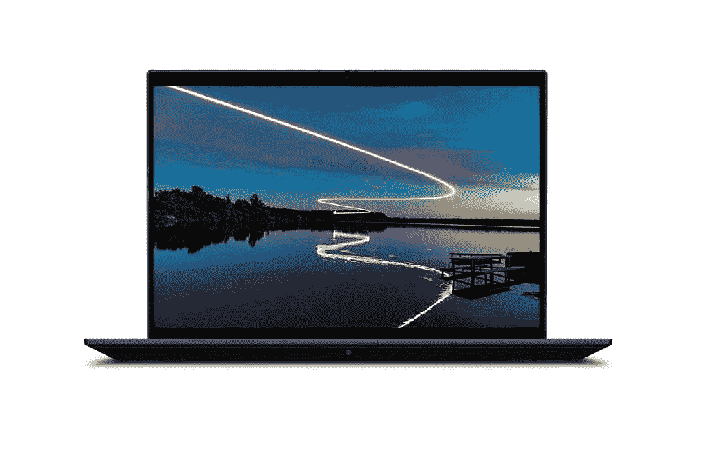
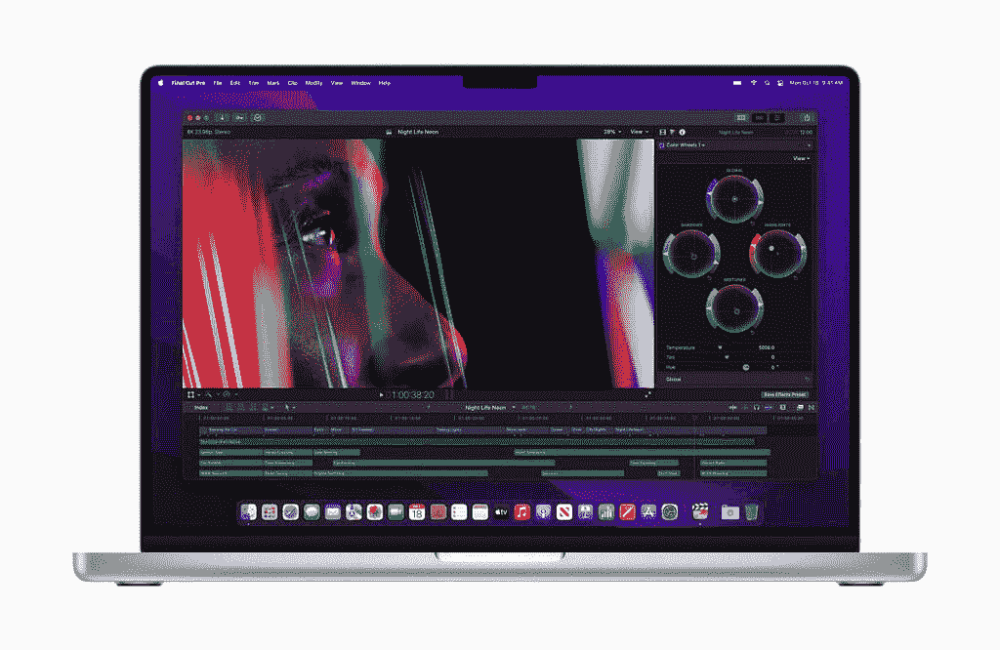
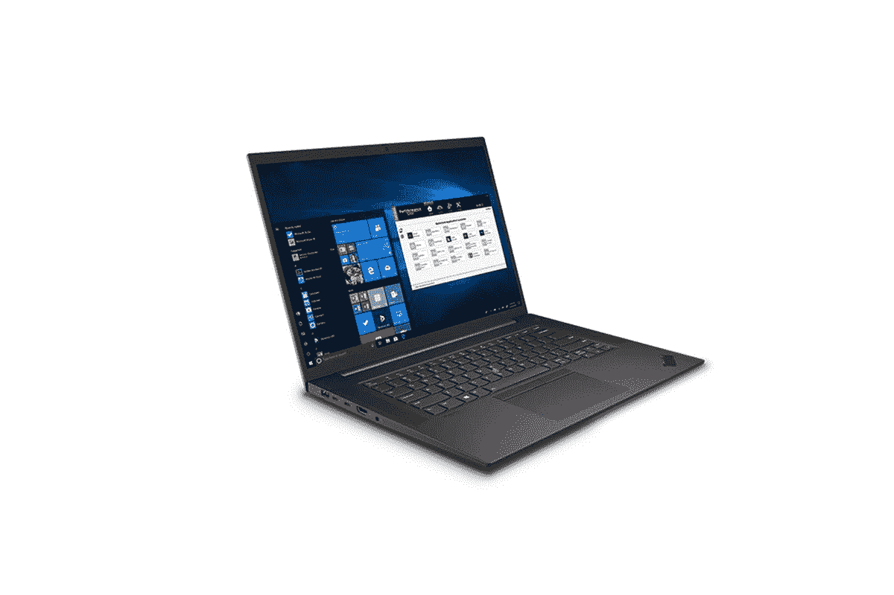

# MacBook Pro 16 vs 联想 ThinkPad P1:最好的 16 寸笔记本电脑是什么？

> 原文：<https://www.xda-developers.com/macbook-pro-16-vs-lenovo-thinkpad-p1/>

随着苹果最近推出全新的 [MacBook Pro 2021](https://www.xda-developers.com/macbook-pro-2021/) 型号，它们将成为你今天能买到的最强大和[最好的 MAC 电脑](https://www.xda-developers.com/best-macs/)之一。新的 MacBook Pro 16 英寸配备了新的苹果 M1 Pro 和 M1 Max，是一台可怕的机器，几乎可以碾压任何 Windows 超极本，甚至许多专业笔记本电脑。但是它能比移动工作站更好吗？我们将 16 英寸的 MacBook Pro 与联想 ThinkPad P1 Gen 4 进行比较，看看两者的表现如何。

这是两台非常强大的笔记本电脑，它们的屏幕尺寸也一样。但是它们在大多数其他方面是完全不同的，所以让我们仔细看看为什么你会更喜欢其中的一个。我们从规格开始。

## MacBook Pro 16 英寸与联想 ThinkPad P1:规格

|  | 

MacBook Pro 16

 | 

联想 ThinkPad P1 第四代

 |
| --- | --- | --- |
| **处理器** | 

*   苹果 M1 专业版(未知时钟速度，10 核)
*   苹果 M1 Max(未知时钟速度，10 核)

 | 

*   英特尔酷睿 i7-11800H(最高 4.6GHz，8 核)
*   英特尔酷睿 i7-11850H(最高 4.8GHz，8 核)
*   英特尔酷睿 i9-11950H(最高 5GHz，8 核)
*   英特尔至强 W-11855M 处理器(最高 4.9GHz，6 核)

 |
| **图形** | 

*   16 核 GPU (M1 专业版)
*   24 核 GPU (M1 最大)
*   32 核 GPU (M1 最大)

 | 

*   NVIDIA GeForce RTX 3070 Max-Q 8GB gddr 6
*   NVIDIA GeForce RTX 3080 Max-Q 16GB gddr 6
*   NVIDIA T1200 4GB
*   英伟达 RTX A2000 4GB
*   英伟达 RTX A3000 6GB
*   英伟达 RTX A4000 8GB
*   英伟达 RTX A5000 16GB

 |
| **撞锤** | 

*   16GB(仅限 M1 专业版)
*   32GB
*   64GB(仅限 M1 最大值)

 |  |
| **存储** |  |  |
| **显示** | 

*   16.2 英寸，3456 x 2234 分辨率，宽彩色(P3)，真实色调，120 赫兹，1000 尼特

 | 

*   16 英寸四核高清+ (2560 x 1600) IPS，100% sRGB，400 尼特
*   16 英寸超高清+ (3840 x 2400) IPS，100% Adobe RGB，HDR400，600 尼特
*   16 英寸超高清+ (3840 x 2400) IPS，触摸屏，100% Adobe RGB，HDR400，600 尼特

 |
| **音频** | 

*   六扬声器立体声，带力消除低音扬声器，杜比 Atmos

 | 

*   双 2W 立体声扬声器，杜比全景声

 |
| **网络摄像头** | 

*   1080p 前置网络摄像头

 |  |
| **生物特征安全** |  | 

*   电源按钮中的指纹识别器
*   可选:Windows Hello 红外摄像头

 |
| **电池** | 

*   99.8 瓦时，长达 21 小时的 Apple TV 电影播放

 | 

*   90 瓦时电池，长达 10.9 小时(MobileMark 2018)

 |
| **端口** | 

*   3 个雷电 4 端口
*   高清晰度多媒体接口
*   MagSafe 3 充电端口
*   SD 读卡器
*   3.5 毫米耳机插孔

 | 

*   2 个 Thunderbolt 4(USB C 类)端口
*   3 个 USB 3.2 第二代 A 类端口
*   HDMI 2.1
*   SD 读卡器
*   3.5 毫米耳机插孔

 |
| **连通性** |  | 

*   英特尔 Wi-Fi 6E AX210 (2x2)，蓝牙 5.2

 |
| **颜色** |  | 

*   黑色，盖子上可选碳纤维编织

 |
| **尺寸(WxDxH)** | 14.01 x 9.77 x 0.66 英寸(355.7 x 248.1 x 16.8 毫米) | 14.15 x 9.99 x 0.7 英寸(359.5 x 253.8 x 17.7 毫米) |
| **重量** |  |  |
| **起始价格** | $2,499.99 | 1，859.99 美元(各不相同) |

## Windows vs macOS

这两款笔记本电脑首先要注意的是操作系统，这一点都不新鲜。Windows 和 macOS 之间的差异众所周知，你可能已经有了偏好。macOS 目前升级到版本 12，名为 [macOS Monterey](https://www.xda-developers.com/macos-monterey-review-the-calm-after-big-sur/) ，通常被认为是初学者更容易上手的操作系统。它在内容创作者中也享有盛誉，像 Final Cut Pro 这样的软件是 macOS 专用的。

另一方面，联想 ThinkPad P1 配备了 Windows 10，可以免费升级到 [Windows 11](https://www.xda-developers.com/windows-11/) 。Windows 有自己的优势，也就是说，它的应用范围更广，因此许多应用程序只为 Windows 而存在，或者首先为 Windows 发布。与 macOS 相比，Windows 的各种应用程序通常更容易找到。如果你是超级用户，Windows 也倾向于给你更多的自由来处理更高级的设置。不管怎样，两种操作系统都有各自的优缺点，坦白地说，你可能已经知道你更喜欢什么了。

## MacBook Pro 16 英寸与 ThinkPad P1:性能

谈到性能，这是苹果在新款 MacBook Pro 中最突出的领域之一。16 英寸的 MacBook Pro 配备了苹果 M1 Pro 或苹果 M1 Max，这两款处理器都非常强大，集成了 CPU 和 GPU。因为这些都是全新的芯片，我们还没有对它们进行任何真实世界的性能测量，但我们有苹果的声明，它们非常令人印象深刻。

在 CPU 方面，苹果 M1 Pro 和 M1 Max 是一样的。苹果将 CPU 性能与英特尔酷睿 i7-11800H 进行了比较，并声称在相同的功率水平下，它可以实现 1.7 倍的高性能，最重要的是，它可以实现相同水平的性能，而使用的功率却减少了 70%。现在，你可以买到最高配置英特尔酷睿 i9-11950H 的联想 ThinkPad P1，这自然比酷睿 i7 快，但根据基准测试，它并没有快 1.7 倍，所以苹果 M1 Pro 和 Max 可能仍会胜出。

至于 GPU，看起来苹果可能会在顶端再次胜出。联想 ThinkPad P1 Gen 4 配备了高达 16GB 显存的英伟达 RTX A5000 Max-Q GPU，性能与 GeForce RTX 3080 Max-Q 相似。苹果将苹果 M1 Max 中的 32 核 GPU 与 Razer Blade 15 Advanced 中的 GeForce RTX 3080 笔记本电脑 GPU 进行了比较，后者的功率为 105W。苹果声称，它可以实现与这种 GPU 相似的性能水平，而功耗却降低了 40%。值得注意的是，这些 GPU 的 Max-Q 变种可能会表现更差，因为它们是为散热设计效率较低的小型笔记本电脑设计的。因此，在高端市场，苹果似乎打败了联想。

然而，归根结底，这两款都是非常强大的笔记本电脑，无论如何，你都不会乞求更高的性能。可能值得考虑的是电池寿命。苹果公司的内部芯片非常节能，根据上面的说法，这里似乎也是如此。苹果承诺 16 英寸 MacBook Pro 充电后可播放长达 21 小时的视频，或 14 小时的无线网络浏览。根据 MobileMark 2018 测试，联想声称长达 10.9 小时，但像这样强大的基于英特尔的笔记本电脑在现实生活中很少能坚持这么久。

> MacBook Pro 拥有高达 64GB 的统一内存，GPU 和 CPU 都可以访问。

在内存方面，MacBook Pro 配备了高达 64GB 的统一内存，联想 ThinkPad P1 Gen 4 也可以配置高达 64GB 的内存。一个很大的区别是，苹果的统一内存可供 CPU 和 GPU 使用，因此与任何基于 Windows 的笔记本电脑相比，你可以使用非常大的视频内存。另一方面，在 MacBook Pro 上，以后不可能升级内存，而联想 ThinkPad P1 更容易升级。

至于存储，MacBook Pro 可以配置高达 8TB 的开箱存储，而联想 ThinkPad P1 只能提供高达 1TB 的存储。然而，ThinkPad P1 有两个 M.2 插槽，这意味着如果你需要，你可以升级固态硬盘，也可以拥有高达 8TB 的存储空间。这可能也比从原始设备制造商那里购买升级更便宜。

## 显示器:液态视网膜 XDR 来到 MacBook Pro

就显示屏而言，MacBook Pro 16 和联想 ThinkPad P1 Gen 4 的起点相似，因为它们都是 16 英寸的面板，长宽比为 16:10，尽管 MacBook Pro 的屏幕稍微大了一些，为 16.2 英寸。

 <picture></picture> 

Lenovo ThinkPad P1

至于质量，这两款笔记本电脑以不同的方式提供。联想 ThinkPad P1 有几种不同的配置。基本型号是一个四高清+ (2560 x 1600)显示器，它覆盖了 100%的 sRGB。但是，您可以升级到更令人印象深刻的超高清+ (3840 x 2400)面板，它可以 100%覆盖 Adobe RGB，支持 DisplayHDR 400，亮度为 600 尼特。这就好多了，而且 100% Adobe RGB 覆盖率使其非常适合对颜色敏感的工作。你还可以为它添加触摸支持，苹果仍然拒绝为其笔记本电脑提供这种支持。

然而，MacBook Pro 本身就有一个出色的显示屏。16.2 英寸的面板分辨率为 3456 x 2234，略低于 4K 分辨率。但它最令人印象深刻的是它是一个迷你 LED 面板，这使它具有类似于有机发光二极管显示器的优势。它的对比度为 1，000，000:1，可以处理 1000 尼特的持续全屏亮度或高达 1600 尼特的峰值亮度。因为它使用迷你 LED，所以它有许多调光区，这使得黑色像素几乎完全关闭。它另一个令人印象深刻的地方是它有 120Hz 的刷新率，苹果称之为 Pro Motion，它可以在需要时动态调整刷新率以节省电池。

 <picture></picture> 

MacBook Pro 16-inch

然而，MacBook Pro 的一个明显缺陷是凹槽。是的，MacBook Pro 有一个凹槽来容纳网络摄像头，类似于 iPhone 也有一个凹槽。这使得 MacBook Pro 现在可以有一个 1080p 网络摄像头，这是一个受欢迎的升级，但 ThinkPad P1 也有一个 1080p 网络摄像头，而是将其放在显示器上方的边框中。当然，这确实意味着你有一个更大的边框，但对大多数用户来说，这可能比屏幕上有一个大的切口更不和谐。

> 苹果在 16 英寸 MacBook Pro 上使用强大的六扬声器设置已经有一段时间了，在新型号中甚至更好。

至于声音，这是 MacBook Pro 要好得多的一个方面。苹果在 16 英寸 MacBook Pro 上使用强大的六扬声器设置已经有一段时间了，在这款机型上甚至更好。与 ThinkPad P1 的双立体声扬声器相比，它听起来更好，声音更大。

## 设计和连接:新款 MacBook Pro 有合适的端口

作为专业笔记本电脑，MacBook Pro 和联想 THinkPad P1 的设计都相当平淡。MacBook Pro 有银色或太空灰两种颜色可供选择，与我们现在习惯的颜色相同。ThinkPad P1 有黑色，但如果你选择超高清+显示屏，你会在盖子上看到碳纤维图案，这有助于它更加突出。

尽管拥有高效的处理器，但令人惊讶的是，与联想 ThinkPad P1 相比，16 英寸的 MacBook Pro 没有那么便携。它几乎在每个维度上都更小——它没有那么宽、高或深，但它的起始重量为 4.7 磅，远高于 ThinkPad P1 的 3.99 磅，如果你打算随身携带笔记本电脑几个小时，你可能会感觉到这一点。公平地说，根据 CPU 和 GPU 的配置，ThinkPad P1 可能会变得更重一些，但这是一个明显的区别。

为了弥补这一点，新的 MacBook Pro 终于恢复了适当的端口，而不是强迫每个人都使用 [Thunderbolt docks](https://www.xda-developers.com/best-thunderbolt-docks/) 。你仍然有三个 Thunderbolt 4 端口和一个耳机插孔，但现在还有 HDMI，一个 SD 读卡器，MagSafe 充电也回来了。例如，如果您被充电电缆绊倒，这种磁性充电器设计应该有助于防止您的笔记本电脑摔倒。然而，仍然没有 USB Type-A。

与此同时，联想 ThinkPad P1 有两个 Thunderbolt 4 端口、两个 USB Type-A 端口、HDMI、一个 SD 读卡器、一个耳机插孔和一个专有充电端口。USB Type-A 确保与许多仍使用此端口连接的外设兼容，这对一些用户来说可能很重要。除此之外，这两款笔记本电脑还算相似。

至于安全性，这两款笔记本电脑都配备了内置在电源按钮上的指纹识别器，使登录更容易。然而，如果你想更方便地登录，ThinkPad P1 还为你提供了 Windows Hello 面部识别选项。

ThinkPad P1 相对于 MacBook Pro 16 的一大优势是支持蜂窝连接，至少在理论上是这样。目前在美国可用的配置都不支持蜂窝，但联想将其作为一个可选功能。

## 结果

公平地说，总的来说，16 英寸的 MacBook Pro 比联想 ThinkPad P1 更好。它有一个更快的芯片组，如果你需要最大的性能，你可能会更好。最值得注意的是，它是一款非常高效的芯片，所以你也很有可能从 MacBook Pro 中获得更长的电池寿命。此外，它还有一个奇妙的迷你 LED 显示屏，刷新率为 120Hz，这是每种配置的标准配置。此外，在多年来 MacBook Pro 试图迫使所有人改用 Thunderbolt 之后，它拥有稳定的端口供应。

 <picture></picture> 

MacBook Pro 14-inch (2021)

不过，联想 ThinkPad P1 仍有一些优势。它一开始就很轻，而且您可以选择覆盖 100% Adobe RGB 的超高清+显示屏，这是创作工作的理想选择。此外，你可以在一些型号中获得触摸支持，这是苹果仍然拒绝添加到 MacBook 阵容中的东西。如果你还在使用大量的 USB 类外设，ThinkPad P1 内置了这些端口。

> 这是两款功能强大的笔记本电脑，具有丰富的连接选项和出色的显示屏，都将为您带来出色的体验。

归根结底，选择一个而不是另一个的最大因素可能是操作系统。这两款都是非常强大的笔记本电脑，具有可靠的连接和出色的显示屏。虽然它们是不同的，你当然可以说 MacBook Pro 在技术上更好，但无论如何你都会获得很好的体验。一个例外可能是电池寿命，因为 MacBook Pro 的电池寿命可能会好得多，如果你买的是笔记本电脑，这一点很重要。

不管你选择什么，你都可以通过下面的链接购买这两款笔记本电脑中的任何一款。如果你选择了 MacBook Pro，请务必查看我们的最佳 MacBook Pro 保护套列表,以确保你的新笔记本电脑的安全。

 <picture></picture> 

MacBook Pro 16

##### 苹果 MacBook Pro 16 英寸(2021)

MacBook Pro 是一款功能强大的笔记本电脑，采用苹果的 M1 Max 芯片组，可以像高端 Windows 笔记本电脑一样强大，同时功耗更低。

 <picture></picture> 

Lenovo ThinkPad P1 Gen 4

##### 联想 ThinkPad P1 第四代

联想 ThinkPad P1 是一款功能强大的移动工作站，配备高端英特尔酷睿处理器和英伟达 RTX 显卡。