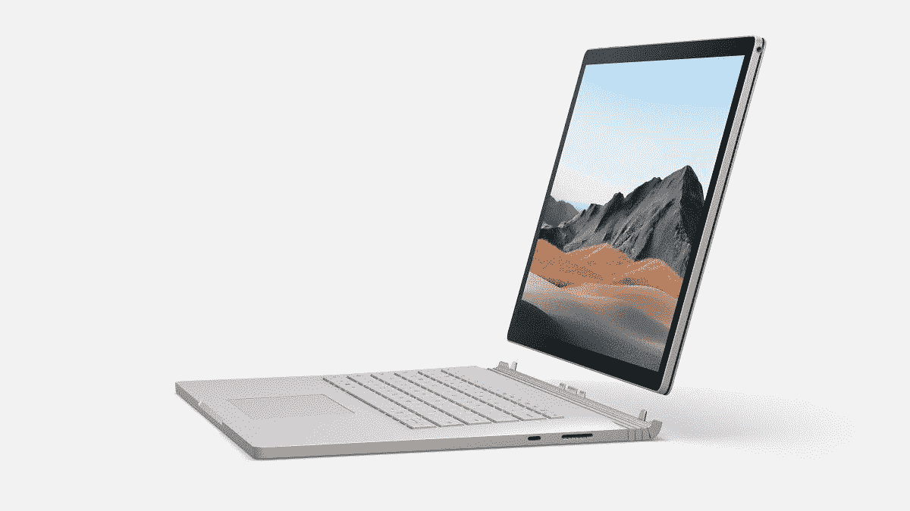

# Surface Laptop 4 vs Surface Book 3:该买哪款笔记本？

> 原文：<https://www.xda-developers.com/micrsoft-surface-laptop-4-vs-surface-book-3/>

微软制造了两款不同的笔记本电脑 Surface Laptop 4 和 Surface Book 3。此外，它们都有 13.5 英寸和 15 英寸的尺寸，屏幕为 3:2。它们都是高端电脑，很难说哪个更好。像往常一样，微软为不同的使用情况制造不同的个人电脑，我们在这里进行比较并得出结论，哪种设备更适合哪种需求！

## 微软 Surface Laptop 4 和 Surface Book 3:规格

|  | 

Surface Laptop 4 13.5

 | 

Surface Laptop 4 15

 | 

Surface Book 3 13.5

 | 

Surface Laptop 3 15

 |
| --- | --- | --- | --- | --- |
| 

中央处理器

 | 英特尔酷睿 i5-1135 G7 英特尔酷睿 i7-1185G7AMD 锐龙 5 4680U Surface 版 | 英特尔酷睿 i7-1185G7AMD 锐龙 7 4980U Surface Edition | 英特尔酷睿 i5-1035 G7 英特尔酷睿 i7-1065G7 | 英特尔酷睿 i7-1065G7 |
| 

国家政治保卫局。参见 OGPU

 | 英特尔 Iris XeAMD 镭龙 | 英特尔 Iris Plus 显卡 Nvidia GeForce GTX 1050 采用 Max-Q 设计 4GB GDDR5 | 采用 Max-Q 设计的 NVIDIA GeForce GTX 1660 Ti 6GB gddr 6 |
| 

身体

 | 12.1x8.8x0.57 英寸(308 x 223 x 14.5 毫米) | 13.4x9.6x0.58 英寸(339.5 x 244 x 14.7 毫米) | 酷睿 i5: 12.3x9.14x0.51-0.90 英寸(312x232x13-23 毫米)英特尔酷睿 i7: 12.3x9.14x0.59-0.9 英寸(312 x232 x15-23 毫米) | 13.5x9.87x0.568-0.90 英寸(343 x 251 x 15-23 毫米) |
| 

重量

 | 阿尔坎塔拉- 2.79 磅(1，265 克)铝- 2.84 磅(1，288 克) | 铝- 3.4 磅(1，542 克) | 酷睿 i5: 3.38 磅(1，534 克)酷睿 i7: 3.62 磅(1，642 克) | 4.2 磅(1905 克) |
| 

显示

 | 屏幕:13.5 英寸像素传感器显示屏分辨率:2256 x 1504 (201 PPI)宽高比:3:2 支持表面笔触摸:10 点多点触摸 | 屏幕:15 英寸 PixelSense 显示屏分辨率:2496 x 1664 (201 PPI)宽高比:3:2 支持表面笔触摸:10 点多点触摸 | 屏幕:13.5 英寸 PixelSense 显示屏分辨率:3000 x 2000 (267 PPI)宽高比:3:2 对比度:1600:1 触控:10 点多点触控 G5 | 屏幕:15 英寸 PixelSense 显示屏分辨率:3240 x 2160，(260 PPI)10 点多点触控 G5 纵横比:3:2 对比度:1600:1 |
| 

记忆

 | 8GB、16GB 或 32GB LPDDR4x 内存 | 16GB 或 32GB LPDDR4x |
| 

储存；储备

 | 可移动固态硬盘:256GB、512GB 或 1TB | 256GB、512GB 或 1TB PCIe 固态硬盘 | 256GB、512GB、1TB 或 2TB PCIe 固态硬盘 |
| 

电池

 | 电池容量标称值(WH)47.4 电池容量最小值(WH) 45.8 | 底座 55 瓦时，平板电脑 18 瓦时 | 底座 59.9 瓦时，平板电脑 22.8 瓦时 |
| 

相机、视频和音频

 | Windows Hello face 身份验证摄像头(前置)720p 高清 f2.0 摄像头(前置)双远场 Studio 麦克风和杜比全景声扬声器 | Windows Hello face 认证摄像头(前置)500 万像素前置摄像头，支持 1080p 高清视频 800 万像素后置自动对焦摄像头，支持 1080p 高清视频双远场演播室麦克风前置立体声扬声器，支持杜比全景声 |
| 

港口

 | 1 个 USB 3.2 Gen 2 Type-C(1 个)USB 3.2 Gen 2 Type-A(1 个)表面连接(1 个)3.5 毫米音频 | 2 个 USB 3.2 Gen 2 Type-A(1 个)USB 3.2 Gen 2 Type-C(1 个)3.5 毫米音频 XC 读卡器底座和平板电脑上的表面连接端口 |
| 

连通性

 | Wi-Fi 6: 802.11ax 兼容蓝牙无线 5.0 技术 |
| 

安全性

 | 用于企业安全的 TPM 2.0 芯片和 BitLocker 支持通过 Windows Hello face 登录提供企业级保护 |
| 

颜色；色彩；色调

 | 铂金色、哑光黑色、砂岩色、冰蓝色 | 铂金色，哑光黑色 | 铂 |
| 

材料

 | 铝金属 | 镁 |
| 

操作系统（Operating System）

 | Windows 10 主页 |
| 

价格

 | 起价 999.99 美元 | 起价 1299.99 美元 | 起价 1599.99 美元 | 起价 2299.99 美元 |

* * *

## 设计:Surface Book 3 有一个额外的 USB 端口和一个可拆卸的显示屏

当最初的 Surface Book 在 2015 年推出时，它紧随人们对 Surface 笔记本电脑的需求而来。当时微软唯一的 PC 就是它的 Surface 平板电脑。Panos Panay 在纽约市的一次活动中展示了这段视频，当视频结束时，他实际上让所有人再看了一遍。这一次，盖子从底座上掉了下来。这是一个神奇的产品介绍。

但这是 Surface Book 3 的关键所在。这是一款带有可拆卸显示屏的电脑，而 Surface Pro 7 是一款带有可拆卸键盘的平板电脑。Surface Book 3 非常头重脚轻。那是因为所有的内脏都在展示中。这包括 CPU、RAM、存储器和两块电池中的一块。当您取下显示器时，它必须保持完整的功能。

Surface Laptop 4 简单来说就是笔记本。屏幕根本不会分离，这仍然有利弊。这台笔记本电脑不那么头重脚轻。笔记本电脑 4 的所有部件都在底座上，就像大多数笔记本电脑一样。

这就是两个关键用例出现的地方。如果你打算简单地将它用作笔记本电脑，你最好选择 Surface Laptop 4。如果你需要拆卸显示器，将其用作平板电脑，那么你应该选择 Surface Book 3。事实上，这是购买 Surface Book 3 而不是 Surface Laptop 4 的少数理由之一。

Surface Laptop 4 还有更多的颜色。铝制笔记本有铂金色、哑光黑色、冰蓝色和砂岩色，尽管 15 英寸版本只有前两种颜色。Surface Book 3 有你想要的任何颜色，只要是铂金色(对于那些没有得到讽刺的人来说——它只有一种颜色)。

## 显示屏:Surface Laptop 4 的像素密度较低

我想将这两台笔记本电脑并排放置的原因之一是它们的显示屏大小相同。它们都有 13.5 英寸和 15 英寸两种版本，这很好。我们稍后会详细讨论的一件事是，更大的 Surface Book 3 可以提供更大的功率。Surface Laptop 4 就不是这样了。

这两种屏幕的关键区别在于像素密度。Surface Laptop 4 是 201ppi，Surface Book 3 是 267ppi。我不认为微软曾经给出过笔记本电脑像素密度较低的合理原因，但我怀疑它认为你可能最终会把平板电脑放在离眼睛更近的地方。一般来说，我们拿得离眼睛越近的屏幕往往像素密度越高。

对于一般的用例，我真的觉得哪一个都可以。我在使用 Surface 笔记本电脑时，从未发现它的屏幕出现像素化现象。如果是拿平板电脑的问题，那就不是笔记本电脑的问题了。再说一次，这取决于你打算如何使用它。

## 键盘:如果你想要的话，Surface Laptop 4 配有 Alcantara 面料

就键盘本身的差异而言，没什么可说的。它们都是背光的，感觉都类似于 type on。Surface Laptop 4 的按键更有可塑性，但也仅此而已。

Surface Laptop 4 上的触摸板实际上要大得多。微软倾向于在第三代重新设计或改进 Surface 产品，而这正是 Surface 笔记本电脑上触摸板被放大的时候。Surface Book 3 没有得到同样的待遇。

另一个关键区别是，Surface Laptop 4 在 13.5 英寸的机型上配备了 Alcantara 键盘。只有冰蓝色和白金版。其余的都是直板铝。

就我个人而言，我很喜欢阿尔坎塔拉，但它需要额外的维护。你需要[保持干净](https://www.xda-developers.com/how-to-clean-alcantara-keyboard-surface-laptop-4/)这样它就不会被弄脏。

## 性能:Surface Book 3 有专用的 GPU

除了外形因素，性能是 Surface Laptop 4 和 Surface Book 3 之间的最大差异。Surface Book 3 实际上在底座中包含了一个专用的 GPU。这是一款 13.5 英寸型号的 Nvidia GeForce GTX 1650，配有 4GB GDDR5，15 英寸型号的 GTX 1660 Ti。

这是一个很大的功率提升，特别是在更大的 Surface Book 3 中。由于 GPU 位于底座中，如果您拆下屏幕，就会失去额外的功能。一旦发生这种情况，它依赖于集成的虹膜加图形。

没错，Surface Book 3 依然有第十代英特尔处理器。它们也是 U 系列。由于它被宣传为动力强劲，你可能会认为它有一个 45W 的处理器或什么的。并没有。13.5 英寸型号有一个 15W 的 U 系列处理器，而 15 英寸版本有相同的处理器，但 TDP 提高到 20W。

Surface Laptop 4 使用的是同一级别的处理器，但来自一个更新的系列。它配备了英特尔的第 11 代芯片，配有更强大的 Iris Xe 显卡。换句话说，它不会匹配 15 英寸 Surface Book 3 中的专用 GTX 1660 Ti，但当你拆下屏幕时，它会冒烟的集成显卡。

同样值得注意的是，Surface Laptop 4 也配备了 AMD 锐龙 4000 处理器。它们基于 7 纳米工艺制造，非常棒。但是，尽管锐龙 4000 去年轻松击败了英特尔的第十代芯片，AMD 现在已经赶上了锐龙 5000。

## 结论:应该买 Surface Laptop 4 还是 Surface Book 3？

Surface Laptop 4 是我们在评论中已经推荐过的产品。我们赞扬了它的前身，它列出了[最好的 Windows Hello](https://www.xda-developers.com/best-laptops-with-windows-hello/) 笔记本电脑名单和[最好的 AMD 锐龙笔记本电脑](https://www.xda-developers.com/best-amd-ryzen-laptops/)名单。这是一款非常棒的全能笔记本电脑，只要你不需要 Thunderbolt。

另一方面，Surface Book 3 有点古怪。为了让它值回微软异常高的售价，你真的需要它提供的东西。两个关键的东西是可拆卸的显示器和专用的 GPU。如果你不需要其中任何一个，在庞大的 Windows 硬件生态系统中有更好的选择。

这并不意味着 Surface Book 3 是一个糟糕的选择。其实还是很不错的选择。这使得它成为一个昂贵的选择。但是在两台电脑中选择时，你应该清楚自己需要什么。如果你需要一台翻盖式笔记本电脑，那么 Surface Laptop 4 就是你的选择。如果你想要一辆动力强劲的敞篷车，那就选 Surface Book 3 吧。

 <picture></picture> 

Surface Laptop 4 (Ryzen 7/512GB)

##### 微软 Surface Laptop 4

Surface Laptop 4 配备了英特尔和 AMD 处理器，四种颜色和 Alcantara 键盘。

 <picture></picture> 

Surface Book 3

##### 微软 Surface Book 3

Surface Book 3 拥有英特尔 Ice Lake 处理器、Nvidia 显卡和可拆卸屏幕。

 <picture></picture> 

Surface Pen

##### 微软 Surface Pen

Surface Pen 是微软 Surface 设备的附加配件，被证明是精密触摸输入的宝贵手写笔。