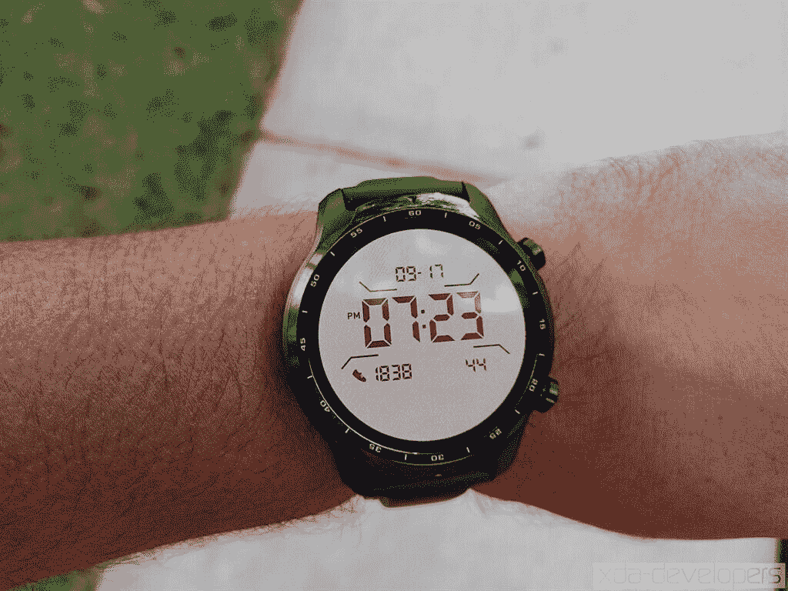

# TicWatch Pro 3 评测 Wear OS 需要的智能手表升级

> 原文：<https://www.xda-developers.com/mobvoi-ticwatch-pro-3-review/>

Android 进入可穿戴设备已经有 6 年多的时间了，然而运行谷歌 Wear OS 的智能手表仅占智能手表总市场的 10%。由于谷歌自己拒绝推出自己的智能手表，Mobvoi 和 Fossil 一直是 Wear OS 智能手表的两大旗手。这两个品牌已经竭尽全力掩盖 Wear OS 平台和高通可穿戴芯片组的不足，但最好的 Wear OS 智能手表与三星的 Galaxy Watch 和 Apple Watch 之间的差距继续扩大。由于高通新的可穿戴芯片组与 Mobvoi 的 TicWatch Pro 系列的结合，这一差距最终正在缩小。认识一下 [Mobvoi 的 TicWatch Pro 3](https://www.xda-developers.com/mobvoi-ticwatch-pro-3-smartwatch-google-wear-os-qualcomm-snapdragon-wear-4100-launch/) 。

我并没有使用 Wear OS 智能手表的传奇历史——更不用说一般的智能手表了——因为我一直觉得当前的智能手表还有很多不足之处。我的第一块智能手表是第一代 [Moto 360](https://forum.xda-developers.com/smartwatch/moto-360) 。它的设计领先于时代，仅次于华为手表。可惜速度慢，续航差的可怕，而且当时的 app 选择很微小。我以令人难以置信的 50 美元的低价买到了它，所以我并没有太多抱怨。不过，我肯定不会支付 200 美元的建议零售价，对于目前市场上的任何 Wear OS 智能手表，我也不会这么做。为什么？因为他们都有古老的处理器。

过去 4 年中发布的每一款 Wear OS 智能手表都采用了高通的[骁龙 Wear 2100](https://www.xda-developers.com/xda-external-link/qualcomm-announces-the-snapdragon-wear-2100-soc-for-wearable-devices/) 、 [2500](https://www.qualcomm.com/products/snapdragon-wear-2500-platform) 或 [3100](https://www.xda-developers.com/qualcomm-snapdragon-wear-3100-wear-os-smartwatch/) 芯片组，这些芯片组采用了动力不足的 ARM Cortex-A7 内核，并采用过时的 28 纳米工艺制造。最重要的是，谷歌似乎忽视了用新功能和优化来更新 Wear OS。正因为如此，去年年初，当我发现三星的第一代 Galaxy 手表很划算时，我选择了它。它与我的 Android 智能手机的集成有点笨拙(我需要下载多少插件，三星？)，46 毫米的型号在我的手腕上沉重得令人不舒服，Bixby 助手则乏善可陈，但它的电池寿命和性能都很出色。由于三星的定制芯片组和软件，Galaxy Watch 被广泛认为是 Android 用户的最佳智能手表。自第一代 Galaxy Watch 以来，三星智能手表变得越来越好，而 Wear OS 智能手表却萎靡不振。

今年，高通终于在[骁龙 Wear 4100](https://www.xda-developers.com/qualcomm-snapdragon-4100-announcement-wear-os-smartwatches/) 中推出了可穿戴设备的新硅，新的 Mobvoi TicWatch Pro 3 是首批采用该芯片组的智能手表之一。此外，谷歌终于给了 Wear OS 一些急需的关注，最近的更新[解决了性能和电池寿命](https://www.xda-developers.com/google-rolling-out-wear-os-h-mr2-update-better-performance-battery-life/)。随着新芯片组的投入使用以及 Wear OS 的累积更新对平台的改善，我一直渴望尝试 TicWatch Pro 3，看看 Wear OS 智能手表是否有未来。在使用 TicWatch Pro 3 几周后，我很高兴地说，这是第一款不会让我嫉妒最新款三星 Galaxy 手表的 Wear OS 智能手表。

## TicWatch Pro 3:规格

| 

规范

 | 

TicWatch Pro 3

 |
| --- | --- |
| **尺寸&重量** | 

*   47 x 48 x 12.2 毫米
*   不锈钢+塑料:42g

 |
| **显示** | 

*   1.4 英寸 AMOLED (400 x 400 像素)+ FSTN 液晶显示器
*   大猩猩玻璃 3

 |
| **表带尺寸** | 22 毫米，硅胶 |
| **SoC** | 高通骁龙 Wear 4100 |
| **记忆** | 1GB 内存，8GB 存储空间 |
| **连接性&临时演员** | 

*   蓝牙 4.2 版，BLE
*   WiFi 802.11 b/g/n
*   扬声器
*   麦克风
*   振动转子电机

 |
| **GPS** | 

*   全球（卫星）定位系统
*   GLONASS
*   北斗
*   “伽利略”号
*   QZSS

 |
| **传感器** | 

*   PPG 心率传感器:
    *   血氧饱和度
    *   应力检测
    *   非可见光近红外静态心率传感器
*   加速计
*   陀螺仪
*   环境光传感器
*   晴雨表
*   低延迟体外传感器

 |
| **NFC 支付** | 是的，Google Pay |
| **电池** | 577 毫安时 |
| **耐久性** | IP68 |
| **OS** | 佩戴操作系统 |
| **颜色** | 阴影黑色 |
| **价格** | 299.99 美元/ 289.99 英镑/€299.99 美元/ 35，999 英镑现已上市 |

***关于本次评测**:2020 年 8 月 31 日收到美国 Mobvoi 公司一款接近最终版的 TicWatch Pro 3 模型。我已经将智能手表与我的 LG Velvet 配对。在本次审查期间，智能手表正在运行预生产软件版本，但 Mobvoi 在周一推出了新的固件更新。如果我的想法在这次更新后有所改变，我会修改这篇文章。Mobvoi 并未就此次审查的内容提供任何意见。*

## 设计、合身和舒适

TicWatch Pro 3 主要由不锈钢和高强度尼龙加玻璃纤维制成。顺便说一下，表冠没有旋转表圈，由不锈钢制成，而表身的其余部分由塑料制成。这款手表有一种基本的“阴影黑”颜色，相当谦逊，可能不会吸引任何寻求时尚智能手表的人。就我个人而言，我喜欢 Mobvoi 专注于建筑物的实用性，因为我是那种首先将智能手表视为数字健康和健身工具的人。

在设计的一个方面，你可以说 Mobvoi 选择了时尚而不是形式，那就是形状。Mobvoi 在 TicWatch Pro 3 上采用了圆形而不是方形的设计。我一直认为圆形的智能手表比方形的更好看，但不可否认的是，方形的设计会让 Mobvoi 挤进更多的传感器和电池电量。不过，我对 TicWatch Pro 3 的电池寿命没有什么抱怨，我将在后面的部分解释这一点。

两个按钮位于 TicWatch Pro 3 的右侧——这是整体设计上唯一的瑕疵。物理旋转表冠增加了体积，手腕手势仍然笨重，所以这两个按钮是实际使用智能手表所必需的。它们也有多种功能。点按顶部按钮一次会打开应用程序抽屉。点按它两次会暂时增强亮度。按住顶部按钮启动谷歌助手。至于底部按钮，点击一次会启动用户自定义的快捷键(默认为 Mobvoi 的“TicExercise”应用)，点击两次会启动 Google Pay，按住底部按钮会启动电源菜单。

按钮没有与手表的机身齐平，这意味着它们会突出很多。按钮也需要一点力来按，所以大多数时候你不太可能不小心按下它们。但是当你真的想推它们的时候，你不用看就能很容易地击中正确的那个。

TicWatch Pro 3 自带的表带是硅胶材质的。它很轻，大小为 22 毫米，两侧有橙色缝线。有 11 个孔供橡胶环和表扣插入。手表表带一般是可以更换的，所以如果你不是 Mobvoi 黑色硅胶表带的粉丝，你可以购买你选择的第三方手表表带。就我个人而言，我不介意默认的表带，因为它与手表的颜色相匹配，而且超级轻便。

Mobvoi 表示，TicWatch Pro 3 的尺寸为 47 x 48 x 12.2mm 毫米，如果你想知道的话。相比之下，46 毫米的 Galaxy 手表尺寸为 49 x 46 x 13mm 毫米。与 Galaxy Watch 相比，TicWatch Pro 3 明显更轻，重量约轻 21 克。这种减轻的重量使 TicWatch Pro 3 佩戴起来更加舒适，尤其是在睡觉的时候。我从来没有把我的 Galaxy Watch 带到床上，因为重量对我来说太不舒服了。相比之下，当 TicWatch Pro 3 戴在我的左手腕上时，我几乎不会注意到它。我只有在需要充电的时候才会把它拿下来。我的 Galaxy 手表感觉像是更高级的智能手表，但如果我几乎不用它，那还有什么意义呢？

与 TicWatch Pro 系列中之前的智能手表一样，TicWatch Pro 3 采用了两个显示屏。顶部有一个 1.4 英寸的主 AMOLED 显示屏和一个辅助 FSTN(薄膜补偿超扭曲向列)LCD。Mobvoi 将这种设置称为其“双显示器”技术。这是对智能手表由来已久的抱怨的一个巧妙解决方案——一旦电池耗尽，你将像一个傻瓜一样在手腕上戴着一块死表。FSTN 液晶显示器比主 AMOLED 显示器消耗的能量少得多，因此 Mobvoi intelligent 在两者之间交换以降低功耗。

在“智能模式”下，FSTN 液晶显示器用于始终显示；当你通过点击屏幕、轻弹手腕或点击其中一个按钮来唤醒智能手表时，主 AMOLED 显示屏会打开并接管。在“基本模式”下，FSTN LCD 用于大幅延长 TicWatch Pro 3 的电池寿命。Mobvoi 表示，这种模式在充满电的情况下可以提供长达 *45 天*的电池寿命。从本质上来说，TicWatch Pro 3 在“哑”手表和智能手表之间切换，以节省电池寿命。

虽然 FSTN 显示器没有 AMOLED 显示器那么亮，但在光线充足的室内也很清晰。不过，在户外，你肯定希望唤醒主 AMOLED 显示屏，以便能够看到任何东西。幸运的是，两种显示之间的转换发生得非常快，我在识别唤醒手腕手势方面通常没有任何问题。此外，FSTN 显示屏现在可以预览您设置的任何表盘——在我们的 [TicWatch Pro 2020](https://www.xda-developers.com/ticwatch-pro-2020-review-upgrades-that-matter/) 评测中，我们注意到 FSTN LCD 始终默认为“Zoran”表盘。

主显示器支持根据周围环境自适应调整亮度，但您也可以将基准亮度调整为“暗”、“正常”或“亮”当然，默认是“正常”，我在这个级别上看内容没有问题。显示屏的尺寸和分辨率也令人满意。它足够大，分辨率足够高，让我可以舒适地阅读和回复信息——甚至是带有图像预览的信息——并浏览谷歌地图等应用程序。

音频和振动是智能手表上不太重要的两个方面，只要它们有*存在*，特别是在高级水平上。TicWatch Pro 3 有扬声器、麦克风和振动电机。他们都工作。我没有通过扬声器听音乐(老实说，除非你真的*绝望了，否则你为什么会这么做？)，但我通过他们听了几个电话。正如你所料，质量不是很好，但它足够响亮和清晰，我能听清在说什么。老实说，这是音频质量最重要的方面——能够在你的手专注于拿着其他东西(如行李)时快速接听电话。*

同样，麦克风的质量也是如此——另一端可以听懂我在说什么，但不是清晰的音频。我听过这样的描述，好像我是在麦克风旁边说话，而不是直接对着麦克风说话。再来看看振动马达，它的强度足以在有来电时引起你的注意。然而，电机也可以产生更微妙的振动，这对于你闭着眼睛试图在 TicBreathe 应用程序中进行呼吸练习来说很好。为了节省电池，敲击时没有触觉反馈，老实说，这在你的手腕上会很烦人。

## 高通骁龙 Wear 4100 的性能

与骁龙 Wear 3100 相比，高通的新[骁龙 Wear 4100](https://www.xda-developers.com/qualcomm-snapdragon-4100-announcement-wear-os-smartwatches/) 芯片采用更快的 ARM Cortex-A53 CPU 内核，并在更现代的 12 纳米 FinFET 工艺节点上制造。该芯片配有 1GB 的 RAM，这被认为是任何 Wear OS 智能手表性能良好的必备条件，正如我们在去年的 [TicWatch Pro 4G/LTE](https://www.xda-developers.com/ticwatch-pro-4g-lte-review-only-as-good-as-its-weakest-link/) 评测中提到的那样。还有 8GB 的内部存储空间，不过你只有大约 5GB 的空间来存放自己的应用和文件。

那么骁龙 Wear 4100 在 Mobvoi TicWatch Pro 3 上的表现如何呢？很好，根据我的经验。我注意到在加载应用托盘时出现了一些小问题，但其他操作都很顺利。当然，这是一款智能手表，我的期望更低——刷新率和滚动物理不像智能手机那样流畅，但无论如何，你最常用的应用程序、设置和通知都在一两次滑动之间。

下面是我在 TicWatch Pro 3 上回复通知、浏览我的磁贴、滚动我的应用程序列表以及启动几个 Mobvoi 应用程序的快速演示:

之前没有奢侈的测试过其他的 Wear OS 智能手表，但是听说性能普遍不太好。没有另一款 Wear OS 智能手表可以比较，我不能说骁龙 Wear 4100 的升级解决了所有性能问题。然而，如果我要在真空中评判 TicWatch Pro 3 的性能，我会说对于一款智能手表来说，它的性能是*优秀的*。

## TicWatch Pro 3 电池寿命

我听到的关于大多数 Wear OS 智能手表的另一个主要抱怨是关于电池寿命。在我们的 [TicWatch C2+](https://www.xda-developers.com/ticwatch-c2-plus-review/) 评测中，我们提到了熬过两天使用的挣扎。当我在 Twitter 上询问我的粉丝[他们在 Wear OS 智能手表上的电池续航时间是什么样的体验时，我听到了基本相同的事情。使用一整天真的很容易，但如果你想让智能手表持续一天以上，你必须放弃一些功能，如永远显示和永远健康监测功能。相比之下，三星的 45 毫米](https://twitter.com/MishaalRahman/status/1305210065826336770) [Galaxy Watch 3](https://www.xda-developers.com/samsung-galaxy-watch-3/) ，根据 [*The Verge*](https://www.theverge.com/21368752/samsung-galaxy-watch-3-review-price-specs-features#giKTlo:~:text=it%20was%20kicking%20the%20bucket%20at%20around%20a%20day%20and%20a%20half) 的评测，在大多数功能开启的情况下，续航时间约为一天半。说到电池寿命，TicWatch Pro 3 远远超过了其他 Wear OS 智能手表，甚至比 Galaxy Watch 3 更耐用。

Mobvoi 在 TicWatch Pro 3 中配备了令人印象深刻的 577mAh 电池。该公司声称在启用“智能模式”的情况下可以使用“72 小时”，尽管这一数字不包括永远显示和各种 24/7 健康监测传感器等功能。以我的经验来看，我在不启用常亮显示屏、SpO2 监护仪或心率监护仪的情况下，大约使用了 2.5-3.25 天。随着始终显示、SpO2 和心率跟踪功能的启用，我大约使用了 2-2.25 天。启用健康监控功能后，我注意到电池寿命平均下降了 10%。我的基线是，我总是将 Wi-Fi 设置为“自动”，这样手表就可以在需要时进行同步，我也总是启用睡眠跟踪。然而，我没有让压力或“OK Google”检测处于启用状态。

Mobvoi 发给我的是生产前的包装，所以我没有 TicWatch Pro 3 的充电底座。我只有 A 型弹簧针电缆。这会以 5V/1A 或 5W 的电压为智能手表充电，大约需要 1 小时 50 分钟才能将 TicWatch Pro 3 充满。

总的来说，我对 Mobvoi TicWatch Pro 3 的电池寿命印象深刻。考虑到没有启用任何主要耗电功能的旧 Wear OS 智能手表的平均电池寿命，Galaxy Watch 3 的寿命是一个伟大的壮举。更不用说，还有“基本模式”，以延长电池寿命的荒谬数量。我曾经在 TicWatch 电池电量只有 5%的时候打开了基本模式，这让我坚持了将近*两天多*。虽然 TicWatch Pro 3 处于基本模式，但我仍然能够看到时间、日期、我当前的步数，甚至我当前的心率(尽管你必须点击底部的按钮来手动测量。)

 <picture></picture> 

Essential Mode on the TicWatch Pro 3

骁龙 Wear 4100 提高的功效当然有助于智能手表在实际使用时续航时间更长，但我不得不称赞 Mobvoi 配备了相对较大的 577mAh 电池。我想，升级后的 TicWatch 搭配[的高通骁龙 Wear 4100 *加上*](https://www.xda-developers.com/qualcomm-snapdragon-4100-announcement-wear-os-smartwatches/) 会因为增加了低功耗协处理器而获得更好的电池续航时间。

## 健身追踪和健康监测功能

如果没有健康跟踪和健康监测功能，智能手表就不会很智能，所以 Mobvoi TicWatch Pro 3 有很多这样的功能。它有一个 SpO2(氧饱和度)监视器，一个连续的心率监视器，GNSS 支持位置跟踪，IP68 防水和防尘等级，以及各种其他传感器来检测锻炼。

我一直在使用 TicWatch Pro 3 开始健身，所以我不能说这款智能手表对任何认真健身的人有多大用处。根据我的经验，当我开始户外慢跑时，智能手表会快速锁定我的位置。它还能足够精确地跟踪我在附近慢跑的情况，让我感到满意。然而，我听说 Garmin 的智能手表是跑步者精确位置跟踪的黄金标准，所以任何认真跑步的人都必须寻找更详细的健身评估。

对于只想保持身材的普通用户来说，我认为 TicWatch Pro 3 可以完成这项工作。TicMotion 应用程序可以让你开始一些常见的锻炼，包括户外跑步、户外散步、室内跑步、户外自行车、室内自行车、自由式锻炼、游泳池游泳、划船机、椭圆机、人体力学、越野跑、登山和瑜伽。我只使用这款智能手表进行了一些慢跑和椭圆运动，TicMotion 已经为我识别了这两种活动。

通过 TicPulse 应用程序，您可以使用近红外静态心率传感器测量您的心率。您可以通过一次性测量来检查心率，也可以通过持续监测来跟踪心率。您可以设置阈值，如果低于或高于阈值，TicWatch Pro 3 将向您发出心率异常的警告。同样，由于智能手表内置的 SpO2 传感器，你还可以在 TicOxygen 应用程序中测量和跟踪你的血氧水平；启用“24/7”设置，每小时检查一次您的氧气水平。

其他健身跟踪和健康监测功能包括 TicHearing 应用程序，用于测量你周围的声音水平(以 dB 为单位)，TicBreathe 应用程序，用于通过引导呼吸练习来减轻压力，以及 TicZen 应用程序，用于测量和跟踪你的“压力”水平，这是根据你的心率的多次读数计算的值。如果 TicHearing 应用程序有一个偶尔测量环境噪音水平的选项，它会更有用。噪音污染是一个严重的问题，但你可能不会意识到这是一个问题，因为你已经习惯了。TicZen 应用程序中的“压力”水平对我来说似乎不是特别有用，因为它产生了一个任意的数字，不能反映任何实际的生理状态，也不符合我自己对我当前压力水平的心理感知。这并不是说压力监测本身不好，而是说，我不同意它的整个概念，就像亚当在他的[华为手表 GT 2e](https://www.xda-developers.com/huawei-watch-gt-2e-review/#gallery-3:~:text=The%20stress%20monitor%20doesn%E2%80%99t%20seem%20to%20actually%20match%20how%20I%20perceive%20my%20own%20level%20of%20stress.) 评论中所做的那样。

为了更好地跟踪您的健身目标和健康状况，您可以从谷歌 Play 商店下载 Mobvoi 应用程序。在应用程序的主选项卡中，您可以看到设备的概览，在这里您还可以更改表盘和查看音频笔记。在第二个选项卡中，您可以创建一个例程。

“健康中心”为您提供了健身和健康统计数据的概览:

但是您也可以深入每个类别了解更多详细信息:

虽然 Mobvoi 在 TicWatch Pro 3 上提供心率和血氧饱和度监测很好，但请记住，这些传感器不是医疗级的。您不能使用此智能手表来诊断心率或氧饱和度的异常。平心而论，没有一款智能手表能准确检测到这些东西，即使是 [Apple Watch Series 6 或者 Fitbit Sense](https://www.washingtonpost.com/technology/2020/09/23/apple-watch-oximeter/) 也不行。不要把这些测量值当成真理——相反，用这个数字作为你当前心率或 SpO2 水平的大概测量值。

最后，TicWatch Pro 3 没有 LTE 调制解调器，所以你不能把它作为一个真正独立的设备来使用。你必须随身携带智能手机，如果你想去跑步，但不想把手机放在口袋或皮带/袋子里，这可能不太方便。Mobvoi 可能会像过去一样，在未来重新发布这款支持 4G 的智能手表。

## 在智能手表上佩戴操作系统 Android

智能手机上的 Android 是一个成熟的操作系统，拥有一个繁忙的应用生态系统，但智能手表上的 Android 并非如此。Wear OS 是安卓的害群之马，但这并不意味着它无论如何都是坏的。当然，它缺少了一款 [YouTube 音乐应用](https://www.xda-developers.com/google-play-music-shutting-down-everyone-october/)和一款 [Google Nest 应用](https://www.xda-developers.com/google-killing-nest-wear-os-apple-watch-app/)，而且谷歌仍然没有为他们去年宣布的磁贴功能发布官方 API[。但是你知道吗？我对 Wear OS 目前的状况很满意，至少与其他智能手表 OS 相比是这样。](https://www.xda-developers.com/google-wear-os-tiles-feature/)

亚当批评华为的 LiteOS 太过精简。因此，LiteOS 甚至不在我的考虑范围之内。我批评三星的 TizenOS 要求我的手机上有这么多插件，让我[千方百计](https://www.xda-developers.com/google-assistant-samsung-watch-hands-on/)摆脱 Bixby，迫使我迁移到 Samsung Pay。我可以接受 TizenOS，但由于我是许多不同谷歌服务的用户，我更喜欢使用 Wear OS，因为谷歌集成要好得多。我的房子里到处都是支持谷歌助手的智能设备，所以我喜欢通过 TicWatch Pro 3 上的语音命令来控制它们。我在 Google Pay 上添加了几张信用卡，所以我喜欢在手表上进行非接触式支付。这样的例子不胜枚举。

此外，Wear OS 被*设计为*与*任何* Android 设备一起工作，没有任何[任意的生态系统锁定](https://www.xda-developers.com/samsung-galaxy-watch-3-watch-active-2-ecg-monitoring-app-us/)。我每隔几周就会换一部新的安卓设备，我讨厌仅仅因为我买了一部新手机就失去一些功能。(是的，我知道[将你的 Wear OS 智能手表迁移到新手机的过程](https://www.xda-developers.com/pair-android-wear-without-factory-reset/)仍然相当痛苦。)

我个人非常喜欢 Wear OS 的大按钮极简设计。应用程序抽屉有两列圆形应用程序图标，您可以上下滚动。快速设置显示 6 个图标，我希望你可以自定义，但你至少可以长按其中一些图标来快速打开相关设置。手表表面选择器是干净的，给你一个你选择的手表表面很好的预览。在 Wear OS 或 Mobvoi 应用程序中有大量的手表表盘可供选择，你甚至可以从谷歌 Play 商店下载定制的手表表盘。

我不怎么用智能手表上的应用程序，尽管我发现日历、计时器和洗手计时器都很有用。Mobvoi 的 Voicememo 应用程序让我可以在不打开手机上的 Google Keep 的情况下快速记录我的一些想法，我最近在应付多个产品评论时经常这样做。在公共场所行走时，在我的手表上查看谷歌地图的下一个方向比在我的手机上更容易(也更安全)，尽管自从新冠肺炎锁定开始以来，我还没有机会在大城市迷路。谷歌 Play 商店上还有很多我还没能尝试的 Wear OS 应用。我也想使用一些使用非官方磁贴 API 的应用[，尽管我对我已经在 TicWatch Pro 3 中添加了](https://www.xda-developers.com/wear-os-unofficial-tiles-api/)的 [10 磁贴感到满意。](https://www.xda-developers.com/wear-os-app-add-more-than-5-tiles/)

虽然 Wear OS 有足够的功能、可定制性和应用程序来满足普通用户，但它也有一些隐藏的灵活性，高级用户可以利用，这是它对我有吸引力的一大部分。

## 结论 TicWatch Pro 3 超出了我的预期

小时候，我喜欢在任天堂 64 上玩黄金眼游戏。当我看到人们[根据 007 的标志性手表制作表盘](https://www.facer.io/watchface/OXJl41z0TS?watchModel=fossilqmarshal)时，我知道我必须参与其中。我一直在关注每一款新发布的 Wear OS 智能手表，但当评论严厉批评这款设备性能和电池寿命不佳时，我感到失望。我喜欢 Wear OS 可以做的事情，但我不想仅仅为了从手表中挤出两天的电池寿命而对显示屏和传感器进行微观管理。我也不想处理屏幕对我的触摸没有反应或者应用程序加载时间太长的问题。我听到的所有关于各种其他 Wear OS 手表的投诉都是以某种形式出现的，其中没有一个是我在 Mobvoi 的新智能手表上经历过的。Mobvoi 的 TicWatch Pro 拥有出色的电池续航时间和出色的性能，更不用说出色的显示屏，许多健身跟踪和健康监测功能，轻量级的构建，并运行谷歌的 Wear OS。

我觉得 TicWatch Pro 3 完美吗？肯定不是！例如，它缺少无线充电、心电图监测和跌倒检测等功能。虽然我喜欢无线充电，这样我就不必在旅行时随身携带手表的充电器，但如果我需要手表持续使用 2-3 天以上，我可以使用基本模式。我不担心我的心律失常(但愿不会)，也不担心我跌倒后无法爬起来，所以我不认为我会错过心电图监测或跌倒检测。这些都是我可以接受的妥协，但我知道不是每个人都这样。由于我使用并将继续使用安卓手机作为我的日常驱动，苹果手表对我来说是不可能的。Galaxy Watch 3 是我的下一个首选，但 Mobvoi TicWatch Pro 3 足够好，我不再对 Galaxy Watch 感到羡慕。

Mobvoi 今天开始在 Mobvoi.com[和亚马逊](https://www.mobvoi.com/us/pages/ticwatchpro3gps)销售 TicWatch Pro 3，售价为 299.99 美元/ 289.99 美元/€299.99 美元/35999 美元。

### Mobvoi TicWatch Pro 3

TicWatch Pro 3 是 Mobvoi 最新的高端智能手表，运行谷歌的 Wear OS。这也是该品牌第一款采用新高通骁龙 Wear 4100 平台的智能手表。由于出色的性能、电池寿命和 Android 兼容性，我全心全意地建议你考虑将 TicWatch Pro 3 作为你的下一款智能手表，如果你有一部 Android 智能手机的话。

**Affiliate Links**

Amazon

[View at Amazon](https://www.amazon.com/dp/B08BRFWGMC?tag=xda-42j1u57-20&ascsubtag=UUxdaUeUpU29960&asc_refurl=https%3A%2F%2Fwww.xda-developers.com%2Fmobvoi-ticwatch-pro-3-review%2F&asc_campaign=Short-Term)