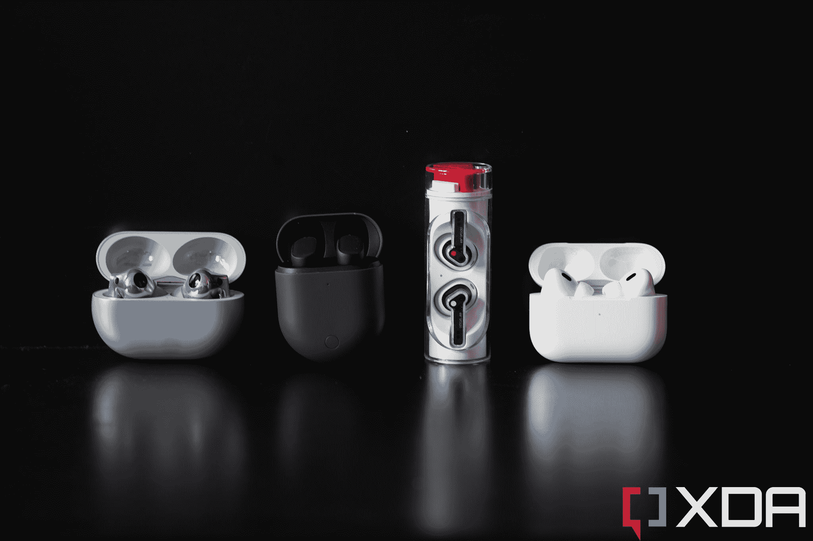

# 无耳贴评论:看起来很棒，听起来不错

> 原文：<https://www.xda-developers.com/nothing-ear-stick-review/>

外观对消费电子产品有多重要？自命不凡的我想说“不多”。我只关心性能。”

但我们都知道那不是真的。人类是视觉动物，在某种程度上，我们都会被风格所左右。耳贴也是如此。

由一加联合创始人卡尔·裴(Carl Pei)领导的总部位于英国的初创公司 Nothing 在很多方面都依赖于美学。该公司迄今已发布了三款产品，老实说，它们的操作都与市场上的其他几十款类似产品没有太大不同。但是，Nothing 的所有产品都提供了一种包装独特的视觉冲击设计语言，并且定价极具竞争力。

说实话，有时候这样就够了。并不是每个产品都需要重新发明轮子或者革新行业。有时候，一个消费品只需要看起来很棒，足够好用，而且不要太贵。Nothing 的最新产品——一套名为 Ear Stick 的无线耳塞就能做到这一点。

Nothing Ear Stick 是一套非常好看的耳塞，设计独特，可能对一些人来说更舒适。然而，你失去了很多关于声音和其他功能。

**Key Features**

*   独特的开耳设计
*   只需 99 美元
*   在安静的环境中听起来很棒

**Specifications**

*   **品牌:**无
*   **噪音消除:**否
*   **单声道听力:**是
*   **蓝牙:** 5.2
*   **麦克风:**每芽三个
*   **防护等级:** IP54
*   **重量(耳塞):**每个耳塞 4.4
*   **充电:**仅有线
*   **驱动尺寸:**12.6 毫米
*   **价格(建议零售价):**:99 美元

**Pros**

*   舒适的开耳设计
*   很好的价格
*   易于连接到设备
*   良好的电池寿命

**Cons**

*   缺少好的低音
*   无主动噪声消除

**免责声明:**本评论中的链接由音频零售商 Crutchfield 提供，该公司在客户服务等方面享有盛誉。

## 没有耳贴价格和可用性

*   在美国，你可以花 99 美元买到这款耳机，在其他国家也可以买到
*   它们将从 11 月 4 日开始在亚马逊上出售。

Nothing 耳塞在美国的售价为 99 美元，在其他地区也是如此(例如，在英国和香港，售价分别为 99 *和*899 港元)。它们现在可以在 Nothing 的在线商店预购，并将于 11 月 4 日发货。之后，它还将在亚马逊等主要在线零售商上出售。

## 设计和硬件:主要优缺点

*   这款耳机采用半入耳式设计，因此它不会位于耳道内
*   你可能会得到更多的舒适，但噪音隔离较弱
*   箱子里没有无线充电

如果你还没有注意到什么，耳贴是该公司的第二套无线耳塞。Ear 1 于去年推出，并因其半透明的设计和声学性能而获得好评，这超出了其价格范围。新的耳塞带回了同样的半透明设计，但在一个管状外壳中，而不是 Ear 1 更传统的首饰盒状外壳。

除了新的情况之外，耳棒在一个方面与耳朵 1 有重要的不同:耳棒是“半入耳”式的耳塞(另一种说法是“开耳”)，这意味着它们位于耳道外面的耳嵴上。最初的 Ear 1 是带硅头的入耳式耳塞，进入耳道内，就像[苹果的 AirPods Pro](https://www.xda-developers.com/airpods-pro-2-review/) 。

半入耳式设计带来了主要的利弊。长期佩戴通常更舒适，因为耳朵里没有东西，但它也完全不能阻挡噪音。对于入耳式耳塞，即使没有主动噪音消除(ANC)，硅头也能提供足够的密封，自然阻挡环境噪音。使用无耳机耳塞，您仍能以最大音量听到外面的世界。

但这是功能，不是 bug。这些类型的半入耳式耳塞不应该消除外部声音。相反，这种设计吸引了两个群体:那些无法忍受入耳式耳塞感觉的人(我有几个同事属于这一阵营)或那些在听音频时希望意识到周围环境的人。

没有代表说得很清楚:耳棒不是 Ear 1 的继承者，而是同伴。消费者选择是否在耳朵舒适度或声音沉浸感上妥协。

 <picture></picture> 

The Nothing Ear Stick next to the Huawei FreeBuds Pro 2 (first from left), Redmi Buds 2 ( second from left), and AirPods Pro 2 (fourth from left). 

回到弹壳。我喜欢任何形状不同的东西，仅仅因为它与众不同。表壳是透明的，所以花蕾总是可见的。通过旋转顶部的旋钮可以打开盒子，像旋转门一样滑动盖子，让你可以将花蕾从插槽中拔出。

打开外壳的旋转动作很有趣。有足够的阻力，需要轻微的力量来扭转，当外壳完全打开或关闭时，会听到咔哒声。

充电端口位于灯管顶部，由红色塑料材料覆盖，增加了视觉效果。与 Nothing Ear 1 的情况不同，它没有无线充电。耳塞比 Nothing Ear 1 耳塞轻一点，每个耳塞的重量为 4.4 克，如上所述，它们佩戴舒适，没有戴入耳式耳塞太久的压力。

耳棒杆内置大多数读者应该熟悉的常见触摸感应面板。面板只能检测点击和长按，不能检测滑动。

每个花蕾上有三个麦克风，它们纯粹是为了拾取佩戴者的声音。正如我们之前提到的，耳塞没有任何形式的 ANC。这是一个明智的决定，因为 fit 会让任何试图消除环境声音的软件都变得毫无意义。当我打电话或调用谷歌助手时，麦克风可以很好地接收我的声音。

每个 bud 内部都有一个 12.6 毫米的音频驱动器，没有人说这是为耳塞定制的。电池寿命被宣传为一次充电 7 小时，使用一周后这些数字似乎是准确的。这一案件还带来了另外三项指控，总计约 28 小时的游戏时间。包装中包含 USB-C 充电电缆。

Nothing Ear Stick 提供多点连接，因此它可以同时连接到几个设备，连接效果非常好。我在室内和室外都用过这些，从来没有出现过掉线的情况。耳塞还具有 IPX5 防水性能，因此您可以在雨中佩戴，甚至可以将它们暂时浸入水中而不会出现问题。但那只是耳塞；这箱子一点也不防水。

## 软件和音频质量:低音在哪里？

*   这款耳塞几乎可以与任何手机配对
*   开耳设计意味着低音等低频会受到影响

Nothing Ear Stick 可以与任何带蓝牙的设备配对，在许多 Android 手机上，只需打开 Ear Stick 外壳盖子就会触发一个弹出菜单，询问您是否要配对。一旦配对，耳棒就能很好地工作，无论是对[谷歌 Pixel 7 Pro](https://www.xda-developers.com/google-pixel-7-pro-review/) 、 [iPhone 14 Pro Max](https://www.xda-developers.com/apple-iphone-14-pro-max-review/) 还是 MacBook Pro。

要微调音频输出或自定义触摸控制，必须安装 Nothing 的配套应用程序。从这里，我可以分配额外的控制，如“双按下并保持”和发挥均衡器，以突出人声或低音，如果我这样选择。

由于这些是开放式耳塞，低音等低频可能会因音频泄漏而丢失，并且通常会被外部噪声淹没。Nothing 代表表示，该公司的工程师开发了一种名为“低音锁定”的软件算法，可以检测出由于耳朵的形状而损失了多少低音，并相应地调整 EQ。这个功能听起来有点噱头，在现实世界的使用中，我没有听到太大的区别。

对于吉他驱动的音乐或播客，Nothing Ear Stick 的表现不亚于任何大牌竞争对手。

你将不得不接受你不能通过这些耳塞获得身临其境的音频。然而，耳塞式耳机在安静的环境下听起来完全没问题。耳塞在分离中频和高频方面做得很好，因此您可以轻松识别吉他即兴重复片段或伴唱。缺乏低音的确让嘻哈音乐听起来比我习惯的要平一些，但对于吉他驱动的音乐或播客来说，这些表现不亚于任何大牌竞争对手。

## 你应该买无耳贴吗？

**如果符合以下条件，您应该购买无耳贴:**

*   你想要一副价格合理、性能良好的耳塞
*   你觉得入耳式耳塞戴起来太不舒服
*   你喜欢虚无的设计语言

**如果符合以下条件，你就不应该购买这款一无是处的耳塞:**

*   您在嘈杂的环境中使用耳塞，并且更喜欢某种形式的环境噪音屏蔽
*   你已经拥有一副好的无线耳塞

除了其独特的外观，无耳棒是标准的无线耳塞。无论是音质、续航，还是功能，耳贴都表现不错，但并不惊艳。但售价 99 美元的 Nothing 耳塞定价合理，因此值得那些寻找新的开放式耳塞的人一看。

当一个产品类别变得像无线耳塞空间一样泛滥时，当无线音频技术已经商品化到它们听起来都很好的程度时，那么它可能只是归结于耳塞的外观和感觉。我是这款耳挂的设计语言的忠实粉丝，我喜欢观察和摆弄它的外壳。对其他人来说，这可能就足够了。

##### 没什么耳贴

Nothing Ear Stick 提供了一个独特而时尚的外观，价格也很合理，但声音还有很多需要改进的地方。