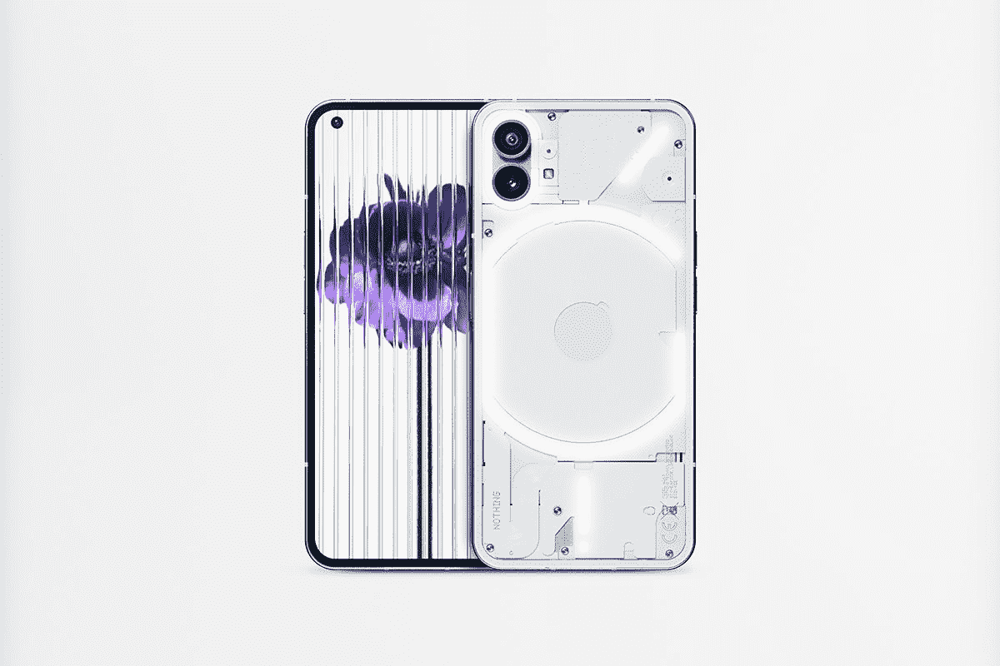

# Nothing Phone 1 vs 三星 Galaxy A53:中档你更喜欢哪款手机？

> 原文：<https://www.xda-developers.com/nothing-phone-1-vs-samsung-galaxy-a53/>

这款手机是 Carl Pei 的新公司推出的第一款智能手机。它被宣传到了月球，并在实际发射前返回。但现在尘埃落定，是时候将它与一些更成熟的中端手机进行比较了。Nothing Phone 1 采用独特的透明设计和引人注目的 LED 灯带，为乏味的平板手机世界带来了一股新鲜空气。但它与最好的中端智能手机之一 [Galaxy A53 5G](https://www.xda-developers.com/samsung-galaxy-a53-5g-hands-on/) 相比表现如何？

## 无手机 1 vs 三星 Galaxy A53:规格

| 

**规格**

 | 

**没事电话 1**

 | 

三星 Galaxy A53 5G

 |
| --- | --- | --- |
| **构建** | 

*   玻璃背面
*   金属框架

 | 

*   塑性体
*   大猩猩玻璃 5 前面板
*   IP67 防水/防尘

 |
| **尺寸&重量** | 

*   159.2 x 75.8 x 8.3mm 毫米
*   193.5 克

 | 

*   159.6 x 74.8 x 8.1mm 毫米
*   189 克

 |
| **显示** | 

*   6.55 英寸有机发光二极管
*   大猩猩玻璃(没有说明是哪个版本)
*   2400 x 1080
*   120 赫兹
*   最大亮度 500 尼特
*   HDR10+

 | 

*   6.5 英寸 Super AMOLED
*   120 赫兹刷新率
*   1080 x 2400 像素
*   800 尼特最大亮度
*   HDR10+

 |
| **SoC** | 

*   高通骁龙 778G Plus

 |  |
| **闸板&存放** | 

*   8GB/12GB LPDDR5 RAM
*   128GB/256GB UFS 3.1 存储

 | 

*   6GB/8GB 内存
*   128GB/256GB 内部存储
*   microSD 卡插槽(最高 1TB)

 |
| **电池&充电** | 

*   4500 毫安时
*   33W 有线快速充电支持
*   15W 无线快充支持
*   不含充电器

 | 

*   5000 毫安时电池
*   25W 超级快充
*   没有无线充电
*   不含充电器

 |
| **安全** | 显示指纹扫描仪 | 光学显示器内指纹传感器 |
| **后置摄像头** | 

*   主要:50MP IMX766，f/1.9，1/1.56 英寸
*   超宽:50MP JN1，f/2.2，114 度视野

 | 

*   64MP/1.8 主摄像头(带 OIS)
*   12MP/2.2 超宽
*   5 百万像素/2.4 英寸深度传感器
*   5MP/2.4 宏

 |
| **前置摄像头** | 16MP，f/2.4 |  |
| **端口** |  |  |
| **音频** |  |  |
| **连通性** | 

*   5G
*   长期演进
*   无线网络 6
*   蓝牙 5.1

 | 

*   5G
*   长期演进
*   wi-Fi 802.11 a/b/g/n/AC(2.4G+5 GHz)
*   蓝牙 5.1
*   NFC(取决于市场)

 |
| **软件** | 

*   基于 Android 12 的 NothingOS
    *   3 年的 Android 操作系统更新
    *   4 年的安全更新

 | 

*   One UI 4.1(安卓 12)
    *   4 年的 Android 操作系统更新
    *   5 年的安全更新

 |
| **其他特性** | 字形照明接口 | 双 SIM 卡 |

* * *

## 设计与展示

Nothing Phone 1 最大的卖点就是独特的设计。即使你不太在意透明的背部和灯带，你也不得不承认，该公司为实现这一设计付出了很多努力。Nothing Phone 1 的总体外形和手感很像苹果 iPhone 12/13。该装置具有平坦的铝制侧面和圆角。由于边缘平坦，这不是最舒适的手机，但握在手中感觉坚固和优质。在正面，有一个打孔显示器，四周对称的挡板环绕。有趣的部分在背面。半透明的后面板可以看到手机的一些内部部件，包括无线充电线圈和螺丝。背面还装有四个灯带——两个围绕摄像头模块，两个围绕充电线圈。这些灯光用于 Glyph 界面，该界面允许您为呼叫、通知等设置特定的灯光模式。您可以调节光线亮度，并在光线较暗的情况下拍照时用作闪光灯。如果你正在寻找一部设计酷的手机，但不想花 999 美元购买 Galaxy Z Flip 4，那么 Nothing Phone 1 是你的最佳选择。

Galaxy A53 在外观方面不如 Nothing Phone 1 有趣。它与前代产品采用相同的设计，塑料背面带有柔软的涂层，侧面平坦。这款手机的特点是背面有一个居中的打孔显示屏和一个矩形摄像头模块，并放弃了其前代产品的弯曲美学，取而代之的是更盒子和更扁平的外观。但是，尽管有塑料背面和平坦的侧面，Galaxy A53 握起来很舒服，拿在手中感觉很好。

在耐用性方面，Galaxy A53 更好，因为与 Nothing Phone 1 的 IP53 等级相比，它提供了 IP68 等级。Galaxy A53 有黑色、白色、蓝色、桃红色和宝来紫色四种配色。同时，Nothing Phone 1 只有白色和黑色两种颜色。

这两款手机在显示屏方面并驾齐驱，都采用了大尺寸、充满活力的有机发光二极管面板。Galaxy A53 配备了 6.5 英寸 FHD+ AMOLED 显示屏，刷新率为 120 赫兹，亮度为 800 尼特。Nothing Phone 1 拥有 6.55 英寸的 FHD+ OLED 面板，刷新率为 120 赫兹，最大亮度为 500 尼特。

* * *

## 摄像机

谈到相机，Nothing Phone 1 采取了“少即是多”的方法。它有一个双摄像头系统，包括一个带 OIS 的 50MP 索尼 IMX766 传感器和一个 50MP 三星 JN1 超宽镜头。Galaxy A53 则完全相反，它装有一个四摄像头系统，包括一个带 OIS 的 64MP 主摄像头，一个 12MP 超宽摄像头，一个 5MP 微距镜头和一个 5MP 深度镜头。

Nothing Phone 1 和 Galaxy A53 是中端手机在相机性能方面取得进步的最好例子。两款手机上的主拍摄器都能拍摄出动态范围大、细节丰富的出色图像。弱光表现也很出色，虽然不如顶级旗舰可以理解。需要记住的一点是，Galaxy A53 倾向于为额外的流行而使颜色有点过饱和，而 Nothing Phone 1 则喜欢更中性的色调。

### 无手机 1:相机样品

### Galaxy A53:相机样品

两款手机都可以以 30fps 的速度拍摄 4K 视频，并提供良好的稳定性。然而，正如我们在评论中所观察到的那样，Nothing Phone 1 容易出现不准确的颜色，例如极其温暖的肤色。

* * *

## 表演

Nothing Phone 1 由高通的[骁龙 778G Plus](https://www.xda-developers.com/qualcomm-778g-plus-695-680-480-plus-announced/) 芯片组驱动，该芯片组具有一个主频为 2.5GHz 的 Cortex-A78 核心，三个主频为 2.4GHz 的 Cortex-A78 核心，四个主频为 1.9GHz 的高效 Cortex-A55 核心。与此同时，Galaxy A53 使用内部的 Exynos 1280 芯片组，两个主频为 2.4GHz 的 Cortex-A78 核心和六个主频为 2.0GHz 的 Cortex-A53 核心

Nothing Phone 1 pack 不仅功率更大，而且在现实世界中的表现也比 Galaxy A53 更好。Nothing OS 的流畅系统动画加上流畅的 120Hz 显示屏和强大的处理器，确保手机在日常任务中表现出色。Nothing Phone 1 也使用 UFS 3.1 存储芯片，比 Galaxy A53 中的 UFS 2.2 存储快得多。更快的存储速度直接转化为更短的应用和游戏加载时间、更快的数据传输和更快的性能。

至于配置，Galaxy A53 配备了 4GB/6GB/8GB RAM 和 128GB/256GB 内部存储，并支持 microSD 卡扩展。另一方面，Nothing Phone 1 可以配置 8GB/12GB RAM 和 128GB/256GB 存储空间。

* * *

## 电池寿命、充电速度和软件

Galaxy A53 在电池部门有 Nothing Phone 1。与 Nothing Phone 1 上的 4500 毫安时电池相比，它配备了更大的 5000 毫安时电池。如果你想要一部可以轻松使用一天以上的手机，Galaxy A53 是你的最佳选择。Nothing Phone 1 的电池寿命很好，但并不出色。在一个典型的工作日，它将持续你一整天，但在你大量使用它的日子里，你会发现自己伸手去拿充电器。然而，在充电速度方面，Nothing Phone 1 具有优势。它提供 33W 的快速有线充电速度，而 Galaxy A53 最高为 25W。此外，Nothing Phone 1 还提供无线充电支持，而 Galaxy A53 则没有。

在软件方面，两款手机都自带 Android 12。Nothing Phone 1 运行的是 Nothing OS，这是 Android 的一个近似版本，上面有一些额外的东西。与此同时，Galaxy A53 运行高度定制的界面，称为 One UI 4。至于软件支持，两款手机都拥有安卓智能手机最好的软件政策之一。Galaxy A53 承诺从三星获得四年的操作系统更新和五年的安全更新。也没什么太远。它发誓要提供三年的操作系统更新和四年的安全更新。

* * *

## Nothing Phone 1 vs Galaxy A53:你该买哪个？

在 Nothing Phone 1 与 Galaxy A53 的战斗中挑选一个明显的赢家并不容易。Nothing Phone 1 的性能更好，支持无线充电，设计更有趣，但在电池寿命和软件政策部门输给了 Galaxy A53。更不用说，在这两款设备都有销售的英国等地区，它的价格也高于 Galaxy A53。

 <picture></picture> 

Nothing Phone 1

无手机 1 融合了独特的透明设计和强大的硬件。

Nothing Phone 1 无疑是目前市场上最酷的中档手机，它采用了独特的半透明设计，LED 灯带和漂亮的有机发光二极管显示屏。虽然它引人注目的设计可能不符合每个人的口味，但它提供了强大的功能、功能强大的摄像头以及长期软件支持的有趣软件体验。它非常适合那些想要一部吸引眼球的手机，但又买不起 [Galaxy Z Flip 4](https://www.xda-developers.com/samsung-galaxy-z-flip-4-review/) 的人。

然而，那些生活在美国的人无法获得 Nothing Phone 1，因为它尚未正式推出。所以对于美国市场的人来说，答案相当简单——买 Galaxy A53 5G。

 <picture></picture> 

Samsung Galaxy A53

##### 三星 Galaxy A53 5G

Galaxy A53 是最好的中端手机之一，以优惠的价格提供高质量的智能手机体验。

Galaxy A53 无需介绍。这是目前市场上最好的中端智能手机之一。它以 449 美元的价格推出，但已经降到了 349 美元，这使得它更有吸引力。它提供了一个充满活力的 AMOLED 显示屏，一个多功能的相机系统，一个高度定制的软件体验，以及一个比谷歌为其 Pixel 系列提供的更好的软件支持政策。