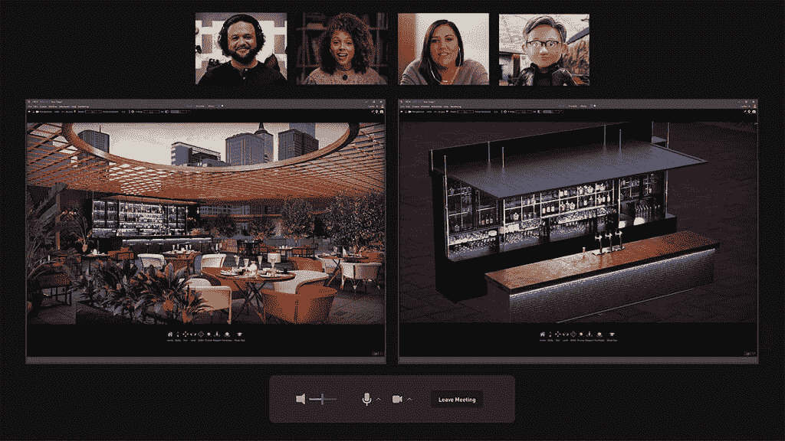

# 英伟达为创作者推出新的 RTX 图形处理器以及 Omniverse 云

> 原文：<https://www.xda-developers.com/nvidia-launches-rtx-creator-gpus-omniverse-cloud/>

今天，英伟达召开了 GPU 技术大会，或称 GTC，并发布了几个面向创意专业人士的重大公告。在硬件方面，该公司将推出一款新的英伟达 RTX A5500 桌面 GPU，以及一系列笔记本电脑 GPU，为创作者提供新的专业笔记本电脑。

在桌面方面，英伟达推出了新的 RTX A5500 GPU，采用了最新的 RTX 技术，包括 10，240 个 CUDA 核心，80 个第二代 RT 核心，320 个第三代张量核心，以及高达 24GB 的内存和 768GB/s 的内存带宽。两个 GPU 可以通过 NVLink 结合起来，获得高达 48GB 的内存。这加入了现有的面向创作者的 RTX GPU 阵容，包括去年的 RTX A2000。虽然它不是顶级 GPU，但这一桂冠仍由 RTX A6000 持有。

对于笔记本电脑，有一系列新的专业 GPU，这意味着你可以期待在不久的将来会有很多专业笔记本电脑发布。新的 GPU 包括英伟达 RTX A500、A1000、A2000 8GB、A3000 12GB、A4500 和 A5500。当然，英伟达 rtX A5500 笔记本电脑版本不如其台式机版本令人印象深刻——它有 7，424 个 CUDA，58 个 RT 内核，232 个张量内核，16GB 内存和 512GB/s 的内存带宽。无论如何，这是很大的功率，它应该有助于驱动比当前可用的笔记本电脑 GPU 更密集的工作负载。

以下是今天发布的所有新笔记本电脑 GPU 的概述:

| 

国家政治保卫局。参见 OGPU

 | 

CUDA 核心

 | 

RT 内核

 | 

张量核

 | 

GPU 内存

 | 

最大带宽

 | 

TFLOPS

 |
| --- | --- | --- | --- | --- | --- | --- |
| 英伟达 RTX A5500 | 7,424 | 58 | 232 | 16GB | 512 GB/秒 | 24.7 |
| 英伟达 RTX A4500 | 5,888 | 46 | 184 | 16GB | 512 GB/秒 | 18.5 |
| 英伟达 RTX A3000 12GB | 4,096 | 32 | 128 | 12GB | 336 GB/秒 | 14.1 |
| 英伟达 RTX A2000 8GB | 2,560 | 20 | 80 | 8GB | 224 GB/秒 | 9.3 |
| 英伟达 RTX A1000 | 2,048 | 16 | 64 | 4GB | 224 GB/秒 | 7.5 |
| 英伟达 RTZ A500 | 2,048 | 16 | 64 | 4GB | 112 GB/秒 | 7.3 |

新的英伟达 RTX A5500 GPU 今天可以从各种经销商和系统制造商处获得。至于英伟达 RTX 笔记本电脑 GPU，你将看到 creator 笔记本电脑从今年春天开始与它们一起发布。当然，这些不是单独出售的。

除了新的 GPU，NVIDIA 还宣布了 Omniverse Cloud，这是一项订阅服务，允许创意专业人员从任何地方访问 Omniverse。从本质上说，这将某些体验传输到各种设备，因此无需 RTX GPU 的能力也可以享受这些体验。Omniverse Cloud 中包含的一项服务名为 Nucleus Cloud，它允许创作者快速访问和编辑 3D 场景，而不必将所有资产转移到他们的设备上。

 <picture></picture> 

Four users sharing content using Omniverse Cloud and the View app

另一个应用程序 Omniverse Create 允许创作者们一起实时构建 3D 世界。最后，还有一个视图应用程序，因此非技术用户可以通过 GeForce NOW 与 Omniverse 中的 3D 世界进行交互，所有渲染工作都在 NVIDIA 的服务器上完成。

Omniverse 云服务套件仍在开发中，因此 NVIDIA 没有透露太多关于可用性或定价的信息。然而，如果你是一名开发人员，你可以[注册提前使用 Nucleus Cloud](https://developer.nvidia.com/nvidia-omniverse-platform/nucleus-cloud-eap) 。