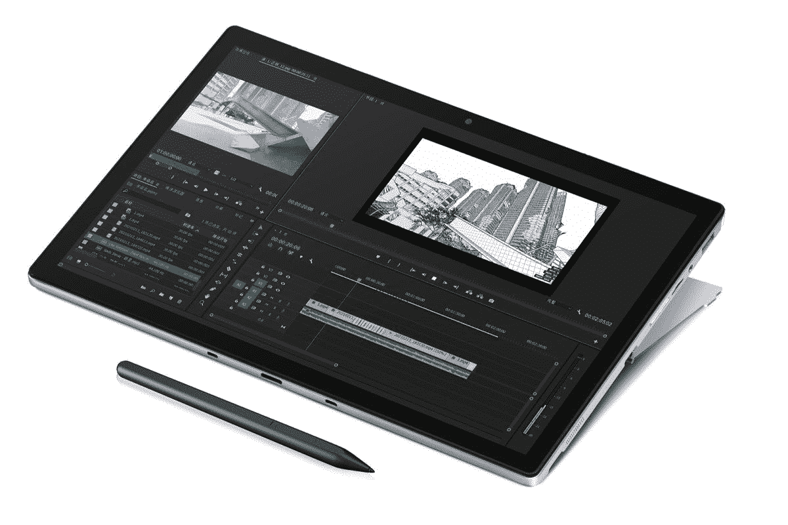

# One-Netbook T1 评测:从任何意义上来说都是更便宜的 Surface Pro

> 原文：<https://www.xda-developers.com/one-netbook-t1-review/>

Windows 11 平板电脑市场并不拥挤，现有的大多数选项要么是预算入门级选项，要么是像 Surface Pro 8 这样的高端旗舰产品。One-Netbook 是我们几个月前评论过的 [One Xplayer Mini 的幕后公司](https://www.xda-developers.com/one-xplayer-mini-review/)，它希望通过 T1 平板电脑以更合理的价格提供高端体验。

虽然它看起来有很大的前景，但 One-Netbook T1 最终未能在你期望平板电脑成功的大多数领域实现，甚至连一些基本功能都不太具备。它以其性能脱颖而出，成为唯一一款采用英特尔 P 系列处理器的平板电脑，但其他一切几乎在所有方面都达不到预期。如果你正在阅读这篇文章，希望确信它是值得投资的，你现在可以放心地回头了。

 <picture></picture> 

One-Netbook T1

##### 一台上网本 T1

One-Netbook T1 是一款 13 英寸的 Windows 11 平板电脑，采用第 12 代英特尔 P 系列处理器。

## 一体式上网本 T1:定价和可用性

*   配备英特尔奔腾 8505 和 8GB 内存的 One-Netbook T1 正式起价为 719 美元
*   英特尔酷睿 i5 型号售价 1119 美元，酷睿 i7 版本起价 1399 美元

正如 One-Netbook 经常做的那样，T1 平板电脑首先在 Indiegogo 上推出，早期用户可以在预购的第一个月获得折扣。Indiegogo 活动结束后，你可以直接从 One-Netbook 的网站购买笔记本电脑。

官方价格从 719 美元起，它配备了一个更弱的英特尔奔腾 8505 处理器。也有配备英特尔 P 系列处理器的型号，性能明显更强。Core i5 型号也包括 16GB 内存和 512GB 固态硬盘，价格为 1119 美元。有一款配备 16GB 内存和 1TB 存储空间的酷睿 i7 型号，售价为 1，399 美元，或者你也可以选择总售价为 1，499 美元的 2TB 固态硬盘。

## 一体式上网本 T1:规格

| 

中央处理器

 | 英特尔酷睿 i5-1240P (12 个内核(4P + 8E)，16 个线程，最高 4.7GHz，18MB 高速缓存) |
| 

制图法

 | 英特尔 Iris Xe 显卡(80 个执行单元) |
| 

显示

 | 13 英寸 IPS，2160 x 1440，200 DPI，72% NTSC，最高 500 尼特，500:1 对比度，触摸 |
| 

身体

 | 306 x 217 x 9.8 毫米(12.05 x 8.54 x 0.39 英寸)，975 克(2.15 磅) |
| 

记忆

 | 16GB LPDDR5 5200MHz |
| 

储存；储备

 | 512GB NVMe PCIe 固态硬盘 |
| 

电池

 | 46.2 瓦时电池 |
| 

港口

 | 

*   1 个 USB 3.2 Gen 1 Type-C(带电源和显示输出)
*   2 个 USB 3.2 第 1 代 A 型
*   1 个迷你 HDMI 接口
*   1 个 microSD 读卡器
*   1 个组合音频插孔

 |
| 

声音的

 | 双 1W 扬声器 |
| 

连通性

 | wi-Fi 6 蓝牙 5.0 |
| 

照相机

 | 2MP/1080p 全高清网络摄像头 |
| 

颜色

 | 银 |
| 

材料

 | 铝金属 |
| 

操作系统（Operating System）

 | Windows 11 主页 |
| 

价格

 | $1,199.99 |

## 设计:它看起来不错，但建造质量可以更好

*   One-Netbook T1 由铝制成，重量不到 2.2 磅
*   它有各种各样的平板电脑端口

设计是我对 One-Netbook T1 抱怨较少的地方之一，但这并不意味着它很棒。整个机箱都是铝制的，手感最扎实。它有一个银色的配色，这是好的，如果有点普通。大多数笔记本电脑都是银色的，即使是更知名的品牌，所以这没什么大不了的。它的重量不到 2.2 磅，对于平板电脑来说并不算轻，但它仍然足够便携。

平板电脑内置了支架，这是我一直喜欢的，它的效果足够好。它采用了外露的铰链设计，实际上增加了一点个性，我喜欢它的外观。然而，我确实认为铰链应该更紧，当我试图按下顶部的电源按钮时，铰链可能会很容易进一步打开。我还注意到，如果我在平板电脑上安装网络摄像头时打开支架超过某个点，它会自动打开。One-Netbook 告诉我生产单位将有更严格的公差和更好的构建质量，所以希望这是一个解决的问题。

与其他平板电脑相比，这款平板电脑的一个优势是端口的选择，事实上，这里就有几个端口。在左侧，您会发现一个 USB Type-A 端口、迷你 HDMI 和一个支持电源、数据和显示输出的 USB Type-C 端口。包含 mini-HDMI 似乎是为了比 USB-C 更方便，但实际上，你仍然需要一个适配器，因为大多数显示器都不包含 mini-HDMI 电缆，在这一点上，USB-C 到 HDMI 适配器将在更多的设备上有用。

在右侧，有另一个 USB Type-A 端口，一个 microSD 读卡器和一个耳机插孔。我不得不给一个-上网本信贷，包括 USB Type-A 肯定是有用的，而且大多数现代平板电脑都没有，因为它们太薄了。同样在这一边，有一个音量摇杆，点击起来感觉非常满意，尽管按钮在它们的位置上挤来挤去，感觉有点廉价。在两侧，您还会发现扬声器格栅，但我们稍后会对此进行更多讨论。

沿着顶部，有许多风扇排气孔，考虑到这是一个封装 P 系列处理器的相对较小的设备，这是非常必要的。电源按钮也在这里，就像音量摇杆一样，按下它很令人满意，尽管它需要一点力。

最后，在底部，有键盘盖的物理连接器，我很欣赏。使用蓝牙键盘会很容易，但在我看来，这远没有那么方便，所以我很高兴它使用了物理连接。

总的来说，设计还可以，但它肯定不是特别的，对于 13 英寸的平板电脑来说，它实际上是相当大的。这也要归功于显示屏周围的巨大边框，这使得这款平板电脑看起来肯定过时了。

## 显示和声音:很清晰，但扬声器很糟糕

*   13 英寸显示屏的长宽比为 3:2，分辨率高达 2160 x 1440
*   然而，即使在最大音量下，扬声器也非常安静和轻薄

说到显示屏，One-Netbook T1 配备了 13 英寸的显示屏，长宽比为 3:2，这对于 Windows 平板电脑来说相当常见，包括微软的 Surface 系列。正如我们所提到的，它被大边框所包围，但屏幕本身以 2160 x 1440 的分辨率足够清晰，这基本上就像是采用一个四核高清 16:9 显示器并将其裁剪为 3:2 的纵横比。

One-Netbook 说对比度是 500:1，这是非常低的。这也是相当明显的，因为黑色水平并不是那么暗。当你从一个主要是黑色的图像切换到一个主要是白色的图像时，屏幕每次都需要调整，因为它看起来太暗了。显示器还覆盖了 NTSC 色彩空间的 72%,这并不令人印象深刻。虽然我自己无法衡量这些说法，但这款显示器的大部分颜色看起来都不错。

...这是我用过的最差的网络摄像头之一。

我注意到这个显示器的一个微妙之处是显示器盖看起来不干净。这很难解释，也可能很难看到，但当你仔细观察时，它看起来像是因为显示屏盖而在图像上有一些噪声。屏幕似乎也很容易抓住污垢和天然皮肤水分，而且触摸起来也不太舒服。

现在，平板电脑往往比笔记本电脑有更好的摄像头——只要看看 Surface 系列，你就可以看到 Surface Pro 家族多年来一直有一个 500 万像素的网络摄像头，即使在今天，没有一个翻盖风格的 Surface 设备达到了那个水平。我原以为这种逻辑适用于 One-Netbook T1，但事实上，这是我用过的最差的网络摄像头之一。全分辨率其实接近 2MP(照片高达 1600 x 1200)，但质量本身就差到几乎搞笑。看看这个:

需要说明的是，华硕 ROG Flow X13 也没有很好的网络摄像头，但它在 T1 旁边看起来很棒。当你考虑到网络摄像头甚至没有齐平地放在显示屏盖下，并且它实际上稍微突出时，这就更加令人震惊了。ROG 笔记本电脑的分辨率较低，相机本身也小得多，但它仍然遥遥领先。最重要的是，这里没有后置摄像头，尽管我会说这对许多人来说可能是好的。

同样令人失望的是声音。这是平板电脑通常优于笔记本电脑的另一个领域，因为它们更适合媒体消费。但就像网络摄像头一样，这些扬声器很糟糕。它们非常安静，非常薄。几乎每次我在这台平板电脑上看视频或电影时，我都必须检查以确保我已经最大限度地提高了音量，大多数时候，我都是这样做的——它仍然很安静。我从我的手机或任何我试过的笔记本电脑上得到更好的音频。

最终，这款平板电脑在你期望平板电脑最成功的地方失败了，这使得它很难被推荐。但是现在让我们继续。

## 键盘和触摸板:打字没问题，但触摸板太糟糕了

*   One-Netbook T1 配有一个类似于 Surface Pro 系列的键盘盖
*   触摸板几乎无法使用

作为一款旨在与 Surface Pro 8 竞争的平板电脑，One-Netbook T1 还配有可拆卸的外壳，包括键盘和触摸板。和微软的平板不同，这款其实是包含在盒子里的，这是一个加分项。它通过磁性附着，并使用触针连接到平板电脑，此外它甚至还有额外的磁铁，允许你通过在屏幕下扣动键盘来稍微升高键盘，就像 Surface 系列一样。

就制作质量而言，键盘盖在某些方面感觉有些脆弱。键盘所有灵活的部分感觉都有点*太*灵活，感觉很廉价。此外，帮助提升键盘的磁铁并不那么强，所以如果你在顶部附近施加压力，有时会感觉到它从屏幕上被拉走。虽然在打字时，这并不太明显，所以这并不影响可用性，只是感觉不太好。

但就像我说的，打字确实很好，在习惯了键盘之后，我使用它没有太多问题。考虑到可用的空间，按键的移动足够了，而且我没有遇到大问题*本身*。然而，键盘上没有背光，所以在黑暗中使用它可能不会是最好的体验。

不过，这里真正糟糕的是触摸板。首先，它非常小，但更糟糕的是，它的纹理非常糟糕，不像你在其他任何地方都能找到的光滑触摸板。但最大的问题是，它根本无法同时使用两根手指。如果你想通过用一个手指点击触摸板，用另一个手指拖动来拖动某个东西，你就是不能。One-Netbook 说你应该只用一根手指就能做到，但这简直太可怕了。

此外，在这个触摸板上基本上没有任何形式的手掌排斥。因为它很小，我打字的时候经常把光标移到不同的地方，这有点不可思议，结果浪费了很多时间。一般我复习的时候都尽量用不带自己配件的笔记本电脑，但是我根本就受不了这个触摸板，只能用自己的鼠标。

## 性能:很快，但代价是什么？

越过 One-Netbook T1 的众多硬件缺陷，我们来到了平板电脑的大卖点，那就是性能。One-Netbook 声称这是世界上最强大的平板电脑，如果你看看 Core i7 型号，这可能是真的。没有其他平板电脑使用英特尔的 28W P 系列处理器，这无疑给了 One-Netbook T1 一个优势。Surface Pro 8 仍然使用第 11 代 15W 处理器，其他即将推出的平板电脑，如戴尔 XPS 13 二合一设备，则进一步降至 9W 处理器。

自然，这导致了 One-Netbook T1 的性能优势。我买的这款电脑配有英特尔酷睿 i5-1240P，16GB 内存和 512GB 固态硬盘，在大多数情况下性能都很好。不过，从基准测试来看，它并不比上一代 15W 酷睿 i7 快多少，在某些情况下，它还会更慢。这是因为 P 系列处理器使用更多的功率并产生更多的热量，所以它们在一段时间后就会开始减速，尤其是当你试图将它们放在像这样的薄机箱中时。对于 3DMark 和 Cinebench 等更密集的基准测试，这一点尤其明显。

|  | 

一台上网本 t1 英特尔酷睿 i5-1240P

 | 

Surface Pro 英特尔酷睿 i7-1185G7

 | 

联想 ThinkPad X1 Yoga Gen 英特尔酷睿 i7-1260P

 |
| --- | --- | --- | --- |
| PCMark 10 | 4,735 | 4,988 | 5,168 |
| 3DMark:时间间谍 | 1,175 | 1,852 | 1,458 |
| 电影院长凳 | 1,421 / 4,617 | 1,438 / 5,423 | 1,375 / 6,831 |
| 极客工作台 | 1,552 / 6,164 | 1,431 / 5,505 | 1,419 / 6,915 |

但平板电脑配备 28W 处理器最糟糕的地方是电池寿命。正如我们所提到的，这些处理器比典型的 15W 处理器耗电更多，对于 One-Netbook T1 来说，这一点真正体现出来了。电池寿命很糟糕，在我的测试中，它最多持续了我 3 小时 53 分钟，最少持续了 2 小时 42 分钟。大部分时间至少持续了 3 个小时，但那还是很可怕。我已经能够从 100%耗尽电池，直到平板电脑在一天内关闭两次。

笔记本电脑的盒子里还配有 65W 的充电器，当你同时使用平板电脑时，充电速度会非常慢。最糟糕的是充电端口实际上不能带超过 65W 的功率。使用 USB-C 坞站，我可以看到笔记本电脑从未超过 60W，即使我使用 100W 的充电器。我没有这种限制，尤其是在这样一个耗电设备上。

## 你应该购买 One-Netbook T1 吗？

最终，One-Netbook T1 在你期望平板电脑取得成功的任何方面都没有取得成功，其最大的卖点——性能——由于热量调节也没有那么重要。当然，它比竞争对手的设备便宜，但你仍然会花一大笔钱，并得到一个糟糕的体验。

**如果符合以下条件，您应该购买 One-Netbook T1:**

*   您想要一台价格比大多数平板电脑都低的搭载英特尔 P 系列处理器的平板电脑，这就是您最关心的事情

**如果符合以下条件，你就不应该购买 One-Netbook T1:**

*   音频或网络摄像头质量对您至关重要
*   你想要充电后能持续几个小时以上的东西
*   拥有一块像样的触摸板很重要
*   你欣赏一个优质的感觉装置

最终，我们无法向任何人推荐这款产品，除非出于某种原因，你下定决心要买一款搭载英特尔 P 系列处理器的平板电脑。这真的没有任何可取之处。如果你想要一台价格合理的电脑，你最好看看今天能买到的[最好的低于 1000 美元的笔记本电脑](https://www.xda-developers.com/best-laptops-under-1000/)，或者如果你真的对这种外形感兴趣，你最好看看[最好的 Windows 平板电脑](https://www.xda-developers.com/best-windows-tablets/)。