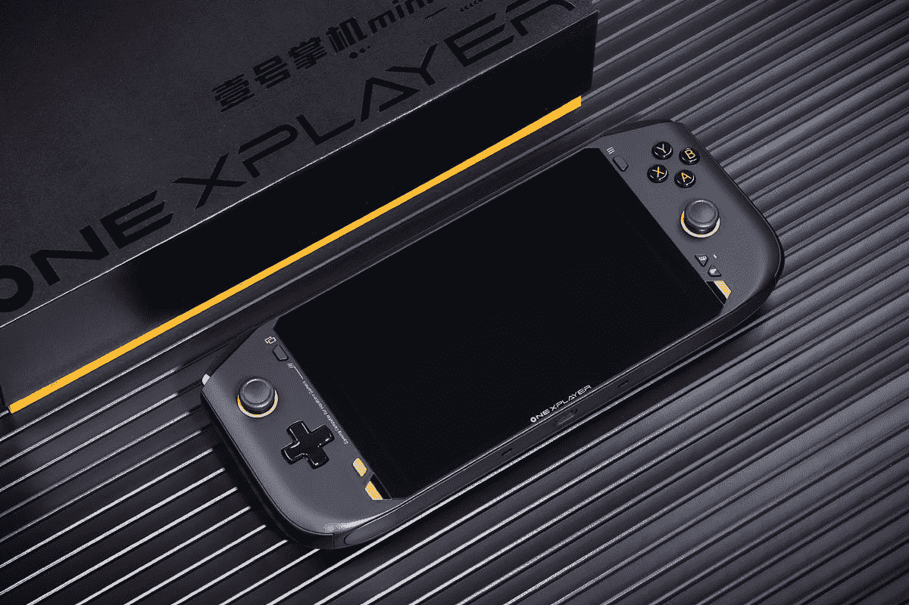

# 一个 XPLAYER 迷你回顾:一个实际上便携的手持游戏 PC

> 原文：<https://www.xda-developers.com/one-xplayer-mini-review/>

说任天堂 Switch 是第一款大屏幕手持游戏机是错误的，但不可否认的是，该系统的广泛流行促使更多公司创建自己的手持游戏设备，通常基于 Android 或 Windows。在众多试图利用 Switch 成功的设备中，我们去年[获得了 ONE XPLAYER](https://www.xda-developers.com/one-xplayer-eight-inch-windows-10-pc-promises-handheld-gaming-console/) ，现在，该公司又推出了一款更紧凑的版本，被恰当地称为 ONE XPLAYER Mini，我们在这里对它进行回顾。这是一个更小的型号，更接近任天堂 Switch 的实际大小，同时仍然提供完整的 PC 体验和稳定的性能。这不仅仅是对切换的回应，它还试图先发制人地对抗 Steam Deck，这是这种类型的第一个真正上市的大牌产品。

有一段时间，这些掌上游戏机中的许多来自相对小众的公司，如 GPD，但去年，它变得很清楚，只是这个概念有多大的兴趣。Valve 去年夏天宣布了[蒸汽甲板](https://www.xda-developers.com/valves-steamdeck-is-a-switch-like-gaming-pc-starting-at-399/)，最近，[高通展示了骁龙 G3x Gen 1](https://www.xda-developers.com/qualcomm-snapdragon-g3x-gen-1/) 平台。诚然，这还不是一个消费设备，但意图是存在的。ONE XPLAYER 仍然是那些更小众的设备之一，但它是为了与 Steam Deck 竞争而设立的，具有类似的强大规格和大小。

对我来说，重要的问题是它是否能成功做到这一点，因为很明显，更多的人会被 Steam 品牌的声誉所吸引。One-Netbook 是 ONE XPLAYER Mini 的幕后公司，它必须证明这确实是一个更好的选择。它能做到吗？请继续阅读，寻找答案。

### 浏览此评论:

## 一个 XPLAYER 迷你规格

### 规范

|  | 

一台 XPLAYER Mini

 |
| --- | --- |
| **操作系统** | Windows 11 |
| **处理器** | 英特尔酷睿 i7-1195G7，4 核，8 线程，(最高 5GHz) |
| **图形** | 英特尔 Iris Xe 显卡(最高 96 个欧洲单位) |
| **闸板** | 16GB 双通道 LPDDR4x 4266MHz |
| **存储** | 1TB PCIe 第三代 NVMe 固态硬盘 |
| **显示** | 

*   7 英寸全高清+ (1920 x 1200)，16:10 宽高比，323 像素，100% sRGB
*   10 点多点触控

 |
| **音频** | 双前置立体声扬声器 |
| **网络摄像头** | 无法使用 |
| **控件和按钮** | 

*   Xbox 风格的控制器布局:
    *   两根模拟棒(可点击)
    *   D-Pad 和 ABXY 面板按钮
    *   两个缓冲器(LB 和 RB)和两个模拟触发器(LT 和 RT)
    *   视图和菜单按钮
*   主页按钮(最小化所有窗口)
*   鼠标和键盘模式按钮
*   游戏助手按钮
*   电源按钮和音量摇杆(在顶部)

 |
| **电池** | 

*   10455 毫安电池
*   100W USB 型到 C 型快速充电器

 |
| **端口** | 

*   2 个 USB 4.0 接口(C 型)
*   1 个 USB Type-A 3.0(或第 1 代 3.2)
*   3.5 毫米耳机插孔

 |
| **连通性** | 

*   英特尔无线网络 6
*   蓝牙 5.0

 |
| **颜色** | 

*   带有橙色的黑色

 |
| **尺寸(WxDxH)** | 262 x 108 x 23 毫米(10.32 x 4.25 x 0.9 英寸) |
| **重量** | 589 克(1.3 磅) |
| **价格** | 1，399 美元(不包括发布折扣) |

## 设计和端口:握起来很舒服

在我的评测中，我喜欢 ONE XPLAYER Mini 的一点是它的设计。不一定是看起来(虽然看起来挺好看的)，而是用起来感觉如何。虽然它比任天堂 Switch(即使是新的有机发光二极管型号，重 420 克)重一点，也大一点，但拿在手中不会累，重量分布均匀，所以感觉很棒。它的手感也比 Switch 更坚固，这无疑要归功于取代任天堂可拆卸控制器的一体式设计。

One-Netbook，吹捧它比 Steam Deck 更轻更小，我认为这是一个明智的举动。这是大多数对 ONE XPLAYER Mini 感兴趣的人所期待的设备，所以这是有意义的。虽然我们还没有尝试过自己的设备，蒸汽甲板看起来确实很大，有点笨拙。

拿在手里感觉棒极了

ONE XPLAYER Mini 的重量比 Steam Deck 轻了整整 81 克，宽度和高度都更短，这对于便携性来说非常好。

然而，这不仅仅是重量和大小的问题。与任天堂 Switch 的扁平设计不同，ONE XPLAYER Mini 在背面为您的手雕刻了手柄，它们非常棒。我真的想不出另一种方式来表达它:它在手中的感觉绝对棒极了，成型的设计完美地适应了我自然地将手指放在背部的方式。这很棒，我认为这可能有助于设备感觉比实际更轻。

就外观而言，ONE XPLAYER Mini 遵循了该公司用于其过去设备的相同主题。它是黑色的，按钮、扬声器格栅和模拟杆上有一些橙色的点缀。橙色是我最喜欢的颜色之一，所以我可能有偏见地说我认为它看起来很好，但它确实很好。

在设备的底部，有一个 USB 4 Type-C 端口，用于充电和连接外设，包括外部 GPU，如果你想使用 ONEXPLAYER Mini 玩更严肃的游戏。在三月份的某个时候会有一个 ONE XPLAYER dock，但是它现在还不可用，我也没有机会评论它。

顶部还有一个类似的端口，所以你可以选择对你更方便的端口，因为它们都支持相同的充电速度和数据。此外，顶部还有一个 USB Type-A 端口和一个耳机插孔，以及一个电源按钮和音量摇杆。

顶部还有一个大排气孔，与背面一个更大的进气口搭配，以保持凉爽。重要的是要记住，这仍然是笔记本电脑的硬件，它会像笔记本电脑一样运行起来又热又吵。不过，这个冷却系统似乎做得很好。

## 显示和声音:它完成工作

正如我们已经提到的，ONE XPLAYER Mini 配备了 7 英寸的显示屏，它打算与 Steam Deck 面对面，后者也有类似大小的显示屏。ONE XPLAYER Mini 也有类似于 Steam Deck 的 16:10 纵横比，但它配备了更清晰的全高清+显示屏，分辨率为 1920 x 1200。理论上，这听起来像是一件好事，但我认为使用 HD+显示屏实际上是 Valve 的一个聪明想法。基于英特尔的电脑很快就会耗尽电池，我认为在这种尺寸下，更清晰的屏幕并不能带来足够的好处来补偿增加的功耗。不过，我们稍后会谈到电池寿命。

无论你从哪个角度看，屏幕看起来都一样好。

就显示器的质量而言，我认为 7 英寸的屏幕很好地完成了任务，尽管我不会因为它的超高质量而给它任何奖励。它工作得足够好，作为这个尺寸的全高清+显示器，它肯定足够清晰，但它不是特别有活力，而且总是有一种微弱的感觉，即颜色应该稍微更有冲击力。不过，视角非常棒，无论你从哪个角度看，屏幕看起来都一样好。它也足够亮，在室外使用不会有太大问题。

这个屏幕还支持触摸，这是一个非常受欢迎的功能，对于本质上是一个 Windows PC。仅用 Xbox 控制器导航 Windows 11 远不是一种理想的体验(有人可能会说这是不可能的)，触摸屏无疑让你更容易找到你想玩的游戏。此外，您还可以在必要时使用它进行媒体消费或网络浏览。

至于声音，ONE XPLAYER Mini 使用了两个前置立体声扬声器，隐藏在底部的橙色扬声器格栅后面。与显示器类似，我认为这里的扬声器完成了工作。他们在最大音量时声音很大，并没有什么可怕的品质，但对我来说并不特别突出。将它们与 Switch 有机发光二极管机型进行比较，我发现任天堂的游戏机略显清脆，声音也更大。ONE XPLAYER Mini 很好，尽管在这篇评论之前，我认为它更大、更贵。

## 按钮和控件:ONE XPLAYER Mini 拥有手感极佳的按钮

回到一个更积极的话题，让我们谈谈在 ONE XPLAYER Mini 上实际控制游戏的感受。一个好的控制器对于一个有趣的游戏体验来说是至关重要的——在我看来比显示器更重要——在我的整个评测中，ONE XPLAYER Mini 感觉棒极了。模拟棒和 ABXY 按钮的感觉和我的 Xbox 无线控制器(带蓝牙的 Xbox One 型号)非常相似，这是一件好事。它们超级光滑，点击起来非常舒服，在我看来，模拟棒实际上比 Xbox 控制器上的感觉好一点。D-Pad 比 Xbox 手柄软得多，但它不是糊状的或任何东西，它仍然感觉很好，很精确，但没有 clicky 那么好。再说一次，我认为这是一个好处。

肩部按钮非常响，声音比 Xbox 控制器略大，这是我认为 ONE XPLAYER Mini 稍差的一个方面。虽然触发器很棒——它们是模拟的，和 Xbox 上的一样平滑(虽然没有那么安静),所以它们感觉很棒。总的来说，在这个设备上玩游戏感觉很棒。菜单键和剩下的脸键比较硬，clicky，感觉不太惊艳，但是你不会经常用，所以我觉得还好。

不过，这里有一个我想重点介绍的特定按钮，那就是鼠标/键盘按钮。这是一个很大的功能，当你不玩游戏的时候，或者甚至对于没有最佳控制器支持的游戏。在 Windows 11 中，按一下这个按钮会调出屏幕键盘，这样你就可以用触摸屏打字了。奇怪的是，它没有打开触摸键盘功能，这是经典的屏幕键盘，在许多情况下并不容易工作。然而，它可能是一些全屏游戏的必需品，这将阻止触摸键盘的出现。

您可以使用 Xbox 风格的控件来移动鼠标光标。

然而，按住这个按钮更有趣。这将 Xbox 控件转换为鼠标控件，其中左摇杆移动鼠标指针，右摇杆用作滚轮，A 和 B 按钮分别用作左键和右键单击。这对于在特定情况下导航 UI 也非常有用。例如，Genshin Impact 不让我使用控制器，直到我可以访问游戏的菜单，它在触摸屏上不太好用，所以内置鼠标功能对设置游戏非常有帮助。

这个按钮下面是游戏助手按钮，虽然我很想告诉你，它还没有功能。它应该让你随时改变游戏设置，但 One-Netbook 告诉我这项功能将在 3 月份推出。

## 游戏和性能:它可以运行游戏，但时间不会很长

性能是像这样的手持设备喜欢宣传的一大优势，因为它的不合规格而踢了任天堂 Switch 一脚。ONE XPLAYER Mini 采用英特尔酷睿 i7-1195G7 处理器，这是英特尔第 11 代产品系列中速度最快的低功耗处理器。CPU 内核可以提升到 5GHz，集成的 Iris Xe 显卡有 96 个执行单元，这使得这款电脑能够运行一些相对较新的产品。

在评测期间，我试着在 ONE XPLAYER Mini 上运行了几个游戏，其中一些游戏的结果相当不错。以下是我观察到的一些我尝试过的游戏的表现。在这些测量中，所有游戏都以原生分辨率运行:

| 

比赛

 | 

图形预设

 | 

帧速率

 |
| --- | --- | --- |
| 布劳哈拉 | 默认 | 60 FPS |
| 华雷斯的呼唤:枪手 | 最大 | 60 FPS |
| 《堡垒之夜》 | 低的 | 15- 30 帧/秒 |
| 生长回家 | 最大 | 50 - 60 帧/秒 |
| 光环 2 周年纪念 | 表演 | 40 - 55 帧/秒 |
| 光环延伸 | 提高 | 50 - 60 帧/秒 |
| 火箭联盟 | 质量 | 55 - 60 帧/秒 |

这是稳定的性能，这意味着你应该能够在这个硬件上运行一系列游戏，尽管要求更高的游戏不会运行得那么好。我想试试 Halo Infinite，但是它根本就不能运行，因为 GPU 不符合要求。

堡垒之夜和火箭联盟也可以在任天堂 Switch 上，所以我想比较两者之间的性能。在火箭联盟中，很明显游戏在 ONE XPLAYER Mini 上运行得更好，帧速率更高，整体视觉效果略好。不过，对于堡垒之夜，我其实更喜欢在任天堂 Switch 打球。那个版本有很多纹理弹出，但 3D 模型看起来相当清晰，游戏在很大程度上运行平稳。PC 版没有针对低端硬件进行优化，所以帧速率会有所波动，加上降低图形设置会使游戏看起来比在 Switch 上更没有吸引力，有很多锯齿边缘。

为了更科学地衡量性能，我对 ONE XPLAYER Mini 运行了一套常用的基准测试。在这种情况下，我们在断开电源和连接电源的情况下运行基准测试，因为这两种情况都很可能:

| 

基准

 | 

一个 XPLAYER 迷你(电池)英特尔酷睿 i7-1195G7

 | 

一个 XPLAYER 迷你(交流)英特尔酷睿 i7-1195G7

 | 

戴尔 Inspiron 灵越 14 二合一笔记本电脑锐龙 7 5700U

 | 

惠普 Spectre x360 英特尔酷睿 i7-1165G7

 |
| --- | --- | --- | --- | --- |
| PCMark 10 | 4,320 | 4,862 | 5,320 | 4,705 |
| 3DMark | 1,601 | 1,550 | 1,256 |  |
| 电影院长凳 | 1,467 / 4,117 | 1,453 / 4,016 | 1,233 / 7,768 | 1,314 / 4,039 |
| 极客工作台 | 1,545 / 5,152 | 1,447 / 4,734 | 1,151 / 6,099 | 1,414 / 4,470 |

奇怪的是，大多数基准测试在电池电量方面取得了更好的结果，但你可以看到它与典型的超极本不相上下。当然，如果你也想用它来玩桌面游戏，你也可以将一个外部 GPU 连接到这个设备上。

电池寿命远远落后于任天堂 Switch 有机发光二极管模型。

作为一台内置 Xbox 控件的 PC 也意味着你可以使用 ONE XPLAYER Mini 进行云游戏，我在 Xbox Game Pass Ultimate 上尝试了这一点。我基本上是这样玩《光环无限》的，不过我也短暂地尝试过《极限 5》。我不得不说，云游戏的工作效率真的令人惊讶。有时候画面需要一段时间来刷新，但是我从来没有感觉到控件有难以忍受的延迟，坦率地说，这种体验非常棒。如果你想玩一个不能在这种硬件上运行的游戏，只要你有互联网，云游戏实际上可能是一个不错的解决方案。

这些基于 x86 的 PC/控制台混血儿经常忽略的一点是电池寿命。你可能会质疑 Switch 的图形能力，但它是一个真正的手持控制台，每次可以持续几个小时，特别是在 2019 年修订之后。ONE XPLAYER Mini 拥有更大的电池和更好的性能，但实际电池寿命仍然远远落后于任天堂 Switch 有机发光二极管型号，这在这篇评论中显而易见。以下是我在回顾期间进行的一些测量，包括最后与 Switch 有机发光二极管模型的比较。

| 

比赛

 | 

电池寿命(小时:分钟)

 |
| --- | --- |
| 光环 3 | 1:41 |
| 光环无限(云) | 1:50 |
| 火箭联盟 | 1:38 |
| 火箭联盟(开关有机发光二极管) | 4:58 |

甚至不仅仅是 3D 渲染导致电池寿命显著下降。玩《光环无限》的云版本仍然像其他本地游戏一样很快耗尽电池，而且它总是与你在任天堂 Switch 上得到的相差甚远。很明显，这种产品只适用于家里的突发会议，需要时你可以插入，这不是你在长途旅行中真正可以依赖的东西。我觉得这是全高清+屏幕让情况变得更糟，大概没必要。正如我在开始时所说，Valve 明智地选择了高清显示屏。

## Windows 是你想要的游戏机吗？

我想在这篇评论中包括这一额外的部分，因为这里有一些重要的事情要提及。ONE XPLAYER Mini 搭载了 Windows 11，这意味着开箱即用，您可以访问 Windows 上可用的所有平台。你有 Xbox，包括带云游戏的 Game Pass Ultimate，Steam，Epic Games，或者只是从网上下载你想要的东西。这也意味着你可以不仅仅把它当作一个控制台来使用，它不需要任何摆弄。

问题是，当游戏是为一台游戏机制作的时候，它们应该是可以工作的。PC 游戏不一定能在任何电脑上运行，即使它在技术上足够强大。例如，正如你在上面看到的，在我的评测中，ONE XPLAYER Mini 处理 Halo 2 周年纪念还不错，但 Halo CE 周年纪念实际上要求更低，无法播放。它以每秒 5 帧的速度运行，改变图形设置没有任何帮助。《生化奇兵重制版》——一款存在于任天堂 Switch 上的游戏——也在游戏的某个点(很早)后不断崩溃，致使整个游戏基本无法访问。这在游戏机上的正常情况下是不会发生的。

相比之下，Valve 的 Steam Deck 附带了一个定制版本的 SteamOS，这将您锁定在 Steam 生态系统之外。它还是一台 PC，只要有许可证就可以在上面安装 Windows 11，许可证是要单独购买的。不过，SteamOS 确实有优势，它有一个适应设备内置控件的界面。Valve 还表示，它正在努力优化 Steam 游戏，以尽可能好地在 Steam 平台上运行，所以你应该不会遇到太多问题。你也可以寻找经过验证的游戏，以确保你得到的游戏运行良好。

> ONE XPLAYER Mini 在硬件售出后没有额外的收入流，因此远比 Steam Deck 贵。

开箱即用的 Windows 也增加了一点成本。不仅仅是 Windows 11 许可需要花钱，Valve 还可以指望在 Steam Deck 上销售 Steam 游戏的收入。这种硬件可能会以低得多的价格出售，因为它得到了软件销售额外收入的补贴，这与游戏机的工作方式类似。ONE XPLAYER Mini 在硬件售出后没有额外的收入流，因此硬件本身要贵得多。公平地说，包括 Steam 在内，你已经可以使用大多数最流行的 PC 游戏，所以 Windows 的优势不一定对每个人都有吸引力。

## 一句话:ONE XPLAYER Mini 值得吗？

ONEXPLAYER Mini 非常适合那些寻求手持游戏电脑的人。它有一个令人难以置信的舒适设计，它不是太重或太大，所以它仍然有点便携。它也有很棒的按钮，所以在上面玩游戏感觉棒极了。它可以运行一些相对现代的游戏，那些不能运行的游戏可以通过云游戏来玩，这真的很好。

我认为从长远来看，这个设备做出了一些伤害它的决定。全高清+显示屏比 Steam Deck 或任天堂 Switch 更清晰，但它的电池续航时间非常差，如果你真的想在旅途中玩游戏，这就不太理想了。尽管它的分辨率更高，但我认为它不是一个出色的显示器，尽管它完成了任务。

ONEXPLAYER Mini 的最大问题是它面临着 Steam Deck 的激烈竞争，这是它本质上试图避开的设备。即使是同样的存储配置，Steam Deck 也要 649 美元，ONEXPLAYER 要 1259 美元。这几乎是两倍的价格，你不会得到一台好得多的电脑。你可以获得 ONEXPLAYER Mini 附带的 Windows 11 许可证，但这并不能弥补巨大的差异。尽管你得到了更清晰的显示屏，但这可能会延长电池寿命，这可能是你在像这样的手持电脑中更看重的东西。

> "(...)专门针对这种硬件优化游戏的工作并不多。”

它还面临着任何低端 Windows PC 都会面临的困境，比如某些产品的兼容性问题。运行 Windows 11 意味着它只是一台普通的 PC，但这意味着你会遇到普通 PC 面临的问题，而且没有多少工作专门针对这种硬件优化游戏。在一天结束时，我认为这一大投资是不值得等待更实惠的蒸汽甲板。如果你有不同的感觉，你可以在下面购买。

 <picture></picture> 

ONEXPLAYER Mini

##### ONEXPLAYER Mini

ONE XPLAYER Mini 是一款手持游戏电脑，配有高端英特尔处理器和非常舒适的设计，非常适合玩游戏。