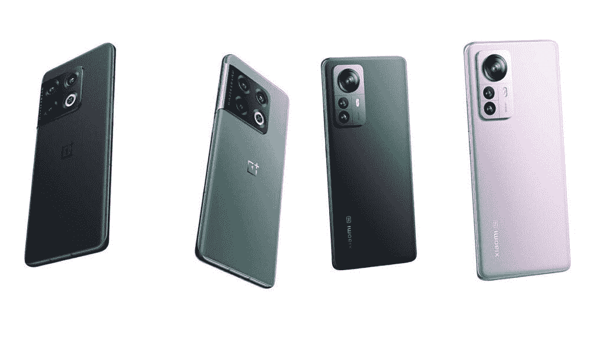
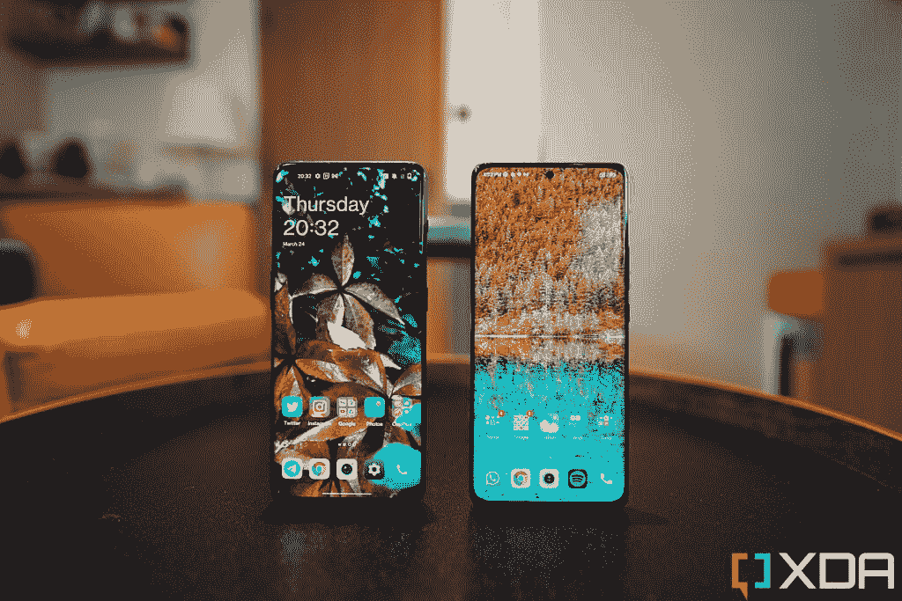
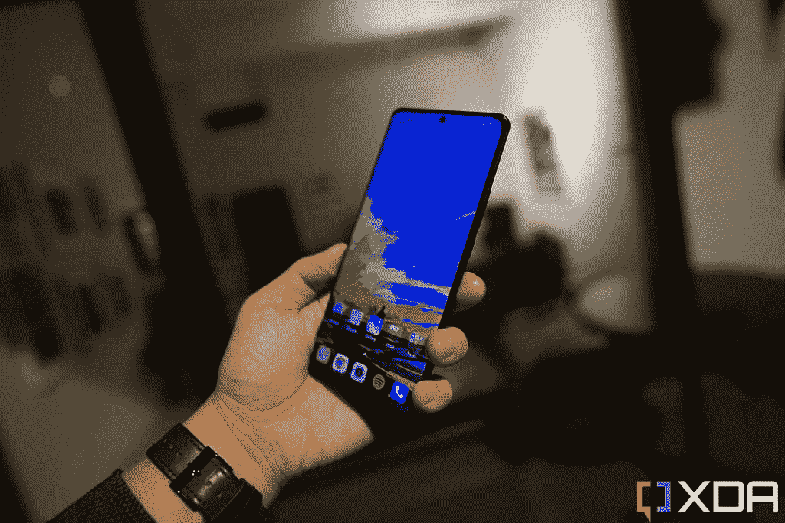
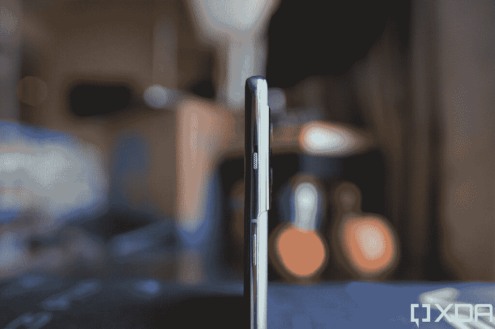
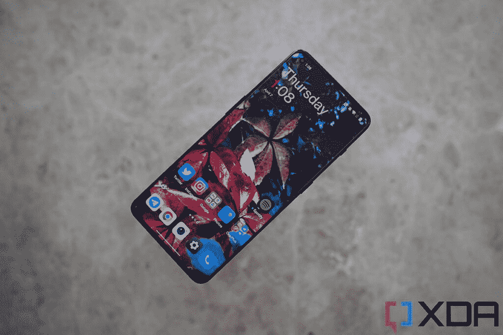
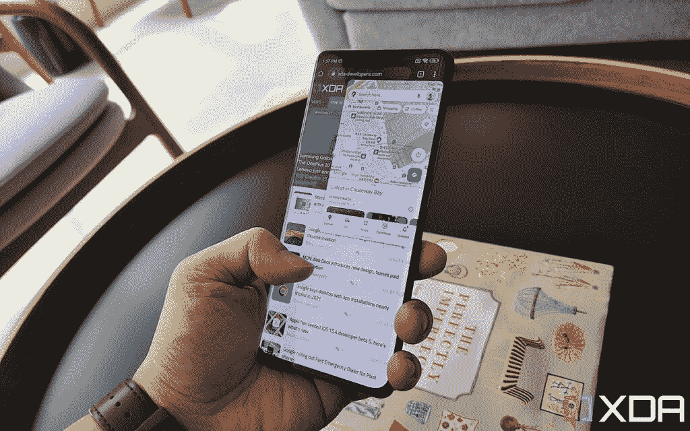

# 一加 10 Pro vs 小米 12 Pro:安卓旗舰哪个好？

> 原文：<https://www.xda-developers.com/oneplus-10-pro-vs-xiaomi-12-pro/>

每年春天左右，我们都会收到一系列运行最新高通芯片的新 Android 旗舰产品，虽然三星的 S 系列在早期获得了大部分关注，但也有其他几个品牌推出了优秀、精致的手机。当然，小米在北美可能不是一个非实体，但亚洲和欧洲的智能手机爱好者知道，小米多年来一直在制造一些最优质的安卓旗舰产品。与此同时，由于与 OPPO 的关系引发的后台争吵，一加在过去的 12 个月里经历了一段艰难的时期，但除去所有的噪音，一加仍然在制造非常强大的手机，比苹果/三星的价格便宜一点。今天我们来看看这两个中国新贵品牌最近的两款旗舰:一加 10 Pro 和 T2 小米 12 Pro T3。

 <picture></picture> 

OnePlus 10 Pro in black and green (left) and Xiaomi 12 Pro in black and purple (right).

 <picture></picture> 

OnePlus 10 Pro

##### 一加 10 专业版

一加 10 Pro 是一款速度很快的手机，具有独特的背面设计和华丽的显示面板。

 <picture></picture> 

Xiaomi 12 Pro

##### 小米 12 Pro

小米 12 Pro 是一款非常不错的旗舰手机，屏幕漂亮，拍照性能扎实。

浏览这篇文章:

* * *

## 一加 10 Pro vs 小米 12 Pro:规格

| 

规范

 | 

一加 10 专业版

 | 

小米 12 Pro

 |
| --- | --- | --- |
| **打造** | 

*   铝制中框
*   大猩猩玻璃 5 背面
*   大猩猩玻璃 Victus 正面

 | 

*   大猩猩玻璃 Victus 正面和背面
*   铝制框架

 |
| **尺寸&重量** | 

*   163 x 73.9 x 8.55 毫米
*   201 克

 | 

*   163.6 x 74.6 x 8.16mm 毫米
*   206 克

 |
| **显示** | 

*   6.7 英寸 QHD+120 赫兹流体 AMOLED
*   第二代 LTPO 校准:1Hz 至 120Hz

 | 

*   6.7 英寸 QHD+120 赫兹流体 AMOLED
*   第二代 LTPO 校准:1Hz 至 120Hz

 |
| **SoC** | 

*   高通骁龙 8 代 1

 | 

*   高通骁龙 8 代 1

 |
| **闸板&存放** | 

*   8GB/12GB 内存
*   128GB/256GB/512GB

 | 

*   128/256GB 存储空间
*   8GB/12GB

 |
| **电池&充电** | 

*   5000 毫安时
*   80W SuperVOOC 有线快充(北美仅限 65W)
*   50W AirVOOC 无线快速充电
*   反向无线充电支持
*   包装中包含充电器

 | 

*   4,600 mAg
*   120W 有线充电
*   高达 50W 的无线充电
*   包装中包含充电器

 |
| **安全** | 光学显示指纹扫描仪 | 光学显示指纹扫描仪 |
| **后置摄像头** | 

*   **主:** 48MP，索尼 IMX789
*   **次要:** 50MP，超广角，三星 S5KJN1SQ03，150 FoV
*   **三级:** 8MP，OmniVision OV08A19

 | 

*   **主:** 50MP，f/1.9，索尼 IMX707，1/1.28 英寸
*   **次要:** 50MP，f/2.2 超宽，112 度 FoV
*   **第三:** 50MP，f/1.9，2 倍光学变焦

 |
| **前置摄像头** | 32MP，索尼 IMX615 | 32MP，f/2.45 自拍相机 |
| **端口** | USB-C | USB-C |
| **音频** | 立体声扬声器 | 由哈蒙·卡顿调音的立体声扬声器 |
| **连通性** | 

*   5G(毫米波)
*   国家足球联盟
*   蓝牙 5.2

 | 

*   5G(低于 6 GHz 和毫米波)
*   国家足球联盟
*   蓝牙 5.2

 |
| **软件** | 

*   中国:基于 Android 12 的 ColorOS 12.1
*   全球: [OxygenOS](https://www.xda-developers.com/tag/oxygenos/) 12.1 基于 Android 12

 | 基于 Android 12 的 MIUI 13 |
| **其他功能** | 

*   警报滑块
*   双物理 SIM

 | 

*   双物理 SIM 或双 eSIM
*   设备顶部和底部的对称立体声扬声器
*   红外线增强器

 |

## 一加 10 Pro vs 小米 12 Pro:硬件和设计

一加和小米的 2022 年旗舰从背面看可能不同，但从手感和整体形状来看，它们非常非常相似。两者都是玻璃金属夹层板，具有相同的柔和曲线，背面覆有磨砂涂层，给人丝滑的感觉。就尺寸或重量而言，它们之间只有几毫米或几克的距离，因此它们的整体外形几乎相同。

翻转手机，这更有似曾相识的感觉，因为两款设备都使用 6.7 英寸 120Hz LTPO 2.0 有机发光二极管显示面板，具有相同的圆角、边框尺寸和弯曲边缘。唯一的区别因素是一加 10 Pro 的打孔位于小米 12 Pro 中上定位的左上角。见鬼，两个打孔机也有类似的 32MP 自拍相机。

 <picture></picture> 

If not for the homescreen UI, you probably wouldn't be able to tell which screen belongs to which phone.

这些绝对是顶级显示面板，比你日常生活中遇到的几乎 99%的屏幕都好，仅次于最大亮度的 [Galaxy S22 Ultra](https://www.xda-developers.com/samsung-galaxy-s22-ultra-review/) 显示面板，即使这是一个大多数时间都很难注意到的区域。关键是，这些屏幕看起来一样，是的，但它们也是最好的。除了像“我不喜欢曲面屏幕”或“我不喜欢打孔机”这样的个人偏好之外，几乎没有人可以对这些屏幕说什么负面的话。

这些绝对是顶级显示面板，比你日常生活中遇到的几乎 99%的屏幕都要好

虽然有些人认为 6.7 英寸的屏幕很大，但我认为大多数成年手机爱好者都不会有问题——我觉得这两款手机握起来很舒服，甚至单手也很容易使用，这要归功于手机的曲率和 Android 的免费主屏幕网格(所以我可以将应用程序放在更靠近屏幕底部的位置)。

 <picture></picture> 

Xiaomi 12 Pro in the hand.

### 摄像机

设计美学是主观的，但对我来说，我喜欢一加 10 Pro 的大相机模块的外观和风格，与小米 12 Pro 有点香草的左上角相机模块相比，一侧融入了侧框。

不过，小米在相机硬件方面略有优势，三重 50MP 相机系统由一个使用索尼相对较新的 IMX707 传感器的主相机主导，而一加坚持使用较旧的 48MP IMX789 传感器。小米 12 Pro 的传感器尺寸为 1/1.28 英寸，其主摄像头的图像传感器比一加的大，因此具有出色的进光能力。你可以在下面的低光图像中看到，一加的图像比小米的图像稍微嘈杂一些。一加的主摄像头仍然很好——小米的也很好。

转到超宽镜头，小米 12 Pro 集 50MP、112 度超宽和一加的 50MP 超宽于一身，视野高达 150 度。这样一个扫掠式广角镜头可以带来新的视角和有趣的鱼眼式镜头(见下面的样本)，但作为回报，图像锐度损失了。一加甚至在默认情况下加入了传感器，产生了更标准的超广角镜头(不使用完整的 150 度 FoV)，如下面第二个样本所示。

小米的超宽日夜更一致，即使它没有变得几乎一样宽。

一加 10 Pro 最终胜出的地方是变焦镜头 8MP 3.3x 倍光学变焦，而小米是 50MP 2x 倍光学变焦。小米的变焦镜头其实得益于像素宁滨技术，但 2022 年的 2 倍光学变焦就是感觉弱。3.3 倍变焦在现实生活中更有用。由于一加 10 Pro 具有更强的初始光学基座(3.3 倍)，它可以获得高达 10 倍的数字变焦，仍然可以产生清晰的图像。

相反，小米的 2 倍长焦更适合作为人像镜头，即使在 10 倍变焦下，小米 12 Pro 的图像也已经失去了很多细节。

视频性能和自拍照片都不错，稳定的 4k 视频和自拍光线很好，对人脸的对焦不分昼夜。总体而言，这两个相机系统都是 2022 年的旗舰水平，但如果我必须选择一个赢家，我会让小米在超宽传感器和主相机方面略胜一筹。

### 硅

两款手机都运行骁龙 8 Gen 1，但一加 10 Pro 的散热性能明显更好。在我对小米 12 Pro 的评测期间，我在基准应用程序 3D Mark 中运行了 20 分钟长的图形密集型测试(Wild Life Extreme)，小米 12 Pro 由于手机过热而无法完成 20 分钟的测试。一加职业没有这样的问题，虽然它也变得非常热。

不要惊慌，潜在的小米 12 Pro 买家——只有当你是一个真正的重度游戏玩家时，这个过热问题才真正值得注意，小米确实声称自我们审查以来，他们在软件更新中修复了这个问题(但我们无法核实这一说法)。对于所有其他日常任务，这款手机表现良好。尽管如此，这仍然是一加的胜利。

### 电池和内存

一加 10 Pro 配备了一块相当大的 5000 毫安时电池，在大多数情况下可以为手机供电一整天，而小米 12 Pro 则使用 4600 毫安时的电池，这仍然是一个可以接受的电池尺寸，但与其他 2022 年的旗舰相比有点落后。是的，小米 12 Pro 的电池寿命因此受到影响——在轻度使用的日子里，它仍然可以持续一整天，但在你外出并经常使用手机的任何一天，预计手机会在 10 或 11 小时前耗尽电量。

令人欣慰的是，小米 12 Pro 的充电速度几乎比世界上任何其他手机都快，包装中包括一个 120 瓦的充电砖，可以在 25 分钟内将手机从 0 充满到 100。一加 10 Pro 在这方面也不逊色，它提供了 80W 或 65W 的充电块(取决于地区)，可以在 32 分钟或 34 分钟多一点的时间内将手机从 0 充满到 100。关键是，如果你在下午有时间插上手机 10 分钟，你将在晚上解决潜在的电池焦虑。

在 RAM 和 ROM 方面，两款手机都提供相同的 8GB 或 12GB 版本，以及 128GB 或 256GB 的存储空间。一加 10 Pro 确实提供了 512GB 的版本，但这只是针对中国地区，因此大多数读者无论如何都无法获得这种型号。

### 其他硬件位

一加 10 Pro 延续了一加提供“提醒滑块”的趋势，这是一个拨动开关，允许你快速静音或设置手机振动。另一方面，小米 12 Pro 提供了一个真正的立体声扬声器系统，在手机底盘的顶部和底部有对称的扬声器格栅(因此当手机处于横向时，它们可以左右开火)，可以发出完整、生动的音频。小米 12 Pro 还拥有更强的触觉引擎，整个手机都可以感受到，包括解锁显示器内的指纹扫描仪。

这两款手机都具有 IP68 防水和防尘等级，因此如果下雨或您不小心将其中一款手机掉进厕所，您也不必担心。

 <picture></picture> 

The OnePlus 10 Pro has an alert slider on the right side of the device.

## 一加 10 Pro vs 小米 12 Pro:软件

一加 10 Pro 和小米 12 Pro 都运行 Android 12，上面是两家公司各自的 Android 皮肤。对于一加 10 Pro 来说，这可能是世界上大部分地区的 OxygenOS 或中国的 ColorOS 对于小米 12 Pro 来说，软件是 MIUI 13。这两款 Android 皮肤都色彩鲜艳，充满活力，流畅的动画看起来比三星的 OneUI 或谷歌自己的 Pixel Launcher 更快。

 <picture></picture> 

OxygenOS on OnePlus 10 Pro

虽然 MIUI 非常好，但我更喜欢 OxygenOS，因为它更具可定制性，能够改变从 UI 主题颜色到解锁手机的动画等一切。一加 10 Pro 还允许在睡眠屏幕上涂鸦来触发相机或音乐播放等屏幕外操作。小米的 MIUI 也有一个复杂的设置页面，上面有一些奇怪的决定，比如将显示设置分为*三个部分*(显示、永远显示和全屏显示)。OxygenOS 只是更接近谷歌设想的方式。

 <picture></picture> 

You can open many apps in a resizable floating window in MIUI -- you can't do this in OxygenOS.

对我来说，MIUI 的一个优势是多任务处理，因为我不仅可以在小米 12 Pro 上同时分屏显示两个应用程序，还可以在浮动窗口中打开应用程序。OxygenOS 目前只提供前者，无法在可调整大小的小窗口中打开应用程序。

## 一加 10 Pro vs 小米 12 Pro:性能一般

硬件部分已经涵盖了很多这方面的内容，两款手机的交易获胜:一加 10 Pro 的散热性能更好，小米 12 Pro 的触觉和扬声器更好，但一加 10 Pro 的电池寿命更长。然而，小米 12 Pro 的火爆趋势可能是游戏玩家的一个主要问题。

尽管如此，对于大多数正常人来说，这两款手机都能毫无问题地完成你需要的所有任务。这里没有什么令人沮丧的坏，像 Pixel 6 的*疯狂缓慢的*指纹扫描仪，或者在这些手机的中国变种中看到的中断的推送通知。

## 一加 10 Pro vs 小米 12 Pro:你该买哪个？

一加 10 Pro 和小米 12 Pro 都是非常好的 2022 年旗舰产品，感觉也有点像 2021 年前辈的迭代更新，虽然它们在显示亮度，手感，甚至整体休闲性能方面都是虚拟的，但那些严重玩游戏的人会注意到一加 10 Pro 的出色散热，就像那些关心超宽摄影的人会被一加 10 Pro 的次标准超宽传感器失望一样。这真的是你想要的，因为两部手机都很近。

然而，一加 10 Pro 有一个主要优势——它更实惠，更广泛可用。一加 10 Pro 起价 899 美元，在全球销售，包括主要市场北美。小米 12 Pro 不在北美正式销售，其欧洲定价更接近于相当于 1100 美元。在亚洲，小米 12 Pro 的价格更合理，相当于 950 美元左右，这缩小了差距。在印度，小米 12 Pro 比一加 10 Pro 便宜，在这种情况下，它是更好的价值选择，尽管两者都是很好的选择。但总体而言，考虑到一加 10 Pro 的价格更低，可用范围更广，并考虑到小米 12 Pro 唯一明显的优势是超宽摄影和扬声器性能，那么在我看来，一加 10 Pro 在这次比较中遥遥领先。

 <picture></picture> 

OnePlus 10 Pro

##### 一加 10 专业版

一加 10 Pro 是一款速度很快的手机，具有独特的背面设计和华丽的显示面板。

 <picture></picture> 

Xiaomi 12 Pro

##### 小米 12 Pro

小米 12 Pro 是一款非常不错的旗舰手机，屏幕漂亮，拍照性能扎实。