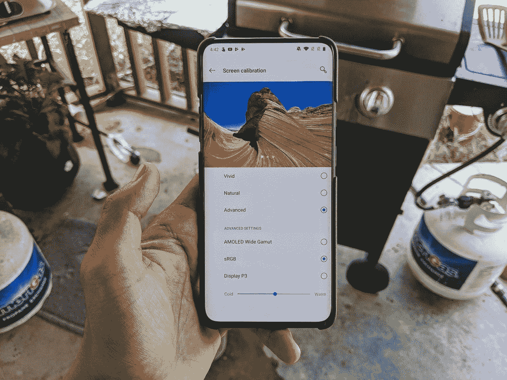
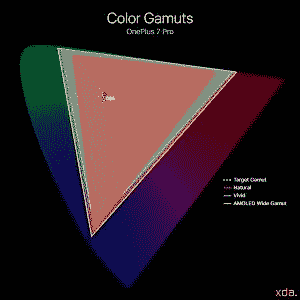
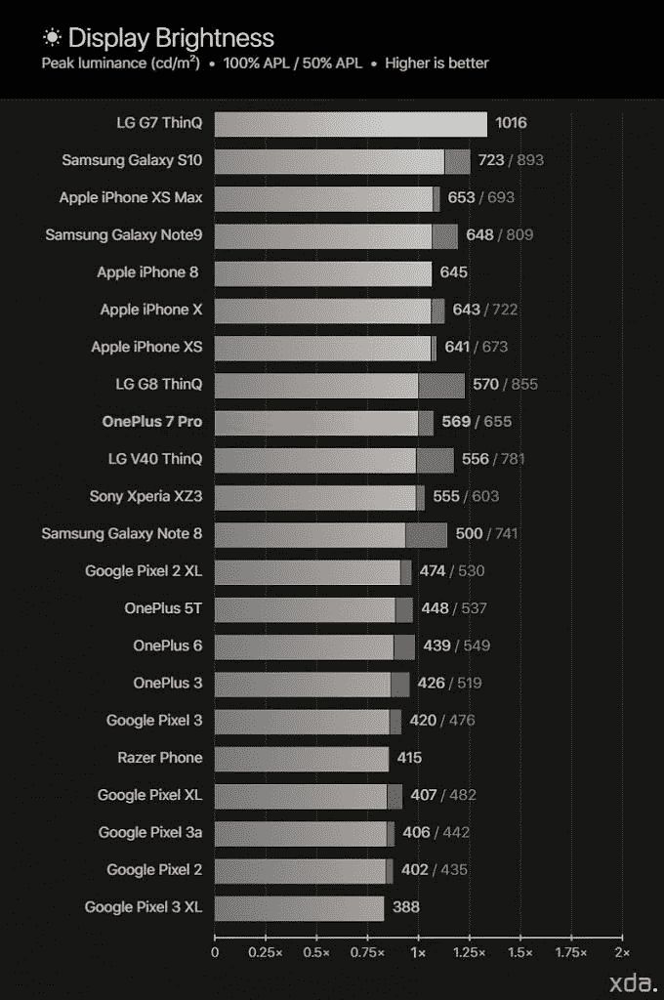
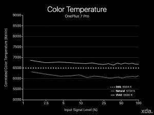
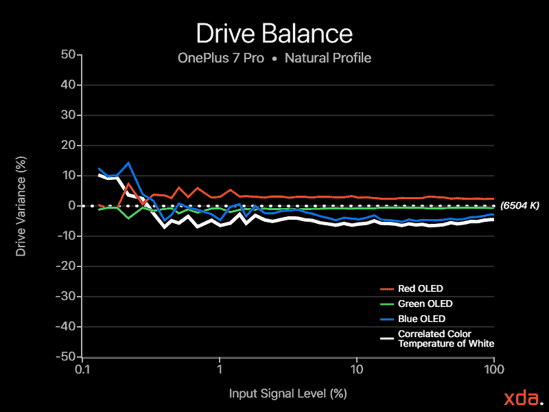
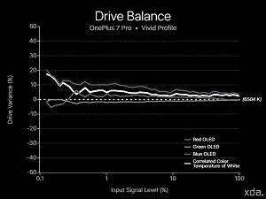

# 一加 7 Pro 显示器评测—最终达到旗舰品质

> 原文：<https://www.xda-developers.com/oneplus-7-pro-display-review-finally-flagship-quality/>

对一加来说，低价“旗舰杀手”的时代早已结束。他们慢慢地爬上了价格等级，通过 OnePlus 5、OnePlus 6 及其各自的“T”迭代变体将手机定价在中档。一加今年继续攀升，推出了一加 7 和一加 7 Pro，后者的定价区间几年前被认为在“高端旗舰”范围内。一加 7 Pro 处于这个奇怪的新价格区间，肯定比“中档”高*；它可以说是在重击球手的溢价区，只是*在技术上比竞争对手稍微便宜一点*。*

此外，一加 7 Pro 是一种断言，让一加*似乎承认*他们在之前的设备上偷工减料。就好像他们在说“给我们更多的钱，这就是我们真正能做的事情。”QHD+屏幕分辨率、线性共振致动器(iPhone/Pixel/Galaxy/LG 旗舰产品上使用的触觉电机类型)以及实际变亮的屏幕等方面，都是一加最终为一加 7 Pro 增加的新功能。与此同时，普通的一加 7 仍然保留了 FHD+屏幕和旧的偏心触觉电机。认为大部分价格可能都花在了那次展示上不会有什么不妥，但不管怎样，我们现在必须把一加 7 Pro 视为成熟的溢价，并在没有任何关于其价格的脚注的情况下对其进行判断。

让我们来谈谈那个新的大显示器。



## **一加 7 Pro 显示器规格**

6.7 英寸显示屏覆盖了一加 7 Pro 的整个正面，看不到任何凹口或明显的下巴。一加最终从 FHD (1080p)上升到 QHD (1440p)，这对于一加 7 Pro 的更大屏幕来说绝对是必要的。一加 7 Pro 显示器的分辨率为 3120×1440，像素密度为每英寸 516 像素，即每英寸 365 个红色和蓝色子像素，这对于典型的观看距离(约 1 英尺或 31 厘米)来说足够清晰。对于 20/20 视力，超过 9.4 英寸(24 厘米)的像素应该是不可分辨的。显示屏很长，长宽比为 19.5:9，这是与 OnePlus 6 和一加 6T 相比，显示屏尺寸差异最大的地方。一加 7 Pro 显示屏仅宽 0.1 英寸(0.3 厘米)，但比一加 6 和一加 6T 高约半英寸(1 厘米)。这一微小的额外宽度带有弯曲的边缘，更靠近侧挡板，就个人而言，我并不喜欢弯曲的显示器——我更不喜欢那些弯曲远离我并扭曲显示器连续性和视野的显示器。

最后，最大的不同是:那种黄油般的“Fluid AMOLED”高刷新率。这是手机最令人愉快和突出的功能之一，如果你打算购买一加 7 Pro，这是一个巨大的新奇因素。这种差异是显而易见的，即使对非技术专家来说也是如此。我让我的朋友和家人玩一加 7 Pro，手机的流畅性总是受到关注，即使我没有告诉他们刷新率增加了，这在一个最新智能手机在速度和流畅度上都很好的时代令人印象深刻。一加 7 Pro 默认设置为自动 90Hz 渲染模式，根据应用程序在 60Hz 和 90Hz 之间切换，但如果你愿意，你可以通过一个简单的 adb 命令[强制显示器总是以 90Hz](https://www.xda-developers.com/oneplus-7-pro-true-90hz-display-mode/) 渲染。

## **颜色配置文件**

[](https://static1.xdaimages.com/wordpress/wp-content/uploads/2019/07/oneplus_7pro_gamut.jpg)

一加 7 专业版的色域

一加修改了 7 Pro 的屏幕校准选项，提供了两个主要校准，“生动”和“自然”，以及一个“高级”选项，显示三个色域选择和一个滑块来调整显示器白点的色温。

一加 7 Pro 的默认显示校准是**生动**配置文件，增加了饱和度和对比度。白点比 D65 (6504 K)稍冷，但不会太冷，白点可以认为是准确的。该配置文件针对 P3 色域，从 sRGB 延伸到 P3。该配置文件也是用 Android 的 CMS 管理的一种颜色，所以它考虑了嵌入式颜色配置文件(对于支持的媒体/应用程序)，并增加了相对于嵌入式颜色空间的饱和度。这是我在 Android 上看到的第一个色彩饱和度扩展的*和*色彩管理(使用 Android 的 CMS)显示配置文件，这就是色彩拉伸配置文件*应该有的方式*。然而，色彩管理存在缺陷，将其色域限制在 P3，因此高饱和度的颜色被修剪回 P3，即使一加 7 Pro 的显示器能够呈现比 P3 更宽的颜色。

**自然**配置文件是遵循行业标准的颜色精确显示校准，针对非扩展颜色值的 sRGB 颜色空间，并符合在其他颜色空间中使用嵌入式颜色配置文件渲染内容的要求。白点和对比度也是由某些标准定义的，因此在这种模式下它们都是不可调整的。

## **亮度**

很好，但是与最聪明的人相比就相形见绌了

[](https://static1.xdaimages.com/wordpress/wp-content/uploads/2019/07/oneplus_7pro_brightness-1.jpg)

亮度参考图表

从历史上看，一加显示器的亮度没有什么值得大书特书的，但价格上还是可以接受的。这些显示器并不是要与三星自己的显示器直接竞争，三星一直是业内最亮的移动 OLEDs，但一加 7 Pro 已经进入了一个价格点，它需要在每个设备方面与最好的产品竞争。在高端智能手机领域，明亮的显示屏对于在户外可用性方面脱颖而出至关重要，目前即使是最亮的智能手机显示屏在阳光直射下也不太好。提高显示屏亮度需要耗费大量电池寿命，因此一些智能手机通常只在手机检测到大量光线时，例如在户外时，才允许显示屏达到峰值亮度。这种亮度提升被称为高亮度模式，三星的大多数有机发光二极管面板都支持这种模式，包括一加使用的面板。自 OnePlus 3 以来，一加的所有面板都支持高亮度模式，但他们从未利用亮度提升，直到一加 7 Pro。(我看到过高亮度模式在 OnePlus 6 上工作的报告，但我无法让它在我的设备上自然触发。)

凭借新实施的高亮度模式，一加 7 Pro 最终打破了 450 尼特的上限，全白屏(100% APL)的亮度约为 570 尼特，仅次于 LG G8 ThinQ T1，比苹果和三星的最新旗舰产品低一大截。当使用除自然之外的显示配置文件时，屏幕亮度与屏幕内容 APL 成反比，因此在有大量图片的应用程序中，如社交媒体，显示平均接近 650 尼特。在自然显示配置文件中，这种变化的亮度被最小化，以保持一致和准确的显示灰度系数。

在最低亮度下，一加 7 Pro 可以降至 1.95 尼特，这与苹果和三星的典型最低亮度相似(约 1.8 尼特)，明显比其他一些产品暗，如 [Pixel 3](https://www.xda-developers.com/google-pixel-3-display-analysis-a-real-tangible-improvement-yet-still-behind-the-curve/) (2.35 尼特)， [Pixel 3 XL](https://www.xda-developers.com/google-pixel-3-xl-display-review-what-google-needs-to-improve-for-the-pixel-4/) (2.10 尼特)，或 LG G8 ThinQ (2.70 尼特)。然而，一加说，在新的夜间模式的帮助下，他们的最小亮度可以更低，据说低至 0.27 尼特。这是因为夜间模式的暖色调实际上会降低新的“亮度”滑块旁边的屏幕亮度，从而使显示器变暗。这个亮度滑块实际上是屏幕上的一个黑色覆盖，滑块控制这个黑色覆盖的强度。这与 iPhones 的“降低白点”设置相同。

只是为了好玩，我们将一加 7 Pro 面板上的高亮度模式调到了最高设置，这使得显示器亮度超过了自动亮度模式下的亮度。屏幕亮度增加了约 80 尼特，全白图像(100% APL)的显示亮度达到了 640 尼特，与 iPhone Xs 处于同一亮度水平。测试其绝对最高输出时，显示器能够在 1%的小窗口尺寸下发射 908 尼特，这在常规使用中并不意味着什么，但测试一加 7 Pro 的显示器可以消耗多少功率是很有趣的。一加 7 Pro 可能不会在这些调高的亮度水平下持续输出，这就是为什么自动亮度模式下的高亮度模式提升不会变得那么亮。然而，如果你[选择了一加 7 Pro](https://www.xda-developers.com/unlock-bootloader-root-oneplus-7-pro/) ，请自担风险享受这些更高的显示亮度:

使用提升的 adb 外壳，运行

```
echo 5 > /sys/class/backlight/panel0-backlight/device/drm/card0/card0-DSI-1/hbm
```

要使其自动触发，您可以创建一个 Tasker 配置文件，在高环境照明(%LIGHT > 20000)或系统亮度设置为最大值(system screen_brightness = 1023)时触发。

**色彩准确度**

## **色彩准确度**

温暖，但在其他方面准确— **B+**

一加 7 Pro 的自然轮廓相当准确，但它不会赢得任何奖项或业余调色师的荣誉奖。在 6134 K 的相关色温下，我们测得白色颜色误差的平均*δE*为 3.3。只需要 2.3 的*δE*就可以注意到颜色误差，白色的标准色温为 6504 K，因此一加 7 Pro 显示器相对于行业标准来说确实显得过于温暖。暖色在所有白色级别都存在，这影响了浅色混合物的外观。黄色是一种高亮度的混合色，受一加 7 Pro 的暖白点影响最大。

我们使用 41 种目标颜色来评估显示器的色彩准确性，这些颜色在不同的白色级别下大致均匀地分布在标准 sRGB 和 P3 色域中，我们测量了 sRGB 色域的平均*δE**为 1.5，P3 色域的平均*δE*为 1.4。从这些测量中，我们计算出标准偏差为 0.7，这表明颜色精度读数的差异稍高；平均值的一个标准偏差(1.5 + 0.7 = 2.2)几乎是一个可察觉的差异(2.3)。sRGB 报告的最大色彩误差出现在低饱和度的浅黄色，测得的*δE*为 4.1，而对于 P3 色域，最大误差出现在高饱和度的红黄色(也称为橙色)，其*δE*为 3.5。与 Pixel 3 XL 和 iPhone Xs 相比，一加 7 Pro 有很大的改进空间。Pixel 3xl 和 iPhone Xs 的颜色误差非常低，平均误差的三个标准偏差仍然低于 2.3 的阈值。这并不是说它的显示不准确，因为它确实不准确——显示对几乎所有非专业人士来说都足够准确——但我们在这里是与最好的产品进行比较，我们预计会稍好一些。*

 *我们使用 41 种目标颜色来评估显示器的色彩准确性，这些颜色在不同的白色级别下大致均匀分布在标准 sRGB 和 P3 色域中，我们测量了 sRGB 色域的平均*δE**为 1.5，P3 色域的平均*δE*为 1.4。从这些测量中，我们计算出标准偏差为 0.7，这表明颜色精度读数的差异稍高；平均值的一个标准偏差(1.5 + 0.7 = 2.2)几乎是一个可察觉的差异(2.3)。sRGB 报告的最大色彩误差出现在低饱和度的浅黄色，测得的δE 为 4.1，而对于 P3 色域，最大误差出现在高饱和度的红黄色(也称为橙色)，δE*为 3.5。与 Pixel 3 XL 和 iPhone Xs 相比，一加 7 Pro 有很大的改进空间。Pixel 3xl 和 iPhone Xs 的颜色误差非常低，以至于其平均值的三个标准偏差仍然低于 2.3 的阈值。这并不是说它的显示不准确，因为它确实不准确——显示对几乎所有非专业人士来说都足够准确——但我们在这里是与最好的产品进行比较，我们预计会稍好一些。**

 ***对比&语气反应**

## **对比&色调响应**

非常好，但是在较低的亮度水平下对比度会下降

显示器的对比度和色调响应在精确校准中最为重要。与颜色相比，人类对物体的对比度和结构(或形状)更敏感，因此确定显示器的色调响应至关重要，以便图像中的细节可以在其他显示器上保留和描绘。对比度也会在心理上影响颜色的外观。一个很好的例子是 [Pixel 2 XL 显示器](https://www.xda-developers.com/pixel-2-xl-xda-display-analysis/)，它经常被报道有不准确的颜色，尽管它测量的色度是准确的。这是因为 Pixel 2 XL 的显示器伽马值高得离谱(2.46+，而行业标准为 2.20)，这意味着显示器的显示对比度异常高，颜色更暗。较暗的颜色看起来不太鲜艳，这是 Pixel 2 XL 比其他同样针对 sRGB 色彩空间的显示器看起来更“柔和”的真正原因。

历史上，一加也很少校准智能手机的音调响应*。他们以前所有智能手机的显示屏灰度和对比度都太高，导致校准后的显示屏配置文件不令人满意，使用起来也没有吸引力。然而，不仅仅是谷歌和一加——几乎所有的移动 OLED，包括三星自己的，都有不准确的色调响应校准，因为 OLED 面板会随着整个面板的平均亮度改变其像素的亮度，使伽马读数不一致，显示器不可校准。三星显示最新的面板可以禁用这种参考显示模式的动态亮度机制，一加 7 Pro 上的三星面板将这种功能(或者更确切地说是缺乏这种功能)引入了其自然的显示配置文件。因此，显示器可以校准，以更准确地瞄准标准的 2.20 伽玛。*

 *在自然状态下，我们测量了一加 7 Pro 显示屏，在其可用亮度范围内，平均显示灰度系数为 2.22，非常接近 2.20 的标准。这比去年的 OnePlus 6 有了很大的改进，我们测量的 OnePlus 6 的显示伽玛为 2.35。色彩不再像在以前的一加设备上那样模糊或柔和，它们现在以适当的“流行”方式出现，并在大多数情况下准确地再现图像中的原始对比度和渲染忠实的色调。在中高亮度下，伽马峰值为 2.30，这对于与这些亮度水平相关的观看环境来说是很好的。但在低端，从最低到低亮度，我们测得显示器伽马约为 2.07，这非常低，不适合昏暗的环境。一加将他们的显示灰度转换为 25%和 10%的亮度来提升阴影。对于弱光环境，更高的显示灰度系数是必要的，因为人类在弱光下对对比度具有更高的敏感度，所以在 0 勒克斯(沥青黑色)环境光下，推荐大约 2.40 的显示灰度系数，以实现在 200 勒克斯(典型的办公室照明)下 2.20 的显示灰度系数的类似外观。因为显示器灰度系数在低亮度水平下非常低，所以当在低亮度水平的昏暗环境中观看显示器时，显示器将显得褪色和缺乏对比度。这适用于所有显示轮廓，而不仅仅是自然轮廓。然而，我承认一加很可能故意这样校准显示器，以改善较低亮度下的黑色渲染——这肯定比剪裁的黑色好，但对比度的缺乏需要注意。

在生动的配置文件中，一加通常在他们的面板中使用动态亮度机制来从屏幕中挤出最大的亮度，但这样做牺牲了伽马校准的一致性。显示器灰度系数的范围从低亮度时的 2.10 到高亮度时的 2.40。结果，显示器的对比度以不期望的方式变化，随着显示器变亮而增加。尽管不管显示器亮度如何，显示器的基线伽马在理想情况下应该是一致的，但是如果要采用动态伽马，则应该反过来:显示器伽马应该在低环境照明时开始较高(2.40)，并且随着环境照明的增加而降低。三星在其智能手机中部分考虑到了这一点，当检测到大量光线时，将显示屏伽马和对比度降低到约 1.80。就其本身而言，在中等亮度以下，生动的轮廓具有与自然轮廓相似的伽玛，并且它仅在较高亮度下享有增加的对比度。一加 7 Pro 在其生动的轮廓中的伽马变化似乎没有任何依据，这似乎只是他们校准工作中的一个疏忽。即使配置文件并不精确，显示特征也应该在各种白色级别保持一致，如果特征是动态的，它们应该正确地遵循心理视觉属性。

在生动的配置文件中，一加通常在他们的面板中使用动态亮度机制来从屏幕中挤出最大的亮度，但这样做牺牲了伽马校准的一致性。显示器灰度系数的范围从低亮度时的 2.10 到高亮度时的 2.40。结果，显示器的对比度以不期望的方式变化，随着显示器变亮而增加。尽管不管显示器亮度如何，显示器的基线伽马在理想情况下应该是一致的，但是如果要采用动态伽马，则应该反过来:显示器伽马应该在低环境照明时开始较高(2.40)，并且随着环境照明的增加而降低。三星在其智能手机中部分考虑到了这一点，当检测到大量光线时，将显示屏伽马和对比度降低到约 1.80。就其本身而言，在中等亮度以下，生动的轮廓具有与自然轮廓相似的伽玛，并且它仅在较高亮度下享有增加的对比度。一加 7 Pro 在其生动的轮廓中的伽马变化似乎没有任何依据，这似乎只是他们校准工作中的一个疏忽。即使配置文件并不精确，显示特征也应该在各种白色级别保持一致，如果特征是动态的，它们应该正确地遵循心理视觉属性。

**驱动平衡**

## **驱动平衡**

使用较冷的低端进行一致校准— **B+**

一加 7 专业版的平均色温

[](https://static1.xdaimages.com/wordpress/wp-content/uploads/2019/07/oneplus_7pro_cct.jpg)

一加 7 Pro 上的自然和生动的配置文件都在不同的信号水平下进行了严格和一致的校准。随着亮度下降，显示器确实变得更冷，但这种转变并不明显，只有在低于 1%的非常低的信号水平下才明显，这与中低亮度下的暗灰色等非常暗的颜色相关。

一加 7 Pro 的自然轮廓驱动平衡，60Hz/90Hz

[](https://static1.xdaimages.com/wordpress/wp-content/uploads/2019/07/oneplus_7pro_db_natural.gif)

为一加 7 专业版实现生动形象的平衡

[](https://static1.xdaimages.com/wordpress/wp-content/uploads/2019/07/oneplus_7pro_db_vivid.jpg)

我还测量了以 90Hz 和 60Hz 渲染时显示器驱动平衡的差异，甚至在测量之前，我就能够注意到细微的差异。90Hz 的面板具有稍微不同的蓝色有机发光二极管响应，更具体地说，它在接近黑色的非常低的信号电平下被增强。这可能是一个有意的调整，以补偿蓝色有机发光二极管更快的响应时间，从而减少重影/“拖尾”的影响。对于 60Hz 和 90Hz，OLED 的响应时间应该是相同的，但是增加的蓝色有机发光二极管强度允许它上升并填充蓝色元素亮度贡献的更高比例，当扫过黑暗的低对比度内容时，留下更少的明显拖尾或“拖尾”。这是以将非常暗的表面着色得更冷为代价的，但从我的测试来看，它确实稍微减少了受影响表面的重影。

我还测量了以 90Hz 和 60Hz 渲染时显示器驱动平衡的差异，甚至在测量之前，我就能够注意到细微的差异。90Hz 的面板具有稍微不同的蓝色有机发光二极管响应，更具体地说，它在接近黑色的非常低的信号电平下被增强。这可能是一个有意的调整，以补偿蓝色有机发光二极管更快的响应时间，从而减少重影/“拖尾”的影响。对于 60Hz 和 90Hz，OLED 的响应时间应该是相同的，但是增加的蓝色有机发光二极管强度允许它上升并填充蓝色元素亮度贡献的更高比例，当扫过黑暗的低对比度内容时，留下更少的明显拖尾或“拖尾”。这是以将非常暗的表面着色得更冷为代价的，但从我的测试来看，它确实稍微减少了受影响表面的重影。

**功耗**

## 在享受超级平滑的 90Hz 刷新率时，电池寿命可能是一个问题，但根据我的测量，60Hz 的面板本身与其他三星面板相比具有非常相似的功耗特性，包括基线功率和发光效率(有和没有高亮度模式)。在 60Hz 下，显示器本身消耗大约 350-400mW 的功率，在 90Hz 下，我在三个小时的静态图像上测量到大约 80mW 的平均功率增加(90Hz 强制)，这大致与显示器每小时额外消耗一加 7 Pro 总电池的 0.5%有关*。*SoC 和 GPU 应该有额外的功耗来推动每秒 90 帧。与我预期的相反，90Hz 显示器似乎没有任何固有的或进一步的缺点，除了在低信号水平下蓝色有机发光二极管强度增加，如果你认为这是一个缺点。

在享受超级平滑的 90Hz 刷新率时，电池寿命可能是一个问题，但根据我的测量，60Hz 的面板本身与其他三星面板相比具有非常相似的功耗特性，包括基线功率和发光效率(有和没有高亮度模式)。在 60Hz 下，显示器本身消耗大约 350-400mW 的功率，在 90Hz 下，我在三个小时的静态图像上测量到大约 80mW 的平均功率增加(90Hz 强制)，这大致与显示器每小时额外消耗一加 7 Pro 总电池的 0.5%有关*。*SoC 和 GPU 应该有额外的功耗来推动每秒 90 帧。与我预期的相反，90Hz 显示器似乎没有任何固有的或进一步的缺点，除了在低信号水平下蓝色有机发光二极管强度增加，如果你认为这是一个缺点。

一加 7 专业版显示屏概述

### 好的

| 好的

*   非常好的色彩准确度
*   优秀平均 音调响应
*   最小黑色削波
*   ### 坏

 | 不良

*   音调响应差异需要改进
*   音调响应差异需要改进

 |
| **规格** |

| **一加 7 Pro** | **类型** |
| --- | --- |
| 流体 amoed(90Hz)PenTile 钻石像素 | **制造商** |
| 三星显示公司。 | **尺寸** |
| 6.7 英寸对角线6.1 英寸乘 2.8 英寸 16.9 平方英寸 | **决议** |
| 3120×1440 像素19.5:9 像素宽高比 | **像素密度** |
| 每英寸 365 红色子像素每英寸 516 绿色子像素每英寸 365 蓝色子像素 | **像素锐度距离** *视力为 20/20 的可分辨像素距离。典型的智能手机观看距离约为 12 英寸* |
| < 9.4 英寸为全彩色图像 < 6.7 英寸为非彩色图像 | **角度偏移** *在倾斜 30 度时测量* |
| -26%为亮度偏移*δE*= 6.8 为色彩偏移 | **黑色削波阈值** *要削波为黑色的信号电平。以 10 cd/m 的速度测量* |
| < 0.4% | **规格** |

| **自然** | **生动的** | **亮度** |
| --- | --- | --- |
| **100% APL:** 559 尼特(自动)/ 398 尼特(手动) **50% APL:** 576 尼特(自动)/ 402 尼特(手动)*良好*

* * *

与 APL 有 2%的差异 | **100% APL:** 569 尼特(自动)/ 408 尼特(手动) **50% APL:** 655 尼特(自动)/ 456 尼特(手动)*良好*

* * *

与 APL 有 26%的差异 | **伽玛** *标准是 2.20 的直线伽玛* |
| 2.08–2.31 平均值:2.22 *优秀方差略高* | 2.10–2.40 平均值:2.28 *高方差；需要改进* | **白点**标准是 6504 K |
| 6134K*δE*= 3.3*太热* | 6680K*δE*= 2.4*精确到标准* | **色差** |
| **sRGB:** 平均值*δE*= 1.5±0.7 最大值*δE*= 4.1 25%黄色 **P3:** 平均值*δE*= 1.4±0.7 最大值*δE*= 3.5 100%红黄色*非常精确* *最大误差略高* | 平均*δC*= 7.3 红色*δC*= 12.1/*δH*= 1.1 朝向黄绿色*δC*= 12.3/*δH*= 3.2 朝向青色*δC*= 0.6/*δH*= 0.1 朝向品红色*目标 P3 色域【T39* | 请访问我们下面的设备论坛，在这里您可以了解最新的消息，了解最好的 mods、自定义 rom、自定义内核、附件等等。 |

请访问我们下面的设备论坛，在这里您可以了解最新的消息，了解最佳的 mod、自定义 rom、自定义内核、附件等。

[**一加 7 Pro 论坛**](https://forum.xda-developers.com/oneplus-7-pro)

如果你有兴趣购买这款设备，请前往 OnePlus.com。我们嵌入了美国和印度商店页面的链接，但你也可以在欧洲和亚洲的许多其他国家购买该设备。

如果你有兴趣购买这款设备，请前往 OnePlus.com。我们嵌入了美国和印度商店页面的链接，但你也可以在欧洲和亚洲的许多其他国家购买该设备。

**[买一加 7 Pro(美)](https://onepluscom.pxf.io/c/2233363/916678/12532?subId1=UUxdaUeUpU25149&subId2=exda&u=https%3A%2F%2Fwww.oneplus.com%2Fus%2Foneplus-7pro&ourl=https%3A%2F%2Fwww.oneplus.com%2Foneplus-7pro)** [**买一加 7 Pro(印)**](https://onepluscom.pxf.io/c/2233363/916678/12532?subId1=UUxdaUeUpU25149&subId2=exda&u=https%3A%2F%2Fwww.oneplus.in%2Foneplus-7)

**[买一加 7 Pro(美)](https://onepluscom.pxf.io/c/2233363/916678/12532?subId1=UUxdaUeUpU25149&subId2=exda&u=https%3A%2F%2Fwww.oneplus.com%2Fus%2Foneplus-7pro&ourl=https%3A%2F%2Fwww.oneplus.com%2Foneplus-7pro)** [**买一加 7 Pro(印)**](https://onepluscom.pxf.io/c/2233363/916678/12532?subId1=UUxdaUeUpU25149&subId2=exda&u=https%3A%2F%2Fwww.oneplus.in%2Foneplus-7)***