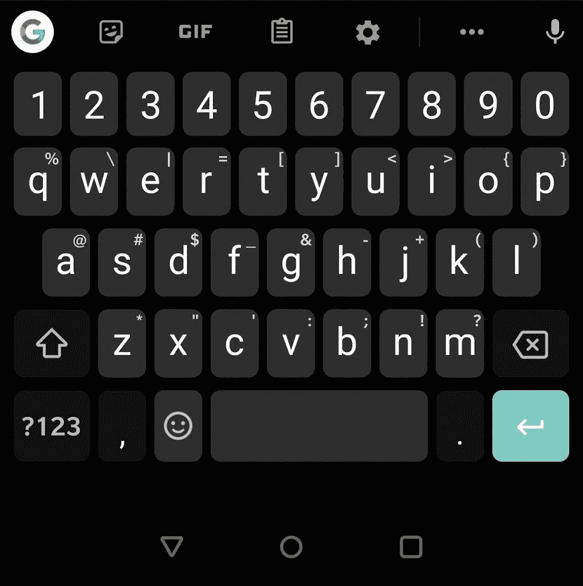
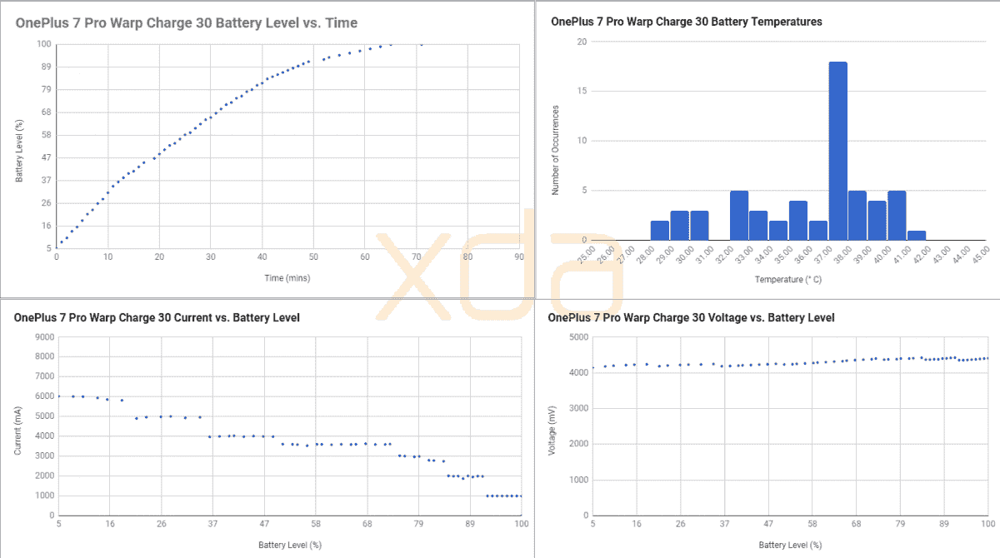
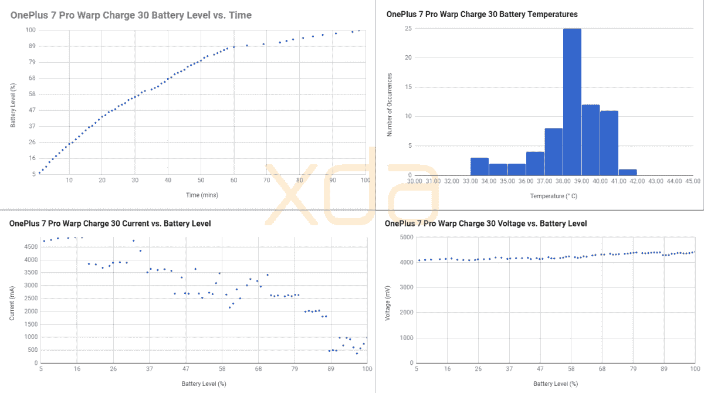

# 一加 7 Pro 评测——这是 2019 年迄今为止最好的智能手机

> 原文：<https://www.xda-developers.com/oneplus-7-pro-review/>

自一加发布其首款智能手机“旗舰黑仔”OnePlus One 以来，“永不满足”一直是该品牌的口号。多年来，“永不满足”的座右铭和“旗舰黑仔”的头衔一直是刻薄的头条新闻。一加发布的每一款新智能手机都会招致批评，称该公司实际上是在“解决”某个问题。随着新一加智能手机的价格慢慢攀升，蚕食三星 Galaxy 和苹果 iPhone 的地盘，一加的粉丝们想知道该公司何时才能发布一款真正不折不扣的智能手机，值得涨价。今天，该公司在新的一加 7 Pro 上做到了这一点。

一加 7 Pro 是一加有史以来最大的换代产品。与去年的一加 6T 相比，它的变化非常显著:更高分辨率和刷新率的升级显示屏，取消了凹槽和几乎所有的挡板，三后置摄像头设置，最新的高通骁龙 855，30W 快速充电，高达 12GB 的 RAM，更快的存储，更好的指纹识别器，等等。在美国，一加 7 Pro 的起价为 669 美元，比一加 6T 高 120 美元，但比三星 Galaxy S10e 低 70 美元。拥有所有这些升级的一加 7 Pro 真的值得比一加 6T 多花 120 美元吗？它比入门级的三星 Galaxy S10 更好吗？让我们在回顾中找出答案。

### 一加 7 专业版规格-单击展开。

**通用规格**

| 

种类

 | 

规格

 | 

种类

 | 

规格

 |
| --- | --- | --- | --- |
| 尺寸和重量 |  | 随机存取存储 | 6GB/8GB/12GB LPDDR4X |
| 设计和颜色 | 全玻璃(康宁大猩猩玻璃 5)星云蓝、杏色、镜面灰 | 储存；储备 | 128GB/256GB UFS 3.0 双通道 |
| 显示 | 6.67 英寸 3120x1440 (19.5:9) 90 赫兹 AMOLED 显示屏。支持 sRGB 和 P3 保卫儿童国际。 | 电池 | 4，000 毫安时(不可拆卸) |
| 相机(图像) | 正面:带 EIS 的索尼 IMX 471 (16MP，f/2.0，1.0μm)。后置(主):索尼 IMX 586 (48MP，f/1.6，1.6μm)，带 OIS 和 EIS。后置(3 倍光学变焦的长焦):8MP，f/2.4，1.0μm，带 ois 后置(广角):16MP，f/2.2，117 双 LED 闪光灯 PDAF，LAF，CAF | 充电 | 曲速充电 30 (5V 6A) |
| 摄像机(视频) | 前置:1080p@30，延时:4k@30/60，1080 p @ 30/60 后置(慢动作):1080p@240，720p@480 | 港口 | USB 3.1 Type-CDual nano-SIM 卡插槽 |
| 软件 | 基于 Android 9 Pie 的 OxygenOS 9.5 | 声音的 | 双立体声扬声器。由杜比 Atmos 调谐的音频。 |
| 片上系统 | 配备 Adreno 640 GPU 的高通骁龙 855 CPU(1 个 2.84 GHz Kryo 485+3 个 2.42 GHz Kryo 485+4 个 1.8GHz Kryo 385) | 多媒体编解码器支持 | 音频回放:MP3、AAC、AAC+、WMA、AMR-NB、AMR-WB、WAV、FLAC、APE、OGG、MID、M4A、IMY、AC3、EAC3-JOC、ac4 音频录制:WAV、AAC、AMRVideo Playback: MKV、MOV、MP4、H.265(HEVC)、AVI、WMV、TS、3GP、FLV、web 视频录制:MP4 图像查看:JPEG、PNG、BMP、gif 图像输出:JPEG、PNG |

**连接和 LTE 频段信息**

| 

种类

 | 

规格

 |
| --- | --- |
| 连通性 | Wi-Fi: 2×2 MIMO、802.11 a/b/g/n/ac、2.4 GHz/5 GHz 蓝牙:蓝牙 5.0，支持高通 aptX、aptX HD、LDAC 和 AACNFC:是定位:GPS(L1+L5 双频)、GLONASS、北斗、伽利略(E1+E5a 双频)、SBAS、A-GPS |
| --- | --- |
| LTE 特性 | 支持 5xCA 和 4x4MIMO。最高支持 DL cat 18(1.2 Gbps)/UL cat 13(150 Mbps)，具体取决于运营商。 |
| --- | --- |
| lte 频段–北美 | 

捍卫民主阵线 LTE:B1/2/3/4/5/7/8/12/13/17/19/20/25/28/29/32/66/71 TDD-LTE:b34/38/39/41/46/48 UMTS:B1/2/4/5/8/9/19 CDMA:BC 0/bc1 GSM:B2/3/5/8

 |
| --- | --- |
| lte 频段–cn/in/en | 

捍卫民主阵线 LTE:B1/2/3/4/5/7/8/12/13/17/19/20/25/28/29/32/66 TDD-LTE:b34/38/39/40/41 TDS:b34/39 UMTS:B1/2/4/5/8/9/19 CDMA:BC 0/bc1 GSM:B2/3/5/8]

 |
| --- | --- |

*关于本次评测:*2019 年 5 月 2 日收到一加寄来的星云蓝一加 7 Pro (12GB RAM + 256GB 存储)。自从收到这款设备后，我就将它作为日常驾驶工具。一加是 XDA 的提案国之一，但他们没有对这次审查的内容发表任何意见。

[**一加七大职业论坛**](https://forum.xda-developers.com/oneplus-7-pro)

* * *

## 设计

星云蓝一加 7 Pro 是一款**美颜**。背面的亮光显示顶部附近的紫色色调和底部附近的浅蓝色。有多层玻璃以及一个防眩光层。背面不会像你想象的那样吸引指纹，尽管如果你直接在背面照射光线，你可以看到污迹。除了一加标志和品牌文字，背面还带有带 LED 闪光灯的三后置摄像头。背面没有指纹扫描仪，因为一加 7 Pro 和去年的一加 6T 一样，支持**屏幕解锁**。

一加 7 Pro 的框架是金属的，感觉很坚固。在底部，您会发现双 nano-SIM 卡托盘、USB 3.1 Type-C 端口、麦克风和扬声器。在右边，你会发现电源按钮和提醒滑块。在左边，你会发现音量按钮。最后，在顶部，你会发现弹出式摄像头和另一个麦克风。

一加 7 Pro 的正面几乎完全由 6.67 英寸的 Fluid AMOLED 显示屏装饰。这款手机肯定很高，一只手很难使用，但它很薄，不是很宽，所以很容易穿过显示屏。来自巨大的 7.2 英寸华为 Mate 20 X，一加 7 Pro 对我来说并不觉得大，但我意识到我在这里是少数。这绝对是一部你必须习惯的大手机。

除了一个微小的底部挡板和一个容纳第二个扬声器和接近传感器的更小的顶部挡板，一加 7 Pro 上几乎没有挡板。显示屏是弯曲的，因此环绕着边缘，从而产生最小的侧挡板。指纹传感器位于显示屏下方。在我看来，显示屏是一加 7 Pro 最棒的部分，但在我深入研究之前，我要说明一下一加是如何成功地让智能手机无凹槽的。

* * *

## 关于弹出式摄像机

为了实现如此高的屏幕与机身比率(93.22%) ，一加将前置摄像头从顶部边框移到了设备顶部，缩回到手机机身中。与类似的无边框智能手机的机械滑块机制不同(想到了 [Honor Magic 2](https://www.xda-developers.com/honor-magic-2-review-video/) 和[小米 Mix 3](https://www.xda-developers.com/xiaomi-mi-mix-3-review-proof-that-xiaomi-can-do-premium-too/) ),一加 7 Pro 的弹出式 16MP 前置摄像头由电机控制。没有令人满意的点击来显示和隐藏前置摄像头，但你听到的电机噪音很安静，显示器边缘的灯光效果也很漂亮。此外，由于当你解锁屏幕时前置摄像头会自动出现(如果面部解锁已启用)，所以你可以比机械滑盖手机更快地解锁手机。

由于弹出式摄像头是由电机控制的，所以这里要担心两点:出现快，耐用吗？在大约 600-700ms 的弹出时间，我可以肯定地说，该机制足够快，不会妨碍面部识别。一加 7 Pro 按下电源键后基本上瞬间扫描我的脸；我没有注意到我的[一加 6T](https://www.xda-developers.com/oneplus-6t-review/) 在面部解锁速度上有什么大的不同。下面是我录制的两个视频，展示了前置摄像头从顶部弹出并缩回机身的过程。

自从 Vivo 去年宣布 NEX 以来，人们对电动弹出式相机的长期耐用性的担忧一直在蔓延。Vivo NEX 已经过去一年了，我还没有听说它的前置摄像头有什么大问题。公平地说，一加 7 Pro 是一款完全不同的手机，所以我不能以 Vivo NEX 为例完全判断它的耐用性。也就是说，一加声称一加 7 Pro 可以承受 30 万次相机进出设备的循环，或者两年内每天超过 400 次。在我拥有这款设备的这段时间里，我无法完全测试这一说法，我也不想让我的审查单元受到潜在的破坏，但我确实**编写了一个简短的 Tasker 脚本来打开和关闭一加 7 Pro 的前置摄像头，并自拍 10，000 次**。那就是前置摄像头 3 个多月的使用量，假设你用人脸解锁解锁手机，每天自拍 100 次。

我的 10k Tasker 测试绝不是对电动前置摄像头的真正压力测试，因为我没有在有障碍物、颗粒或其他任何可能干扰的情况下测试弹出机制。然而，前置摄像头应该受到保护，以防掉落到地板上，因为一加 7 Pro 会在检测到坠落时自动关闭前置摄像头。我测试了这一点，将我的手机从几英尺高的地方扔到床上，前置摄像头在离开我的手后立即关闭。当我拿起电话时，有一个警告说相机是关闭的，以保护它。对于普通的日常用户来说，一加 7 Pro 的前置摄像头应该可以支持你使用整个设备的寿命。如果你仍然不相信，并希望看到设备的客观压力测试，你必须等待 YouTube 频道*的扎克等人将手机放在研磨机下。*

*一加 7 Pro 版 OxygenOS 9 中的面部解锁设置。您可以将面部解锁设置为当您的面部被识别时自动解锁手机，也可以将其设置为停留在锁定屏幕上。前者意味着你几乎不会看到锁屏，而后者让你在跳过输入 PIN/密码/模式的同时看到通知。*

可悲的是，一加 7 Pro 上的面部解锁仍然不安全。身份验证的工作原理是将保存的面部图像与取景器中的实时图像进行比较；这项技术完全基于一加实施的图像识别软件的准确性。由于一加 7 Pro 缺乏专用的面部识别硬件([小米 Mi 8 EE](https://www.xda-developers.com/xiaomi-mi-8-mi-8-explorer-edition-mi-8-se-china-launch/) 、iPhone X 和[华为 Mate 20 Pro](https://www.xda-developers.com/huawei-mate-20-pro-india-launch-kirin-980/) 、或 [LG G8 ThinQ](https://www.xda-developers.com/lg-g8-thinq-specifications-features/) 上的 TOF 传感器)，如果有人有你的面部图像，它的面部识别就可能被击败。虽然一加 7 Pro 的面部识别速度很快，但它不安全，如果你关心保护设备上的数据，不建议使用。

* * *

## 显示

一加 7 Pro 的正面有一个 6.67 英寸的大型无边框弯曲显示屏。一加 6T 已经拥有我们在美国销售的智能手机中最薄的边框，但一加 7 Pro **将事情带到了一个全新的水平。**除了底部非常薄的边框和顶部容纳扬声器的同样薄的边框之外，手机的几乎整个正面都是显示屏。我以前在 Honor Magic 2 中使用过几乎无边框的手机，但一加 7 Pro 在让我沉浸其中方面做得更好，这要归功于它出色的 516ppi AMOLED 显示屏。

像三星 Galaxy S10 和 Galaxy S10+一样，显示屏在侧面弯曲。弯曲的显示屏意味着侧挡板是不存在的，当手机被包裹时，侧面更容易启动滑动，侧面可以用于像通知照明这样的酷效果。(最后一个特别重要，因为**一加 7 Pro 和之前的一加 6T 一样，缺少通知 LED** 。)另一方面，弯曲的显示屏意味着更难应用售后屏幕保护装置；不管是好是坏，一加在工厂里就预装了屏幕保护装置，这样你就不用自己去买了。如果你之前没有用过曲面屏的智能手机，也不用担心。看视频的时候一点都不困扰我。

许多新智能手机几乎都是无边框的，所以这不是一加 7 Pro 脱颖而出的原因。相反，事实是新款一加的 90Hz QHD+面板无疑是市场上最好的显示器。

### 90Hz 和 QHD+

一加 7 Pro 配备了一加有史以来智能手机上最好的显示屏。OnePlus 3、OnePlus 3T、OnePlus 5、OnePlus 5T、OnePlus 6 和一加 6T 都配备了三星制造的“光学 AMOLED”显示屏，以 1080p 的分辨率运行，频率为 60Hz。新的一加 7 Pro 拥有该公司所谓的“流体 AMOLED”显示屏，运行频率为 60 赫兹或 90 赫兹，分辨率为 1080p 或 1440p。除了旗舰产品三星 Galaxy 系列之外，QHD AMOLED 显示器已经是一种罕见的产品，但包含一种能够以 90Hz 刷新率运行的显示器确实令人瞩目。一加 7 Pro 是第一款在中国以外销售的配备这种显示屏的智能手机。

开箱即用，一加 7 专业设置为其原生 90Hz 刷新率，但自动在 FHD+和 QHD+分辨率之间切换。一加说，分辨率自动切换会考虑屏幕上显示的内容。例如，如果 OxygenOS 检测到您正在观看视频，分辨率将动态切换到 QHD+。我个人更倾向于让一加 7 Pro 保持 90Hz 和 QHD+分辨率；让电池寿命见鬼去吧，这种组合提供了最好的体验！但正如你将在这篇评论的电池寿命一节中发现的那样，启用一加 7 Pro 的最佳显示设置并不会对电池寿命产生重大影响，尽管 GPU 性能会受到影响。

对于许多人来说，一加 7 Pro 将是他们第一部高刷新率显示屏的智能手机。这实际上是我第一部配备这种显示屏的智能手机，尽管我曾在短时间内使用过 120Hz 的游戏显示器和两款 Razer 手机。遗憾的是，一加 7 Pro 更高刷新率的优势无法在视频上展示。这是你必须亲自去看才能理解它的伟大之处。像所有一加旗舰产品一样，一加 7 Pro 的滚动非常平滑，但在启用 90Hz 的情况下，滚动平滑得离谱。如果你有机会在商店里玩这个设备，试着在用手指上下翻页的同时阅读文本。在 90Hz 时，你可以在滚动的时候看清文本。至少对我来说，这在 60Hz 是不可能的。

与台式电脑不同，一加 7 Pro 转向 90Hz 并没有给移动游戏带来太多好处。大多数 Android 游戏都是 FPS 锁定的，这意味着你不能让它们超过每秒 30 或 60 帧。对于游戏玩家来说，高刷新率显示器在 PC 端比在移动端更重要。然而，我认为高刷新率显示器对于移动设备的一般使用来说比 PC 更重要。与 PC 相比，用户在移动设备上滚动屏幕的频率要高得多，这意味着在游戏之外，你实际上会看到更高刷新率的影响。

### 显示指纹扫描仪

去年，一加在一加 6T 上首次推出了“[屏幕解锁](https://www.xda-developers.com/oneplus-explains-the-story-of-screen-unlock-on-the-oneplus-6t/)”。屏幕解锁是他们对光学欠显示指纹扫描仪的称呼。有两种下显示指纹扫描仪:光学和超声波。大多数智能手机上都有光学传感器，配有显示屏下方的指纹传感器。它们的工作原理是点亮传感器上方区域的 AMOLED 面板，并在你的手指按压面板的该部分时读取光的反射。然而，超声波传感器通过测量超声波到达手指并反射回传感器所需的时间来检测手指的隆起和轮廓。唯一配有超声波欠显示指纹扫描仪的智能手机是[三星 Galaxy S10 和 Galaxy S10+](https://www.xda-developers.com/samsung-galaxy-s10-s10-and-s10e-launch-with-the-snapdragon-855-ultrasonic-in-display-fingerprint-scanners-reverse-wireless-charging-and-a-whole-lot-more/) 。

像所有光学传感器一样，一加 7 Pro 的显示器内指纹扫描仪在弱光条件下扫描、扫描湿手指或扫描冷手指时会有问题。虽然我个人对一加 6T 或一加 7 Pro 识别我的手指没有太多问题，但我听到过其他评论者和用户抱怨这项技术。我推荐的一个技巧是，最初在弱光条件下训练你的手指一次，然后在有阳光的明亮条件下再训练一次。我还没有在我的一加 7 Pro 上这样做过，但在我的黑鲨 2 review unit 上这样做了，这是另一款带有光学欠显示指纹扫描仪的手机，在提高识别能力方面产生了奇迹。

在我使用一加 7 Pro 的近两周时间里，该设备的**指纹识别通常非常快速和准确**。一加表示，7 Pro 使用了下一代传感器，这意味着与一加 6T 相比，识别区域更大。就我个人而言，我并没有发现有什么不同。话虽如此，我必须指出屏幕解锁的两个缺陷，因为它们仍然适用于我的一加 6T 评测。首先，与 Galaxy S10/S10+上的超声波传感器不同，该传感器需要用力按压并短暂按住显示屏，然后轻轻点击。第二，传感器点亮屏幕，这样做的时候关闭夜间模式；如果你在晚上试图解锁手机，你可能会发现你的脸被强光照射。这些问题无论如何都不会破坏交易，但我知道这些烦恼可以通过改用超声波传感器来解决。

最后，一加 7 Pro 附带了一些额外的屏幕解锁定制选项，这些选项在一加 6T 发布时没有。改变指纹动画效果的能力从一加 6T 回归，但一加也带来了“快速启动”功能，这是在一加 6T 推出几个月后添加的。该功能允许您在手机解锁后，通过继续将手指放在指纹识别区域来访问应用程序快捷方式或启动应用程序。按住手指一两秒钟后，您选择的快捷键就会出现在屏幕上。

### 弯曲边缘照明效果

为了提高一加 6T 的屏幕与机身比例，一加不得不牺牲通知 LED，以便他们可以将接近传感器和前置摄像头安装到水滴凹槽区域。由于一加 7 Pro 的顶部没有太多空间，一加不得不再次放弃通知 LED。然而这一次，该公司有了一个替代方案:**边缘灯光效果**。当手机屏幕关闭，环境显示屏上出现来电通知时，可以在弯曲的边缘看到一个短暂的蓝色脉冲。这让你知道有一个新的未读通知。虽然这绝不是一个创新功能(自 Galaxy S6 edge 以来，我们已经在三星手机上看到了这种形式)，但很高兴看到一加听到了用户的反馈。

目前，没有办法定制灯光效果，但我们希望一加在未来的 OxygenOS 更新中引入这种定制。

### 夜间模式 2.0、视频增强器、DC 调光、阅读模式和屏幕校准

一加 7 Pro 的显示器值得自己的审查，我们计划让我们的显示器分析师 Dylan Raga 仔细检查它的每个方面。作为一个漫不经心的观察者，我没有注意到 AMOLED 面板突然出现的任何常见问题:在低亮度下没有难看的蓝移，在弯曲的边缘没有图像失真，等等。我看过《权力的游戏》、YouTube 视频和动漫之类的视频。我玩过像堡垒之夜手机和 PUBG 手机这样的游戏。我花了几个小时在 Chrome 上浏览网页，在 Reddit 上浪费时间，阅读电子邮件，查看社交媒体。在任何情况下，文字和图像都是清晰、生动和漂亮的。显示器纯粹主义者会希望改变手机上的一些设置，同时避免其他设置，所以这里有一个影响显示器的可用功能的简要概述:

*   ***视频增强器***——这个功能似乎是通过增加显示器的饱和度来增强视频的活力。
*   ***【DC 调光】***——这个功能已经开始出现在几乎每一个中国智能手机品牌上。[它的作用](https://www.xda-developers.com/oneplus-dc-dimming-optional-feature-future-update/)是降低屏幕电压，以减少低亮度下的屏幕闪烁。这有助于减少屏幕疲劳，但这是以颜色准确性为代价的。
*   ***夜间模式***——自 Android 7.1 牛轧糖以来的标准平台功能，夜间模式移动显示器的色温，以减少夜间的眼睛疲劳。温度越高，射向你眼睛的蓝光就越少。一加表示，一加 7 Pro 的夜间模式得到了增强，这就是为什么他们现在称之为“夜间模式 2.0”该公司表示，他们已经设法将亮度降至极低水平(0.27 尼特)。事实上，如果你将“亮度”滑块设置为最暗的值，手机会变得非常非常暗。说到亮度，在另一端，你可以手动调节的最高亮度是 420 尼特，而自动亮度可以达到 600 尼特。
*   ***阅读模式***——该功能使屏幕灰度化，并在你选择的应用中屏蔽抬头通知。这个想法是通过将所有东西变成黑色和白色来提高对比度，让你阅读更长时间而眼睛不会疲劳，同时也阻止分散注意力的通知。
*   ***屏幕校准*** -您可以在这里选择生动和自然的显示模式预设。鲜艳被认为是颜色不准确，但对大多数用户来说更悦目。自然是，我猜，颜色准确，但我不能肯定没有适当的测试校准。最后，您可以选择“高级”选项来更改目标色域(NTSC、sRGB 或 Display-P3 ),还可以使用滑块来更改屏幕温度。

> 继续到[第 2 页-性能、摄像机和 OxygenOS](https://www.xda-developers.com/oneplus-7-pro-review/2)

## 表演

一加对其智能手机的性能引以为豪。毕竟，“你需要的速度”和“解锁速度”分别是一加 6 和一加 6T 的座右铭。虽然我们可以无休止地争论一加在他们的智能手机上妥协了什么，但性能是我们都同意他们“从未解决”的一个领域。一加 7 Pro 再次证明了这一点。

让我简要总结一下相关的规范，向您说明我的意思:

*   SoC: [高通骁龙 855](https://www.xda-developers.com/qualcomm-snapdragon-855-kryo-485-cpu-adreno-640-gpu-spectra-isp-cv/) 移动平台
    *   CPU: 1 个 2.84GHz Kryo 485 + 3 个 2.42GHz Kryo 485 + 4 个 1.8GHz Kryo 385
    *   GPU:肾上腺素 640
*   RAM:最高 12GB LPDDR4X 内存
*   存储:最高 256GB [UFS 3.0](https://www.xda-developers.com/oneplus-7-pro-ufs-3-0-storage/) 存储

尽管与性能没有严格的关系，但与一加 6T 相比，一加仍然在以下几个方面做出了改进:

*   电池:4000 毫安时
*   充电:30W 快速充电([翘曲充电 30](https://www.xda-developers.com/oneplus-6t-mclaren-edition-warp-charge-30-speed-thermal-performance-test/) - 5V 6A)
*   端口:USB 3.1 Type-C

因此，与一加 6T 相比，一加 7 Pro 提供了更好的 CPU、更好的 GPU、更大的 RAM、更快的存储、更高的电池容量、更快的充电和更快的文件传输。一加 6T 已经是一个性能怪兽，但一加 7 Pro 是一个怪物...至少理论上是这样。

早些时候，我谈到了一加 7 Pro 在一般使用中的流畅程度。的确，我在滚动流畅度、应用启动、内存管理或游戏性能方面没有任何问题。90Hz 刷新率、快速 UFS 3.0 存储、12GB 内存和高通骁龙 855 的结合使一加 7 Pro 能够提供全面的一流真实性能。

然而，我决定无论如何都要运行整个性能基准，以展示一加 7 Pro 理论上的能力，以及它与你现有的智能手机相比如何。在另一篇评论中，Adam Conway 将通过测试 Google Play 上的顶级 Android 游戏和最具性能密集型的主机模拟器，发表他对现实世界游戏性能的看法。

*以下基准测试是在启用“Fnatic 模式”的情况下进行的。Fnatic 模式是一加 7 Pro 的新游戏模式，可以转移 CPU，GPU，内存和网络资源，以支持当前的应用程序。我们之前已经[报道过](https://www.xda-developers.com/oneplus-5-benchmark-cheating-reviews/)在一加设备上的基准作弊，但是该公司已经[升级了他们的游戏](https://www.xda-developers.com/trust-oneplus-5t-benchmarks-reviews/)，现在提供打包成通用游戏工具的性能增强工具。由于一加希望游戏玩家能够在启用 Fnatic 的情况下玩游戏，我们也选择在启用 Fnatic 的情况下对一加 7 Pro 进行基准测试。*

### 总性能

让我们从安图图开始。这是 Android 设备最受欢迎的基准之一，理由很充分。这是一个全面的基准测试，使用抽象测试和用户体验模拟来测试 CPU、GPU 和内存性能。最终得分根据公司的考量进行加权。鉴于他们的数据库如此庞大，测试 AnTuTu 以比较不同设备的性能是一个好主意。

我在安图图做了 4 次测试，以确保结果一致。平均分数 371661 明显高于我们从高通骁龙 855 参考设计(352407)中得到的平均[结果。这里的大部分改进都可以归功于一加 7 Pro 拥有 UFS 3.0 存储这一事实。不过，我们将在另一部分详细讨论存储性能。](https://www.xda-developers.com/qualcomm-snapdragon-855-snapdragon-845-kirin-980-cpu-gpu-ai-benchmarks/)

### GPU 性能:90Hz + QHD 与 60Hz + FHD

在显示设置中，OxygenOS 警告说将显示分辨率更改为 QHD+或会减少电池寿命，但性能呢？为了测试潜在的性能影响，我们在 GFXbench 中执行了两组测试:一组使用 QHD 分辨率的一加 7 Pro，另一组使用 FHD 分辨率的设备。GFXbench 是一个方便的基准，它使用 Vulkan 等较新的 API 模拟真实世界的视频游戏图形渲染，尽管一些测试仍然使用 OpenGL ES 3.1。GFXbench 在其模拟过程中渲染了大量高质量的纹理和效果，因此这是一种持续测试 GPU 性能的好方法。

上图:90Hz + QHD 时的 GFXbench 性能。下图:60Hz + FHD 时的 GFXbench 性能。

可以预见的是，屏幕外测试的分数没有变化。毕竟，屏幕上没有呈现任何东西，所以所有的负载都发生在 GPU 上，而没有考虑显示器。另一方面，屏幕测试的性能有相当大的差异。当基准场景以 QHD+分辨率而不是 FHD+分辨率渲染时，手机必须更加努力地处理屏幕渲染测试。具体来说，GPU 必须在屏幕上渲染大约 80%以上的像素。这完全不足为奇，但是在你玩游戏的时候，你应该记住这一点。Play Store 上很少有游戏支持比 FHD 更高的版本，所以你不太可能在那里遇到任何问题。

在我对两款设备进行的几次 GFXbench 测试中，一加 7 Pro 和高通骁龙 855 参考设备的表现几乎相同。早在一月份，我只在高通参考设备上玩了两个小时，所以遗憾的是，我无法执行整个 GFXbench 测试套件，也无法进行任何测试来检查热节流。一加在一加 7 Pro 上拥有“10 层液体冷却系统”，因此它可能在持续性能方面优于参考设备，但不是峰值性能。

### CPU 性能

Geekbench 是我们最喜欢的基准测试工具之一，因为它的分数细分非常详细。该测试使用了几个 CPU 密集型计算工作负载，包括压缩、渲染、搜索、HDR/模糊、物理和光线跟踪等。

在单核和多核结果中，一加 7 Pro *的表现略逊于高通骁龙 855 参考设备。请记住，参考设备运行的是稍旧版本的 Geekbench，我没有其分数的详细分类。无论如何，一加 7 Pro [的表现都超过了搭载高通骁龙 845 的谷歌 Pixel 3 XL(预期)和搭载海思麒麟 980 的 Honor Magic 2。预计一加 7 Pro 在 CPU 性能方面也将超过其他麒麟 980 设备。](https://www.xda-developers.com/qualcomm-snapdragon-855-snapdragon-845-kirin-980-cpu-gpu-ai-benchmarks/)*

### 存储性能

通用闪存存储(UFS)是一种考虑到移动设备功耗限制而设计的标准。UFS 3.0 于 2018 年 1 月标准化，基于新标准的闪存芯片理论上应该具有 UFS 2.1 芯片的两倍以上的顺序读写速度。我们通过运行 AndroBench 测试了新的 UFS 3.0 存储芯片在一加 7 Pro 中的速度。

AndroBench 是一个相当老的基准，设计也同样过时，但它仍然是存储测试的首选。它测试顺序读/写、随机读/写以及 SQLite 插入、更新和删除操作的速度。顺序读/写是涉及读/写连续的存储块的操作，而随机读/写涉及读/写随机分散的存储块。SQLite 描述了一种数据库管理系统；处理大型数据库的开发人员经常需要进行 SQLite 调用来检索或修改数据库。

我们可以通过 AndroBench 很好地了解 Android 设备的存储性能。默认情况下，基准测试写入一个 64MP 文件，对于顺序和随机读/写分别使用 32MB 或 4KB 的缓冲区大小，SQLite 事务大小为 1。前者的速度以 MB/s 为单位，而后者以每秒查询数(QPS)为单位。

正如预期的那样，一加 7 Pro 在 AndroBench 上击败了 UFS 2.1 智能手机。与三星 Galaxy S10+相比，一加 7 Pro 的顺序读取速度大约快 460 MB/s。这是 52.13%的增幅——接近理论增幅的一半，但仍是一个非常显著的增幅。顺序写入、随机读取和随机写入的速度没有明显提高，但是 SQLite 数据库查询的速度几乎提高了一倍。这些数字本身并不意味着什么，但重要的是，在应用程序启动时间、游戏资源获取、文档加载、图像保存、等操作方面，**一加 7 Pro 理论上比同类智能手机更快。**

### 系统性能

在测试理论最高性能的最后一个综合基准测试套件中，我们求助于 PCMark。PCMark 是一个优秀的系统性能指标，因为它可以测试网络浏览、照片编辑、视频编辑和数据编辑等领域的性能。PCMark 中较高的分数是一个很好的迹象，表明在常见用户操作中的真实性能非常出色。

在这方面，一加 7 Pro 表现突出。该设备在 PCMark 中的平均得分为 9591，比高通骁龙 855 参考设计高出约 700 分。然而，高通的参考设备运行的是接近库存的 AOSP(技术上来说是 AOSP + CAF 框架的变化)，所以它的表现甚至比骁龙 845 的谷歌 Pixel 3 XL 还要差大约 200 分。不过，这更是对 Pixel 3 XL 的证明。即便如此，一加 7 Pro 在 PCMark 中仍然一枝独秀，甚至包括配备麒麟 980 的荣誉魔法 2。一加 7 Pro 在现实任务中表现稳定。

### 热节流

公司喜欢吹捧他们设备的性能，但当他们这样做时，他们通常只谈论最高性能。设备的持续性能也非常重要。我们很少在短时间内执行资源密集型任务，尤其是游戏。因此，我决定测试一加 7 Pro 的持续性能。

让我们从持续的 CPU 性能测试开始。我使用了一个相当晦涩的名为“CPU 节流测试”的应用程序来测试性能。这个应用程序在短短 15 分钟内重复了一个简单的 C 多线程测试。该应用程序绘制了一段时间内的分数，这样你就可以看到手机何时开始节流。

在左边，我在拔掉手机的情况下运行了 15 分钟的节流测试。在右边，当手机用 Warp Charge 30 充电器充电时，我在相同的时间长度内进行了相同的测试。当手机不充电时，测试的前 15 分钟几乎没有任何热量节流。然而，在手机充电时给 CPU 施加压力会导致相当大的热量节流，因为手机必须在保持电池温度可控的情况下平衡性能。

遗憾的是，我无法使用 GFXbench 正确测试持续的 GPU 性能。原因是 OxygenOS 中新的“设备温度警告”在测试进行到一半时出现，警告我它将开始节流。这不是问题，因为这正是我想要测量的，然而，当通知出现时，它也会自动取消 GFXbench 测试，因为这正是 GFXbench 所做的。然而，我们对一加 7 Pro 游戏性能的评估将展示该设备在持续玩图形密集型游戏时的能力。

如果手机过热，它会警告你，它会关闭一些东西来控制温度。

### 内存管理

虽然我没有任何关于内存管理的基准数据可以分享，但我可以向你保证**你不会有应用程序在后台被杀或图片不能保存的问题。**一加一直在他们的智能手机上配备相当数量的内存，一加 7 Pro 也不例外。虽然对于大多数人来说，**荒谬的 12GB 内存可能是多余的。我不认为如果我换成 6GB RAM 的型号，我对这款设备的体验会有很大改变，尽管我可能无法轻松地在游戏和 Chrome 标签之间切换。事实上，几乎每个应用程序都保存在 12GB RAM 型号的内存中，这确实有助于 UI 的流畅性，因为我可以使用手势在应用程序之间无缝切换，而无需等待任何东西重新加载。**

* * *

## 相机印象

虽然其他品牌每一代都大幅提高了智能手机的相机质量，但一加在升级智能手机相机方面一直落后。一加 6 和一加 6T 都有一个双后置摄像头设置，包括一个 16MP，f/1.7，1.22μm 传感器和一个 20MP，f/1.7，1.0μm 传感器，用于人像模式下的深度检测。在此之前的 OnePlus 5T 使用其 200 万像素的辅助摄像头在弱光条件下拍摄更好的照片，但[结果并不太好](https://www.xda-developers.com/oneplus-5t-long-term-review/)。然后是 OnePlus 5，在新的一加 7 Pro 之前，这是一加最后一款拥有长焦镜头的智能手机。简单地说，在摄影方面，一加还不能与其他品牌相提并论，尤其是当我们谈到谷歌和华为这样的品牌时。

今年，一加在他们的设备中提供的相机硬件方面取得了巨大的飞跃。一加 7 Pro 有一个三后置摄像头设置，包括一个主 4800 万像素、f/1.6、1.6μm 传感器，一个辅助 800 万像素、f/2.4、1.0μm 长焦传感器，用于 3 倍光学变焦，以及一个第三 1600 万像素、f/2.2、117 广角镜头。一加终于将变焦功能带回了智能手机，他们也加入了令人敬畏的广角镜头潮流。这种设置没有什么特别的地方——更便宜的小米 9 也有同样的 48MP 索尼 IMX 586 传感器、长焦镜头和广角镜头——但有很多智能手机没有长焦和广角镜头。因此，我很高兴一加终于在相机硬件方面再次与其他品牌竞争。

像 [Honor View20](https://www.xda-developers.com/honor-view-20-camera-review/) 和小米 Mi 9 一样，一加 7 Pro 上的主摄像头默认情况下不会输出 48MP 分辨率的照片。相反，一加采用了 4 合 1 像素宁滨，将 4 个像素合并为 1 个像素，从而在 1200 万像素的分辨率输出中获得更好的细节。(相机应用程序中的专业模式允许您保存 4800 万张快照，但是图像未经处理。没有明显的降噪，饱和度和曝光关闭。)另外，主摄像头有一个光学图像稳定器，一加还增加了 EIS。使用 OIS，您可以更好地拍摄低光照片，因为稳定器可以补偿较长曝光时间内的手抖。使用 EIS，视频中的抖动会减少，使您在移动时可以捕捉更流畅的视频。长焦镜头也有 OIS，但超广角没有稳定器。

一加 7 Pro 当然有一些令人印象深刻的相机硬件，但一加仍然需要解决图像处理问题，以便该设备能够真正产生令人印象深刻的照片。7 Pro 的新“UltraShot”技术和 3 种自动对焦模式(PDAF、CDAF 和 LAF)就是这一努力的成果。尽管如此，一加意识到他们并不擅长图像处理或计算摄影，所以他们希望我们降低对新一加 7 Pro 相机质量的期望。

话虽如此，结果肯定是体面的。我和亚当都用这款设备拍了几张照片，但我们将把全面的相机质量审查留给伊德里斯·帕特尔，因为他为我们审查了 OnePlus 5T、[一加 6T、](https://www.xda-developers.com/oneplus-6t-camera-review/)[华为 P20 Pro](https://www.xda-developers.com/huawei-p20-pro-review/) 和[华为 Mate 20 Pro](https://www.xda-developers.com/huawei-mate-20-pro-review/) 的相机，工作非常出色。我想给你们留下一个图片库和几个我用一加 7 Pro 拍摄的视频，这样你们就可以很好地了解用手机拍照是什么感觉了。

### 相机质量

我对相机质量的总体印象可以总结为不错，但不是很好-再次。谷歌和华为已经把标准提高到如此之高，以至于如今任何不完美的东西都被认为是平庸的。鉴于如今我们大多数人都在小屏幕上观看图像，最重要的是我们一眼的第一印象。这是一个不经意的观察者判断相机质量的方式，这也是我采取这种方法的原因。

当查看一加 7 Pro 的照片时，我注意到的第一件事是图像颜色准确。我看到的图像与我最近的记忆相符，这可能对一些用户没有吸引力，因为它们不像华为手机上的照片那样充满活力或饱和。我没有在夜间广泛测试相机，但在弱光条件下，颜色精度似乎不是很大。不过，自从一加 6T 以来，夜景似乎有所改善。我们注意到的下一件事是，鉴于一加使用的是像素宁滨，这些图像似乎没有应有的那么多细节；我的华为 Mate 20 X 和谷歌 Pixel 3 XL 在保留细节方面似乎仍然更胜一筹。

关于广角，似乎有一个曝光问题，因为我注意到更暗，曝光不足的照片。另一方面，我对长焦镜头的输出质量没有任何重大疑虑。场景检测也不是很好——例如，我很难让它检测盘子里的食物。

对于前置的 1600 万像素 f/2.0，1.0μm 摄像头，当有阳光时，自拍往往会被吹掉。肖像模式模糊在捕捉深度方面做得不太好，因为专用的深度检测传感器不见了。EIS 的加入有助于在走动时稳定视频，这很好。

一加 6T 的视频录制模式保持不变。您仍然可以以每秒 60 帧的速度录制高达 4K 分辨率的视频。请注意，以这种质量录制将会产生巨大的视频文件。您还可以以 480fps 的速度录制 720p 分辨率的视频，以获得慢动作效果。请注意，这是传感器原生支持的，这里没有像华为或小米设备那样进行时髦的帧插值。遗憾的是，一加 7 Pro 不允许你使用广角镜头录制视频。

一加 7 Pro 在图像质量上比一加 6T 略有改善，但长焦和超广角镜头的灵活性得到了极大的赞赏。如果你正在寻找更详细的相机评论，请继续关注 Idrees 的评论。他会比我说得更详细。

### 相机应用程序

通过新的相机应用程序，一加解决了我最大的一个问题:你不能在相机模式之间切换。除此之外，相机应用程序的外观和感觉与一加 6T 上的 OxygenOS 没有任何变化。通过点击并拖动 1x 图标或其旁边的树可以访问缩放滑块，通过从当前模式的名称向上滑动可以访问其他相机模式，在聚焦任何特定区域后点击锁定图标可以锁定自动白平衡和聚焦。

* * *

## 适用于一加 7 专业版的 OxygenOS 9.5

### 手势

OxygenOS 中的全屏手势导航是它最好的功能之一。现在，凭借一加 7 Pro 上 90Hz 的刷新率，您可以在导航回家或在应用程序之间切换时真正享受流畅的动画。对于那些以前没有使用过 OxygenOS 的人，这里有一个手势如何工作的快速总结:

*   从底部向上滑动:回家
*   从左下方或右下方向上滑动:返回
*   从底部向上滑动并按住:显示最近的应用程序列表
*   从底部向上滑动，向上移动，然后向右:快速切换到上一个应用程序
*   按住电源按钮:启动助手

下面的屏幕记录演示了这些手势，但请注意，这种体验感觉比你在这里看到的要流畅得多。YouTube 无法向你展示 OxygenOS 手势在 90Hz 时的样子。

这些手势很棒，但并不完美。启用手势时，您仍然不能使用屏幕锁定。当我想回家的时候，我仍然经常刷卡回去，反之亦然。我仍然经常错过底部，因为手机很高，底部边框很小，我的许多应用程序中的 AMOLED 深色主题使我很难看到从哪里开始手势。

### 屏幕记录器

股票 Android 有一个应用程序录制屏幕的 API，但它们不能同时录制内部音频。(至少，[要到安卓 Q](https://www.xda-developers.com/android-q-record-audio-monitor-device-temperature/) 才会。)像华为和三星一样，一加现在提供了一个屏幕记录器，可以记录其他应用程序的内部音频。您可以从快速设置区域访问此屏幕录制器。启动后，你会看到一个浮动的覆盖图，上面有开始/停止和设置按钮，你可以点击并在屏幕上拖动。(这个叠加没有在截图中显示出来，这也是我没有任何分享的原因。)在设置中，您可以更改屏幕录制分辨率、比特率、音频源、是否锁定方向、是否显示触摸输入以及是否在屏幕关闭时自动暂停录制。

这里有一个堡垒之夜移动在一加 7 Pro 上的简短游戏视频，使用新的屏幕录制器录制。

### 数字福利

OxygenOS 的新功能是将数字福利集成到环境中。数字福祉是谷歌的一项举措，旨在通过让用户监控他们的智能手机使用情况并控制他们可以使用某些应用程序的时间来减少智能手机成瘾。Digital Wellbeing 有一个仪表盘，显示你今天使用手机的时间以及每个应用程序对屏幕使用的影响。它还会显示您从某些应用程序接收通知的频率，以及您打开每个应用程序的频率。最后，你可以设置一个“放松”计时器，它可以自动启用勿扰模式和灰度模式，这样你就可以在睡觉前放下手机。

数字福利最初是 Android Pie 上推出的像素专属功能，但它最终发展到了 T2 的 Android One T3 智能手机上。然后[在今年的 MWC](https://www.xda-developers.com/google-assistant-digital-wellbeing-google-lens-mwc/) 上，谷歌宣布该功能将会出现在更多的智能手机上。我们已经看到像 Razer Phone 2 和摩托罗拉 Moto G7 这样的手机拥有这一功能，但现在一加 7 Pro 也加入了这一行列。不过，我们不知道其他一加手机是否会在未来的 OxygenOS 更新中获得数字福利。

### fnatic/游戏模式

一加对博彩合作并不陌生。该公司已经赞助了 Michael Grzesiek，也就是 Twitch 上的寿衣。现在，他们正在将 Fnatic 品牌融入他们的新游戏模式。Fnatic 在美国可能不是一个家喻户晓的名字，但任何关注反恐精英的人都会听说过这个团队。

无论如何，名字并不重要——它只是 OxygenOS 中新的高级游戏模式的品牌。它所做的只是阻止更多的干扰，并优先考虑当前运行的应用程序或游戏的 CPU，GPU，内存和网络使用。您还可以控制通知、亮度和来电的行为，以减少游戏过程中的烦恼。最后，您可以启用“游戏显示”和触觉反馈的“增强功能”，这可以改善您在某些游戏中的视觉和触觉。

是噱头吗？听起来确实像。控制通知、亮度调节和来电的选项肯定会很有用，但我对“游戏显示增强”和“Fnatic 模式”的真正帮助持怀疑态度。我们将为我们的游戏评论挖得更深一点。

### 禅宗模式

有没有想过冷火鸡几分钟？禅模式就是为你准备的。它几乎可以让你完全关闭手机 20 分钟，这样你就可以安静地享受生活或学习。默认情况下，当你使用手机超过 2 小时时，Zen 模式也会通知你。当 Zen 模式激活时，您仍然可以拨打和接听电话。

### 横向快速回复

如果你在横向使用一加 7 Pro 时收到来自 Instagram 和 WhatsApp 的消息，你可以选择通过点击“回复”自动在分屏模式下启动应用程序这也方便地在浮动模式下启动 Gboard。我对这个功能的有用程度感到非常惊讶，但我希望它能与 Telegram、Hangouts 或 Discord 等应用一起使用。

### 其他功能

我计划写一篇关于 OxygenOS 9 的完整评论，但为了完善我的一加 7 Pro 评论的软件部分，我将总结一些其他有趣的功能。

首先，我注意到 Gboard 从显示器的底部稍微凸起。有一个黑条将导航栏(或底部边框，如果手势已启用)和 Gboard 的底部行分开。这使得它更容易触及键盘，因为手机相当高。

 <picture></picture> 

A black bar separates the navigation bar/bottom bezel from the keyboard. This helps with reaching the keyboard keys.

接下来，当应用程序使用相机或 GPS 时，OxygenOS 9 会有各种权限警告。这是[即将发布的 Android Q 版本](https://www.xda-developers.com/android-q-privacy-permission-controls/)中的一个平台功能，但 OxygenOS 用户已经可以在像素之前几个月享受到该功能。

*权限警告*

像 OnePlus 2 以来的每一款一加手机一样，一加 7 Pro 也有一个提醒滑块。顶部位置使手机静音，中间位置设置为振动，底部位置启用铃声。警报滑块存在有限的自定义。在警告位置，您可以切换是否也静音媒体音量。最后，在铃声位置，你可以切换是否来电也将震动手机。我们仍然希望一加允许我们定制提醒滑块。该公司以前曾解决过警告滑块的反馈问题，当时他们将中间位置从“请勿打扰”改为“振动”，但警告滑块定制从未出现在 OxygenOS 稳定版或测试版中。

*警报滑块设置*

控制后台数据使用的能力在现有的 Android 中是有限的，但 OxygenOS 允许你在每个应用程序的基础上设置应用程序是否可以使用 Wi-Fi、数据或什么都不用。

*数据使用控制*

最后，还有许多导航和手势定制选项。除了三星，一加提供了最多的导航条定制。虽然我个人不使用任何屏幕外手势，但我知道这个功能在 XDA 的定制内核中很受欢迎，所以我相信很多人会发现它们很有用。

*导航和手势定制*

你可能已经从我所有的截图中注意到了，OxygenOS 有一个内置的黑暗主题。这不再像过去那样令人兴奋，因为它现在是 Android Q 中的[平台功能。但是，OxygenOS 还允许您自定义整个系统的强调颜色。因此，您可以根据自己的喜好改变 OxygenOS 的外观。](https://www.xda-developers.com/everything-new-android-q-beta-3)

OxygenOS 绝对是我最喜欢的 Android 版本之一。它没有三星 [One UI](https://www.xda-developers.com/samsung-one-ui-review-android-pie-galaxy-s9-galaxy-note-9/) 或华为 [EMUI](https://www.xda-developers.com/emui-9-review-features-apps-huawei-honor-android-pie) 的所有花哨功能，但也远没有那么杂乱和复杂。它在视觉上很吸引人，并且拥有满足普通高级用户的大部分功能。我的一个抱怨是未修复的错误，导致一些应用程序如 Discord 和 Slack 的通知被延迟。我已经和一加谈过了，他们已经确认他们正在调查此事。

> 继续[第 3 页-电池寿命&充电、音频&振动、连接和结论](https://www.xda-developers.com/oneplus-7-pro-review/3)

## 电池寿命和充电速度

### 电池寿命

当一加移除一加 6T 上的耳机插孔时，他们的主要理由之一是为更大的电池腾出空间。与 OnePlus 6 上的 3300 毫安时电池相比，一加 6T 确实配备了 3700 毫安时电池。包括我们在内的许多人都希望看到一加通过配备更大的电池来与华为和三星相匹敌。有了一加 7 Pro，他们终于有了。**一加 7 Pro 有一个 4000 毫安的电池**，它真的需要它。

QHD+显示器设置为 90Hz 刷新率意味着显示器很可能比一加 6T 上的 FHD+ 60Hz 显示器消耗更多的功率。另一方面，新的 7 纳米高通骁龙 855 比高通骁龙 845 更节能。所以续航怎么样？

至少在基准测试中，一加 7 Pro 似乎持续了很长时间。虽然由于我前面提到的系统温度警告，我无法使用 GFXbench 测试电池寿命，但我确实使用 PCMark 测试了 50%屏幕亮度下的电池寿命。PCMark 的电池寿命测试在接近真实世界的平均屏幕打开时间方面做得很好，8 小时 17 分钟的结果与我过去两周获得的电池寿命相符。虽然我的一加 7 Pro 的电池续航时间没有我的一加 6T 长，但这种差异远不足以成为交易的破坏者。事实上，我要重申我之前说过的话:**让电池寿命见鬼去吧，我把手机保持在 QHD+和 90Hz。**

### 曲速冲锋 30

凭借 OnePlus 3，一加首次推出了名为 [Dash Charge](https://www.xda-developers.com/dash-charge-speed-analysis-even-with-heavy-usage-your-phone-will-charge-rapidly-and-stay-cool/) 的快速充电技术。Dash Charge 基于 OPPO 的 VOOC，受到了社区的好评，因为它不仅可以快速为设备充电，还可以在保持手机凉爽的同时充电。Dash Charge 被华为的 40W SuperCharge 2.0 和 [OPPO 的 50W SuperVOOC](https://www.xda-developers.com/lamborghini-oppo-find-x-super-vooc/) 等产品远远超过，因此一加在推出[一加 6T 迈凯轮版](https://www.xda-developers.com/oneplus-6t-mclaren-edition-hands-on/)时推出了一些新东西:Warp Charge 30。

在新的一加 7 Pro 上，Warp Charge 30 通过 Warp Charge 30 电源块和电缆提供 30 瓦的快速有线充电。当显示锁定屏幕时，在使用正确的电源模块和电缆插入设备时，会显示翘曲充电动画。如果你错过了动画，锁屏会告诉你手机正在曲速充电。

我们使用提供的 Warp Charge 30 电源块和电缆测量了一加 7 Pro 的充电速度。我们使用 Tasker 监控电池电量、电流、电压和温度。然后，我们将每个值绘制成易于理解的图表。我们在有压力和无压力的情况下进行了充电测试。无压力条件包括简单地插上手机，让它在屏幕关闭时充电，而压力条件包括运行 CPU 节流测试 45 分钟，播放堡垒之夜 30 分钟，其余时间浏览网页。

 <picture></picture> 

Warp Charge 30 Speed Test (no stress on the device.)

 <picture></picture> 

Warp Charge 30 Thermal Test (stress on the device)

|  | 

没有压力

 | 

强调

 |
| --- | --- | --- |
| 平均电流(毫安) | 3363 | 2771 |
| 最小电流(毫安) | 994 | 376 |
| 最大电流(毫安) | 6016 | 4891 |
| 平均温度(℃) | 36 | 38 人(增长 5.56%) |
| 最低温度(℃) | 28.6 | 30.3(增长了 5.95%) |
| 最高温度(℃) | 41.2 | 41.6(增长 0.97%) |

在没有压力的情况下，一加 7 Pro 充满电大约需要 65 分钟(电池电量达到 100%后，电流达到 0mA 需要+5 分钟左右)。)另一方面，一加 7 Pro 在压力下需要 90 多分钟才能充满电。压力条件下的曲线值得注意的是，温度并没有明显高于无压力条件下的温度。压力条件的直方图似乎更偏向左侧，这与我们的预期一致，但在较高温度下出现的次数并不显著。这就是 Warp Charge 30 的魅力所在——它可以让你的一加 7 Pro 在充电时保持凉爽。

我应该指出，由于 Warp Charge 30 是一加的专利，你不能使用替代的电源插头和电缆，所以**你对第三方充电器的选择是不存在的**。不过，如果你真的需要一个汽车充电器，一加正在提供一个 Warp Charge 30 汽车充电器配件。一加 7 Pro 现在支持 USB 3.1 Type-C，但当连接 PD 兼容的充电器时，手机并没有表明它支持快速充电。需要进行更多的分析来确定手机是否支持 USB 供电。

*更新 1(美国东部时间 2019 年 5 月 14 日下午 5 点 23 分):更改了文本，以反映需要进行进一步测试来确认设备是否支持 USB 供电。*

*更新 2(美国东部时间 5/23/19 @下午 4:12):**一加已经在一篇 [AMA](https://www.xda-developers.com/oneplus-7-pro-usb-pd-hdmi-variable-refresh-rate/) 中确认一加 7 Pro 确实支持 15W USB PD。*

* * *

## 音频和振动

### 声音的

一加为一加 7 Pro 配备了**双扬声器**——一加 6T 上的第二个扬声器格栅只是为了展示。底部右侧有一个底部发射扬声器，顶部挡板有一个前置扬声器。扬声器声音相当大，但没有明显失真。一加还与杜比合作提供**杜比全景声**音频增强。您可以从电影或音乐预设中进行选择，或者保留默认动态模式，让 Dolby Atmos 自动调整音频配置文件以匹配正在播放的内容。

对于蓝牙音频，一加 7 Pro 支持**高通的 aptX 高清音频编解码器**。不过，你需要一副兼容 aptX HD 流媒体音频的蓝牙耳塞。例如，新的 Bullets Wireless 2 支持 aptX HD。蓝牙音频流的质量仍然低于有线音频，但一对漂亮的耳塞上的 aptX HD 支持使蓝牙音频为除了我们中间的发烧友之外的所有人所接受。遗憾的是，这款设备**缺少一个用于有线音频输出的 3.5 毫米耳机插孔**。如果你渴望一副好的有线耳塞，一加 C 型子弹是你能得到的最好的 USB 型耳塞之一。

### 震动

智能手机经常被忽视的一个方面是振动马达的质量。振动质量不是一个真正的卖点，除非它很棒，这应该会让你很好地理解为什么一加会吹嘘一加 7 Pro 的振动。很好，真的很好。它与谷歌 Pixel 3 不相上下。震动很细微，感觉就在你手指敲击屏幕的地方。打字很满足。与 90Hz 显示屏一样，一加 7 Pro 的振动质量需要您亲自体验。

* * *

## 连通性

除了明显的 5G 模型，一加 7 Pro 和一加 6T 之间的连接没有太多差异。一加 7 Pro 中的骁龙 X24 调制解调器支持 Cat。18 LTE 下载速度和 Cat。13 种 LTE 上传速度。在美国，一加 7 Pro 完全支持 T-Mobile 的网络，但也支持威瑞森的 LTE 网络。我个人在威瑞森使用手机，没有任何问题。

一加 7 Pro 支持双 SIM 卡和双待机功能，因此当主 SIM 卡不在使用时，你可以通过辅助 SIM 卡接收电话和短信。与一加 6 和一加 6T 一样，一加 7 Pro 也支持双 4G LTE 待机。作为一个美国人，我对双重模拟人生没有太大的用处，但我承认这是欧洲和印度的一个流行功能。

一加 7 Pro 和一加 6T 之间的一个小区别是，新智能手机**支持双频 GNSS** 。这意味着它将在人口密集的城市地区拥有[更好的位置跟踪](https://www.xda-developers.com/dual-frequency-gnss-important-location-feature-your-phone-probably-missing/)。

* * *

## 杂七杂八的东西

为了结束这篇评论，这里有一些关于一加 7 Pro 的额外细节以及一些截图，展示了对一些人来说可能很重要的各种细节:

*   一加 7 Pro 通过了 L1 宽藤和网飞高清认证。这意味着你可以高清播放网飞的视频。我们还不能在 HDR 流式传输网飞视频，但以后可能会添加支持。
*   该设备可以通过 HDR 以高达 1440p 的质量传输 YouTube 视频。
*   一加 7 Pro 拥有 [A/B 分区用于无缝更新](https://www.xda-developers.com/how-a-b-partitions-and-seamless-updates-affect-custom-development-on-xda/)，支持[所有蓝牙 5.0 功能](https://www.xda-developers.com/check-bluetooth-5-all-features-supported/)，支持 ANT+，支持 Camera2 API，支持 USB OTG。

* * *

## 结论

现在我们回到标题，以及为什么我将一加 7 Pro 称为“2019 年迄今为止最好的智能手机”我不愿意称它为“最好的智能手机”，因为我没有使用今年发布的每一款智能手机。然而，当我看到一加 7 Pro 的售价时，毫无疑问会对它赞不绝口。

让我们从设计开始。一加 7 Pro 是一款轻薄时尚的智能手机，背面有一层看起来很酷的涂层，但这是目前大多数旗舰机的真实情况。一加 7 Pro 与 Honor View20、小米 9 或三星 Galaxy S10 等产品的区别在于，一加没有边框和凹口。都是屏幕。

关于那个屏幕。很好-真的，真的很好。如此之好，事实上，我迫不及待地想在上面试用 Daydream VR，尽管它不受支持——因为为什么不呢？市场上没有其他智能手机拥有 QHD+ AMOLED 显示屏和 90Hz 的刷新率。显示屏是导致我选择一加 7 Pro 作为今年我用过的最好手机的最大因素。当然也是 [HDR10+认证](https://www.xda-developers.com/oneplus-7-pro-hdr10/)，但那只是额外的奖励。

一加手机通常配备了最好的硬件，但这一次更是如此。一加 7 Pro 不仅配备了高通骁龙 855(就像美国三星 Galaxy S10 和小米 Mi 9 一样)，而且它还是第一款采用更快的 UFS 3.0 存储标准([对不起，三星！](https://www.xda-developers.com/samsung-galaxy-fold-launch-delays/))一加 7 Pro 在基准测试中胜出，它可能是市场上最好的游戏用安卓智能手机，尽管它不是一款“游戏”手机。

在最新的一加上，这些照相机都很强大和有用。你可以像小米 9 和 Honor View20 一样使用 48MP 索尼 IMX 586，一个用于 3 倍光学变焦的长焦镜头和一个超广角镜头。相比之下，三星 Galaxy S10e 缺少专用变焦镜头。虽然一加在摄像头质量上与华为和谷歌相比还有一段路要走，但该公司在其最新智能手机上提供的摄像头硬件上取得了巨大的进步。剩下的只是一些微调。

基于 Android Pie 的 OxygenOS 9 仍然是市面上最好的 Android 体验之一。在我与科技记者同行的交谈中，OxygenOS 排在谷歌 Pixel 软件体验之后的前两名。技术爱好者普遍认为，三星的 One UI 和华为的 EMUI 虽然功能更多，但与 OxygenOS 相比，感觉有些臃肿。此外，全屏手势、内置黑暗主题和权限提醒等功能现在才在 Android Q 中进入 Android 平台，而 OxygenOS 现在就提供了这些好处。此外，一加 7 Pro 上的 OxygenOS 正在获得新功能，如可以记录内部音频的屏幕记录器，改进的游戏模式，在风景模式下快速回复 WhatsApp 和 Instagram，等等。

一加 7 Pro 提供了一个 4,000mAh 的大电池，在匹配 Honor View20 的同时，超越了小米 Mi 9 和三星 Galaxy S10e。一加以 30W Warp Charge 30 的有线充电速度击败了所有 3 家公司，尽管 Galaxy S10e 和 Mi 9 还有无线充电的额外好处。

与三星 Galaxy S10e 一样，一加 7 Pro 也提供双扬声器。与 Galaxy S10e 不同，一加 7 Pro 没有 3.5 毫米耳机插孔。我还没有使用 Galaxy Buds，但我对 Bullets Wireless 2 的印象非常好，所以我不认为如果你选择一加，你会错过很棒的蓝牙音频。不过，一加的震动比三星好得多。根据我的经验，一加 7 Pro 的振动与谷歌 Pixel 不相上下。

我希望我已经证明了，在这一代人中，一加的价格上涨第一次是合理的。您可以从一加 6T 上获得更多，几乎值得跳过等待，立即从 6T 升级。一加 7 Pro 的显示屏、设计和性能目前是无与伦比的。因为我非常重视这三个方面，所以我有信心宣布一加 7 Pro **是 2019 年上半年最好的智能手机。**

* * *

## 在哪里可以找到一加 7 专业版及其专用论坛！

从 5 月 17 日星期五开始，你可以在美国的 OnePlus.com 或者任何 T2 的 T-Mobile 商店购买一加 7 Pro。在欧洲和印度，你也可以从一加的网站上购买这款手机，不过你也可以从其他地区的实体和在线零售商那里买到这款手机。例如，该设备可通过[三在英国](https://www.xda-developers.com/oneplus-partners-with-national-geographic-and-three-uk-announces-london-pop-up-store-for-may-17th/)获得。

### 定价

| 

模型

 | 

价格(美元)

 | 

价格(英镑)

 |
| --- | --- | --- |
| 一加 7 Pro 镜面灰(6GB 内存+ 128GB 存储) | $669 | £649 |
| 一加 7 专业版镜面灰色(8GB 内存+ 256GB 存储) | $699 | £699 |
| 一加 7 专业星云蓝(8GB 内存+ 256GB 存储) | $699 | £699 |
| 一加 7 专业星云蓝(12GB 内存+ 256GB 存储) | $749 | £799 |

### 有效性

### 一加 7 专业版区域上市

*   印度
*   北美洲
*   欧洲
    *   奥地利
    *   比利时
    *   保加利亚
    *   克罗地亚
    *   塞浦路斯
    *   捷克共和国
    *   丹麦
    *   爱沙尼亚
    *   芬兰
    *   法国
    *   德国
    *   希腊
    *   匈牙利
    *   爱尔兰
    *   意大利
    *   拉脱维亚
    *   立陶宛
    *   卢森堡
    *   马耳他
    *   荷兰
    *   波兰
    *   葡萄牙
    *   罗马尼亚
    *   斯洛伐克
    *   斯洛文尼亚
    *   西班牙
    *   瑞典
    *   联合王国
*   亚洲

### 论坛

如果你买了一加 7 专业版，或者想潜伏在论坛里，这样你就可以在行动之前了解更多，你可以通过下面的链接访问该设备的 XDA 论坛。

[**一加七大职业论坛**](https://forum.xda-developers.com/oneplus-7-pro)