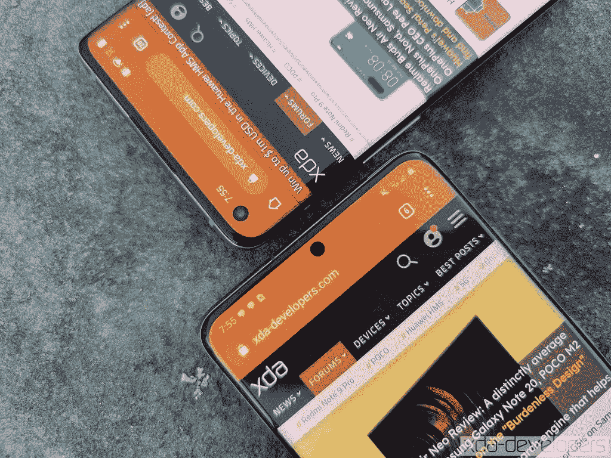
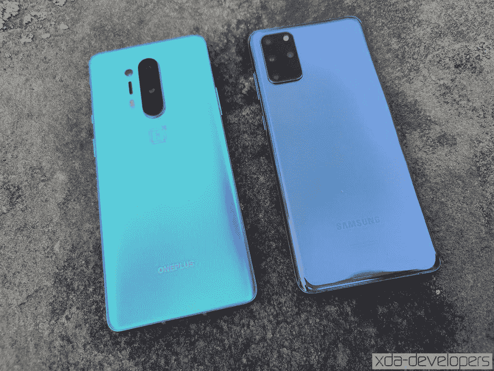
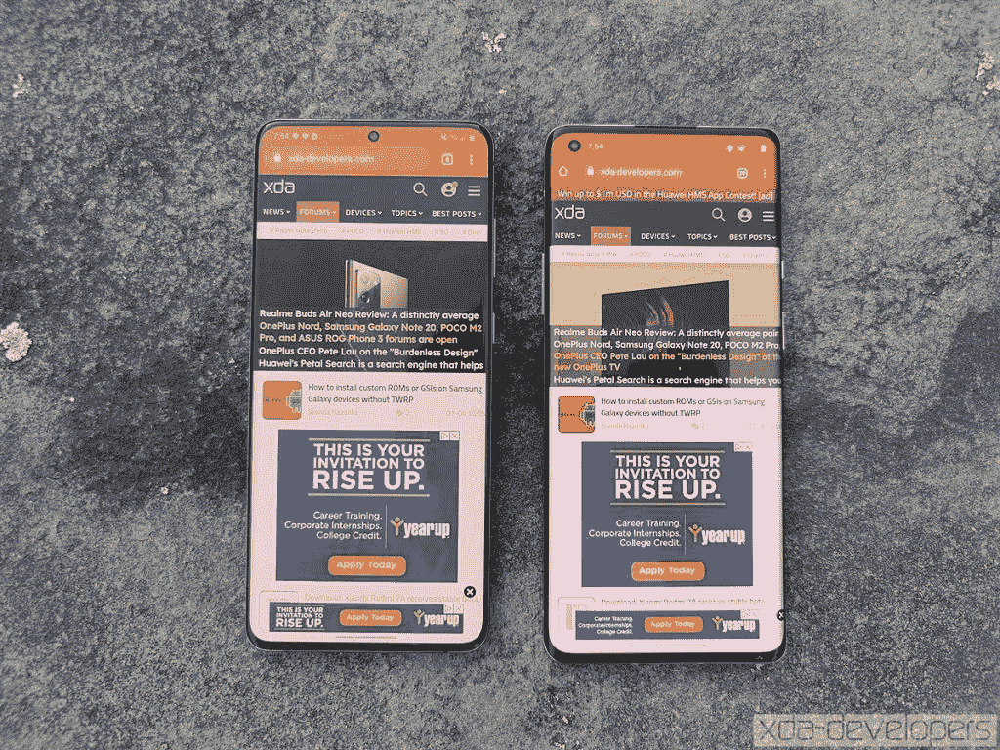
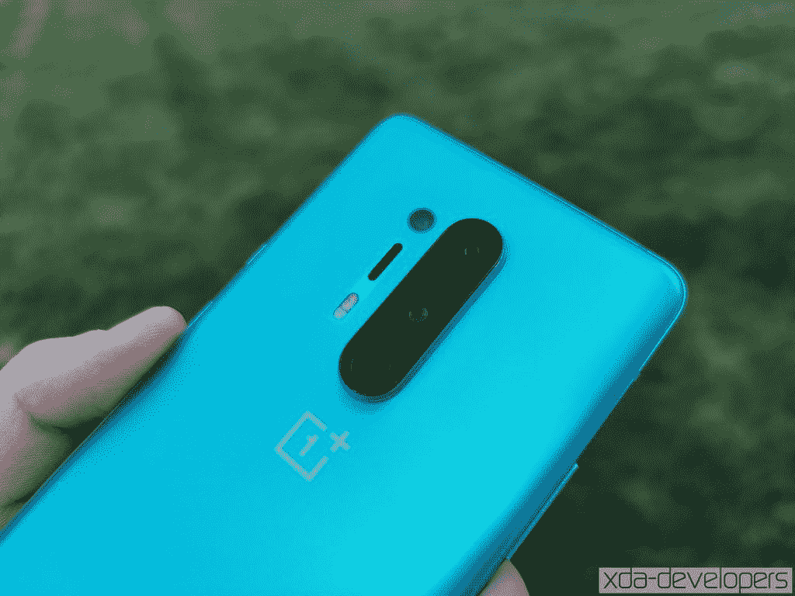
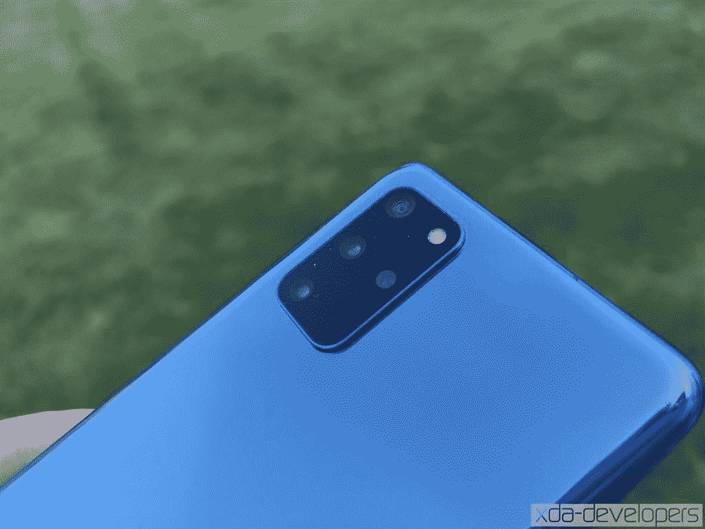

# 一加 8 Pro 与三星 Galaxy S20+回顾-追求平等

> 原文：<https://www.xda-developers.com/oneplus-8-pro-vs-samsung-galaxy-s20-plus-review-comparison/>

自 2011 年以来，三星一直是全球最畅销的安卓智能手机品牌。与此同时，三星还保持着世界顶级安卓智能手机品牌的荣誉。在过去的四年里，华为在上述两项排名中都获得了第二名，向三星发起了严峻的挑战，并开始迅速缩小与三星的差距。然而，美国的贸易禁令意味着，自 2019 年 5 月以来，华为的国际智能手机雄心在很大程度上受到了削弱，使三星处于相对安全的地位。然而，事情会保持那样吗？一加当然有其他想法。“永不定居”——宣告创业品牌(庞然大物步步高电子公司的子公司)成立于 2014 年，它在高端智能手机市场迅速崛起。凭借 2019 年的一加 7 Pro，一加表明他们在大联盟中的竞争是认真的。7 Pro 只是一加试图最终制造一款不妥协的旗舰智能手机的开始，其旗舰定价*值得妥协*。凭借一加 8 Pro，一加试图让世界相信，它终于有了一款可以与包括三星 Galaxy S20+在内的顶级智能手机竞争的智能手机。

理论上，一加 8 Pro 拥有与三星 Galaxy S20+等真正的高端旗舰智能手机竞争的实力。旗舰相机？检查。无线充电？检查。认证防水性？检查。很棒的展示？检查。这里有那里有烦恼，但一加 8 Pro 和三星 Galaxy S20+的规格差距并不大。定价是唯一真正的妥协点。在美国和欧盟等地，一加 8 Pro 的价格比前代产品大幅上涨。然而，在印度，它的起步价为₹54,999(728 美元)，相对来说比较实惠，仅比 OnePlus 7T Pro 高出₹2,000。这使得₹23,000 比 Galaxy S20+便宜，后者现在的价格是₹77,999(1033 美元)。这两款手机的价格差异因地区而异，但在印度，价值主张是一边倒的。

合乎逻辑的问题应该是:有什么问题？即使撇开价格不谈，一加 8 Pro 真的能与三星 Galaxy S20+正面交锋并胜出吗？它比它的竞争对手更有价值吗？让我们在下面的详尽比较中更深入地探讨这些问题。

 <picture></picture> 

Photo credits: Max Weinbach

如果你对我们对三星 Galaxy S20+和一加 8 Pro 的独立评论感兴趣，那么你可以在以下链接中找到它们:

***关于这个对比:**一加印度给我发来了一加 8 Pro(2021 年)的 8GB RAM + 128GB 存储变体供评测，我已经用了手机一个月了。三星 Galaxy S20+单元是印度 4G Exynos 990 8GB RAM + 128GB 存储变体(SM-G985F)，而且是三星送的。到目前为止，我已经用了四个月的 Galaxy S20+。这篇评论中的所有观点都是我自己的。*

### 一加 8 Pro 和三星 Galaxy S20+规格

| 

规格

 | 

一加 8 专业版

 | 

三星 Galaxy S20+

 |
| --- | --- | --- |
| **尺寸&重量** |  |  |
| **颜色、材料、表面处理** |  | 宇宙灰、宇宙黑、云蓝 |
| **显示** |  |  |
| **摄像头(后置)** |  |  |
| **摄像头(前)** | 1600 万像素索尼 IMX471，f/2.45，1.0 米像素，定焦，EIS，1080p@30fps | 10MP，80，f/2.2，4K@60fps 视频 |
| **软件** | 基于 Android 10 的 OxygenOS 10 | 带有一个 UI 2.1 的 Android 10 |
| **片上系统** | 高通骁龙 865 |  |
| **闸板** | 8/12GB LPDDR5 |  |
| **储存** | 128/256 GB UFS 3.0 |  |
| **电池** | 4510 毫安时 | 4500 毫安时 |
| **有线充电** | 30W 翘曲充电 30T (5V/6A)15W USB-C 供电(5V/3A) | 25W 超级快充 |
| **无线充电** | 翘曲充电 30 无线(30W)，10W 齐 EPPReverse 无线充电(3W) | 快速无线充电 2.0 无线电源共享 |
| **IP 等级** | IP68 | IP68 |
| **安全** | 光学欠显示指纹扫描仪基于软件的面部识别 | 超声波欠显示指纹传感器 |
| **端口&按钮** | USB 3.1(第 1 代)Type-C，带视频输出(DisplayPort 备用模式)警报滑块双 nano-SIM 插槽 | 带视频输出(显示端口备用模式)的 USB 3.1 Type-C 混合 nano-SIM 插槽 |
| **音频&振动** | 双立体声扬声器。由杜比 Atmos 调谐的音频。x 轴线性电机 | 立体声扬声器和耳机由 AKGSurround sound 提供声音，采用杜比全景声技术(包括杜比数字、杜比数字增强版)线性触觉引擎 |
| **连通性** |  |  |

**[一加 8 Pro 论坛](https://forum.xda-developers.com/oneplus-8-pro)**| |**|[三星 Galaxy S20+论坛](https://forum.xda-developers.com/galaxy-s20)**

* * *

## 设计

 <picture></picture> 

Photo credits: Max Weinbach

一加 8 Pro 和三星 Galaxy S20+都拥有适合顶级旗舰手机的出色设计。虽然从正面看它们可能相似，但即使在“2020 年旗舰智能手机设计模板”中，我们也可以看到显著的差异。评估设计是主观的，但一加和三星都没有留下多少改进的空间。

**建造质量**

让我们从一加 8 Pro 开始。这款手机的制造质量很好。当然，这是典型的金属和玻璃三明治，但是贴合性和光洁度都非常好。这款手机的金属框架很薄，因为它采用了极具侵略性的曲面显示屏，这确实引发了关于制造质量的问题。除此之外，没有太多其他负面的东西可说。提醒滑动条——任何一加智能手机的最佳设计功能——功能一如既往。电源和音量按钮有很好的反馈。

三星 Galaxy S20+也是如此，它也有一个薄金属框架，尽管它的显示屏不像一加 8 Pro 那样弯曲(它更多地是为了满足毫米波 5G 的残留要求)。Galaxy S20+还拥有精心设计的按钮和无可挑剔的贴合性和光洁度。客观地说，这两款手机我都挑不出毛病。

当我们谈到手机的手感时，差异就更大了。三星 Galaxy S20+仅配备了光滑的玻璃后盖和抛光的光滑金属框架，而一加 8 Pro 的材料取决于其颜色选择。Onyx 黑色配有光滑的玻璃后盖和磨砂喷砂铝金属框架，而其他颜色(分别为冰绿色和群青蓝色)则配有磨砂柔软磨砂玻璃后盖和喷砂磨砂铝框架。我之前已经清楚地表明了我的偏好，但让我重申一下**我更喜欢哑光玻璃表面*到目前为止*** 。哑光涂层不仅使手机在手中感觉更好(因为它接近喷砂铝的冰冷感觉)，而且还完全消除了指纹，这是光滑玻璃手机的一个令人讨厌的问题。磨砂玻璃的手机更滑，但我认为这是一个可以接受的权衡。

一加提供了一个选择，而三星没有。这是一加的胜利，因为磨砂玻璃饰面慢慢变得越来越受欢迎，OPPO、Realme、华为、小米和苹果都在他们的一些手机变种中采用了磨砂玻璃饰面。如果三星未来能在这方面保持领先就好了，因为光滑的玻璃是阻碍三星 Galaxy S20+设计的一个因素。

**展示设计**

两款手机的正面设计都差不多。两款手机都使用打孔的前置摄像头，因为一加已经不再使用机械弹出式摄像头。我们被告知，放弃弹出式摄像头的原因是为了更有效地利用内部空间。这一论点有很大的支持力度，因为一加 8 Pro 比一加 7 Pro 更轻，但电池更大(4，510mAh 对 4，000mAh)，防水性能经过认证(IP68)，甚至显示屏也更大(6.78 英寸 19.8:9 对 6.67 英寸 19.5:9)。

在一加 8 Pro 上，打孔前置摄像头放在显示屏的左上方，这是次优的，因为它会将状态栏图标推到右边。另一方面，三星 Galaxy S20+有一个中心放置的打孔相机，个人认为，它看起来不那么令人分心，也不会影响状态栏图标。三星 Galaxy S20+的另一个优点是，它的打孔摄像头明显小于一加 8 Pro 的打孔摄像头。这不会对可用性产生巨大影响，但会影响可用屏幕的大小，因为一加 8 Pro 的状态栏比三星 Galaxy S20+的状态栏大。

照片来源:马克斯·温巴赫

两款手机的屏幕与机身的比例都是业界领先的。一加 8 Pro 90.8%的屏幕与机身比率略高于三星 Galaxy S20+90.5%的屏幕与机身比率，因为它在略大的机身中安装了更大的显示屏。然而，我们只是在这里吹毛求疵。在过去的三年里，智能手机的正面设计已经取得了很大的进步，因为每一代新设备的边框都在不断缩小，而**这两款旗舰产品在这方面都处于卓越的前沿**。

**车尾设计**

这两款智能手机的后置设计完全不同。一加 8 Pro 采用了一加标志性的垂直堆叠三摄像头设计，而长焦摄像头则放置在堆叠摄像头的左侧。在长焦相机下面，你会发现自动对焦模块和 LED 闪光灯。另一方面，Galaxy S20+使用了三星 2020 年智能手机的设计模板，配备了左上角的矩形摄像头外壳，其中包含三个摄像头，一个 ToF 传感器和 LED 闪光灯。摄像机在围栏内的位置明显不对称，但这没什么大不了的。就美学而言，我不得不**在这里向一加点头**，因为垂直相机设置更对称，看起来更好。这是主观评价，所以这里用户的看法会有所不同。

客观来说，不能否认的一点是，一加 8 Pro 的摄像头凸起比较厚，而三星 Galaxy S20+的摄像头凸起要薄很多。一加不可能做太多来解决这个问题，因为手机的 48MP 主摄像头有一个相对巨大的 1/1.44”传感器，超广角摄像头也有一个大的 1/1.7”传感器。三星 Galaxy S20+的 12MP 主摄像头和 64MP 辅助摄像头也有 1/1.7 英寸的传感器，但 1/1.44 英寸大于 1/1.7 英寸，这解释了更薄的摄像头凸起。两款设备**的**摄像头凸起**在耐用性方面不是大多数用户应该担心的事情**，尽管这确实意味着两款手机在平坦的表面上会摇晃。

**颜色选项**

决定审美的最后一个因素是色彩。三星 Galaxy S20+有严肃的颜色，如宇宙灰、云蓝和宇宙黑，而一加 8 Pro 有更多的颜色，因为它有缟玛瑙黑、冰川绿和群青。如果你想要一部设计不出众的手机，你会喜欢一加 8 Pro 的缟玛瑙黑色以及三星 Galaxy S20+的灰色和黑色饰面。然而，如果你想要一部在美学上出众的手机，毫无疑问，一加在这方面领先于三星。一加 8 Pro 的哑光冰绿和群青表面看起来非常出色，尽管令人遗憾的是，群青颜色仅限于该设备的高端 12GB RAM + 256GB 存储版本。我有一加 8 Pro 的冰川绿版本供审查，就美学而言，它轻松击败了我的三星 Galaxy S20+单元的宇宙灰颜色。同样，用户的意见可能会有所不同，但值得记住三星在 Galaxy S10 系列上的棱镜颜色。它们会给一加的努力带来更严重的竞争，但不幸的是，三星 Galaxy S20 系列没有提供这些功能。

**手感**

一加 8 Pro 和三星 Galaxy S20+都使用了圆角曲线来增强手感。可以肯定的是，它们都是大尺寸手机，你可能会认为它们的手感都差不多。然而，事实并非如此。一加 8 Pro 比三星 Galaxy S20+略厚、略重。手感令人惊讶地不同，因为**一加 8 Pro 在手中感觉更致密**——两者之间的重量差异(199 克对 186 克)感觉比实际更高。三星 Galaxy S20+比一加 8 Pro 薄 0.7 毫米，短 3.4 毫米。同样，这些都是微不足道的差异，必须指出的是，尽管一加 8 Pro 的显示屏更大(6.78 英寸 19.8:9 对 6.7 英寸 20:9)，但三星 Galaxy S20+的手感要舒适得多。对于这样一款具有巨大显示屏长度的大手机，一加 8 Pro 仍然具有出色的人体工程学特性，因为其温和的圆角有助于手感。这两款手机在这里都做得很好，但**三星 Galaxy S20+的人体工程学领先一步**。

**耐用性**

一加 8 Pro 和三星 Galaxy S20+ **都具有 IP68 防水防尘等级**，一加 8 Pro 是[第一款具有此 IP 等级](https://www.xda-developers.com/oneplus-8-pro-specifications-features-pricing-availability/)的一加旗舰产品。在硬件功能方面，值得注意的是，**一加 8 Pro 缺少用于可扩展存储的 microSD 卡插槽**，而**三星 Galaxy S20+的国际版本具有混合 SIM 卡插槽**，可以集成两个 nano-SIM 或 nano-SIM 加 microSD 卡。

**包装盒内是什么**

让我们来谈谈包装和包装盒内的东西。一加 8 Pro 配有一加专有的 **[30W Warp Charge 30T](https://www.xda-developers.com/oneplus-7t-warp-charge-30t/) 充电器**，一根 USB 3.1 Type-C 转 Type-A 线缆，以及一个透明的光滑塑料外壳。另一方面，三星 Galaxy S20+配备了一个带 PPS 和 PDO 的 **25W USB Type-C PD 3.0 充电器**，一根 USB Type-C 到 Type-C 电缆，一个透明的光滑塑料外壳，以及 AKG 调谐的 USB Type-C 耳机。两款手机都没有配备 3.5 毫米转 USB Type-C 音频适配器。我质疑一加不捆绑适配器*和*有线耳机的理由，因为这意味着没有蓝牙耳机或 USB Type-C 耳机的设备购买者没有直接的方法来实际收听有线或无线音频，而不进行另一次购买。至少**三星在 Galaxy S20+盒子里捆绑了 USB Type-C 耳机**。捆绑一个对三星和一加的大部分消费者都有用的适配器会对这两家公司造成很大伤害吗？不。在三星的情况下，它也可以很好地看到一个 USB Type-C 到 Type-A 电缆捆绑在盒子里。

**结论**

总的来说，我认为**一加 8 Pro 的设计比**三星 Galaxy S20+略胜一筹。这是因为可选的哑光玻璃表面，与传统的光滑表面相比，它在手感上有着惊人的差异。三星 Galaxy S20+确实有一些明显的优点，如居中和更小的打孔相机切口，更薄的相机凸起，更好的人体工程学，但一加 8 Pro 有更好的颜色选择，可以满足更广泛的消费者需求。两款手机都展示了卓越的设计，非常贴合和完美，但都选择跳过全屏显示设计——这是 2019 年的流行趋势，在 2020 年基本上已经被抛弃。

虽然这意味着一加 8 Pro 在拥有真正的全屏显示方面是一加 7 Pro/7T Pro 的一种有争议的回归，但机械弹出式摄像头的妥协被设备供应商认为太多了。真正的解决方案是显示屏下方的前置摄像头，我们正在等待这方面的硬件进展，看看采用该技术的商业手机是否会在 2021 年实现。另一方面，三星 Galaxy S20+是对其前身 Galaxy S10+的设计升级，除了那些想要更令人兴奋的颜色选择的人之外，几乎在每个方面都是如此。

* * *

## 显示

**规格**

一加 8 Pro 拥有 6.78 英寸的四核 HD+ (3168x1440) AMOLED 显示屏，长宽比为 19.8:9，PPI 为 513。该显示器支持 120Hz 高刷新率(HFR ),开箱即可使用。默认的库存显示器配置是 120Hz 刷新率下的全高清+分辨率，但显示器也可以设置为 120Hz 刷新率下的**四高清+分辨率**。最后一个选项是将其设置为全高清+分辨率，刷新率为 60Hz，以最大限度地延长电池寿命。120Hz 的 Quad HD+是一种硬件特性，通过双 MIPI 命令接口实现，为显示器提供足够的带宽来驱动 120Hz 的高分辨率。

一加 8 Pro 的显示屏也有许多特殊功能。它带有**舒适音调**，这是一加对苹果真实音调特征的继承。它使用 RGB 传感器根据环境照明来改变显示器的色温。显示器有 **SDR 到 HDR 的上映射**，自动将 SDR 内容转换成 HDR。一加还包括了一个 **MotionEngine** 功能，为一加 8 Pro 上的 MEMC(运动估计/运动补偿)提供动力，该功能可以插值帧来提高视频的帧率(视频可以从 24 或 30fps 提高到 60 或 120fps)。显示器的校准由 [Pixelworks 的校准和色彩管理软件](https://www.xda-developers.com/pixelworks-iris-5-visual-processor-android-display-experience-oppo-find-x2/)完成，该软件在高通骁龙 865 的显示处理单元上运行。最后，显示器支持 **DC 调光 2.0** 作为默认 PWM(脉宽调制)亮度控制的替代方案。值得一提的是，一加表示，这款显示器的亮度可以达到 1300 尼特(我们将在下面研究这一说法)，并有 4096 级亮度调节。该显示器具有**亮度平滑**功能，用于微调亮度过渡——这在现实使用中是显而易见的。

总而言之，一加对一加 8 Pro 的显示屏感到自豪，并表示它创下了色彩准确度的行业纪录。

另一方面，三星 Galaxy S20+的显示器应该会受益于三星在构建顶级移动显示器方面的经验，但三星是否在这方面停滞不前仍有争议。动态 AMOLED 显示屏尺寸为 6.7 英寸，具有 Quad HD+ (3200x1440)分辨率，具有更高、更窄的 20:9 纵横比和 523 PPI。支持 120Hz 刷新率，但**仅在全高清+分辨率下**。与一加不同，该显示器开箱即用，具有全高清+分辨率和标准的 60Hz 刷新率。之所以没有在 Quad HD+分辨率下启用 120Hz 刷新率的选项，与硬件有关。三星 Galaxy S20+的显示屏只有一个 MIPI 命令接口，这意味着它缺乏必要的带宽来驱动 120Hz 的 QHD+。一加 8 Pro 和 OPPO Find X2 Pro 是迄今为止唯一拥有支持 120hz QHD+所需硬件的智能手机。

三星 Galaxy S20+的额定最大亮度为 1200 尼特，但这种说法再次误导了我们，我们将在下面看到。该显示器具有一种硬件特性，可以减少有害范围内的蓝光量，以减轻眼睛疲劳，这是三星 Galaxy S10 延续的一种功能。三星 Galaxy S20+的显示屏缺乏舒适色调、SDR 到 HDR 的上转换、DC 调光、亮度平滑和 MEMC 等功能(诚然，最后一个功能有点像噱头)。**在便捷的显示功能方面，很难否认一加在这里击败了**。

这两款手机都在显示屏上安装了工厂应用的塑料屏幕保护器，但它们可以很容易地拆除。两款显示器均支持 HDR10+。

**分辨率和刷新率**

在显示质量方面，我们先从分辨率和刷新率说起。一加 8 Pro 的显示屏有一个明显的优势，因为它的 120Hz 刷新率实际上可以用于 QHD+分辨率，而三星 Galaxy S20+仍然不可能实现这一点。由于子像素着色和文本着色的重大改进，QHD+和 FHD+之间的差别现在已经很小了；两种显示器都有一个五边形矩阵，但这已经无关紧要了。然而，差异*是*仍然可见——在如此高的显示对角线上，QHD+看起来确实比 FHD+更清晰。虽然它不是开箱即用的，但在 QHD+上使用 120Hz 在一加 8 Pro 上简直是一种享受。你可以获得非常清晰的文字和流畅的动作，而三星 Galaxy S20+可以让你在两者之间进行选择。

两款手机都不允许你在 UI 中将显示器设置为 90Hz/96Hz 刷新率(一加 8 Pro 的面板是否支持 90Hz 还不知道，而[你可以使用 ADB 将 Galaxy S20 的显示器设置为 96Hz](https://www.xda-developers.com/samsung-galaxy-s20-hidden-96hz-display-mode/) )。例如，60 赫兹和 120 赫兹之间的跳跃是不和谐的，很容易察觉，但 120 赫兹仅比一加 7 Pro 上看到的 90 赫兹略有改善。在默认的 FHD+分辨率下，一加 8 Pro 的文本渲染也比三星 Galaxy S20+略清晰。这就是为什么很容易**宣布一加在这方面胜出**。三星错过了一个机会，因为 Galaxy S20+的显示屏上没有双 MIPI 命令界面。

**亮度**

转到亮度，事情变得棘手了。当在室内使用手动亮度时，我们发现一加 8 Pro 的显示屏比 Galaxy S20+的显示屏亮得多。这是因为三星保守地将 Galaxy S20+的手动最大亮度限制在 350 尼特左右，而一加 8 Pro 通过手动将亮度滑块设置为最大水平可以达到约 500 尼特。亮度的差异对实际可用性没有太大影响，因为室内智能手机使用需要大约 200-250 尼特的亮度，而不是 350-400+。

相反，一加 8 Pro 的显示屏不能在弱光下变得像三星 Galaxy S20+的显示屏一样暗淡。[在最近的更新](https://www.xda-developers.com/oneplus-8-pro-oxygenos-10-5-7-8-april-2020-security-patch-display-camera-system-optimizations/)中，一加限制了显示器的最低亮度，以“修复”低亮度水平下出现的绿色着色和黑色剪裁问题。这个*和*有区别，特别是如果你在晚上使用手机，并且**处于最低亮度水平**。**三星 Galaxy S20+的显示器在这里要好得多，因为它通过尽可能降低显示器亮度来减少眼睛疲劳**，而一加 8 Pro 在其当前显示器校准中更高的最低亮度水平使其从一加 7 Pro 的最低亮度水平回归。我建议一加重新考虑它在这里的决定，因为分歧是显而易见的。

然后我们有高亮度模式(HBM)。HBM 允许一加 8 Pro“达到 1300 尼特”，而 Galaxy S20+可以达到 1200 尼特。问题是，虽然这两个数字在技术上是正确的，但用户永远不会在现实世界中体验到它们。这是因为 1300 尼特和 1200 尼特的数字只能在非常低的平均图像级别(APLs)下实现，此时显示器显示的背景接近黑色，没有白色。( [APL 是有机发光二极管显示器亮度的决定因素](https://www.xda-developers.com/smartphone-display-terminology-explained/))。在正常的 APL 下，例如 75-90% APL，不可能达到额定亮度数值，用户将达到的最大值是 800-900 尼特(对于日光可见度而言，这仍然是极好的)。根据[*【GSMArena】*](https://www.gsmarena.com/samsung_galaxy_s20_ultra_5g-review-2074p3.php#review-body:~:text=Anyway%2C%20the%20Galaxy%20S20%20Ultra's%20display,pushing%20894nits%20in%20Adaptive%20brightness%20mode)[*Anand tech*](https://www.anandtech.com/show/15603/the-samsung-galaxy-s20-s20-ultra-exynos-snapdragon-review-megalomania-devices/10#twitter-widget-0:~:text=The%20panel%20goes%20up%20to%20325,auto%20brightness%20and%20high%20ambient%20light.)进行的测试，在 75% APL 下，三星 Galaxy S20 系列在现实世界中可以获得高达 800-900 尼特的亮度，而在 100% APL 下，三星 Galaxy S20 Ultra 可以达到 731 尼特。GSMArena 对一加 8 Pro 的显示屏进行了测试，在 75% APL 下高达 888 尼特。我们团队的 Dylan 在他的[一加 8 Pro 显示器分析](https://www.xda-developers.com/oneplus-8-pro-display-analysis-premium-hardware-at-a-cost/)中阐述得更加清晰。

在使用 HBM 的**最大自动亮度方面，一加 8 Pro 和三星 Galaxy S20+势均力敌**。几天前的一个下午，我在孟买把两部手机都拿到外面呆了一个小时，证实了这一点。我的三星 Galaxy S20+设备的显示亮度与我的一加 8 Pro 设备的显示亮度大致相同，但区别在于以 HBM 为单位的校准。当 HBM 被激活时，Samsung 会切换到特殊的校准模式，该模式具有更低的显示伽玛、更高的对比度和更饱和的颜色(鲜艳的颜色模式会自动启用)。

虽然这意味着颜色准确性受到不利影响，但它对直射阳光下的易读性有积极影响。另一方面，一加 8 Pro 的显示器没有在 HBM 中进行这些校准变化，而是选择忠实地坚持色彩准确性。这意味着在阳光直射下，三星 Galaxy S20+显示屏可能比一加 8 Pro 显示屏更清晰，即使两款手机的最大亮度相似。是否以颜色不准确为代价偏好更好的阳光易读性，取决于用户的喜好。就个人而言，我更喜欢前者，但值得一提的是，一加 8 Pro 的显示屏并不懒散，即使在阳光直射下也是如此。两个显示器上的内容仍然很容易看到，提醒用户这些旗舰有机发光二极管显示器已经前进了多远。

总的来说，很难宣布这两种显示器在亮度方面的赢家，但我仍然**给三星 Galaxy S20+一点优势**，这要归功于更低的最低亮度水平和更好的阳光清晰度。

 <picture></picture> 

Photo credits: Max Weinbach

**对比度、色彩准确度和能效**

由于有机发光二极管显示屏的特性，这两款手机显示屏的对比度理论上是无限的。这两种显示器通常都具有出色的视角，角度变化时的角度色彩偏移最小。然而，一加 8 Pro 激进的弯曲显示屏导致了一个问题。显示器的弯曲边缘呈现绿色(很可能是因为偏振镜),即使正面也是如此。这不是一加 7 Pro 的问题，因为它的曲线更温和更宽，尽管这种方法导致了更大的屏幕资产损失。**三星 Galaxy S20+根本没有这个问题，因为它的显示屏曲率比一加 8 Pro 的曲率要小得多**，所以我们不会看到任何内容失真或边缘绿色。

一加 8 Pro 显示屏边缘的绿色让我想起了弯曲的三星 Galaxy S7 Edge 显示屏。看到一加遇到这样的问题令人惊讶，因为这意味着显示器的视角受到了负面影响，尽管视角如此之好。在我看来，如果一加未来的旗舰产品能够回到完全平板显示，那就更好了。如果该公司*不得不*坚持使用曲面显示器，三星 Galaxy S20+的做法就明智得多。

就色彩准确度而言，两款显示器都非常出色...但是两者都有误差，一个大于另一个。一加 8 Pro 的显示屏据说在 sRGB 和 DCI-P3 色域方面具有破纪录的色彩准确度(两款手机都支持上述色域的自动色彩管理)。对于正确校准单元的子集，可能是这种情况。然而，**有一个子集的一加 8 专业单位有错误校准红色**，这也影响了洋红色和橙色的阴影。我的复习单元有这个问题，在迪伦的单元也很明显。其他一些出版物也看到了错误的校准。虽然误差本身没有大到在客观色彩准确度测试中导致可怕的结果，但它确实意味着这些错误校准的单元不具有“行业领先的色彩准确度”。这些错误校准的一加 8 专业显示器上的红色过饱和。当然，这与质量控制有关，三星 Galaxy S20+的一些单元也可能存在校准误差(这是供应商不像苹果那样逐个校准面板时发生的事情)。不过，我的三星 Galaxy S20+设备在饱和度精度方面没有什么大问题。

**两种显示器校准的一个主要缺陷是色温**。白色平均在 6100K-6200K，太暖了(理想色温应该是 6504K)。一加和三星的旗舰手机已经有好几代都是这种情况，而且看起来似乎不会很快得到解决。暖色温度只会影响自然校准模式，而不会影响一加 8 Pro 和三星 Galaxy S20+的鲜艳颜色模式，后者具有冷(> 7000K)色温，可以根据用户的需要进行调整。

在黑色剪裁方面，三星在这方面取得了一些进展，因为 Galaxy S20+的显示屏与其前辈相比，可以区分更多的黑色阴影。然而，苹果 iPhone 11 Pro 在这方面仍然领先。根据一些出版物，在一加 8 Pro 推出时，一加在这方面有所退步。在安装了 [OxygenOS 10.5.10 更新](https://www.xda-developers.com/oneplus-8-8-pro-oxygenos-update-camera-system-network/)之后，尽管一加 8 Pro 的显示屏的黑色剪裁与我在三星 Galaxy S20+上看到的大致相当，这意味着它足够好。

评估显示器时要考虑的最后一个方面是能效。由于诸如 90Hz 和 120Hz 显示器之类的高刷新率显示器已经上市，这些 HFR 电话的显示能力已经在数字上大幅提高。这两种显示器都缺乏可变刷新率(VRR)的真正实现。不幸的是，目前三星 Galaxy S20+的 120Hz 模式一直在 120Hz 运行，尽管一加 8 Pro 具有自适应刷新率实现，但它实际上不是 VRR 的真正实现，因为它只是在 60Hz 和 120Hz 之间切换刷新率，而真正的 VRR 是以每帧为基础工作的。

这意味着**它们的两种 120Hz 模式都伴随着巨大的功耗**。当我们考虑到 [Exynos 990 SoC](https://www.xda-developers.com/samsung-exynos-990-5g-modem-5123-7nm/) 的低能效时，这对于三星 Galaxy S20+来说是双重担忧。智能手机上的 VRR 不能来得太快，因为真正的 VRR 实现将带来大量的电力节省。据 *AnandTech* 报道，一加 8 Pro 的面板效率略低于三星 Galaxy S20+。就最终用户的电池寿命而言，[高通骁龙 865](https://www.xda-developers.com/qualcomm-snapdragon-865-processor-specifications-features/) 相比 Exynos 990 更高的能效抵消了这一事实。他们俩还有很长的路要走。

**结论**

总的来说，当整体分析这两款显示器时，我会说**一加 8 Pro 的显示器更好。尽管我的单位错误地校准了红色，但显示器在 120Hz + QHD+组合中具有显著的优势，这是三星 Galaxy S20+根本无法做到的。一加 8 Pro 的显示屏也有更多方便的功能，即使在 QHD+分辨率下为 120 赫兹，其功耗也不比三星 Galaxy S20+在全高清+模式下的 120 赫兹高多少。一加 8 Pro 的阳光清晰度略差，弯曲边缘采用绿色着色，但在其他所有方面，它与 Galaxy S20+的显示屏一样好，甚至更好。三星 Galaxy S20+已经很接近了，但没有配备双 MIPI 面板是三星犯下的硬件错误，现在无法纠正。**

* * *

## 表演

一加 8 Pro 由高通骁龙 865 SoC 驱动，适用于所有市场，而三星 Galaxy S20+的 SoC 选择因地区而异。在美国/加拿大/拉丁美洲/韩国/中国/香港/日本，该手机采用高通骁龙 865，但在所有其他国际市场，它采用三星系统 LSI 的 Exynos 990 SoCs。我在这里测试的三星 Galaxy S20+设备是印度 4G 版本(SM-G985F)，但除了拥有 5G 射频系统这一关键部分之外，它在各个方面都与国际 5G Exynos 版本相同，这是 4G 版本所缺少的。不过，结果是，4G 版本的成本更低。另一方面，一加 8 Pro 为所有变体提供 5G 支持。印度的版本只有一个 5G 频段，但这无关紧要，因为印度目前没有 5G 网络。

在这里，我不打算深入探讨高通骁龙 865 和 Exynos 990。[我们之前对](https://www.xda-developers.com/qualcomm-snapdragon-865-benchmarks-cpu-gpu-performance-vs-kirin-990-snapdragon-855-snapdragon-845/)高通骁龙 865 进行了广泛的基准测试，[分析了它的 AI 性能改进](https://www.xda-developers.com/qualcomm-snapdragon-865-ai-performance-machine-learning-analysis/)，并在手机中进行了测试，如[三星 Galaxy S20 Ultra](https://www.xda-developers.com/samsung-galaxy-s20-ultra-review/) 、[小米 Mi 10](https://www.xda-developers.com/xiaomi-mi-10-review/) 、[小米 Mi 10 Pro](https://www.xda-developers.com/xiaomi-mi-10-pro-review/) 、 [Realme X50 Pro](https://www.xda-developers.com/realme-x50-pro-5g-review/) 、 [LG V60 ThinQ](https://www.xda-developers.com/lg-v60-thinq-dual-screen-review/) 以及[一加 8 Pro 本身](https://www.xda-developers.com/oneplus-8-pro-review-never-settle-on-hardware/)。所以没有什么可补充:这是一个伟大的足球。在传闻中的[骁龙 865+](https://www.xda-developers.com/asus-rog-phone-3-specs-6000mah-battery-overclocked-snapdragon-865-16gb-ram-no-headphone-jack/) 和传闻中的 [Exynos 992](https://www.xda-developers.com/samsung-exynos-992-5nm-chip-galaxy-note-20-arm-new-cpu-gpu/) 到来之前，这是目前旗舰 Android 智能手机的最佳 SoC。

至于 Exynos 990，我在我的[三星 Galaxy S20+评测中已经对它做了深入的性能概述和对比。](https://www.xda-developers.com/samsung-galaxy-s20-plus-review/)我的结论是，它确实比 Exynos 9820 有所改进，但与高通骁龙 865 相比，它并没有带来任何新的东西。与高通骁龙 865 的 ARM Cortex-A77 内核相比，Exynos M5 大内核的能效为 100%，即使是 A76 与 A77 中间内核的比较也有利于高通。在 GPU 性能方面，高通骁龙 865 中的 Adreno 650 GPU 无疑比 Exynos 990 的 Mali-G77MP11 GPU 更快、更高效。

这意味着一加 8 Pro 与竞争对手 Exynos 990 驱动的三星 Galaxy S20+相比，预计将具有性能优势。让我们看看手机如何在一些最广泛使用的基准中处理自己。

#### PCMark Work 2.0

在 [PCMark Work 2.0](https://play.google.com/store/apps/details?id=com.futuremark.pcmark.android.benchmark) 中，三星 Galaxy S20+可以分为四种配置。我在这里以 120Hz 的刷新率运行优化的电源模式，尽管手机出厂时就启用了 60Hz 的刷新率模式。60Hz 模式可预测地给出了较低的总分数，而高性能模式提高了分数。大多数发烧友用户最好坚持 120Hz 刷新率的优化模式，这是我在这里测试的。另一方面，一加 8 Pro 是在默认的 FHD+分辨率和 120Hz 模式下测试的。

至少可以说，结果令人惊讶。在 120 赫兹，三星 Galaxy S20+的分数略高于一加 8 Pro，尽管 SoC 处于劣势。PCMark 是一个真实世界的基准测试，模拟常见的任务，如网页浏览、写作、照片编辑等，这就是为什么它更多地由软件因素而不是纯硬件因素决定。个人得分分布势均力敌，虽然一加 8 Pro 在重要的写作 2.0 测试中得分较高，但三星 Galaxy S20+在网络浏览 2.0 测试中领先。一加 8 Pro 在照片编辑 2.0 和数据操作测试中得分较高，而三星 Galaxy S20+在过时的视频编辑测试中得分较高。尽管如此，两款手机的得分都在误差范围内，并且都在旗舰 Android 智能手机的前 1%中。

#### 速度计 2.0

[速度计 2.0](https://browserbench.org/Speedometer2.0/) 是一个可以在任何操作系统上运行的 Web 基准测试。它高度依赖于良好的 JavaScript 引擎和单线程 CPU 性能。ARM Cortex-A77 比 Exynos M5 更快，同时也更高效，所以在这里看到一加 8 Pro 胜过 Exynos 三星 Galaxy S20+并不奇怪。三星 Galaxy S20+的得分与华为 Mate 20 Pro 等老一代手机相当，这令人失望。然而在现实世界中，这些差异都是细枝末节，因为用户不会注意到网络浏览性能的任何差异。

#### 极客工作台 5

[Geekbench 5](https://play.google.com/store/apps/details?id=com.primatelabs.geekbench5) 是业界推崇的合成 CPU 性能基准。一加 8 Pro 和三星 Galaxy S20+ (Exynos)在单核方面的得分几乎持平，而一加 8 Pro 在多核方面的得分明显更高。请记住，Geekbench 传统上一直是三星广泛定制的 Exynos M CPUs 的良好展示平台，而 SPEC 和 web 基准测试则提供了更准确和实际的图片。因此，看到高通骁龙 865 在单核方面与 Exynos 990 不相上下，对三星来说更令人失望，**证实了该公司的决定[放弃其定制核心项目](https://www.xda-developers.com/samsung-austin-details-unreleased-exynos-m6-cpu-microarchitecture/)** 并采用 ARM 的库存 CPU 核心。

#### CPU 节流测试

[CPU 节流测试](https://play.google.com/store/apps/details?id=skynet.cputhrottlingtest)是一个简单的基准测试，随着时间的推移测试 CPU 性能。令人惊讶的是，三星 Galaxy S20+在这里做得更好，因为在 15 分钟的基准测试后，它的 CPU 被节流到其最大性能的 85%，而一加 8 Pro 的 CPU 被节流到其最大性能的 79%。然而，应该注意的是，一加 8 Pro 的 CPU 具有更高的基准性能水平，所以再次，我们在这里吹毛求疵。两款手机的热量都很好，保持了为这些手机供电的旗舰 SOC 的耗电特性，但有趣的是，一加 8 Pro 的热量确实比三星 Galaxy S20+少一点。

#### 安卓长凳

Android bench 仍然是在 Android 上测试 NAND(存储)性能的首选解决方案，尽管它的 UI 设计已经有几年的历史了。存储性能结果显示，三星 Galaxy S20+的 NAND 性能略快于一加 8 Pro，尽管两者都使用 UFS 3.0 存储规范。如果我们吹毛求疵，唯一相对显著的差异是随机写入速度，三星 Galaxy S20+的得分明显高于一加 8 Pro。这些差异在现实世界中会明显吗？你猜对了:答案是**不会，至少在很长一段时间内不会**。

#### 3DMark 吊索镜头极限

转到 GPU 性能，我们首先转向 [3DMark](https://play.google.com/store/apps/details?id=com.futuremark.dmandroid.application) 。在 Sling Shot Extreme 中，一加 8 Pro 在 OpenGL ES 3.1 和 Vulkan 两个方面都优于 Exynos 三星 Galaxy S20+。它唯一得分稍高的地方是 OpenGL ES 3.1 中的图形得分，足够令人惊讶。Vulkan 的分数显示了两款手机之间的差距，因为一加 8 Pro 的分数要高得多，这突显了 Adreno 650 GPU 的优越性。物理分数测试 CPU 性能，在这方面，一加 8 Pro 也能够如预期的那样领先。

#### GFXBench

在 [GFXBench](https://play.google.com/store/apps/details?id=com.glbenchmark.glbenchmark27) 中，三星 Galaxy S20+在几乎所有测试中都优于一加 8 Pro。绝对帧速率的差异是显著的，当结合 Mali-G77 GPU 的较低效率和性能功耗比时，很明显**一加 8 Pro 再次更胜一筹**。三星 Galaxy S20+也在这里展示了非常差的 GPU 热节流。考虑一下 T-Rex 基准测试的结果:三星 Galaxy S20+的屏幕外测试结果为 103 fps，几乎是一加 8 Pro 的 201 fps 分数的一半(请记住，所有测试都是在同一时间进行的，这使得节流发挥了作用)。三星 Galaxy S20+在 T-Rex 屏幕外的冷运行中通常得分为 170 fps，这意味着热节流在这里相当严重。另一方面，配备高通骁龙 865 的一加 8 Pro 表现令人钦佩。

### 用户界面性能

一加 8 Pro 和三星 Galaxy S20+的 UI 性能不相上下。**由于 OxygenOS** 的加速动画和一般的速度感，一加 8 Pro 稍微更快更流畅，这是一加一直努力的领域。然而，三星 Galaxy S20+在这方面并不逊色，至少在 120Hz 模式下是如此。比较股票与股票刷新率，默认 120Hz 模式下的一加 8 Pro 自然能够在平滑度上大幅领先于三星 Galaxy S20+的默认 60Hz 模式。对于大多数用户来说，60Hz 和 120Hz 之间的差异很容易察觉，这是一个很大的进步。因此，大多数用户应该将 Galaxy S20+的显示刷新率改为 120Hz，除非电池寿命是更重要的因素。

> #### 因此，一加 8 Pro 是我们测试过的最快、最流畅的手机。

在现实世界中，三星 Galaxy S20+ (Exynos)紧随其后，在大多数情况下，可以跟上。即使是吹毛求疵的人也很难辨别其中的区别。然而，仍然有两部手机出错的地方。一次更新谷歌 Play 商店上的所有应用程序将导致两台设备上惊人的帧丢失量。当许多标签页打开时，谷歌浏览器偶尔会在两部手机上冻结，这是一加手机上的一个已知问题。三星 Galaxy S20+在加热到一定程度时会将刷新率降至 60Hz，这使得 UI 交互不和谐。一加 8 Pro 没有遇到这个问题，但我确实在通知菜单中遇到过几次丢帧——很可能是软件未经打磨的结果。

### RAM 管理和解锁速度

RAM 管理是一个不同的故事。(注意:我在这里测试了两款手机的 8GB 内存版本，12GB 内存版本可能会提供更好的体验。然而，三星 Galaxy S20+在印度只有 8GB RAM 版本。)**一加仍然没有修复[其侵略性的应用查杀问题](https://dontkillmyapp.com/oneplus)** ，这就是为什么后台应用在一加 8 Pro 上比在三星 Galaxy S20+上被查杀的几率更高。不过，Galaxy S20+的内存管理并不完美——Android 仍然需要大幅改进。然而，它明显比一加 8 专业版要好。这是一加迫切需要改进的一个领域。如果他们不能在后台保持 Chrome 浏览会话超过一两天，那么在手机中配备 8GB/12GB 内存是一个坏主意。

当我们讨论解锁速度时，曲折仍在继续。在这里，这是没有争议的:一加 8 Pro 的显示屏下指纹传感器比三星 Galaxy S20+好得多。由 Goodix 提供的光学传感器比 Galaxy S20+的高通来源的超声波欠显示指纹传感器( [3D 声波传感器](https://www.xda-developers.com/qualcomm-snapdragon-865-snapdragon-765-5g-3d-sonic-max-snapdragon-tech-summit/))更快、更可靠。三星是唯一使用这些超声波传感器的厂商，意义不大。当它工作时，超声波传感器仅比光学传感器稍慢，但可靠性仍然是一个重要问题。传感器的缺点大于优点。

总的来说，由于更好的解锁体验和略好的用户界面性能，**一加 8 Pro 是我在现实世界中的选择**。三星 Galaxy S20+紧随其后，但它令人失望的是超声波指纹传感器的不可靠性和一些小的散热问题，使手机回到 60Hz。

* * *

## 照相机

### 摄像机规格

**一加 8 Pro**

一加 8 Pro 有一个 48MP 主广角摄像头，配有索尼 IMX689 传感器(这是一个 1/1.44 英寸的传感器)，1.12 m 像素大小，f/1.8 光圈，25 毫米等效焦距，全像素全方向相位检测自动对焦(PDAF)，激光自动对焦和光学图像稳定(OIS)。这是一个四拜耳传感器，默认情况下，它以 12MP 拍摄 4 合 1 像素装箱照片，像素大小相当于 2.24 m。IMX689 传感器也可以在 OPPO Find X2 Pro 上找到。全像素全向 PDAF(采用[索尼的 2x2 片上镜头解决方案](https://www.xda-developers.com/oppo-find-x2-snapdragon-865-sony-image-sensor/))是 IMX689 独有的。2x2 片上透镜解决方案是一个四像素(Quad Bayer)系统，每个像素一个聚光透镜，覆盖四个光电二极管。像双像素 PDAF 一样，自动对焦系统使用 100%的传感器像素进行对焦和成像。全像素全向 PDAF 比常规 PDAF 更快，它也应该有助于在弱光聚焦。

一加 8 Pro 上的超广角摄像头具有 48MP 索尼 IMX586 Quad Bayer 传感器(1/2”)，0.8 m 像素大小，f/2.0 光圈，14mm 等效焦距，116°视野和 PDAF。它具有超级微距模式的自动对焦功能，默认情况下，它可以拍摄 1200 万像素的 4 合 1 像素组合照片，像素大小相当于 1.6 米。

长焦相机拍摄 800 万张照片。然而，该传感器的原生分辨率实际上是 1300 万像素— [这与我们在一加 7 Pro 上看到的](https://www.xda-developers.com/oneplus-7-pro-telephoto-lens-3x-lossless-zoom/)相同。它有 2.2 倍的光学变焦，但因为传感器以 800 万像素拍摄照片，一加能够提供 3 倍的无损变焦。该传感器具有 1.0 米像素大小、f/2.4 光圈、PDAF 和 OIS。请记住，该传感器有一个实际的 2.2 倍长焦镜头，焦距为 57 毫米，而在 3 倍无损变焦的情况下，等效焦距为 78 毫米。

最后，还有一个 500 万像素的彩色滤光摄像头，[一加已经在印度版手机上禁用了这个摄像头。它显然会在未来的更新](https://www.xda-developers.com/oneplus-8-pro-may-go-on-sale-india-color-filter-camera-disabled-oxygenos-update/)中重新启用[，但现在，它是无用的硬件。如果公司*真的*想要“四后置摄像头”的营销好处，一加如果配备一个 GoPro 风格的风景安装相机镜头，比如在](https://www.xda-developers.com/oneplus-8-pro-color-filter-x-ray-infrared-see-through-camera-temporarily-disabled-future-update/)[摩托罗拉 One Action](https://www.xda-developers.com/motorola-one-action-review/) 上，或者甚至全力以赴配备一个额外的 5 倍潜望镜长焦变焦相机，会更好。

总而言之，这是一个令人印象深刻的相机硬件阵列。这款手机缺少一个 5 倍变焦摄像头，但主摄像头和超广角摄像头都有顶级的规格。长焦相机本身通过 3 倍变焦做出了声音妥协。

 <picture></picture> 

Photo credits: Max Weinbach

**三星 Galaxy S20+**

另一方面，三星 Galaxy S20+有一个 1200 万像素的主广角摄像头，配有三星 ISOCELL S5K2LD 传感器(1/1.7”)，1.8 米像素大小，26 毫米等效焦距，双像素 PDAF 和 OIS。这不是一个四拜耳传感器，它没有使用像素宁滨。该传感器的像素大小为 1.8 米，与分辨率为 48MP/64MP/108MP 的 Quad Bayer 传感器相区别。(Galaxy S20 和 Galaxy S20+的骁龙版本使用索尼 IMX555 传感器，规格相同。)

辅助摄像头是事情变得有趣的地方。三星 Galaxy S20+没有长焦相机。它没有任何真正的长焦镜头。它确实有一个辅助的 6400 万像素广角摄像头。这款 64MP 相机使用三星 ISOCELL GW2 传感器(1/1.72”)，0.8 m 像素大小，f/2.0 光圈，29mm 焦距，PDAF 和 OIS。(它没有双像素 PDAF，只有普通 PDAF。)29mm 的焦距意味着只能做 1.1 倍的光学变焦，可以忽略不计。相反，三星正在使用 crop zoom，使用传感器的完整原生 64MP 分辨率来提供“3 倍混合光学变焦”，这意味着无损变焦。

最后，Galaxy S20+的 12MP 超广角摄像头采用 1/2.55”传感器，1.4 m 像素大小，f/2.2 光圈，13mm 焦距。不幸的是，它没有自动对焦功能，这意味着超级微距模式是不可能的。

总的来说，三星 Galaxy S20+的相机设置很有趣，并在纸面上做出了声音妥协，亮点是 1/1.7 英寸 12MP 主传感器。一个有问题的规格是缺乏一个真正的长焦相机，但我们必须在判断这个决定之前看到照片。看到超广角相机中的固定焦点也令人失望，这意味着三星 Galaxy S20+的微距功能根本无法与一加 8 Pro 相媲美。

两款手机都有很多摄像头硬件。然而，如今相机处理比相机硬件更重要，尽管这听起来难以置信。因此，让我们看看它们在软件处理方面是如何匹配的。

 <picture></picture> 

Photo credits: Max Weinbach

### 相机应用和用户体验

OxygenOS 和 One UI 的相机应用程序设计不同，但它们具有相同的功能范式。**两款相机应用都很好用**，我没有任何抱怨。要了解 One UI 相机应用的更多细节，请查看我们的 [Galaxy Note 10 Lite 评测](https://www.xda-developers.com/samsung-galaxy-note-10-lite-review/)，而 OxygenOS 相机应用的截图可以在我们的[一加 7 Pro 评测](https://www.xda-developers.com/oneplus-7-pro-review/)中看到。

一加 8 Pro 和三星 Galaxy S20+的对焦速度都很快，即使在弱光下也是如此。在光线较暗的情况下，拍摄时间会增加，因为两台相机都在光线极弱的情况下跳过 ZSL，更喜欢使用图像堆叠。两款手机都使用人工智能图像处理，尽管一加的方法是目前让用户看不到它，而且它不能关闭。另一方面，三星的场景优化器是透明的，可以随时关闭。

### 图像质量评估-日光

#### 主摄像头:1200 万像素(4800 万像素)对 1200 万像素

**注**:所有用三星 Galaxy S20+拍摄的样本都是在 [ATE6 build](https://www.xda-developers.com/samsung-galaxy-s20-plus-ultra-quicker-autofocus-other-improvements-with-latest-update/) 上拍摄的，带有 2020 年 5 月的安全补丁。一加 8 Pro 运行的是 OxygenOS 10.5.10，带有 2020 年 5 月的安全补丁。两款手机的相机样本都是一个接一个手持拍摄的，以尽量减少环境的变化，并提供公平的比较。虽然由于新冠肺炎的原因，我无法在所有我通常的测试地点拍摄照片，但下面提供的照片子集应该仍然对图像质量分析有用。

一加 8 Pro 的主摄像头从 48MP 摄像头拍摄 1200 万像素的合并照片，而三星 Galaxy S20+拍摄 1200 万像素的原生照片。他们中谁在白天用傻瓜相机拍出了更好的照片？

**简短的回答:三星 Galaxy S20+。长话短说:有点复杂。**在日光下，三星 Galaxy S20+的照片显然具有更好的曝光度、色彩和动态范围。这是因为相机不会选择剪切阴影来增强高光。白平衡是正确的，虽然颜色看起来有所增强，但它们实际上是真实的。

一加 8 Pro 的照片在曝光方面还算不错，但对于顶级旗舰智能手机相机来说，动态范围不够。一加相机选择在明亮的日光下修剪阴影，这是一个类似谷歌 Pixel 3 的决定，很难相信。一加故意复制了 Pixel 3 的一个最严重的缺陷——评论者说这个问题在 Pixel 4 上已经解决了。这意味着三星 Galaxy S20+具有更好的阴影曝光，从而带来更好的阴影细节。总的来说，一加 8 Pro 的照片曝光不足，颜色不太鲜艳，这意味着它们比三星 Galaxy S20+拍摄的照片更少“惊艳因素”。(一加过去曾在这里出类拔萃，回到[一加 6T](https://www.xda-developers.com/oneplus-6t-camera-review/) 时代，所以看到这家公司倒退很奇怪。)

在细节保留方面，这是一个不同的故事。凭借更好的动态范围，三星 Galaxy S20+ *可以*拍摄比一加 8 Pro 更详细的照片，但这通常只适用于阴影细节，而不是高光细节。一加 8 Pro 采用了更为克制的降噪算法，这意味着它没有油画效果。在三星 Galaxy S20+的照片中，100%分辨率的细节有时会被模糊掉，尽管这并不适用于每张照片。两款手机的照片在日光下都没有噪点。一加 8 Pro 在这里有更多自然的图像处理，这意味着它可以拯救三星 Galaxy S20+将使它们比现实更柔和的区域的细节。

尽管总的来说，**三星 Galaxy S20+的曝光和动态范围优势对于一加 8 Pro 来说太大了，无法克服**，尽管**一加旗舰在一般细节保留方面进行了反击**。白平衡、ISO 和色彩准确度也是一项通常有利于三星的竞赛。

#### 全分辨率:4800 万像素对 6400 万像素

我提到过三星 Galaxy S20+在 12MP 模式下以 100%的分辨率柔化精细的图像细节吗？这是一个问题，但在用辅助相机拍摄的 6400 万全分辨率照片中却找不到。它们非常锋利。这里的细节保留非常出色——远处的细节可以在一次拍摄中捕捉到，并裁剪到 100%，而不会失去清晰度。例如，这些照片比华为 P30 Pro 的 40MP 模式要好。好的一面是，这些照片拥有三星 Galaxy S20+相机的所有其他优势:出色的动态范围、曝光和白平衡。

一加 8 Pro 的 4800 万像素照片也不逊色。是的，他们的分辨率较低，但一加在细节方面充分利用了这一点，在细节保留方面没有什么可比较的。然而，它们也伴随着曝光相对不足以及动态范围较弱和色彩不饱和的一加折衷。在全分辨率图像质量方面，**三星 Galaxy S20+略微领先。**

#### 超广角摄像头:1200 万像素(4800 万像素)对 1200 万像素

一加 8 Pro 的超广角相机非常棒。默认情况下，它使用来自四个拜耳 IMX586 传感器的 4 合 1 像素宁滨拍摄 1200 万像素的装箱照片，这是常规一加 8 相机中的主要传感器。不过，在一加 8 Pro 中，它配有一个 14 毫米的等效广角镜头。这款相机的细节保留是超宽相机的典范，更好的是它有自动对焦功能。这款相机确实存在影响主相机的相同问题，即阴影剪裁、曝光不足和动态范围较弱。在全分辨率下保留了一定量的亮度噪声，这表明降噪算法相对平衡，这反过来对细节保留有积极影响。

三星 Galaxy S20+的 12MP 超广角摄像头在细节保留方面比 Galaxy S10e 的 16MP 摄像头有很大改善。它的焦距为 13 毫米，比一加 8 Pro 超宽相机的 14 毫米焦距略宽。这个相机在细节方面可以被当作初级相机，这是我对 Galaxy S10 不能说的。然而，它的照片不如一加 8 Pro 的超广角相机照片详细。从好的方面来看，它受益于三星在大曝光、动态范围和颜色方面的图像处理。

这是一场势均力敌的比赛，但由于更好的细节保留，我认为**一加 8 Pro 做得稍微好一点**。

这是一场势均力敌的比赛，但由于更好的细节保留，我认为**一加 8 Pro 做得稍微好一点**。

3 倍变焦相机比较

#### 一加 8 Pro 使用其 1300 万像素长焦相机拍摄 800 万像素变焦照片，3 倍无损变焦，而三星 Galaxy S20+使用其 6400 万像素辅助广角相机拍摄 1200 万像素照片，3 倍混合光学变焦。有趣的是，三星还让用户以全分辨率拍摄 64MP 变焦的照片，尽管在这里很难说混合变焦是否活跃；我的猜测是，这种模式是一种智能数码变焦。

与三星 Galaxy S20+拍摄的 3 倍变焦照片相比，一加 8 Pro 的 3 倍变焦照片具有更自然的图像处理和略好的细节保留，但除了前面提到的颜色科学方面的差异，两款手机之间没有什么大的差异。(一只鹰进入了银河 S20+变焦照片之一，所以*是*的另一个不同之处。)Galaxy S20+的 64MP 变焦照片没有更多细节，而且与 12MP 照片相比，亮度噪声更高，所以我更喜欢使用 12MP 模式。

总的来说，**两款手机在这里大致相当**，因为它们的优势相互抵消。就个人而言，三星 Galaxy S20+的变焦照片更吸引人，因为曝光更好，尽管三星仍需在降噪算法上努力。

图像质量评估-室内、弱光、微距和人像

### **一加 8 Pro**

一加 8 Pro 在室内用主摄像头拍出了不错的照片，但我仍然觉得一加的图像处理阻碍了大传感器的发展。当在中等或较低的室内人工照明下拍摄物体时，这是显而易见的，相机应该能够捕捉更好的细节，但只能管理一个公平的工作。当拍摄人类对象的照片时，污迹(平滑)的问题尤其明显。一加 8 Pro 相机的积极降噪功能可以平滑胡须、头发和皮肤等面部特征。在这方面，2018 年的谷歌 Pixel 3 XL 在人类主体的细节保留方面仍然远远优越，特别是在人工照明方面。为了捕捉尽可能多的细节，智能手机相机应该停止平滑照片，让低亮度噪声保持全分辨率。这是图像处理的基本选择。

回到 OnePlus 3T 时代，我觉得一加当时的想法是正确的。然而，随着 [OnePlus 5T](https://www.xda-developers.com/oneplus-5t-long-term-review/) 的推出，该品牌走上了图像平滑路线，结果该品牌手机在室内和室外弱光条件下的图像质量走下坡路。两年多前，我在评论 OnePlus 5T 的相机时就指出了这一点。尽管一加确实改进了一加 6T 和一加 7 Pro 等手机的室内人类照片，但这还不足以与谷歌 Pixel 3 等以真实方式处理此类照片的手机相媲美。

一加 8 Pro 由于其更大的传感器和 OIS，在这些方面击败 Pixel 3 应该没有问题，但它不能做到这一点。室内的图像清晰度仍然受到降噪算法的不利影响。

不过，好消息是有办法解决这个问题。**一加夜景模式突飞猛进**。它对人也非常有效，不像我在一加 6T 和一加 7 Pro 早期在这方面的糟糕经历。有了夜景模式，一加 8 Pro 在给人拍照方面终于可以打败 Pixel 3 了，Pixel 尽管现在是一部老手机，但在这方面仍然是黄金标准的一部分。问题是夜景模式没有 ZSL，拍摄对象的晃动或移动会导致照片模糊。不过，如果拍摄对象保持静止，用一加 8 Pro 拍摄的夜景照片会非常出色。

一加 8 Pro 的摄像头最大的主要问题是其对焦平面窄，这是因为景深浅，这本身是大传感器尺寸的副产品。这个问题尤其会影响正常的特写微距镜头(*而不是*超级微距)，使它们在许多情况下无法使用。一加 8 Pro 的 1/1.44 英寸主摄像头景深较浅(因为物理原因)，这意味着它的对焦平面较窄。微距照片会因为极浅的景深(DOF)而导致画面边缘模糊。在许多情况下，只有物体的中心会被聚焦。我明白为什么会出现这个问题，但当你考虑到即使是像[红米 Note 7 Pro](https://www.xda-developers.com/xiaomi-redmi-note-7-pro-review/) 这样 150 美元的手机在这里也表现得更好时，这是不可接受的。另一方面，Android 2020 年的 halo 旗舰产品[三星 Galaxy S20 Ultra](https://www.xda-developers.com/samsung-galaxy-s20-ultra-review/) 据报道也存在这个问题，因为它有一个更大的 1/1.33”108 MP 主摄像头，而且三星也没有应用补救软件图像处理。

一加 8 Pro 的摄像头最大的主要问题是其对焦平面窄，这是因为景深浅，这本身是大传感器尺寸的副产品。这个问题尤其会影响正常的特写微距镜头(*而不是*超级微距)，使它们在许多情况下无法使用。一加 8 Pro 的 1/1.44 英寸主摄像头景深较浅(因为物理原因)，这意味着它的对焦平面较窄。微距照片会因为极浅的景深(DOF)而导致画面边缘模糊。在许多情况下，只有物体的中心会被聚焦。我明白为什么会出现这个问题，但当你考虑到即使是像[红米 Note 7 Pro](https://www.xda-developers.com/xiaomi-redmi-note-7-pro-review/) 这样 150 美元的手机在这里也表现得更好时，这是不可接受的。另一方面，Android 2020 年的 halo 旗舰产品[三星 Galaxy S20 Ultra](https://www.xda-developers.com/samsung-galaxy-s20-ultra-review/) 据报道也存在这个问题，因为它有一个更大的 1/1.33”108 MP 主摄像头，而且三星也没有应用补救软件图像处理。

> **一加迫切需要改善图像处理来解决这个问题，因为现在，这是阻止我对一加 8 Pro 相机给出明确建议的最大问题。**
> 
> #### 依靠超广角相机自动对焦的超微距照片不受此问题影响。正如所料，它们的质量也不如普通的微距照片。当手机判断用户将相机放得离物体太近时，它会自动切换到超级微距模式。超级微距是一个有用的功能，但它的实际用途比普通的特写镜头更有限。例如，食物摄影是一加 8 Pro 的一个大问题，因为相机无法将一盘食物完全保持在狭窄的聚焦平面内。

**三星 Galaxy S20+**

另一方面，三星 Galaxy S20+没有受到这个问题的困扰，这很好。食物照片对这款相机来说没有问题，一般的特写镜头也没有问题。相反，因为它在超宽相机中缺乏自动对焦，所以它**没有超级微距模式**，这意味着超级特写镜头是不可能的。那是...在顶级旗舰中看到令人失望，特别是考虑到华为的旗舰手机一直以来都具有超级微距功能，可以追溯到 2018 年的[华为 Mate 20 Pro](https://www.xda-developers.com/huawei-mate-20-pro-review/) 。

不幸的是， **Galaxy S20+在室内也存在污迹问题**，尤其是在拍摄人类主体时。更重要的是，**三星的夜间模式在给人拍照的时候效果不好**。它需要过度处理的照片，大多数时候，最终的照片会太暗，原因无法解释。在这方面，一加比三星高出几个档次，因为它的夜景模式很棒。在常规照片模式下拍照时，人的照片比较柔和，缺乏细节，这意味着三星 Galaxy S20+也落后于老化的谷歌 Pixel 3。这不是一个很好的对比，但这是 Galaxy S20+的相机最薄弱的地方。有趣的是，更便宜的 Galaxy Note 10 Lite 领先于三星 Galaxy S20+甚至一加 8 Pro。

在**室外弱光下，一加 8 Pro 在常规模式下拍摄的照片**优于三星 Galaxy S20+。然而，Galaxy S20+的夜间模式比一加 8 Pro 的夜景模式曝光更多，因此能够拍摄更明亮、更详细的照片。一加 8 Pro 的夜景模式通常只需要 1-2 秒钟的照片，而三星 Galaxy S20+在适度照明的环境下需要 2 秒钟，在夜间模式下，在极低的照明环境下需要 10 秒钟。这两款手机在户外弱光条件下表现出色，拍摄的照片比谷歌 Pixel 3 更好。

在**室外弱光下，一加 8 Pro 在常规模式下拍摄的照片**优于三星 Galaxy S20+。然而，Galaxy S20+的夜间模式比一加 8 Pro 的夜景模式曝光更多，因此能够拍摄更明亮、更详细的照片。一加 8 Pro 的夜景模式通常只需要 1-2 秒钟的照片，而三星 Galaxy S20+在适度照明的环境下需要 2 秒钟，在夜间模式下，在极低的照明环境下需要 10 秒钟。这两款手机在户外弱光条件下表现出色，拍摄的照片比谷歌 Pixel 3 更好。

> 一加的夜景模式现在是谷歌夜视的合法竞争对手。
> 
> #### 这两款手机的人像模式也足够好，即使它们可以预见地在头发边缘检测方面出错。三星 Galaxy S20+在这方面与众不同，因为它允许在拍照后改变散景效果。

总体而言，一加 8 Pro 和三星 Galaxy S20+在智能手机摄影的这些关键领域都有些令人失望。尽管它们在不同方面令人失望，但它们也表明，智能手机相机要想赶上最新的无反光镜相机，还有很长的路要走。增加越来越多的摄像头不是解决办法；相反，将图像处理提高到能够跟上硬件的水平才是真正的解决方案。

显像记录

### 一加 8 Pro 和三星 Galaxy S20+在视频录制方面都做得很好。一加终于实现了 1080p@60fps 和 4K@60fps 视频的稳定，这是早该实现的。三星 Galaxy S20+和一加 8 Pro 都可以录制 HDR 视频(由于有一个实验室功能，Galaxy S20+可以录制 HDR10+格式的视频，而一加 8 Pro 的 HDR 视频默认情况下是禁用的)。三星 Galaxy S20+也可以录制 8K 视频，但这更像是一个派对噱头，因为 a)它只能以 24fps 的速度录制，b)在全高清甚至四高清显示器上播放它与常规 4K 视频没有任何区别。

很高兴看到一加终于提供了用 HEVC 的编解码器录制视频的选项。两款手机的视频样本可以在下面查看:

很高兴看到一加终于提供了用 HEVC[编解码器录制视频的选项。两款手机的视频样本可以在下面查看:](https://www.xda-developers.com/tag/hevc/)

* * *

声音的

## 一加 8 Pro 和三星 Galaxy S20+ **都没有 3.5 毫米耳机插孔**。说够了。

有线音频方面，至少两款手机的 USB Type-C 端口都支持音频附件模式。三星 Galaxy S20+支持 32 位/384kHz 音频，而一加 8 Pro 则不支持。在蓝牙音频方面，一加 8 Pro 支持 aptX HD 编解码器。两款手机的音频质量主观上都很好——这取决于用户音频设备的质量。

这两款手机都有立体声扬声器(底部发射+耳机)。两个听起来都很棒。一加 8 Pro 的扬声器与过去的一加手机相比有了明显的改进，甚至比三星 Galaxy S20+的扬声器更响亮。就扬声器质量而言，我发现它在很大程度上是一个平等的对手，但我个人并不太重视这个问题。

这两款手机都有立体声扬声器(底部发射+耳机)。两个听起来都很棒。一加 8 Pro 的扬声器与过去的一加手机相比有了明显的改进，甚至比三星 Galaxy S20+的扬声器更响亮。就扬声器质量而言，我发现它在很大程度上是一个平等的对手，但我个人并不太重视这个问题。

* * *

电池寿命和充电

## 一加 8 Pro 和三星 Galaxy S20+的电池容量(典型值)相似:4510 毫安时和 4500 毫安时。它们都有相似尺寸的显示屏。所以两者的续航时间应该差不多吧？不是。那是因为它们有不同的 SOC、不同的软件优化和不同的显示器。

对我来说，默认 FHD+/120Hz 模式下的一加 8 Pro 比 FHD+/120Hz 模式下的三星 Galaxy S20+续航时间更长。将一加 8 Pro 的分辨率提高到 QHD+/120Hz 会导致功耗略高，但差异很小。另一方面，三星 Galaxy S20+在 QHD+/60Hz 比 FHD+/120Hz 的电池续航时间更长。很复杂。股票与股票，两款手机的电池寿命相似，但一加 8 Pro 的默认 120Hz 模式比 Galaxy S20+的 60Hz 模式流畅得多。

结论是，当考虑到电池容量时，这两款设备的电池寿命仍然不是最佳的，但当考虑到显示器的功耗时，就不是这样了。Galaxy S20+的电池寿命仍然需要提高，而一加 8 Pro 的电池寿命对于 2020 年的旗舰手机来说已经足够好了。请记住，一加在 OxygenOS 中进行了积极的软件优化和后台应用管理，这仍然会导致及时获得通知的问题，而三星 Galaxy S20+在一个用户界面上根本不会遇到这种问题。所以这是一个需要考虑的因素。即便如此，一加 8 Pro 的电池续航时间仍然整体上更好，尤其是在执行网页浏览等密集型任务时。在屏幕打开时间方面，一加 8 Pro 在 120 赫兹模式下的屏幕打开时间可达 5.5-6 小时，三星 Galaxy S20+(120 赫兹)的屏幕打开时间可达 4.5-5.5 小时，60 赫兹的屏幕打开时间可达 6 小时。一加 8 Pro 的怠速排放也略好。

结论是，当考虑到电池容量时，这两款设备的电池寿命仍然不是最佳的，但当考虑到显示器的功耗时，就不是这样了。Galaxy S20+的电池寿命仍然需要提高，而一加 8 Pro 的电池寿命对于 2020 年的旗舰手机来说已经足够好了。请记住，一加在 OxygenOS 中进行了积极的软件优化和后台应用管理，这仍然会导致及时获得通知的问题，而三星 Galaxy S20+在一个用户界面上根本不会遇到这种问题。所以这是一个需要考虑的因素。即便如此，一加 8 Pro 的电池续航时间仍然整体上更好，尤其是在执行网页浏览等密集型任务时。在屏幕打开时间方面，一加 8 Pro 在 120 赫兹模式下的屏幕打开时间可达 5.5-6 小时，三星 Galaxy S20+(120 赫兹)的屏幕打开时间可达 4.5-5.5 小时，60 赫兹的屏幕打开时间可达 6 小时。一加 8 Pro 的怠速排放也略好。

> 三星 Galaxy S20+的电池寿命仍然需要提高，而一加 8 Pro 的电池寿命对于 2020 年的旗舰手机来说已经足够好了。
> 
> #### 在充电方面，一加 8 Pro 支持一加专有的 30W(5V/6A)Warp Charge 30T。它还支持 15W 的 USB-C PD，这是一种解脱。而三星 Galaxy S20+则支持使用合适的充电器进行 25W USB-C PD 3.0 充电(需要 PPS 和 PDO 支持)。Galaxy S20+没有专有充电，这是一个优点。另一方面，一加 8 Pro 的充电速度显然更快，但这必然会对电池寿命产生负面影响。这里就看用户需求了，不过三星确实在充电速度和规格上做出了明智的妥协。

一加 8 Pro 是第一款支持无线充电的一加手机。虽然它支持 10W 的 Qi 充电，但一加正在推广自己专有的 30W 无线充电器，这比许多有线充电器都快。不过，我还没有机会测试这个充电器。另一方面，三星 Galaxy S20+的无线充电速度较慢，为 15W，但支持 Qi 和 PMA 标准。这两款手机都支持智能手表和蓝牙耳机的反向无线充电。

一加 8 Pro 是第一款支持无线充电的一加手机。虽然它支持 10W 的 Qi 充电，但一加正在推广自己专有的 30W 无线充电器，这比许多有线充电器都快。不过，我还没有机会测试这个充电器。另一方面，三星 Galaxy S20+的无线充电速度较慢，为 15W，但支持 Qi 和 PMA 标准。这两款手机都支持智能手表和蓝牙耳机的反向无线充电。

* * *

软件

## 一加 8 Pro 采用 OxygenOS 10.5，而三星 Galaxy S20+采用 One UI 2.1。两个定制用户界面都基于 Android 10，但它们有着天壤之别。虽然 OxygenOS 追求速度和简单性，但 One UI 更强调自定义功能。不可否认，One UI 是功能更丰富的自定义用户界面，而 OxygenOS 更接近于 Pixel Android，得益于一加在其上添加的功能。对于那些想了解更多关于 One UI 的人，请查看我们对[三星 Galaxy S10 Lite](https://www.xda-developers.com/samsung-galaxy-s10-lite-review/) 、 [Galaxy S10e](https://www.xda-developers.com/samsung-galaxy-s10e-review-exynos/) 、 [Galaxy S20+](https://www.xda-developers.com/samsung-galaxy-s20-plus-review/) 、 [Galaxy Note 10](https://www.xda-developers.com/samsung-galaxy-note-10-review/) +和 [Galaxy S20 Ultra](https://www.xda-developers.com/samsung-galaxy-s20-ultra-review/) 的评测的软件部分。用户界面仍有一些痛点，如[促销通知](https://www.xda-developers.com/samsung-one-ui-2-5-add-lockscreen-ads-problem/)出现在通知抽屉中，以及 Android 10 [手势不能与第三方启动程序配合使用](https://www.xda-developers.com/samsungs-one-ui-2-5-googles-gesture-navigation-third-party-launchers/)，但在大多数情况下，它是一个干净、精致的用户界面，用户越深入了解它，它就会得到越多的回报。

OxygenOS 的理念意味着它不能在内置软件功能的基础上竞争，但它确实有许多漂亮的定制选项和流行的功能，如并行应用程序。在过去的一年里，一加增加了一些功能，如禅模式、工作生活平衡、屏幕录制、动态游戏模式等。查看我们的[一加 8 评论](https://www.xda-developers.com/oneplus-8-xda-review/)以了解更多关于 OxygenOS 的独特功能。

我对 OxygenOS 的抱怨不涉及速度、用户界面美学或功能数量。事实上，我只有两个主要抱怨:a)无法及时收到 Slack、WhatsApp、Hangouts 等消息应用程序的通知的问题。Doze 的实现过于激进，多年来一直如此。b) [后台应用查杀问题](https://www.xda-developers.com/phone-software-killing-apps-background/)与此相关，这意味着获得价格更高的 12GB RAM 版本的一加手机没有任何好处，因为它们在应用容量方面不会有任何改善(尽管游戏可能会受益于更多的空闲 RAM)。攻击性的应用查杀和无法即时接收推送通知是困扰 OxygenOS 软件体验的两个主要问题，在现阶段，我不知道希望一加很快解决它们是否有任何意义。

因此，承认这一点是令人惊讶的——但是**我不得不承认 One UI 优于 OxygenOS** 。不久前，这还是不可想象的，因为三星手机一直存在用户界面性能问题，尤其是基于 Exynos 的手机。谢天谢地，三星 Galaxy S20+彻底根除了这个问题。是的，它可能不像一加 8 Pro 一般快速流畅(尽管差异只能被吹毛求疵)，但至少它有更好的 RAM 管理，推送通知实际上按时到达。

零碎东西

* * *

### 三星 Galaxy S20+拥有比一加 8 Pro 更好的振动电机。一加 8 Pro 没有不合标准的电机；远非如此。然而，它不如 Galaxy S20+或谷歌 Pixel 3 XL 等其他手机上的手机。这使得用户交互(如打字、长按 UI 等)有所不同。

在连接方面，值得注意的是两款手机都支持[双频 GNSS](https://www.xda-developers.com/dual-frequency-gnss-important-location-feature-your-phone-probably-missing/) 和印度运营商的 VoWiFi 通话。

在连接方面，值得注意的是两款手机都支持[双频 GNSS](https://www.xda-developers.com/dual-frequency-gnss-important-location-feature-your-phone-probably-missing/) 和印度运营商的 VoWiFi 通话。

* * *

结论:一加 8 Pro vs 三星 Galaxy S20+

## 结论:一加 8 Pro vs 三星 Galaxy S20+

照片来源:马克斯·温巴赫

几乎在每个方面，一加 8 Pro 都能够与三星 Galaxy S20+相媲美。在显示器分辨率+刷新率、设计、性能、续航、充电速度、超广角、弱光画质等一些方面甚至优于 Galaxy S20+。三星 Galaxy S20+确实有其自身的优势，如更好的显示颜色准确性，在日光和特写镜头下的出色图像质量，更丰富的功能和完善的软件(其中包括三星独有的功能，如 DeX)。总而言之，两款手机旗鼓相当——这在一年前对比它们的前辈时是不可能的。

两款手机的定价决定了它们的价值。在介绍中，关于一加 8 Pro 在印度等市场的显著价格优势，我问“有什么问题吗？”结果发现没有陷阱。一加 8 Pro 可以被视为三星 Galaxy S20+的真正对手，但在一些市场上的价格却比三星低很多。在欧盟等一些市场，价格差异要低得多，这意味着最终决定来自用户对其优先事项的评估。然而，在印度、美国和英国等市场，与 Galaxy S20+相比，一加 8 Pro 显然具有更高的价值。

三星 Galaxy S20+是一款很棒的手机，但定价较低的一加 8 Pro 是一款出色的顶级旗舰手机。

三星 Galaxy S20+是一款很棒的手机，但定价较低的一加 8 Pro 是一款出色的顶级旗舰手机。

**[一加 8 Pro 论坛](https://forum.xda-developers.com/oneplus-8-pro) ||| [三星 Galaxy S20 论坛](https://forum.xda-developers.com/galaxy-s20)**

**[一加 8 Pro 论坛](https://forum.xda-developers.com/oneplus-8-pro)| |[三星 Galaxy S20 论坛](https://forum.xda-developers.com/galaxy-s20)**

**购买一加 8 Pro:** [亚马逊印度分公司](https://www.amazon.in/Test-Exclusive-543/dp/B078BN2H3R?tag=xdaportalin-21)| | |[OnePlus.com(美国/欧洲)](https://onepluscom.pxf.io/c/2233363/916678/12532?subId1=UUxdaUeUpU28611&subId2=exda&u=https%3A%2F%2Fwww.oneplus.com%2Fus%2Foneplus-8-pro&ourl=https%3A%2F%2Fwww.oneplus.com%2Foneplus-8-pro)

**购买一加 8 Pro:** [亚马逊印度分公司](https://www.amazon.in/Test-Exclusive-543/dp/B078BN2H3R?tag=xdaportalin-21)| |[OnePlus.com(美国/欧洲)](https://onepluscom.pxf.io/c/2233363/916678/12532?subId1=UUxdaUeUpU28611&subId2=exda&u=https%3A%2F%2Fwww.oneplus.com%2Fus%2Foneplus-8-pro&ourl=https%3A%2F%2Fwww.oneplus.com%2Foneplus-8-pro)

**购买三星 Galaxy S20+:** [Flipkart(印度)](https://www.flipkart.com/samsung-galaxy-s20-cosmic-gray-128-gb/p/itm7087be7ae167c)| |[Samsung.com(美国/欧洲)](https://shop-links.co/link/?exclusive=1&publisher_slug=xda&article_name=OnePlus+8+Pro+vs.+Samsung+Galaxy+S20%2B+Review+Comparison+-+The+Quest+to+Attain+Parity&article_url=https%3A%2F%2Fwww.xda-developers.com%2Foneplus-8-pro-vs-samsung-galaxy-s20-plus-review-comparison%2F&u1=UUxdaUeUpU28611&url=https%3A%2F%2Fwww.samsung.com%2Fus%2Fmobile%2Fgalaxy-s20-5g%2Fbuy%2F)

对比总结:一加 8 Pro vs 三星 Galaxy S20+

### 种类

| 

一加 8 专业版

 | 

三星 Galaxy S20+ (Exynos)

 | 

**设计**

 |
| --- | --- | --- |
| 更好的可选表面(哑光玻璃)更对称的摄像头更好的颜色选项 | 更好的可选表面(哑光玻璃)更对称的摄像头更好的颜色选项 | 更好的打孔位置更好的打孔位置更薄的摄像头凸起更薄的摄像头凸起卓越的人体工程学卓越的人体工程学 |
| **获胜者:**一加 | **储存** |
| **存储** | 可扩展存储 | 可扩展存储 |
| **获胜者:**三星 | **配件** |
| **配件** | 附带 USB Type-C 耳机 | 附带 USB Type-C 耳机 |
| **获胜者:**三星 | **充电** |
| 更快的有线充电更快的无线充电 | 更长的电池寿命无专有充电协议更快的反向无线充电 | 更长的电池寿命无专有充电协议更快的反向无线充电 |
| **获胜者:**一加 | **显示** |
| 支持 120hz 四核高清+分辨率略微清晰的文本呈现更加便捷的显示功能 | 较低的最小亮度略好的日光清晰度较低的显示曲率(边缘没有绿色)没有校准错误的红色 | **获胜者:**一加 |
| **表演** | 卓越的 CPU 性能卓越的 GPU 性能略胜一筹的 UI 流畅度卓越的解锁速度 |
| **性能** | 卓越的内存管理 | **获胜者:**一加 |
| **摄像头** | 日光照片具有更好的细节更好的广角照片可以拍摄微距照片适合人的夜间模式更好的室外低光照片 |
| **摄像机** | 日光照片具有更好的曝光度、色彩和动态范围 | 更好的全分辨率图像质量卓越的图像处理更好的焦点平面更高分辨率的后置和自拍视频**获胜者:**三星 |
| **音频&振动** | **赢家:**三星 |
| **音频&振动** | 高分辨率音频支持 | 略好的振动马达**获胜者:**三星 |
| **电池寿命** | 在 FHD+@ 120 赫兹时电池寿命更长 |
| **电池寿命** | 在 FHD+@ 120 赫兹时电池寿命更长 | **获胜者:**一加 |
| **软件** | 干净、接近像素的体验更少的广告 |
| **软件** | 加载自定义内容 | 不太激进的内存管理**获胜者:**三星 |
| **值** | 在印度、美国和欧洲要便宜得多 |
| **值** | 伟大的交易和捆绑 | 更好的可用性**获胜者:**一加 |
|  | **获胜者:**一加 |