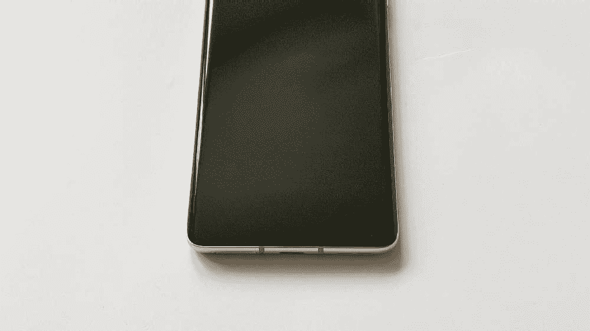
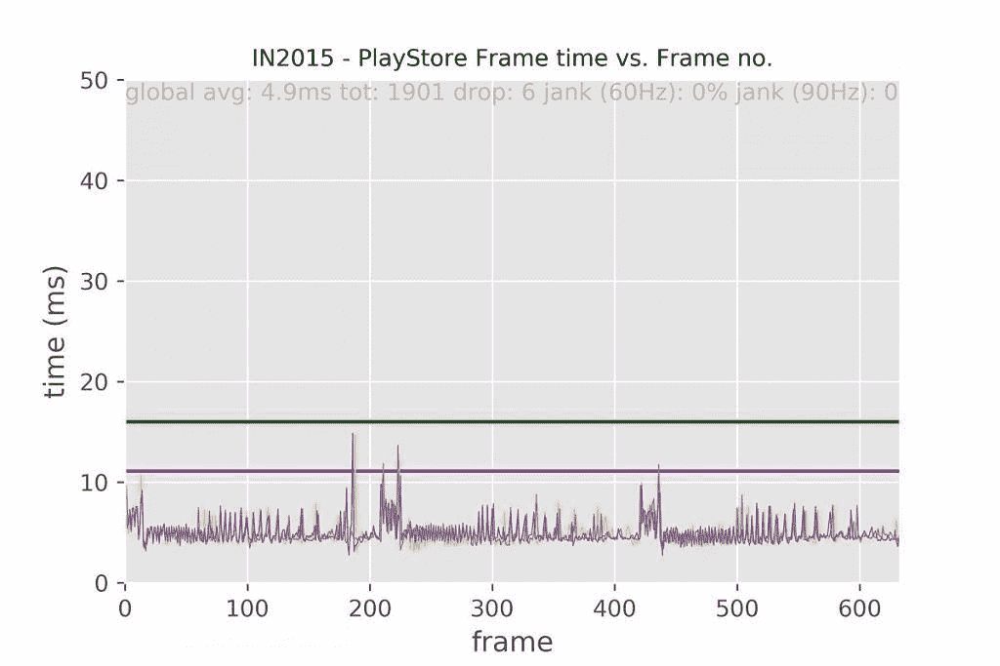

# 一加 8 评论-不足以击败一加 7T

> 原文：<https://www.xda-developers.com/oneplus-8-xda-review/>

一加 7T 与一加 7T Pro 旗舰产品一起于 2019 年底发布，作为一加 7 的半年度升级，但对于被一加 6T 卡住的市场来说，这是一次相当大的升级。在我看来,,一加 7T 是一款经典之作:一款实用的高端智能手机，它摒弃了噱头，提供了紧凑而有凝聚力的产品体验。XDA 的其他几位团队成员也在[呼应了同样的想法](https://www.xda-developers.com/xda-top-smartphones-2019/)，将其评为 2019 年最具价值的旗舰之一。现在是一加 8 号，承诺从 7T 停下的地方继续跑完最后一英里。

**[一加 8 XDA 论坛](https://forum.xda-developers.com/oneplus-8)**

但是，基本款的标价为 699 美元，比一加 7T 的起价高出 100 美元，一加 8 真的能取代一加 7T 吗？它是否提供了足够的理由让人们选择这款手机而不是 7T，或者更好的是，从一加 7T 升级而来？所有硬件规格的跳跃都转化为超值旗舰体验的显著提升了吗？在我们的一加 8 评论中，我们试图回答这些问题。

## 一加 8 系列规格

### 一加 8:全规格

| 

规格

 | 

一加 8

 |
| --- | --- |
| **尺寸&重量** | 

*   160.2 x 72.9 x 8.0 毫米
*   180 克

 |
| **颜色、材料、表面处理** | 

*   缟玛瑙黑(亮面)
*   冰绿色(哑光磨砂)
*   星际辉光(光泽)
*   极地银

 |
| **显示** | 

*   6.55 英寸液态模制单孔冲孔
*   FHD+分辨率(2400 x 1080)，20:9 宽高比，402ppi
*   90Hz 刷新率，180Hz 触摸采样率
*   HDR10+
*   3D 康宁大猩猩玻璃
*   特点:
    *   鲜艳的色彩效果
    *   阅读模式
    *   夜间模式
*   没有用于活动笔支持的活动数字化仪

 |
| **摄像头(后置)** | 

*   **初级**
    *   48MP 索尼 IMX586，f/1.75，0.8 m 像素，OIS，EIS
*   **中学**
    *   16MP，超广角，f/2.2，116 FOV
*   **三级**
    *   200 万像素，微距，f/2.4，175 万像素
*   **闪光灯**
*   **自动对焦**
*   **视频**
    *   4K @ 30/60 fps
    *   1080p @ 30/60 fps
    *   慢动作
        *   1080p @ 240 fps
        *   720p @ 480 fps
    *   时间流逝
        *   每秒 30 帧的 4K
        *   1080p @ 30 fps
    *   杂项功能
        *   电影纵横比
        *   在每秒 30 帧的 4K 下超稳定
*   **其他传感器**
    *   闪烁环境光线传感器(前)

 |
| **摄像头(前)** | 1600 万像素索尼 IMX471，f/2.0，1.0 米像素，定焦，EIS，1080p@30fps |
| **软件** | 

*   基于 Android 10 的 OxygenOS 10
*   2 年的软件更新(计划中的 Android 11 和 Android 12)，3 年的双月安全更新
*   用于无缝更新的 A/B 分区

 |
| **片上系统** | 高通骁龙 865 中央处理器

*   1 个 Kryo 585(基于 ARM Cortex-A77)Prime core @ 2.84 GHz
*   3 个 Kryo 585(基于 ARM Cortex-A77)性能内核@ 2.4GHz
*   4 个 Kryo 385(基于 ARM Cortex A55)高效内核@ 1.8GHz

Adreno 650 GPU |
| **公羊** |  |
| **储存** |  |
| **电池** | 4300 毫安时 |
| **有线充电** |  |
| **无线充电** | 不 |
| **IP 等级** | 不 |
| **安全** |  |
| **端口&按钮** |  |
| **音频&振动** |  |
| **多媒体编解码支持** |  |
| **连通性** |  |

* * *

## 设计:空间之外的色彩

一加 8 几乎没有改变我们在过去几年中已经习惯的一加背部设计。它采用了熟悉的温和弯曲的玻璃背面，垂直的多摄像头外壳位于设备顶部的中央，这次采用了三个摄像头，与其直接前身的双摄像头阵列形成了对比。如果不是因为新的颜色和额外的摄像头，你很难找出这种背部设计的逐年变化，但这根本不是一件坏事。它比一加 7T 稍短(160.2 毫米)，更窄(72.9 毫米)，甚至更薄(8 毫米)，但握起来仍然很舒服，完全适合我中等大小的手，让我可以紧紧地抓住设备。与其他玻璃夹层智能手机不同，玻璃与铝轨的交界处没有尖锐的边缘或角落。所有这些都是意料之中的，因为公司有时间通过多次迭代来掌握这种特殊的形式。在典型的一加时尚中，一加 8 带来了新的和令人兴奋的颜色选择。

市场上并不缺乏令人眼花缭乱的颜色选择，因为各公司试图不断地用诱人的(通常是蓝色的)玻璃背面以各种图案发光来超越彼此。特别是一加，它以交错发布多种颜色选择而闻名，一种比一种更诱人，这一举动已经成为他们每个手机发布周期中可预测的一部分。这款新产品有三种颜色，缟玛瑙黑、冰绿色和我们正在审查的星际辉光变体。在这么多好看的手机中，这款手机表现如何？

星际辉光一加 8 号被支持为这次发射的旗手，这是有充分理由的。它有一个通常无色和完全彩虹色的玻璃背面，超级光滑和反光，因此非常闪亮。与当今的所有玻璃智能手机没有什么不同，它可以以各种方式重新铸造光线，但这种特殊的方法只需轻轻一抖手腕，整个背部就会发生变化。

> 从本质上看，这款手机的背面部分是肥皂水泡沫，部分是抛光珍珠，在粉色、蓝色和紫色之间平滑地交替，没有任何特定的颜色

从本质上看，这款手机的背面部分是肥皂水泡沫，部分是抛光珍珠，在粉色、蓝色和紫色之间平滑地交替，没有任何特定的颜色。如果你仔细观察，你甚至会发现其他颜色也混合在其中，形成一种彩虹色的享受，看起来真的有点上瘾。

当然，直到手机采集到你所有的指纹，然后变得脏乱不堪。这是一个问题，就像每部手机一样，一加 8 没有配备非常合适的塑料外壳，几乎所有最近的一加设备都装在盒子里，这是一个巨大的遗憾。这也是一款看起来非常脆弱的手机:部分原因是它看起来非常昂贵和光滑，但我对最近的一加设备也有非常复杂的体验。我买了一部一加 7 Pro，它经受住了细心的智能手机用户可以想象的各种摔落，但我仍然能够以“全新状态”转售。然而，我去年接受审查的[一加 7T](https://www.xda-developers.com/oneplus-7t-review-premium-practical-smartphone/)在一只脚落在漂浮的木头上后破裂了，尽管被包裹着！因此，考虑到该设备漂亮的背部和可能的脆弱性，省略标志性的透明外壳是一种耻辱。

设备的正面是我们这次看到最大变化的地方。与一加 7 Pro 有些类似，这款设备选择了略微弯曲的显示屏，有助于掩盖适度厚重的边框。我说“有点”，是因为这一次，弯曲开始时更靠近设备的边缘，而且相当陡峭，所以在日常使用中，它不像一加 7 Pro 或其他曲面智能手机那样明显。对于那些喜欢更平坦显示屏的人来说，这是一件好事，比如 7T 的显示屏，但当从侧面滑动时，你仍然可以感觉到这一点，我已经有过许多意外的触摸。至少，这种面板不会遭受 7 Pro 在媒体消费期间奇怪的曲率选择导致的轻微但令人讨厌的透视失真，也不会遭受有时会干扰内容可视性的阻碍性眩光。

一加 7 和 7T 的缺口显示屏也不见了，因为该公司像许多其他制造商一样选择了打孔。左上角的打孔相当小，因为它只有一个摄像头，虽然在日常使用中它变得很不明显，但在我看来，它仍然比一加的泪珠状缺口更明显。弯曲的屏幕不允许它与屏幕的弯曲角落对齐，因为它被推得更靠近面板的中间，这也没有帮助。由于采用了曲面屏幕，并且没有泪痕，这款手机最终看起来不太像一加手机，而更像三星，或者只是另一款安卓手机。

像这样的身份变化不一定是一件坏事，但我发现这种方法比一加 7 Pro 的弹出式摄像头全屏效果和更扁平的 7T 的最小泪珠凹口都要糟糕得多。除此之外，前面还有一个顶部扬声器(有助于立体声音频)和一个显示屏下指纹扫描仪，我们稍后会谈到。

在手机周围，我们有一个标准的铝框架，非常抛光，以补充手机的珍珠和泡沫背面。它相当漂亮，但鉴于它的光滑和抛光程度，我有点怀疑它在一年内能坚持多久——这些栏杆通常会在没有外壳的情况下积累大量的划痕和磨损。手机底部有双 SIM 卡插槽、麦克风、USB Type-C 端口和底部发射扬声器，而左右两侧分别有音量键和电源按钮。熟悉的警告滑块以相同的触觉模式返回。

这可能是我在智能手机上试过的感觉最好的按钮了

这里的最后一个观察是，这个特定的审查单元有我试过的绝对感觉最好的按钮:它们是 clicky，当把手指放在它们上面时，它们根本没有给出或摆动*或试图在没有点击的情况下摆动它们。我对按钮非常挑剔，这些为我得到了 **A+** ，尽管这并不能保证每个单元都有这样感觉良好的按钮。*

这里的最后一个观察是，这个特定的审查单元有我试过的绝对感觉最好的按钮:它们是 clicky，当手指放在它们上面时，它们根本没有给予或摆动*，或者在没有点击的情况下试图摆动它们。我对按钮非常挑剔，这些按钮给了我一个 **A+** ，尽管这并不能保证每个单元都有如此棒的按钮。*

 *背部设计最终是这里的亮点。虽然这款手机令人难以置信地构造良好，相当轻(比如说，比 7 Pro 轻得多)，而且超薄，但星际辉光可能是大多数人想要的变体，而且有很好的理由。虽然它不是“第一款”彩虹色智能手机，但在我看来，它是同类产品中最好的，也是一加丰富的产品中最好的颜色选择之一。这也是一种悲剧，考虑到基本的变体不是来自星际辉光；这意味着你将不得不为这一特权支付 800 美元，这使得这种漂亮的颜色*过于昂贵*，而该公司自己的 7T 也提供了不错的设计和类似的硬件。

用户界面:老样子，老样子

* * *

说到一加出色的界面，真的没什么变化。OxygenOS 一直是 Android 爱好者的最爱，因为在很大程度上，它并没有偏离普通 Android 简单而实用的设计语言太远。多年来，随着该公司采用定制图标和自己的一加石板字体以及其他设计变化，这种情况越来越多。但所有这些仍然让 OxygenOS 在用户界面方面更接近于 Pixel 智能手机，而不是其他任何知名品牌。

## 更好的是，OxygenOS 提供了**吨定制选项**，使您能够改变操作系统的**主题、图标形状和强调颜色**，以更好地匹配您的心情和口味。你还可以**调整指纹解锁动画、环境显示时钟风格和“地平线之光”**——利用手机的弯曲屏幕边缘，在没有通知 LED 的情况下展示通知的方式。虽然一加曾经处于用户界面定制的前沿，但今天的大多数智能手机都有许多这些功能——即使是谷歌更为克制的 Pixel 智能手机也提供适度的用户界面定制，如强调颜色调整。

用户界面基本保持不变，除了解锁手机或访问音量设置时有一些轻微的动画变化。一个新的用户界面是“**动态”壁纸**。现在必须说，一加总是提供令人难以置信的壁纸，这可以追溯到他们与艺术家 Hampus Olsson 首次合作的 OnePlus 2。最近的智能手机，如一加 7 Pro 和 7T，在解锁手机和在主屏幕上滑动时，都有平滑动画的动态壁纸，这与高刷新率面板非常好地互补。一加在动态壁纸上更进了一步，它可以根据当地的温度和天气微妙地改变色调。

更好的是，OxygenOS 提供了**大量的定制选项**，使您能够改变操作系统的**主题、图标形状和强调颜色**，以更好地匹配您的心情和品味。你还可以**调整指纹解锁动画、环境显示时钟风格和“地平线光”**——它们展示通知的方式没有通知 LED，使用手机的弯曲屏幕边缘。虽然一加曾经处于用户界面定制的前沿，但今天的大多数智能手机都有许多这些功能——即使是谷歌更为克制的 Pixel 智能手机也提供适度的用户界面定制，如强调颜色调整。

*动态壁纸和指纹解锁动画一如既往的令人满意*

老实说，变化很明显，但并不令人印象深刻。壁纸本身非常好，尽管现在有点让人想起竞争对手手机上的特色，因此感觉比以前的一加设备上的少了点原创性。但它们仍然非常漂亮，尽管壁纸很难成为智能手机的卖点，但它仍然是另一个与其他产品搭配的精致细节。

更大的卖点是他们的新**黑暗主题 2.0** ，这是一个为一加 8 和 8 Pro 定制的更通用的黑暗模式，从头开始构建以支持更多应用。毫不奇怪，一加会扩展这样一个以爱好者为中心的功能，他们是最早引入这一功能的公司之一，早在 OnePlus 2 时就引入了这一功能。在黑暗主题 2.0 中，系统应用程序将像往常一样变成黑暗主题，然后其他具有夜间或黑暗模式的应用程序，如 Play Store，也将成为主题。然后，通过进入一加实验室，你将能够启用**黑暗色调**，这也将主题化没有内置黑暗主题的应用程序，如 Hangouts。这一点非常好，尽管应用程序支持有限，而且主题本身看起来并不像应用程序开发人员自己对应用程序黑暗模式的愿景那样完美(这在 Hangouts 这样的应用程序中尤为明显，因为主题有时会影响文本的可读性)。

OxygenOS 还有其他一些小变化，比如默认的启动器**用典型的 Google feed** 取代了沉闷的一加书架。当然，一加也需要适应新的打孔器，通知栏从时钟开始稍微向右推，这可能会困扰一些人。**你可以“关闭”打孔器**，就像你可以屏蔽以前设备上的凹槽一样，但这里的实现只是用一个非常不平整的虚拟边框填充设备的顶部，坦率地说，这看起来很恶心。我看不到任何人会使用这个功能。

除了这些变化，一加 8 感觉像任何最新的一加设备，所以那些希望升级的人会有一个非常无缝的过渡。如果你没有一加设备，但喜欢简单而高性能的用户界面，它永远不会妨碍审美混乱或粗制滥造的组织，那么你可能会非常喜欢 OxygenOS。在如此多的迭代改进和明智的艺术决定之后，很难夸大它的外观和感觉有多完美。

OxygenOS 还有其他一些小变化，比如默认的启动器**用一个典型的谷歌 feed** 取代了沉闷的一加书架。当然，一加也需要适应新的打孔器，通知栏从时钟开始稍微向右推，这可能会困扰一些人。**你可以“关闭”打孔器**，类似于你如何屏蔽以前设备上的凹口，但这里的实现只是用一个非常不均匀的虚拟边框填充设备的顶部，坦率地说，看起来很恶心。我看不到任何人会使用这个功能。

用户体验和软件特性:没什么新东西可看

* * *

就功能而言，OxygenOS 的这次修订并没有带来太多的东西。它拥有一加用户喜欢的所有伟大功能，但除了上面提到的更好的黑暗模式和动态壁纸，没有太多新的东西。这并不可怕，也不出人意料，因为一加主要通过软件更新来增加新功能，只有更大的功能才会成为与新智能手机一起推出的头条新闻。

## 例如，最近 OxygenOS 测试版中的**双通道网络加速**现在出现在这个版本中，允许您使用 WiFi 和数据来加速大型下载。像在 Pixel 智能手机上一样，你也可以通过 **[从音量侧菜单](https://www.xda-developers.com/oneplus-7t-pro-open-beta-1-build-live-caption-support/)**访问谷歌的直播字幕，它将转录你设备上正在播放的任何音频。这是 OxygenOS 用户在不久的将来可以期待的东西；不断获得新功能和小的改进或优化是我在一加体验中最喜欢的部分之一，所以尽管这个版本感觉新功能相当少，但用户可以在不久的将来期待更多的功能(包括不可避免的年底版本将带来的大部分功能)。

那么，有哪些(曾经有过)你应该了解的特性呢？

首先，一加多年来一直在提供自己强大的锁屏手势**，让你在屏幕关闭时画出特定的形状，并将这些动作映射到应用程序或特定的快捷键。OxygenOS 的另一个我已经习惯的功能是用三个手指在屏幕上滑动**来截图。也许我每天使用的一个功能是通过一个方便的覆盖图**来记录屏幕，这个覆盖图可以通过快速设置开关来访问。屏幕录制器提供了多种分辨率选项，可以快速启动、暂停和取消。然后，如果您不喜欢该录像，您可以立即从通知弹出窗口中删除该视频，通知您该视频已成功保存。**

 **OxygenOS 充满了小而有用的特性

至于解锁，我们仍然可以使用**面部解锁**，这仍然是市场上最快(尽管不一定最安全)的解决方案之一。一加 8 的**显示屏下指纹扫描仪**对我来说相当快而且非常准确，比 7T 的激活面积更小，光线也不那么烦人。我最喜欢的 OxygenOS 功能之一也与指纹解锁有关:解锁设备后，你可以继续按住屏幕，调出一个可定制的应用快捷方式菜单。通过继续按住手指，您可以在水平列表中滚动，松开手指将启动应用程序。例如，如果你通常解锁手机来查看社交媒体源，这是一个非常好的功能。鉴于你可以在口袋里启动手势，你可以在掏出手机时有效地准备好特定的应用程序。

> OxygenOS 有很多类似的小而有用的功能。例如，他们为**提供了最好的截图编辑器**，允许你快速裁剪、旋转甚至模糊截图的部分。他们也是第一批包含扩展截图的网站之一，这经常会派上用场。他们也有一个**简单的视频编辑器**，可以让你快速修剪剪辑，添加滤镜，还可以添加一小部分(当然也很糟糕)音乐中的音乐。

说到游戏，该公司通过自己的应用程序提供充实的游戏增强服务。**“游戏空间”是你所有游戏的枢纽**，与其他制造商提供的游戏中心应用程序没有什么不同。你可以通过在水平列表中划过各自的卡片，或者更传统的应用程序图标方法来快速启动游戏。有了游戏空间，你可以让它在游戏中无论何时收到通知，你都只会得到一个**谨慎的文本弹出窗口**让人想起旧的通知滚动条——我不能夸大它在玩多人游戏时有多有用。

 <picture></picture> 

Screenshots on the OnePlus 8 are fun and easy

你还可以将来自第三方应用的来电通知变成文本弹出窗口，让来电通过扬声器自动接听，并关闭游戏的自动亮度(一般情况下，你最好关闭自动亮度)。其他选项包括**触觉反馈增强，自动网络切换以避免延迟，以及图形优化**以改进阴影细节的形式。然后是 **Fnatic 模式**，它(1)阻止所有通知和调用(2)限制后台进程最大化 CPU 和 GPU 分配(3)停止辅助 SIM。无论何时你在游戏中，一个持续的通知将允许你访问游戏空间设置或者直接用一个快捷键打开 Fnatic 模式。

与 Fnatic 相反的是一加的 Zen 模式。除了提供 Android 典型的数字健康功能，一加 8 还提供了禅模式，可以在 20 分钟、30 分钟、40 分钟和 60 分钟的时间里，自动将自己锁在手机之外，专注于其他事情。我个人不需要 Zen 模式，尽管那些喜欢这个功能的人也可以记录他们在这个模式下的总时间，有多少通知被静音，以及它已经使用了多少天。你也可以将这些数据保存为截图，或者直接从应用程序中分享，让每个人都知道你有多不使用你的新手机。

除了这些值得注意的功能，OxygenOS 还提供了许多额外的功能。到现在为止，你可能已经知道了**提醒滑块**，这是自 OnePlus 2 以来每款一加设备的特征，当然它被保留下来，不需要解释。不过，它仍然是我最喜欢的设备之一，因为它是我每天都要多次使用的东西。相比之下，也有一些我个人很少使用的功能，但可能会对你们中的一些人有用。**并行应用**让你在同一个应用上用两个不同的账户登录，在 Discord 或 FB Messenger 等支持的服务中；**应用程序锁**可以让你设置某些应用程序需要认证，还可以让你隐藏它们的通知内容。**快速回复** **在** **横向**让你可以通过在侧面打开一个更小版本的应用程序来回复收到的通知。

你明白了。虽然我没有在这一部分包括与显示器、摄像头、电池寿命或充电相关的功能，但这份列表清楚地表明，一加 8 带来了大量的功能。

除了这些值得注意的功能，OxygenOS 还提供了许多额外的功能。到现在为止，你可能已经知道了**提醒滑块**，这是自 OnePlus 2 以来每款一加设备的特征，当然它被保留下来，不需要解释。不过，它仍然是我最喜欢的设备之一，因为它是我每天都要多次使用的东西。相比之下，也有一些我个人很少使用的功能，但可能会对你们中的一些人有用。**并行应用**让你在同一个应用上用两个不同的账户登录，在 Discord 或 FB Messenger 等支持的服务中；**应用程序锁**可以让你设置某些应用程序需要认证，还可以让你隐藏它们的通知内容。**快速回复** **在** **横向**让你可以通过在侧面打开一个更小版本的应用程序来回复收到的通知。

显示器:仍然很好，但不是更好

* * *

一加智能手机在过去提供了一些巨大的屏幕，通常选择最新的屏幕技术，并成为首批跳上高刷新率列车的人之一。XDA 的迪伦·拉加(Dylan Raga)对许多一加智能手机的显示屏进行了深入分析，虽然他通常会发现改进的空间，但它们的显示屏总体来说非常出色。例如，去年的一加 7 Pro，[因其出色的色彩准确度和最小的黑色剪裁而获得了出色的 **A** 级](https://www.xda-developers.com/oneplus-7-pro-display-review-finally-flagship-quality/)。

## 虽然它**保留了去年推出的 90Hz 优点**，但一加 8 做了一些改变，选择了更新的 **6.55 英寸(20:9)三星 AMOLED 面板**，并放弃了弹出式摄像头，采用打孔解决方案。这是一种你会从 2020 年的旗舰产品中期待的尖端面板，具有 **HDR10+支持**和**TV 眼部舒适认证**的额外好处，因为它能够“大幅减少蓝光的有害影响”。虽然我不像迪伦那样是显示器专家，但我可以给你我对一加 8 显示器的主观评价。如果你正在寻找一个更全面的显示器评论，你必须看看迪伦的一加 8 专业显示器分析。有关刷新率方面的想法，请阅读专门的性能文章。

尽管用户不断抱怨，自动亮度仍然非常糟糕

从亮度开始，一加 8 变亮并不奇怪，在手动调节的最大亮度下，其输出超过了一加 7T 的。它不仅提供了更高的峰值亮度，这是你通常期望从更新的显示器中得到的东西**，而且最低亮度似乎也更低**，并行测试显示，一加 8 对于深夜浏览或疯狂观看 YouTube 更加舒适。这与之前讨论的高级黑暗模式配合得很好，因为更多的应用程序将采用 AMOLED 显示器支持的丰富黑色。

> 尽管用户不断抱怨，自动亮度仍然非常糟糕

最大手动亮度和自动亮度增强模式之间的差异很大，这意味着即使你不想打开自动亮度，你也可能不得不打开它。

遗憾的是，一加的自适应亮度实现仍然不太理想，这令人沮丧，因为手动调节亮度时可用的级别范围有限。我已经有很多年没有在一加设备上完全关闭自适应亮度了——至少从 OnePlus 6 开始，我就基本上只使用滑块了。这是拥有一部一加智能手机最糟糕的地方之一，尤其是考虑到更实惠的手机已经解决了这一问题，以及三星等一些旗舰竞争对手的功能解决方案，我很乐意在我使用手机的整个过程中保留这些解决方案。**调整起来*慢*而且经常会错过**，**太低，不适合室内随意使用，而且经常会妨碍相机体验**(稍后会有更多介绍)。这款手机可以拥有更宽、更精细的亮度范围，这很好，但新硬件带来的许多好处都被仍然不足的自动亮度浪费了。

前面提到的一加 7 Pro 显示屏的一个优点是没有过多的黑色剪裁。至少和一加 7T 相比，这款手机在这方面似乎有点*差*。在较低的亮度水平(低于 55%)下，黑色饱和度、色调响应和总体可见度似乎都有所下降，并排控制测试使区分不同超深灰色调**变得更加困难**(与 7T 相比)。在一加 7T 上，我经常发现自己调高屏幕亮度只是为了增加对比度，以便阅读或观看内容，我在一加 8 上也遇到了同样的问题。然而，我的单位在颜色和灰度梯度上没有任何奇怪或明显的条带。

一加 8 仍然是媒体消费的绝佳选择

虽然我真的不能评论颜色的准确性，但我会说，在生动的侧面上，一加 8 显示器**看起来比一加 7T 的头发更饱和**，以至于每种颜色的明亮色调看起来更紧密，更难分辨。我没有发现这在观看视频内容时有什么积极或消极的影响——顺便说一下，这在一加 8 上很有趣。**色温和白点也正好适合我的口味**。如前所述，屏幕是明亮的，在生动的颜色配置文件上，**的颜色是有力的，但不是卡通**。

> 说到色彩配置文件，您仍然可以从前面提到的鲜艳色彩和更高的对比度中进行选择，或者从针对 sRGB 色彩空间的自然色彩中进行选择，以获得行业标准的色彩准确度。在高级显示设置下选择显示 P3、AMOLED 宽彩色或 sRGB 配置文件后，您也可以手动调整色温。

显示器相关的特性呢？夜间模式是存在的，它可以被方便地安排，尽管它仍然遭受和以前一样的问题。特别是，每当你解锁手机时，它会慢慢过渡到夜间模式，这意味着每次你都会被蓝光照射一秒左右。每当我不得不参加深夜通知时，这个和不确定的自动亮度简直是天作之合。有一个**视频增强器**，可以锐化视频并提高颜色，但我个人认为这个功能相当没有价值。**舒适色调(OxygenOS 版本的苹果 True Tone)在一加 8 中不见了**，因为这款手机已经取消了 RGB ALS，该功能可以根据当前的室外光线设置来匹配屏幕校准。**阅读模式**可让您将屏幕调成单色或棕褐色，同时增强对比度并选择性地阻止抬头通知。

说到色彩配置文件，您仍然可以从前面提到的鲜艳色彩和更高的对比度中进行选择，或者从针对 sRGB 色彩空间的自然色彩中进行选择，以获得行业标准的色彩准确度。在高级显示设置下选择显示 P3、AMOLED 宽彩色或 sRGB 配置文件后，您也可以手动调整色温。

相机:价格更高，但没什么表现

* * *

智能手机拍照仍然是原始设备制造商让消费者定期升级设备的主要方式之一，而且越来越难推荐不提供出色拍照体验的手机。这通常是一加的缺点之一，因为他们的手机永远无法与价格更高的竞争对手相抗衡。在一段时间内，人们可以通过指出价格来证明这一点，但随着一加的价格在这些年里不断攀升，这不再是一个借口。一加 7 Pro 和 7T 的相机相当普通，以至于我开始主动确保在重要活动中带上更好的智能手机相机，当我在室内拍照时，我经常发现自己在家里寻找另一部智能手机。起初，我并不是真的对相机无动于衷，但随着被破坏的镜头越来越多，我最终变得越来越沮丧。你绝对可以用一加 7 Pro 和 7T 拍出很棒的照片，但你不能像用其他手机那样毫不费力地持续拍摄。

智能手机拍照仍然是原始设备制造商让消费者定期升级设备的主要方式之一，而且越来越难推荐不提供出色拍照体验的手机。这通常是一加的缺点之一，因为他们的手机永远无法与价格更高的竞争对手相抗衡。在一段时间内，人们可以通过指出价格来证明这一点，但随着一加的价格在这些年里不断攀升，这不再是一个借口。一加 7 Pro 和 7T 的相机相当普通，以至于我开始主动确保在重要活动中带上更好的智能手机相机，当我在室内拍照时，我经常发现自己在家里寻找另一部智能手机。起初，我并不是真的对相机无动于衷，但随着被破坏的镜头越来越多，我最终变得越来越沮丧。你绝对可以用一加 7 Pro 和 7T 拍出很棒的照片，但你不能像用其他手机那样毫不费力地持续拍摄。

一加 8 和 8 Pro 都带来了相机的变化，8 Pro 的升级是实质性的。一加 8 的主后置摄像头装有与一加 7T 相同的 4800 万像素索尼 IMX586 传感器，具有 EIS & OIS，光圈为 f/1.7，像素大小为 0.8μm，你通常会在 1200 万像素的像素模式下拍摄，这可以提高整体的聚光图像质量。广角相机保留了 7T 的 1600 万像素，保持了相同的 f/2.2 光圈，并将视野降低到 116 度。这次专用的长焦相机不见了，这对我来说真的很好——它只是没有足够的吸引力来定期使用，因为它不会真正增加多少细节，而且相机仍然提供 2 倍的传感器内变焦。在它的位置上，我们现在有一个 2MP 的微距相机，像素大小为 1.75μm，没有 OIS，光圈为 f/2.4。

至于相机 UI，除了一些小的美学变化和各种快速切换的消失，它在很大程度上类似于 7T。事实上，我认为与一加 7T 相比，相机的用户界面总体上有所退步，因为人们现在需要访问相机设置活动来更改重要的设置，如常规视频和慢动作的视频分辨率。更糟糕的是，除非首先解锁设备，否则无法访问相机设置，这意味着当你通过电源按钮快捷方式访问相机时，你将无法选择视频 FPS 和分辨率。鉴于我充分利用了这种快捷方式，而且我拍摄的大多数视频都是自发的(慢动作视频通常也是如此)，这个决定对我来说没有多大意义。但是除了这些吹毛求疵，这是一个非常有用的相机用户界面——它非常友好，并且保留的快捷键非常有用。

图片本身呢？我预计会遇到与 7T 相机相同的问题，但总的来说，照片确实要好一些。(请原谅受试者范围有限，隔离使相机审查有点困难)。颜色大多很棒，除非有放大红色的趋势。对比度很大，我不认为图片过于清晰，但像往常一样放大时仍有一点油画效果，各种边缘周围还有一些光晕。当近距离拍摄物体时，窄焦距会非常明显和分散注意力，一些处理问题变得明显。例如，看一下我朋友喝酒的照片:杯子里的右上边缘非常尖锐，实际上那里有很多平滑和起泡的细节被相机抹去了。我在 7T 上多次遇到同样的情况，因为它往往以不可思议的方式过度处理轮廓。

我发现室内和低光拍摄稍微好一点，色彩稍微好一点，但在大多数情况下，后置摄像头在自动模式下的拍摄结果与 7T 几乎相同。我没有发现 48MP 模式有任何用处；照片更大，但没有明显的细节优势，在某些情况下，图像变得更嘈杂。一加的夜景模式也非常好，如果你特别使用相机三脚架，还有一个设置可以进一步增加曝光时间。我还非常欣赏该公司推出的“宠物模式”——他们为猫和狗启用了面部跟踪，并为我们毛茸茸的朋友适当调整相机快门速度。我认为在拍摄我那只焦躁不安的猫时，这是有所不同的，它让 7T 的工作变得众所周知的困难。我不认为微距模式比在 7T 上更有用，尽管有专用相机，我的大多数图像都相当粗糙，当然，分辨率也很低。

手机变化很大的一个领域是人像拍摄。虽然相机在对象分割方面做得很好，但这些人像模式照片的颜色太饱和了，与我的 7T 照片完全不同。例如，在上面的照片中，它使我的脸变红，突出了不同于其他手机的瑕疵。天空也完全乱了。图像的其余部分都很好，尽管细节和动态范围都很棒，在一些快速编辑以降低饱和度后，这张照片更适合社交媒体。也就是说，我过去觉得一加的肖像照看起来有点单调(看看第一次比较)，但我不确定我是否真的喜欢他们在这里如此彻底地改变了他们的色彩科学。

[video width = " 1280 " height = " 720 " MP4 = " https://static 1。xdaimages。com/WordPress/WP-content/uploads/2020/04/New-video。MP4 "]

回到彩色，虽然我已经设法用这部手机拍出了一些非常好的照片(尽管新冠肺炎健康咨询让相机审查变得相当困难)，但必须说，我仍然有很多问题要持续捕捉平衡和准确的照片。在上面的视频中，你可以看到一加 8 的摄像头正在努力决定如何调整画面的温度；这一段下面的图片也展示了这个问题，它们只是瞬间分开拍摄，但具有完全不同的颜色特征。这不是由场景优化引起的(即你不能关闭它)，这是我在 7 Pro 和 7T 上一直在努力解决的问题，事实上，这是我第一次测试 OnePlus 6 时向该公司发送的消息。是的，一加 7T 和 8 都可以拍出一些非常好的照片，我也用它们拍出了一些非常好和忧郁的照片，但我不喜欢在我的手指按下快门按钮之前完全改变我的取景器。

[video width = " 1280 " height = " 720 " MP4 = " https://static 1 . xdaimages . com/WordPress/WP-content/uploads/2020/04/New-video . MP4 "]

*彼此相隔仅一瞬间拍摄的图像可能会有显著不同的颜色特征*

我拍照时的另一个长期问题源于糟糕的自动亮度。为了在户外拍照，有时我需要自动亮度的额外提升超过最大手动设置，但当我打开相机应用程序并举起手机时，手机通常会决定降低亮度，只有当我退出并试图手动恢复时，亮度才会再次最大化！对于一条价格不断上涨的电话线来说，看到如此恼人和普遍的问题一代又一代地持续下去，真是太糟糕了。

一加 8 的前置摄像头由 16MP 索尼 IMX471 传感器驱动，具有固定焦距，f/2.0 光圈和 1.0 米的像素大小。鉴于这与 7T 上的设置相同，我并不期望图像质量有任何差异，但我惊喜地发现，色彩还原更好，更真实，细节和动态范围都有小幅改善。例如，一加 7T 较冷的照片通常难以捕捉我头发的自然棕色高光，但一加 8 能够像其他手机一样很好地呈现它们。

最后，我们来看视频。事实上，我过去在一加视频上没有遇到太多问题，因为我发现它相当清晰和流畅，我也非常喜欢它们的稳定性。他们的“超级稳定”视频模式在消除走路引起的小抖动方面做了惊人的工作，给它一个平滑稳定的外观，它兼容 4K30FPS 和 1080p60FPS 模式，尽管遗憾的是不兼容 4K60FPS。一加 8 上的慢动作视频仍然非常好，但我确实发现我的一些剪辑有一两个口吃的帧。由于我拍摄了很多慢动作视频，而且我在其他手机上从未遇到过这样的问题，我希望这是一个罕见的孤立事件。就视频而言，我对手机非常满意。

不过，总的来说，我不能说我对一加 8 的摄像头非常满意。由于图像处理的改进，它在某些方面更好，但也有一些大的失误，比如新的人像拍摄过于饱和和人工。我也不能相信一些长期存在的问题仍然存在；这一点以及它在改进 7T 上做得不够的事实让我觉得，对于那些真正重视手机中好相机的人来说，额外的价格根本不值得*-特别是考虑到这里发现的许多改进都是由于改进的软件，从理论上来说，可以用于旧的一加设备。*

 *最后，我们来看视频。事实上，我过去在一加视频上没有遇到太多问题，因为我发现它相当清晰和流畅，我也非常喜欢它们的稳定性。他们的“超级稳定”视频模式在消除走路引起的小抖动方面做了惊人的工作，给它一个平滑稳定的外观，它兼容 4K30FPS 和 1080p60FPS 模式，尽管遗憾的是不兼容 4K60FPS。一加 8 上的慢动作视频仍然非常好，但我确实发现我的一些剪辑有一两个口吃的帧。由于我拍摄了很多慢动作视频，而且我在其他手机上从未遇到过这样的问题，我希望这是一个罕见的孤立事件。就视频而言，我对手机非常满意。

性能:是的，它是最快最平稳的

* * *

像往常一样，我将把我对性能的全部想法留到本周已经安排好的另一篇专门文章中。在分析中，我让一加 8 通过通常的一套**合成基准测试、游戏帧率分析和我们定制的真实世界性能测试**，以确定一加 8 是否能够从骁龙 865 中挤出任何额外的速度和流动性。敬请关注即将登陆 XDA 门户网站的完整绩效评估。

## 既然如此，为什么不来点小剧透呢？老实说，尽管我希望你阅读深入的性能分析，但你可能没有*有*来浏览数千字和数十张专注于毫秒差异的图表，以了解一加 8 真的真的真的很快。有多快？这是我们测试过的最快的手机，也是 90Hz 类别中最流畅的，甚至击败了好得可笑的一加 7T。当谈到合成基准(除非我们将在本周晚些时候进入一些警告)和现实世界的性能时，这几乎是毫无争议的。

它又快又平稳

 <picture></picture> 

The OnePlus 8's buttery-smooth, consistent scrolling is a sight to behold.

所以是的:很快，很流畅。这是一加提供的最新产品——这是第一家将性能作为其最大营销点之一的公司，而且在速度和流动性方面有着良好的记录，所以你已经知道会发生什么。即便如此，这款手机的真实世界和游戏性能，以及它的持续性能和散热都给我留下了深刻印象。我很快会告诉你更多，所以这就是我现在要说的！

> 它又快又平稳

电池寿命和充电:没有惊喜

* * *

尽管与 7T 相比，一加 8 在各个方面都有所缩小，但它仍成功实现了电池容量的大幅升级，将锂离子电池从 3800 毫安时提高到了 4300 毫安时。考虑到手机最终的轻薄和紧凑感，这是一个受欢迎的进步。像往常一样，我首先让手机整夜运行一系列 PCMark 2.0 电池寿命测试，以便我可以很好地了解手机在连续工作负载下以及在不同亮度设置下的续航时间。该测试持续循环 PCMark 2.0 基准测试，直到设备达到 20%的电池寿命，然后根据平均消耗率和电池容量计算电池寿命分数；我们在关闭移动数据和后台服务的情况下，以 90Hz 的频率运行了三次。一加 8 实际上在这里产生了非常好的结果，但值得注意的是，鉴于我设置测试的方式，这是一个过于慷慨的估计。尽管如此，由于电池寿命接近减半，50%和 100%亮度的结果之间存在巨大差异。这对我来说不是好消息，因为即使在室内，我也喜欢接近最大亮度。

尽管与 7T 相比，一加 8 在各个方面都有所缩小，但它仍成功实现了电池容量的大幅升级，将锂离子电池从 3800 毫安时提高到了 4300 毫安时。考虑到手机最终的轻薄和紧凑感，这是一个受欢迎的进步。像往常一样，我首先让手机整夜运行一系列 PCMark 2.0 电池寿命测试，以便我可以很好地了解手机在连续工作负载下以及在不同亮度设置下的续航时间。该测试持续循环 PCMark 2.0 基准测试，直到设备达到 20%的电池寿命，然后根据平均消耗率和电池容量计算电池寿命分数；我们在关闭移动数据和后台服务的情况下，以 90Hz 的频率运行了三次。一加 8 实际上在这里产生了非常好的结果，但值得注意的是，鉴于我设置测试的方式，这是一个过于慷慨的估计。尽管如此，由于电池寿命接近减半，50%和 100%亮度的结果之间存在巨大差异。这对我来说不是好消息，因为即使在室内，我也喜欢接近最大亮度。

最小亮度

中等亮度

| 最大亮度 | PCMark 2.0 电池寿命 | **16** h **29** m |
| **11** h **43** m | **6** h **33** m | 不出所料，我的设备的电池寿命也延长了。我必须承认，鉴于我所在的州发布了就地安置令，我每天都在这个设备上花了太多时间。因此，我并不为下面截图中荒谬的 6 小时屏幕打开时间感到自豪，但我也对这款设备的整体表现不太惊讶。 | 我只在刷新率为 90Hz 的情况下使用手机，我的使用主要包括 YouTube、Reddit 和 Chrome 浏览，以及通过 Hangouts 和 Facebook Messenger 发送大量消息，还包括在 Wi-Fi、5G 和 4G LTE 上的通话、视频通话、相机使用和播客。每天，我都能按时看五个多小时的屏幕，即使是在大量使用的情况下，包括多任务处理、浏览画中画 YouTube 视频、视频通话(以及多任务处理时的视频通话)等等。播客和背景 YouTube 的消费也没有显示在屏幕上的时间数字中，所以实际使用量实际上高于所描述的屏幕上的数字。虽然屏幕打开时间很长，但总的不插电时间并不长，我预计手机在电池容量升级后可以持续更长时间。事实上，结果与我去年第一次测试一加 7T 时记录的结果相似，我的用例没有太大变化。所以我不能肯定地说这是一个升级，但它也没有真正“感觉”到任何不同(没有好多少，也没有坏多少)。 |

至于充电，根据一加和我们的确证数据，Warp Charge 30T 有所回报，能够在短短 22 分钟内将手机从 1%充电到 50%。正如我们为之前使用基本相同技术的一加设备记录的那样，你也可以在使用手机时使用 Warp Charge 30T，而不会导致任何充电速度损失，你甚至可以在玩 3D 游戏时快速充电。我曾经对 Warp/Dash Charge 赞不绝口，但事实是，其他原始设备制造商已经开始赶上一加的快速充电技术，所以这不再是一个新颖或独家的功能。当然，它仍然非常好，并且仍然非常方便，但远不及 8 Pro 上新的 30W 无线充电功能令人兴奋，显然它没有在这里被淘汰。起价 700 美元，我觉得一加 8 也应该配备无线充电功能。

扬声器、触觉、零碎物品

一加 8 基本上采用了上两款设备上相同的强大扬声器硬件，老实说，它相当不错。它们通过杜比全景声得到增强，声音变得非常大，尽管它们缺乏低音，并且在较高的音量范围内会变得微弱。我在通话质量方面也没有问题，考虑到这些耳机的响度，坐在房间的另一边用扬声器打电话很容易。对于耳机，我们显然没有 3.5 毫米耳机插孔，但有各种各样的设置来增强无线耳机体验——从声音配置文件到播放行为调整——这可能很方便(例如，我设置了在断开和连接设备时暂停和恢复播放)。振动马达很好:它感觉不像在一加 7 Pro 上那么强，但我喜欢它比 7T 多一点，所以它足够好。然而，它发出一种非常明显的*皮尤*声，当人们打字时，这种声音甚至会与自定义键盘声混淆。这是一个小吹毛求疵，我基本上能够忘记噪音，但它就在那里，偶尔会触发我。就连通性而言，我在 Google Fi 上没有任何问题。更多细节，请查看米沙的文章[关于一加 8 和一加 8 Pro](https://www.xda-developers.com/oneplus-8-pro-specifications-features-pricing-availability/) 你应该知道的一切——如果你有问题，很可能他找到了答案！

* * *

### 扬声器、触觉、零碎物品

结论:一加 8 号是一加 7TT

* * *

那么结论是什么？我和一加 8 度过了一段美好的时光，它将*可能*成为我的日常司机；它将取代一加 7T，*，但它不必*。在它出现之前，我已经相当习惯于 7T，坚持使用它没有问题。你可能已经注意到，在这篇评论中，我经常提到一加 8 的起价，这是因为这个单数让它的每一次升级都显得很小。一加的价格攀升正在达到临界质量，他们已经完全摆脱了“平价旗舰杀手”的皮肤，迎来了高端旗舰市场。我不能说这件新外套非常适合他们，尽管一加 8 是一款很棒的手机，但它并没有违背人们的期望。事实上，它甚至没有解决一些长期存在的大大小小的紧迫问题，而这些问题正是一加用户热切希望解决的。

## 这里没有足够的升级来证明在如此短的时间内如此急剧的涨价是合理的

一加 8 的 700 美元起价有点荒谬，因为你可以从一加直接花 500 美元买到 7T，或者找到类似价格的一加 7 Pro。这还只是你在一加购物的情况。事实上，过去的旗舰产品中不乏优秀的交易，其中许多在相机和电池寿命等关键领域，甚至软件更新方面都超过了一加 8。7T 在安全更新方面不如以前的一加设备一致，OnePlus 6 和 6T 的更新情况甚至更糟，没有迹象表明这款手机会扭转这一趋势。最后，除了性能，这款手机我最喜欢的部分之一是*星际辉光*后盖。我真的非常非常喜欢！但我也永远不会向任何人推荐它，因为它的规格提高了 100 美元，我怀疑大多数人甚至不会注意到日常或长期的变化。这里没有足够的升级来证明在如此短的时间内如此急剧的涨价是合理的。

> 虽然这不是一款负担得起的旗舰产品，但具有讽刺意味的是，它可能会成为市面上更便宜的骁龙 865 设备之一。但很明显，这一次大多数真正的细节都在一加 8 Pro 身上，与 7 Pro 上次吸引注意力的方式类似。随着一加 8 和 8 Pro 在不同市场同时发布，一加 8 第一次成为真正负担得起的旗舰，因为它的兄弟姐妹解决了超高端市场，这将是非常有趣的。但是唉，这根本不是一款实惠的旗舰。其结果是，这款手机与其前辈太过相似，几乎不值得进行版本号升级。称它为一加 7TT 会更合适，即使这样，它仍然是不准确的，因为我已经审查了比这更令人兴奋的“T”版本。

所以，最后，我真的很喜欢一加 8。但这主要是因为我喜欢一加 7T，两者都提供了几乎相同的用户体验。

虽然这不是一款负担得起的旗舰产品，但具有讽刺意味的是，它可能会成为市面上更便宜的骁龙 865 设备之一。但很明显，这一次大多数真正的细节都在一加 8 Pro 身上，与 7 Pro 上次吸引注意力的方式类似。随着一加 8 和 8 Pro 在不同市场同时发布，一加 8 第一次成为真正负担得起的旗舰，因为它的兄弟姐妹解决了超高端市场，这将是非常有趣的。但是唉，这根本不是一款实惠的旗舰。其结果是，这款手机与其前辈太过相似，几乎不值得进行版本号升级。称它为一加 7TT 会更合适，即使这样，它仍然是不准确的，因为我已经审查了比这更令人兴奋的“T”版本。

所以，最后，我真的很喜欢一加 8。但这主要是因为我喜欢一加 7T，两者都提供了几乎相同的用户体验。****