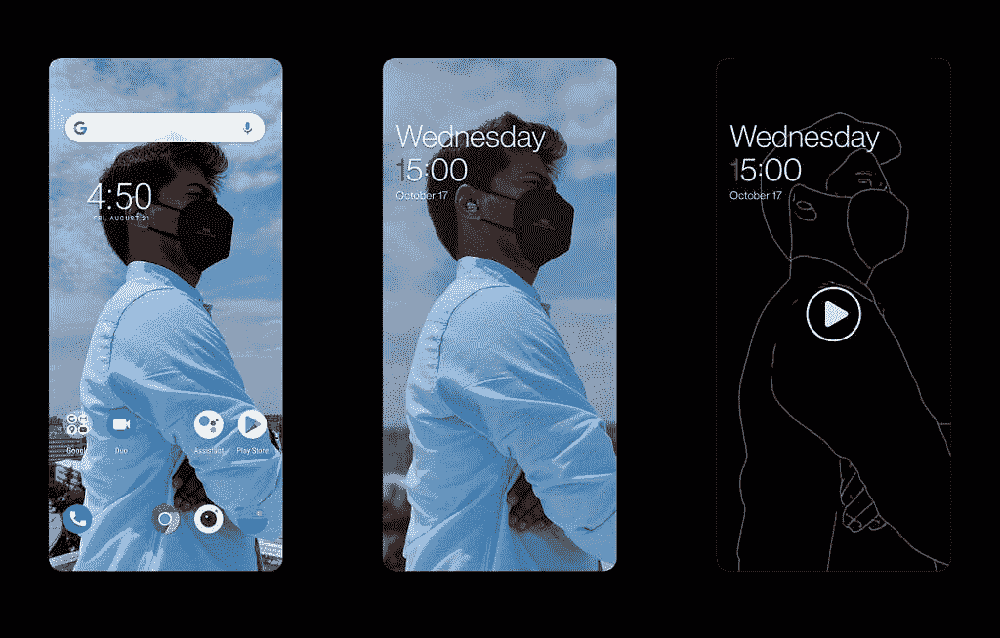

# 一加 8T 评论:有意义的 T 升级

> 原文：<https://www.xda-developers.com/oneplus-8t-review/>

一加 8T 在这里，带来了一加近年来更受欢迎的智能手机之一的更新。今年，找不到专业人士，因此维护中期周期刷新的整个任务落在了一加 8T 的肩上。

T 系列通常是以这种命名方式发布的第一款手机的渐进式升级，但一加 8T 与之前的那些相比如何呢？它的表现如何，它有足够的自我认同吗？

请继续阅读，我们会努力找到答案。这是我们的一加 8T 评论。

***关于本次评测**:一加送了我们一辆海蓝绿色的一加 8T 进行评测。这个评测是用了一周后的。一加在这次审查中没有任何投入。*

### 一加 8T 规格

| 

规格

 | 

一加 8T

 |
| --- | --- |
| **构建** | 

*   正面:康宁大猩猩玻璃保护层
*   背面:亚光磨砂玻璃，由一层康宁大猩猩玻璃保护
*   颜色:海蓝宝石绿，月亮银

 |
| **尺寸&重量** | 

*   160.7 x 74.1 x 8.4 毫米
*   188 克

 |
| **显示** | 

*   6.55 英寸 FHD+ AMOLED
*   2400 x 1080 分辨率
*   20:9 宽高比
*   120 赫兹刷新率
*   240Hz 触摸采样率
*   HDR10+认证
*   JNCD < 0.55
*   Brightness
    *   1,100 nits maximum
    *   1.28 nits minimum (dark mode), 2.5 nits (normal mode)

 |
| **SoC** | 高通骁龙 865 中央处理器

*   1 个 Kryo 585(基于 ARM Cortex-A77)主内核@ 2.84GHz
*   3 个 Kryo 585(基于 ARM Cortex-A77)性能内核@ 2.4GHz
*   4 个 Kryo 385(基于 ARM Cortex A55)高效内核@ 1.8GHz

Adreno 650 GPU |
| **闸板&存放** | 

*   8GB LPDDR4X + 128GB UFS 3.1
*   12GB LPDDR4X + 256GB UFS 3.1

 |
| **电池&充电** | 

*   4500 毫安时(双电池)
*   有线充电
    *   高达 65W (10V/6.5A)的快速充电，带 Warp Charge 65 适配器
    *   使用 USB 供电充电器进行高达 27W 的快速充电

*   包括翘曲充电 65 充电器
    *   C 型到 C 型连接
    *   通过 USB 电源以高达 45 瓦的功率为其他设备充电

*   不支持无线充电

 |
| **安全** | 

*   光学欠显示指纹传感器
*   基于软件的面部解锁

 |
| **后置摄像头** | 

*   **主:** 48MP 索尼 IMX586，f/1.75，0.8 m 像素，OIS，EIS
*   **次要:** 16MP 索尼 IMX481，超广角，f/2.2，123 FOV
*   第三级: 5MP，宏
*   **四进制:** 2MP，单色
*   **闪光灯:**双 LED 闪光灯
*   **自动对焦:** PDAF +咖啡馆
*   **其他传感器:**闪烁检测传感器

**视频:**

*   4K @ 30/60 fps
*   1080p @ 30/60 fps
*   慢动作:
    *   1080p @ 240 fps
    *   720p @ 480 fps

*   时间间隔:
    *   每秒 30 帧的 4K
    *   1080p @ 30 fps

*   杂项功能
    *   电影宽高比、视频人像、视频夜景、视频焦点跟踪
    *   在每秒 30 帧的 4K 下超稳定

 |
| **前置摄像头** | 1600 万像素索尼 IMX471，f/2.4，1.0 米像素，定焦，EIS，1080p@30fps |
| **端口&按钮** | 

*   USB 3.1 第 1 代 C 型
*   双纳米 SIM 卡
*   警报滑块

 |
| **音频** | 

*   双立体声扬声器
*   噪声消除支持
*   杜比大气

 |
| **连通性** | 

*   高通骁龙 X55 5G 调制解调器
*   无线网络 802.11 a/b/g/n/ac/ax，2.4G/5G，无线网络 6
*   蓝牙 5.1
    *   支持 aptX、aptX HD、LDAC 和 AAC

*   国家足球联盟
*   GNSS:
    *   GPS (L1 + L5 双频带)
    *   GLONASS
    *   伽利略(E1 + E5a 双频)
    *   北斗
    *   星基增强系统
    *   A-GPS

*   气压计传感器(北美除外)

 |
| **软件** | 基于 Android 11 的 OxygenOS 11 |

### 不同地区的波段信息

*   北美:
    *   GSM: B2，3，5，8
    *   WCDMA: B1，2，4，5，8，9，19
    *   码分多址:BC0，1，10
    *   LTE-FDD: B1，2，3，4，5，7，8，12，13，17，18，19，20，25，26，28，29，30，66，71
    *   LTE-TDD: B34、38、39、40、41、46、48
    *   5G 消极安全保证:N2，5，25，41，66，71
    *   南非:N1，3，41，71，2，25，66
    *   MIMO:
        *   LTE: B2，4，25，66，41，48
        *   1，2，3，66，41，25

*   印度:
    *   GSM: B2，3，5，8
    *   WCDMA: B1，2，4，5，8，9，19
    *   LTE-FDD: B1，2，3，4，5，7，8，12，17，18，19，20，26
    *   LTE-TDD: B34、38、39、40、41、46
    *   5G NSA: N78
    *   南非:N1，378 人
    *   MIMO:
        *   LTE: B1，3，40，41
        *   数量:1，378

*   欧洲:
    *   GSM: B2，3，5，8
    *   WCDMA: B1，2，4，5，8，9，19
    *   LTE-FDD: B1、2、3、4、5、7、8、12、13、17、18、19、20、25、26、28、32、66
    *   LTE-TDD: B34、38、39、40、41、42
    *   5G 消极安全保证:N1，3，7，28，41，78
    *   南非:N1，3，41，78
    *   MIMO:
        *   LTE: B1，3，7，38，41
        *   1，3，7，78

*   中国:
    *   GSM: B2，3，5，8
    *   WCDMA: B1，2，4，5，8，9，19
    *   CDMA: BC0
    *   LTE-FDD: B1，2，3，4，5，7，8，12，17，18，19，20，26
    *   LTE-TDD: B34、38、39、40、41
    *   5G NSA: N41、78、79
    *   5G SA: N41，78，79
    *   MIMO:
        *   LTE: B1，3，41
        *   编号:N41，78，79

**[一加 8T 论坛](https://forum.xda-developers.com/oneplus-8t)**

* * *

## 设计——手机的一种享受

就硬件设计而言，一加 8T 呈现了我们在一段时间内看到的与传统一加美学更为激进的背离。这款手机外观上的这些变化与 OxygenOS 的软件重新设计以及该公司通过一个新的、更现代的标志接受新的身份不谋而合。这里有什么不同，为什么重要？更重要的是，这些变化是在变好吗？

一加 8T 有**蓝绿色**和**月球银**两种颜色。我们的评论单元展示了所谓的“绿色”外套，尽管你可以原谅称它为一种蓝绿色。不过，这真的取决于照明，因为非常强烈的直射阳光可以呈现出更绿的色调，如下图所示。事实上，我们的一加 8T review 变型的背面采用了引人注目的彩色玻璃背面。与之前版本中更华丽的一加背部设计不同，一加 8T 显得更保守，哑光磨砂表面几乎完全抗脏。这是星际辉光一加 8 号的一个疯狂的迂回，它将华丽的玻璃带回了一个新的水平。尽管如此，一加 8T 一点也不低调:这是一款看起来很可爱的手机，因为有时它的背面会让我想起五颜六色的光滑糖果。**它非常干净地闪烁和散射光线**，在极端角度有相当柔和的颜色变化，当被强光和直射光照射时，几乎完全改变色调和纹理。这是一种非常精致的颜色，尽管我非常喜欢它，但最终，它确实感觉像是漂亮蓝色手机海洋中的另一部漂亮蓝色手机。

这是同一款手机，但在不同的照明条件下。

选择蓝色玻璃背并不是唯一让一加 8T 的设计比以往任何时候都更具衍生性的事情。该设备的主体在其布局、曲率和尺寸方面发生了重要变化，这使得它与“T”版本提供的主线有了最大的偏离。这款手机感觉有点“盒子”，部分原因是它选择了安装在角落的矩形摄像头阵列，不像一加在其他每一次迭代中使用的中央摄像头。在尺寸方面，8T 比它的前身更高更宽，尽管增加了电池容量，但保持了相同的厚度。在手中，手机保持非常舒适，光滑的边缘和靠近背板两侧的柔和曲线。我在没有外壳的情况下使用这款手机没有任何问题，虽然玻璃手机总是有点滑，但背面没有污迹和指纹几乎迫使你保持手机裸露，以展示其明亮的颜色。

如果你选择一个案例，一加一如既往地提供各种优秀的案例。根据评论指南，我们发现了青色的传统砂岩案例，以及在我看来相当不自然的透明“量子”案例。

这款手机的其余设计符合你的预期。你可以在手机周围的金属轨道上看到提醒滑块，两者都有漂亮闪亮的倒角。你有双扬声器(正面和底部发射)，一加声称通过采用“板上芯片”解决方案，下巴的尺寸已经减小。最后，屏幕不再具有弯曲的边缘，我将在显示部分进一步描述这一点。

最终，一加 8T 是一款非常漂亮的手机，握起来很舒服——没有什么是你不会从最新的一加发布中期待的。与此同时，更方正的设计、安装在角落的摄像头，甚至这款新的哑光玻璃后盖，都让这款新的一加手机感觉**比以往**更具衍生性。我称赞了一加 8 独特的一加背部设计，但一加 8T 打破了该公司的许多美学传统。这肯定会让一些粉丝不高兴，但也会吸引一批新的顾客，在我看来，他们会觉得很有看头。

* * *

## 软件-认识新的 OxygenOS

从公司的构想开始，从 One 的 CyanogenMod S ROM 开始，一加手机就一直在打包相当接近“库存”的软件。这些年来有许多[更新，事实上改变了 OxygenOS](https://www.xda-developers.com/oneplus-3t-xda-review-what-has-changed-and-by-how-much/) 的外观，更新了图标，不同的强调颜色和布局变化——但即使如此，它仍然足够“老套”,值得评论家和用户的一致好评。与许多竞争手机(尤其是来自中国的手机)不同，**一加的设备旨在保持用户体验简单、精简、快速和流畅，只有很少的周到功能点缀在**中。当然，这些年来这种情况已经发生了变化，而且在最近的记忆中，一加的设备已经显得臃肿了许多。最新的 [Android 11 OxygenOS 更新](https://www.xda-developers.com/oneplus-android-11-official-oxygenos-11-beta-stable-tracker-download-install/)可能是迄今为止最具争议的一次，因为它极大地改变了整个操作系统的外观和感觉。

我们已经[写了大量关于这种新 OxygenOS 设计的文章，这种设计旨在简化单手操作](https://www.xda-developers.com/interview-oneplus-oxygenos-11-one-handed-use-dont-kill-my-app-more/)在手机屏幕平均比以往任何时候都大的时候。与三星的 OneUI 类似(事实上非常类似)，这种新外观试图通过大幅移动和重组每个布局来解决单手操作的困难，其方式是大多数互动内容保持靠近拇指，而信息内容保持靠近顶部。新的一加画廊应用程序可能是一个完美的例子，因为当第一次启动应用程序时，屏幕的下半部分是所有文件夹和预览的地方。这种新的设计理念优先考虑沿着屏幕中间从一侧到另一侧的滚动和滑动，尽可能多地去除显示屏顶部附近的按钮。

访问各种子菜单将带来更传统的布局，此时用户必须再次用双手参与，但大多数表层应用程序活动都很适合单手操作。一加应用程序和手机 UX 的关键区域如设置菜单都采用了这种新设计，而系统应用程序保持相当一致。对这种方法的一个常见批评是**显示屏的顶部往往相当贫瘠**，这确实是一加默认和系统应用程序如 Gallery 和 Settings 的情况——你在显示屏顶部附近得到的只是几个非常大的单词，反过来使一些屏幕空间感觉被浪费了(至少直到有人开始滚动)。

这是无法回避的- **这个最新的一加用户界面几乎在各个方面都与现在的安卓**相去甚远。也就是说，**我个人很快就习惯了新的外观和流程。我并不特别喜欢它，但我也发现，当我第一次看到新的布局时，我的许多先入之见和担忧都是毫无根据的。例如，我在 Android 11 核心更新上遇到的问题比新的 OxygenOS 变化更多，这最终让我感到惊讶。所有伟大的一加功能仍然存在，所以最终，用户体验设法感觉熟悉，即使这样一个根本不同的用户界面。我在我的一加 8 评测中已经写了很多关于 OxygenOS 的特性，所以在接下来的几段中，我将只讨论 8T 中的新特性。令人惊讶的是，它比通常在“T”版本中看到的内容要多一点——但是您可能需要等待所有特性的到来。**

**OxygenOS 现在有了一个合适的始终显示功能，而不是传统的环境显示**。这是迄今为止我最喜欢的功能之一，这款设备提供了一套强大的功能来补充它。你可以从几个时钟选项中进行选择，包括一个巧妙的“洞察 AOD”选项，它以简单的设计显示你解锁手机的次数以及一天中的使用情况。像往常一样，你还可以查看你的通知和剩余电池或充电状态。在即将到来的 11 月更新中，一加 8T 用户还将收到**画布 AOD**,[在 betas 版](https://www.xda-developers.com/oxygenos-11-beta-2-android-11-oneplus-8-canvas/)中首次浮出水面；这让您可以将您的 AOD 设置为您最喜欢的人像拍摄图像之一的风格化轮廓。此次更新还将带来一个**“Bitmoji AOD”**选项，让你的 Bitmoji 头像反映你当前的活动以及“你周围发生的事情”。

 <picture></picture> 

Canvas AOD is set to come in a future update.

11 月更新中的另外两个重要功能是**拉直文档**和**语音提示**。前者将可从相机和图库应用程序中访问，它将**通过拉直角度、检测文档边缘和去除纸张上不需要的阴影以及锐化文本来自动提高照片中文本的可读性**。这不是一个革命性的功能，因为许多第三方应用程序都提供这一功能，但很高兴看到这样一个有用的功能融入到相机应用程序中。语音笔记也不是革命性的——类似于谷歌对自己的笔记所做的事情，它允许你的笔记应用程序将你的语音备忘录转换和转录成文本。

最后，该公司更新了它的“禅模式”健康应用程序。除了提供 Android 典型的数字健康功能，一加 8T 的禅模式还可以让你自愿将自己锁在手机之外，专注于其他事情，持续 20、30、40 和 60 分钟。我个人不需要 Zen 模式，尽管那些喜欢这个功能的人也可以记录他们在这个模式下的总时间，有多少通知被静音，以及它已经使用了多少天。你也可以将这些统计数据保存为截图，或者直接从应用程序中分享，让每个人都知道你有多不使用你的新手机。随着 Zen Mode 2.0 的更新，用户现在可以邀请他们的朋友参加“小组 Zen Mode”会议，这样他们就可以一起专注于一场对话或任务。

* * *

## 显示和性能-越快越好

我将一起解决这些问题，因为手机这两个方面的最大变化来自同一次升级。一加 8T 配备了一个“**Fluid”6.55 英寸 AMOLED 显示屏**，分辨率为 1080p，相当不错(但并不出众)，更快的**刷新率为 120Hz** ，使其与一加 8 Pro 以及其他高刷新率旗舰产品保持一致。这不仅仅是一个受欢迎的变化，因为在 XDA 我们总是说**高刷新率面板是 Android 旗舰机近年来获得的最好的升级。**90Hz 和 120Hz 之间的差异远不如从 60Hz 跳到 90Hz 那么重要，但仍然很明显。

其他规格——芯片组、存储——保持不变；由于我们已经写了很多关于这些组件在其他手机(包括一加设备)中的性能的文章，我们将主要关注更快的显示和整体性能。**这里没有骁龙 865 Plus**，一些粉丝可能会觉得有点失望，因为“T”的修改经常带来最好的硅。在实践中，**这不会对日常性能产生巨大影响**，如果你正在寻找游戏手机中的佼佼者，无论如何你都会因为其他原因而倾向于寻找其他地方。也就是说，虽然不是一个巨大的妥协，但这将是一个很好的升级。

如果你还没有体验过高刷新率面板，你应该升级了，不要考虑没有面板的旗舰机。它带来了如此显著的差异**以至于你不想错过，在这方面，一加 8T 的表现与其他高刷新率手机一致，在某些方面甚至更好。这部分是由于一加众所周知的[性能谱系](https://www.xda-developers.com/oneplus-7t-review-premium-practical-smartphone/https://www.xda-developers.com/oneplus-7t-review-premium-practical-smartphone/):每年我们都会回顾他们的手机，发现它们是(并且一直是)安卓提供的最快的手机之一，如果不是最快的话。**

**在您的应用中滚动和滑动超级流畅，**由于触摸屏轮询率更高，触摸延迟最小化。[一加 8 已经展示了非常出色的性能](https://www.xda-developers.com/oneplus-8-xda-review/)，但是一加 8T 设法超越它，即使仅仅凭借稍微更快的显示。正如我们之前所见，一加 8T 根据内容动态切换刷新率——例如，它可以在观看视频或静态内容时降低刷新率。然而，刷新率只能在几种面板模式之间切换，不像 Note 20 Ultra 和 Fold 2 上的解决方案那样可变和自适应。该公司还推出了一项新功能，他们称之为“平滑链优化”，他们声称这有助于确保更平滑的帧速率和更低的延迟，尽管我们在这次审查中没有及时获得完整的细分数据。

**游戏中的表现令人印象深刻，**一加 8T 在 PUBG 和 Genshin Impact 中保持了近乎完美的帧率。前者允许一加用户利用他们的高刷新率面板(尽管只是在最低的设置上)，而后者是一个对图形要求如此高的游戏，以至于保持每秒 60 帧对所有旗舰来说都是一项艰巨的任务。**一加 8T 还具有“多层游戏级冷却系统”**，这是一系列描述蒸汽室、石墨、导热油脂的营销术语，这些在今天带游戏印章的手机中太常见了。根据我的经验，一加 8T 只是在玩 PUBG(最高设置)时才会变热，即使在长时间的游戏中也不会达到令人不舒服的温度，或者在任何真实世界中使用。然而，Genshin Impact 设法将热包络推得更远，导致手机在 20 分钟的会议结束后变得稍微不舒服。上面的例子展示了几个主要对应于战斗场景(爆炸点燃草地和敌人)的下降，以及在过场动画中切换时的小口吃。

显示器方面还有什么不同吗？幸运的是，一些小的升级和改变解决了我最近在一加设备上遇到的两个大问题。首先，**2.5D“flowscape”显示屏的特点是像 7T 一样几乎平坦的边缘，而不像一加 8** 。虽然我没有严格的偏好，但我知道你们中的许多人不喜欢最近一些一加设备改用弯曲面板。

一加 8T 还具有高达 1100 尼特的高峰值亮度**，以及**和**8000 个亮度调节级别，带有 2 个环境光传感器、**和 [Pixelworks i3 视觉处理器，我们在之前的文章](https://www.xda-developers.com/pixelworks-i6-display-processor-chip/)中已经详细介绍过。如果你读过我对一加设备的任何评论，你可能会记得我经常批评自动亮度，我总是发现它太不准确，适应起来太慢。幸运的是，**一加 8T 似乎终于把自动亮度调节好了，**虽然我仍然发现自己时不时地调高亮度，但我从来没有像在其他一加设备上那样彻底关闭这个功能。

最后，**一加 8T 的调校似乎比一加 8 更好。**在我的[一加 8 评论](https://www.xda-developers.com/oneplus-8-xda-review/)和迪伦的[一加 8 Pro 评论](https://www.xda-developers.com/oneplus-8-pro-review-never-settle-on-hardware/)中，我们都批评一加当时最新的展示在[几个方面退步了，主要是对黑人的迷恋](https://www.xda-developers.com/oneplus-8-pro-display-analysis-premium-hardware-at-a-cost/)。这使得消费更黑暗的内容变得更糟糕，确保了大量视频(基本上是整个恐怖电影类型)丢失了很多细节。不过，对比显示，一加 8T 在这方面做得更好。一加声称 JNCD 比率低于 0.55(我们将不得不验证这一点)，显示器具有完整的 DCI-P3 色域和 HDR10+支持，所有这些都使它非常适合纸上媒体。实际上，我总的来说发现显示器在内容消费方面**校准得很好**。正如 AMOLED 显示器所预期的那样，色彩明亮有力，屏幕在 1080p 分辨率下足够清晰。

显示器也更薄，加上新发现的平整度，它比其他面板更“接近”表面，稍微加强了现代 AMOLED 显示器的“标签”或外观。**没有像一加 8 Pro** 那样的运动估计和运动补偿(MEMC ),然而，这有点令人失望，因为我们发现这是该设备中一个非常受欢迎的功能。**另一个没有入选的功能是舒适色调，**但一加 8T 的“视觉舒适”功能可以手动或自动调节显示屏的色温和亮度。

* * *

## 相机性能-更好的结果，同样的老问题

相机通常是一加遇到最大困难的地方(T1)，直到今年早些时候[的一加 8 Pro 给我们带来了惊喜(T3)。尽管 Pro 版本由于其出色的传感器而表现如此出色，但普通的一加 8 在软件和硬件方面都可以说是一种倒退。它装有与 7T 相同的索尼 IMX586 传感器，但我发现新软件产生了更饱和的伪造者结果。此外，**一加 8 与 7T 和许多其他过去的一加设备**具有完全相同的颜色不确定性问题，这一点我将在一分钟内详述。即使在最有利的照明条件下，其 2MP 微距相机也产生了非常差的细节和大量噪声。](https://www.xda-developers.com/oneplus-8-pro-review-never-settle-on-hardware/)

一加 8T 幸运地改进了硬件，配备了一个四摄像头系统，提供了一个**更宽的 16MP 超广角摄像头，具有令人印象深刻的 123 度视野**，以及一个 **5MP 微距摄像头**和 **2MP 单色传感器**来协助阵列的其余部分。尽管主要的后置摄像头使用了与一加 8 和 7T 相同的索尼 IMX586 传感器，但我立即注意到一加 8T 与 7T 处理图像的方式有所不同，甚至在取景器中也是如此。

我带着一加 8T 公路旅行到威斯康星州的蒂尔湖，这是一个很好的机会来看看这个相机的能力。我可以点击一些很棒的图片，这些图片具有真正吸引人的(如果有点饱和)颜色，以及良好的对比度和动态范围。例如，上面的人像照片，考虑到它们是在一艘移动的船上拍摄的，阳光非常强烈(产生了非常暗的脸部阴影)，效果出奇的好。一加还具有相当强大的夜景模式。

你还可以找到一些与一加 7T、一加 8 和 Pixel 3 XL 的比较——看到同一传感器如何使用同一品牌的不同软件产生如此不同的结果是很有趣的。一加声称，他们不只是从一加 8“抓取相同的代码和优化”，而是试图全面提升，增加一个 200 万像素的单色传感器有助于驱动更多的光信息。这一次(与从一加 7T 到一加 8 的跳跃不同),我要说的是，这些变化导致了整体的改善(如果很小的话),但即使有了新的摄像头阵列和改进的软件，我多年来对一加手机的相同问题仍然存在:不一致和过于虚假的颜色。

这段视频讲述了一加 8T 如何努力决定图像应该非常温暖还是非常寒冷。现实生活中的真实场景生活在中间的某个地方，但一加相机软件努力找出它应该捕捉的世界的夸张视图。有时候，**一加处理图像的方式是滑稽的假的**，就像上面那张以霓虹蓝色天空为特色的图片，这也是我在一加 8 中发现的问题。我有很多很多**连续的图片显示完全不同的颜色配置**，在很多情况下，我能够找到准确的“决策边界”，这是两个完全不同的颜色科学流派之间的软件枢纽。**说这令人沮丧是一种保守的说法——在如此昂贵的手机**中这几乎是不可接受的。一加 8T 绝对可以捕捉到一些美丽的镜头，但它的不一致性*如此荒谬*以至于你不得不拍摄多个镜头，并在取景器中四处播放，以确保软件将正确捕捉场景。

常规视频表现非常好，我发现剪辑中的音频录制比一加 8 好得多。然而，我有几个慢动作剪辑具有巨大的闪烁，这在从相同角度记录相同整体场景的竞争手机上是不存在的。

总的来说，我认为**相机仍然是这款设备的一个弱点，**即使它可以不时地拍摄一些非常好的照片。我已经多次向一加指出了上述不一致之处，有时是私下反馈，有时是当面反馈，还有很多次是在评论中，我仍然可以在我测试的每一部手机中发现这些问题。有些人会欣赏一加最近处理图像的方式，我承认这在很多时候让一些照片非常“可分享”，但我个人已经厌倦了不一致的后期处理和偶尔过饱和的结果。

总的来说，我认为**相机仍然是这款设备的一个弱点，**即使它偶尔可以拍一些非常好的照片。我已经多次向一加*指出了上述不一致之处*——有时是私下反馈，有时是当面反馈，还有很多次是在评论中——我仍然可以*在我测试的他们的每一部手机中发现这些问题。有些人会欣赏一加最近处理图像的方式，我承认这在很多时候让一些照片非常“可分享”，但我个人已经厌倦了不一致的后期处理和偶尔过饱和的结果。*

* * *

电池寿命和充电-伟大的结果！

## 自 OnePlus 3 以来，该公司提供了 Warp Charge ( [当时称为 Dash Charge](https://www.xda-developers.com/oneplus-trademark-warp-charge-rebrand-dash/) )，这是市场上最好的快速充电解决方案之一。即使这些年来进行了非常小的升级，曲速充电仍然是[最快的充电方式之一](https://www.xda-developers.com/warp-charge-30-vs-supervooc-3-0-vs-supercharge-2-0-vs-usb-pd/)，但是一加 8T 在**曲速充电 65** 中带来了荒谬的大规模升级。为了达到更快的充电速度，一加在 8T 上装了两块电池，两块电池都可以并联充电。这种 **65W (10V/6.5A)的充电方法是由包装盒**中包含的特殊 Warp Charge 65 砖实现的，它也可以在高达 45W 的功率下与其他兼容设备一起使用，它允许用户在不到 40 分钟的时间内将电池充满。我们的测试确实证实了这一结果，就像几年前的 Dash Charge 一样，这给我的充电模式带来了立即的变化。

由于大部分充电率的好处发生在早期百分比，根据一加的说法，曲速充电 65 允许一个人在短短 15 分钟内获得“一整天的充电”，根据我的经验，这是正确的。这源于快速充电和我从一加 8T 中获得的**非常好的电池寿命。在下面的截图中，你可以找到我从一加 8T 中获得的电池寿命的几个例子。我的使用包括大量的社交媒体(Reddit、脸书、Instagram)，每天至少一次长视频通话(在 Instagram、Messenger 或 Hangouts 上)，相机的使用，一些 Chrome，以及大量的 YouTube——屏幕打开和关闭的几个小时，这些都不会按时反映在屏幕上。简而言之，我设法每天挤出大约或超过 4 个小时的时间打开屏幕，在 24 小时内，最高可达 7 个小时，即使在我在路上很少使用 Wi-Fi 的日子里也是如此。我从来不觉得自己在为结束一天的工作而挣扎，即使在我用电话超过四个小时的日子里；如果出于某种原因我确实需要充电，我知道即使只有几分钟也够了。**

这确实改变了人们给手机充电的方式。例如，我可以在准备离开的时候快速给一加 8T 加满油，这很完美，因为我总是赶时间。例如，在我周末的公路旅行快结束时，我意识到我们就要出发了，而我几乎没有电池了。仅仅十分钟后，我就达到了 50%,我相信这足以支撑整个旅程。再充电几分钟，我就能充电到 80%，这几乎是肯定的了。我也永远不必担心通宵充电，公平地说，这在今天的所有旗舰产品中不太常见，但从好的方面来说，这也意味着人们不必担心通宵充电时的“涓流充电”，从而进一步影响电池寿命，即使是间接的。

对于那些有点担心电池寿命的人来说，没有降低充电速度的选项，但一加确实提供了一种[优化充电功能](https://www.xda-developers.com/oneplus-optimized-charging-battery-health/)，在根据闹钟或日历设置拔掉手机之前几分钟，只需从 80%充电到 100%，就可以安全地进行夜间充电。关于这一点，Oneplus 声称，内部测试显示，800 次充电循环仍会使电池保持超过 80%的原始容量。

**遗憾的是，一加 8 Pro 没有无线充电功能。**鉴于他们的无线充电解决方案速度如此之快，这是一个遗憾，同时拥有 65W 和 30W 无线充电并非不可能，但该公司声称，增加无线充电线圈会使手机更厚。

**遗憾的是，一加 8 Pro 没有无线充电功能。鉴于他们的无线充电解决方案速度如此之快，这是一个耻辱，同时拥有 65W 充电和 30W 无线充电并非不可能，但该公司声称，增加无线充电线圈会使手机更厚。**

* * *

结论-一加 8T 是一个很好的购买

## 总的来说，一加 8T 是一款比一加 8 T5 好得多的 T4 手机。与其说这是对 8T 的赞美，不如说这是对一加 8 的批评，因为我们发现这款手机不足以击败其前辈的价值主张。另一方面，一加 8T 带来了一些关键的增加和惊喜，总体上提高了性价比，使其更具竞争力。

更新的设计是一个*位的衍生*，但不可否认它很漂亮。多彩闪烁的背部是一种享受，你可以舒适地拿着并炫耀，而不用担心脏污破坏外观。鉴于该公司在最快硬件方面的记录，不包括骁龙 865 Plus 有点像一种妥协，但在一些旗舰产品根本不提供昂贵的骁龙 865 的时候，这不是一个大问题。然而，令人失望的是没有看到一加 8 Pro 推出的一些功能，如显示屏和无线充电的 MEMC。Warp Charge 65 绝对是一个令人惊叹的升级，但至少有些用户会更喜欢更多的充电选择，而不是单一的优秀充电方式，尤其是当一加 8T 上的电池续航时间似乎非常好的时候。最后，如果能看到我对该公司相机软件的一些长期问题最终得到解决，那该多好啊。

**一加 8T 论坛 **

最终，**一加 8T 带来的受欢迎的升级和遗漏一样多，**鉴于这款手机承诺很少甚至没有妥协，它设法不提供一加半年前引以为豪的许多细节。最终的包装仍然是一款出色的手机，电池续航时间长，摄像头功能强大(但往往令人沮丧)，屏幕漂亮，性能出色。在我看来，这是一个比一加 8 整体更好的购买。但它的起价为 749 美元，仍然不得不与竞争对手竞争，如三星(三星 S20 FE)和谷歌(Pixel 5)以及类似价格范围的许多其他公司。与一加 8 不同，我可以推荐一加 8T，尽管鉴于目前并不缺乏很好的选择，我会敦促那些有兴趣的人仔细看看所有可用的选择。

一加 8T

 <picture></picture> 

OnePlus 8T

##### 与一加 8 相比，一加 8T 是一款值得升级的产品，如果你正在寻找一款价格更低但仍是旗舰级的智能手机，这是一个不错的选择。

与一加 8 相比，一加 8T 是一款值得升级的产品，如果你正在寻找一款价格更低但仍是旗舰级的智能手机，这是一个不错的选择。