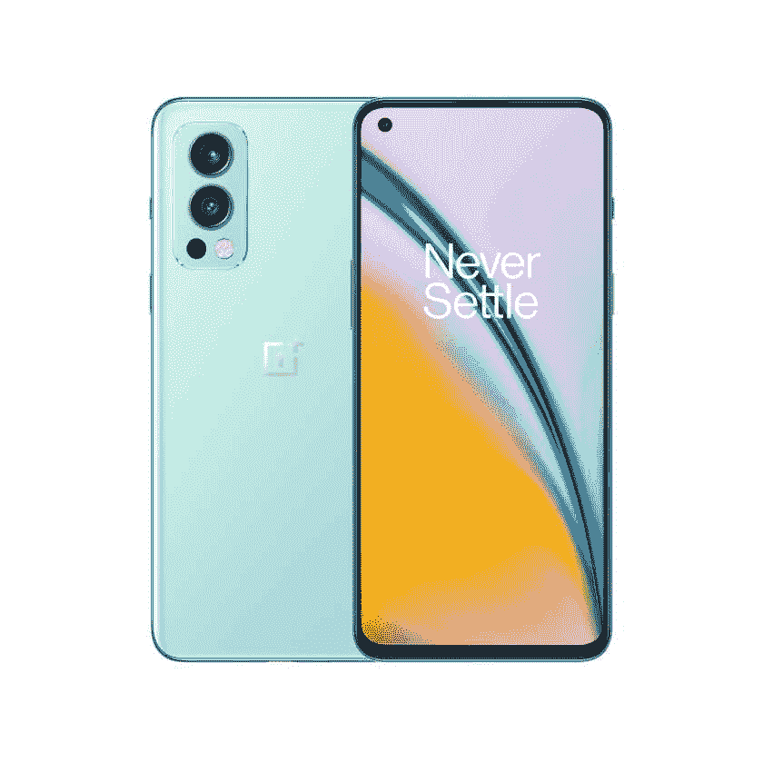

# 一加诺德 2 评论:很容易我最喜欢的一加手机

> 原文：<https://www.xda-developers.com/oneplus-nord-2-review/>

一加诺德 2 是该公司的第一款产品。这是一加第一款采用联发科芯片的智能手机，也是第一款采用 OxygenOS 和 ColorOS 合并的[产品的智能手机。我并不是最初的 Nord 的最大粉丝，因为我发现它的价值定位不如你在欧洲能买到的其他智能手机。一加诺德 2 稍微改变了游戏规则，我对此印象深刻。](https://www.xda-developers.com/oxygenos-coloros-merger-inevitable/)

。bestawarddiv {

浮动:对；

宽度:20%；

边距:0.75em

边距-顶部:0；

}

一加 Nord 2 5G 作为高端中端设备的有力竞争者进入欧洲和印度市场，这在很大程度上归功于 Dimensity 1200 SoC。虽然由于一加 9 和一加 9 Pro 的存在，Nord 2 不能被称为真正的旗舰，但 SoC 确实是联发科迄今为止的旗舰。一加正指望标志性的一加体验来营销该设备，正如我的同事阿米尔·西迪基在他的[Nord 2](https://www.xda-developers.com/oneplus-nord-2-first-impressions/)第一印象中也提到的那样，一加的维度赌博获得了回报。

## 一加北部 2:规格

| 

规格

 | 

一加诺德 2 5G

 |
| --- | --- |
| **打造** | 

*   正面和背面的大猩猩玻璃 5
*   聚碳酸酯中框
*   颜色:
    *   灰色塞拉
    *   蓝雾
    *   绿色木材(印度独家)

 |
| **尺寸&重量** | 

*   158.9 x 732。x 8.25 毫米
*   189 克

 |
| **显示** | 

*   6.43 英寸 FHD+ AMOLED
*   90Hz 刷新率
*   20:9 宽高比
*   sRGB，展示 P3

 |
| **SoC** | 联发科天玑 1200-AI

*   6 纳米
*   1x ARM Cortex-A78 @ 3GHz
*   3x 臂皮质-A78
*   4x 臂皮质-A55

GPU: ARM G77 MC9 |
| **闸板&存放** | 

*   6GB LPDDR4X + 128GB UFS 3.1
*   8GB + 128GB
*   12GB + 256GB

 |
| **电池&充电** | 

*   4500mAh 电池
*   65W 翘曲充电

 |
| **安全** | 显示屏内指纹传感器 |
| **后置摄像头** | 

*   主要:索尼 IMX 766，50MP，f/1.88，OIS，PDAF，咖啡馆
*   次要:800 万像素，超宽，120 FoV，f/2.25
*   第三级:200 万像素，单色，f/2.5

视频:

*   4K @ 30fps
*   1080 @ 30、60、120fps
*   720p @ 30，60，240fps

 |
| **前置摄像头** | 32MP 索尼 IMX 615，f/2.45 |
| **端口** | USB Type-C USB 2.0 |
| **音频** | 双立体声扬声器 |
| **连通性** | 

*   4×4 MIMO，DL 18 类/UL 13 类
*   WiFi 802.11 a/b/g/n/ac/ax，2×2 MIMO
*   支持 aptX、aptX HD、LDAC 和 AAC 的蓝牙 5.2
*   国家足球联盟
*   GNSS:
    *   全球（卫星）定位系统
    *   GLONASS
    *   “伽利略”号
    *   北斗
    *   纳维克
*   双 5G sim 卡插槽，nano-SIM 卡

 |
| **软件** | [基于 Android 11 的 OxygenOS](https://www.xda-developers.com/tag/oxygenos/) 11.3 |
| **其他特性** | 警报滑块 |

***关于本次评审:**2021 年 7 月 20 日收到英国一加发来的一加诺德 2 进行评审。我的同事阿米尔·西迪基(Aamir Siddiqui)也收到了来自印度一加的一个设备，用于在 T4 进行实际操作。一加没有对本次审查的内容提出任何意见，也没有对以前的实践提出任何意见。*

## 一加北部 2:设计

一加诺德 2 的特点是很多“一加”设计语言，尤其是在相机颠簸。它看起来*非常*类似于一加 9 中的相机凸起——一个大传感器在另一个上面，一个小传感器和一个手电筒。我对此的想法是，一加希望 Nord 2 看起来像一款旗舰产品，即使它不是。侧面还有令人垂涎的提醒滑块，可以用来在静音、仅振动和完整通知声音之间切换。

我的蓝色烟雾单元的背面一点指纹都没有

我的岚蓝色单元的背面没有吸引*任何*指纹。它有一种光滑的感觉，在手中有点滑，但如果你能克服这一点，那么这是一个完美的无壳智能手机。我有点惊讶地看到，诺德蓝没有再现(鉴于“诺德”甚至在名称中)，我更喜欢原来的诺德蓝的样子。尽管如此，如果它不符合你的口味，你可以选择灰色 Sierra 的设备，以获得更柔和的外观。

一加诺德 2 无论如何都不是一款紧凑型智能手机，但它肯定比我今年用过的一些旗舰手机短一点。我可以用一只手或多或少地连续使用它，偶尔需要用另一只手来敲击显示屏顶部的一些东西。它也很轻，因为它更小，所以在这方面也很舒适。我可以在上面毫无问题地观看 YouTube 和《网飞》,尽管我更喜欢大屏幕的媒体消费。

手机背面是玻璃，侧面是带有“金属化”涂层的塑料。它基本上只是一种光滑的塑料，当你拿着它的时候你能感觉到。

## 一加诺德 2:展示

一加诺德 2 采用全高清、90Hz AMOLED 面板，尺寸为 6.43 英寸，长宽比为 20:9。它变得足够亮(尽管在阳光直射下很难看到)，并且看起来适合各种内容。对于一些想要进入游戏或者喜欢在智能手机上消费大量内容的人来说，打孔相机可能是一个眼中钉，但除此之外，对于普通用户来说，它完全没问题。

我发现显示也非常一致。测试显示器亮度不一致的一个简单方法是将亮度设置为最低，在谷歌浏览器中打开一个隐名标签，然后查看显示器。过去，一些一加设备的屏幕一致性一直是个问题，但我的一加诺德 2 设备或多或少是完全一致的。请记住，并非所有的 AMOLED 面板都是完全相同的，即使这不是我所在单位的问题，也可能是你所在单位的问题。同样重要的是要理解这是一个公认的小众案例，对于大多数人来说，除了打开一个隐名标签并积极地*寻找*一个非统一的显示之外，这甚至不是什么值得注意的事情。请放心，在日常使用中，它是完全不引人注意的。

从眼睛测试来看，显示器似乎一直保持着 90 赫兹的刷新率。这里没有花哨的显示技术，这意味着你不会得到 HDR 的支持或超级明亮的显示器。也没有 10 位颜色支持，使这成为一个相当标准的面板。在这个价位上，这没什么不好，但值得一提。这是一个相当实用的展示，可以完成工作而不会在顶部留下任何绒毛。

## 一加诺德 2:性能

对许多人来说，一加诺德 2 的性能可能是最大的问号。联发科从来不以性能著称，甚至在几年前因为无法与高通竞争而停止生产旗舰 SOC。该公司已经看到了它的 Dimensity 系列芯片的复兴，到目前为止，我尝试的每一款都有着奇妙的体验。联发科天玑 1200 人工智能也不例外。

联发科天玑 1200 AI [是联发科和一加](https://www.xda-developers.com/oneplus-nord-2-oliver-zhang-interaction/)合作的一部分，非常强调——你猜对了，人工智能。Dimensity 1200 采用八核 SoC，其中一个“主要”Cortex-A78 内核的主频高达 3GHz，而其他三个性能内核是 Cortex-A78 内核，主频高达 2.6GHz。其他四个内核是 Cortex-A55，主频高达 2.0GHz。

至于 GPU，它配备了九核 ARM Mali-G77 GPU，支持联发科的 HyperEngine 3.0 游戏技术。这包括 5G 呼叫和数据并发支持，以及用于提高触摸屏响应能力的多点触摸增强。完整的组合还允许支持游戏和 AR 应用中的光线跟踪，它还支持超级热点省电。

所有这些转化成的是一款以性能为导向的智能手机，它肯定会取得成功。

所有这些转化成的是一款以性能为导向的智能手机，它肯定会取得成功。毫无疑问，它比最初在 Nord 使用的高通骁龙 765G 更上一层楼，就原始性能而言，它与高通骁龙 870 处于同一水平。我没有注意到人工智能以任何方式、形式或形式得到了提升，但它显然主要为 OxygenOS 的一些基于人工智能的功能提供了动力。

### 持续的性能、存储速度和游戏

一加诺德 2 有非常好的持续性能，甚至与小米 11 Ultra 或多或少地针锋相对。在谷歌 Play 商店上使用 CPU 节流测试应用程序进行了半个小时的压力测试后，它的性能节流到了 74%。这意味着长时间游戏对性能的影响应该很小，只有最繁重的游戏才会拖累性能。存储速度也不会成为你最喜欢的游戏和应用程序的瓶颈，因为 UFS 3.1 存储速度非常快。像 *COD Mobile* 和 *PUBG* 这样的游戏加载速度很快，没有明显的速度问题。

我一直在智能手机上玩 Wii 游戏和 GameCube 游戏，我发现一加诺德 2 的游戏性能非常合适，尽管显然与典型的旗舰智能手机不在同一水平上。像*《辛普森一家:Hit & Run* 这样的游戏在 [Dolphin Emulator](https://www.xda-developers.com/dolphin-emulator/) 上玩得很好，但显然不能在骁龙 888 上玩，偶尔会出现我认为是中档智能手机出现的问题。*马里奥赛车 Wii* 玩得不错，新超级马里奥兄弟*Wii*也是如此。它不会是一个完美的仿真设备，但就其价格和性能而言，作为一台预算有限的便携式仿真机，它做得相当不错。

## 电池和充电

从我对这款手机的使用来看，联发科 1200 AI 并不是一款特别耗电的芯片组，尽管它也不是我用过的最省电的芯片组。根据我的测试，它的电池寿命似乎比高通骁龙 888 略好，但仍不令人难以置信。这是相当多变的，从频繁使用的四小时屏幕时间到长达六小时。六个小时比我在骁龙 888 设备上用的时间长得多，但对于谷歌 Pixel 5 这样的设备来说，这只是平均时间。

一加诺德 2 的充电速度让我可以接受有时很差的电池续航时间。这款设备的功率为 65 瓦，只需半小时就能充满电，15 分钟就能充满 60%的电量。虽然不是每个人都适合用电池寿命来换取充电速度，但我通常更喜欢稍微牺牲电池寿命来换取更快的充电速度。一加诺德 2 的电池寿命当然不差，基本上能让我一整天都用得上，但如果我在离开家或任何有插头的地方之前真的需要几分钟，也很容易给它充电。

## 照相机

[sc name = " pull-quote-right " quote = "一加诺德 2 有一个很棒的主摄像头传感器，句号。"]一加诺德 2 有一个有趣的相机排列，因为主传感器(具有光学图像稳定功能)与一加 9 系列广角相机的传感器是同一传感器。这里没有哈苏品牌，但这款相机能够拍出一些非常棒的照片。一加诺德 2 有一个伟大的主要相机传感器，句号。不适合中档，但总的来说非常好，即使其他传感器不是很好。广角相机完成工作，单色相机仅仅是*存在*。我认为一加在这里取得了很好的性价比。

https://www . Flickr . com/photos/145036207 @ N04/相册/72157719727942990

在视频性能方面，一加诺德 2 给我留下了深刻的印象。我参加了一年多来在英国的第一场音乐会，一加诺德 2 号处理得很好。我有点担心我只带了 Nord 2 来拍照和录像，以防它不够好，但它几乎和我能带的其他东西一样好。稳定也是显而易见的。

## 软件:基于 ColorOS 的 OxygenOS

这是第一款由 OxygenOS 和 ColorOS 合并而成的手机。这是很长一段时间以来 OxygenOS 最好的体验之一，但是仍然存在一些问题。对于初学者来说:“OxygenOS”显然是*ColorOS 上的一个皮肤，一些元素几乎没有改变。相机应用程序只是 OPPO 相机(尽管包装名称说它是“OPLUS 相机”)，配有 OPPO 的图标，电池统计页面直接从 ColorOS 中提取。我对此没有任何问题，但有趣的是在某些地方合并是如此明显。*

 *[sc name="pull-quote" quote= "有趣的是，ColorOS 和 OxygenOS 在某些地方的融合是如此明显。"]

ColorOS 没什么问题，也很久没出现过其他安卓变种不存在的大问题了。OPPO Find X3 Pro 上的 ColorOS 是我最喜欢的 Android 变体，我对它没有很多不好的地方可以说。如果合并可以简化添加功能的过程，并最终带来更好的体验，那么在我看来，它没有任何问题。

然而，我遇到了一个与通知相关的问题。以前，一加智能手机和通知通常会出现问题。我们一次又一次地看到它，它是迄今为止任何一加智能手机上最一致的问题之一。有趣的是，只有*和*有懈怠。这并不是说通知被延迟了，而是说它们根本就没有出现。我和其他提到同样问题的评论者谈过，但那些评论者也证实，和我一样，这也是他们唯一有问题的应用。

[sc name = " pull-quote-right " quote = " OxygenOS 在 Nord 2 上如此接近完美"]我在 Gmail 上没有问题，在 WhatsApp 上没有问题，在 Facebook Messenger 上也没有问题----然而所有这些都是我在以前的 OxygenOS 设备上遇到过问题的应用程序，而且*如此接近完美*。我希望一加发现这个问题，并解决它，因为如果他们这样做，我几乎没有抱怨。[不要杀死我的应用](https://www.xda-developers.com/dontkillmyapp-benchmark-test-background-app-killing/)对 OPPO 的 ColorOS 通知交付评价很高，我相信这在很大程度上已经被带到了一加诺德 2。

在功能方面，所有你喜欢的 OxygenOS 功能都在一加诺德 2 上。它有相同的用户界面，一加书架(作为一加启动器的一部分)，游戏模式，禅模式，并行应用程序等等。我没有发现任何我以前在 OxygenOS 中积极使用的功能没有包括在这里，我想该公司已经带来了所有最常用的功能，如果不是所有功能的话。

## 一加诺德 2 是一加的回归

我一般不喜欢纪念公司回归“以消费者为中心”的忠诚度，因为任何公司的动机都是为了盈利。无论如何，任何试图为消费者带来更低成本手机的举动都仍然符合公司的利益，因此他们未来可以在他们的其他产品上赚钱。尽管如此，一加诺德 2 公司还是成功地利用了“永不妥协”的口号，我认为这是该公司很久以来从未有过的。

双立体声扬声器很不错(虽然一般来说，*顶部的那个不是很明显)，电池续航时间很好，有 NFC，快速充电，一个很棒的摄像头，你甚至可以在盒子里得到一个附带的外壳和充电器。这是该公司以比我预期的低得多的价格组装的一个非常好的一体化包，基本型号的价格为₹29,999€399 英镑。联发科天玑 1200 绝对配得上旗舰智能手机，然而它却出现在了一加诺德 2。对大多数人来说，性能上没有妥协，这才是最重要的。*

 <picture></picture> 

OnePlus Nord 2

##### 一加诺德 2 5G

一加诺德 2 5G 是一个伟大的溢价中端设备。凭借 1200 SoC 的容量和出色的整体封装，Nord 2 还保留了最初 Nord 的许多优点，为潜在消费者提供了一个绝佳的选择。

我是一加诺德 2 的忠实粉丝，我认为这是该公司在很长一段时间内制造的最好的手机之一。虽然我不是最初的 Nord 的狂热粉丝，但这款手机肯定是不同的，我认为它平衡的规格表和大大改进的软件将有助于它在销售方面比最初的 Nord 走得更远。这是名副其实的旗舰*体验*为少。*