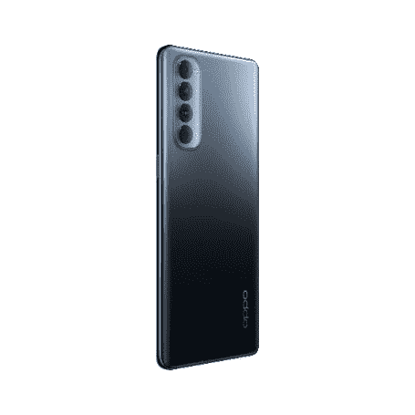

# OPPO Reno 4 Pro(全球)评测:高端装备中的中档游侠

> 原文：<https://www.xda-developers.com/oppo-reno-4-pro/>

按销量计算，OPPO 是全球第五大智能手机品牌。作为中国步步高电子集团旗下的第一个手机品牌，OPPO 在整个 2010 年代一直主导着中国和亚洲部分地区的智能手机市场。然而，它对西方的大多数用户来说仍然是陌生的，直到其旗舰产品 [OPPO Find X](https://www.xda-developers.com/oppo-find-x-pop-up-camera/) 在 2018 年凭借其机械驱动的相机模块引起了世界的关注。在接下来的一年，即 2019 年， [OPPO 发布了 Reno 系列](https://www.xda-developers.com/oppo-reno-10x-zoom-launch/)，强调了风格和性能的健康融合。随着季度更新，OPPO Reno 系列已经有四代历史了——即使不包括中国和全球型号的变化。值得称赞的是，尽管全球疫情和[在全球推出 OPPO Reno 4 和 OPPO Reno 4 Pro】，OPPO 仍保持了步伐。这两款 Reno 4 系列智能手机，尤其是 Pro，尽管内部组件平平，但却穿着高档服装。](https://www.xda-developers.com/oppo-reno-4-pro-global-90hz-curved-super-amoled-display-65w-charging-snapdragon-720g/)

OPPO 将 Reno 4 Pro 的人体工程学和美学设计与充满活力和流动性的 90Hz Super AMOLED 显示屏和 65W 充电等古怪功能捆绑在一起。这款手机似乎是任何希望智能手机拥有迷人外观和可靠性能，但对性能或游戏没有高期望的人的理想选择。智能手机面临的唯一挑战是高昂的价格，堪比旗舰杀手，如[一加 7T](https://www.xda-developers.com/oneplus-7t-review-premium-practical-smartphone/) 和 [Realme X2 Pro](https://www.xda-developers.com/realme-x2-pro-xda-review/) 。值得注意的是， [OPPO 在全球发布之前在中国推出了 Reno 4 系列](https://www.xda-developers.com/oppo-reno4-pro-snapdragon-765g-65w-supervooc-20-charging-china-launch/)，但这些设备在规格方面与全球版本有很大不同。

我用 OPPO Reno 4 Pro 的全球变型已经一个月了。在这篇评论中，你会发现我对其高端设计是否有助于智能手机超越中端处理能力的看法！开始之前，先来看看 OPPO Reno 4 Pro 的中国版和全球版的规格:

## OPPO Reno 4 Pro 中国和全球规格

| 规范 | OPPO Reno 4 Pro 中国 | OPPO Reno 4 Pro 全球 |
| --- | --- | --- |
| **尺寸和重量** |  |  |
| --- | --- | --- |
| **显示** |  |  |
| --- | --- | --- |
| **SoC** |  |  |
| --- | --- | --- |
| **存储器和 RAM** | 8GB + 128GB | 8GB + 128GB |
| --- | --- | --- |
| **电池和充电** |  |  |
| --- | --- | --- |
| **后置摄像头** |  |  |
| --- | --- | --- |
| **前置摄像头** |  | 32MP |
| --- | --- | --- |
| **指纹传感器** | 显示器内光学指纹 | 显示器内光学指纹 |
| --- | --- | --- |
| **安卓版本** | 基于 Android 10 的 ColorOS 7.2 | 基于 Android 10 的 ColorOS 7.2 |
| --- | --- | --- |

**关于这篇评测:** OPPO 印度借给我们一台 8GB+128GB 的 Reno 4 Pro 的变形本。然而，他们没有对这一审查的内容提出意见。我已经用了大约一个月的电话了。

* * *

## 设计

由于采用了超薄结构，OPPO Reno 4 Pro 非常方便拿在手中。背板的弯曲边缘增加了设计的人体工程学。虽然这款智能手机的厚度只有 7.7 毫米，但背面和显示屏的锥形边缘让它看起来更薄。

OPPO Reno 4 Pro 有*星空*和*丝滑白*两种颜色。后面板上的光滑表面肯定感觉像丝绸，证明了这个名字的合理性。虽然 Reno 4 Pro 的背部给人的印象是由磨砂玻璃组成，但它是由优质塑料制成的。中国版智能手机使用塑料，而不是玻璃，因此重量仅为 161 克。更轻的重量使手机更容易操作，也更受欢迎——尤其是当大多数智能手机制造商实际上抛弃了可用性，增加了智能手机的重量，为它们增加了更多功能。

尽管由塑料制成，但背部感觉耐用而坚固。虽然汗水很快沉积在表面，但并不明显可见。同时，机身也是中度耐刮擦。

OPPO Reno 4 Pro 背面的摄像头阵列位于一个稍微凸起的平台顶部。与背面的其他部分不同，这个凸起的平台具有镜面光洁度。虽然这个平台看起来不像一个摄像头凸起，但所有四个摄像头都单独突出，这实际上与摄像头凸起相同。尽管材料不同，但完成以及相机周围的环使 Reno 4 Pro 看起来与 iPhone 11 系列非常相似。

与背板一样，OPPO Reno 4 Pro 上的侧轨也是由高级塑料材料制成的。中间框架是弯曲的，中间是锥形的，而顶部和底部是平的。框架的表面看起来像陶瓷，但摸起来像柔软的橡胶——尽管它是由相对刚性的材料制成的。电源按钮位于框架的右侧，由闪亮的绿色细槽突出。音量调高和调低的独立按钮位于左侧。底部有单声道扬声器、主麦克风、USB Type-C 端口和耳机插孔(谢天谢地！).顶部有一个辅助降噪麦克风，位于 SIM 卡托盘的入口旁边。

毫无疑问，OPPO Reno 4 Pro 优雅的设计击败了大多数其他中游侠的风格声明。方便和符合人体工程学的构造以及背面独特的醒目光泽使手机难以抗拒，尤其是如果外观是智能手机中最重要的功能之一。

引人入胜的外观与高大、明亮、充满活力的显示屏相得益彰。虽然显示屏在尺寸上与一加 7T 匹配，但 OPPO 决定弯曲较长的边缘有助于智能手机的人体工程学设计。

* * *

## 显示

OPPO Reno 4 Pro 配备了 6.5 英寸的全高清+ Super AMOLED 显示屏，左上角有一个用于自拍相机的微型打孔切口。该显示器的屏幕与机身的比例约为 92%，显示器顶部和底部的细条验证了这一点。

如上所述，显示屏的轻微弯曲边缘使智能手机更容易使用，而不会妨碍屏幕的使用。除了智能手机的重量之外，边缘的曲率便于在没有另一只手帮助的情况下将拇指伸向显示屏的远边缘。

OPPO 对 Reno 4 Pro 的显示质量有很高的要求，从 800 尼特的峰值亮度开始，YouTube 上 HDR 内容的峰值亮度增加到 1100 尼特。这一特点使 OPPO 能够将 Reno 4 Pro 定位于高端和旗舰杀手级智能手机。虽然我确实缺乏合适的设备来验证 OPPO 的说法，但我仍然可以自信地说，Reno 4 Pro 的显示屏在大多数情况下都很亮，包括明亮的阳光照射在它的前面。在室内，我将亮度保持在 25-30%左右，任何比这更亮的东西都会让眼睛感到极度不适。

OPPO 吹嘘该显示器的高对比度为 500 万:1。在实际使用中，显示器明显具有带有中性白平衡的深黑色。除了被调到非常高的值，显示器的亮度可以降低到比 Super AMOLED 显示器的竞争对手低得多。

此外，OPPO 还表示，在生动模式下，显示器覆盖了 100%的 DCI-P3 色域。由于闪烁的色彩，显示器感觉充满活力，并为电影或其他视频内容提供了非常愉快的观看体验。如果你不喜欢鲜艳的颜色，你也可以切换到标准模式，选择相对暗淡的颜色，这样对眼睛比较柔和。

OPPO Reno 4 Pro 的显示器通过了 HDR10 功能认证，而中国版本的显示器则通过了 HDR10+认证。这使你可以在 YouTube 上观看 HDR 的视频，HDR 的内容在网飞、亚马逊 Prime Video 或类似的 OTT 视频服务上不可用。

Reno 4 Pro 的显示屏还支持边缘照明功能，每次收到屏幕锁定的通知时，显示屏边缘都会出现耀眼的动画。您可以从三种不同的颜色选项中进行选择，包括霓虹紫、海洋蓝和琥珀橙。

Reno 4 Pro 还支持永远显示(AOD)，但您将无法使用设置中的搜索找到该选项。对于 AOD，您可以从一系列数字和模拟表盘中进行选择。您还可以选择是否在此屏幕上显示通知。不幸的是，无论有没有 AOD，都没有点击唤醒功能，你需要按下电源按钮才能与智能手机互动。

OPPO Reno 4 Pro 的显示屏具有 [90Hz 的刷新率](https://www.xda-developers.com/smartphone-display-refresh-rates-explained/)，这意味着它每秒更新 90 次，与传统的 60Hz 显示屏相比，提供了更平滑的滚动和动画。您可以将刷新率切换回 60Hz 以节省电池。不幸的是，Reno 4 Pro 上 90Hz 显示器的效用仅限于滚动和动画，它不支持游戏。更糟糕的是，智能手机在网络浏览器上的刷新率会自动回落到 60 赫兹，包括谷歌 Chrome 和 OPPO 自己的浏览器。

在 90Hz 和 60Hz 显示模式之间，当涉及到颜色校准时，会有轻微的变化，并且这种差异在非常低的亮度下非常明显。尽管在大多数照明条件下输出的颜色相当准确，但显示器在 90Hz 时仍以红色为主，在 60Hz 时则趋向绿色。令人高兴的是，这些特征只有当你在光线昏暗或黑暗的房间里使用手机时才看得见。

尽管有这些缺点，OPPO Reno 4 Pro 上的显示屏还是很漂亮的。它明显比一加 7T 的显示屏更有活力，离轴色偏也低得多。如果消费视频内容或尽情观看是你对新智能手机的主要要求之一，OPPO Reno 4 Pro 是一个绝佳的选择。唯一的缺点是对 OTT 应用上的 HDR 回放缺乏足够的支持。

* * *

## 用户体验

Reno 4 Pro 运行在 OPPO 基于 Android 10 的最新版本定制皮肤 [ColorOS 7.2](https://www.xda-developers.com/oppo-coloros-7-2-android-10-reno4-pro/) 上。ColorOS 7.2 在视觉上与之前基于 Android 10 的版本相似——包括 [ColorOS 7](https://www.xda-developers.com/oppo-coloros-7-review/) 和[ColorOS 7.1](https://www.xda-developers.com/coloros-7-1-review-on-oppo-find-x2/)——但它有一些额外的功能来改善用户体验。其中一些附加功能包括一个新的图标下拉手势，可以缩小图标网格，以便主屏上的所有图标都可以轻松访问。当您从显示屏的一个底角向内滑动时，该手势将被激活。你可以在图标上拖动手指来启动一个应用程序，而不用动一根手指。这个手势目前只能在主屏幕上使用，不能在应用抽屉上使用。这里有一个演示:

虽然图标下拉是一个有用的特性，但它相当不可靠。它也干扰了谷歌助手热门角落手势。

OPPO 还在 ColorOS 7.2 中添加了一系列有趣的功能，作为 OPPO Lab 应用的一部分，包括一个很酷的铃声制作工具，让你通过调整音频的复杂性或你希望它有多放松等属性来创建自己的铃声。你也可以根据自己的喜好改变铃声的速度。这个功能让我怀念 21 世纪初诺基亚手机上的复古 T9 铃声创建器。

OPPO Lab 的另一个功能是一个纺车，通过随机选择选项来帮助你做出不重要的决定。但是，您需要一个 OPPO 帐户来创建自己的决策轮。ColorOS 还附带了一堆令人兴奋的动画，比如下面这个删除应用的动画。

除了这些相当有趣的功能，OPPO Reno 4 Pro 还配备了谷歌手机、联系人和信息，取代了 OPPO 的应用程序。

但是尽管有这些有用的功能，ColorOS 还有很大的改进空间。我对影响用户体验的界面有些不满。这些问题如下:

*   在 ColorOS 中，您只能向一个方向推送来清除通知阴影中的通知。向相反方向滑动会显示休眠、静音或阻止通知的选项。
*   您不能直接从主屏幕卸载应用程序，该选项仅限于应用程序抽屉或单个应用程序的设置。
*   自动填充等谷歌服务集成得很差，它们只是偶尔起作用。
*   有一大堆预装的膨胀软件。
*   您可以更改应用程序图标的形状，但仅限于快速设置磁贴过时的方形设计。
*   在主屏幕上向下滑动会打开一个通用搜索选项，而不是展开通知面板，并且该设置不能更改。

总的来说，ColorOS 是有益和噱头功能的混合物。图标大量使用柔和的颜色，视觉对象之间的间距不足，会让某些用户觉得界面太大。对于想要最小化 UI 的用户，ColorOS 将包含一个陡峭的学习曲线。

* * *

## 性能和游戏

OPPO Reno 10X 变焦版是唯一一款由旗舰 SoC 骁龙 855 驱动的 Reno 设备。与此同时，所有剩余的 Reno 设备都采用了中端芯片组，OPPO Reno 4 Pro 也不例外。雷诺 4 Pro 从[高通骁龙 720G](https://www.xda-developers.com/qualcomm-snapdragon-720g-662-460-navic/) 移动平台获得动力，再加上 8GB 内存。该芯片组在相对便宜得多的设备上更常见，如 [Realme 6 Pro](https://www.xda-developers.com/realme-6-pro-review/) 、[小米的 Redmi Note 9 Pro 系列](https://www.xda-developers.com/xiaomi-redmi-note-9-pro-review-snapdragon-720g-48mp/)和 [POCO M2 Pro](https://www.xda-developers.com/poco-m2-pro-review/) 。

2020 年 1 月推出的骁龙 720G 借用了骁龙 730G 的 CPU 和 GPU 微体系结构，同时带来了改进的图像处理器、Wi-Fi 6 连接和双波段 GNSS，包括支持印度最近发射的 NavIC 定位卫星。我们在 Redmi Note 9 Pro 评测中比较了骁龙 720G 的 CPU 和 GPU 性能，结果在这种情况下，预计可以与 OPPO Reno 4 Pro 媲美。同时，由于其 90Hz 的显示屏，我们预计新的 Reno 4 Pro 将具有更平滑的滚动和更流畅的用户体验。

在典型的日常使用中，OPPO Reno 4 Pro 不会面临任何可能让你想起中端芯片组的挑战。性能一贯流畅，在使用智能手机处理日常任务(如浏览网页、发送消息、玩轻度游戏等)时几乎没有延迟。然而，当涉及到更高要求的任务时，例如运行像 *PUBG Mobile* 这样的重度游戏，该芯片组可能不会满足每个用户的要求，特别是对于一款价格与一加 7T、Realme X2 Pro 或[小米 Mi 9T/Redmi K20 Pro](https://www.xda-developers.com/redmi-k20-pro-xiaomi-mi-9t-pro-review-flagship/) 等旗舰杀手不相上下的手机来说。

为了处理高要求任务产生的热量，OPPO Reno 4 配备了一个由石墨制成的散热系统，并用铜箔包裹。虽然该公司没有引用这种机制冷却手机的程度，但我们通过运行 CPU 节流测试来测试设备的任何节流。我们在正常使用和充电两种不同情况下，在设备上运行了 30 分钟的基准测试，得到了以下结果:

在不充电的情况下，OPPO Reno 4 Pro 在连续 10 分钟的繁重任务后开始节流。节流的程度是相当合理的，没有理由担心。充电时，性能会降低，而节流程度会增加，以减轻超高速 65W 充电产生的热量。但即便如此，这种表现也没有受到惊人的打击。

当谈到实际的游戏时，Reno 4 Pro 确实变得相当热，但在诸如 *PUBG* 或 *COD Mobile* 等游戏上没有任何可见的帧速率下降。不幸的是，尽管有 90Hz 的显示，你还是不能享受 90fps 的游戏，这是对偶尔玩游戏的人的唯一限制。有趣的是，当我们运行上述 30 分钟长的基准测试时，OPPO Reno 4 Pro 充满电，我们将在下一部分讨论这一优点。

* * *

## OPPO Reno 4 Pro:电池和充电

帮助 OPPO Reno 4 Pro 熬过一天的是 4000mAh 电池。这款智能手机的非凡之处在于其通过 OPPO 专有的 SuperVOOC 协议进行的超高速 65W 充电，根据官方说法，该协议可以在 40 分钟内充满电池。

在我们的测试中，电池电量在短短 14 分钟内从 1%增加到 50%，速度惊人。手机在 28 分钟内达到 90%的电池电量，但超过这个时间后充电速度会减慢，这可能是为了防止手机过热。从 90%到 100%又花了 17 分钟，其中 13 分钟花在 96%和 100%之间。下图显示了电池百分比随时间的变化，您可以确定 90%后充电率的突然下降。

4000mAh 的电池有很好的输出，每次充电我可以轻松获得 24 到 30 小时的备用电池。这包括在 90Hz 刷新率下超过 5 小时的屏幕打开时间(SOT ),以及一些休闲游戏的适度使用。在 PCMark 电池测试中，Reno 4 Pro 持续了近 11 个小时，显示屏设置为 90Hz。

电池寿命延长的原因之一是智能手机倾向于杀死在后台运行的第三方应用程序。为了衡量 OPPO Reno 4 Pro 上的应用程序杀戮有多激烈，我们运行了一个名为 [DontKillMyApp](https://www.xda-developers.com/dontkillmyapp-benchmark-test-background-app-killing/) 的基准测试。根据基准测试，Reno 4 Pro 的得分仅为 46%，100%是最好的(即没有应用程序查杀)，零是最差的状态。

你可以通过从电池设置中打开高性能模式或关闭单个应用的电池优化来减轻这种应用杀死。电池寿命稍短应该不是问题，特别是因为 65W SuperVOOC 充电器可以快速充电。

* * *

## 照相机

OPPO Reno 4 Pro 背面的四摄像头设置由 48MP 主摄像头、8MP 超广角摄像头、2MP 微距摄像头和 2MP 单色摄像头组成。这种相机阵列不同于 OPPO Reno 4 Pro 的中国版本，后者配备了 48MP 主相机、12MP 超广角相机和 13MP 长焦相机以及激光自动对焦。

48MP 主摄像头使用去年最受欢迎的索尼 IMX586 传感器以及 f/1.7 光圈镜头。默认情况下，该相机使用像素宁滨捕捉 12MP 图像，但您也可以切换到 48MP 模式来拍摄全分辨率图像。8MP 超广角相机使用 f/2.2 光圈镜头，有助于捕捉 119°宽视野。与主摄像头相比，200 万像素的微距摄像头具有固定的焦距，可以捕捉劣质的细节和颜色。当您靠近任何对象时，相机应用程序会自动切换到此相机，但您不能手动选择此相机。最后，200 万像素的单色摄像头有望提高图像的清晰度。

在正面，OPPO Reno 4 Pro 配备了一个 32MP 自拍相机，位于单孔打孔切口内。与后置摄像头不同，前置摄像头捕捉全分辨率图像，没有任何像素宁滨。

说到视频，OPPO Reno 4 Pro 可以捕捉 30fps 的 4K 视频或高达 60fps 的全高清视频。这款智能手机还配备了超稳定的 OIS 模式来稳定视频，尽管如果你移动得很快，这不会有太大影响。

下面是用 OPPO Reno 4 Pro 拍摄的一堆图像。

由于新冠肺炎运动的警告和印度越来越多的新冠肺炎病例，我们正在避免广泛的摄像审查。

* * *

## OPPO Reno 4 Pro:结论

OPPO Reno 4 Pro 肯定有很多东西可以提供——从其赏心悦目的外观和符合人体工程学的设计到出色的显示屏和令人印象深刻的快速充电。这是一款优雅的手机，不以性能为中心。尽管采用了中端处理器，Reno 4 Pro 并没有任何缺陷。对于非游戏玩家来说，它无疑是一个值得的高级选择。这款智能手机的重点领域是娱乐和可靠性。

虽然 OPPO Reno 4 Pro 拥有令人愉悦的极简外观，但它提供的软件体验却完全相反。ColorOS 仍然缺乏高端智能手机所要求的流畅度，用户体验不连贯，尤其是在使用谷歌应用程序时。如果你能消化这一点，OPPO Reno 4 Pro 将是满足你需求的合适选择。

最后，我希望 OPPO 能像在中国一样，在全球范围内发布一些更鲜艳的颜色。这将使已经富有美感的设计更加令人兴奋。你可以在印度₹34,999 买到 OPPO Reno 4 Pro(约 478 美元)。

 <picture></picture> 

OPPO Reno4 Pro

##### OPPO Reno4 Pro

凭借迷人的设计和惊人的 65W 快速充电，OPPO Reno 4 Pro 是任何想要整天狂欢观看而不用担心手机充电的人的绝佳选择。