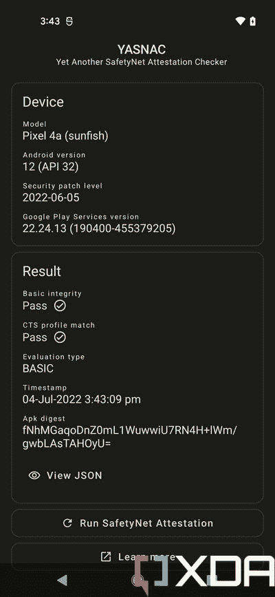

# Pixel Experience 12 实践:这是您从官方版本中获得的内容

> 原文：<https://www.xda-developers.com/pixel-experience-12-hands-on/>

对于许多智能手机爱好者来说，谷歌 Pixel 设备上的软件是普通 Android 体验的缩影。与准系统的 AOSP 版本相比，它有许多难以移植到其他设备的创新功能。这就是 Pixel Experience 定制 ROM 的用武之地。

早在 2017 年，定制 ROM 最初是由 XDA 知名开发者 [jhenrique09](https://forum.xda-developers.com/m/jhenrique09.6519039/) 作为一个实验项目开始的，由于用户希望模仿谷歌 Pixel 系列的软件体验，定制 ROM 的受欢迎程度呈指数级增长。 *jhenrique09* 决定开源代码库，以便其他开发者可以贡献和移植 PixelExperience(通常风格化为“Pixel Experience”和“PE”)到更多的设备上。现在，该项目致力于成为 OEM ROM 级别的定制 ROM，提供可靠性、稳定性，并通过精心打磨和精心护理来改进设备上的现有功能。

为了这次动手，我们主要在[红米 Note 7 Pro](https://forum.xda-developers.com/c/xiaomi-redmi-note-7-pro.8735/) 上试用了基于 Android 12L 的 Pixel Experience 12，这是一款停止接收 Android 10 更新的设备。这显示了售后 ROM 如何能够轻松地延长被制造商长期遗弃的设备的寿命。

## 像素体验:安装

Pixel Experience 项目以 ROM ZIP 文件的形式提供特定于设备的安装包，在解锁目标设备的引导加载程序后，可以使用像 TWRP 这样的[自定义恢复来进行侧加载。](https://www.xda-developers.com/how-to-install-twrp/)

如果你不想使用 TWRP，或者你的设备还没有官方的 TWRP 版本，你也可以选择像素体验恢复图像。它不像 TWRP 那样功能丰富，但足以完成工作。PE 恢复对于安装基于 Android 12(L)的 OTA 特别有用，因为 TWRP 还不支持 Android 的新加密方案。

与大多数其他定制 ROM 发行版不同，Pixel Experience 预装了一套基本的谷歌应用和服务。这样一来，就不需要[单独闪一个 GApps 包](https://www.xda-developers.com/download-google-apps-gapps/)。

## Pixel 体验:首次启动和设置向导

成功安装后，你应该会在重启手机时看到像素风格的启动动画。第一次运行时的设置向导也是以像素为主题的，它会引导您选择您喜欢的用户界面语言、时区和配置安全设置(例如注册您的指纹)。由于 Google Play 服务是开箱即用的，您还需要完成恢复您的 Google 帐户和应用程序的设置过程。

## 像素体验:启动器和预装应用

启动 ROM 后，你首先注意到的是启动程序。对于 Pixel 体验，它是来自谷歌的普通 Pixel 启动器应用程序。不仅是启动器，壁纸、图标、字体和许多其他像素的好东西也是预装的。对于一个经验丰富的 Android modder 来说，这可能不是最可定制的体验，但对于绝大多数用户来说，这可能是非常好的。

说起预装应用，你不会发现很多。Pixel Experience 开发人员不会发布任何用于基本生产力任务的内部应用程序，因为谷歌的产品最终会使它们变得多余。除了 Pixel 的标准应用程序套件，你会发现很少有第三方应用程序。官方的[维护者行为准则](https://github.com/PixelExperience/docs/blob/master/maintainers_code_of_conduct.md)在这方面提供了严格的指导方针。

然而，对于相机应用程序，一些设备维护者在他们的版本中包括了一个已知的[谷歌相机端口](https://www.xda-developers.com/google-camera-port-hub/)。这是因为未经触摸的谷歌摄像头 APK 很可能与特定非像素智能手机上的摄像头传感器不兼容。如果某个 OEM 厂商有合适的相机端口，你也可以在 Pixel Experience ROM 上找到它作为默认相机应用。

ROM 支持 OTA 更新。内置更新程序定期查询 PE 下载服务器，并在发现比已安装版本更新的版本后通知您。如前所述，如果你安装了 PE 恢复，那么你可以像普通的 Pixel 智能手机一样安装 OTA。

## 像素体验:Plus 变体

Pixel Experience 的最初目标是提供一个稳定的定制 ROM，同时还包括 Pixel 设备上可用的功能。然而，一些 modding 社区成员已经避免使用它，因为它没有一些人们所期望的核心定制 ROM 特性。这导致了 Pixel Experience Plus 的诞生，这是一个具有一些附加功能的官方版本。

“Plus”版提供了每个应用程序的音量设置、网络流量监控、凹槽隐藏支持和其他几个 UI 增强功能。您可以使用额外的手势，如三指滑动来拍摄屏幕截图。还有一个专用的 LiveDisplay 面板，用于调整颜色配置文件、显示模式、阅读模式和颜色校准。

在粒度可定制性方面，Pixel Experience Plus 远远领先于 vanilla 变体。例如，您可以轻松地修改状态栏图标，而无需额外的 SystemUI tuner 应用程序的帮助。由于许多内置模板，音量和电源按钮操作也是可定制的。你也可以调整锁定屏幕的各个方面，例如切换媒体封面艺术，音乐可视化，设备控制和其他细节。

## 像素体验:安全网

像素体验项目的[设备要求宪章](https://github.com/PixelExperience/docs/blob/master/device_requirements.md)禁止官方维护者伪造设备指纹。因此，你不会在非像素硬件上找到自定义的像素衍生指纹。

虽然 ROM 没有装载任何`su`二进制文件，但有很多因素(库存固件交叉刷新，现代设备上未锁定的引导程序状态等。)那会导致[安全网失效](https://www.xda-developers.com/how-to-pass-safetynet-android/)。也就是说，在官方支持的手机上，这种定制 ROM 的未接触实例应该可以通过 SafetyNet 开箱即用。

 <picture></picture> 

A Google Pixel 4a running official Pixel Experience ROM passes SafetyNet

## 像素体验:下载

如果你想在你的设备上尝试 Pixel Experience(或者它的 Plus 变种),你可以从下面链接的项目官方下载门户下载 ROM。目前的花名册中有一百多个条目——每个条目都有自己的 wiki 页面，详细介绍了 flash 的先决条件和安装说明。

**[像素体验下载入口](https://download.pixelexperience.org/)**

仅仅因为你的设备没有列在那里，并不意味着你现在不能享受像素体验。由于它的开源性质，我们的论坛上有许多设备的非官方版本，随着开发的进展，其中许多最终将成为官方版本。到目前为止，作为日常司机，他们中的大多数都非常稳定，偶尔会有小毛病。

最后但同样重要的是，XDA 认可的开发者 [ponces](https://forum.xda-developers.com/m/ponces.4128598/) 维持着[非官方的 GSI Pixel 体验端口](https://forum.xda-developers.com/t/4354695/)。如果您有一个 Project Treble 兼容设备，但尚未获得官方 PE 支持，您可以尝试一下 GSI。

## 支持像素体验

当构建一个定制的 ROM 时，包含大量的特性是非常诱人的。问题是，这往往会影响 ROM 的稳定性。Pixel Experience 在用户体验和可靠性之间取得了正确的平衡，而没有牺牲手机的整体速度和稳定性，这使得它成为定制 ROM 爱好者的热门选择。

该项目一直是社区的努力，依靠志愿者为社区的整体利益贡献自己的资源。如果你想帮助团队将定制的 ROM 翻译成你的语言，你可以按照这里的说明[来做](https://translate.pixelexperience.org/)。你也可以通过[向基础设施捐赠](https://download.pixelexperience.org/donate)来为基础设施成本做出贡献。