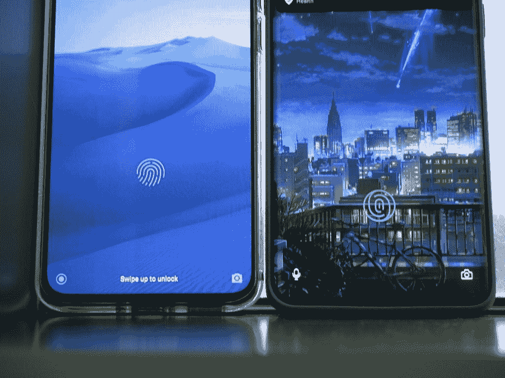

# POCO F2 Pro Review -一款电池冠军产品

> 原文：<https://www.xda-developers.com/poco-f2-pro-review/>

Pocophone F1 在一些市场上也被称为 POCO F1，于 2018 年底以杀手级价格推出旗舰规格。POCO F1 在智能手机爱好者中广受欢迎，是市场上最便宜的骁龙 845 智能手机之一，尽管它也不是没有妥协。一个巨大的类似 iPhone 的切口切入 1080p 液晶显示器，弱触觉，没有 NFC，等等，将 Pocophone F1 置于一个有趣的位置。当然，它有一个旗舰芯片组，但其内部的其余部分可以很容易地在一个中档手机上找到。

POCO F2 Pro 旨在以更低的价格再次提供旗舰体验，但随着高通骁龙 865 [对设备制造商](https://www.xda-developers.com/5g-push-unintentionally-killed-flagship-killer-this-year/)强制实施 5G，2020 年旗舰设备的平均价格大幅上涨。POCO F2 Pro 是今年我们将看到的唯一一款合理尝试宣传“[旗舰杀手](https://www.xda-developers.com/ditching-snapdragon-865-best-way-make-flagship-killer-2020/)”口号的设备，即使其营销口号不太走这条路线。相反，“非常酷”已经成为贯穿该公司营销材料的主要口号。

与上次不同的是，POCO F2 Pro 不是 POCO 品牌出售的唯一一款智能手机。F2 Pro 实际上是由另外两款智能手机加入的， [POCO X2](https://www.xda-developers.com/poco-x2-review-better-than-poco-f1/) 和[POCO M2 Pro](https://www.xda-developers.com/poco-m2-pro-launched-india-snapdragon-720g-5000mah-battery-33w-fast-charger/)——分别是一款中档和经济型智能手机。POCO F2 Pro 基本上只是一个更名的 Redmi K30 Pro 5G，而 POCO X2 是一个更名的 Redmi K30，POCO M2 Pro 是一个重新命名的 Redmi Note 9 Pro。不过，鉴于 K30 和 K30 Pro 之间的关系，我不确定为什么 POCO X2 没有被称为 POCO F2。无论如何，POCO F2 Pro 是一款低价旗舰产品，似乎满足了所有需求。

*关于本次评测:2020 年 6 月 18 日收到小米美国的 POCO F2 Pro。从那以后，我一直把它作为我的日常驱动程序。我收到了 6GB 的内存，128GB 的霓虹蓝存储版本。当我收到设备进行审查时，POCO 没有对审查的内容提出任何意见。*

* * *

## POCO F2 Pro 规格

| 

规格

 | 

POCO F2 Pro

 |
| --- | --- |
| **尺寸和重量** | 

*   163.3 x 75.4 x 8.9 毫米
*   218 克

 |
| **显示** | 

*   6.67 寸 FHD+ AMOLED
*   180Hz 触摸响应速率
*   最大亮度为 800 尼特，峰值亮度为 1200 尼特
*   HDR10+支持
*   带弹出式摄像头的无缺口显示器
*   正面和背面的康宁大猩猩玻璃 5

 |
| **SoC** | 高通骁龙 865 :

*   1 个 Kryo 585(基于 ARM Cortex-A77)主内核@ 2.84GHz
*   3 个 Kryo 585(基于 ARM Cortex-A77)性能内核@ 2.4GHz
*   4 个 Kryo 385(基于 ARM Cortex A55)高效内核@ 1.8GHz

肾上腺素 650 |
| **RAM 和存储器** | 

*   6GB LPDDR4X + 128GB UFS 3.1
*   8GB LPDDR5 + 256GB UFS 3.1

 |
| **电池&充电** | 

*   4，700 毫安时电池
*   30W 快速充电

 |
| **后置摄像头** | 照片:

*   **主要:** 64MP 索尼 IMX686 传感器，1/1.7 英寸传感器，0.8μm 像素，EIS，OIS
*   **辅助:** 5MP，宏
*   **第三:**1300 万像素，广角摄像头，123
*   **四元:** 2MP，深度传感器

视频:

*   8K 视频录制(分辨率为 7680 × 4320)

 |
| **前置摄像头** | 2000 万 |
| **其他功能** | 

*   3.5 毫米耳机插孔
*   无线网络 6
*   蓝牙 5.1
*   IP53 防水防尘
*   5G 多链路
*   带变声器的游戏加速 3.0
*   多功能 NFC
*   红外线增强器

 |
| **安卓版本** | 基于 Android 10 的 MIUI 11，带有 POCO 启动器 |

* * *

## POCO F2 专业设计

POCO F2 Pro 有许多突出的设计决策，使它不仅仅是一款标准的 2020 旗舰产品。有一个完全无边框的 1080p AMOLED 面板，没有摄像头缺口或摄像头切口。POCO F2 Pro 在今年的旗舰产品短暂缺席后，再次推出了弹出式相机。当相机展开和缩回时，位于弹出式相机外壳内的是通知灯以及冷光效果。更好的是，顶部还有一个**耳机插孔**，位于弹出式摄像头的对面。我真的不喜欢耳机插孔的这个位置，但它在旗舰市场的缺席让人想起了一句老话“乞丐不能挑肥拣瘦”我个人很高兴它还在那里。

*左:相机展开后亮起//右:相机灯关闭。通知灯也可以看作是摄像头顶部的小圆圈*

这款相机可以用 5 种不同的颜色发光，并且当它展开时，你还可以播放一系列(相当老套的)声音。这些可以在设备设置中配置，可以选择的颜色有深蓝色、蓝色、浅蓝色、绿色或红色。我有浅蓝色的，你可以在上面看到。

在背面，POCO F2 Pro 有一个相当大的圆形四摄像头阵列形式的摄像头凸起。它配有一个透明的塑料外壳，如果你想使用它，它会让相机凸起变平，但除此之外，不要指望这款设备可以平放在桌子上。它有一个非常明显的上升。在底部，USB-C 端口旁边有一个扬声器和一个 SIM 卡托盘。设备的右侧是电源按钮和音量摇杆。电源按钮很显眼，因为它是鲜红色的，与设计的其他部分不太搭配。

* * *

## POCO F2 Pro 显示器

POCO F2 Pro 配备了全高清 AMOLED 面板，同样没有凹口或切口。它对 YouTube 和网飞也有很好的 HDR10+支持。它有 180 赫兹的触摸采样率，尽管有一个令人失望的事实是，它只是一个 60 赫兹的面板。虽然高刷新率显示器在 2020 年的旗舰产品中并不普遍，但几乎所有今年的 Android 旗舰产品都有至少 90Hz 的显示器。60Hz 有助于保持低成本，并且对电池寿命也有许多好处，我们将在后面讨论。它也“只有”1080p，而竞争对手一般都提供 1440p 显示器。

POCO F2 Po 的屏幕变得非常明亮，在阳光直射下完全可读。我发现自动亮度比我希望的稍微低了一点，所以我把它关掉了，只是手动调节亮度。这种显示器非常适合观看各种内容和玩游戏，因为没有任何东西会妨碍显示。很难找到符合其 20:9 宽高比的内容，尽管你可以在 YouTube 和网飞上捏放大以填满屏幕。不过，这样做的代价是删除你正在浏览的内容。

 <picture></picture> 

Left: POCO F2 Pro fingerprint sensor // Right: OnePlus 8 Pro fingerprint sensor

真的，我对这个面板唯一的抱怨是 60Hz 的刷新率，尽管我知道这是一个削减成本的措施。尽管如此，看到 POCO X2 得到了 120Hz 的显示屏，而它的哥哥没有，这仍然令人感到奇怪，尽管 X2 有一个 LCD，而 F2 Pro 有一个 AMOLED 面板。屏幕也是平面的，这很棒，因为我不喜欢曲面屏幕。有一个显示指纹传感器，尽管它的位置比我习惯的高得多，因此，很难调整我的肌肉记忆。它也是一个光学指纹传感器，所以当它扫描你的指纹时，它会在下面发光。最后，您还可以启用一个始终开启的显示屏。

* * *

## POCO F2 Pro:性能

POCO F2 Pro 集成了高通骁龙 865，是市场上首批这样做的设备之一。高通骁龙 865 是高通目前的旗舰芯片组，因此，它几乎可以与任何当代 Android 智能手机的最佳性能相媲美。高通表示，骁龙 865 的性能比骁龙 855 高 25%，或者在提供与前代相同性能的情况下，能效高 25%。Adreno 650 GPU 遵循类似的方法-与 Adreno 640 相比，图形渲染速度快 20%，图形渲染效率高 35%。例如，Realme X50 Pro 5G 是我发现的第一款完全能够近乎完美地模拟 GameCube 游戏的设备；《辛普森一家:肇事逃逸》( The Simpsons: Hit & Run)是我童年时最喜欢的一部电影，播放起来几乎没有任何问题。正如你所料，你可以从谷歌 Play 商店扔在设备上的任何其他游戏都会运行得非常完美。几乎所有采用这种芯片组的设备都将拥有或多或少相同的峰值性能，而采用旗舰芯片组，你将拥有任何 Android 手机目前都能提供的最佳性能。

POCO F2 Pro 在 Geekbench 5 的基准测试中的得分与预期大致相同，这里没有什么异常。就性能而言，这是一款彻头彻尾的旗舰产品。

> 说到性能，POCO F2 Pro 是一款彻头彻尾的旗舰产品。

### CPU 节流测试

POCO 吹捧 POCO F2 Pro 的冷却系统是其最大的卖点之一，所以我认为对该设备进行节流测试是一个好主意。虽然 POCO F2 Pro 已经清楚地表明它拥有原始动力，但这种动力能持续多久？当设备变热时，系统通常会抑制 CPU 输出以防止过热。冷却系统较差的手机可能会更快达到这个阈值。我进行了两次测试，每次 30 分钟——一次是在拔掉插头的情况下，另一次是在充电的情况下，因为充电会产生额外的热量。

左:不充电//右:充电

正如你所看到的，POCO F2 Pro 在不充电时节流至 80%，充电时节流至 71%。当不充电时，它在测试开始 10 分钟后就开始节流，但当充电时，它在大约 8 分钟后开始节流。在这两种情况下，该设备还能够在需要时提升 CPU 能力，即使在节流时也是如此，这在理论上应该有助于保持一定水平的持续高性能。然后我试着打开 Game Turbo，看看这是否会给出更好的结果，但有趣的是，POCO F2 Pro 在 Game Turbo 中的*不是*时节流更多。Game Turbo 提供的不仅仅是性能增强，但我仍然感到惊讶，因为我预期会更好。它的最低值略高，但平均值较低。

然而，这些结果对于一款标榜其冷却性能的设备来说实际上相当糟糕，这意味着它在持续性能方面比竞争对手有优势。一加 8 Pro(采用相同的高通骁龙 865 芯片组)在几乎所有方面的节流性能上都超过了 POCO F2 Pro，节流率为 95%。总的来说，我对 POCO F2 Pro 的持续表现不太满意...直到我拿到了 MIUI 12 的更新。

MIUI 12 已经基本修复了这个问题，所以我建议直接更新到它。它刚刚在全球推出。

#### AndroBench 存储基准

存储速度是智能手机性能的一个主要瓶颈。你可以拥有最大的规格、最大的内存和最好的显示屏，但如果存储速度慢，手机不能足够快地将资产或应用程序加载到内存中，这就没有什么意义了。谢天谢地，POCO F2 Pro 配备了 UFS 3.1 存储，这是目前安卓手机最快的规格。手机启动快，游戏启动快，你永远不会遇到任何存储性能相关的瓶颈。这些性能结果非常高，但从整体来看并不重要。存储速度会带来收益递减，在 UFS 3.1 之前，我们已经在智能手机上很好地实现了这一点。

* * *

## 论坛、引导加载程序解锁和定制 ROMs 内核开发

Pocophone F1 得到了开发社区的大力支持，这在很大程度上要归功于 POCO 愿意与社区合作，以便有一个自定义的 rom 场景。POCO 承诺零日[内核源代码发布](https://www.xda-developers.com/poco-x2-xiaomi-redmi-k30-4g-kernel-source-release/)，这意味着内核源代码将在每次更新的同一天更新。此外，解锁 POCO F2 Pro 的引导加载程序的等待时间也是 72 小时(3 天)，而其他小米设备通常需要 168 小时的等待时间。

**[POCO F2 Pro XDA 论坛](https://forum.xda-developers.com/poco-f2-pro)**

目前还没有任何定制的 rom，但有一个小米. eu 版本已经可以在你的智能手机上闪存了。还有一个工作的谷歌摄像头端口，我们确信这只是一个开始。虽然 POCO 已经向多个知名开发商发送了用于开发目的的 POCO X2，但我们仍在等待该公司是否会对 POCO F2 Pro 进行同样的处理。

* * *

## 充电速度和电池寿命

POCO F2 Pro 最大的特点是它的电池寿命。它“只”有 30W 的快速充电功能，可以在一个多小时内给电池充电，但由此获得的电池寿命令人难以置信。**这是我用过的最好的智能手机电池**。有一天，我达到了 10 小时屏幕准时(SOT ),虽然我知道 SOT 不是唯一可以用来衡量设备电池性能的指标，但这仍然是一个非常高的值。这是我使用过的唯一一款电池续航时间为两天的智能手机。我会在早上 10 点或 11 点左右将它从充电器上取下，继续我的一天，然后直到第二天的某个时候才需要充电。声明一下，这里没有无线充电。

> 这是我使用过的唯一一款电池续航时间为两天的智能手机。

虽然 POCO F2 Pro 绝不是一款完美的智能手机，但它拥有我迄今为止见过的旗舰智能手机中最好的电池续航时间。此外，对于那些对我的用法感到好奇的人，我有时最终需要用智能手机来代替笔记本电脑。我用它做很多工作，包括回复电子邮件和回复工作信息，但我也用它进行更多的娱乐活动，如听音乐或浏览 Twitter、Snapchat 和 Facebook Messenger。我决定在 PCMark 的 Work 2.0 电池寿命测试中测试 POCO F2 Pro，以综合证实我的发现。

这项测试是在连接到 Wi-Fi 的最大亮度下进行的。为了更好地理解上面的结果，8 小时 10 分钟的分数意味着 POCO F2 Pro 的平均屏幕打开时间大约是上面显示的时间。Work 2.0 电池寿命测试使设备保持清醒并持续处理数据，在屏幕亮度达到最大值且设备退出飞行模式的情况下，这是最接近真实使用情况的方法。然而，当你打开飞行模式并降低亮度时，事情变得*真的*有趣了。

POCO F2 Pro 在最低亮度和飞行模式下持续了 22 小时 20 分钟。显然，这不是智能手机最常见的使用情况，但这是这种电池可以提取的绝对最大值。这是我见过的最高结果之一，这意味着在紧要关头，如果你真的需要，有可能使这种电池真正持久。

* * *

## MIUI 11 和 12 印象

不管你喜不喜欢，MIUI 都是 POCO F2 Pro 开箱即用的软件体验。我会第一个说我真的喜欢 MIUI，而且它在过去几年里有了长足的进步，尽管我知道这种观点并不普遍。不可否认，MIUI 仍然存在一些问题，比如在后台杀死应用程序，以及大量的臃肿软件和广告。虽然我经常看到人们说 MIUI 智能手机在欧洲没有广告，但作为一个生活在爱尔兰的欧盟公民，我在小米 Mi 9 和 POCO F2 Pro 上都看到了很多广告。例如，每次我安装一个应用程序时，都会弹出一个“扫描”病毒的窗口(为什么我还需要 Google Play Protect 以外的东西？)其中还显示了一个广告。这个弹出窗口很烦人，感觉是多余的，并且在我可以启动我新安装的应用程序之前会占用我很多额外的时间。[这些广告中的大部分都可以通过禁用“推荐”来关闭](https://www.xda-developers.com/xiaomi-miui-ads-hamper-user-experience/)，但我仍然很困惑，我甚至需要这样做。我还需要对我看到的每个广告实例都这样做。

尽管 MIUI 有缺点，但我喜欢它包含的大量功能。POCO F2 Pro 已经有了 MIUI 12 稳定的中国版本，在此基础上打包了更多功能，最近已经开始在欧洲推出。[新功能](https://www.xda-developers.com/miui-12-hands-on-new-features-added-xiaomi-android/)包括新的通知中心、新字体、新动画、浮动窗口、更好的手势、强制黑暗模式、[跨平台 Mi 共享](https://www.xda-developers.com/xiaomi-oppo-vivo-cross-device-file-transfers-protocol/)等等。这篇评论主要是在 MIUI 11 上进行的，尽管 MIUI 12 的更新在发布前不久才开始推出。就外观而言，MIUI 11 与“普通”Android 有相当大的不同，尽管我很喜欢它，而且它很容易使用。

我在 MIUI 中积极使用的最喜欢的功能之一是永远在线显示，它可以通过自定义样式和图像进行配置。你甚至可以添加你自己的图片，这些图片会显示在一个指定的方块中。你可以在这里设置任何你想要的图片，可以是你所爱的人的图片，也可以是你自己定制的图片，你认为它比预装的选项更好看。不过，这并不是说 POCO F2 Pro 缺乏选择。远非如此。

MIUI 也有一个面部解锁功能，可以与弹出式相机配合使用，尽管我不喜欢它的实现。与我使用过的其他弹出式相机不同，只有当你打开屏幕并向上滑动时，它才会使用面部解锁。当我打开屏幕时，我找不到一个选项来自动完成它。我想这样做是为了延长弹出式相机的寿命，因为机械部件可能不会永远使用。尽管如此，当你打开屏幕时，其他设备如一加 7/7T 设备会自动弹出摄像头。

现在，我经常看到忽略的一个重要特性是包含了一个红外线增强器。起初，它可能不一定是最有用的特性，但是我已经从我的特性中获得了一些用法。IR Blaster 可以有效地将您的智能手机变成数千种不同产品的多功能遥控器。在 Mi Remote 应用程序中配置您的手机，以控制任何红外控制的设备，您将几乎永远不会再次接触到实际的遥控器。当然，它可能不支持所有的东西，但是它几乎拥有所有的主要品牌，包括一些不太知名的品牌。除了一些华为设备之外，小米智能手机是当今少数几款仍然配备红外发射器的智能手机。

还有一个指纹快捷菜单，当设备解锁时，只需按住手指或拇指即可访问。目前它并不是真正可配置的，因为我无法找到一种方法来添加应用程序，甚至无法在离开菜单后切换到快速滑动棒。尽管如此，我知道它在小米 Mi 9 上工作，所以我的体验很可能只是早期软件的一个错误。

然而，MIUI 12 的更新确实增加了一些新功能。我立即想到的一个这样的特点是增加了新的控制中心。这是一个明显受 iOS 启发的菜单，你可以通过下拉状态栏的右侧来访问。要查看您的通知，您可以向下拉左侧的按钮。我不确定我是否喜欢它，但这个想法很酷，你可能比我更喜欢这个功能。默认情况下它也没有打开，我必须在我的显示设置的状态栏部分启用它。

还有新的“超级壁纸”，它基本上创建了一种可以在你的永远在线的显示器、锁屏和主屏幕上工作的壁纸。例如，我设置了火星壁纸，所以它显示了一个缩小的火星，然后是一个稍微放大的火星，然后是一个完全放大的火星。MIUI 12 的其他大部分变化都很小，比如上面显示的新字体和一些新的、更流畅的动画。它的使用感觉比 MIUI 11 好得多，尽管这并不是说 MIUI 11 简单或粗糙。MIUI 12 只是打磨得更好而已。例如，如果你在设置应用程序中滚动时点击顶部或底部，会有一个小的触觉“点击”发生。感觉很好，虽然变化很小。这些生活质量的改善似乎分散在 MIUI 12 中。

POCO 在软件方面与小米不同的一点是，它们包括“POCO Launcher”，这是一个提供应用程序抽屉的启动器，底部有谷歌搜索栏，左侧有谷歌助手标签。这个启动器取代了大多数小米智能手机自带的 MIUI 启动器，你可以在谷歌 Play 商店上为任何安卓智能手机下载它。请注意，它在非 POCO 智能手机上没有谷歌助手标签。

* * *

## POCO F2 Pro:相机质量

近年来，小米已经开始凭借一些相当高端的相机硬件在旗舰产品中崭露头角。鉴于 POCO 仅仅是选择了 Redmi K30 Pro，这款设备配备了与小米相同的相机硬件和软件组合。我非常喜欢 POCO F2 Pro 上拍摄的照片，因为 6400 万像素的摄像头加上出色的处理能力，可以提供充满细节的逼真图像。背面的所有 4 个传感器的相机处理是相同的，我也很欣赏这一点，因为有时在更便宜的手机中，颜色科学可能会根据您使用的传感器而有所不同。当从广角镜头切换到主镜头时，这一点尤其明显。

让我们先从相机的用户界面开始，然后再来看它产生的实际照片。这是一个非常标准的布局，很容易导航。您可以在不同的选项之间滑动，顶部有不同的参数。

我对这款相机最大的批评是，它感觉 HDR 没有真正“启动”而没有真正拍下一个曝光过度的区域。否则，照片中较白的区域会有大量的像素溢出，而照片的主体仍然保持正常的亮度。通过点击照片的白色区域，整张照片会变暗，然后 HDR 会照亮我想拍照的区域。上面的相册充满了我在过去几周在爱尔兰度假期间用 POCO F2 Pro 作为主要摄影智能手机拍摄的随机照片。它还可以与移动的人和动物搏斗，比如我的猫，当我拍照时，它倾斜的头有点模糊。

尽管如此，POCO F2 Pro 在这个价位上提供了一款非常棒的相机。

* * *

## POCO F2 Pro 是 2020 年真正的“旗舰杀手”吗？

凭借出色的电池寿命、体面的性能和体面的摄像头，POCO F2 Pro 是 2020 年真正的“旗舰杀手”吗？真的不好说。缺乏高刷新率显示屏确实让它落后于其他产品，MIUI 软件体验可能会让一些人失望。例如，POCO F2 Pro 比 Realme X50 Pro 便宜得多，尽管它缺乏高刷新率显示器和 65W 有线充电。它仍然支持 5G，这意味着它是下一代电信网络的未来，它仍然提供旗舰体验。

**[POCO F2 Pro XDA 论坛](https://forum.xda-developers.com/poco-f2-pro)**

POCO F2 Pro 在欧洲可以买到 6GB RAM/128GB 存储配置的€529，而 8GB RAM/256GB 存储配置的是€599。目前，小米的一些欧洲商店正在开展一项交易，你可以分别以 499€和 579€的价格买到它们。它有四种颜色可供选择——电紫、网络灰、幻影白和霓虹蓝。

在这个价格范围内，POCO F2 Pro 几乎没有竞争对手，我唯一能想到的设备是 Realme X50 Pro 5G。这款设备在欧洲的起价为€599 英镑，与 POCO F2 Pro 的全规格型号相比，*的价格确实不错。尽管如此，即使我们审查了 6GB 的 RAM 设备，也发现它完全适合我们所经历的所有用例。为多 2GB 内存和 128GB 存储空间多花一台€100 真的值得吗？对一些人来说可能是这样，但如果你愿意再买一台€100，你可能会更好地选择 Realme X50 Pro 5G，它具有快速充电和 90Hz 显示屏。*

如果这也有点贵，那么你可能希望换一部中端智能手机，因为市场上有许多中端设备，除了处理能力之外，它们在所有方面都可以提供几乎相同的体验。即将推出的一加诺德将配备骁龙 765G 和 90Hz 显示屏，而 Realme X50 5G 配备 120Hz 显示屏和骁龙 765，仅售 299 英镑。2020 年市场上有很多选择，不仅仅是旗舰，它们都将提供一种奇妙的体验。

**购买 POCO F2 Pro:** [亚马逊(附属链接)](https://www.amazon.com/Xiaomi-Poco-F2-Pro-Snapdragon/dp/B088GQ7Y69?tag=xda-67jqk3h-20&ascsubtag=UUxdaUeUpU28971&asc_refurl=https%3A%2F%2Fwww.xda-developers.com%2Fpoco-f2-pro-review%2F&asc_campaign=Short-Term)| |【POCO.net】|