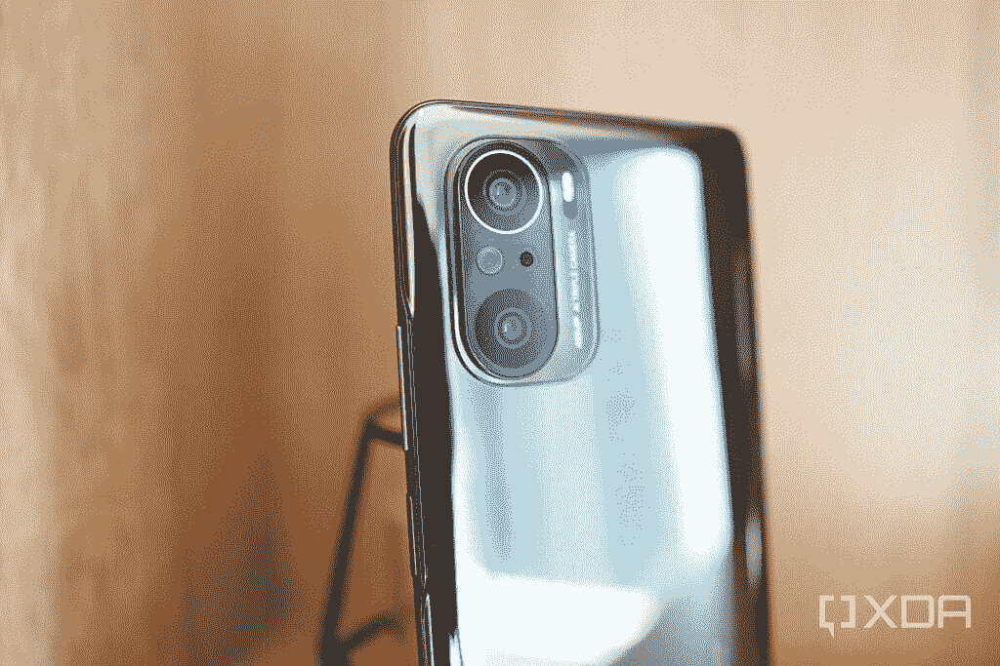

# POCO F3 手动操作:旗舰级的触觉和屏幕成本大大降低

> 原文：<https://www.xda-developers.com/poco-f3-hands-on/>

我是一个居住在香港的美籍华人，主要为以美国为中心的美国科技媒体消费和写作。因为我所占据的这个奇怪的中间空间，我倾向于从西方和东方两个角度看待事物。这种差异在中端智能手机中非常明显。虽然全球高端旗舰智能手机的状况基本保持不变 iPhone 在任何地方都是王者——但中端智能手机的情况却大不相同。

例证:[三星 Galaxy S20 FE](https://www.xda-developers.com/samsung-galaxy-s20-fe-review/) 去年受到美国科技媒体的好评，因为它提供了 700 美元的旗舰屏幕和 SoC。这个价格在美国确实很划算。但在亚洲，我一直在想三星是如何偷工减料的 Galaxy S20 FE 有塑料背，大下巴边框，以及一个糟糕的触觉引擎。在亚洲，中国智能手机在隐藏中端手机的妥协方面做得更好——除非你深入挖掘，否则它们实际上看起来和感觉上都像是高端旗舰。

这就是 [POCO F3](https://www.xda-developers.com/poco-f3-poco-x3-pro-global-launch/) 的情况——另一款中档价位的智能手机，在外行看来很容易被当成旗舰。

## POCO F3:规格

### POCO F3 规格。单击或点击以展开。

| 

规格

 | 

POCO F3

 |
| --- | --- |
| **构建** | 

*   北极白、夜黑、深海蓝
*   2.5D 弧形玻璃正面，3D 弧形背面
*   正面和背面的大猩猩玻璃 5

 |
| **尺寸&重量** | 

*   163.7 x 76.4 x 7.8 毫米
*   196 克

 |
| **显示** | 

*   6.67 英寸 AMOLED 点显示器
*   全高清+分辨率
*   居中打孔切口
*   120 赫兹刷新率
*   360Hz 触摸采样率
*   1300 尼特峰值亮度
*   1500:1 对比度
*   HDR10+
*   MEMC

 |
| **SoC** | 高通骁龙 870

*   八核 Kryo 585 CPU @ 3.20GHz
*   Adreno 650 GPU
*   7 纳米工艺节点

 |
| **闸板&存放** | 

*   6GB LPDDR5 + 128GB UFS 3.1
*   8GB + 256GB

 |
| **电池&充电** | 

*   4520 毫安时
*   33W 有线快速充电
*   盒装 33W 快速充电器

 |
| **安全** | 侧装式指纹扫描仪 |
| **后置摄像头** | 

*   **主要:**4800 万像素索尼 IMX 582，f/1.79，1/2 英寸传感器
*   **二级:** 8MP，超宽，f/2.2，119
*   第三级:5MP，泰勒马克，f/2.4

 |
| **前置摄像头** | 20MP，f/2.45 |
| **端口** | USB 类型-C |
| **音频** | 

*   双扬声器，杜比全景声认证
*   高分辨率音频和高分辨率音频无线认证
*   具有 360°环绕声拾音功能的三话筒

 |
| **连通性** | 

*   蓝牙 5.1
*   无线网络 6
*   国家足球联盟
*   红外线增强器
*   双卡支持
*   乐队:
    *   2G GSM: 850、900、1800、1900 兆赫
    *   3G WCDMA: B1，2，4，5，8
    *   4G LTE FDD: B1，2，3，4，5，7，8，12，17，20，28，66
    *   4G LTE TDD: B38、40、41
    *   5G: N1，3，5，7，8，20，28，38，41，77，78

 |
| **软件** | 基于 Android 11 的 MIUI 12 |

*我于 3 月 20 日收到了 POCO global 的 POCO F3。POCO 没有为本文提供投入。*

## POCO F3:什么好？

POCO F3 是首批运行[骁龙 870](https://www.xda-developers.com/qualcomm-unveils-snapdragon-870/) 的手机之一，该手机重用骁龙 865 和 865+架构，但主频为 3.2Ghz，比骁龙 865 快 10%，比骁龙 865+快 3%。换句话说，骁龙 870 就像一台骁龙 865++。考虑到骁龙 865+甚至在三个月前还是一款高端旗舰 SoC，而 870 略胜一筹，不言而喻，这是一款功能强大的芯片。它比骁龙 888 更强大吗？不，但是我挑战除了极客之外的任何人去发现不同之处。

POCO F3 配备了 6.7 英寸的有机发光二极管显示屏，刷新频率为 120Hz，触摸采样率为 360Hz(即使是现在的高端旗舰也只能达到 240Hz)，有助于实现超流滚动和游戏体验。这不是一个 LTPO 面板，所以它缺乏可变的刷新率，它没有像 Galaxy S21 Ultra 的屏幕那样明亮，但这仍然是一个非常好看的高级显示器。

正如开头提到的，三星的中端产品大多是塑料制品，触感柔软。这里不是这样的。POCO F3 在正面和背面使用了大猩猩玻璃 5，这里的触觉引擎似乎与小米最高端手机使用的引擎相同，这使得它成为周围最好的触觉引擎之一。在这部手机上输入并打开振动，然后用一部 [Galaxy A52](https://www.xda-developers.com/samsung-galaxy-a52-5g-hands-on/) 或 Galaxy S20 FE 做同样的事情，区别是白天和黑夜。

这款手机还装有非常响亮的立体声扬声器。再加上 360Hz 的触摸采样率和方形平板设计，POCO F3 成为了一款理想的游戏手机。

我也是主摄像头的粉丝，这是一个 48MP 的镜头，它的硬件可能没有什么特别，但由于小米/POCO 的图像处理软件得到了很大改善，它仍然可以日夜捕捉清晰和充满活力的照片。

事实上，MIUI 的相机软件是我最喜欢的软件之一，提供了非常有趣的相机技巧，如“克隆照片”或“人工智能天空编辑器”。

你可能想知道摄像头模块中的第四个孔是什么——这是一个麦克风，POCO 使用它来帮助记录“音频缩放”，这意味着当你在拍摄视频时放大，麦克风将增加声音输入。

## 

## POCO F3:meh 是什么？

小米不得不在这里偷工减料，以将 POCO F3 保持在中端价格:8MP 超广角摄像头很弱，如果与主摄像头拍摄的照片并排放置，会产生柔和的照片。第三个摄像头是一个 500 万像素的微距镜头，工作非常出色，但旗舰手机已经证明，我们不需要专门的镜头来拍摄微距照片。

视频稳定也没有我在使用小米 Mi 11 和 [OPPO Find X3 Pro](https://www.xda-developers.com/oppo-find-x3-pro-review/) 等一系列旗舰产品后所期待的那么好。请记住，小米 Mi 11 在中国的售价仅相当于 614 美元。iPhone 12 Mini 还提供了比 POCO F3 好得多的视频稳定性，价格仅为 699 美元。

对于这款设备的客观批评也就这些了。当然，人们可以挑剔 MIUI 不符合他们的口味，或者指纹磁铁(至少在我的银色设备上)。但这些都是主观意见。

## POCO F3:电池寿命和性能

我对其他方面非常好的 POCO X3 NFC 有一个抱怨，即该手机使用 UFS 2.1 存储，这导致应用程序加载时间较慢。这里的情况并非如此 POCO F3 采用 UFS 3.1 存储和 LPDDR5 RAM，速度非常快。

我只使用了大约一天半的手机，但我可以告诉电池寿命应该很好。在写这篇文章的时候，我的 POCO F3 已经从充电器上拔下 20 个小时了，它仍然有 19%的电池寿命。当然，我没有很用力地推手机，但我把它拿出来拍了一系列照片，并在社交媒体和 YouTube 上观看了一段时间。

## POCO F3:早期印象

过去几年，小米可以说是世界上性价比最高的智能手机品牌，而 POCO F3 是又一款远远超出其价格水平的产品。基本的 6GB 内存+ 128GB ROM 型号€在€的价格是 349 美元(416 美元)，8GB + 256GB 型号的价格是 399 美元(475 美元)。早鸟定价进一步削减了€50 的这两个数字。这些都是非常非常好的价格，进一步使三星的 mid-rangers 对北美以外的人来说看起来很难销售。

这只是在大约 36 小时的使用后的一个简短的动手操作，请务必回来查看我们的完整评论。