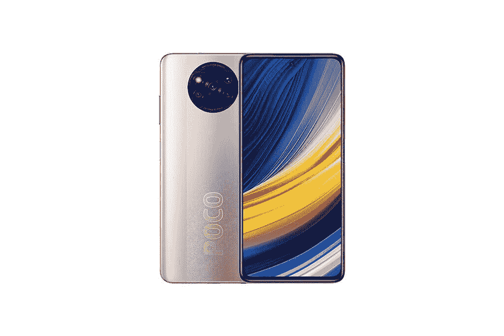

# POCO F3 和 POCO X3 Pro 采用 Snapdragon 800 系列 SOC

> 原文：<https://www.xda-developers.com/poco-f3-poco-x3-pro-global-launch/>

我们都已经长大，足以记得 2018 年 POCO 的第一款设备 POCO F1。POCO F1 在过去曾多次成为头条新闻，其旗舰级 SoC 骁龙 845 的价格挑战了内部速度慢得多的中档设备。这款手机被认为是一次性的，直到 POCO 的品牌在 2020 年重新推出，这一次有更多不同规格和价格的手机。

POCO F1 的真正继任者从未出现在 POCO 的 2020 年阵容中。有一款 POCO F2 Pro 具有旗舰规格，但它的价格比 F1 高得多。另一方面， [POCO X3](https://www.xda-developers.com/poco-x3-launched-india/) 实际上在价格上相当出色，以优异的价格宣传 120Hz 显示屏和非常体面的中档规格。今天，小米发布了 POCO X3 Pro，POCO X3 的高端版本，以及 F 系列的全新设备 POCO F3。

## POCO X3 专业版:规格

| 

规格

 | 

波科 X3 专业版

 |
| --- | --- |
| **建造** | 

*   幻影黑、霜蓝、金属青铜
*   2.5D 弧形玻璃正面，3D 弧形背面
*   正面为大猩猩玻璃 6

 |
| **尺寸&重量** | 

*   165.3 x 76.8 x 9.4mm 毫米
*   215 克

 |
| **显示** | 

*   6.67 英寸 IPS 液晶屏
*   全高清+分辨率
*   居中打孔切口
*   120 赫兹刷新率
*   240Hz 触摸采样率
*   450 尼特亮度
*   1500:1 对比度
*   HDR10

 |
| **SoC** | 高通骁龙 860

*   八核 Kryo 485 CPU @ 2.96GHz
*   Adreno 640 GPU
*   7 纳米工艺节点

 |
| **内存&存储** | 

*   6GB LPDDR4X + 128GB UFS 3.1
*   8GB + 256GB
*   高达 1TB microSD

 |
| **电池&充电** | 

*   5160 毫安时
*   33W 有线快速充电
*   盒子里的 33W 充电器

 |
| **安全** | 侧装式指纹扫描仪 |
| **后置摄像头** | 

*   **主要:** 48MP，f/1.79，1/2 英寸传感器
*   **二级:** 8MP，超宽，f/2.2，119
*   **三级:** 2MP，微距，f/2.4，4cm 定焦
*   **四进制:** 2MP，深度传感器，f/2.4

 |
| **前置摄像头** | 2000 万 |
| **端口** | 

*   USB 类型-C
*   3.5 毫米耳机插孔

 |
| **音频** | 

*   双扬声器
*   高分辨率音频认证
*   3.5 毫米耳机插孔

 |
| **连通性** | 

*   蓝牙 5
*   无线网络 5
*   国家足球联盟
*   红外线增强器
*   双卡支持
*   乐队:
    *   2G GSM: 850、900、1800、1900 兆赫
    *   3G WCDMA: B1，2，4，5，8
    *   4G LTE FDD: B1，2，3，4，5，7，8，20，28
    *   4G TDD-LTE: B38、40、41

 |
| **软件** | 基于 Android 11 的 MIUI 12 |

让我们从 POCO X3 Pro 开始，它属于中端智能手机的上层。它的外观设计上没有任何东西表明它与普通的 X3 有什么不同，但在引擎盖下，有很多东西比眼睛看到的要多。

 <picture></picture> 

POCO X3 Pro

最显著的直接改进是，这款手机将是第一款搭载全新[高通骁龙 860 SoC](https://www.xda-developers.com/qualcomm-snapdragon-860-launch/) 的设备。就像骁龙 870 是骁龙 865/865+的改版一样，骁龙 860 是骁龙 855/855+的改版。这意味着你可以期待 POCO X3 Pro 的表现与 2019 年的旗舰产品大致相同，或者略好于 2019 年的旗舰产品，并且远远好于 POCO X3 的骁龙 732G。

像它的直系亲属一样，这款手机有 6.67 英寸 120 赫兹的显示屏，触摸采样率为 240 赫兹，分辨率为 1080p。高刷新率面板已经开始在中端智能手机中变得司空见惯，这款也不例外。这种 120 赫兹的面板搭配骁龙 860 处理器和 UFS 3.1 存储应该会带来非常爽快的体验。

其他功能包括 4800 万像素的摄像头设置(普通 X3 的摄像头设置为 6400 万像素)，800 万像素的超宽镜头，微距摄像头和深度传感器，200 万像素的前置摄像头，以及 5160 毫安时的电池。这款手机还支持 33W 快速充电，可以快速充值，应该可以在大约一个小时内为手机充电。最后一点，手机运行的是基于 Android 11 的 MIUI 12。

### 定价和可用性

令人惊讶的是，POCO X3 Pro 比 POCO X3 NFC 推出的产品还要便宜。该设备的标准价格从€的 249 英镑(6GB + 128GB)和€的 299 英镑(8GB + 256GB)开始。早鸟定价进一步削减了€50%的价格。

该设备将于 3 月 24 日起在全球销售，4 月 1 日之前提供早鸟价格。

此外，POCO 还将在购买后的 6 个月内提供 1 次免费屏幕更换。

* * *

## POCO F3:规格

| 

规格

 | 

POCO F3

 |
| --- | --- |
| **建造** | 

*   北极白、夜黑、深海蓝
*   2.5D 弧形玻璃正面，3D 弧形背面
*   正面和背面的大猩猩玻璃 5

 |
| **尺寸&重量** | 

*   163.7 x 76.4 x 7.8 毫米
*   196 克

 |
| **显示** | 

*   6.67 英寸 AMOLED 点显示器
*   全高清+分辨率
*   居中打孔切口
*   120 赫兹刷新率
*   360Hz 触摸采样率
*   1300 尼特峰值亮度
*   1500:1 对比度
*   HDR10+
*   MEMC

 |
| **SoC** | 高通骁龙 870

*   八核 Kryo 585 CPU @ 3.20GHz
*   Adreno 650 GPU
*   7 纳米工艺节点

 |
| **内存&存储** | 

*   6GB LPDDR5 + 128GB UFS 3.1
*   8GB + 256GB

 |
| **电池&充电** | 

*   4520 毫安时
*   33W 有线快速充电
*   盒装 33W 快速充电器

 |
| **安全** | 侧装式指纹扫描仪 |
| **后置摄像头** | 

*   **主要:** 48MP，f/1.79，1/2 英寸传感器
*   **中学:**800 万，超宽，f/2.2，119
*   第三级:5MP，泰勒马克，f/2.4

 |
| **前置摄像头** | 20MP，f/2.45 |
| **端口** | USB 类型-C |
| **音频** | 

*   双扬声器，杜比全景声认证
*   高分辨率音频和高分辨率音频无线认证
*   具有 360°环绕声拾音功能的三话筒

 |
| **连通性** | 

*   蓝牙 5.1
*   无线网络 6
*   国家足球联盟
*   红外线增强器
*   双卡支持
*   乐队:
    *   2G GSM: 850、900、1800、1900 兆赫
    *   3G WCDMA: B1，2，4，5，8
    *   4G LTE FDD: B1，2，3，4，5，7，8，12，17，20，28，66
    *   4G LTE TDD: B38、40、41
    *   5G: N1，3，5，7，8，20，28，38，41，77，78

 |
| **软件** | 基于 Android 11 的 MIUI 12 |

POCO F3 是今天发布的两款设备中的高端型号。在很大程度上，它几乎是小米红米 K40 的[更名，主要特点是与其红米品牌的孪生兄弟相同的物理设计和内部规格。这并不是一件坏事:Redmi K40 是一款非常棒的设备，这款也是。](https://www.xda-developers.com/redmi-k40-global-markets-poco-phone/)

POCO F3 是目前最强大的 POCO 设备的说法听起来是真的:这款手机运行骁龙 870 SoC，这是去年旗舰芯片骁龙 865 的一个稍微好一点的版本，该芯片也支持该类别的前冠军得主 POCO F2 Pro。它不完全是骁龙 888，但骁龙 870 中的 Kryo 585 核心高达 3.2 GHz，高于 865+的 3.1 GHz 和 865 的 2.84 GHz。由于该设备中的 X55 调制解调器，它还支持 5G。

这款手机的物理设计与我们在 POCO X3 Pro 中看到的有很大不同，大多数其他规格也是如此。120Hz 显示屏保持相同的尺寸(6.67 英寸)和分辨率(1080p)，但触摸采样率提高到 360Hz，显示屏变为 AMOLED 而不是 LCD。相机也从四倍设置精简为三倍设置，配有 48MP 主相机、8MP 超宽相机和 2MP telemacro 镜头。电池也略小，因为 POCO F3 配备了 4520 毫安时的摄像头，而不是 POCO X3 Pro 的 5160 毫安时电池。

其他规格仍然熟悉:这款手机配备了经杜比 Atmos 认证的双扬声器，具有 360°环绕声拾音功能的三麦克风，高达 8GB 的 LPDDR5 RAM，以及高达 256GB 的 UFS 3.1 存储。

### 定价和可用性

正如 POCO 声称的那样，POCO F3 与 POCO F1 一样便宜。这款设备的标准价格从€的 349 英镑(6GB + 128GB)和€的 399 英镑(8GB + 256GB)开始。早鸟定价进一步削减了€50%的价格。

该设备将于 3 月 27 日起在全球范围内销售，4 月 6 日之前提供早期价格。

此外，POCO 还将在购买后的 6 个月内提供 1 次免费屏幕更换。

* * *

你打算买 POCO F3 还是 POCO X3 Pro？