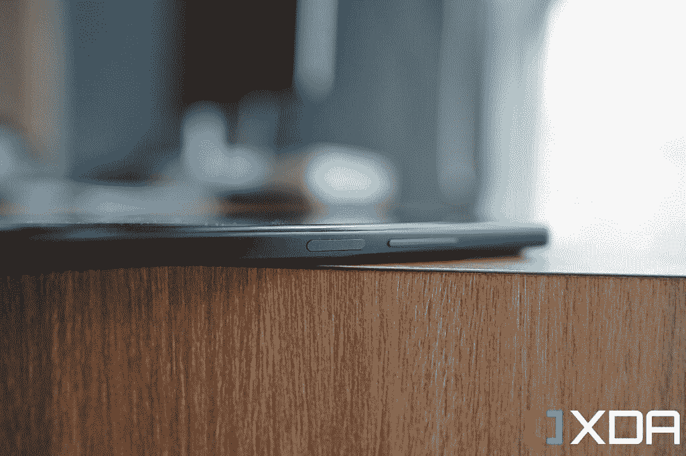
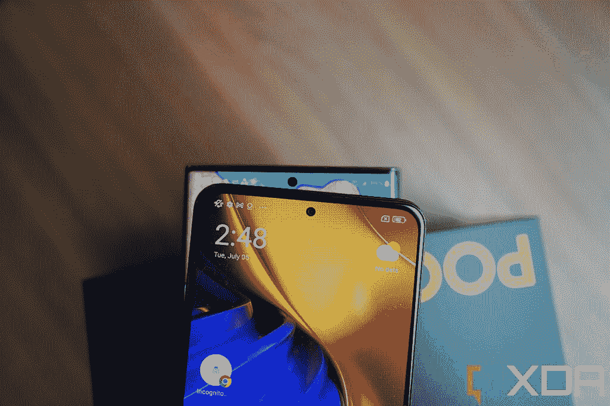

# Poco F4 评论:小米 400 美元的手机比其他所有人 500 美元的手机都好

> 原文：<https://www.xda-developers.com/poco-f4-review/>

小米的旗舰手机真的很好，像[小米 12S Ultra](https://youtube.com/shorts/vLsKlLEPhdI?feature=share) 这样的设备可以轻松地与苹果或三星制造的任何东西竞争。小米的廉价手机也是最实惠和可靠的安卓设备之一。但可以说，在中端市场——300 美元至 500 美元的价位——小米真正领先于其他公司，因为它提供了比其他任何公司都好得多的价值。

Poco F4 非常符合这一描述(顺便说一下，我知道 Poco 在一些地区将自己标榜为独立于小米的独立品牌，但我们不要在这里欺骗自己)。它的起价约为 410 美元，显然无法与三星(Samsung)1200 美元的 [Galaxy S22 Ultra](https://www.xda-developers.com/samsung-galaxy-s22-ultra-review/) 竞争，但它可以与三星(Samsung)450 美元的 [Galaxy A53 5G](https://www.xda-developers.com/samsung-galaxy-a53-5g-hands-on/) 或任何低于 500 美元的产品相媲美。这是一款值得购买的中端手机，尽管它可能没有比上一代手机有足够的改进，无法保证同比增长。

 <picture></picture> 

Poco F4

##### 波科 F4

Poco F4 是一款价格适中的中档手机，配有大屏幕、功能强大的处理器，以及展会的明星，一款配有 1 英寸传感器的出色相机。

* * *

## Poco F4:规格

| 

规格

 | 

波科 F4

 |
| --- | --- |
| **构建** | 

*   康宁大猩猩玻璃 5
*   颜色:月光银，夜黑，星云绿

 |
| **尺寸&重量** | 

*   163.2 x 75.95 x 7.7mm 毫米
*   195 克

 |
| **显示** | 

*   6.67 英寸 FHD+ AMOLED
*   2400 x 1080 分辨率
*   120 赫兹刷新率
*   高达 360Hz 的触摸采样率
*   100% DCI-P3 覆盖率
*   HDR10+
*   杜比视觉认证

 |
| **SoC** | 高通骁龙 870 |
| **闸板&存放** | 

*   6GB LPDDR5 内存+ 128GB UFS 3.1 存储
*   8GB + 256GB

 |
| **电池&充电** | 

*   4500 毫安时
*   67W 有线快速充电支持
*   含 67W 充电砖

 |
| **安全** | 

*   侧装式指纹扫描仪
*   软件支持的面部解锁

 |
| **后置摄像头** | 

*   小学:64MP f/1.79 与 OIS
*   超宽:800 万像素 f/2.2，119 度 FoV
*   宏:2MP f/2.45

 |
| **前置摄像头** | 20MP f/2.45 |
| **端口** | USB 类型-C |
| **音频** | 

*   双扬声器
*   杜比全景声认证
*   高分辨率音频认证
*   高分辨率音频无线认证

 |
| **连通性** | 

*   5G (SA/NSA)
    *   波段:n1/3/5/7/8/20/28/38/40/41/77/78

*   4G LTE
*   无线网络 6
*   蓝牙 5.2
*   国家足球联盟

 |
| **软件** | 基于 Android 12 的 MIUI 13 for Poco |
| **其他特性** | 

*   x 轴线性振动电机
*   红外线增强器

 |

***关于这篇评论:*** Poco 给我发了一个 F4 做测试。这篇评论是在使用该设备八天后撰写的。Poco 没有参与此次审查。

* * *

## Poco F4:价格和可用性

Poco F4 现已在部分欧洲市场以及印度和香港等亚洲地区发售。该设备有两种 RAM/存储类型，定价如下:

*   6GB + 128GB: €399
*   8GB + 256GB: €449

* * *

## Poco F4:硬件和设计

对于外行人来说，Poco F4 看起来和任何旗舰手机一样好，一样高档。这是一个玻璃平板，薄边框包裹着 6.67 英寸 120 赫兹的有机发光二极管显示器。面板明亮生动，支持 HDR10+，拥有杜比视界认证。

背面是一个三摄像头系统，手机由支持 5G 的高通骁龙 870 芯片供电，配有 LPDDR5 RAM 和大小适中的 4500 毫安时电池。触觉是精确而有力的。如果我把 Poco F4 和 iPhone 13 或 Galaxy S22 交给我的中年母亲，她可能无法解释为什么苹果和三星设备被认为“更高端”我想说的是，对于外行人来说，Poco F4 可以被视为一款现代旗舰。

我觉得背面的设计有点乏味，但也不讨厌

但那些更熟悉智能手机的人会发现这一点，比如这个三明治不是玻璃-铝组合，而是玻璃-塑料。指纹扫描仪嵌入到电源按钮中，而不是隐藏在显示器下面。屏幕也“只有”1080p 而不是 2K(这个其实并不重要)，刷新率被锁定在 60Hz、90Hz 或者 120Hz 而不是能够自己动态调整。

 <picture></picture> 

The fingerprint scanner is embedded into the power button on the right side of the device.

但是你可以得到立体声扬声器、67W 快速充电(包括充电器)和红外发射器。我确实觉得背面设计有点乏味，但也不讨厌。整体手感舒适，7.7 毫米的厚度和 195 克的重量是现代 Android 手机中更薄/更轻的一端。

### 摄像机

这种三摄像头系统更像是双摄像头系统。64MP，f/1.8 主摄像头性价比非常好，8MP，f/1.9 超宽很扎实，虽然 119 度视野比其他小米手机窄。然而，第三个镜头是一个 200 万像素的微距传感器，拍摄的照片既不足够微距也不可用。200 万像素的自拍相机是常见的打孔机，但与其他 Android 打孔机相比，它令人印象深刻地小。

 <picture></picture> 

The Poco F4 hole-punch (top) and the Galaxy S22 Ultra hole-punch (bottom).

光线好的主摄像头拍摄的照片看起来很锐利。1/2 英寸的传感器无论如何都不算大，但小米的软件处理在拍摄细节和曝光方面做得很好。

在弱光条件下，你将不得不依靠夜间模式来补偿小型图像传感器和过时的传感器，夜间模式确实可以很好地产生光线充足和平衡的拍摄，如果不是看起来有点过度处理的话。但是超宽相机在分辨率和图像传感器尺寸方面非常缺乏，即使是夜间模式也不会有太大变化。这是一架超宽相机，最适合白天使用。

那个自拍相机和超宽是一个故事:白天还好，晚上真的很纠结。

Poco F4 可以录制高达 4K/60 的视频，但在这种设置下几乎没有稳定性。瞄准 4K/30，你会得到一些不错的(就其价格范围而言)EIS。这些视频质量显然比不上安卓旗舰，但比大多数 500 美元以下的手机要好，除了 [iPhone SE 3](https://www.xda-developers.com/apple-iphone-se-3-review/) 。

* * *

## Poco 公司:性能和软件

Poco F4 在高通骁龙 870 上运行。这个芯片已经有一年的历史了，但实际上已经有两年了，因为 870 是骁龙 865 的翻版。尽管如此，考虑到 865 仅仅在两年前还是顶级的 SoC，它今天仍然足够强大，尤其是对于一个低于 500 美元的设备来说。这种八核 CPU，结合 UFS 3.1 存储和 LPDDR5 内存，让手机在没有问题的情况下快速移动。我没有像在三星 Galaxy A53 上那样经历动画掉线或应用程序启动时间延长的情况。

配备 UFS 3.1 存储和 LPDDR5 RAM 的骁龙 870 让手机无任何问题地自由移动

Poco F4 还延续了小米的商标，为其手机提供旗舰级的触觉，一直到 250 美元的范围。对于三星、华为或一加的手机，你可以获得旗舰级别的精确、顶级触觉，但对于低于 600 美元的手机，你只能获得平庸的模糊触觉。对于小米来说，在你得到一个普通的振动引擎之前，你必须得到低于 200 美元的设备。伟大的触觉学并不完全是适销对路的，但它们是小事情的一部分，这些小事情加起来比它们的部分加起来还要多。小米在这方面不吝啬，值得称赞。

基准测试分数很高，这款手机能够通过 3DMark 上 20 分钟的野外生活极限压力测试，虽然分数不是最高的，但稳定性是可以接受的。

### 软件

我认为 Poco F4 感觉速度很快的部分原因是 MIUI 是一个优化良好的软件，动画效果很好。在 Android 12 上运行的 MIUI 13 与过去任何其他小米或 Poco 手机一样，因此它的软件体验有点偏离谷歌的做事方式，但有自己的独特之处。不是每个人都喜欢 MIUI 异想天开的风格(比如一个应用在卸载时“爆炸”成碎片)，但我不介意它们。你有一个应用托盘，一个单手模式，以及各种快捷手势，比如用三个手指向下滑动来快速抓取截图。

有一些吹毛求疵的地方:这里的 MIUI 不能在浮动窗口中打开应用程序。其他运行 MIUI 的小米手机可以做到这一点，所以这可能是 Poco 想要简化 UI，或者试图阻止软件做太多事情来拖累旧的 SoC。这款欧洲版的 Poco F4 也有相当多的臃肿软件，亚马逊、脸书和几款游戏已经预装在手机上。

### 赌博

那些关注 Poco 的人可能知道，这是该品牌今年第二款名为 F4 的设备，因为 4 月份已经发布了一款游戏手机 POCO F4 GT。嗯，这款 F4 也可以很好地处理游戏，这要归功于 LPDDR5 RAM、UFS 3.1 存储和一款名为“Game Turbo”的应用程序，该应用程序可以将手机资源优先用于运行手机游戏。Game Turbo 还允许您关闭通知，或者禁用滑动手势

### 电池寿命

电池寿命有点低于标准。4500 毫安时的电池无法为 120 赫兹的面板全天供电，特别是因为我将刷新率设置为 120 赫兹，我是一个重度用户。平均来说，在手机电量下降到可怕的低于 5%的水平之前，我有大约 4 个小时的屏幕时间，总共使用了大约 10 个小时。至少手机支持 67W 快速充电，充电器是自带的。

Poco 广告称，67W 充电器可以在 38 分钟内将手机从 0 充满到 100%。我没有完成 0-100%的充电，但我记下了这些充电数据:15 分钟内从 11%到 53%；25 分钟内从 7%上升到 86%。这些数字很快，表明 Poco F4 不应该离宣传的充电速度太远。

### 杂念

双发射扬声器位于显示屏的顶部和底部，因此音频输出均匀(而不是像许多 Android 手机那样一个扬声器位于听筒中)。这一点，加上平板和相对方形的设计，使得这款手机成为一款适合在家里观看视频的好机器，因为它很容易用一只手牢牢握住。

* * *

## 你应该买 Poco F4 吗？

如果你正在寻找一部新的安卓手机，而你的预算在 500 美元以下，那么我会说去买吧。Poco F4 显然比 Galaxy A53 更好，Galaxy A53 运行在更弱的处理器上，软件明显更慢，触觉更差，但显示屏和主摄像头质量差不多。你还可以得到一个充电器和一个装有 Poco F4 的箱子，这对那些预算有限的人来说很重要。但是在扣动购买的扳机之前，请记住 Poco F3 仍然存在。

Poco F4 并不是 Poco F3 的主要升级，Poco F3 仍然非常好，价格大约少了 100 美元。公平地说，大多数手机都不是很好的同比升级，这就是为什么原始设备制造商最终会打折或完全停止生产它们。Poco F3 是可用的，所以你可能要权衡你的决定。

如果你不介意使用 iPhone 或厚边框，那么 iPhone SE 2022 将运行在更强大的芯片上，以及卓越的苹果应用生态系统，尽管你会因为使用 iPhone SE 而牺牲很多现代智能手机技术，如有机发光二极管屏幕、薄边框和超宽摄像头。

最终，我认为 F4 Poco 最大的竞争对手是它自己(或者更确切地说，是小米品牌的保护伞)。如上所述，Poco F3 仍然在这里，还有 Poco X4 GT，它与 Poco F4 在同一场活动中发布。早些时候还有一款 Poco F4 GT，价格略高，更不用说无数的 Redmi 设备，以及传言中的小米 12 Lite 版本。

我猜当小米说它想为每个人提供“创新”时，它的字面意思是发布一款价格在百美元以下的手机。有 300 美元的小米手机，400 美元的设备，500 美元的设备，600 美元的设备，等等。Poco F4 是最好的 400 美元手机，但小米 300 美元和 500 美元的手机也在这里争夺你的注意力。

 <picture></picture> 

Poco F4

##### 波科 F4

Poco F4 是一款 410 美元左右的手机，拥有大屏幕、强大的处理器、良好的摄像头和触觉。

如果你最终选择了 Poco F4，你不会失望的。毕竟，它仍然是一款超值的智能手机，小米知道如何很好地制造这些产品。