# 高通 vs 英特尔 vs AMD Chromebook:详细比较

> 原文：<https://www.xda-developers.com/qualcomm-vs-intel-vs-amd-chromebook/>

Chromebooks 有多种配置。当[购买新的 Chromebook](https://www.xda-developers.com/best-chromebooks/) 时，你可能不会考虑的一个方面是处理器。虽然处理器速度和基准测试是许多 PC 用户的时尚，但那些寻找 Chromebook 的人通常不会重视这些东西。这并不意味着原始处理能力不重要。如果你想运行要求苛刻的 Linux 应用程序、Android 游戏，或者打开上百个 Chrome 标签，一个有能力的处理器是关键。今天我们来谈谈 Chromebooks 中高通 vs 英特尔 vs AMD。

处理能力也不仅仅是今天的事情——你可能会在购买下一部 Chromebook 时考虑到未来的应用。我们已经知道 Steam gaming 将很快与 Borealis 一起进入 Chrome 操作系统。如果你想在你的 Chromebook 上玩游戏，很高兴知道你有一个可以跟上的处理器。

考虑到这一点，现在有必要看看 Chromebooks 的可用处理器选项。基本上，有四家公司为 Chromebooks 生产芯片——英特尔、AMD、联发科和高通。然而，在这些公司中只有两种不同的架构在使用，即 ARM 和 x86。联发科和高通都使用 ARM 架构，而英特尔和 AMD 的芯片以使用 x86 指令集而闻名。谈到 Chromebooks，许多人经常认为英特尔和 AMD 速度更快。联发科芯片通常用于低端 Chromebooks，因此它们的性能在大多数基准测试中不合格是有道理的。

另一方面，高通相对来说是 Chromebook 游戏的新手。到目前为止，目前只有两款设备可以买到高通骁龙 7c 芯片。宏碁 Spin 513 是第一款这样的设备，上个月惠普 Chromebook x2 11 紧随其后。这两款设备的价格都在 Chromebooks 的中端，比预算高出 400-600 美元，但并不算昂贵。

我们认为，看看高通新骁龙 7c 处理器如何在这个价位上与英特尔和 AMD 的常见竞争对手相抗衡会很有趣。在这次比较中，我们将比较[宏碁 Spin 513(高通)](https://www.anrdoezrs.net/links/100122946/type/dlg/sid/UUxdaUeUpU4412/https://store.acer.com/en-us/acer-chromebook-spin-513-cp513-1h-s682?internal_source=us.acer.com&internal_medium=referral&internal_campaign=CLM&internal_content=NX.HWZAA.002)、 [Pixelbook Go Core i5(英特尔)](https://www.amazon.com/Google-Pixelbook-Chromebook-128GB-Black/dp/B07YMM4YC1?tag=xda-33bktj1-20&ascsubtag=UUxdaUeUpU4412&asc_refurl=https%3A%2F%2Fwww.xda-developers.com%2Fqualcomm-vs-intel-vs-amd-chromebook%2F&asc_campaign=Short-Term)和[宏碁 Spin 514 (AMD)](https://shop-links.co/1751865712496878882?u1=c30a4c9d-710f-4578-9f54-c9bd42d5586f) 的性能。

如前所述，我们测试了三款 Chromebooks 进行比较。当然，除了内部的处理器，这些 Chromebooks 确实有一些不同之处。以下是我们测试的 Acer Spin 513、Pixelbook Go 和 Acer Spin 514 的规格。

[caption align = " align center " width = " 900 "]

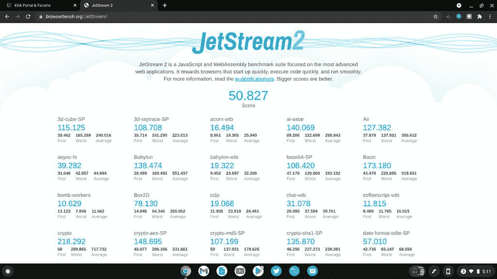

宏碁 Spin 513 Jetstream2[/caption]高通骁龙 7c 的 Jetstream 2 分数有点令人惊讶和失望。虽然我没想到它能与英特尔或 AMD 处理器相提并论，但我也没想到它会落后这么多。这些分数表明，骁龙 7c 和宏碁 Spin 513 对于具有复杂数学计算或加密任务的严肃科学计算来说并不理想。[caption align = " align center " width = " 900 "]

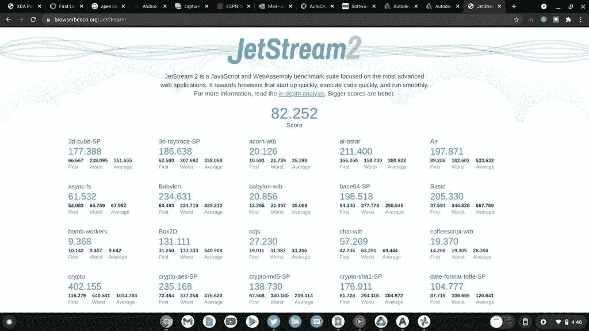

pixel book Go jetstream 2[/caption]

### 辛烷 2.0

Octane 2.0 是一个基准测试，它通过运行一系列测试来衡量 JavaScript 引擎的性能，这些测试代表了 JavaScript 应用程序中的某些用例。传统的基准测试只是简单地衡量 JavaScript 的执行速度。Octane 2.0 还额外测量了延迟，这是与执行流畅度相关的另一个重要的性能方面。在像 V8 这样的现代 JavaScript 引擎中，延迟来自两个主要来源——将 JavaScript 编译成机器指令，这样它可以运行得更快，以及对不再使用的内存进行垃圾收集。这些任务计算量很大，如果运行时间过长，用户可能会看到 JavaScript 程序出现小的停顿和冻结。我们已经添加了 Mandreel 和 Splay 基准的修改版本，以测量 JavaScript 引擎如何最大限度地减少这些暂停。[caption align = " align center " width = " 1200 "]

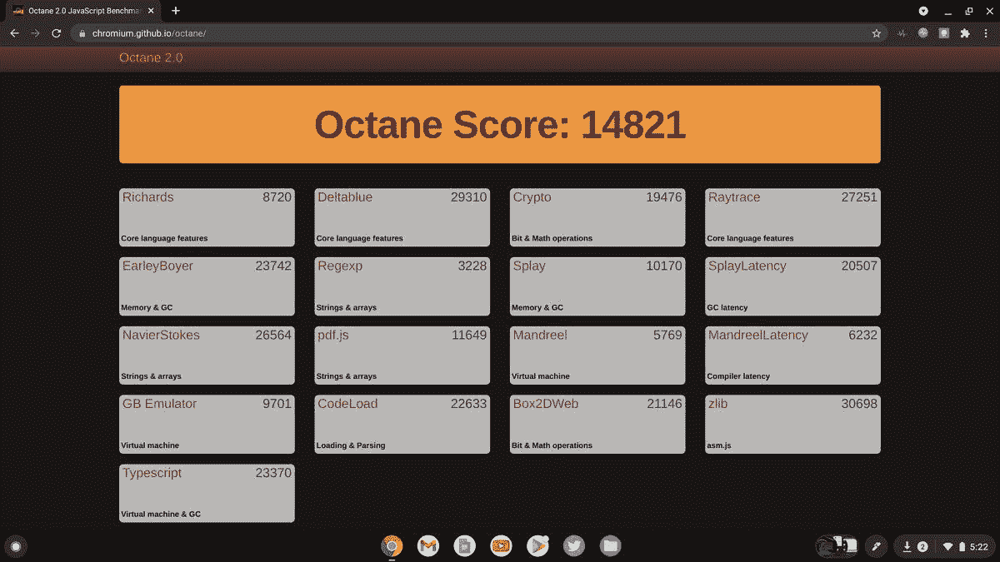

Acer Spin 514 Octane 2.0[/caption]也许不出所料，我们看到了与 Octane 2.0 基准相同的总体排名。然而，令人惊讶的是，在该基准测试中，英特尔和 AMD 处理器相差甚远。在这种情况下，骁龙 7c 实际上与 AMD 锐龙芯片相当，而第八代英特尔 i5 的速度是 AMD 的两倍多。[caption align = " align center " width = " 900 "]

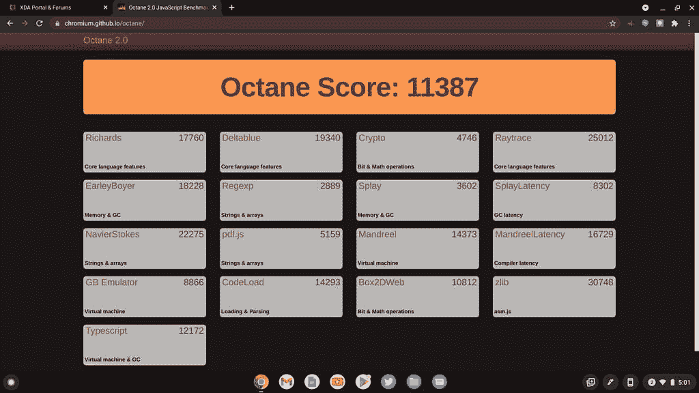

宏碁 Spin 513 Octane 2.0[/caption]有一点我确实觉得有点奇怪，那就是我的 Octane 2.0 测试结果与其他测试 Spin 513 和 Spin 514 的测试结果不一致。许多用户报告自旋 513 的分数约为 19，000，自旋 514 的分数约为 25，000。不过，我的测试实践在所有三种设备上都是一致的，在我运行的每个基准测试之间，让每台机器休息五分钟。尽管实际分数可能会有差异，但为了便于比较，机器的相对性能应该是一致的。[caption align = " align center " width = " 900 "]

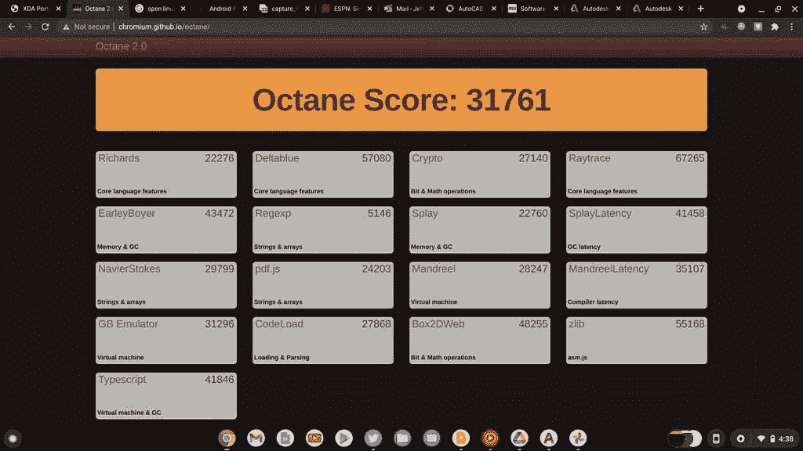

Pixelbook Go Octane 2.0[/caption]

### 速度计 2.0

速度计通过模拟用户交互来测试浏览器的 Web 应用程序响应能力。该基准使用 TodoMVC 中的多个示例模拟用户添加、完成和删除待办事项的操作。TodoMVC 中的每个示例都以不同的方式使用 DOM APIs 实现了相同的 todo 应用程序。有的直接从 ECMAScript 5 (ES5)、ECMASCript 2015 (ES6)、ES6 transpiled 到 ES5、Elm transpiled 到 ES5 调用 DOM APIs。其他人使用 11 种流行的 JavaScript 框架之一- React、React with Redux、Ember.js、Backbone.js、AngularJS、(新)Angular、Vue.js、jQuery、Preact、Inferno 和 Flight。许多这样的框架被用于世界上最受欢迎的网站，比如脸书和 Twitter。这些类型操作的性能取决于 DOM APIs、JavaScript 引擎、CSS 样式分辨率、布局和其他技术的速度。

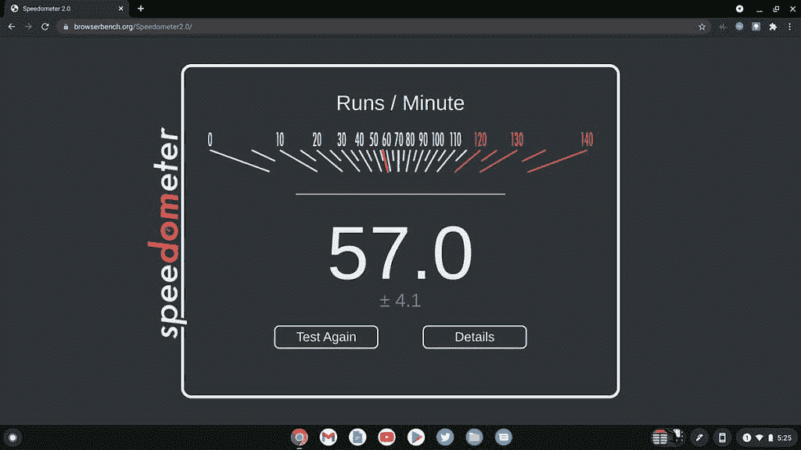

Speedometer 2.0 的结果显示了三个处理器的相似的相对排名，尽管没有前两个测试中那么多的聚类。英特尔酷睿 i5 是明显的赢家，锐龙芯片稳居第二，骁龙 7c 再次排在最后。与 Octane 2.0 的结果一样，英特尔处理器比这两种处理器都有相对较大的优势，而其他两种处理器则更接近。[caption align = " align center " width = " 900 "]

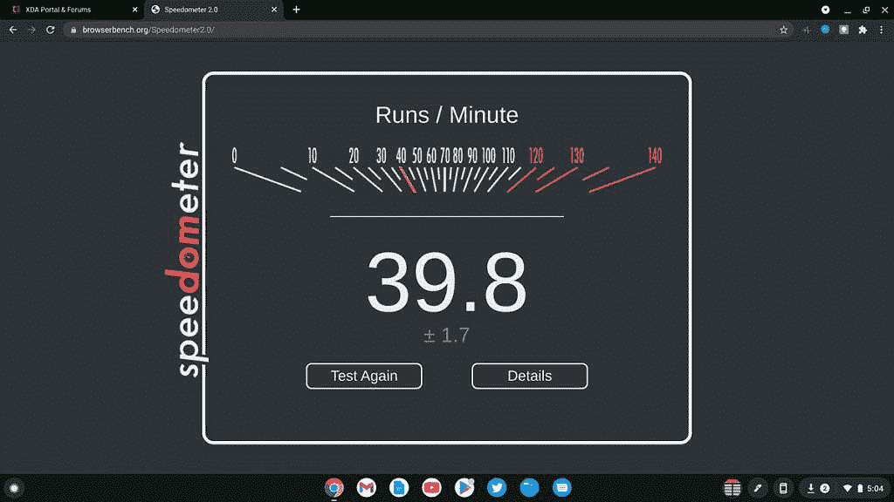

Acer Spin 513 速度计[/caption]速度计 2.0 输出的一个非常好的方面是，它不仅展示了点估计，还展示了误差幅度。访问这个置信区间信息可以很容易地看到 AMD 处理器的结果实际上有更多的差异。我不太确定为什么锐龙处理器的误差幅度明显较高，但也许这是由于测试中无法完全控制的热量或其他变量。[caption align = " align center " width = " 900 "]

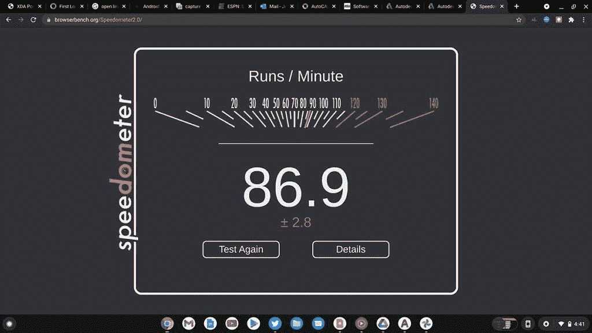

Pixelbook Go 速度计[/caption]

### MotionMark 1.1

MotionMark 是一个专注于图形性能的 web 基准。它绘制多个呈现元素，每个元素使用相同的一组图形元素。一个元素可以是一个 SVG 节点，一个 CSS 样式的 HTML 元素，或者一系列的画布操作。元素之间的细微变化可以避免浏览器进行琐碎的缓存优化。虽然相当简单，但选择的效果反映了网络上常用的技术。测试在视觉上很丰富，旨在强调图形系统而不是 JavaScript。在初始预热之后，每个测试运行一段固定的时间。基于对浏览器帧速率的测量，MotionMark 调整要绘制的元素数量，并集中在浏览器以每秒 60 帧(fps)开始动画失败的狭窄范围内。对数据应用分段线性回归，并将变化点报告为测试分数。置信区间是通过自举计算的。MotionMark 计算所有测试分数的几何平均值，以报告运行的单个分数。[caption align = " align center " width = " 900 "]

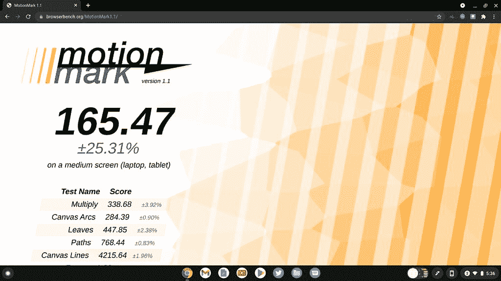

宏碁 Spin 514 motion mark 1.1[/caption]motion mark 1.1 是第一个特定于图形的基准测试，因此看到相对层次结构仍然存在很有意思。我们还得到了一个带有误差幅度的置信区间，这表明在这种情况下，英特尔酷睿 i5 的结果可能会有相当大的误差幅度。[caption align = " align center " width = " 900 "]

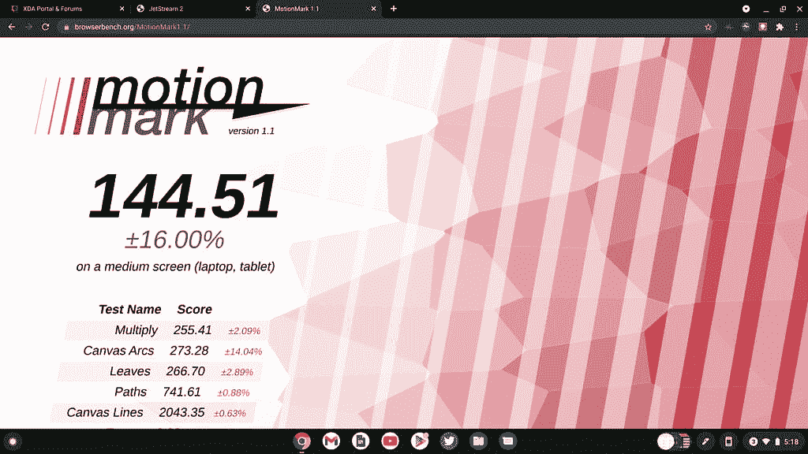

宏碁 Spin 513 motion mark 1.1[/caption]尽管如此，Core i5 领先的结果在统计上是显著的，因为这些差异足够大，有意义。另一方面，当考虑这两个置信区间的重叠时，骁龙 7c 和 AMD 锐龙图形性能相对相同。[caption align = " align center " width = " 900 "]

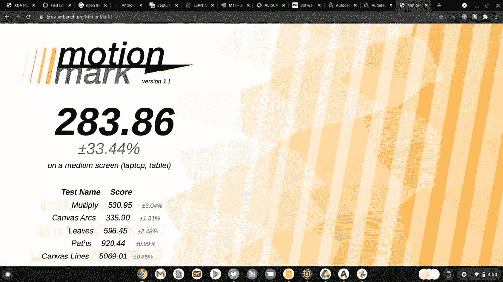

Pixelbook Go 运动标记 1.1[/caption]

## 高通 vs 英特尔 vs AMD:真实世界的性能

基准测试并不能说明全部情况。虽然我们对这三款芯片的排名相当一致，但重要的是要看看真实世界的性能，以真正了解处理器在 Chromebook 整体体验中的表现。让我们深入了解一下我在 Pixelbook Go 上使用酷睿 i5、在 Spin 513 上使用骁龙 7c 以及在 Spin 514 上使用 AMD 锐龙时注意到了什么。

### Pixelbook Go 的英特尔酷睿 i5 性能

当一台笔记本电脑用了几年后，性能和电池寿命是你期望看到的最大变化。由于 Chrome 操作系统的轻量级特性，Pixelbook Go 的性能不会受到太大影响。我的 Core i5 型号仍然突突前进，处理我目前扔给它的几乎所有东西。我仍然可以轻松地进行多任务处理，甚至可以流畅地玩一些高端 Android 游戏，如沥青 9。当然，展望未来是一个不同的故事。Pixelbook Go 上的第八代英特尔处理器无法应对 Chrome OS 和 Borealis 带来的游戏革命。如果你真的对今年晚些时候 Chrome OS 上的 Steam 游戏感到兴奋，Pixelbook Go 仍然不是目前投资 Chromebook 的最佳选择。相反，请查看

[ASUS Chromebook CX9 I recently reviewed](https://www.xda-developers.com/asus-chromebook-cx9-review/)

.

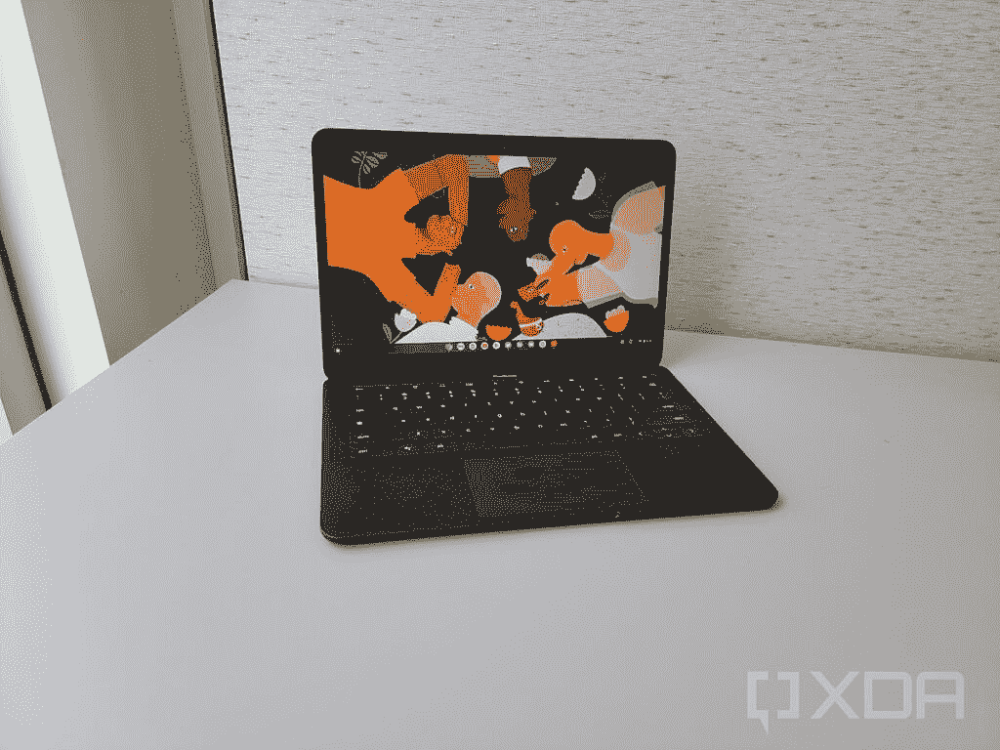

我注意到的另一个持续的性能问题是从笔记本电脑中间发出的相当明显的线圈呜呜声。线圈呜呜声是由充当电感器或变压器的电磁线圈引起的高音调噪声。我的 Pixelbook Go 单元在我的整个使用过程中都出现了这种现象，但它并没有太多地困扰我，因为我经常在工作时听音乐。从好的方面来说，Pixelbook Go 上使用的处理器是无风扇的，所以你不会处理任何风扇噪音。

### 宏基 Spin 514 中的 AMD 锐龙性能

Spin 514 的性能非常稳定。你可以相对轻松地运行 Android 应用，包括密集型游戏。我花了相当多的时间玩沥青 9，奥拓的奥德赛，和 NBA 果酱。所有这些游戏在 Chromebook 上都玩得非常好。我还花了相当多的时间在 Spin 514 上玩 Stadia，这是一种在帐篷模式下使用笔记本电脑的相当愉快的体验。当然，我也在 Spin 514 上运行 Linux 应用程序，使用 GIMP 和 Kdenlive 进行一些简单的照片和视频编辑。锐龙 5 处理器基本上胜任了任务，我很少注意到粉丝们的不满。不幸的是，Spin 514 仍然存在一些我在 ThinkPad C13 Yoga Chromebook 上注意到的锐龙特有的问题。

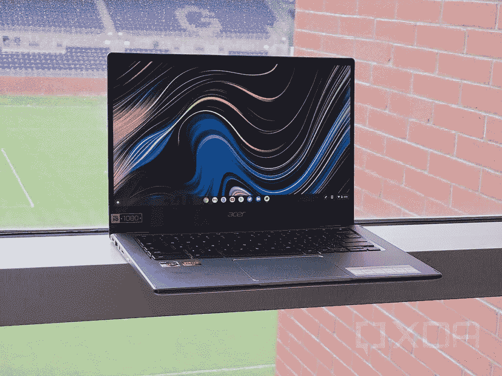

某些视频播放器仍然会死机和黑屏(也许这只是需要更新 Chrome OS 来解决)，电池百分比似乎也没有校准好。通常情况下，电池电量会一次增加 5%，这不是你在路上工作时真正想看到的。

### 宏碁 Spin 513 的高通骁龙 7c 性能

在 Spin 513 上的表现还可以。我原本预计备受期待的第一款高通 Chromebook 会有更好的性能。对于要求更高的任务，这款 Chromebook 比采用低端英特尔处理器的型号要慢得多。一般来说，它可以用来写文档或浏览网页，但玩游戏就相当令人失望了，考虑到高通芯片在安卓手机上的表现。事实上，Android 应用程序的支持总体来说并不太好(稍后会详细介绍)。

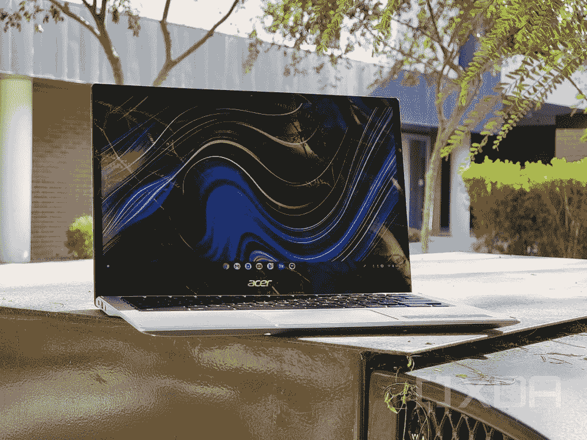

我尝试在宏碁 Spin 513 上运行一些 Linux 应用程序，这不是最好的体验。我在 Galaxy Chromebook 2 上轻松运行的 GIMP、Kdenlive 和 MATLAB 几乎是不可能的。总的来说，我不建议在这台机器上尝试任何高要求的工作或游戏。它在努力跟上的同时相对安静，所以这将打动一些潜在的买家。

## 电池寿命

在比较处理器时，效率与原始性能同样重要。我已经将这三台机器都用作我的主要 Chromebook，所以我们来谈谈每个平台的平均电池寿命。

### Pixelbook Go 的英特尔酷睿 i5 电池续航时间

正如你所料，电池寿命当然会随着时间的推移而下降。当我在 2019 年 10 月第一次拆箱时，我能够在 Pixelbook Go 上舒适地工作大约八个小时。这些天，我可以挤出大约六个半小时的使用时间，然后才需要充值。这不是一个可怕的容量下降，也不是我反对 Pixelbook Go 的原因，因为所有电池都遭受这种命运。

### 宏碁 Spin 514 的 AMD 锐龙电池寿命

在电池寿命方面，Spin 514 不太令人印象深刻。这可能是因为我之前提到的校准不佳的电池电量，或者可能是因为我需要在最大亮度下运行，因为显示器很暗。不管是哪种情况，我都努力争取到了宏碁在规格页面上宣传的 10 小时使用时间。在测试期间，我最多能使用大约七个小时。对于 Windows PC 来说，这听起来是一个不错的数字，但对于 Chromebook 来说却相当糟糕。

### 宏碁 Spin 513 的高通骁龙 7c 电池续航时间

尽管在我们的基准测试中排名垫底，但 Spin 513 确实提供了出色的电池续航时间。我当然没有得到规格表上宏碁声称的 14 小时使用时间，但我确实平均有令人印象深刻的 10.5-11 小时的实际屏幕时间。在我的测试中，我还对它进行了一些非常繁重的工作负载，所以如果你只进行轻度浏览和使用生产力应用程序，这可能会延长到 14 个小时。OEM 列出的数字在实践中很少能达到，但至少 Spin 513 是可以想象的。

## 高通 vs 英特尔 vs AMD:结论

总的来说，我们观察到，在 Chromebook 性能方面，英特尔仍然是领头羊。旧得多的英特尔酷睿 i5 不仅在四个不同的基准测试中击败了骁龙 7c 和 AMD 锐龙，而且在日常使用中也表现得更好。虽然实际的原始分数确实有一些误差，但 Pixelbook Go 在每种情况下都有很大的胜利，足以轻松取得统计上的显著优势。当然，除了性能之外，Spin 513 和 Spin 514 还有一些独特的优势。旋转器 513 具有

[LTE capability](https://www.xda-developers.com/best-chromebooks-lte-5g/)

并且旋转 514 是

[great enterprise option](https://www.xda-developers.com/best-business-chromebooks/)

。电池寿命是骁龙 7c 领先于其他两个竞争者的一个方面。高通有电池优化工程的历史，考虑到他们所有的工作与移动处理器。虽然 AMD 平台还不错，但它的电池寿命和性能最差。希望 AMD 将在未来的锐龙迭代中解决一些 Chrome 操作系统优化问题。我们也将很快测试第二代骁龙 7c，看看高通是否提高了他们的性能。

### 宏碁 Chromebook Spin 513

如果你想要一台 2 合 1 Chromebook，但价格不高，Spin 513 是一个很好的选择。您仍然可以获得明亮生动的高清显示屏，以及出色的电池续航时间。如果您需要在旅途中工作，Spin 513 具有可选的 4G LTE 功能。性能不是最好的，但如果你不是超级用户，这是一个不错的 Chromebook。

**Affiliate Links**

Acer

[View at Acer](https://www.anrdoezrs.net/links/100122946/type/dlg/sid/UUxdaUeUpU4412/https://store.acer.com/en-us/acer-chromebook-spin-513-cp513-1h-s60f)

### Google Pixelbook Go

谷歌的 Pixelbook Go 经受住了时间的考验。对于长时间的打字和高质量的扬声器来说，这仍然是最好的 Chromebook。

**Affiliate Links**

Amazon

[View at Amazon](https://www.amazon.com/dp/B07YMGQYP6?tag=xda-33bktj1-20&ascsubtag=UUxdaUeUpU4412&asc_refurl=https%3A%2F%2Fwww.xda-developers.com%2Fqualcomm-vs-intel-vs-amd-chromebook%2F&asc_campaign=Short-Term)

### 宏碁 Chromebook Spin 514

宏碁的 Spin 514 在 AMD 锐龙 5 处理器的支持下，提供了坚固的设计和令人印象深刻的性能。它的显示屏有点暗，电池续航时间一般，但在工作效率和安卓游戏方面表现出色。

**Affiliate Links**

Best Buy

[View at Bestbuy](https://shop-links.co/link/?exclusive=1&publisher_slug=xda&article_name=Qualcomm+vs+Intel+vs+AMD+Chromebook%3A+A+detailed+comparison&article_url=https%3A%2F%2Fwww.xda-developers.com%2Fqualcomm-vs-intel-vs-amd-chromebook%2F&u1=UUxdaUeUpU4412&url=https%3A%2F%2Fwww.bestbuy.com%2Fsite%2Facer-chromebook-spin-514-convertible-14-full-hd-touch-amd-ryzen-5-8gb-ddr4-128gb-emmc-hdmi-mist-green%2F6454181.p%3FskuId%3D6454181)