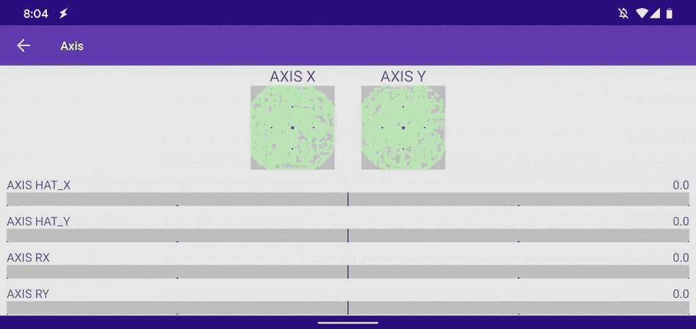

# Razer Kishi Review-Android 智能手机的优秀游戏控制器

> 原文：<https://www.xda-developers.com/razer-kishi-review-google-stadia-nvidia-geforce-now-steam-link-emulators/>

在智能手机上玩游戏通常不如在游戏机上那么令人满意，这在很大程度上是因为触摸控制。点击和拖动屏幕上的按钮远比按下物理按钮和移动模拟拇指棒更慢，也更不方便，这就是为什么许多手机游戏的游戏体验被大大简化了。但是，云游戏服务已经非常成熟，Android 智能手机的功能足够强大，可以模仿许多旧的游戏机，所以为 Android 手机设计的专用控制器有一席之地。进入雷蛇岸本。

[Razer Kishi 在今年早些时候的消费电子展上首次亮相](https://www.xda-developers.com/razer-kishi-extending-game-controller-android-ios/)，它是一款扩展游戏控制器(也称为“伸缩式”游戏控制器)，其设计是“通用的”，不局限于特定的智能手机型号。Razer 正在制造两款 Kishi 通用游戏控制器:一款旨在通过 USB Type-C 端口连接 Android 智能手机，另一款旨在通过 Lightning 端口连接苹果 iPhone 设备。Razer 在今天产品发布之前，于 2020 年 5 月 18 日将 Kishi for Android 模型发给我进行审查。我一直在使用我的[谷歌像素 4](https://forum.xda-developers.com/pixel-4) 的控制器，我发现 Razer Kishi 是通过云游戏服务和模拟器玩游戏的完美伴侣。

| 

赞成的意见

 | 

骗局

 |
| --- | --- |
| 

*   坚固耐用的建筑
*   轻量级选手
*   按钮按压和操纵杆移动感觉很棒
*   控制器很容易展开和折叠，但保持手机安全，不会损坏它
*   几乎没有输入延迟
*   不需要充电
*   借助直通 USB-C 端口，您可以在玩游戏时为手机充电
*   最后，一个来自著名公司的“通用”伸缩游戏控制器！

 | 

*   不适合一些较大的 Android 手机
*   Android 应用程序中没有按钮重映射
*   比市场上的其他伸缩游戏控制器更贵
*   模糊的充电/耳机插孔端口意味着您可能需要处理蓝牙音频的音频延迟

 |

## Razer Kishi 规格

**产品要求:**

*   Android OS 版本:Android 8.0 Oreo 或更高版本
*   Android 设备:
    *   雷蛇:雷蛇手机，雷蛇手机 2
    *   三星:Galaxy S8，Galaxy S8+，Galaxy S9，Galaxy S9+，Galaxy S10，Galaxy S10+，Galaxy S20，Galaxy S20+，Galaxy Note 8，Galaxy Note 9，Galaxy Note 10，Galaxy Note 10+
    *   谷歌:像素 2，像素 2 XL，像素 3，像素 3 XL，像素 4，像素 4 XL
    *   支持范围内的其他 Android 设备:
        *   身高:145.3-163.7 毫米
        *   宽度:68.2-78.1 毫米
        *   深度:7.0-8.8 毫米

**技术规格:**

*   两个可点击的模拟拇指棒
*   一个 8 路数字键盘
*   四面按钮
*   两个触发器(L2/R2)
*   两个保险杠(L1/R1)
*   三个功能按钮
*   一个状态指示灯(充电)
*   尺寸:高 37 毫米，宽 134 毫米，深 94 毫米
*   重量:265 克
*   连接性:USB Type-C
*   智能手机充电:通过 USB Type C 端口传递

## 外观和感觉

Razer Kishi 不会以其建造质量让你惊叹，但那是因为它不是为了给人留下视觉印象而设计的。控制器由塑料制成，非常轻便，非常适合在手机上长时间玩游戏。它处于锁定位置时也很结实，所以你不必担心它会在你的包里散开。当你玩游戏时，黑色会融入手机屏幕的左右边框。

Kishi 摸起来很光滑，按钮在按下时会提供很好的触觉反馈。这是一个坚固的游戏控制器，任何使用过任天堂 Switch Joy-Con 充电手柄的人都应该感到熟悉。L/R 肩部按钮也很大，很容易按下——我发现的许多其他 Android 游戏控制器都有蹩脚的肩部按钮。类似地，操纵杆构造精良，感觉会持续很长时间，操纵杆盖光滑，按下时会提供良好的反馈。同样，这是我觉得 Razer 做对的另一部分，可惜在许多其他 Android 游戏控制器上做得很差。A/B/X/Y 按钮也感觉很结实，尽管在我看来，8 向 D-pad、home 按钮和开始/选择按钮可以做得更明显。

 <picture></picture> 

My Razer Kishi unit does not have any joystick dead zones or drifting. I tested the sensitivity of the joystick using the Gamepad Tester app. (Note: I didn't bother drawing in the entire area in the circles for the X and Y axes.)

将 Kishi 翻转过来，你会看到将控制器固定在一起的夹子。向外拉动两个插件，松开夹子。然后，您可以延伸控制器的两侧，直到您的手机可以连接到右侧的 USB Type-C 端口，并紧贴在两侧之间。你的手机的顶部和底部会接触到控制器光滑的橡胶部分，所以你不必担心刮伤。同样，手机背面，包括摄像头凸起，不会接触到连接控制器两侧的夹子，因为当你锁定手机时，夹子会悬挂在手机后面。

一旦手机连接到 Razer Kishi，它就可以很好地固定到控制器上。根据手机的厚度，你可以故意将 Kishi 的两端来回弯曲一点，但在实际玩游戏时，你应该不会感觉到任何晃动。由于 Kishi 遮住了手机的顶部和底部，你将无法连接任何有线音频配件，所以如果你不想听到手机扬声器的音频，你必须使用蓝牙音频配件。你应该使用低音频延迟的蓝牙音频附件，如 Razer 自己的[锤头真无线耳塞](https://www.xda-developers.com/razer-hammerhead-true-wireless-earbuds-junglecat-gaming-controller/)。

此外，由于大多数手机的底部只有一个被 Kishi 用完的充电端口，Razer 在控制器右半部分的底部添加了一个 USB Type-C 端口，用于直通充电。最后，在控制器的右半部分有一个 LED 指示灯，当你第一次连接手机时，它会变蓝几秒钟。Kishi 不需要充电，因为它完全由你的手机供电，所以这个 LED 只是一个状态指示器，让你知道你的手机已连接。

在 Razer Kishi 的背面，有一张贴纸告诉你控制器是与 Gamevice 合作制造的，game vice 是一家专注于游戏产品的美国外设公司。Gamevice 以前也有自己的游戏控制器，所以很高兴看到他们与 Razer 合作开发像 Kishi 这样的高质量通用伸缩游戏控制器。我对 Razer Kishi 的设计的唯一主要问题是，它不适合更大的 Android 手机，如[三星 Galaxy S20 Ultra](https://forum.xda-developers.com/galaxy-s20) 或[OPPO Find X2 Pro](https://forum.xda-developers.com/find-x2-pro)——甚至我的[华为 P40 Pro](https://forum.xda-developers.com/huawei-p40-pro) 也刚刚处于*勉强*适合的尖端。Razer 正在将 Kishi 作为一款“通用”游戏控制器进行营销，因此，由于控制器的尺寸限制，许多高端 Android 智能手机被排除在外，这很奇怪。将上述规格部分列出的尺寸与您的 Android 设备的尺寸进行比较，以确保您的设备适合 Kishi。

## 游戏体验

如果你确实有一部适合 Razer Kishi 的 Android 智能手机，那么我认为你不会对游戏体验感到失望。在我的 Google Pixel 4 上，我在 [Google Stadia](https://www.xda-developers.com/tag/google-stadia/) 上玩 GRID，在 [NVIDIA GeForce NOW](https://www.xda-developers.com/tag/nvidia-geforcenow/) 上玩 Dark Souls: Remastered，使用 [Steam Link](https://www.xda-developers.com/steam-link-for-android/) 从我的 PC 上玩 Valkyria Chronicles，通过 [Dolphin Emulator](https://www.xda-developers.com/tag/dolphin/) 玩《生化危机 4》和《塞尔达传说:暮光之城公主》。这些都是我测试过的主机质量的游戏，其中一些移植到了 PC 上(黑暗之魂:重制和女武神编年史)，感觉就像我在手机上原生地玩它们一样。这种体验在很大程度上归功于谷歌和英伟达创造了一流的云游戏服务，但 Razer Kishi 没有输入延迟，这意味着我按下的按钮几乎会立即反映在我玩的每个游戏中。

不幸的是，并非 Steam/PC 上的每个游戏都针对控制器输入进行了优化，所以你现在必须在 Steam Link/GeForce 中进行一些重新映射，直到你找到适合你的设置。(如今，许多 PC 游戏都使用 Xbox 和 PS4 控制器，所以这不像过去那样是个大问题。)Stadia 游戏似乎是控制器就绪的，尽管我不是这项服务的大用户，所以我不能在这里泛泛地说。如果你想要一个好的体验，像 Dolphin Emulator 这样的模拟器基本上需要将你的控制器输入映射到 GameCube/Wii 控制器，幸运的是，这在应用程序中很容易做到。

具有讽刺意味的是，Razer Kishi 在一些流行的 Android 游戏中没有多大用处，如[使命召唤:移动](https://www.xda-developers.com/tag/callofduty-mobile/)和 [PUBG 移动](https://www.xda-developers.com/tag/playerunknown-bg/)。这类游戏的开发者通常不会启用控制器支持，因为他们希望用户在平等的基础上玩游戏——拥有控制器的普通玩家会破坏使用触摸控制的普通玩家。有一些方法可以绕过这一限制:购买一款带有仿肩按钮的游戏智能手机，如[华硕 ROG 手机 II](https://forum.xda-developers.com/rog-phone-2) 及其超声波空气触发器，购买一款类似 Flydigi Stinger 的控制器，它可以连接到你的手机上，为你点击屏幕，或者使用 DroidMote (+ Touch Profile Creator)这样的应用程序，将控制器上的按钮按压映射到屏幕上的触摸。无论如何，不要买 Razer Kishi，期望它能在大多数皇室战争游戏中占上风。

我说“大多数”皇家战役游戏，因为雷蛇明确地将 Epic Games 的《堡垒之夜》列为兼容游戏。遗憾的是，我的 Pixel 4 根深蒂固，我无法测试堡垒之夜，但下面是 Razer 建议用户尝试的游戏和云游戏服务的简短列表:

*   安卓游戏:
    *   史诗游戏:堡垒之夜
    *   Netmarble:全明星格斗之王
    *   超级钻头机:Armajet
    *   野性互动:网格自动运动
    *   珍珠深渊:黑色沙漠手机
*   云游戏服务:
    *   蒸汽链
    *   雨道
    *   谷歌视距
    *   NVIDIA GeForce NOW
    *   微软 xCloud

当然，你可以从谷歌 Play 商店免费下载任何 Android 游戏或主机模拟器来使用 Razer Kishi，包括用于 Android 版本的[新 Citra】。Kishi 为它的每个按钮发送标准的按键事件，所以控制器在大多数监听这些按键事件的游戏中应该工作得很好。](https://www.xda-developers.com/official-citra-for-android-released/)

## Razer Kishi 应用程序

虽然不是必需的，但如果你需要一个游戏启动器，你可以下载 Razer Kishi Android 应用程序。该应用程序还有一个“发现”标签，突出显示针对控制器输入进行了优化的多种风格的游戏。最后，你还可以在应用程序的设置中查看 Kishi 固件的更新。我在五月中旬收到的审查单元还没有收到任何固件更新，我甚至不确定固件更新会带来什么。

我感到失望的一个特性是没有重新映射按钮的能力。有点令人失望的是，按钮映射是由游戏开发者决定的，而不是我们自己可以控制的。

## Razer Kishi 的定价和供货情况

我个人一直在等待得到一个通用的 Android 游戏控制器。我已经搜索了 XDA 论坛和 Reddit 的/r/AndroidGaming subreddit 寻找建议，并且我已经遇到了来自 Betop、Saitake、Framonics、Flydigi、iPEGA 等品牌的各种类型的控制器(伸缩式、安装式、可拆卸式和爪式)。这些品牌的一些控制器赢得了 Android 游戏玩家的好评，但我也听到了关于一些型号的质量及其客户支持的混合反馈。

几家知名的智能手机制造商，如华硕、努比亚、黑鲨，甚至雷蛇，以前都制造过游戏控制器，但它们通常只为少数智能手机型号制造，甚至需要特殊的外壳。虽然 Razer Kishi 很遗憾地不适合我的一些设备，但我很高兴像 Razer 这样的大游戏品牌终于做出了一款不专属于他们自己设备的游戏控制器。我希望 Kishi 做得足够好，让 Razer 考虑发布一款适合更大的 Android 智能手机的型号，因为遗憾的是，市场上许多最好的 Android 智能手机都不适合 Razer Kishi。

为 Android 设备设计的 Razer Kishi 目前已通过美国、加拿大和欧洲的多家零售商出售。该控制器的零售价为 79.99 美元/€89.99 美元/129.99 加元。

**购买 Razer Kishi for Android:** [百思买](https://shop-links.co/link/?exclusive=1&publisher_slug=xda&article_name=Razer+Kishi+Review+-+An+Android+Gaming+Controller+that%27s+perfect+for+Cloud+Gaming+and+Emulation&article_url=https%3A%2F%2Fwww.xda-developers.com%2Frazer-kishi-review-google-stadia-nvidia-geforce-now-steam-link-emulators%2F&u1=UUxdaUeUpU28638&url=https%3A%2F%2Fwww.bestbuy.com%2Fsite%2Fsearchpage.jsp%3Fst%3Drazer%2Bkishi)[亚马逊](https://www.amazon.com/s?k=razer+kishi&tag=xda-64fju17-20&ascsubtag=UUxdaUeUpU28638&asc_refurl=https%3A%2F%2Fwww.xda-developers.com%2Frazer-kishi-review-google-stadia-nvidia-geforce-now-steam-link-emulators%2F&asc_campaign=Short-Term)[Razer.com](https://razer.a9yw.net/c/2233363/642901/10229?subId1=UUxdaUeUpU28638&subId2=exda&u=https%3A%2F%2Fwww.razer.com%2Fmobile-controllers%2Frazer-kishi&ourl=https%3A%2F%2Fwww.razer.com%2Fgaming-controllers%2Frazer-kishi)

为苹果 iPhone 设备设计的控制器将于今年夏天晚些时候上市。