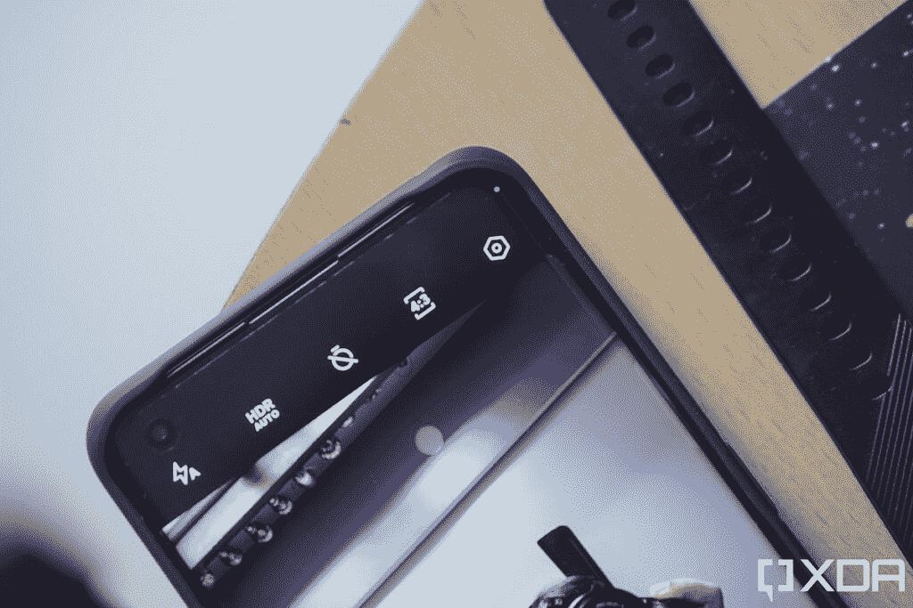

# 基于 Android 12 的 Realme UI 3.0:这里是更新中的所有新内容！

> 原文：<https://www.xda-developers.com/realme-ui-3-hands-on/>

Realme 早在 2018 年就开始作为 OPPO 的子品牌。这意味着，在用户开始要求专门为 Realme 设备定制用户界面之前，Realme 在智能手机上使用 ColorOS 已经有一段时间了。虽然该公司并没有真正开发一个全新的操作系统，但他们开发了一个稍微修改过的 ColorOS 版本，并将其命名为 Realme UI。Realme UI 借鉴了 ColorOS 的很多 UI 元素和特性，因为它只是一个表层。这也是我们在 Realme UI 的第三次迭代中继续观察到的——基于 [Android 12](https://www.xda-developers.com/android-12/) 的 Realme UI 3.0。

就在几天前，我们去[亲自体验了基于 OPPO 智能手机 Android 12](https://www.xda-developers.com/oppo-coloros-12-hands-on/) 的 ColorOS 12。现在，Realme 已经开始在 Realme GT 888 上为早期测试人员播种 Realme UI 3.0。鉴于 ColorOS 和 Realme UI 之间的相似性，ColorOS 12 引入的许多功能现在都可以在 Realme UI 3.0 上看到，只需稍加修改。Realme UI 3.0 集成了一些 Android 12 功能以及一些其他方便的附加功能，从而带来了改善整体用户体验的更新。以下是 Realme UI 3.0 在 Realme GT 888 上测试的所有新功能。

## UI -流体空间设计

就外观而言，Realme UI 3.0 没有太多变化。UI 很大程度上类似于 Realme UI 2.0，只是有一些细微的变化。通知抽屉现在看起来略有不同，当你打开设置应用程序时，布局也有所不同。与以前版本的用户界面相比，所有的东西看起来都更加分散。“设置”应用程序中的选项也变得更加简单明了，让它看起来更整洁。代表相应设置的图标变得更大，更容易识别。

### 新的 3D 图标

主屏幕和应用程序抽屉上的默认图标也发生了细微的变化。每个图标都有一个新的独特的调色板，这使得区分应用程序更容易。这些图标也有一个 3D 的外形，大量的阴影增加了深度。Realme 表示，它删除了“不必要的阴影”，但 Realme UI 2.0 非常平坦，没有阴影，而 Realme UI 3.0 的图标中有更多的阴影，所以我们不确定他们这种说法是什么意思。

### 新的黑暗模式选项

Realme UI 3.0 增加了从三种黑暗模式选项中进行选择的能力——增强、中等和柔和。增强模式为您提供了一个非常适合有机发光二极管显示的漆黑背景，而中等和柔和模式则提供了一个略带灰色的背景。

* * *

## 个性化

如果你喜欢定制智能手机及其各种 UI 元素，Realme UI 3.0 上有很多选项。从主屏幕到永远在线的显示屏，你都可以对用户界面的不同方面进行主题化，让它看起来像你想要的那样。

### 基于壁纸的主题

这是 Android 12 上引入的一个功能，作为 Material You 概念的一部分。虽然谷歌的实现仅限于 Pixel 系列手机，但 Realme 有自己的定制实现，称为智能主题引擎。当你在主屏幕上应用新的壁纸时，你可以选择改变系统主题来匹配壁纸的颜色。您也可以使用色轮手动更改主题的颜色。

### 奥莫治

Omoji 是 Realme 对苹果推出的 Memoji 功能的改编。你可以创建自定义的面部表情符号来匹配你的风格，这些表情符号会对你面部表情的变化做出实时反应。这种实现不像苹果的那样完美，因为它只使用了前置摄像头，而不是像 iPhone 那样使用红外发射器。这仍然是一个有趣的功能，它将通过 Realme UI 3.0 进入 Realme 手机。

### 画板 AOD

我们首先在一加设备的 OxygenOS 上看到了这个功能，现在它已经进入了 ColorOS 12，并随后进入了 Realme UI 3.0。通常被称为画布 AOD，画板功能基本上概述了肖像图像中的主要主题，并创建了一个草图效果，然后可以用作始终显示的图像。当显示器关闭时，这是一种非常酷的定制设备外观的方式。

### Realmeow 和 Omoji AOD

除了创建和设置一个草图作为您的始终显示图像的选项，您还可以选择在显示器关闭时在屏幕上设置一个 Realmeow 或 Omoji。这将与时间、日期、通知等一起显示。

* * *

## 性能和流动性

Realme UI 3.0 进行了几项底层改进，增加了整体用户体验。由于新的平滑动画引擎，在启动和退出应用程序以及滚动时，动画感觉更平滑。

### AI 平滑引擎

有一个新的“人工智能平滑引擎”，声称可以根据你的使用模式优化设备的性能。Realme 声称，这项功能可以减少高达 30%的内存使用，并将应用程序打开速度提高高达 13%。Relame 表示，通过人工智能资源调度，应用程序可以智能地被杀死或保留在内存中，电池寿命将提高 12%。在我们的使用过程中，我们没有发现任何变化，但是这个特性据说是随着时间的推移而学习的，所以也许以后在这里会有所发现。

### 浮动窗口 2.0

如果你想多任务处理，现在在浮动窗口中启动应用程序更容易了。你只需要点击侧边栏中的一个应用程序，它就会自动在一个浮动窗口中打开。然后你可以拖动这个窗口到屏幕上任何你想要的地方，如果你想在后台做些什么，甚至可以最小化它。

* * *

## 隐私和安全

Android 12 引入了一些面向隐私的功能，Realme 在 Realme UI 3.0 中实现了所有这些功能。我们做了一些更改和改进，以确保用户隐私，并确保应用程序不会在未经您允许的情况下访问您的任何数据。

### 私人图片共享

我们以前在运行 MIUI 12 和 One UI 3.0 的手机上见过类似的功能实现。基本上，这个功能的作用是在分享之前，从你点击的图片的 EXIF 数据中删除所有敏感信息。这将确保当您向其他人发送图像时，他们无法访问您的位置或其他信息，如日期和时间。

### 大概位置

Android 12 上另一个重要的隐私相关功能，现在在 Realme UI 3.0 上，是近似位置共享。每次应用程序要求您共享您的位置时，如果您认为该应用程序不值得信任，您可以选择共享您的精确位置或大致位置，或者您只是不想与实际上不需要它的应用程序共享您的精确位置。

### 隐私仪表板中的应用程序权限记录

这是 Android 12 的突出功能之一，谢天谢地，Realme 已经决定将它包含在 Realme UI 3.0 中。隐私仪表板显示手机上的应用程序使用的所有权限以及上次使用这些权限的时间。如果您不希望某些应用程序访问您的位置、摄像头、麦克风或任何其他权限，您可以从这里进行控制。您还可以查看请求、授予或拒绝某些权限的时间线。

### 麦克风和摄像头切换和指示器

现在，您可以通过 Realme UI 3.0 在快速设置中添加一个开关，以启用或禁用对设备上的摄像头和麦克风的访问。禁用访问将阻止智能手机上的任何应用程序访问您设备上的摄像头或麦克风，这对很多人来说都很重要。

除了切换之外，用户现在还可以在每次应用程序请求访问摄像头或麦克风时，在屏幕的右上角看到一个小指示器。绿色圆点表示可以使用摄像机，橙色圆点表示可以使用麦克风。

### 电话管理器 2.0

Realme UI 3.0 上的电话管理器应用程序已收到 2.0 版的更新。它用于清理手机存储，删除不必要的应用程序和文件，管理应用程序权限等。它有一个功能列表，现在被适当地分成不同的菜单，让用户更容易找到他们想要的功能。

* * *

## 杂项功能

除了这些突出显示的功能，Realme UI 3.0 还有一些新的功能，可以改善使用 Realme 手机的整体体验。有*屏幕翻译*可以翻译屏幕的全部内容，只需点击侧边栏上的一个按钮；然后是*背景流*，即使屏幕关闭也能继续在后台播放歌曲或视频。当然，Android 12 复活节彩蛋也存在于设置应用中。其他 Android 12 功能，如聊天气泡和通知回复建议，也存在于 Realme UI 3.0 中。

### 与 Realme Book 无缝连接

Realme 最近在印度推出了其笔记本电脑——[Realme Book Slim](https://www.xda-developers.com/realme-slim-book-realme-gt-india-launch/),如果你有一台 Realme 手机，你现在可以将这两款产品更好地集成在一起使用。有几个新功能，如在智能手机和笔记本电脑上打开应用程序的能力，即时文件传输，无缝复制和粘贴，以及智能通知，你可以直接从 Realme book 查看和回复。

* * *

## Realme UI 3.0 更新路线图

Realme 分享了印度 Realme UI 3.0 测试版的早期接入路线图:

【2021 年 10 月

**2021 年 12 月**

*   Realme GT 大师版
*   Realme GT Neo2 5G
*   Realme X7 Max
*   Realme 8 Pro

**Q1，2022 年**

*   Realme X7 Pro
*   Realme X50 Pro 5G
*   Realme 8
*   Realme 8i
*   Realme 7 Pro
*   Realme Narzo 50A
*   Realme Narzo 30
*   Realme C25
*   Realme C25s

**Q2，2022 年**

*   Realme X7
*   真实的 X3
*   Realme X3 超级变焦
*   Realme 8 5G
*   Realme 8s
*   Realme 7 5G
*   Realme Narzo 30 Pro 5G
*   Realme Narzo 30 5G

* * *

这些都是 Realme 智能手机的 Realme UI 3.0 更新的一部分。已经添加的隐私功能肯定是有用的，定制选项将帮助用户根据自己的喜好个性化他们的设备。除此之外，与之前的版本相比，Realme UI 3.0 没有太多变化。当你更新你的手机时，你会觉得有了这个软件就像在家里一样。

如果你用的是 Realme 手机，你觉得 Realme UI 3.0 怎么样？您是否在等待智能手机上的更新？请在下面的评论中告诉我们！