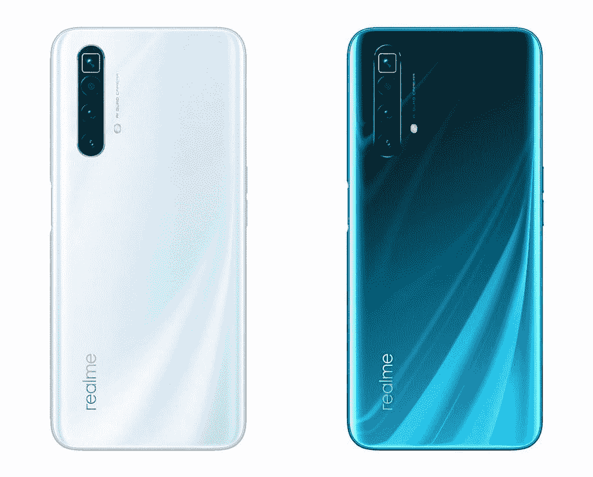

# Realme X3、X3 SuperZoom 和 Buds Q 入耳式 TWS 在印度上市

> 原文：<https://www.xda-developers.com/realme-x3-superzoom-flagship-killer-buds-q-in-ear-tws-india-snapdragon-855-120hz/>

Realme 忠于其“敢于飞跃”的口号，自成立以来，在过去的几年里已经进行了几次长期的飞跃。在用入门级和经济型产品填满市场后，Realme 去年推出了第一款真正的旗舰产品——[Realme X2 Pro(review)](https://www.xda-developers.com/realme-x2-pro-xda-review/)，随后在今年早些时候推出了第一款支持 5G 的签名设备——[Realme X50 Pro(review)](https://www.xda-developers.com/realme-x50-pro-5g-review/)。现在，Realme 又增加了一款旗舰(*读旗舰杀手！*)装置到其组合中。Realme X3 SuperZoom 与刚刚亮相的普通 Realme X3 一起在印度上市。除了这些智能手机，Realme 还推出了第三副 TWS 耳机 Realme Buds Q

Realme X3 和 X3 超级变焦几乎是一样的。但在我们概述差异之前，这里有两个设备共有的功能。Realme 选择将 X3 系列基于去年的骁龙 855+移动平台，以避免骁龙 865 移动平台支持 5G 带来的额外成本。Realme X3 有 6GB/128GB 和 8GB/128GB 两种型号，而 X3 SuperZoom 有 8GB/128GB 和 12GB/256GB 两种选择。

 <picture></picture> 

Realme X3 SuperZoom in Arctic White and Glacier Blue colors.

Realme X3 超级变焦的最大亮点是潜望式变焦长焦设置，允许高达 5 倍的光学变焦和高达 60 倍的数字变焦。在华为 P30 Pro 和 OPPO Reno 10X 等智能手机普及了这一概念后，[三星开始大规模生产](https://www.xda-developers.com/samsung-mass-producing-slim-5x-optical-zoom-camera-modules/)这些潜望式相机单元，Realme 可能会使用其中的一个。这款潜望镜相机还配有 OIS

常规的 Realme X3 用固定的 2 倍远摄相机取代了潜望式相机，正如我们在 Realme X2 Pro 上看到的那样。该系列中的其他摄像头对这两款设备来说是相同的，包括一个 64MP 三星 GW1 主摄像头，Relme 自 [Realme XT](https://www.xda-developers.com/realme-xt-video-review/) 以来一直在所有中端和高端设备上使用。其他相机包括一个 8MP 广角相机和一个 2MP 微距相机。

Realme 增加了一系列有趣的相机功能，并特别强调夜间摄影。该公司增加了一些功能，如用于手持夜景的*超级夜景*，用于超低光拍摄的*超级夜景*，用于极低光条件下长时间曝光拍摄的*三脚架模式*，类似于谷歌相机天文摄影功能的*星空模式*，以及专门针对夜晚的手动模式*专业夜景*。

Realme X3 跳过了 AMOLED 显示屏，使用全高清+ LCD 显示屏，带有双孔开孔，可容纳两个自拍相机。AMOLED 显示屏的缺乏通过显示屏的 120Hz 高刷新率来弥补。120Hz 面板将支持几款热门游戏的更高刷新，如 *Hitman GO* 、 *Dead Trigger 2* 、 *Alto's Adventure* 、*真人快打*、 *Temple Run* 等。

这两款设备都配有 4200 毫安时电池，并支持 Realme 的 DART 3.3 快速充电。该公司声称，这将使电池在不到一个小时内充满。

软件方面，基于 Android 10 的 Realme UI 为这些设备提供动力。Realme 主动推出软件更新，Realme X50 Pro 的 Android 11 测试版已经宣布，因此我们可以预计 X3 系列将在今年年底或明年年初获得 Android 11 更新。

### 价格和可用性

Realme X3 在印度有两种型号，价格如下:

*   6gb+128 GB–₹24,999(约 330 美元)
*   8gb+128 GB–₹25,999(约 345 美元)

另一方面，Realme X3 SuperZoom 也有两种不同的配置，定价如下:

*   8gb+128 GB–₹27,999(约 370 美元)
*   12gb+256 GB–₹32,999(约 435 美元)

这些设备将通过 Flipkart 和 Realme 的在线商店出售，首次快闪销售将于 6 月 30 日中午举行。

## Realme X3 和 X3 超级变焦规格

| **规格** | Realme X3/X3 超级变焦 |
| --- | --- |
| **尺寸&重量** |  |
| **显示** |  |
| **SoC** |  |
| **闸板&存放** | 真实的 X3:真实的 X3 超级变焦: |
| **存储类型** | UFS 3.0 + Turbo Write +主机性能提升(HPB) |
| **电池** |  |
| **指纹传感器** | 侧装指纹 |
| **后置摄像头** |  |
| **前置摄像头** |  |
| **安卓版本** | 基于 Android 10 的 Realme UI |

* * *

## 真实芽 Q

除了这两款新智能手机，Realme 还宣布了第三款 TWS 耳机，但这是第一款采用入耳式设计的耳机。Buds Q 是迄今为止 Realme 最实惠的 TWS 耳塞，配有最小的 10 毫米驱动器。每个耳塞仅重约 3.5 克。对于控制，两个耳塞上都有触敏电容按钮，而不是触觉按钮，与 Realme Buds Air 非常相似，Buds Q 还使用 Realme Link 应用程序定制了触摸控制，可用于控制其所有的健康产品，包括 Realme Band 和手表。

Realme Buds 的充电盒配有 400 毫安时电池，而每个耳塞都配有 40 毫安时电池。这款保护套使用 microUSB 接口充电，没有无线充电功能。Realme 声称每次充满电的电池寿命为 20 小时。虽然耳塞带有 IPX4 等级，但外壳却没有这种保护。Realme 还增加了其标志性的低延迟游戏模式。

Realme Buds Q 将有三种不同的颜色可供选择，包括黑色、白色和黄色。与 Buds Air 的光滑表面形成对比的是，Buds Q 的三种选择都采用了哑光表面。

### 价格和可用性

Realme Buds Q 将在亚马逊印度和₹1,999 发售

[Realme's online store](https://buy.realme.com/in/goods/201?id=572?utm_source=Website&utm_medium=XDA_Developer&utm_term=BudsQ&utm_content=&utm_campaign=BudsQ_Website_XDA_Developer___)

并将于 7 月 1 日开始上市。

## Realme Buds Q 规格

| 规格 | 真实芽 Q |
| --- | --- |
| 司机 | 10 毫米 |
| 电池 |  |
| 充电 | 微型 USB |
| 连通性 |  |
| IP 等级 | IPX4 仅适用于耳塞 |
| 规模 | 每个耳塞:仅充电盒: |
| 控制 | 耳塞上的触摸控制(也可以使用 Realme Link 应用程序定制) |