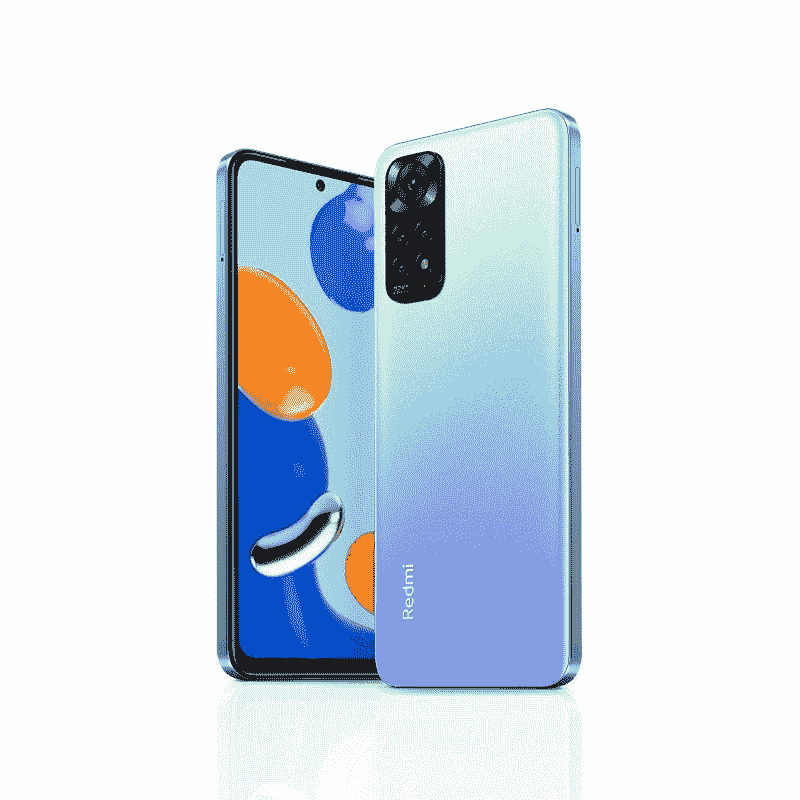
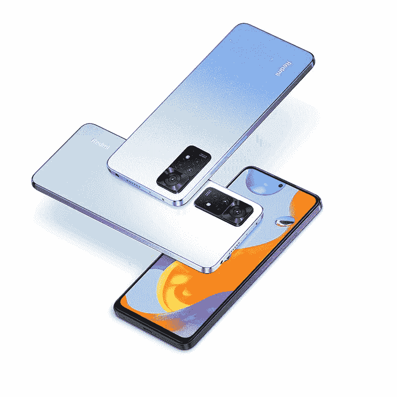

# 红米 Note 11 系列在全球推出四款手机，起价低至 159 美元

> 原文：<https://www.xda-developers.com/redmi-note-11-series-global-launch/>

小米的子品牌 Redmi 去年在中国推出了其广受欢迎的 Redmi Note 系列的最新迭代。新的 Redmi Note 11 系列包括三款设备 vanilla Redmi Note 11、Redmi Note 11 Pro 和 Redmi Note 11 Pro Plus。推出一个月后，小米在印度市场首次推出了 Redmi Note 11 系列。然而，[公司只在](https://www.xda-developers.com/redmi-note-11t-5g-india-launch/)地区推出了基本款，同样在[以不同的名字](https://www.xda-developers.com/redmi-note-11t-5g-india-launch-date/)推出。为了顺应这种[恼人的更名趋势](https://www.xda-developers.com/opinion-smartphone-branding-out-of-control/)，小米随后在印度推出了中国红米 Note 11 Pro 和红米 Note 11 Pro Plus，作为[小米 11i 和小米 11i 超充](https://www.xda-developers.com/xiaomi-11i-hypercharge-india-launch/)。现在，该公司以 Redmi Note 11 的名义在其他国际市场推出了四款略有不同的设备。

今天在全球推出的红米 Note 11 系列包括四款设备——香草红米 Note 11、红米 Note 11S、红米 Note 11 Pro 和红米 Note 11 Pro 5G。虽然全球版本的设计与中国的红米 Note 11 型号相同，但它们的硬件不同。查看下面的平板电脑，快速了解规格。

## 红米 Note 11 系列(全球):规格

| 

规格

 | 

红米 Note 11

 | 

红米 Note 11S

 | 

红米 Note 11 Pro

 | 

红米 Note 11 Pro 5G

 |
| --- | --- | --- | --- | --- |
| **打造** | 

*   IP53 防溅
*   康宁大猩猩玻璃 3 正面

 | 

*   IP53 防溅
*   康宁大猩猩玻璃 3 正面

 | 

*   IP53 防溅
*   康宁大猩猩玻璃 5 正面

 | 

*   IP53 防溅
*   康宁大猩猩玻璃 5 正面

 |
| **尺寸&重量** | 

*   159.867 x 73.87 x 8.09mm 毫米
*   179 克

 | 

*   159.867 x 73.87 x 8.09mm 毫米
*   179 克

 | 

*   164.19 x 76.1 x 8.12mm 毫米
*   202 克

 | 

*   164.19 x 76.1 x 8.12mm 毫米
*   202 克

 |
| **显示** | 

*   6.43 英寸 FHD+ AMOLED
*   2400 x 1080
*   90Hz 刷新率
*   180Hz 触摸采样速率
*   DCI-P3 宽色域
*   1000 尼特峰值亮度

 | 

*   6.43 英寸 FHD+ AMOLED
*   2400 x 1080
*   90Hz 刷新率
*   180Hz 触摸采样速率
*   DCI-P3 宽色域
*   1000 尼特峰值亮度

 | 

*   6.67 英寸 FHD+ AMOLED
*   2400 x 1080
*   120 赫兹刷新率
*   360Hz 触摸采样率
*   DCI-P3 宽色域
*   1200 尼特峰值亮度

 | 

*   6.67 英寸 FHD+ AMOLED
*   2400 x 1080
*   120 赫兹刷新率
*   360Hz 触摸采样率
*   DCI-P3 宽色域
*   1200 尼特峰值亮度

 |
| **SoC** | 

*   高通骁龙 680
*   Adreno 610 GPU

 | 

*   联发科 Helio G96
*   ARM Mali-G57 MC2 GPU

 | 

*   联发科 Helio G96
*   ARM Mali-G57 MC2 GPU

 | 

*   高通骁龙 695
*   Adreno 619 GPU

 |
| **闸板&存放** | 

*   4GB LPDDR4x + 64GB UFS 2.2
*   4GB + 128GB
*   6GB + 128GB

 | 

*   6GB LPDDR4x + 64GB UFS 2.2
*   6GB + 128GB
*   8GB + 128GB

 | 

*   6GB LPDDR4x + 64GB UFS 2.2
*   6GB + 128GB
*   8GB + 128GB

 | 

*   6GB LPDDR4x + 64GB UFS 2.2
*   6GB + 128GB
*   8GB + 128GB

 |
| **电池&充电** | 

*   5000 毫安时
*   33W 快速充电支持
*   含 33W 充电器

 | 

*   5000 毫安时
*   33W 快速充电支持
*   含 33W 充电器

 | 

*   5000 毫安时
*   67W 快速充电支持
*   含 67W 充电器

 | 

*   5000 毫安时
*   67W 快速充电支持
*   含 67W 充电器

 |
| **安全** | 侧装式指纹扫描仪 | 侧装式指纹扫描仪 | 侧装式指纹扫描仪 | 侧装式指纹扫描仪 |
| **后置摄像头** | 

*   初级:50MP f/1.8
*   超宽:800 万像素 f/2.2，118 FoV
*   宏:2MP f/2.4
*   深度:2MP f/2.4

 | 

*   主要:108MP 三星 HM2 f/1.9
*   超宽:800 万像素 f/2.2，118 FoV
*   宏:2MP f/2.4
*   深度:2MP f/2.4

 | 

*   主要:108MP 三星 HM2 f/1.9
*   超宽:800 万像素 f/2.2，118 FoV
*   宏:2MP f/2.4
*   深度:2MP f/2.4

 | 

*   主要:108MP 三星 HM2 f/1.9
*   超宽:800 万像素 f/2.2，118 FoV
*   宏:2MP f/2.4
*   深度:2MP f/2.4

 |
| **前置摄像头** | 1300 万像素 f/2.4 | 1600 万像素 f/2.4 | 1600 万像素 f/2.4 | 1600 万像素 f/2.4 |
| **端口** | 

*   USB 类型-C
*   3.5 毫米耳机插孔

 | 

*   USB 类型-C
*   3.5 毫米耳机插孔

 | 

*   USB 类型-C
*   3.5 毫米耳机插孔

 | 

*   USB 类型-C
*   3.5 毫米耳机插孔

 |
| **音频** | 双扬声器 | 双扬声器 | 双扬声器 | 双扬声器 |
| **连通性** | 

*   双 SIM +专用 microSD 卡插槽
*   802.11 无线网络
*   蓝牙 5.0

 | 

*   双 SIM +专用 microSD 卡插槽
*   802.11 无线网络
*   蓝牙 5.0

 | 

*   双 SIM +混合 microSD 卡插槽
*   802.11 无线网络
*   蓝牙 5.1

 | 

*   双 SIM +混合 microSD 卡插槽
*   802.11 无线网络
*   蓝牙 5.1

 |
| **软件** | 基于 Android 11 的 MIUI 13 | 基于 Android 11 的 MIUI 13 | 基于 Android 11 的 MIUI 13 | 基于 Android 11 的 MIUI 13 |
| **其他功能** | 

*   NFC(有限的区域可用性)
*   z 轴直线电机
*   红外线增强器

 | 

*   NFC(有限的区域可用性)
*   z 轴直线电机
*   红外线增强器

 | 

*   国家足球联盟
*   z 轴直线电机
*   红外线增强器

 | 

*   国家足球联盟
*   z 轴直线电机
*   红外线增强器

 |

* * *

## 红米 Note 11 和红米 Note 11S

Redmi Note 11 的全球变型和新的 Redmi Note 11S 本质上是相同的设备，只有一些微小的差异。普通型号采用高通的骁龙 680 芯片，50MP 主摄像头和 13MP 自拍相机，而红米 Note 11S 则装有联发科的 Helio G96 SoC，108MP 主摄像头和 16MP 自拍相机。除此之外，这些设备都是一样的。它们都采用 6.43 英寸 FHD+显示屏，峰值刷新率为 90 赫兹，触摸采样率为 180 赫兹，峰值亮度为 1000 尼特。

 <picture></picture> 

Redmi Note 11

Redmi Note 11 和 Note 11S 配有 5,000mAh 电池，支持 33W 有线快速充电，附带充电砖。这两款手机都有一个双 SIM 卡插槽和一个专用的 microSD 卡插槽用于扩展，一个 USB Type-C 端口，一个 3.5 毫米耳机插孔，4G LTE 功能，802.11 a/b/g/n/ac Wi-Fi 和蓝牙 5.0。这两款机型都配备了侧装式指纹扫描仪、Z 轴线性振动电机、红外发射器和 NFC。

这两款设备有三种 RAM/存储选项，普通型号配备高达 6GB 的 LPDDR4x RAM 和 128GB 的 UFS 2.2 存储，Note 11S 配备高达 8GB 的 LPDDR4x RAM 和 128GB 的 UFS 2.2 存储。这些设备还配备了双扬声器、2MP 微距摄像头和 2MP 深度传感器。软件方面，两款机型都运行基于 Android 11 的 MIUI 13。

 <picture></picture> 

Redmi Note 11S

如前所述，全球红米 Note 11 与小米去年在中国推出的设备不同。中国版本包括一个更大的 6.6 英寸 FHD+ 90Hz 液晶面板，一个联发科天玑 810 SoC，一个 50MP 主摄像头，一个 8MP 超宽摄像头，一个 16MP 自拍相机，以及一个 5,000mAh 电池，支持 33W 快速充电。关于中国变体的更多信息，请查看我们之前的报道。

* * *

## 红米 Note 11 Pro &红米 Note 11 Pro 5G

尽管小米在中国仅推出了一款红米 Note 11 Pro，但该公司已在全球市场推出了两款略有不同的机型。全球红米 Note 11 Pro 和红米 Note 11 Pro 5G 采用与中国红米 Note 11 Pro 相同的 6.67 英寸 FHD+ AMOLED 显示屏。该显示器提供 120 赫兹的峰值刷新率、360 赫兹的触摸采样率和 1200 尼特的峰值亮度。

 <picture></picture> 

Redmi Note 11 Pro

虽然这两种型号具有相同的显示器、设计和外形，但它们封装了不同的 SOC。全球红米 Note 11 Pro 包括联发科 Helio G96 芯片，而 5G 版本则配有骁龙 695。两款设备上的 SOC 都配有高达 8GB 的 LPDDR4x RAM 和高达 128GB 的 UFS 2.2 存储。两款手机都装有 5000 毫安时电池，支持 67W 快速充电，侧装指纹扫描仪，双扬声器。

相机部分，红米 Note 11 Pro 和 Pro 5G sport 108MP 主摄像头，8MP 超宽摄像头，2MP 微距摄像头，2MP 深度传感器。在前面，两个型号都配备了 16MP 自拍相机。这两款手机还具有双混合 SIM 卡托盘、蓝牙 5.1、802.11 a/b/g/n/ac Wi-Fi、NFC、Z 轴线性振动电机和红外发射器。与非 Pro 版本一样，红米 Note 11 Pro 和 Note 11 Pro 5G 运行基于 Android 11 的 MIUI 13。

 <picture></picture> 

Redmi Note 11 Pro 5G

相比之下，中国版的红米 Note 11 Pro 装有联发科天玑 920 芯片，5160 毫安时电池，蓝牙 5.2，Wi-Fi 6，没有深度传感器。关于中国变体的更多信息，请查看[我们之前的报道](https://www.xda-developers.com/redmi-note-11-pro-launch/)。

* * *

## 定价和可用性

全球推出的 Redmi Note 11 系列将于 2 月 16 日上午 12 点(美国西海岸时间)开始销售。在最初的 48 小时内，如果用户在全球速卖通上购买，他们可以在**的一些**车型上获得早期优惠。请查看下表，了解完整的定价详情:

| 

没有。

 | 

设备

 | 

定价

 |
| --- | --- | --- |
| **1。** | **红米 Note 11**

*   暮光蓝
*   石墨灰色
*   星空蓝

 | 

*   4GB+64GB:179 美元(159 美元)
*   4GB+128 GB:199 美元(179 美元)
*   6GB+128 GB:229 美元(199 美元)

 |
| **2。** | **红米 Note 11S**

*   石墨灰色
*   暮光蓝
*   珍珠白

 | 

*   6GB+64GB:249 美元(早鸟 229 美元)
*   6GB+128 GB:279 美元
*   8GB+128 GB:299 美元

 |
| **3。** | **红米 Note 11 Pro**

*   石墨灰色
*   极地白
*   星空蓝

 | 

*   6GB+64GB:299 美元
*   6GB+128 GB:329 美元
*   8GB+128 GB:349 美元

 |
| **4。** | **红米 Note 11 Pro 5G**

*   石墨灰色
*   极地白
*   大西洋蓝

 | 

*   6GB+64GB:329 美元(早鸟 299 美元)
*   6GB+128 GB:349 美元(早鸟版 329 美元)
*   8GB+128 GB:379 美元(早鸟 349 美元)

 |