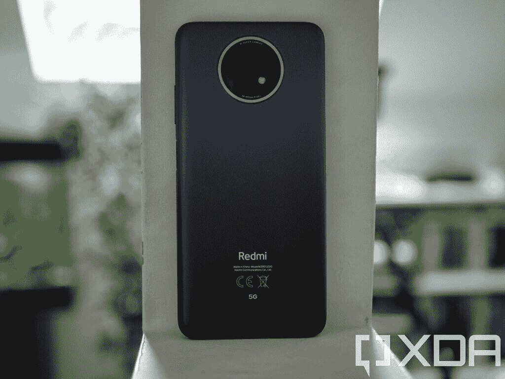

# Redmi Note 9T Review -一款极具吸引力的经济型手机

> 原文：<https://www.xda-developers.com/redmi-note-9t-review/>

中档手机越来越便宜，便宜手机越来越好。这是一种趋势，已经过了几年才真正形成，但每年都变得更加真实。红米 Note 9T 是小米在中国以外发布的最新中端智能手机之一(在中国被称为[红米 Note 9 5G](https://www.xda-developers.com/xiaomi-redmi-note-9-pro-5g-4g-redmi-watch-china-launch/) )。由联发科天玑 800U 驱动的 Redmi Note 9T 是我最兴奋的手机之一。多年来，与竞争对手高通相比，联发科通常提供低端芯片组。事实上，在很长一段时间内，联发科并没有制造*任何*高端芯片组。不过，联发科的 Dimensity 系列芯片组确实扭转了局面，它在 Redmi Note 9T 等产品上的表现给我留下了非常深刻的印象。

## 红米 Note 9T 规格

| 

规格

 | 

红米 Note 9T

 |
| --- | --- |
| **打造** | 

*   正面为康宁大猩猩玻璃 5

 |
| **尺寸&重量** | 

*   161.96 x 77.25 x 9.2mm 毫米
*   199g

 |
| **显示** | 

*   6.53 英寸 FHD+液晶显示器
*   60Hz 刷新率
*   左孔穿孔机

 |
| **SoC** | 联发科天玑 800U

*   7 纳米工艺
*   2 个 ARM Cortex A76 内核，2.4GHz 以上
*   6 个 ARM Cortex A55 内核@ 2GHz

马里-G57 MC3 |
| **风筒&储存** | 

*   6GB + 128GB UFS 2.2
*   8GB + 128GB
*   8GB + 256GB

 |
| **电池&充电** | 

*   5000 毫安时
*   18W 快速充电器
*   包装盒内包含 22.5W 充电器

 |
| **安全** | 侧装式指纹扫描仪 |
| **后置摄像头** | 

*   **主:**4800 万像素，1/1.2 英寸传感器，4in1 像素宁滨，f/1.79
*   **次要:** 8MP 超广角，f/2.2，118 FoV
*   **三级:** 2MP，宏

视频:

*   4K @ 30fps
*   1080p @ 60fps，30fps

 |
| **前置摄像头** | 1300 万 |
| **端口** | USB-C，耳机插孔 |
| **音频** | 双扬声器，AAC，LDAC，LHDC 支持 |
| **连通性** | 

*   无线网络:802.11a/b/g
*   蓝牙 5.1
*   GNSS:
    *   北斗
    *   全球（卫星）定位系统
    *   “伽利略”号
    *   GLONASS
    *   QZSS
*   乐队:
    *   5G: n1，3，41，78，79
    *   4G: FDD-LTE: B1，2，3，4，5，7，8TDD-LTE: B34，38，39，40，41
    *   3G: WCDMA: B1，2，4，5，8EVDO: BC0
    *   2G: GSM: B2，3，5，8

 |
| **软件** | 基于 Android 10 的 MIUI 12 |
| **其他特性** |  |

*关于这篇评论:*小米借给我一台红米 Note 9T 全球机，但对这篇评论的内容没有任何意见。

## 红米 Note 9T:设计

Redmi Note 9T 的设计非常独特，尽管它从 POCO X3 NFC 中借鉴了一些元素[。背部摄像头采用顶部和底部被切掉的圆形，三个背部摄像头和手电筒位于此处。背面是坚硬的纹理塑料，底部有 Redmi 标志和监管信息。这不是最高端的设计，但它实用、实用、坚固。盒子里还有一个透明的凝胶盒，为你的新设备和屏幕上方的凸起边缘提供额外的保护，以及预先应用的屏幕保护器。](https://www.youtube.com/watch?v=juB8akHiL9Q)

只有一个小下巴和左上角的自拍相机打孔切口阻碍了全屏显示。Redmi Note 9T 拥有全高清+分辨率 IPS 液晶面板，刷新频率为 60Hz，亮度水平完全适合户外观看。这不是最好的显示器，但它的性价比很高，适合浏览网页、观看 YouTube 视频和其他一般媒体消费。Redmi Note 9T 在设计方面没有什么突出的地方，但在它的价格点上，没有必要。它有一对立体声扬声器(尽管底部发射的扬声器声音更大)，顶部有一个 3.5 毫米耳机插孔。最后，Redmi Note 9T 还具有红外增强器，可用于从 Mi Remote 应用程序控制附近的红外设备。这些扬声器非常适合听音乐或看视频，尽管不要指望有出色的音频性能。麦克风也很好，打电话时我的声音听得很清楚。

侧面的按钮很好用，虽然质量不是最高的。电源按钮还兼作指纹传感器，感觉稍微便宜但功能齐全，解锁快速。左撇子用户要小心了:电源按钮/指纹扫描仪位于 Redmi Note 9T 的右侧，所以你要么需要用右手解锁，要么用左手抓住它。

* * *

## 红米 Note 9T:相机品质

小米的 Redmi Note 9T 的相机质量实际上让我印象深刻，尤其是我对一款预算设备没有抱太大期望。一般来说，预算设备在相机方面往往会偷工减料，在某些情况下几乎不值得使用。不过，我对 Redmi Note 9T 并没有这种体验，因为我发现这款相机适合许多情况。随着更便宜的智能手机变得更好，包括它们的相机，我们开始看到好的相机渗透到甚至最便宜的智能手机。

不过，距离真正的旗舰竞争对手还有很长的路要走。尽管如此，我仍然有信心说，大多数人都会对 Redmi Note 9T 的自拍相机和主后置相机的相机质量感到满意。由于 WordPress 的帮助，下面的图片被压缩和调整了大小，但是它们给了你一个整体相机质量和动态范围的概念。

Redmi Note 9T 是一个很好的例子，说明了廉价智能手机是如何变得越来越好的相机。也没有真正的快门延迟；这个设备只是一个指向和拍摄没有任何重大的滞后或延迟注意到拍照时。如果你正在寻找一部拥有出色摄像头的智能手机，如果你能多花一点钱，肯定有更好的选择，比如谷歌 Pixel 4a。然而，如果你预算有限，只需要偶尔拍照，红米 Note 9T 不会让你失望。

**快速提示:**确保关闭*相机设置中的*水印。我只是为了上面的照片才开着它，但是你可以在相机设置里关掉它。如果您出于某种原因想让它开着，您可以在设备名称旁边添加一个时间戳和您自己的文本。

## 红米 Note 9T:性能

这是一款坚固且有竞争力的中档设备

这是红米 Note 9T 最有趣的方面之一，主要归功于[的联发科天玑 800U 板载](https://www.xda-developers.com/mediatek-dimensity-800u-announced/)。我真的不知道会发生什么，因为我以前从未使用过 dimension-powered 智能手机。我显然没有期待革命性的智能手机体验，但我确实得到了相当可观的价格。我可以玩高清质量的 PUBG Mobile，通常在任何时候都在 30 到 60 FPS 之间。偶尔会有下降，但没有持续太长时间或使游戏不可玩，如果你想挤出更多的 FPS，你可以降低质量。

说到性能，Redmi Note 9T 并不是最好的——事实上，远非如此，正如其 Geekbench 评分所示。这些分数与骁龙 732G 的分数非常接近，后者为 POCO X3 NFC 等设备提供动力。我还运行了一个 CPU 节流测试，它显示了在超过 5 分钟的时间内达到极限时完全持续的性能。过了这个时间，它的性能降低到了最大性能的 78%左右——不太好，但也不可怕。

这无疑是一款中端预算智能手机，但最终我的经验表明，Redmi Note 9T 是一款*可靠且有竞争力的*中端设备。如果你想拿起一部智能手机来模仿比任天堂 DS 更强大的设备，那就别想了。联发科天玑 800U 不是为此而生的。如果你想买一部智能手机来玩基本游戏、浏览网页、使用社交媒体、看电视节目或电影，那么这里是你的不二之选。

* * *

## 基于 Android 10 的 MIUI 12

老实说，MIUI 12 是我最喜欢的安卓变种之一。MIUI 令人难以置信地流畅，充满了真正有用的功能。虽然几年前 MIUI 的名声不好，但我发现它现在看起来很好，性能也很好。它还使 Redmi Note 9T 拥有出色的电池续航时间，我每天按时屏幕 5-7 小时，轻松度过了一天。当我在家的时候，我倾向于使用手机，尽管我也意识到在一天中到处走动时，使用 Wi-Fi 比使用移动数据要轻松得多。因此，这些结果不是最准确的，但我有信心说，红米 Note 9T 的 5000 毫安时电池加上以预算为导向的芯片组，无论你扔什么，都可以轻松度过一天。

虽然 MIUI 的速度一如既往，但可悲的是仍然有很多预装的膨胀软件。脸书、抖音、WPS Office 和 Agoda 都是预装的。还预装了六款游戏:方块拼图守护者、疯狂榨汁机、尘埃落定、瓷砖乐趣、泡泡总动员、和朋友一起泡泡射手。幸运的是，所有预装的应用程序和游戏都可以被删除，尽管不得不删除它们很烦人。

总的来说，这是你最近期待的相同的 MIUI，但有一些新的补充。MIUI 启动器现在有了一个应用抽屉，想要一个应用抽屉就不需要再为一个应用抽屉安装第三方启动器了！尽管如此，我还是建议你试试第三方启动器，来修补你的新智能手机。例如，我在我的 Redmi Note 9T 上设置了 [Niagara Launcher](https://www.xda-developers.com/niagara-launcher-out-of-beta/) ，它最近才出测试版！无论如何，几个月前不喜欢 MIUI，现在也不会喜欢。尽管如果你以前喜欢它，你现在肯定会*喜欢它。*

话虽如此，仍然有一些软件怪癖困扰着我。例如，我发现一个蓝光过滤器在晚上一直开着，而且无法关闭。这似乎是因为我在设置手机时恢复了谷歌备份，因为我发现这是 AOSP 蓝光过滤器，在晚上自动启用。如果其他人在他们的单元上遇到类似的问题，使用 ADB 很容易解决[。在开发者选项中启用“USB 调试”和“USB 调试(安全设置)”后，需要运行两个命令。](https://www.xda-developers.com/install-adb-windows-macos-linux/)

```
 adb shell settings put secure night_display_activated 0 
```

```
 adb shell settings put secure night_display_auto_mode 0 
```

一旦我运行了这两个命令，问题就消失了，MIUI 的蓝光过滤器(被称为“阅读模式”)现在工作正常。我不明白为什么当我恢复我的备份时这些值没有被重置，考虑到你不能通过正常的方式启用或禁用这些。

我在 MIUI 上遇到的另一个问题是，它要求我单独禁用每个应用程序的黑暗模式。启用黑暗模式会为不一定支持黑暗模式的应用单独启用黑暗模式，作为实际上没有黑暗模式的应用的变通方法。这可以改变应用程序的颜色，使应用程序看起来很丑，但你需要为每个你不喜欢的应用程序单独关闭它。这对于大多数应用程序来说都没问题，但是我遇到了一些我不得不关闭的应用程序。最大的违规者是 Spotify 和 Facebook Messenger，它们的 UI 元素发生冲突，白色文本在浅灰色背景下很难阅读。对于没有内置黑暗模式的应用程序来说，这是一个有用的功能，但它并不完美。

* * *

## 结论:红米 Note 9T 物超所值

Redmi Note 9T 是一款非常便宜的智能手机，配有强大的(价格)芯片组。它将满足只对使用手机看电影、浏览社交媒体、捕捉几张照片和玩几个游戏感兴趣的普通用户的需求，所有这些都在一天的充电时间内完成。电池续航时间很长，设备拿在手上感觉很好，显示器在这个价位也绰绰有余。总的来说，我对 Redmi Note 9T 没有任何抱怨，考虑到它的价格，这似乎不是吹毛求疵，我遇到的最大问题都可以在软件中解决。

**[红米 Note 9T 论坛](https://forum.xda-developers.com/f/redmi-note-9t.12075/)**

你可以在欧洲的€229 买到 4GB + 64GB 型号的 Redmi Note 9T，或者在€269 买到 4GB + 128GB 型号的 red mi Note 9T。在英国，Redmi Note 9T 的基本 4GB + 64GB 型号售价 229 英镑，而 4GB + 128GB 存储型号仅售 249 英镑。

### 红米 Note 9T

小米的红米 Note 9T 起步价为 229 英镑/€229 英镑，没有多少抱怨的余地。事实上，考虑到它的价格，我几乎喜欢它的一切。

**Affiliate Links**

Amazon

[View at Amazon](https://www.amazon.co.uk/Xiaomi-Redmi-Note-Smartphone-DotDisplay/dp/B08R7S6DCD/)