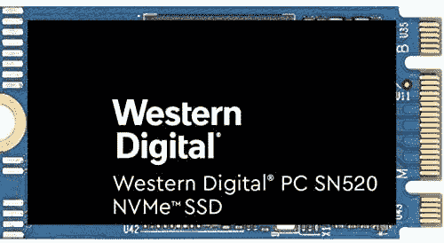

# 需要更多储物空间？下面介绍如何更换 Surface Pro 8 上的 SSD

> 原文：<https://www.xda-developers.com/replace-surface-pro-8-ssd/>

Surface Pro 8 是微软近年来制造的最好的设备之一，很难否认它做了很多正确的事情。它拥有更大的高分辨率 120Hz 屏幕，具有 Thunderbolt 端口的新设计，以及 spec bump，正如你在我们的 [Surface Pro 8 评测](https://www.xda-developers.com/surface-pro-8-review/)中看到的那样，它确实是一款出色的笔记本电脑。但也是贵的那种，如果要升级存储，更是如此。谢天谢地，微软让 Surface Pro 8 上的 SSD 更换变得很容易。

微软实际上建议只在商业环境中这样做，这更像是在回收电脑之前销毁敏感数据的一种方式。这意味着，正式来说，你**不应该**用你的个人 Surface Pro 8 自己这么做。但如果你想做，我们会帮你的。

## 你需要什么

在你开始之前，你需要做一些事情。最重要的是，新的固态硬盘和进入固态硬盘插槽的工具。不过，你实际上并不需要很多工具来接触 Surface Pro 8 的固态硬盘，因为它非常容易接触到。这是你需要的:

 <picture></picture> 

Torx Screwdriver Set

##### Tekprem 梅花螺丝刀套件

 <picture></picture> 

SanDisk PC SN520 512GB M.2 2230 SSD

##### 闪迪电脑 SN520 M.2 2230 固态硬盘

 <picture></picture> 

Samsung DUO Plus Flash Drive

这里需要注意的是固态硬盘的外形。最常见的外形是更长的 M.2 2280 设计，但 Surface Pro 8 使用更小的 2230 变体，这是唯一合适的尺寸。你可以通过上面的链接找到合适的。

此外，在更换固态硬盘后，您需要一个 USB 闪存驱动器来安装 Windows 11。微软用 Surface recovery images 让这变得相当容易，我们稍后将向您展示如何使用它们。我们有一个上面列出的 USB Type-C 闪存驱动器，因为 Surface Pro 8 没有 USB Type-A 端口。如果你已经有一个闪存盘，你也可以得到一个 C 型转 A 型的适配器。此外，确保闪存驱动器格式化为使用 FAT32 文件系统。

## 准备更换 Surface Pro 8 上的固态硬盘

如果你要扔掉你的旧固态硬盘，你需要做的第一件事就是确保你可以在事后用你的新固态硬盘重新开始。为此，您需要在 USB 闪存驱动器上安装一个恢复映像，并且您可能还需要备份您的文件。然后，如果你想删除所有数据，你可以[重置你的电脑](https://www.xda-developers.com/how-to-reset-windows-11-factory-settings/)，如果你要出售固态硬盘或把它送给别人，你可能会这么做。下面是怎么做的。

1.  将你的个人文件备份到 OneDrive 等云存储服务，或者使用外置硬盘或固态硬盘(**与你用于恢复的 USB 驱动器**不同)。
2.  转到[表面恢复图像下载页面](https://support.microsoft.com/en-us/surface-recovery-image)。
3.  选择 Surface Pro 8 并输入产品的序列号。您可以在支架下找到序列号，靠近设备中部。
4.  下载恢复映像，它是一个. zip 文件。
5.  将文件提取到。将归档文件压缩到 USB 闪存驱动器中——确保驱动器已经过格式化，并且事先使用了 **FAT32** 文件系统。
6.  一旦。zip 文件被解压缩，您的个人文件也已全部备份，您已准备好重置 Surface Pro 8。同样，这是可选的，但如果你打算赠送或出售固态硬盘，最好是安全起见。
7.  打开设置 app，然后点击**恢复**->-**重置 PC。**
8.  如果您希望从 SSD 中删除您的个人数据，请选择**删除所有内容**。
9.  接下来，选择是要使用本地重新安装还是云下载进行重置。这应该不会影响最终结果，所以这取决于你，但本地重新安装选项更快。
10.  在完成该过程之前，点击**更改设置。**
11.  启用显示**清洁驱动器**的选项。这将使用空数据覆盖驱动器中的空间，使恢复文件变得更加困难。
12.  单击确认并按照程序开始重置电脑。
13.  完成后，关闭 Surface Pro 8。

## 更换 Surface Pro 8 中的固态硬盘

现在，你可以开始更换 Surface Pro 8 内部的固态硬盘了。这个过程相当简单，所以下面是你需要做的。

1.  打开 Surface Pro 8 上的支架，露出左侧的 SSD 盖。
2.  使用 SIM 弹出工具或回形针，推入盖子上的小孔，将其取出。固态硬盘立即出现在该部分的上半部分。
3.  使用 Torx T3 螺丝刀，拧下固定 SSD 的螺钉。
4.  轻轻地将固态硬盘滑出插槽。
5.  拿起您的新 SSD，使用触针中的凹槽将其与 SSD 插槽对齐。以 45 度角滑入 SSD，直到触点完全被 SSD 插槽覆盖。
6.  使用 Torx T3 螺钉将新 SSD 固定到位。
7.  重新盖上固态硬盘盖。
8.  现在，您可以将 Surface Pro 8 设置为一台新电脑。

## 更换 SSD 后重新安装 Windows 11

一旦你更换了固态硬盘，你需要重新安装 Windows 11 来重新开始，就像它是一台新的 PC 一样。以下是要做的事情:

1.  **在**开启 Surface Pro 8 之前，插入你用来存储 Surface recovery 镜像的 u 盘。
2.  插上你的 Surface 充电器。
3.  按住调低音量按钮的同时，按下 Surface Pro 8 上的电源按钮，直到看到恢复选项。
4.  按照说明安装 Windows 11。

一旦完成，你就可以访问你的云服务或外部存储来获取你开始时备份的个人文件。除此之外，你已经完成了，你可以在 Surface Pro 8 中使用新的和改进的 SSD 了。

如果你还没有，你可以使用下面的链接购买 Surface Pro 8。这是你今天能买到的最好的笔记本电脑之一，如果你从来不需要升级存储，现在你知道如何升级了。

 <picture></picture> 

Surface Pro 8

##### 微软 Surface Pro 8

Surface Pro 8 是一款现代 Windows 平板电脑，拥有最新的规格，120Hz 显示屏，支持 Thunderbolt 4。