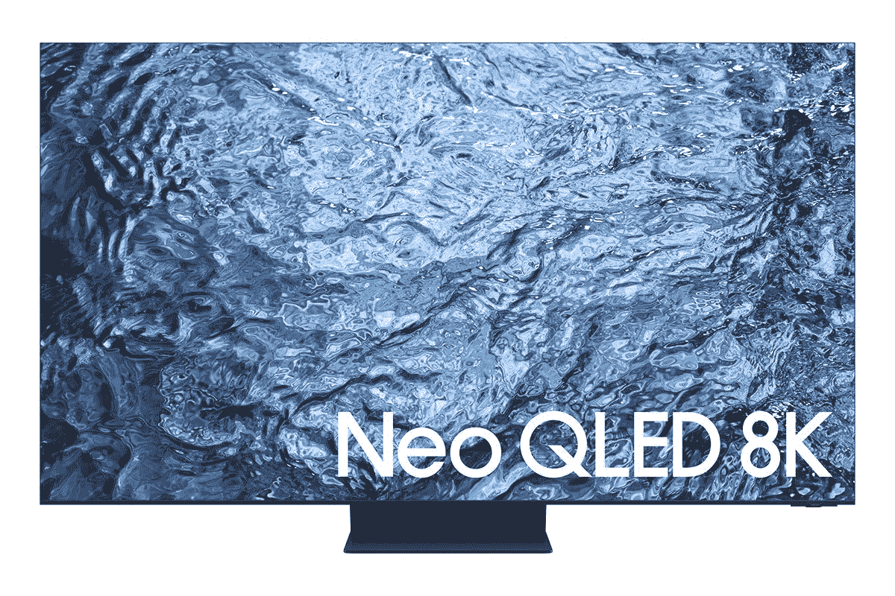
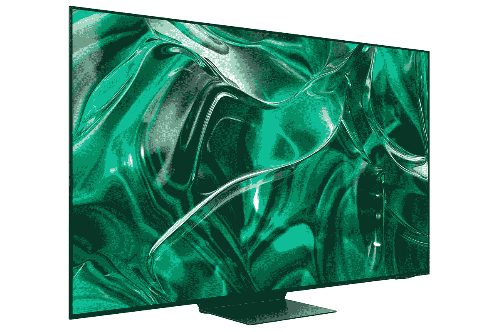

# 三星在 CES 上发布其 2023 年电视和投影仪阵容

> 原文：<https://www.xda-developers.com/samsung-2023-tv-projector-ces/>

三星已经凭借其第[款双 4K 游戏显示器](https://www.xda-developers.com/samsung-monitors-ces-2023/)和 [Flex 混合显示器原型](https://www.xda-developers.com/samsung-flex-hybrid-prototype-ces-2023/)在 CES 2023 上引起了轰动。但该公司还没有完成展示其最新的创新。今天，它已经揭开了 2023 年电视、投影仪和条形音箱阵容的盖子，它有一些令人兴奋的产品，你绝对应该看看。

## 三星 Micro LED 和 Neo QLED 电视

全新的 76 英寸三星微型 LED CX 是三星 2023 年电视阵容中的主打产品，因为它使消费者更容易获得三星[【The Wall】](https://www.xda-developers.com/samsung-2021-the-wall-microled-display-launch/)微型 LED 显示屏的创新技术。它加入了该公司的 [110 英寸微型 LED 电视](https://www.xda-developers.com/samsung-launches-massive-110-microled-tv-korea/)，但带来了几项重大改进，包括更容易安装、23 位黑色细节、240Hz 可变刷新率和 2 纳秒响应时间。

 <picture></picture> 

Samsung QN900C Neo QLED 8K TV

三星 Neo QLED 8K 电视(QN900C)是三星今年智能电视阵容中另一款令人印象深刻的产品，具有 8K 分辨率面板，14 位对比度，4000 尼特峰值亮度，1000 多个局部调光区，以及戏剧般的音频输出。新的 Neo QLED 4K 电视(QN95C)还带来了改进的亮度和灰度控制、14 位处理、改进的调光和 20 毫米超薄边框。但它缺少 8K 机型上的一些显著特征。

 <picture></picture> 

Samsung S95C 4K OLED TV

排在后面的是三星的新有机发光二极管 4K 电视(S95C)，这应该是最实惠的选择。它结合了三星最新的量子点和有机发光二极管技术，与去年的型号相比，提供了更高的亮度和颜色精度，0.1 毫秒的响应时间，以及高达 144Hz 的刷新率。这款电视直接面向游戏玩家，因为它可以通过游戏中心访问 Nvidia 的 GeForce Now 等游戏流媒体服务，并通过其 70W 4.2.2 声道杜比 Atmos 认证扬声器提供身临其境的声音输出。

## 自由式和首映放映机

除了新电视，三星还推出了其自由式投影仪和 Premiere 投影仪的更新版本。Freestyle 2023 为现实世界的元宇宙应用等新用例提供了更新的设计，新的边缘混合技术可帮助用户同步两台投影仪以形成一个超宽显示器，游戏中心支持可让用户访问云游戏服务。

Premiere 8K 投影仪建立在同名的旧 4K 投影仪的成功基础上，它可以在任何表面上显示巨大的 150 英寸图像。超短焦 8K 投影仪提供了真正的智能电视体验，配有杜比 Atmos 影院环绕声、对 OTT 应用的支持以及新 8K 智能电视上的其他功能。

除了新的硬件，三星今年将为其家庭娱乐产品引入一些新功能和软件改进。智能电视将采用新的 Relumino 模式，帮助视力障碍者在不需要可穿戴硬件的情况下享受他们最喜爱的内容，以及基于电视的健康监测服务，该服务使用摄像头来测量用户的心率、心率变异性、呼吸频率、氧饱和度和压力指数。

此外，新的三星远程医疗应用程序将帮助用户从智能电视上轻松预约远程医疗，并在舒适的沙发上通过视频会议进行检查。最后，三星 2023 年的电视系列将提供新的聊天功能，帮助用户在看电视的同时与朋友实时交流。

目前，我们无法获得三星最新家庭娱乐产品的完整规格、定价和可用性细节。但是，根据我们目前掌握的信息，你不应该指望这些产品会很便宜。如果这些三星产品中的任何一个引起了你的兴趣，你可能应该开始存钱，以便在它上市后尽快得到它。