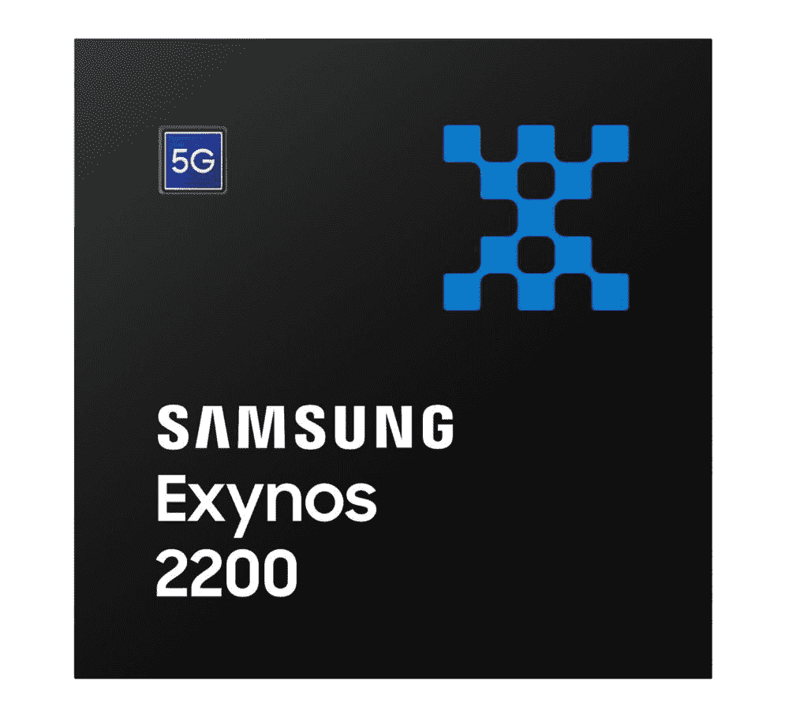

# 三星 Exynos 2200 SoC 搭配 Xclipse 920 GPU 发布

> 原文：<https://www.xda-developers.com/samsung-exynos-2200/>

新芯片的推出是智能手机领域的一件大事。与可以由许多原始设备制造商设计、制造和销售的手机不同，手机 SOC 仅限于少数几家公司，在旗舰领域竞争的公司就更少了。这些旗舰 SOC 定义了今年预期的竞争，为我们预计在下一款 Android 旗舰中看到的功能集奠定了基础。三星现在终于宣布了采用 Xclipse 920 GPU 的新 Exynos 2200 SoC，这将与[高通骁龙 8 Gen 1](https://www.xda-developers.com/qualcomm-snapdragon-8-gen-1/) 展开激烈竞争。

## 三星 Exynos 2200:规格

|  | 

三星 Exynos 2200

 |
| --- | --- |
| **CPU** | 

*   1 个 ARM Cortex-X2 Prime 内核
*   3 个 ARM Cortex-A710 高性能内核
*   4x ARM Cortex-A510 高效内核

 |
| **GPU** | 

*   三星 Xclipse 920 GPU
*   视频播放:10 位 HEVC (H.265)支持高达 8K @60fps，10 位 VP9、AV1 支持 30fps

 |
| **显示** | 最大设备上显示支持:4K @ 120hz/QHD+@ 144hz；HDR10+ |
| **艾** | 具有双核 NPU 和 DSP 的人工智能引擎 |
| **内存&存储** | LPDDR5UFS 3.1 |
| **ISP** | 

*   单摄像头:最高 108MP @ 30 FPS 高达 200 兆像素
*   双摄像头:高达 64+32MP @ 30 FPS
*   视频捕获:8K @ 30 fps，10 位 HEVC (H.265)，VP9

 |
| **调制解调器** | 

*   5G NR 6 GHz 以下:5.1Gbps(下行)/2.55Gbps (UL)
*   5G NR 毫米波:7.35Gbps(下行)/3.67Gbps (UL)
*   LTE:第 24 类 8CA 3Gbps(下行链路)/第 22 类 4CA 422Mbps (UL)

 |
| **充电** | - |
| **连通性** | 位置:北斗，伽利略，GLONASS，全球定位系统 |
| **制造工艺** | 三星 4 纳米 EUV 工艺 |

* * *

### 

### GPU:基于 AMD RDNA 2 处理器的 Xclipse 920

三星 Exynos 2200 是一款令人兴奋的 SoC，我们稍后将全面介绍它。但首先，有必要谈谈这款新 SoC 的最大亮点。Exynos 2200 配备了新的 Xclipse 920 GPU，这是三星在 2021 年 1 月宣布与 AMD 合作的直接产物。预计它将在 Exynos 2100 上提供比 Mali-G78MP14 更大的性能改进。如果你用过 Exynos 2100 旗舰机，比如在印度销售的三星 Galaxy S21 Ultra，你就会知道这款设备的游戏性能有多糟糕。我个人购买并使用 Galaxy S21 Ultra 作为我的日常驱动程序，对于我使用 Genshin Impact 的日常游戏修复来说，这是一个相当令人失望的体验。以至于一有机会，我就换了一加 9 Pro 和小米 11 Ultra(都是骁龙 888)。

凭借 Exynos 2200 和 Xclipse 920，三星设定了一些崇高的期望。这是第一个三星芯片组与 AMD 的 RDNA 2 为基础的 GPU。RDNA 是 AMD 目前镭龙图形架构的代号，RDNA 2 用于 PlayStation 5、Xbox 系列 X、Xbox 系列 S，以及 AMD 的镭龙 RX 6000 显卡。用于控制台和桌面图形的架构现在正被集成到移动芯片中。这种集成使三星能够通过 Xclipse 920 GPU 形式的首个硬件加速光线跟踪(RT)解决方案来宣传“控制台质量”的身临其境的视觉效果。板载还有可变比率遮光(VRS)。

光线跟踪是指模拟光线在现实世界中的物理行为的技术，而 VRS 技术允许开发人员在不会影响质量的区域应用较低的阴影率，从而提高帧率。虽然我们肯定需要等待，看看芯片及其 GPU 在这些预期方面的实际表现如何，但在营销材料中简单地使用这些关键词，就可以立即将预期标准提高到比 Exynos 2100 上的 Mali-G78MP14 高得多的水平。如果三星正在将控制台和桌面功能带到移动设备上，那么 Xclipse GPU 肯定比 Mali-G78MP14 性能更好，对吗？人们可以希望。

三星的新闻稿还提到，Xclipse GPU 是“exy nos SoC 中多个计划代 AMD RDNA 显卡的*第一个结果”，因此我们当然希望看到出色的游戏性能成为三星未来旗舰 SoC 的默认功能。*

### CPU:ARM 最新款

对于 CPU，Exynos 2200 紧跟新的高通骁龙 8 Gen 1，因为两者都跳到了 2021 年 3 月推出的 ARMv9 架构。骁龙 8 Gen 1 中高通的 Kryo 芯片基于 ARMv9 架构的 CPU 设计，三星在 Exynos 2200 上使用了相同的 CPU 设计。与骁龙 8 Gen 1 非常相似，Exynos 2200 具有一个 Cortex-X2 prime 内核、三个 Cortex-A710 性能内核和四个 Cortex-A510 效率内核。三星没有透露确切的时钟速度，所以我们必须等待设备发布才能获得这些信息。无论如何，我们预计今年这两款旗舰芯片之间的性能差异将比过去几年小得多。

### Exynos 2200: NPU

三星的[新闻稿](https://shop-links.co/1763607211803749820?u1=e394d4c3-c017-4975-92ce-e39cd9c264be)对 NPU 来说没有太多细节，我们认为这可能成为高通和三星今年产品的一个不同点。随着智能手机越来越依赖人工智能和人工智能来实现其功能，NPU 的重要性越来越大，如果 [Pixel 6 系列](https://www.xda-developers.com/google-pixel-6/)上的[谷歌张量](https://www.xda-developers.com/exclusive-google-tensor-specs-in-pixel-6/)芯片有任何指示意义，其结果值得关注。

对于 Exynos 2200，三星声称升级后的 NPU 与前代相比性能翻了一番。除了高能效的 int 8(8 位整数)和 INT16 之外，NPU 现在还通过 FP16(16 位浮点)支持提供"*更高的精度。*”

### 调制解调器

Exynos 2200 配备了 3GPP Release 16 5G 调制解调器，支持 sub-6GHz 和毫米波。mmWave 上声称的最高速度是 7.35Gbps 下载，但通过 E-UTRAN 新的无线电双连接(EN-DC)功能，该调制解调器可以通过利用 4G LTE 和 5G NR 信号将速度提升至 10Gbps。

### 安全性

为了安全起见，Exynos 2200 配备了集成安全元件(iSE)来存储私有密钥，并充当 RoT(信任根)的角色。此外，用于 UFS 和 DRAM 的内联加密硬件得到了增强，使用户数据加密仅在安全域内安全共享。一旦芯片进入设备，我们希望获得更多关于这些功能的细节。

### Exynos 2200: ISP

Exynos 2200 的 ISP 支持高达 200MP 的摄像头分辨率，如果三星愿意，这为未来三星设备配备超高分辨率摄像头打开了大门。在 30fps 的速度下，ISP 在单摄像头模式下支持高达 108MP，在双摄像头模式下支持 64+32MP。此外，ISP 可以连接到多达 7 个单独的图像传感器，甚至可以同时驱动其中的 4 个传感器——这应该为更多功能的相机设置以及镜头之间更好的无缝切换打开了大门。

在 NPU 的帮助下，ISP 可以实现更具内容感知能力的相机体验，例如基于 ML 的人工智能识别场景中的多个对象、环境和人脸。

对于视频录制，ISP 支持高达 4K HDR，以及高达 8K 分辨率的录制。Exynos 2200 上的多格式编解码器(MFC)最高支持 4K @120 和 8K @30 编码，最高支持 4K @240 和 8K @60 解码。MFC 集成了 AV1 解码器，因此您可以获得更好的功效和更长的播放时间。

## Exynos 2200:版本和可用性

三星提到 Exynos 2200 正在量产。没有提到任何时间表或设备估计，这是相当有趣的，如果你一直在关注这个新 SoC 的泄漏和新闻。Exynos 2200 原本应该在 2022 年 1 月 11 日发射。但是一天过去了，没有任何消息。三星甚至删除了日期公告推文，加剧了 Exynos 2200 可能不会实现的猜测。三星不得不澄清新芯片将与 [Galaxy S22](https://www.xda-developers.com/samsung-galaxy-s22/) 一同发布。一个星期后，芯片发布了，但是没有设备被命名。

目前的猜测表明，欧洲等市场仍有望在 Galaxy S22 系列中获得 Exynos 2200，而美国和印度等市场预计将在骁龙 8 Gen 1 中获得 Galaxy S22。三星没有澄清任何一种方式，因此这种情况如何发展还有待观察。尽管如此，我们很高兴终于看到一款具有游戏能力的 Exynos 芯片和三星旗舰。