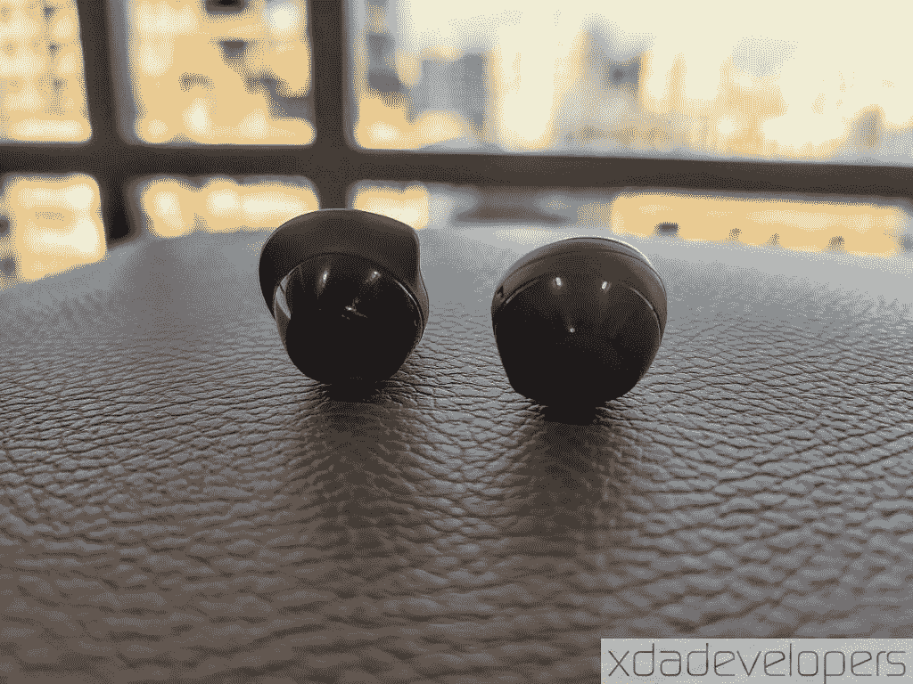

# 三星 Galaxy Buds+ Review:有意义的增量

> 原文：<https://www.xda-developers.com/samsung-galaxy-buds-plus-review/>

无线耳机和真正的无线耳机已经出现了几年，但直到最近我们才看到它们的普及。这在一定程度上要归功于原始设备制造商坚持从顶级手机上移除 3.5 毫米耳机插孔，然后推出无线音频解决方案作为额外购买。三星进入无线音频游戏已经有几年了，2016 年发布了迎合健身爱好者的 [Gear Icon X。但随着 2019 年](https://shop-links.co/link/?exclusive=1&publisher_slug=xda&article_name=Samsung+Galaxy+Buds%2B+Review%3A+The+Meaningful+Increment&article_url=https%3A%2F%2Fwww.xda-developers.com%2Fsamsung-galaxy-buds-plus-review%2F&u1=UUxdaUeUpU28647&url=https%3A%2F%2Fwww.samsung.com%2Fglobal%2Fgalaxy%2F&ourl=https%3A%2F%2Fwww.samsung.com%2Fglobal%2Fgalaxy%2Fgear-iconx%2F)的 [Galaxy Buds，三星转移了注意力，以更谨慎但时尚的设计吸引主流观众，他们实际上最终做了一件出色的工作。三星 Galaxy Buds+继承了 Buds，声称可以将收到的反馈吸收到更全面的产品中。但是 2020 年的 Galaxy Buds+到底有多好？下面是我对三星旗舰真无线耳塞的评测。](https://www.xda-developers.com/samsung-galaxy-watch-active-galaxy-buds-galaxy-fit-official/)

## 三星 Galaxy Buds+:规格

| 

规范

 | 

三星 Galaxy Buds+

 |
| --- | --- |
| **尺寸和重量** | 

*   耳塞:
    *   17.5 x 22.5 x 19.2mm 毫米
    *   6.3g
*   案例:

 |
| **电池和充电** | 

*   耳塞:85 毫安时
*   外壳:270mAh

 |
| **扬声器和麦克风** | 

*   低音扬声器加高音扬声器
*   2 个麦克风(外部)和 1 个麦克风(内部)

 |
| **连通性** | 

*   蓝牙 5.0
*   简介:A2DP，AVRCP，HFP
*   编解码器:可扩展(三星专有)、ACC、SBC

 |
| **传感器和其他硬件** | 加速度计、红外、霍尔、触摸、3 个麦克风 |
| **箱子内容** | 

*   耳塞
*   翼尖(南、中、左)
*   耳塞(小号、中号、小号)
*   充电盒
*   充电电缆(USB Type-C)
*   快速入门指南

 |
| **颜色** | 白色、蓝色、黑色、红色、粉色、[BTS 特别版紫色](https://www.xda-developers.com/samsung-announces-galaxy-s20-galaxy-buds-themed-after-korean-band-bts/) |

*注:三星印度给我们发了一个三星 Galaxy Buds+进行评测。然而，他们没有对这次审查的内容提出任何意见。这个评论是在使用了大约三个星期之后。*

* * *

## 三星 Galaxy Buds+ -设计和制造

三星 Galaxy Buds+在设计上与最初的 Galaxy Buds 相似。但正如这款产品的总体主题一样，变化是微妙的，但却给人一种比前代产品更完整的体验。区分 Galaxy Buds 和 Galaxy Buds+的唯一方法是寻找后者的第三个麦克风孔。否则，它们在外表上看起来是一样的。

Galaxy Buds+确实感觉有点廉价，与价格不符。耳塞触摸板和外壳上的光滑表面区域可能会保留指纹，使它们看起来很脏。光泽也与橡胶翼尖形成了鲜明的对比，它给 buds 的设计感觉不像一些竞争对手那样无缝，特别是与苹果 AirPods 等具有突出茎干的产品相比。

 <picture></picture> 

Samsung Galaxy Buds+: Difference between S and L wingtips. Notice the lack of stabilizing protrusion on the S size wingtip (on the right)

奇怪的是，三星在其大多数营销和推广材料中显示了“S”尺寸的翼尖，这种翼尖没有突出的稳定器，而其他两种尺寸的翼尖有突起/小“稳定器”,试图钩住耳廓。即使在最大的翼尖上，稳定器也不会太大，所以它们不太可能引起刺激、烦恼或不适。

当你仔细观察翼尖时，就会发现三星对细节的关注——Galaxy Buds+上的塑料外壳底部有一个凸起的疙瘩，橡胶翼尖有一个互补的穿孔，确保只有一种正确的方式让耳塞佩戴在翼尖上。

一旦你克服了 Galaxy Buds+上过度使用光泽的问题，你就会意识到该软件包的其余部分实际上是惊人的。Galaxy Buds+耳塞的占用空间很小，它们从您的耳朵中伸出的距离很小。它们也相当轻便。这种组合的最终结果是，我连续几个小时穿着它们都不会感到疲劳。

与体积更大的索尼 WF-1000XM3 不同(如上图)，我实际上可以将我的头侧靠在枕头上，将 Galaxy Buds+放在耳朵里，而不会让它们深入我的耳朵或引起任何不适。我甚至戴着耳机小睡了一会儿，这证明了戴耳机是多么的轻松。

耳塞上的配合也很棒。无论选择哪种翼尖(没有稳定器的 S，或有稳定器的 M/L)，三星 Galaxy Buds+都位于耳朵深处，即使在走动或做轻微的头部运动时也不会掉出。随附的橡胶耳塞头可以很好地将耳塞固定在耳道内，还可以很好地隔离噪音。我还没有遇到过耳机从耳朵里弹出或变得不稳定的情况，但你耳朵的形状很可能会给你带来不同的体验。尽管如此，其整体小尺寸和设计加上低重量和深度耳贴合，使三星 Galaxy Buds+成为耳机的绝佳选择，您可以戴在耳朵上几个小时就忘记了。

就外壳而言，三星 Galaxy Buds+采用药丸形状的外壳，在磁铁的帮助下可以关闭盖子。Galaxy Buds+放在表壳内没有任何问题，这是理所应当的。如果我不得不吹毛求疵，我会说，当把耳塞放回外壳时，耳塞的磁性咬合动作有点乏味，不如索尼 WF-1000XM3 的紧密咬合令人满意。继续前进，大小的情况下感觉完美的口袋，这是一个受欢迎的变化，像我这样的人谁来自笨重的 WF-1000XM3 和它更笨重的情况。

但如前所述，三星 Galaxy Buds+外壳的全光滑表面降低了成本，使其看起来有点花哨。相比之下，索尼 WF-1000XM3 的外壳大部分表面区域采用了哑光处理，相比之下感觉更高档(尽管索尼的抛光金属盖绝对容易刮伤，这本身就是一个大问题)。

外壳内部有一个 LED 指示灯，用于指示耳塞的充电状态，外部有另一个 LED 指示灯，用于指示外壳的充电状态。在外壳内部，有一个橡胶条来指示左右耳塞的放置位置——很容易将小突起误认为是某种可以按下的按钮，但它们实际上不是按钮，因为它们不能按下，除了视觉效果之外不提供任何功能。

USB Type-C 端口位于外侧转轴的下方。您可以使用该端口为保护套充电，也可以选择使用 Qi 认证的无线充电器为保护套无线充电。无线充电是对原始 Galaxy Buds 的差异化升级，因此如果您已经投资了无线充电器，您将会欣赏三星 Galaxy Buds+为您的生活带来的更多便利。但如果你不是，三星还在盒子里提供了标准的 USB 型到 C 型电缆，所以无论哪种方式都可以覆盖你。

还有一点需要注意:三星 Galaxy Buds+的 IPX2 等级，这意味着它只能抵抗轻微的水溅。换个角度来说，Galaxy Buds+可以处理轻度出汗，但仅此而已。因此，不建议在任何严肃的训练或下雨时穿着它们。

总而言之，三星 Galaxy Buds+的设计非常好，体积小，重量轻，穿着舒适。这种情况下也很紧凑，可放入口袋。除了光滑的表面和较差的 IP 等级，我对这个配件的设计或制造没有任何主要的抱怨。我希望三星注意到这个反馈，因为如果没有光泽，Galaxy Buds+将接近完美！

* * *

## 三星 Galaxy Buds+ -功能

### 简单配对

三星 Galaxy Buds+具有一系列强大的功能。首先，第一个配对过程非常简单:你只需打开盖子，Galaxy Buds+就已经处于配对模式。在您的智能手机或其他设备上进入配对模式，点击 Galaxy Buds+入口，您就连接好了，一切就绪！你不需要一个应用程序或帐户来登录，就可以使用 Galaxy Buds+及其基本功能，也不需要记住任何复杂的配对手势或动作。这是一个很大的优势(无意的双关语),因为它消除了入职过程中的摩擦，使这些成为普通消费者友好的产品。

当您在与第一台设备保持连接的同时与第二台设备配对时，配对过程只会变得稍微复杂一些。在这种情况下，您需要断开与之前设备的连接(最好通过关闭蓝牙),然后手动进入配对模式(轻按一次，然后轻按并按住触摸区域),或者将耳塞放回外壳并重新打开盖子。诚然，这有点麻烦，但如果 Galaxy Buds+没有活动的连接，配对过程仍然没有痛苦。当他们无法连接到以前的连接时，他们会自动进入配对模式，这很好。请注意，Galaxy Buds+在盖子打开时会启动连接，不需要拔出耳塞来打开它们。此外，你也可以使用单一的耳塞。

如果你有一部安装了三星 SmartThings 应用程序的三星智能手机，配对过程应该会更容易。不过，我没有三星设备来测试这一点。还有，注意 Galaxy Buds+也不支持[谷歌的快速配对](https://www.xda-developers.com/fast-pair-quick-bluetooth-pairing-headphones/)。

### 多设备切换

当 Galaxy Buds+推出时，关于多设备切换有一些轻微的争议。该功能仅在两台安装了 Samsung SmartThings 应用程序的 Samsung 设备之间切换时可用。然后，SmartThings 将使用户能够在每个设备的媒体面板内点击，以在两个设备之间移动 Galaxy Buds+连接。然而，[随后的更新](https://www.xda-developers.com/samsung-galaxy-buds-plus-now-easily-switch-between-devices-seamlessly/#:~:text=For%20non%2DSamsung%20phones%2C%20users,second%20device%20(Device%20B).)为非三星设备带来了多设备支持。

因此，现在在两个设备之间切换的摩擦少了很多。这立即提升了 Galaxy Buds+相对于索尼 WF-1000XM3 的便利性和实用性，因为我可以毫不费力地在几部手机和我的笔记本电脑之间切换。但仍有改进的空间——例如，我真的希望下一代产品采用蓝牙多点技术，并智能地转移音频焦点。

### 控制

三星 Galaxy Buds+有一个朝外的大触摸板(光滑部分)。这可以通过不同的组合来控制不同的功能。轻按任一按钮即可播放和暂停曲目。双击将播放下一首曲目，三击将播放上一首曲目。如果有来电，您可以双击接受，单击并按住拒绝。[三星可穿戴应用](https://play.google.com/store/apps/details?id=com.samsung.android.app.watchmanager)可以让你分别将左右耳塞上的单触按住命令重新配置为以下四个选项中的任何一个:语音命令、环境声音、Spotify 或音量控制(右耳塞调高音量，左耳塞调低音量)。请注意，Galaxy Buds+没有移除时自动暂停/插入时自动播放功能，即使它们可以检测到何时移除。另一方面，在移除或插入耳塞时，你真的不能*而不是*触摸触摸板。

您也可以选择锁定“触碰并按住”命令。锁定命令后，您仍然可以通过启用名为“双击耳塞边缘”的实验功能来控制音量我发现这个功能在你敲击耳朵下侧并且不直接接触耳塞时效果最好，但整体手势感觉不自然和强迫，所以在实验选项卡下有这个是有意义的。

语音命令控件可以触发我手机上的谷歌助手。Spotify 集成也很简洁，因为你可以通过一个简单的手势启动并开始播放上次播放的播放列表。

### 连通性

三星 Galaxy Buds+支持蓝牙 5.0 连接设备。对于编解码器，Buds+和 Buds 都支持 SBC、AAC 和可扩展的 Samsung 编解码器(专有)。您只能在三星的设备上利用三星可扩展编解码器，因此，生态系统锁定对于体验这些耳塞的最佳声音至关重要。

在无线范围方面，我可以在走廊对面获得不间断的连接，大约是 8-10 米。如果中间有墙，连接中断和音频爆裂声会变得更加频繁。性能与其他真正的无线解决方案不相上下，因此这里没有什么可抱怨的。

不幸的是，Galaxy Buds+的延迟很明显，尤其是在玩游戏时。我无法确定延迟的具体数字，但这肯定是显而易见的。不过，对于休闲游戏来说，情况还不算太糟，如果附近没有有线解决方案，你可以用 Buds+来凑合。

奇怪的是，我的一加 7 Pro 上的 Galaxy Wearable 应用程序中没有游戏模式，然而，三星设备上却出现了同样的选项。

### Galaxy 可穿戴应用

Galaxy Wearable 应用程序是在三星 Galaxy Buds+上解锁某些定制的推荐下载，但基本功能和控制不一定需要它。

该应用程序主要用于当您需要读取单个电池和外壳上电池电量的精确测量值时。您还需要它来下载和安装 Galaxy Buds+的固件更新。[其中一些更新带来了无缝连接等有用的功能](https://www.xda-developers.com/samsung-galaxy-buds-plus-now-easily-switch-between-devices-seamlessly/#:~:text=For%20non%2DSamsung%20phones%2C%20users,second%20device%20(Device%20B).)，所以我建议继续安装应用程序并定期检查。您也可以在应用程序中重置耳塞。

应用程序中还有一个均衡器。但是，您不能微调设置或创建自定义配置文件，这是像这样受欢迎的产品的一个主要疏忽。不过，有[第三方应用可以做到这一点](https://www.xda-developers.com/make-your-headphones-sound-better-automatic-eq-wavelet/)。

此外，您还可以让 Galaxy Buds+为您朗读通知。这可以通过摘要格式(只是应用程序的名称)或详细格式(通知内容)来完成。你也可以在每个应用程序的基础上设置这个功能。

Galaxy 可穿戴应用程序还具有“查找我的耳塞”功能，可以在耳机上发出响亮的嘟嘟声。坦白地说，如果你真的丢了耳塞，这个功能实际上是没用的，因为除非耳塞离你的耳朵不到 10 厘米，否则你几乎听不到声音。

### 环境声

在 Galaxy Wearable 应用程序中，你还可以在各种环境声音之间切换——这种设置可以放大你周围分散注意力的声音。我不明白为什么用户会想要使用这种设置，因为它降低了音乐收听体验，而没有特别强调外部声音。

不过，你可以选择只为语音通话打开环境音，我建议你保持这个设置。Galaxy Buds+上的噪音隔离相当好，因此，如果你在进行语音通话，你可能不会意识到你有多大声。打开此设置可以让您意识到自己对周围人的声音有多大，因此自我意识可以帮助您相应地调整自己的声音。

* * *

## 三星 Galaxy Buds+ —音质和语音质量

三星 Galaxy Buds+拥有一个双向扬声器系统，每个耳机中都有一个专用的高音扬声器和低音扬声器，分别提供更好的高音和低音性能。像其他几个三星音频配件一样，它们也是由 AKG 调音的。奇怪的是，三星实际上并没有详细说明耳塞中使用的驱动程序的大小。不管怎样，芽+听起来很棒。我认为自己是音频评估的业余爱好者，对我的“普通消费者”的音频感知来说，Galaxy Buds+做得非常好。

使用[Head-Fi 论坛](https://www.head-fi.org/threads/the-most-reliable-easiest-way-to-eq-headphones-properly-to-achieve-the-most-ideal-sound-for-non-professionals.796791/)的这个帖子作为参考，我会说 Galaxy Buds+在高端有更高的再现。三星声称低音响应有所改善，但这种改善似乎对我没有作用，因为我觉得低音仍然明显较弱。例如，光环主题中的[音频听起来并不像它应该的那样雄伟，而且缺乏“重击声”,亚低音似乎被关闭了。Galaxy 可穿戴应用程序中的低音增强设置确实改善了低音响应，但代价是高音音符。相对较差的低音响应可能是 TWS 整体解决方案的局限性，而不仅仅是 Buds+的问题。如果你喜欢重低音，比如 Bass Rani](https://youtu.be/Hpl5G1J1FE0) 的 Nucleya 的 Laung Gawacha，避开它，选择耳机。

除了对低音吹毛求疵，Galaxy Buds+在所有其他方面都表现得令人钦佩。人声是一种享受，清晰的再现，没有明显的混乱。中音和高音也处理得非常好。就音质而言，在 Buds+上听音乐是一种愉快的体验。

有点令人失望的是，耳塞上没有任何形式的噪音消除功能。这一点对我来说尤其明显，因为我每天都在驾驶索尼 WF-1000XM3，这是公认的 2019 年发布的最佳主动降噪耳塞。索尼 WF-1000XM3 在淹没外部噪音和让你沉浸在音乐中方面做得非常出色。另一方面，三星 Galaxy Buds+仅依靠橡胶耳塞隔离噪音，因为没有主动噪音消除功能。主动降噪是我仍然随身携带这两款耳机的唯一原因。如果三星 Galaxy Buds+具有任何类型的噪音消除功能，我会放心地离开我的索尼 XM3s。下一款[Galaxy Buds X/Galaxy Buds Live/Galaxy Buds beans](https://www.xda-developers.com/galaxy-wearable-confirms-next-samsung-smartwatch-galaxy-watch-3-next-galaxy-buds-bean-shape/)据传将提供主动噪音消除支持，因此我非常有兴趣看到三星的下一代产品会带来什么。

不过，音质并不令人失望。相反，我的通话体验非常棒。电话另一端的各方会立即注意到第三个麦克风的存在。语音通话、WhatsApp 视频通话和 Zoom 会议在语音音频质量方面没有任何问题。为了继续比较，索尼 WF-1000XM3 在语音通话方面表现相当差，电话另一端的人形容声音“遥远”和“空洞”。有了 Galaxy Buds+，人们无法分辨我是否通过无线耳塞说话，这是一个大拇指。

* * *

## 三星 Galaxy Buds+ —电池寿命

三星 Galaxy Buds+承诺电池寿命为 11 小时，该公司的说法在很大程度上是成立的。我佩戴 Galaxy Buds+的最长时间是 9 个小时，它没有被放入表壳中。外壳提供的备用电池有点令人失望，因为你可能会再次充满电。总的来说，Galaxy Buds+确实有不错的备用电池，应该可以满足大多数使用情况。

如果电池没电了，你可以通过 USB Type-C 端口、兼容 Qi 的无线充电器或无线 Powershare 充电。无线充电的加入是对耳塞的一个很好的触摸，它为已经习惯无线充电生活方式的用户增加了拥有这对耳塞的便利。只需将它们放在充电垫上，过一段时间后再拿起来。

* * *

## 三星 Galaxy Buds+ —结束语

我使用三星 Galaxy Buds+的时间非常愉快，我喜欢带着这些耳机度过禁闭的日子。这些芽必须填补相当大的鞋索尼 WF-1000XM3，我的日常司机，他们设法做得非常好。我想念我的索尼 XM3s 的唯一例子是在更嘈杂的环境中，因为它甜美有效的主动噪音消除功能，但这是意料之中的，因为索尼设置了很高的标准，而 Buds+完全缺乏该功能。我也怀念真正防水的耳塞，这是三星和索尼都达不到的。Galaxy Buds+外壳上的光泽是指纹磁铁，最好藏在口袋里。

Galaxy Buds+出色的是其他一切。耳塞的小设计实际上不会导致佩戴疲劳，这使得它们长时间佩戴非常舒适。音质很好隔音也很好，低音方面的投诉可以在吹毛求疵下提出。电池可以持续很长时间，当你用完时，你有几个选项可以让充电变得容易。此外，Buds+上的语音通话质量使它们成为我在工作日及以后的默认选择。三星在最初的 Galaxy Buds 上只做了一些改变，本质上是打磨一款好产品，结果不言自明。如果你拥有一部最新的三星 Galaxy 智能手机，情况会更好，因为你可以获得更紧密的生态系统集成的额外好处。

三星 Galaxy Buds+是市场上最好的真正无线耳塞吗？这是一个很难回答的问题，在没有尝试过市场上许多流行的替代产品之前，我没有足够的信心来回答这个问题。三星 Galaxy Buds+在₹11,990 的价格为(～158 美元)，在美国的价格为149 美元，价格并不便宜，你很可能会找到类似 Jabra Elite Active 75t、Sennheiser Momentum TWS 甚至[华为 FreeBuds 3](https://www.xda-developers.com/huawei-freebuds-3i-honor-magic-earbuds-affordable-true-wireless-earbuds-active-noise-cancellation/) 的竞争解决方案。但是 Galaxy Buds+最大的竞争对手是苹果 Airpods 阵容。在印度，苹果 AirPods Pro 售价酷炫的₹24,900(约 329 美元)，而第二代 AirPods 无线充电外壳售价₹18,900(约 250 美元)。与这两者相比，三星 Galaxy Buds+是一款更有价值的产品，在音频性能方面也不会令人失望。Galaxy Buds+是这一细分市场中最容易被普通用户识别和推荐的产品之一。

**购买三星 Galaxy Buds+:[Samsung . in](https://shop-links.co/link/?exclusive=1&publisher_slug=xda&article_name=Samsung+Galaxy+Buds%2B+Review%3A+The+Meaningful+Increment&article_url=https%3A%2F%2Fwww.xda-developers.com%2Fsamsung-galaxy-buds-plus-review%2F&u1=UUxdaUeUpU28647&url=https%3A%2F%2Fwww.samsung.com%2Fin%2Faudio-sound%2Fgalaxy-buds%2Fgalaxy-buds-plus-black-sm-r175nzkainu%2F&ourl=https%3A%2F%2Fwww.samsung.com%2Fin%2Fwearables%2Fgalaxy-buds-plus-r175%2FSM-R175NZKAINU%2F)| |[Samsung.com](https://shop-links.co/link/?exclusive=1&publisher_slug=xda&article_name=Samsung+Galaxy+Buds%2B+Review%3A+The+Meaningful+Increment&article_url=https%3A%2F%2Fwww.xda-developers.com%2Fsamsung-galaxy-buds-plus-review%2F&u1=UUxdaUeUpU28647&url=https%3A%2F%2Fwww.samsung.com%2Fus%2Fmobile%2Faudio%2Fheadphones%2Fgalaxy-buds-plus-white-sm-r175nzwaxar%2F)**

如果你有一部三星 Galaxy 智能手机，三星 Galaxy Buds+对₹11,990/$149 来说是一个不错的选择，如果你能以更低的价格买到它，那就更划算了。

如果你有一部三星 Galaxy 智能手机，三星 Galaxy Buds+对₹11,990/$149 来说是一个不错的选择，如果你能以更低的价格买到它，那就更划算了。