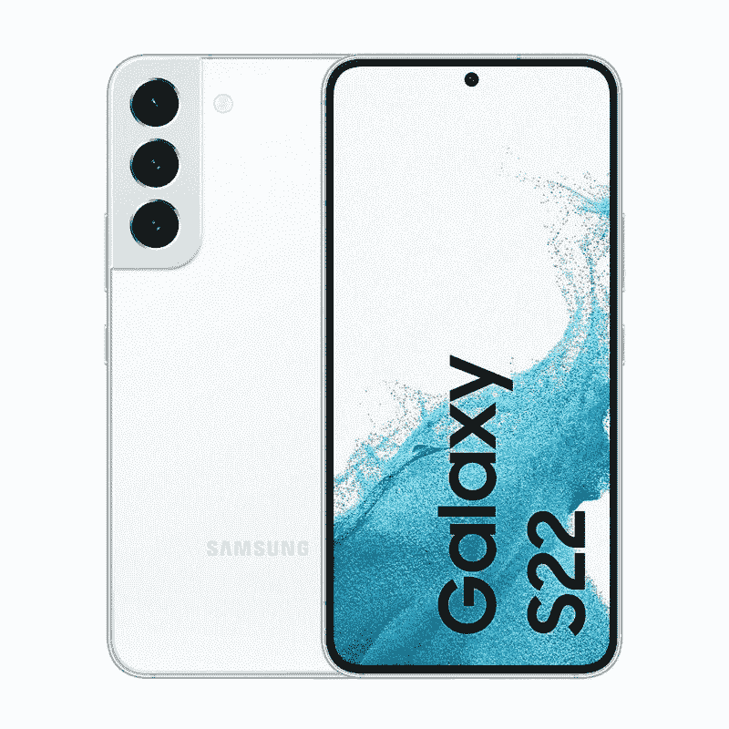

# 三星 Vision Booster 功能如何在 Galaxy S22 上工作？

> 原文：<https://www.xda-developers.com/samsung-galaxy-s22-display-vision-booster/>

三星手机都有出色的显示屏，新的 Galaxy S22 系列设备也不例外。理论上， [Galaxy S22](https://www.xda-developers.com/samsung-galaxy-s22-review/) 、 [Galaxy S22 Plus](https://www.xda-developers.com/samsung-galaxy-s22-plus-review/) 、 [Galaxy S22 Ultra](https://www.xda-developers.com/samsung-galaxy-s22-ultra-review/) 似乎都有很棒的显示。从高分辨率面板到自适应刷新率支持，这些智能手机显示器一应俱全。但这一次有一个特别突出的功能——视觉增强器。那么 Galaxy S22 上新的三星 Vision Booster 显示屏功能到底是什么，它的工作原理是什么？让我们来看看:

在我们讨论视觉增强功能之前，先快速浏览一下显示器规格:

| 

三星 Galaxy S22

 | 

三星 Galaxy S22 Plus

 | 

三星 Galaxy S22 Ultra

 |
| --- | --- | --- |
| 

*   6.1 英寸 FHD+动态 AMOLED 2X 平板显示器
*   2340 x 1080 像素
*   120 赫兹可变刷新率:48-120 赫兹
*   20:9 宽高比
*   HDR10+
*   1300 尼特峰值亮度
*   始终显示
*   无限显示

 | 

*   6.6 英寸 FHD+动态 AMOLED 2X 平板显示器
*   2340 x 1080 像素
*   120 赫兹可变刷新率:48-120 赫兹
*   20:9 宽高比
*   HDR10+
*   1，750 尼特峰值亮度
*   始终显示
*   无限显示

 | 

*   6.8 英寸 WQHD+动态 AMOLED 2X 曲面显示屏
*   1440 x 3088
*   120 赫兹可变刷新率:1-120 赫兹
*   20:9 宽高比
*   HDR10+
*   1，750 尼特峰值亮度
*   始终显示
*   无限显示

 |

## Galaxy S22 系列的三星视觉增强功能

你可能已经知道，视觉增强器是三星为其新显示器做广告的突出功能。这一特殊功能可动态调整色调，以改善阳光直射下的屏幕视觉效果。三星明白，仅仅提高白光的峰值亮度不足以提高明亮条件下的可见度。Vision Booster 还可以处理中间色调和阴影，以适当的比例提升它们，确保图像或视频清晰可见。

三星的视觉增强功能负责在阳光下进行色调映射，以提供最佳的观看体验，而不仅仅是增加峰值亮度。虽然 Vision Booster 只能在阳光直射下发挥作用，但 Galaxy S22 手机在显示屏的其他方面也采用了相同的原理。屏幕对比度也根据亮度和周围环境进行适当调整，以确保一切都清晰可见。

这项功能的另一个有趣之处是，即使启用了视觉增强器，颜色准确度总体上仍然相当不错。考虑到该功能如何提高色彩亮度以及系统伽玛变得动态，这一点尤其令人印象深刻。以下是在启用和未启用视觉增强器的情况下，在手机上查看场景的差异:

 <picture></picture> 

Vision Booster sets pixel brightness into overdrive. Left: Vision Booster disabled; Right: Vision Booster enabled

尽管视觉增强功能令人印象深刻，但它也有缺点。由于 Vision Booster 使用低分辨率直方图来计算要增强的显示区域，因此它引入了大量色调分离。这会导致从一个音调到另一个音调的突然变化，这可能会使一些场景看起来很奇怪。当眼部舒适防护功能启用或设置为“自适应”时，视觉增强功能也不起作用。

此外，视觉增强器只能在 50，000 勒克斯以上启用的事实有点令人失望，因为它需要显示器在阳光直射下。当显示器在 2000 勒克斯左右时，如果能够启用该功能就好了。可悲的是，事实并非如此，一旦手机检测到显示屏低于 20，000 勒克斯，它就会关闭。我们已经在详细的 [Galaxy S22 Plus 显示器评论](https://www.xda-developers.com/samsung-galaxy-s22-plus-display-review/)中强调了这一点和其他几个问题，所以请务必查看。我们的显示器评论详细介绍了 Vision Booster 和显示器的其他各个方面，因此我们强烈建议阅读它，以了解今年 Galaxy S22 系列手机上的显示器的更多信息。

 <picture></picture> 

Samsung Galaxy S22

三星 Galaxy S22 是三款手机中最小的一款，配有 6.1 英寸 FHD+动态 AMOLED 2X 平板显示器。这款手机的峰值亮度为 1300 尼特。

 <picture></picture> 

Samsung Galaxy S22 Plus

##### 三星 Galaxy S22 Plus

三星 Galaxy S22 Plus 是 Galaxy S22 系列中的老二。它的显示屏稍大一些，也更好一些，峰值亮度为 1750 尼特。

 <picture></picture> 

Samsung Galaxy S22 Ultra

三星 Galaxy S22 Ultra 是三款设备中最强大的设备。这款手机有一个更大的 6.8 英寸 WQHD+动态 AMOLED 2X 曲面显示屏。

* * *

三星在显示技术方面一直处于领先地位，因此看到其旗舰手机获得具有新的先进功能的高级面板也就不足为奇了。尽管如此，显示屏并不是这些新 Galaxy S22 系列手机的唯一卖点。我们还建议您阅读我们的文章，详细介绍 Galaxy S22 系列的所有[独特的相机功能，以了解是什么让这些设备也成为神枪手。或者，您也可以查看](https://www.xda-developers.com/samsung-galaxy-s22-series-camera-features/)[Galaxy S22 Ultra S Pen 的所有功能](https://www.xda-developers.com/samsung-galaxy-s22-ultra-s-pen-features/)，了解它带来的一切。最后，您还可以访问我们的[三星 Galaxy S22 交易](https://www.xda-developers.com/best-samsung-galaxy-s22-deals/)页面，查看所有发布优惠和更多优惠，为您的购买节省一些钱。