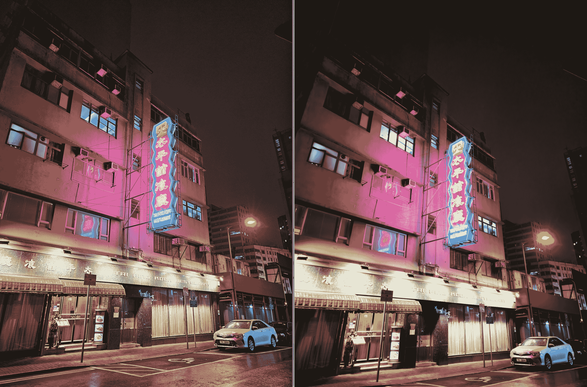
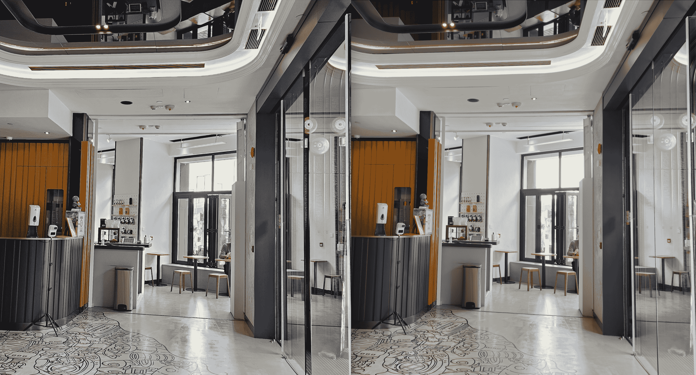
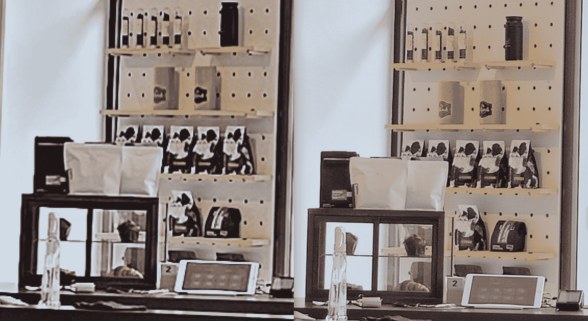

# 三星 Galaxy S23 Ultra camera deep dive:200 MP 传感器和所有拍摄模式说明

> 原文：<https://www.xda-developers.com/samsung-galaxy-s23-ultra-camera-deep-dive/>

自从该系列在 2020 年首次亮相以来，三星的“Ultra”手机一直是最前沿的，除了厨房水槽以外的一切移动设备，提供了最好的(或几乎最好的)一切，从显示技术到硅到内存标准。但真正让 Samsung Ultra 从世界上其他最好的手机中脱颖而出的是相机系统，尤其是在北美。

[Galaxy S23 Ultra](https://www.xda-developers.com/samsung-galaxy-s23-ultra-review/) 延续了这一趋势，在一个高度通用的系统中添加了一个 200MP 主摄像头，该系统已经包括一个扫描超宽拍摄镜头和两个变焦镜头。伴随着所有这些额外的像素而来的是新的拍摄模式，这增加了相机功能的详尽列表。如果你对这款相机的功能感到不知所措，我们可以帮你搞定。

Galaxy S23 Ultra 是市场上最好的手机之一，装有全新的 200MP 传感器，精致的设计，为 Galaxy 芯片组定制的骁龙 8 Gen 2，以及一个 UI 5.1。

## 摄像机硬件概述

从 Galaxy S21 Ultra 开始，三星的顶级平板手机就拥有了市场上光学焦距最丰富的相机系统，超宽相机拍摄相当于 13 毫米的镜头，10 倍潜望镜变焦镜头拍摄相当于 230 毫米的镜头。后者的镜头实际上可以以数字方式放大 100 倍，但在这个范围内的图像实际上是不可用的，但你可以放大 30 倍，图像仍然清晰，因此本质上，S23 Ultra 系统可以拍摄 13 毫米宽的图像，以及近 700 毫米长的图像。

在硬件升级方面，只有主传感器比去年的 S22 Ultra 有所提升，之前的 108MP 摄像头升级到了新的 200MP 摄像头，使用了三星新的 ISOCELL HP2 传感器。该传感器在 1/1.3 英寸的光学传感器尺寸中包含 2 亿个 0.6 微米(微米)像素。和所有最近的智能手机一样，该传感器主要用于拍摄 1250 万像素(使用 16 合 1 宁滨)或 5000 万像素(使用 4 合 1 宁滨)的像素像素照片。有一个拍摄全 200MP 模式的选项，但这样你就失去了像素宁滨的好处。我们将在相机软件部分讨论这一点。

其他镜头保持不变，所以我们有一个 12MP，f/2.2 超宽，带 1/2.55 英寸传感器；可产生 3 倍光学变焦的 10MP f/2.4 人像镜头；以及 10MP f/4.9 潜望镜变焦镜头，可拍摄 10 倍光学变焦。自拍相机实际上得到了降级(至少在像素数量方面)，从 S22 Ultra 的 40MP 前置摄像头降至 12MP、f/2.2 前置摄像头。

## 相机软件概述:不同的模式及其作用

在我们转回来关注新镜头之前，让我们快速概述一下所有不同的拍摄模式。三星的相机应用程序与过去几年相比基本没有变化，也没有偏离其他主要制造商的相机应用程序太远(实际上，除了 Pixel 之外，每个手机品牌的相机应用程序都基本相似)。你有一个黑色的背景，白色的快门按钮和中间的图像取景器。主要拍摄模式通过水平滑动进行循环，取景器上方有按钮进行设置。三星不会试图用太多的主要模式来扰乱应用程序，默认情况下只提供“肖像”、“照片”、“视频”和“更多”，顺序如下。

“更多”标签打开了一个附加拍摄模式的长列表，这是事情变得势不可挡和不必要的复杂的地方。虽然主要的拍摄模式是不言自明的，使用它们就像指向和拍摄一样简单，但“更多”中的额外模式可能很复杂，甚至可能需要额外的下载。比如有 Expert RAW，你需要从三星的 app store 下载。几个月前，我写了一篇关于 Expert RAW 的教程，所有的特性仍然适用于这里，所以请查看那篇文章以获得更深入的分析。

总结的版本是 Expert RAW 允许您以 RAW 图像格式拍摄，这种格式是未压缩的，包含相机传感器允许的尽可能多的数据。直接从手机(或真正的相机)上拍摄的原始图像通常看起来不太具有视觉吸引力，高光溢出，可能还有奇怪的颜色。这是因为 RAW 摄影的目的是为摄影师提供所有图像信息，以便在软件中进行后期编辑。在这里，Expert RAW 允许您直接在 Adobe Lightroom Android 应用程序中打开图像。专家 RAW 确实为 S23 Ultra 提供了几个新技巧，在我运行完所有拍摄模式后，我会再回到这些技巧。

三星 Galaxy S23 Ultra 上的相机设置，可快速访问专家 RAW

然后是 Pro，本质上是 Expert RAW 的一个不太高级的版本。你可以调整 ISO、快门速度和焦点，同时在拍照前调整色温(见下面的截图)。你也可以在 Expert RAW 中完成所有这些，但是专业模式并不强迫你在 RAW 文件中拍摄——你仍然可以在传统的 JPEG 中拍摄。

然后是专业视频，你可以猜到，这是专业模式，但视频。你可以实时调整焦距和快门速度，并实现像机架对焦这样的电影特技。接下来是夜间模式，这是毫无意义的，因为默认情况下，当你的环境变得足够暗时，标准照片模式已经自动打开夜间模式。这里的唯一好处是能够拍摄更长的曝光时间，这在专业或专业 RAW 模式下仍然可以做到。

然后是美食和全景。前者是另一种没什么用的模式(它提高了你拍摄食物的对比度)。但是全景很好玩，可以让你拍摄大范围的图像。

然后是超级慢动作和慢动作，它们做同样的事情，只是帧速率不同。Hypelapse 是三星对延时摄影的术语，它的工作是捕捉迷人的延时视频。人像视频是在对象周围带有人工散景的视频模式。现在几乎每部手机都提供这种功能，它可以在主视频模式下快速切换，但三星决定让它成为一种独立的模式。虽然肖像视频模式工作得很好，产生了一些令人信服的假散景，以及其他有趣的事情，如隔离某些主题的颜色或提供毛刺效果。

导演视角是另一种有趣的模式，允许你同时使用一个后置摄像头和一个自拍摄像头拍摄视频剪辑。你可以调整窗口的大小，使自拍部分变小或变大，还可以实时预览三个后置摄像头(宽、3 倍、10 倍)。不知道为什么 ultrawide 被排除在外。

最后，还有单次拍摄。这应该可以让你只按一次快门，就可以让相机转动几秒钟。然后，三星的软件会产生一系列照片和视频供你选择。通常，捕捉到的画面并不好。不仅仅是我。我不知道有哪个评论家对这种模式说过好话。

## 那个 200MP 的传感器能做什么？

如前所述，这种新的 200MP 传感器的要点是允许 Galaxy S23 Ultra 拍摄像素分箱的照片。宁滨是一种软件技巧，它允许智能手机通过将多个像素的数据合并为一个数据，形成一个“超级像素”，从而克服其相对较小的传感器尺寸。默认情况下，S23 Ultra 的 200 万像素摄像头可以拍摄 1200 万像素的照片，通常大小在 3MB 到 5MB 之间。以 50MP 拍摄会将文件大小提升到 11MB 或 12MB 左右，而提升到 200MP 会导致文件大小在 25MB 到 30MB 之间。

12MP 拍摄通常是理想的——这是默认模式的一个原因——因为它有最快的快门速度，图像处理几乎是即时的，你可以充分利用三星的计算欺骗。如果你在弱光或逆光等具有挑战性的照明条件下拍摄，12MP 的拍摄将获得最佳的动态范围和曝光。

 <picture></picture> 

"Normal" 12MP shot (left); 200MP shot (right)

在上面和下面的图片中，我将一张标准的 12MP 照片放在了一张 200MP 照片的旁边。你应该能够看到 200 兆像素的图像吹出的亮点，如霓虹灯标志和窗户。

 <picture></picture> 

"Normal" 12MP shot (left); 200MP shot (right)

然而，以 200MP 拍摄的好处是图像的默认尺寸要大得多，因此允许你放大(或裁剪)照片而不会丢失太多细节。在下面的图片中，我以大致相同的比例截取了两张照片。你可以看到 200MP 的图像更清晰、更细致。

 <picture></picture> 

12MP shot, cropped in (left); 200MP shot, cropped in (right). 

但在 200MP 模式下拍摄需要等待几秒钟，以便图像完成抓拍，并且由于文件较大，第一次打开图像文件也需要几秒钟。当你在拍摄一个有很多物体的场景，并且想要有一个选择来在以后检查的时候，这可能是一个有用的技巧。

至于 50MP 模式，那是两者的快乐中庸。你仍然可以获得像素宁滨的一些好处(200 兆像素的照片没有)，图像仍然比 120 兆像素的照片大，所以你仍然可以更好地裁剪。但在图像完成捕捉之前仍有一点等待，所以最终，12MP 模式是您在 90%以上的时间里想要使用的模式。

## 新的夜间摄影模式

专家原始模式带来了一些新的夜间摄影模式，包括天体摄影和“恒星轨迹”记录功能。在天体摄影中，你必须将手机放在三脚架上，因为它需要至少四分钟来捕捉图像。三星甚至在模式中内置了一个星空向导，将星图投射到天空中，这样你就知道你在拍摄什么。

恒星轨迹记录是一种延时模式，可以捕捉到慢动作运动的恒星。我在噪音污染严重的城市(香港和伦敦)旅行过，所以我自己没有尝试过，但是 XDA 的手机编辑 Chris Wedel 试过，而且很喜欢。

其他拍摄模式，如使用前置自拍相机或人像模式，与过去几年的三星设备保持不变，所以我认为我们可以跳过这些。总的来说，Galaxy S23 Ultra 拥有最强大的相机系统之一，软件虽然有时过于复杂，但可以让你做很多事情——比 iPhone 或 Pixel 做得更多。

如果你想买一部新手机，并且相机体验对你很重要，Galaxy S23 Ultra 绝对是最佳选择之一。我还没有准备好称之为最好的，因为我认为 [Vivo X90 Pro+](https://www.xda-developers.com/vivo-x90-pro-plus-review/) 中的 1 英寸索尼 IMX989 传感器捕捉到了更强的静态照片，但我将在未来几周内做更多的测试，并编写这两个野兽之间的相机比较。但考虑到 X90 Pro+不在中国以外销售，Galaxy S23 Ultra 将是大多数人的选择。

Galaxy S23 Ultra 是市场上最好的手机之一，装有全新的 200MP 传感器，精致的设计，为 Galaxy 芯片组定制的骁龙 8 Gen 2，以及一个 UI 5.1。