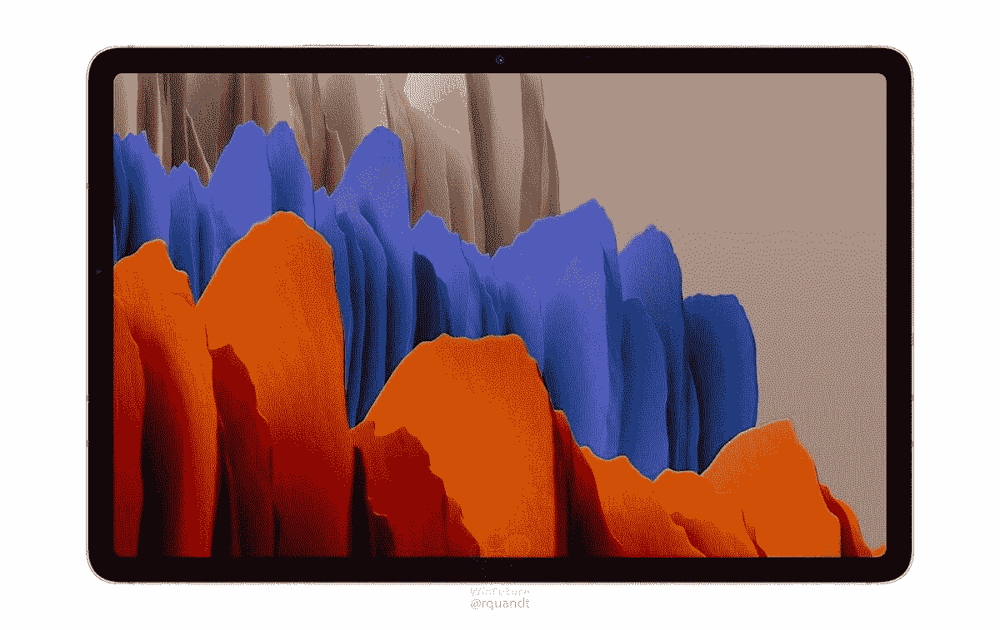

# 三星 Galaxy Tab S8 vs 三星 Galaxy Tab S7

> 原文：<https://www.xda-developers.com/samsung-galaxy-tab-s8-vs-samsung-galaxy-tab-s7/>

众所周知，2022 年的平板电脑领域将主要由苹果的 iPad 选项主导。除非你专门搜索“安卓平板”，否则你很可能会出现在推荐你购买某种 iPad 的名单上。但这并不是说你找不到好的安卓平板电脑。[三星的 Galaxy Tab S8 系列产品](https://www.xda-developers.com/samsung-galaxy-tab-s8-series-launch/)目前正在这个领域掀起轩然大波。事实上，普通的 Galaxy Tab S8 是我们向大多数人推荐的，尽管 [Galaxy Tab S8 Ultra 是最令人印象深刻的](https://www.xda-developers.com/samsung-galaxy-tab-s8-ultra-review/)。

然而，Galaxy Tab S8 贴上了 699 美元的价格标签，这让我们不禁想知道，与已经非常优秀的 [Galaxy Tab S7](https://www.xda-developers.com/samsung-galaxy-tab-s7-review/) 相比，它到底有多好，后者可以为你节省几个钱。嗯，这正是我们在这里要了解的，所以让我们来看看三星 Galaxy Tab S8 和 Galaxy Tab S7 的对比，看看哪个更好买。

## 三星 Galaxy Tab S8 与三星 Galaxy Tab S7:规格

在开始比较之前，我们先来看看规格表，看看这些平板电脑在理论上有多强大:

| 

**规格**

 | 

**三星 Galaxy Tab S8**

 | 

**三星 Galaxy Tab S7**

 |
| --- | --- | --- |
| **构建** |  |  |
| **尺寸&重量** | 

*   253.8 x 165.3 x 6.3mm 毫米
*   503 克(Wi-Fi)/507 克(5G)

 | 

*   253.8 x 165.3 x 6.3mm 毫米
*   498 克(Wi-Fi)/500 克(LTE)

 |
| **显示** | 

*   11 英寸 LTPS TFT 液晶屏
*   WQXGA (2560 x 1600)
*   120 赫兹刷新率

 | 

*   11 英寸 LTPS TFT 液晶屏
*   WQXGA (2560 x 1600)
*   120 赫兹刷新率

 |
| **SoC** | 

*   高通骁龙 8 代 1

 | 

*   高通骁龙 865 Plus

 |
| **风筒&储存** | 

*   8/12GB 内存
*   128/256GB 存储空间
*   支持 microSD 卡(最高 1TB)

 | 

*   6/8 千兆字节内存
*   128/256/512GB 存储空间
*   用于扩展的 microSD 卡插槽(最高 1TB)

 |
| **电池&充电** | 

*   8000 毫安时
*   45W 有线快充支持
*   盒子里没有充电器

 | 

*   8000 毫安时
*   45W 有线快充支持
*   盒子里有一个 15W 充电器

 |
| **安全** | 侧装式指纹扫描仪 | 侧装式指纹扫描仪 |
| **后置摄像头** | 

*   1300 万像素 f/2.0 主摄像头
*   600 万像素 f/2.2 超宽摄像头

 | 

*   1300 万像素 f/2.0 主摄像头
*   500 万像素，f/2.2 超宽摄像头

 |
| **前置摄像头** | 200 万像素，f/2.4，120 度(超宽) | 800 万像素，f/2.0，宽 |
| **端口** | USB 3.2 类型 C | USB 3.2 类型 C |
| **音频** | 

*   由 AKG 调音的四扬声器系统
*   杜比全景声认证

 | 

*   AKG 调音的四声道扬声器
*   杜比全景声认证

 |
| **连通性** | 

*   Wi-Fi 6E
*   蓝牙 5.2
*   5G(某些地区可选)

 | 

*   蓝牙 v5.0
*   802.11 a/b/g/n/ac/ax 双频 Wi-Fi
*   GPS，Glonass，北斗，伽利略

 |
| **软件** | 

*   一个基于 Android 12 的 UI 4.1
*   承诺四次 Android 操作系统升级

 | 

*   一个基于 Android 12 的 UI 4.1(当前)
*   承诺三次 Android 操作系统升级

 |
| **其他特征** | 盒子里有一支钢笔 | 盒子里有一支钢笔 |

三星 Galaxy Tab S7 已经是其前身的一个很好的升级，所以我们也对 Galaxy Tab S8 抱有期望。该公司花了大量时间研究 Galaxy Tab S8，以进一步完善它，规格表中显示了这一点。让我们更深入地了解每一个部分，看看新平板电脑相比上一款有多大的改进。

## 设计和展示

Galaxy Tab S7 和 Galaxy Tab S8 从外观上几乎无法区分。正如您在规格表中看到的，它们的尺寸相同，这意味着它们同样薄，整体尺寸也相同。Galaxy Tab S8 重了几克，但在使用时你不会真正注意到这种差异。两款平板电脑的背面都有一个磁棒，可以连接附带的 S Pen。虽然三星试图在 Galaxy Tab S7 上匹配这个条，但不管你选择什么颜色，它在 Tab S8 上都只是一个黑色的条。

说到颜色，这可能是这些平板电脑的主要区别因素之一。Galaxy Tab S7 提供神秘黑色、神秘青铜色、神秘银色和幻影海军色。同时，新款 Galaxy Tab S8 有三种颜色——石墨色、银色和玫瑰金。

再看前面，这两款平板电脑都配备了 11 英寸的 LTPS TFT LCD 面板，支持最大 2560 x 1600 像素的屏幕分辨率和 120Hz 的刷新率。这些不是 AMOLED 面板，但它们非常适合您的日常使用，无论是媒体消费、游戏还是其他。正如我们在 [Galaxy Tab S7 评测](https://www.xda-developers.com/samsung-galaxy-tab-s7-review/)中提到的，这款显示器提供 HDR10+支持，在平板电脑上观看 HDR 内容绝对是一种享受。考虑到 Galaxy Tab S8 使用相同的显示屏，你可以期待它会有类似的体验。

当我们讨论媒体消费时，值得指出的是，这两款平板电脑都配备了由 AKG 调谐的四扬声器设置。实际上，两边都有两个扬声器，可以提供出色的立体声分离效果。总体而言，可以肯定地说，在媒体消费方面，两款平板电脑都同样出色。

## 硬件和性能

正如规格表中所指出的，Galaxy Tab S7 和 Galaxy Tab S8 内部都装有不同的硬件。较新的 Galaxy Tab S8 由高通新的骁龙 8 代 1 芯片组驱动，而 Galaxy Tab S7 由骁龙 865 Plus 驱动。尽管是一款相对较老的芯片，但我们认为，即使在 2022 年，Tab S7 中的骁龙 865 Plus 芯片也应该能够满足您的所有需求。

Galaxy Tab S8 的基本型号配备了 8GB 的内存，而 Tab S7 的基本单元只能提供 6GB 的内存。Galaxy Tab S7 的内存也高达 8GB，而 Tab S8 的内存最高可达 12GB。你可以选择购买具有更多内部存储空间的 Tab S7，但你也可以为这两款平板电脑添加 microSD 卡，所以这不一定是什么大问题。

就电池寿命而言，Galaxy Tab S7 和 Galaxy Tab S8 内部都装有 8,000 mAh 的电池，我们认为在轻度至中度使用的情况下，这足以让灯保持亮至少两天。您的里程数可能会因您的日常工作量而异，但我们怀疑您是否会一直四处寻找充电器来为这些平板电脑充电。两款平板电脑都支持 45W 有线充电，但你必须花更多的钱来实际购买一个支持 45W 充电速度的充电砖。Galaxy Tab S7 只配有一个 15W 的充电器，但在我们的书中，它仍然比 Galaxy Tab S8 更好，因为 Galaxy Tab S8 的包装盒内没有任何充电器。

## 摄像机

相机部门的两款平板电脑也没有太大区别。Galaxy Tab S8 和 Galaxy Tab S7 都采用了 1300 万像素的主传感器，光圈为 f/2.0。两款平板电脑上都有一个额外的超宽摄像头，但三星为 Tab S8 使用了略有不同的 6MP 传感器，而不是 Tab S7 上的 5MP 传感器。摄像头——尤其是后置摄像头——通常不会成为平板电脑的焦点，但我们认为在这次比较中，这两款设备都提供了一套不错的光学系统来完成工作。

我们认为前置摄像头在如今的平板电脑上更重要，因为它们可以用于视频通话。三星在 Galaxy Tab S8 上改进了自拍摄像头，增加了 12MP 超宽传感器。相比之下，Galaxy Tab S7 只配备了一个 800 万像素宽的摄像头，充其量也就不错。

## 三星 Galaxy Tab S8 vs Galaxy Tab S7:该买哪个？

好了，现在我们知道了这些平板电脑的材质，是时候找出哪一款最适合你了。三星 Galaxy Tab S8 目前带 Wi-Fi 的基本款售价为 699 美元。与此同时，Galaxy Tab S7 的起价为 649 美元。如果你不介意花额外的钱，那么我们认为 Galaxy Tab S8 比去年的型号更值得考虑。新平板电脑不仅配备了更好的芯片组来提高整体性能，而且您还可以获得长达至少四年的软件支持。值得注意的是，它也适合那些倾向于参加大量视频通话的人，因为它配备了更好的前置摄像头。

这并不是说 Galaxy Tab S7 是一个糟糕的选择。如果你已经有了 Tab S7，那么升级到 Galaxy Tab S8 肯定不值得。事实上，考虑购买 Galaxy Tab S7 而不是 Tab S8 可能并不完全是个坏主意。如果你的平板电脑不一定需要最新的处理器或最好的摄像头，它仍然是一个很好的选择。它目前运行一个基于 Android 12 的 UI 4.1，在它看到生产线的尽头之前，可能至少会有几个更新。考虑到 Galaxy Tab S7 现在是一款相对较老的设备，你也可能会发现它很划算，可以节省一些钱。

 <picture></picture> 

Samsung Galaxy Tab S8

##### 三星 Galaxy Tab S8

三星 Galaxy Tab S8 对去年的机型进行了一系列升级。这次你会得到更新的内部设备和更好的自拍相机。

 <picture></picture> 

Samsung Galaxy Tab S7

##### 三星 Galaxy Tab S7

如果你不介意安装稍微旧一点的芯片组，去年的 Galaxy Tab S7 仍然是一个可靠的选择。

那么你打算买哪一款三星 Galaxy 平板电脑呢？请在下面的评论中留言告诉我们。如果你打算购买新的 Galaxy Tab S8，那么一定要访问我们的[最佳 Galaxy Tab S8 交易页面](https://www.xda-developers.com/best-samsung-galaxy-tab-s8-deals/)，看看你是否能找到一些不错的交易。你可以用多余的钱给自己买一个[最好的案例](https://www.xda-developers.com/best-samsung-galaxy-tab-s8-cases/)，为它增加一些保障。