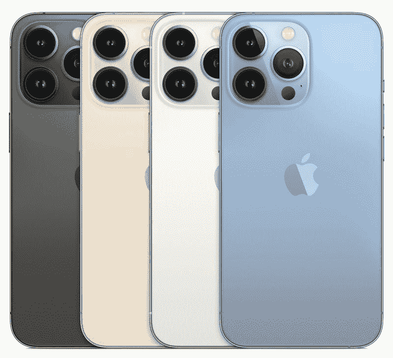

# 三星 Galaxy Z Flip 4 vs 苹果 iPhone 13 Pro:买哪个手机？

> 原文：<https://www.xda-developers.com/samsung-galaxy-z-flip-4-vs-apple-iphone-13-pro/>

三星在 2022 年 8 月的 Unpacked 活动中展示了 [Galaxy Z Flip 4](https://www.xda-developers.com/samsung-galaxy-z-flip-4-hands-on/) 。这款设备配备了大量创新产品，包括可折叠显示屏。花 999 美元，你可以选择[购买 Galaxy Z Flip 4](https://www.xda-developers.com/best-samsung-galaxy-z-flip-4-deals/) 或者[购买 iPhone 13 Pro](https://www.xda-developers.com/best-iphone-13-pro-max-deals/) 。无论您做出何种选择，请确保您使用外壳保护您的三星或苹果[手机。毕竟安全总比后悔好。这是三星 Galaxy Z Flip 4 vs](https://www.xda-developers.com/best-iphone-13-pro-cases/) [苹果 iPhone 13 Pro](https://www.xda-developers.com/apple-iphone-13-pro-review/)——两款售价 999 美元的截然不同的智能手机之间的战争。

## Galaxy Z Flip 4 vs iPhone 13 Pro:规格

|  | 

三星 Galaxy Z Flip 4

 | 

苹果 iPhone 13 Pro

 |
| --- | --- | --- |
| **处理器** | 

*   高通 SM8475 骁龙 8 加第 1 代

 |  |
| **正文** | 

*   展开后:165.2 x 71.9 x 6.9 毫米
*   折叠后:84.9 x 71.9 x 15.9-17.1 毫米
*   187 克

 | 

*   146.7 x 71.5 x 7.65 毫米
*   204 克

 |
| **显示** | 

*   主要的
    *   6.7 英寸可折叠动态 AMOLED 2X 显示屏
    *   2640 x 1080 像素分辨率，426 ppi
    *   支持 HDR10+、120Hz 和 1200 尼特最大亮度。

*   封面:
    *   1.9 英寸 Super AMOLED 显示屏
    *   512 x260 像素分辨率

 | 

*   6.1 英寸 Super Retina XDR 显示屏
*   2532 x 1170 像素分辨率，460 ppi
*   支持 HDR、推广技术(120Hz)、True Tone 技术和 1200 尼特最大亮度。

 |
| **摄像机** | 

*   12MP 后置摄像头系统:
    *   宽:1.8 米
    *   超宽:2.2 英寸

*   10MP 前置摄像头:2.4

 | 

*   Pro 12MP 后置摄像头系统:
    *   长焦:1/2.8
    *   宽:1.5 英寸
    *   超宽:1.8 英寸

*   TrueDepth 12MP 前置摄像头:2.2

 |
| **记忆** | 

*   128GB/256GB/512GB 固态硬盘
*   8GB 内存

 | 

*   128GB/256GB/512GB/1TB 固态硬盘
*   6GB 内存

 |
| **电池** |  | 

*   长达 75 小时的音频播放

 |
| **连通性** |  |  |
| **阻力** |  |  |
| **安全** |  |  |
| **操作系统** | 

*   一个 UI 4.1.1(基于 Android 12)

 |  |
| **颜色** | 

*   博拉紫
*   石墨
*   金银铜镍装饰合金
*   蓝色

 | 

*   塞拉蓝
*   石墨
*   金色的
*   银
*   阿尔卑斯绿

 |
| **材质** | 

*   超薄玻璃
*   装甲铝

 | 

*   玻璃背面
*   不锈钢框架

 |
| **价格** |  |  |

* * *

## 设计:Galaxy Z Flip 4 非常棒

在购买新设备之前，设计是需要考虑的一个重要方面。毕竟，我们每天盯着手机看几个小时，我们不想看一个丑陋的产品。幸运的是，这两款手机看起来都很现代，造型简约。然而，这两者之间有一些明显的区别。

iPhone 13 Pro 采用了我们在前代机型上看到的熟悉设计。它有一个磨砂玻璃背面和一个光滑的不锈钢框架。在背面，我们发现了一个明显的凸起——它装有专业相机系统。另一方面，Galaxy Z Flip 4 由超薄玻璃和装甲铝制成。它有一个更精简的相机系统，中间有一个铰链。

说到颜色，iPhone 13 Pro 提供了五种颜色，而 Galaxy Z Flip 4 只有四种。不过，值得注意的是，你可以订购定制版的三星手机——允许你定制手机不同部分的颜色。最终的产品是独一无二的，反映了你的品味。显然，Galaxy Z Flip 4 在这一轮中以更具创新性的设计战胜了 iPhone 13 Pro。

## 显示:*弯曲门*是 Galaxy Z Flip 4 上的一个功能

在选择手机升级时，显示屏也是需要关注的重点之一。毕竟，观看和触摸屏幕是我们使用这些设备的主要方式。所以糟糕的显示会导致不愉快的用户体验。不出所料，这两款高端智能手机都有很好的显示屏。然而，其中一个更进一步。

尽管 iPhone 13 Pro 的显示屏稍微清晰一些，但 Galaxy Z Flip 4 因其创新的执行方式赢得了这一轮。三星手机有一个 6.7 英寸的主屏幕，可以对折。这意味着你可以在不牺牲舒适度的情况下使用大屏幕手机。当你想把它放在口袋里时，你只需把它折叠起来，就可以变成紧凑的形状。更不用说折叠它可以保护主屏幕免受直接划伤和损坏。

为了在不打开整个设备的情况下浏览你的通知，你可以在后置摄像头系统旁边找到一个小小的覆盖屏幕。你可以把这个翻盖显示屏想象成一个窥视窗口——当你折叠翻盖时，它可以让你查看对时间敏感的事件。除此之外，两款手机都支持 120Hz 的刷新率，亮度水平也差不多。

## 性能:苹果 A15 仿生是香蕉

当你购买一部新的高端手机时，你也期待一种无延迟的体验。通常，这主要是由其内存、处理器和操作系统决定的。我们已经看了骁龙 8 Plus Gen 1 和苹果 A15 仿生芯片的基准测试。两款芯片组在移动领域的表现都非常出色 A15 在一般的单核和多核性能测试中表现出色。与此同时，高通处理器在游戏部门击败了 A15。不过，苹果芯片的综合得分更高。

尽管如此，分数没有实用性重要。iPhone 13 Pro 和 Galaxy Z Flip 4 应该都能流畅运行。不过，请记住，客观来说，iOS 比 Android 操作系统的问题要少。因此，尽管这两款手机装有两个强大的芯片，但在使用 iPhone 时，你可能会遇到更少的延迟和故障。最终，这两款设备都可以很好地执行日常任务。

## 相机:翻转是一个失败

Galaxy Z Flip 4 在之前的大部分比赛中一直获胜。然而，在相机部门，它有一些缺点。从前置摄像头或自拍摄像头开始，13 Pro 上有一个 12MP 原深感摄像头系统。这使你能够采取你的脸的三维地图，并使用 Face ID 认证。另一方面，Galaxy Z Flip 4 有一个普通的 10MP 摄像头。对于身份验证，您必须依赖侧边按钮中包含的指纹扫描仪。

在背面，两款手机都提供了广角和超广角镜头，苹果的目标是更高的分辨率和更好的光圈。此外，你可以在 iPhone 13 Pro 上获得一个长焦镜头——这在 Galaxy Z Flip 4 上完全没有。因此，如果你纯粹是在寻找一种多功能的相机设置，你可能会考虑 iPhone 而不是三星手机。尽管如此，Galaxy Z Flip 4 的相机输出还是相当不错的。

## 电池:iPhone 13 Pro 很自私

由于 Galaxy Z Flip 4 和 iPhone 13 Pro 一次充电可以持续一整天，电池的比较已经转移到其他方面。首先，三星手机有一个 USB Type-C 端口，这是更普遍采用和使用的端口。与此同时，苹果在其 Pro iPhone 上使用了其专有的 Lightning 端口。这给了 Galaxy 手机几分。

不过，也许这两款手机最显著的区别是反向无线充电。Galaxy Z Flip 4 允许你在它的背面放置一个支持 Qi 的设备来无线充电。虽然你可以通过 Qi 或 MagSafe 为 iPhone 无线充电，但你仍然不能通过 iPhone 为其他设备充电，比如你的 AirPods。这一轮三星使用了高级端口，因为共享电源的能力确实是一个非常方便和简洁的产品。

* * *

## 底线:创新与熟悉

三星 Galaxy Z Flip 4 和苹果 iPhone 13 Pro 的价格都是 999 美元。那么，你应该买哪个呢？如果你被困在苹果的生态系统中，不愿意尝试新的移动体验，那么显然 iPhone 13 Pro 是值得一试的。此外，如果你正在寻找高级相机系统，那么 iPhone 在这一领域可以提供更多。否则，Galaxy Z Flip 4 几乎客观上是在这里购买的更好的设备。它包含了许多创新功能和技术，这些在 iPhones 上仍然找不到。当你买到这款三星手机时，你肯定会物有所值。

 <picture></picture> 

Samsung Galaxy Z Flip 4

Galaxy Z Flip 4 提供了可折叠显示屏。它体积小巧，采用了创新技术，物有所值。

 <picture></picture> 

AT&T

##### 苹果 iPhone 13 Pro

iPhone 13 Pro 是苹果 2021 年 iPhone 阵容的一部分。它由 A15 仿生芯片驱动，支持 iOS 16。

你会买这两款手机中的哪一款，为什么？请在下面的评论区告诉我们。