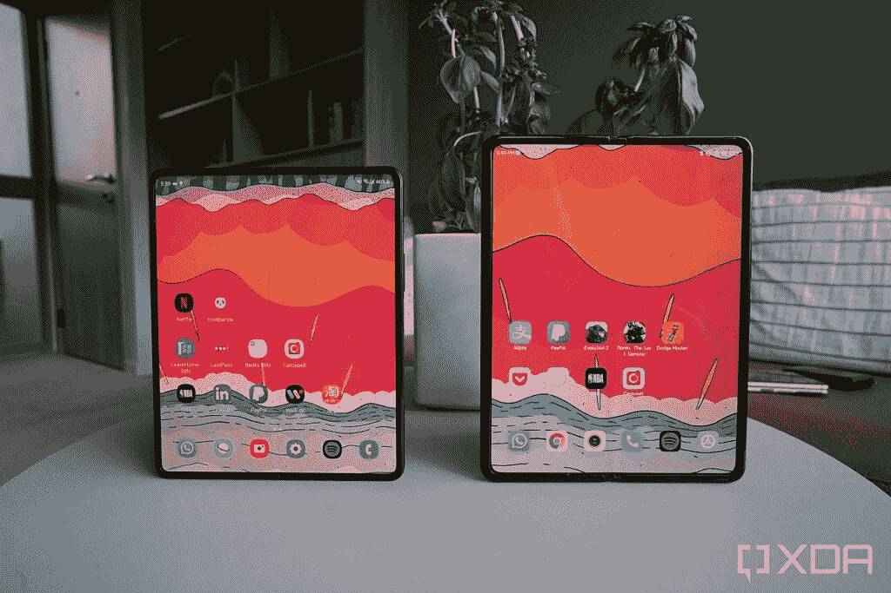
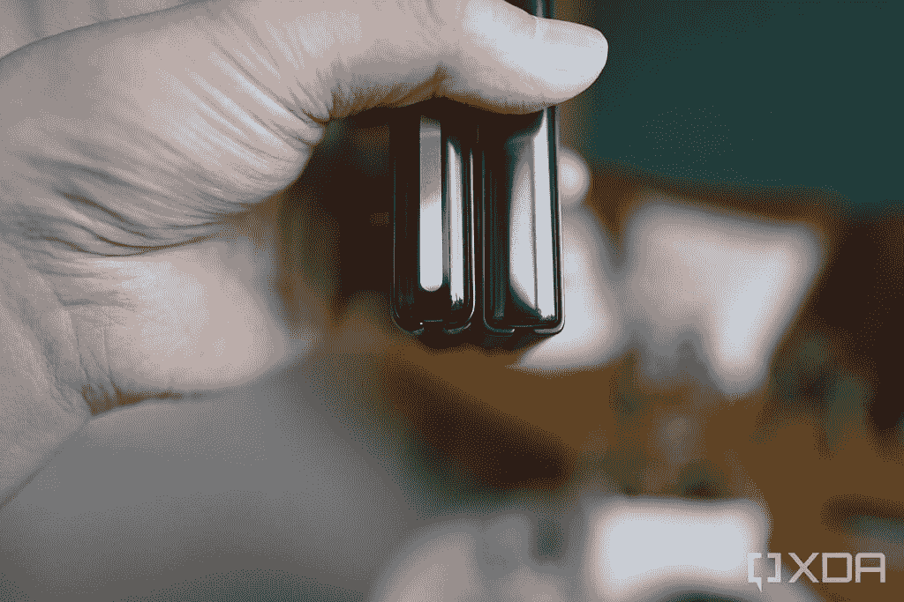
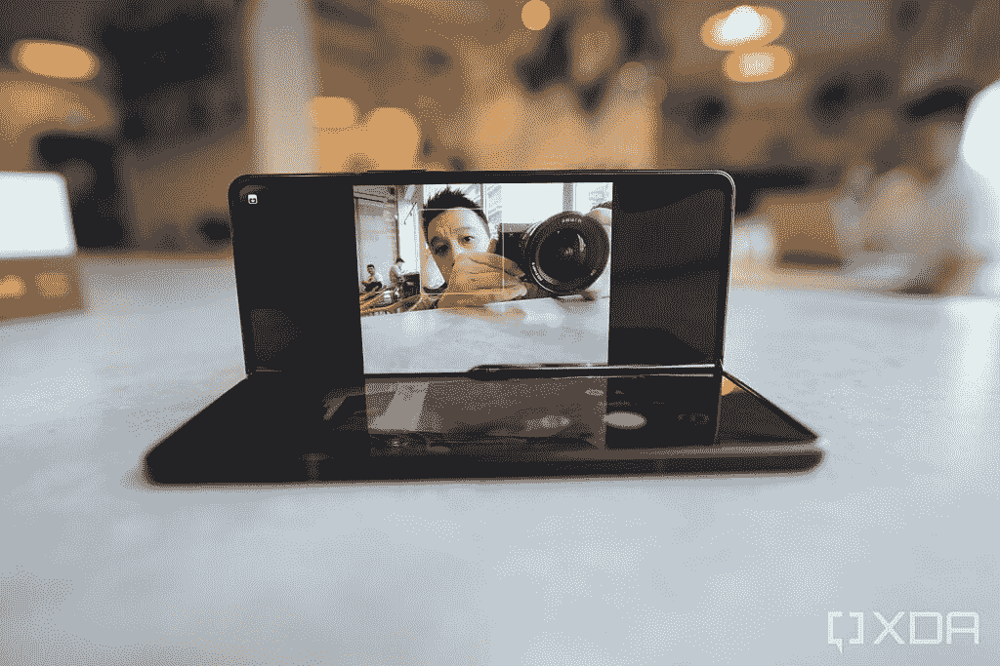
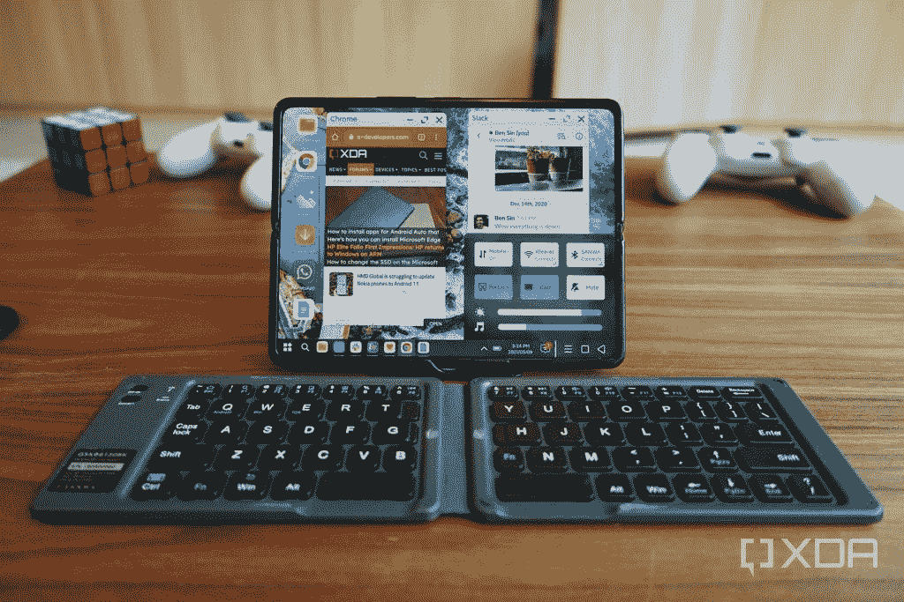
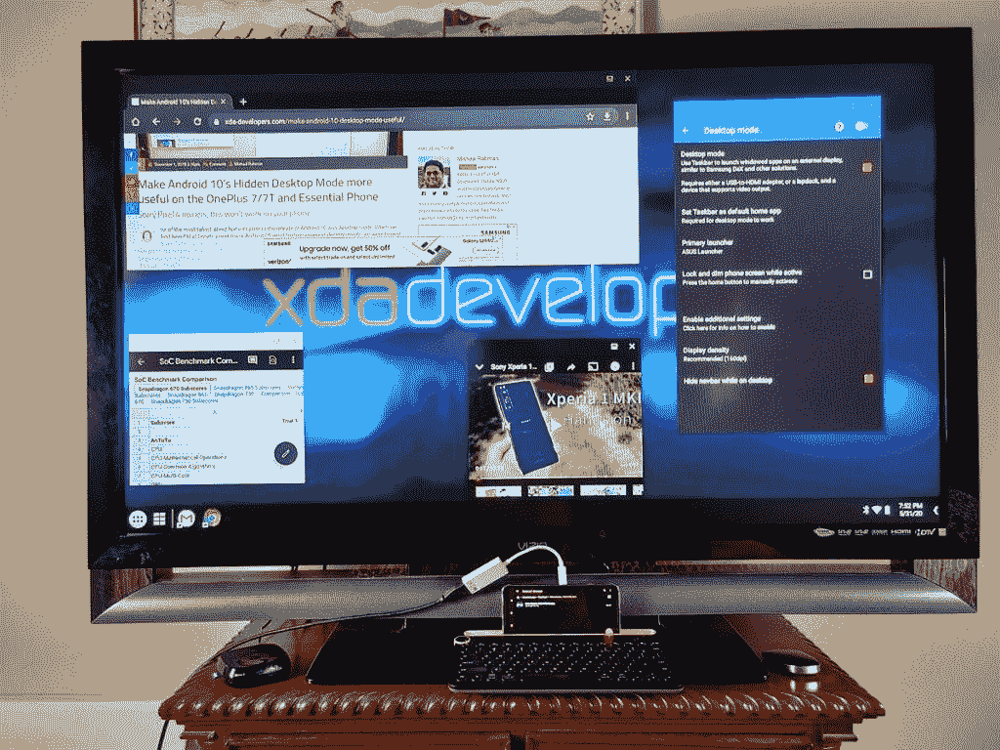

# 三星 Galaxy Z Fold 3 vs 小米 Mix Fold:回顾与比较

> 原文：<https://www.xda-developers.com/samsung-galaxy-z-fold-3-vs-xiaomi-mi-mix-fold/>

人们常说，三星在智能手机领域的最大对手是苹果 iPhone。但在我看来，这是一种懒惰的叙述——现实地说，消费者不会经常在不同的生态系统之间跳跃，iPhone 用户往往在他们有围墙的花园里相当快乐，没有真正离开的意图。

换句话说，三星在智能手机领域最大的挑战者是另一个 Android 品牌。在过去的一两年里，最大的挑战来自小米，其产品通常与三星的产品同时发布，而且价格往往更低。最激烈的战斗可能是在平板旗舰领域，因为[小米 Mi 11 Ultra](https://www.xda-developers.com/xiaomi-mi-11-ultra-review/) 似乎拿走了三星用 [Galaxy S21 Ultra](https://www.xda-developers.com/samsung-galaxy-s21/) 做的一切，并将其调到 11。

但这两个品牌也有相互竞争的可折叠产品。到目前为止，这场战斗只发生在中国，因为小米的可折叠手机没有在中国以外销售。但很有可能最终，这场战斗还会延伸到亚洲和欧洲的其他地区。那么小米的 Mi Mix Fold 和三星的 [Galaxy Z Fold 3](https://www.xda-developers.com/samsung-galaxy-z-fold-3/) 相比如何呢？

 <picture></picture> 

Samsung Galaxy Z Fold 3 (left) and Xiaomi Mix Fold (right)

### 三星 Galaxy Z Fold 3 和小米 Mix Fold:规格

## 三星 Galaxy Z Fold 3 和小米 Mi Mix Fold:规格

|  | 

三星 Galaxy Z Fold 3

 | 

小米 Mi Mix Fold

 |
| --- | --- | --- |
| 

中央处理器

 | 骁龙 888 | 骁龙 888 |
| 

尺寸和重量

 | 

*   折叠后:158.2 x 67.1 x 16.0mm 毫米
*   展开后:158.2 x 128.1 x 6.4mm 毫米
*   重量:271 克

 | 

*   折叠后:173.2 x 69.8 x 17.2 毫米
*   展开后:173.2 x 133.4 x 7.62 毫米
*   重量:317 克

 |
| 

显示

 | 主屏幕:

*   7.6 英寸 QXGA+ Dynamic -AMOLED 2X 显示屏
*   22.5:18 宽高比
*   2208 x 1768
*   120 赫兹

覆盖屏幕:

*   6.2 英寸高清+动态 AMOLED 2X 显示屏
*   24.5:9 宽高比
*   2268 x 832
*   120 赫兹

 | 主屏幕:

*   8 英寸 AMOLED
*   4:3 宽高比
*   2480 x 1860
*   60Hz

覆盖屏幕:

*   6.5 英寸 AMOLED
*   27:9 宽高比
*   2520 x 840
*   90Hz

 |
| 

照相机

 | 

*   12MP 超宽，f/2.2 超宽，FoV 123 度
*   12MP 宽，f/1.8，双像素自动对焦，OIS
*   12MP 远距，2 倍光学变焦，10 倍数码变焦
*   10MP 前置自拍相机
*   400 万像素前置屏下自拍相机

 | 

*   13MP 超宽，f/2.4，FoV 123 度
*   108 兆像素宽，1/1.52 英寸，OIS
*   800 万像素“液体”镜头，3 倍远摄和微距镜头合二为一
*   200 万像素前置自拍相机，定焦

 |
| 

记忆

 | 12GB 内存、256GB/512GB UFS 3.1 存储 | 12/16GB 内存，256GB/512GB UFS 3.1 存储 |
| 

电池

 | 4400 毫安时双电池 | 5020 毫安时 |
| 

网络

 | LTE:增强型 4X4 MIMO，7CA，LAA，LTE Cat。205G:非独立(NSA)，独立(SA)，Sub6 / mmWave |
| 

抗水性

 | IPX8 | 没有人 |
| 

传感器

 | 电容式指纹传感器(侧面)、加速度计、气压计、陀螺仪传感器、地磁传感器、霍尔传感器(模拟)、接近传感器、光传感器、用于手写笔输入的 Wacom 层 | 电容式指纹传感器(侧面)、加速度计、气压计、陀螺仪传感器、地磁传感器、霍尔传感器(模拟)、接近传感器、光线传感器 |
| 

操作系统（Operating System）

 | 安卓 11 |
| 

颜色；色彩；色调

 | 幻影黑，幻影绿，幻影银 | 黑色 |
| 

价格

 | 起价 1799.99 美元 | 起价 9，999 元人民币(约 1，540 美元) |

## Galaxy Z Fold 3 vs 小米 Mi Mix Fold:设计和硬件

我通常会反驳这种观点，即手机之间的任何相似之处都意味着一个品牌“抄袭”了另一个品牌(就像有人坚持认为 OPPO 发现 X3 的摄像头模块是 iPhone 设计的克隆)。但在小米 Mix Fold 的情况下，它显然受到了三星 Z Fold 系列的启发。它们使用相同的折叠理念，相同的名称，甚至在铰链处使用相同的 T 形塑料盖来防止灰尘进入。

但小米做出了一些改变，至少在我看来，这些改变是受欢迎的。当打开时，Mi Mix Fold 的屏幕具有更高的 4:3 纵横比，这有助于它更接近传统平板手机的纵横比。这意味着应用程序往往在 Mi Mix Fold 上显示，比在更方形的 Galaxy Z Fold 屏幕上显示更少的缩放问题。

例如，Instagram 在 Mi Mix 文件夹中显示自己基本上是好的。在 Galaxy Z Fold 3(或之前的任何 Galaxy Fold)上，应用程序通常需要设置边框，以防止应用程序的顶部和底部被切掉太多。

Mi Mix Fold 的铰链角在折叠时也明显变圆，而 Galaxy Z Fold 3 仍然略显尖锐(Galaxy Z Fold 2 上的问题甚至更严重)。在我看来，Mi Mix Fold 握起来更舒适，尽管更重更厚。

 <picture></picture> 

Mi Mix Fold (left) and Galaxy Z Fold 3 (right)

两个可折叠文件夹都运行在相同的骁龙 888 上，具有相同的存储大小和类型。小米的可折叠手机最高可达 16GB 内存，而三星的最高可达 12GB。小米在这一类别中的另一个胜利将是扬声器 Mi Mix Fold 有一个由 Harmon/Kardon(讽刺的是，三星的子公司)调谐的四扬声器系统！)听起来更饱满，比 Galaxy Z Fold 3 的扬声器范围更广。

我们将在单独的部分讨论摄像机。其他硬件部分都是三星的优势。Galaxy Z Fold 3 额定 IPX8 防水；Mi 混合文件夹没有这样的评级。Galaxy Z Fold 3 的屏幕刷新速度更快，变得更亮，主屏幕被一种新型薄膜覆盖，感觉更像玻璃，而不是 Mi Mix Fold 屏幕的塑料感。

Galaxy Z Fold 3 支持手写笔输入；Mi 混合文件夹没有。但最大的胜利可能只是铰链。三星的铰链非常坚固，可以保持半折叠状态(三星称之为“Flex 模式”)；Mi Mix Fold 的铰链感觉有点松，让我想起了最初的 Galaxy Fold 的铰链。

弹性模式不仅仅是毫无意义的弹性。它实际上带来了真正的好处，比如允许 [Galaxy Z Fold 3 进行免提自拍或视频通话](https://www.xda-developers.com/samsung-galaxy-z-fold-3-camera-features/)。

 <picture></picture> 

Flex Mode allows the Galaxy Z Fold 3 to serve as its own tripod

## Galaxy Z Fold 3 vs Xiaomi Mi Mix Fold:相机

几个月前，当小米推出 Mi Mix Fold 时，它的相机引起了广泛关注，原因有二。首先，小米推出了一种“液体透镜”，其特点是有一层液体，通过电压改变传感器的焦距和焦距。基本上，它允许单个传感器兼作 3 倍光学变焦镜头和宏观镜头。

第二个引人注目的特点是包含了一个 108 兆像素的主摄像头，这仍然是一个令人印象深刻的传感器，有一个相对较大的 1/1.52 英寸传感器，至少在半年前的那个时候是这样。

相比之下，银河 Z 折叠 3 带回了与在银河 Z 折叠 2 中看到的完全相同的相机硬件。老实说，即使是一年前，当 Galaxy Z Fold 2 是新的，相机硬件也没什么特别的。换句话说，按照规格表，Mi Mix Fold 的相机硬件更令人印象深刻。

但由于三星优越的软件处理能力，结果更加接近，两家公司都赢得了交易。虽然小米较大的主摄像头传感器的景深较浅，这意味着外观更逼真、更“专业”,但三星的主摄像头在大多数光照条件下都能正常工作。

在超宽镜头方面，三星的 12MP 镜头比小米的 13MP 镜头更好，失真更小。但说到变焦镜头，小米 3 倍光学变焦的液体镜头显然比三星真正平庸的 2 倍变焦远摄镜头要好。

至于自拍相机，Mix Fold 只有一个——一个装在外部屏幕顶部附近的打孔器里的 20MP 射手；而 Z 折叠 3 有两个-一个在外面的 10MP，一个在里面的 4MP“屏幕下”相机。

Z Fold 3 上的屏幕下摄像头是半生不熟的，应该只用于临时视频通话。所以实际上，两部手机都各有一个功能性自拍器。我不太喜欢自拍，但我是故意在恶劣的光照条件下(逆光)采集这些样本的，三星的软件算法在寻找适当的平衡方面做得更好。

## Galaxy Z Fold 3 与 Xiaomi Mi Mix Fold:软件和功能

两款手机都运行安卓 11，上面都有每个品牌的软件外壳。作为一款手机，三星的 One UI 做了更多的工作来适应它是一款可折叠手机的事实。例如，三星在手机设置中增加了一个新的实验室部分，允许根据长宽比调整应用程序的大小。大多数本土三星应用程序也将利用 Flex Mode 来更好地适应类似笔记本电脑的 L 形外形。另一方面，小米的软件基本上和其他小米平板手机软件一样，只有一个很大的例外- [PC 模式](https://www.xda-developers.com/xiaomi-mi-mix-fold-pc-mode-review/)。

顾名思义，PC 模式将混合文件夹的用户界面变成了类似 Windows 用户界面的东西，在底部有一个任务栏，在左下角有一个开始菜单。应用程序也可以在可调整大小的浮动窗口中打开。

 <picture></picture> 

The Mix Fold running PC mode, with a Bluetooth keyboard

Galaxy Z Fold 3 也可以做类似的事情，但只是在输出到外部显示器时。我说的是三星 DeX，它通过无线或电缆连接到外部显示器或电视。

 <picture></picture> 

A Samsung device (not the Galaxy Z Fold 3) outputting Samsung DeX to an external monitor

三星的 DeX 能够无线传输到智能电视，这在过去的商务旅行中非常方便，但我认为小米在设备上提供这一功能也带来了真正的优势。

## Galaxy Z Fold 3 vs Xiaomi Mi Mix Fold:结论

类似于我们的 [Galaxy Z Fold 3 vs Huawei Mate X2 对比片](https://www.xda-developers.com/samsung-galaxy-z-fold-3-vs-huawei-mate-x2/)，该片更多的是为了对比而对比尖端技术，而不是真实的购用者须知，因为小米 Mix Fold 只在中国正式销售。然而，Mi Mix Fold 支持谷歌应用的能力和比 Mate X2 低得多的价格确实让它成为科技发烧友更现实的进口选择。

当 Mix Fold 在半年前发布时，它的 9999 元(1540 美元)价格给人留下了深刻的印象，因为它的价格比我们以前在折叠中看到的要低。无论小米的可折叠手机有什么缺点——比如劣质的铰链和 60Hz 的主屏刷新率——都是合理的，因为它比银河 Z Fold 2 便宜 500 美元。

然而，三星已经缩小了与银河 Z 折叠 3 的差距，因为它的起价是 1800 美元(比银河 Z 折叠 2 的起价低 200 美元)。这基本上否定了 Mix Fold 的任何价值主张，如果您要支付大致相同的价格，Galaxy Z Fold 3 只是一个更加精致的设备。IPX8 防水等级和触控笔支持的增加，更不用说灵活模式，带来了更多使用可折叠的方式。

 <picture></picture> 

Samsung Galaxy Z Fold 3

##### 三星银河 Z 折叠 3

三星 Galaxy Z Fold 3 是目前最精致、最圆润的可折叠手机。

但如果说我们从报道小米中学到了什么，那就是他们经常发布手机更新。谁知道呢，也许下一款小米可折叠手机就在眼前？